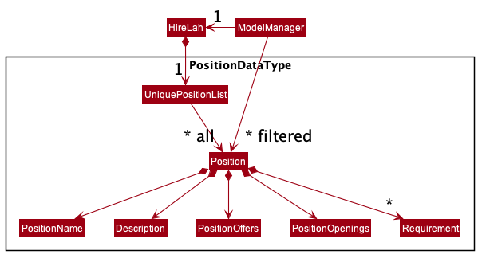
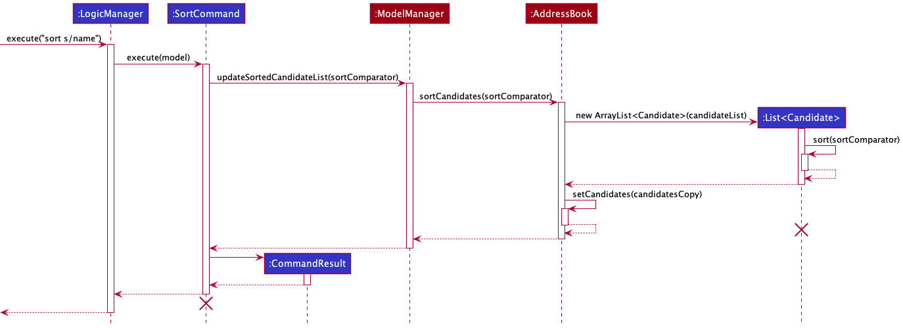
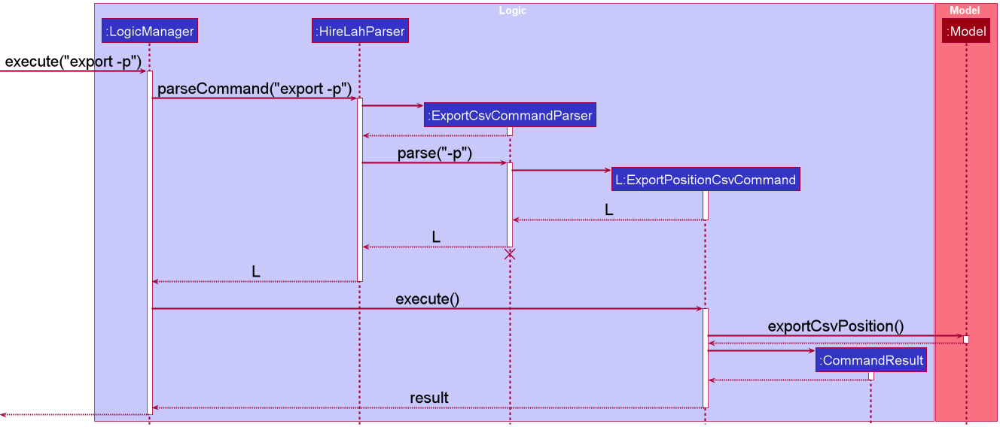

* Table of Contents
{:toc}

--------------------------------------------------------------------------------------------------------------------

## **Acknowledgements**

* {list here sources of all reused/adapted ideas, code, documentation, and third-party libraries -- include links to the original source as well}

--------------------------------------------------------------------------------------------------------------------

## **Setting up, getting started**

Refer to the guide [_Setting up and getting started_](SettingUp.md).

--------------------------------------------------------------------------------------------------------------------

## **Design**

:bulb: **Tip:** The `.puml` files used to create diagrams in this document can be found in the [diagrams](https://github.com/AY2122S2-CS2103-W17-4/tp/tree/master/docs/diagrams/) folder. Refer to the [_PlantUML Tutorial_ at se-edu/guides](https://se-education.org/guides/tutorials/plantUml.html) to learn how to create and edit diagrams.

### Architecture

The ***Architecture Diagram*** given above explains the high-level design of the App.

Given below is a quick overview of main components and how they interact with each other.

**Main components of the architecture**

**`Main`** has two classes called [`Main`](https://github.com/AY2122S2-CS2103-W17-4/tp/blob/master/src/main/java/seedu/address/Main.java) and [`MainApp`](https://github.com/AY2122S2-CS2103-W17-4/tp/blob/master/src/main/java/seedu/address/MainApp.java). It is responsible for,
* At app launch: Initializes the components in the correct sequence, and connects them up with each other.
* At shut down: Shuts down the components and invokes cleanup methods where necessary.

[**`Commons`**](#common-classes) represents a collection of classes used by multiple other components.

The rest of the App consists of four components.

* [**`UI`**](#ui-component): The UI of the App.
* [**`Logic`**](#logic-component): The command executor.
* [**`Model`**](#model-component): Holds the data of the App in memory.
* [**`Storage`**](#storage-component): Reads data from, and writes data to, the hard disk.

**How the architecture components interact with each other**

The *Sequence Diagram* below shows how the components interact with each other for the scenario where the user issues the command `delete -a 1`.

Each of the four main components (also shown in the diagram above),

* defines its *API* in an `interface` with the same name as the Component.
* implements its functionality using a concrete `{Component Name}Manager` class (which follows the corresponding API `interface` mentioned in the previous point.

For example, the `Logic` component defines its API in the `Logic.java` interface and implements its functionality using the `LogicManager.java` class which follows the `Logic` interface. Other components interact with a given component through its interface rather than the concrete class (reason: to prevent outside component's being coupled to the implementation of a component), as illustrated in the (partial) class diagram below.

The sections below give more details of each component.

### UI component

The **API** of this component is specified in [`Ui.java`](https://github.com/AY2122S2-CS2103-W17-4/tp/blob/master/src/main/java/seedu/address/ui/Ui.java)

The UI consists of a `MainWindow` that is made up of parts e.g.`CommandBox`, `ResultDisplay`, `ApplicantListPanel`, `StatusBarFooter` etc. All these, including the `MainWindow`, inherit from the abstract `UiPart` class which captures the commonalities between classes that represent parts of the visible GUI.

The `UI` component uses the JavaFx UI framework. The layout of these UI parts are defined in matching `.fxml` files that are in the `src/main/resources/view` folder. For example, the layout of the [`MainWindow`](https://github.com/AY2122S2-CS2103-W17-4/tp/blob/master/src/main/java/seedu/address/ui/MainWindow.java) is specified in [`MainWindow.fxml`](https://github.com/AY2122S2-CS2103-W17-4/tp/blob/master/src/main/resources/view/MainWindow.fxml)

Note that `ApplicantListPanel`, `PositionListPanel`, and `InterviewListPanel` will all exists simultaneously in the `UI` component, but only one will be visible to the user as controlled by tabs in `MainWindow`.

The `UI` component,

* executes user commands using the `Logic` component.
* changes the selected tab automatically according to the `DataType` in `CommandResult` from the `Logic` component.
* listens for changes to `Model` data so that the UI can be updated with the modified data.
* keeps a reference to the `Logic` component, because the `UI` relies on the `Logic` to execute commands.
* depends on some classes in the `Model` component, as it displays the `Applicant`, `Position` and `Interview` objects residing in the `Model`.

### Logic component

**API** : [`Logic.java`](https://github.com/AY2122S2-CS2103-W17-4/tp/blob/master/src/main/java/seedu/address/logic/Logic.java)

Here's a (partial) class diagram of the `Logic` component:

How the `Logic` component works:
1. When `Logic` is called upon to execute a command, it uses the `HireLahParser` class to parse the user command.
1. In the case of commands that is common to all data types (e.g. `add`, `edit`, `delete`, `list`), an intermediate parser may be used to select the specific parser for the data type.
1. This results in a `Command` object (more precisely, an object of one of its subclasses e.g., `AddApplicantCommand`) which is executed by the `LogicManager`.
1. The command can communicate with the `Model` when it is executed (e.g. to add a applicant).
1. The result of the command execution is encapsulated as a `CommandResult` object which is returned back from `Logic`.

The Sequence Diagram below illustrates the interactions within the `Logic` component for the `execute("delete -a 1")` API call.

:information_source: **Note:** The lifeline for `DeleteCommandParser` should end at the destroy marker (X) but due to a limitation of PlantUML, the lifeline reaches the end of diagram.

Here are the other classes in `Logic` (omitted from the class diagram above) that are used for parsing a user command:

How the parsing works:
* When called upon to parse a user command, the `HireLahParser` class creates an `XYZCommandParser` (`XYZ` is a placeholder for the specific command name e.g., `AddCommandParser`) which uses the other classes shown above to parse the user command and create a `XYZCommand` object (e.g., `AddCommand`) which the `HireLahParser` returns back as a `Command` object.
* All `XYZCommandParser` classes (e.g., `AddCommandParser`, `DeleteCommandParser`, ...) inherit from the `Parser` interface so that they can be treated similarly where possible e.g, during testing.

### Model component
**API** : [`Model.java`](https://github.com/AY2122S2-CS2103-W17-4/tp/blob/master/src/main/java/seedu/address/model/Model.java)

 

In the `Model`, `ModelManager` contains three different `DataType` – `Applicant`, `Position` and `Interview`, each with their own `UniqueXYZList` contained in `HireLah`. The class diagrams for each `DataType` are separated below for better clarity.

`Applicant` class diagram:

 

`Position` class diagram:

 

`Interview` class diagram:

 

Note that the `Interview` class contains `Applicant` and `Position`.

The `Model` component,

* stores all the data i.e., all `Applicant`, `Position`, and `Interview` objects (which are contained in `UniqueApplicantList`, `UniquePositionList`, and `UniqueInterviewList` objects respectively).
* stores the currently 'selected' `Applicant`, `Position`, and `Interview` objects (e.g., results after a list command with filter applied) as a separate _filtered_ list which is exposed to outsiders as unmodifiable Java's Observable List (i.e., `ObservableList<Applicant>`, `ObservableList<Position>` and `ObservableList<Interview>` for the different types) that can be 'observed' e.g. the UI can be bound to this list so that the UI automatically updates when the data in the list change.
* stores a `UserPref` object that represents the user’s preferences. This is exposed to the outside as a `ReadOnlyUserPref` objects.
* does not depend on any of the other three components (as the `Model` represents data entities of the domain, they should make sense on their own without depending on other components)

### Storage component

**API** : [`Storage.java`](https://github.com/AY2122S2-CS2103-W17-4/tp/blob/master/src/main/java/seedu/address/storage/Storage.java)

The `Storage` component,
* can save both HireLah data, which consists of `Applicants`, `Interviews` and `Positions`; and user preference data in json format, and read them back into corresponding objects.
* inherits from both `HireLahStorage` and `UserPrefsStorage`, which means it can be treated as either one (if only the functionality of only one is needed).
* depends on some classes in the `Model` component (because the `Storage` component's job is to save/retrieve objects that belong to the `Model`)

### Common classes

Classes used by multiple components are in the [`seedu.address.commons`](https://github.com/AY2122S2-CS2103-W17-4/tp/tree/master/src/main/java/seedu/address/commons) package.

--------------------------------------------------------------------------------------------------------------------

## **Implementation**

This section describes some noteworthy details on how certain features are implemented.

### Applicant feature

#### Proposed Implementation

An applicant in HireLah is represented by `Applicant`. `Applicant` is implemented by refactoring `Persons`.
Additionally, `Applicant` implements two new attributes which are represented by the following two new classes:

* `Gender` — M refers to male, and F refers to female. Only the value M or F is allowed.
* `Age` —  Numerical representation of the age of the applicant. Only values with two digits or more are allowed.

`Gender` and `Age` class highly resemble other existing attribute classes such as `Address`, `Email`, `Name`, and
`Phone`.

These classes are contained in the `applicant` package which belongs to the `model` package.

Applicant is implemented this way as for HireLah, we require new attributes such as `Gender` and `Age` to aid in the
recruitment process. the `Person` class did not contain such attributes.

Adding Gender and Age as tags using the existing functionality is not ideal as we do not want these attributes to be
optional.

A new `Applicant` class had to be created to support the functionality. It is also not ideal to keep the existing
`Person` class as it should not be instantiated by users in HireLah.

Hence it made sense to refactor `Person` to `Applicant` and to extend and build on the existing functionalities to
support the needs of HireLah.

### Position feature

#### Implementation

A position in HireLah is represented by `Position`. `Position` is implemented with the following attributes:
* `PositionName` —  refers to the name of the job opening. 
  Can allow any characters, but must have at least one alphanumeric character. Length is restricted to a maximum of 100 characters.
* `Description` —  refers to the description of the position. 
  Can allow any characters, but must have at least one alphanumeric character. Length is restricted to a maximum of 200 characters.
* `PositionOpenings` —  refers to the number of openings in the position. Can allow only numbers of 1 to 5 digits.
* `PositionOffers` —  refers to the number of outstanding offers handed out for the position. 
  Number of offers is initialized as 0 when a position is created. Number of offers cannot be directly mutated, and is only altered through commands of `pass`, `accept`, `reject`.
* `Set<Requirement>` —  refers to a set of requirements that is required for an `Applicant` to be considered for the `Position`. 
  There can be any number of requirements for the `Position`.
  
These classes are contained in the `position` package which belongs to the `model` package.

Position is implemented this way as for HireLah, as we need these informations, in order to aid recruiters
in keeping track of crucial job-related information in the hiring process.

#### Design considerations:

#### Aspect: Ensuring that number of applicants offered a job does not exceed the number of job openings
* **Alternative 1 (current choice):** `PositionOffers` is implemented in a way that disallow users from directly mutating the underlying value.
`PositionOffers` is only mutated through various commands listed under section **Tracking Interview Status**.
    * Pros: Number of `PositionOffers` is guaranteed to tally with number of "passed interviews".
    * Cons: Difficulty in implementing due to coupling with the `Interview` class. Actions that mutate `Interview` may cause changes to `PositionOffers`.
        It will also be more difficult for users to correct the erroneous commands, as they cannot directly decrement or increment `PositionOffers`.
      
* **Alternative 2** Allowing users to manually set their own number of offers.
    * Pros: Greater flexibility for users to update and keep track of the number of offers handed out.
    * Cons: Users will have to exercise their own diligence in ensuring that number of offers handed out tallies with the number
        of "passed interview".

### Tracking Interview Status

#### Implementation

Currently, there are 5 possible status for interviews which represents where an applicant is in the hiring pipeline.
* `Pending` - Interview has been created / scheduled, applicant yet to go for interview.
* `Passed - waiting for applicant` - Applicant has passed the interview. A job **offer is automatically extended** to the applicant at this stage.
* `Failed` - Applicant has failed the interview.
* `Accepted` - Applicant has accepted the job offer. Applicant job role will be updated in Applicants tab.
* `Rejected` - Applicant has rejected the job offer.

The **activity diagram** below shows the workflows between different interview status and corresponding updates to `Position`
and `Applicant` classes.

#### Design considerations:

#### Aspect: When an applicant is considered to be matched with a job:

* **Alternative 1 (current choice):** An applicant must accept a passed interview before the applicant is hired for that position.
    * Pros: A more accurate modelling of real-world hiring processes, whereby an applicant may actually be accepted for multiple roles, and has to choose one role to accept.
    * Cons: Have to track number of position offers currently given out with respect to number of open positions, 
  preventing a scenario where multiple people accept the offer but there is a shortage of actual position openings. 
  More complex model which may be bug-prone.

* **Alternative 2:** An applicant is considered to be hired after passing the interview.
    * Pros: A simplified way of matching, reduces complexity of interview and coupling between Interview and Positions.
    * Cons: Does not model real-world interview processes accurately, forces applicant to accept the first job which they pass the interview for. 

#### Aspect: Number of interviews per applicant allowed for each unique role

* **Alternative 1 (current choice):** An applicant can only schedule one interview for each unique position they apply for.
    * Pros: A simplified model that reduces complexity of when to hand out job offers, reducing bugs.
    * Cons: May not model the real-world hiring process accurately where some roles require multiple interviews.
    

* **Alternative 2:** An applicant can schedule multiple interviews for a unique position they apply for.
    * Pros: A more accurate modelling of real-world hiring processes.
    * Cons: Increased complexity of hiring process. 
      Need to keep track of different number of interviews required for every unique position and where each applicant is 
      at which stage e.g "Finished HR interview" / "Finished Online Assessment", which may result in more bugs.

### Adding of Data 

#### Implementation

Adding of different data types is currently done through `ModelManger`, which implements the methods in interface `Model`.
There are 3 levels to the parsing of the add command from user input.
1. `HireLahParser` identifies it as an `add` command.
2. `AddCommandParser` identifies the exact data type that is to be added, through the `flag` of the user input.
3. `AddXYZCommandParser` identifies the fields to be added for the specific datatype, and creates and `AddXYZCommand`.

The **sequence diagram** below shows how the parsing of `add -i` works. 
Note that the lifeline for `AddCommandParser` and `AddInterviewCommandParser` should end at the destroy marker (X) but due to
a limitation of PlantUML, the lifeline reaches the end of diagram. Logic for execution of `AddInterviewCommand` is omitted.

#### Design considerations:

#### Aspect: How to add different data types:

* **Alternative 1 (current choice):** Have a general add command.
    * Pros: User-friendly since users only have to remember a singular command.
    * Cons: Requires additional levels of parsers to be created.

* **Alternative 2:** An individual command for each data type that can be added (eg. `addappl`, `addintvw`)
    * Pros: Fewer levels of parsers is required.
    * Cons: We must ensure that the implementation of each individual command are correct. Many commands to remember for a new user.

### Deleting of Data

#### Implementation
The implementation of deleting data is similar to adding data, where deleting of different data types is done through `ModelManger`, which implements the methods in the `Model` interface.

The parsing of a delete command from user input is also done through the 3 levels system, with `HireLahParser`, `DeleteCommandParser`, and `DeleteXYZCommandParser` which eventually creates the `DeleteXYZCommand`.

However, when deleting an applicant or a position, an additional step of cascading to delete interview is required. Since every interview is associated with an applicant and a position, we cannot have an interview exist without the corresponding applicant or position.
Hence, it is important to delete the associated interview(s) when deleting an applicant or a position.

#### Design considerations:

#### Aspect: How to cascade when deleting applicant/position to delete interview:

* **Alternative 1 (current choice):** Loop through all interviews in `DeleteXYZCommand`
    * Pros: Less coupling as a data type does not store another data type as an attribute.
    * Cons: May be less efficient as we have to loop through the whole list of interviews everytime when deleting applicant/position.

* **Alternative 2:** Keep relevant list of interviews for each applicant and position.
    * Pros: More efficient when deleting since all the associated interviews are already available.
    * Cons: Increased coupling between applicant, position, and interview which make it more bug-prone.
    
### Filtering of Data

#### Implementation

The implementation of filtering data is done as an extension of the `list -X` command, which takes in optional parameters that will trigger the filtering of data to display if given. The filtering of data is done similar to the `find` command in AB3, which is now deprecated in HireLah. It applies a predicate to the `filteredXYZ` filtered lists in the `ModelManager`, which the `UI` will pick up and display the latest filtered list of the data to the user.

To support different filters for different data types, each filter is a predicate class in the `Model` component. For example, to support filtering applicants by gender, there is a [`ApplicantGenderPredicate`](https://github.com/AY2122S2-CS2103-W17-4/tp/blob/master/src/main/java/seedu/address/model/applicant/ApplicantGenderPredicate.java) in the `Model` component under `applicant`. The predicate implements Java's `Predicate<Applicant>` interface for filtered lists.

Here is the sequence diagram for a filter command: 

The *Sequence Diagram* below illustrates the interactions within the classes for the execution of `list -a f/name a/Bob` command.

#### Design considerations:

#### Aspect: Should the filter feature be a separate command by itself?

* **Alternative 1:** Implement filter as a separate `filter -X` command.
    * Pros: May be more intuitive for new users to pick up. Can also potentially make the parsing of filter-related arguments less complicated.
    * Cons: Multiple commands doing similar things because `filter` is essentially `list` with different predicates applied to the filtered lists. Listing all data is also a predicate itself. 

* **Alternative 2 (current choice):** Implement filter as part of the `list -X` command (by taking in more parameters).
    * Pros: No two commands doing the similar things, which may lead to chunks of repeated code under the two commands.
    * Cons: May be confusing for new users, need to explain it well in user guide and help window. Also, will have to parse filter-related arguments together with other arguments in `list -X` command (such as for sorting), which may cause the parsing to be more complicated.

### Sorting of Data 

#### Implementation
The implementation of sorting data is done as an extension of the `list -X` command, which takes in optional 
parameters that will trigger the sorting of data to display if given. The sorting is done by directly sorting
the data in `UniqueXYZList`, which uses `ObservableList<XYZ>` to contain the data. It applies a comparator to
`UniqueXYZList` in `HireLah`, then applies the given predicate (if none, then use show all predicate) to `filteredXYZ` 
filtered lists in `ModelManager`, which the `UI` will pick up and display the data to the user.

To support different sorting for different data types, each type of data sort is a comparator class in the Model component. 
For example, for applicants, we will sort by their name, hence, there is a ApplicantNameComparator in the Model component 
under applicant. The comparator implements Java's Comparator<Applicant> interface.

The *Sequence Diagram* below illustrates the interactions within the classes for the execution of `list -a s/asc` command.

#### Design considerations:

#### Aspect: How to sort data without affect the original dataset

* **Alternative 1 (current choice):** Sort the `UniqueXYZList` and display the data using filtered lists predicate
    * Pros: 
      * Less chance of error occurs when modify the displayed data.
      * `UI` can displayed the sorted data immediately.
      * `export -X` can export the data according to their sorting order. 
    * Cons: Decrease cohesion, as we need to depend on `HireLah`. 

* **Alternative 2:** Directly sort the `filteredXYZ` filtered lists in `ModelManager` by passing it to sorted lists.
    * Pros: Increase cohesion, as method only used attributes in `ModelManager`. 
    * Cons: 
      * Increased the complexity of the relevant code, as we need to double passing, which make it more bug-prone.
      * `UI` won't able to display the new filtered lists, and need to connect again to `UI` components.

### Exporting of Data

#### Implementation

Exporting of different data types is currently done through `ModelManger`, which implements the methods in interface `Model`.
There are 2 levels to the parsing of the add command from user input.
1. `HireLahParser` identifies it as an `export` command.
2. `ExportCsvCommandParser` identifies the exact data type that need to be exported, through the `flag` of the user input
, and returns the respective `ExportXYZCsvCommand`.

The *Sequence Diagram* below illustrates the interactions within the classes for the execution of `export -p` command.

#### Design considerations:

#### Aspect: What export format should be used:

* **Alternative 1 (current choice):** Export to CSV file
    * Pros: 
      * Versatile since CSV file can be used by non-technical user.
      * Suitable for manipulating `Applicant`, `Interview` and `Position` data.
    * Cons: Requires additional method to transform `Model` into CSV output

* **Alternative 2:** Export to individual Json file 
    * Pros: Able to reuse code as Json already implemented by `Storage`
    * Cons: Not versatile as required non-user to have knowledge about Json. 

--------------------------------------------------------------------------------------------------------------------

## **Documentation, logging, testing, configuration, dev-ops**
    
* [Documentation guide](Documentation.md)
* [Testing guide](Testing.md)
* [Logging guide](Logging.md)
* [Configuration guide](Configuration.md)
* [DevOps guide](DevOps.md)

--------------------------------------------------------------------------------------------------------------------

## **Appendix: Requirements**

### Product scope

**Target user profile**:

* Has a need to manage a significant number of applicants to technology companies
* Prefer desktop apps over other types
* Can type fast
* Prefers typing to mouse interactions
* Is reasonably comfortable using CLI apps

**Value proposition**:
* Manage contacts faster than a typical mouse/GUI driven app
* One command and the email will be sent to all recipient
* Stores all correspondence with the candidate for easy access and viewing
* End to end seamless administration for talent management

### User stories

Priorities: High (must have) - `* * *`, Medium (nice to have) - `* *`, Low (unlikely to have) - `*`

| Priority | As a …​     | I want to …​                           | So that I can…​                                                         |
| ------ |-------------|----------------------------------------|-------------------------------------------------------------------------|
| `* * *` | new user    | see usage instructions of all commands | know what are the commands available and how to use them                |
| `* * *` | recruiter   | add a new applicant                    | keep track of all the applicants                                        |
| `* * *` | recruiter   | edit an applicant                      | update the latest information of applicants                             |
| `* * *` | recruiter   | delete an applicant                    | remove entries that I no longer need                                    |
| `* * *` | recruiter   | add a new interview                    | keep track of all the interviews                                        |
| `* * *` | recruiter   | edit an interview                      | update the latest information of interviews                             |
| `* * *` | recruiter   | delete an interview                    | remove entries that I no longer need                                    |
| `* * *` | recruiter   | add a new position                     | keep track of all the applicants                                        |
| `* * *` | recruiter   | edit a position                        | update the latest information of positions                              |
| `* * *` | recruiter   | delete a position                      | remove entries that I no longer need                                    |
| `* * *` | recruiter   | view the applicants in my contact      | access their information and contact them                               |
| `* * *` | recruiter   | view the positions I am recruiting for | know what are the positions available                                   |
| `* * *` | recruiter   | view the interviews I have             | know my schedule and plan my work day                                   |
| `* *`  | recruiter   | filter the displayed data               | find the information I am looking for easily                            |
| `* *`  | recruiter   | pass an interview that was successful   | proceed to offer the applicant the position                             |
| `* *`  | recruiter   | fail an interview that was unsuccessful | proceed to end the hiring process for the applicant                     |
| `* *`  | recruiter   | mark an interview as accepted by the applicant | update that the applicant has accepted the offer                 |
| `* *`  | recruiter   | mark an interview as rejected by the applicant | update that the applicant has rejected the offer                 |
| `* *`  | recruiter   | export the data in the application      | share the information with other recruiters                             |
| `*`    | expert user | access previous commands I made         | send multiple similar commands without having to type the whole command |

### Use cases

(For all use cases below, the **System** is the `HireLah Application` and the **Actor** is the `user`, unless specified otherwise)

#### **Use case 01: Delete a applicant**

**MSS**

1.  User requests to list applicants
2.  HireLah shows a list of applicants
3.  User requests to delete a specific applicant in the list
4.  HireLah deletes the applicant

    Use case ends.

**Extensions**

* 2a. The list is empty.

  Use case ends.

* 3a. The given index is invalid.

    * 3a1. HireLah shows an error message.

      Use case resumes at step 2.

#### **Use case 02: Add an interview**

**MSS**

1. User requests to list applicants
2. HireLah shows a list of applicants
3. User request to list positions
4. HireLah shows a list of positions
5. User requests to add an interview, for a specific position to an applicant in the list
6. HireLah adds the interview to the applicant
     
    Use case ends.

**Extensions**

* 2a. The list is empty.
    
  Use case ends.
    
* 4a. The list is empty.
    
  Use case ends.
    
* 5a. The given index is invalid.

    * 5a1. HireLah shows an error message.

      Use case resumes at step 4.

#### **Use case 03: Editing position**

**MSS**
1. User requests to list positions
2. HireLah shows a list of positions
3. User chooses to edit a position based on the index from the visible list, and provide the fields to edit.
4. HireLah refreshes the list of positions to display the newly edited position.
      
    Use case ends.

**Extensions**

* 3a. The given index is not a valid index in the list.
* 3a1. HireLah informs user that the index is not valid.
    
  Use case ends.
    
* 3b. The new position name provided is the same as another position.
* 3b1. HireLah informs user that the new position name is not valid.
    
  Use case ends.

#### **Use case 04: Viewing help**

**MSS**
1. User requests to view help
2. HireLah shows a list of commands and its briefly description

Use case ends.

#### **Use case 05: Viewing detail help for a specific command**

**MSS**
1. User <u>open the list of commands and general description (UC4).</u>
2. User chooses a specific command and view its detail description.
3. HireLah displays the detail description of that command
4. User chooses to close the box.
5. HireLah closes the box.

Use case ends.

#### **Use case 06: Filtering data**

**MSS**
1. User requests to list data with filter applied.
2. HireLah refreshes the list of data to display with only data that matches the filter given.
     
   Use case ends.

**Extensions**

* 1a. No data in HireLah fits the filter given.
* 1a1. HireLah informs user that no data is found.
    
  Use case ends.
    
* 1b. The filter type given is invalid.
* 1b1. HireLah informs user that the filter type given is invalid.
    
  Use case ends.

*{More to be added}*

### Non-Functional Requirements

1. Should work on any _mainstream OS_ as long as it has Java `11` or above installed.
2. HireLah should respond within two seconds after any command is entered.
3. Should be able to hold up to 1000 applicants, positions, and interviews each without a noticeable sluggishness in performance for typical usage.
4. The data in the app should be easily transferable to another computer without losing any information.
5. A user with above average typing speed for regular English text _(i.e. not code, not system admin commands)_ should be able to accomplish most of the tasks faster using commands than using the mouse.
6. The system should be usable by a novice which has not used other CLI application for recruitment tracking.
7. A new user should be able to pick up how to use HireLah within 20 minutes of usage.
8. HireLah must boot up within 10 seconds on a device under a normal load.
9. HireLah is not required to make any direct communication with the applicants.

### Glossary

* **Mainstream OS**: Windows, Linux, Unix, OS-X
* **Recruiter**: A Human Resource professional that manages applicants, interviews and positions in the application
* **Applicant**: A candidate looking for a job.
* **Interview**: A scheduled meeting time for an Applicant to try for a Position.
* **Position**: A job opportunity for candidates.

--------------------------------------------------------------------------------------------------------------------

## **Appendix: Instructions for manual testing**

Given below are instructions to test the app manually.

:information_source: **Note:** These instructions only provide a starting point for testers to work on;
testers are expected to do more *exploratory* testing.

### Launch and shutdown

1. Initial launch

   1. Download the jar file and copy into an empty folder

   1. Double-click the jar file Expected: Shows the GUI with a set of sample data. The window size may not be optimum.

1. Saving window preferences

   1. Resize the window to an optimum size. Move the window to a different location. Close the window.

   1. Re-launch the app by double-clicking the jar file. 
       Expected: The most recent window size and location is retained.
   
### Adding Data
1. Adding an applicant to HireLah
    1. Prerequisites: Ensure that cursor is on command box. Current applicant list does not contain any other applicants with the same name, phone number, or email, stated in Test Case #1.
    2. Test case: `add -a n/Jonathan p/98564231 e/jonathan@example.com ag/23 a/73 Geylang Rd, S532948 g/M t/NUS Graduate` 
        Expected: New applicant is added to the bottom of the list. Details of the applicant shown in response box. GUI toggles to display applicant list.
    3. Test case: `add -a n/Jonathan p/91234567 e/notjonathan@example.com ag/23 a/73 Geylang Rd, S532948 g/M t/NUS Graduate` 
        Expected: No applicant is added to the applicant list. Error message informs user that the applicant already exists.
    4. Test case: `add -a n/NotJonathan p/98564231 e/notjonathan@example.com ag/23 a/73 Geylang Rd, S532948 g/M t/NUS Graduate` 
        Expected: No applicant is added to the applicant list. Error message informs user that phone number is in used by "Jonathan".
    5. Test case: `add -a n/NotJonathan p/91234567 e/jonathan@example.com ag/23 a/73 Geylang Rd, S532948 g/M t/NUS Graduate` 
        Expected: No applicant is added to the applicant list. Error message informs user that email is in used by "Jonathan".
1. Adding a position to HireLah
    1. Prerequisites: Ensure that cursor is on command box. Current position list does not contain any other positions with the same position name stated in Test Case #1.
    2. Test case: `add -p p/Junior Software Developer o/3 d/One of the highest compensation in the market. Work is remote. r/Golang r/Cloud Computing` 
        Expected: New position is added to the bottom of the list. Details of the position shown in response box. GUI toggles to display position list.
    3. Test case: `add -p p/Junior Software Developer o/5 d/Not the same description. r/C++ r/Java` 
        Expected: No position is added to the position list. Error message informs user that position already exists.
1. Adding an interview to HireLah
    1. Prerequisites: Ensure that cursor is on command box. At least one applicant and position in the application. No interview scheduled for applicant and the particular position mentioned in all test cases below.
    2. Test case: `add -i 1 p/1 d/2022-04-11 12:00` 
        Expected: New interview is added to the bottom of the list. Applicant's name, date of interview, position's name and interview status is shown in response. GUI toggles to display interview list.
    3. Test case: `add -i 1 p/1 d/2022-04-12 12:00` 
        Expected: No interview is added to the interview list. Error message informs user that applicant already has an interview scheduled for that position.
    4. Test case: `add -i 1 p/2 d/2022-04-11 12:30` 
        Expected: No interview is added to the interview list. Error message informs user that applicant has an existing scheduled interview that clashes in timing.
    
### Deleting Data

1. Deleting an applicant while all applicants are being shown

   1. Prerequisites: List all applicants using the `list -a` command. Multiple applicants in the list.

   1. Test case: `delete -a 1` 
      Expected: First applicant is deleted from the list. Details of the deleted applicant shown together with the number of deleted interview(s). Use `list -i` to verify that the interview(s) involving the deleted applicant no longer exists.

   1. Test case: `delete -a 0` 
      Expected: No applicant is deleted. Error details shown.

   1. Other incorrect delete applicant commands to try: `delete -a`, `delete -a x` (where x is larger than the list size) 
      Expected: Similar to previous.

2. Deleting an applicant while the applicant list is filtered

    1. Prerequisites: Filter the applicants using the `list -a f/name a/xxx` command (where xxx is an existing applicant name). At least one applicant in the list.

    1. Test case: `delete -a 1` 
       Expected: First applicant is deleted from the list. Details of the deleted applicant shown together with the number of deleted interview(s). Use `list -i` to verify that the interview(s) involving the deleted position no longer exists.

    1. Test case: `delete -a 0` 
       Expected: No applicant is deleted. Error details shown.

3. Deleting a position
    1. Prerequisites: List positions using the `list -p` command, may choose to apply a valid filter. Multiple positions in the list.

    2. Test case: `delete -p 2` 
       Expected: Second position is deleted from the list. Details of the deleted position shown together with the number of deleted interview(s).

    3. Test case: `delete -p 0` 
       Expected: No position is deleted. Error details shown.

    4. Other incorrect delete position commands to try: `delete -p`, `delete -p x` (where x is larger than the list size) 
       Expected: Similar to previous.
   
4. Deleting an interview
   1. Prerequisites: List interviews using the `list -i` command, may choose to apply a valid filter. Multiple interviews in the list.

   2. Test case: `delete -i 1` 
      Expected: First interview is deleted from the list. Details of the deleted interview shown.

   3. Test case: `delete -i 0` 
      Expected: No interview is deleted. Error details shown.

   4. Other incorrect delete position commands to try: `delete -i`, `delete -i x` (where x is larger than the list size) 
      Expected: Similar to previous.
   
5. Delete without any flag specified
   1. Test case: `delete` 
      Expected: No data is deleted. "No flag" error shown.
   
   2. Test case: `delete 2` 
      Expected: No data is deleted. "No flag" error shown.

### Filtering Data

1. Filtering applicants
   1. Prerequisites: List all applicants using the `list -a` command. Multiple applicants in the list.
   
   2. Test case: `list -a f/name a/xxx` where xxx is a valid name of an applicant in the list.  
      Expected: The list refreshes showing only applicants whose name matches the name given. Shows message of how many applicants are listed.
   
   3. Test case: `list -a f/name a/xxx` where xxx is not a name of any applicant in the list.  
      Expected: An empty applicant list is shown.
   
   4. Test case: `list -a f/name`  
      Expected: The applicant list does not refresh. Error message shown.

   5. Other incorrect filter applicant commands to try: `list -a f/abc a/abc`, `list -a a/John` 
      Expected: Similar to previous.

2. Filtering positions
    1. Prerequisites: List all positions using the `list -p` command. Multiple positions in the list.

    2. Test case: `list -p f/name a/xxx` where xxx is a valid name of a position in the list.  
       Expected: The list refreshes showing only positions with name that matches the name given. Shows message of how many positions are listed.

    3. Test case: `list -p f/name a/xxx` where xxx is not a name of any position in the list.  
       Expected: An empty position list is shown.

    4. Test case: `list -p f/name`  
       Expected: The position list does not refresh. Error message shown.

    5. Other incorrect filter applicant commands to try: `list -p f/abc a/abc`, `list -p a/Software` 
       Expected: Similar to previous.

3. Filtering interviews
    1. Prerequisites: List all interviews using the `list -i` command. Multiple interviews in the list.

    2. Test case: `list -i f/date a/yyyy-mm-dd` where yyyy-mm-dd is a valid date of an interview in the list.  
       Expected: The list refreshes showing only interviews with date that falls the date given. Shows message of how many interviews are listed.

    3. Test case: `list -i f/date a/yyyy-mm-dd` where yyyy-mm-dd is a date of any interview in the list.  
       Expected: An empty interview list is shown.

    4. Test case: `list -i f/date`  
       Expected: The position list does not refresh. Error message shown.

    5. Other incorrect filter interview commands to try: `list -i f/abc a/abc`, `list -i a/2022-05-05` 
       Expected: Similar to previous.

### Sorting Data
1. Sorting applicants
    1. Prerequisites: List all applicants using the `list -a` command. At least two applicants in the list.

    2. Test case: `list -a s/asc`  
       Expected: The list refreshes showing the list of all applicants sorted by their names in ascending order (if not already).

    3. Test case: `list -a s/abc`  
       Expected: An error message is shown.

2. Sorting positions
    1. Prerequisites: List all positions using the `list -p` command. At least two positions in the list.

    2. Test case: `list -p s/asc`  
       Expected: The list refreshes showing the list of all positions sorted by their names in ascending order (if not already).

    3. Test case: `list -p s/abc`  
       Expected: An error message is shown.

2. Sorting interviews
    1. Prerequisites: List all interviews using the `list -i` command. At least two interviews in the list.

    2. Test case: `list -i s/asc`  
       Expected: The list refreshes showing the list of all interviews sorted by their date in ascending order (if not already).

    3. Test case: `list -i s/abc`  
       Expected: An error message is shown.

       
### Saving data

1. Saving newly added/edited data

   1. Add/edit any data in the app (applicant / position / interview).
   2. Restart the app by exiting and opening the jar file.  
      Expected: Any changes made to the data is retained.

2. Dealing with missing data file

    1. Exit the app and delete the storage file at `/data/HireLah.json`.
    2. Re-launch the app by opening the jar file.  
       Expected: The app launches with sample data.
   
2. Dealing with corrupted data file

   1. Exit the app and open the storage file at `/data/HireLah.json`.
   2. Remove a comma `,` from the file.
   3. Re-launch the app by opening the jar file.  
      Expected: The app launches with no data. Gives warning in log.
