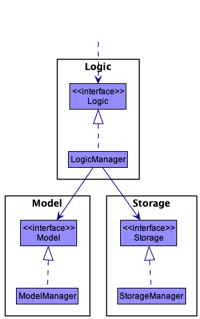
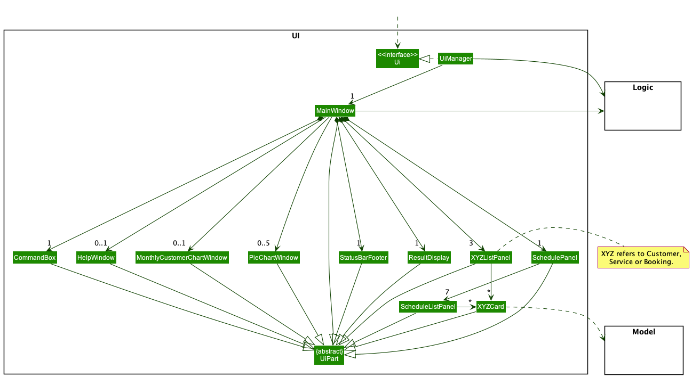
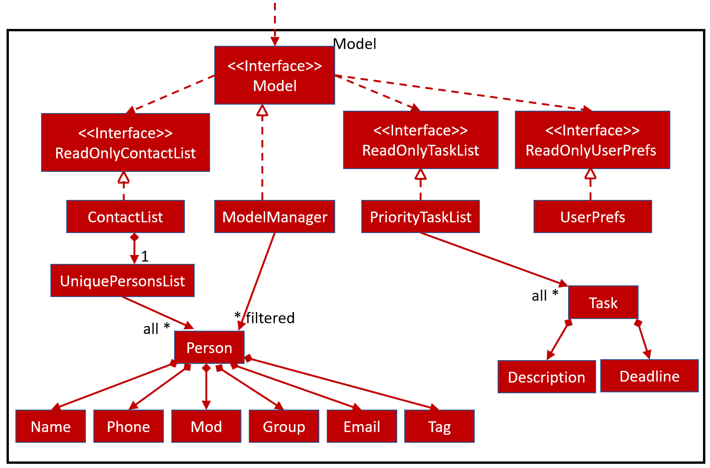
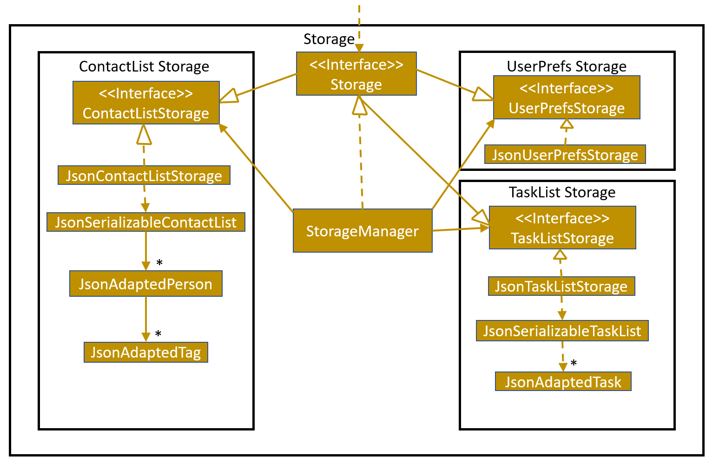
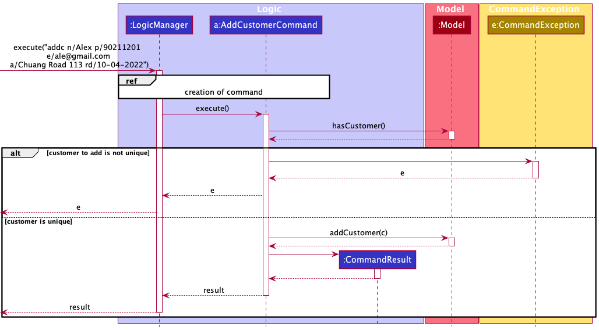
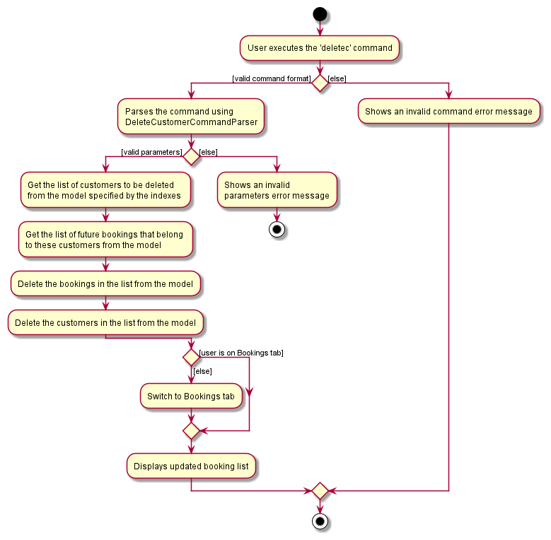
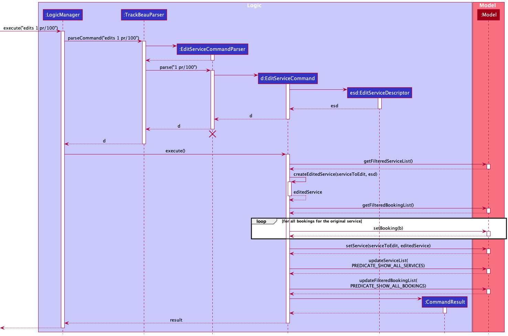
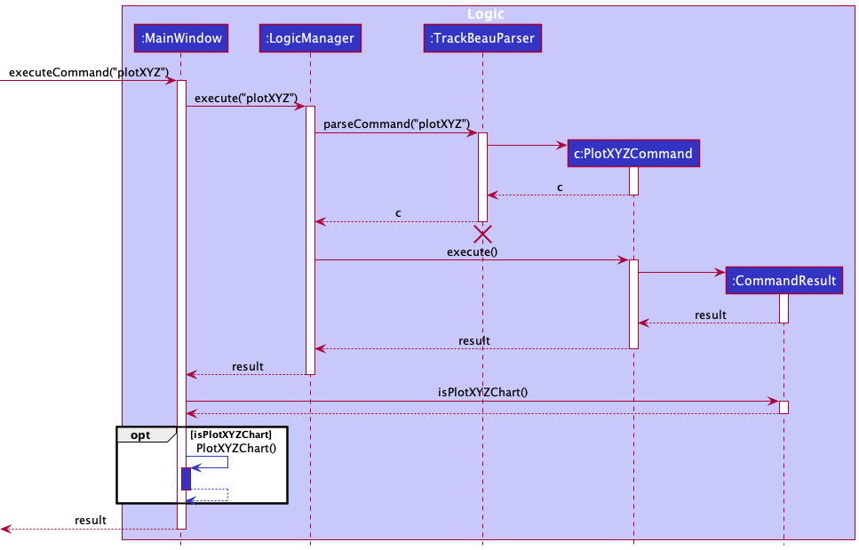
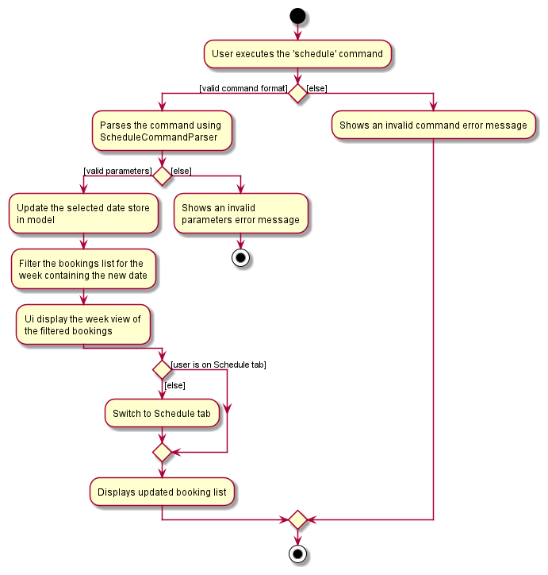
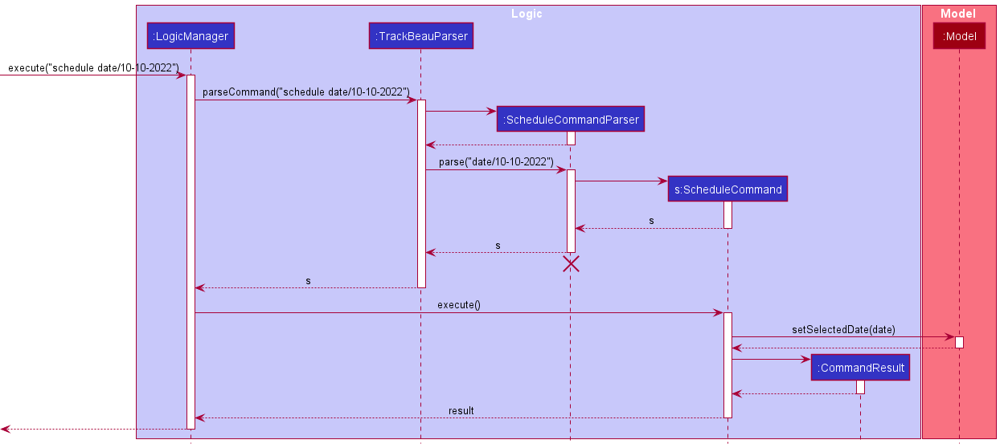

* Table of Contents
{:toc}

--------------------------------------------------------------------------------------------------------------------

## **Acknowledgements**

* Formatting of price was reused from [stackoverflow](https://stackoverflow.com/questions/2379221/how-to-format-decimals-in-a-currency-format) with minor modifications

* Plot Commands
  * [Pie Chart Code](https://docs.oracle.com/javafx/2/charts/pie-chart.htm)
  * [Bar Chart Code](https://docs.oracle.com/javafx/2/charts/line-chart.htm)
  * [Bar Chart FXML Code](https://github.com/AY2021S1-CS2103T-T09-2/CalorieGraph.fxml)

* Toggling Tabs
  * Ui for side tabs was reused from [this team's side tab](https://github.com/AY2122S1-CS2103T-F13-2/tp/blob/master/src/main/resources/view/MainWindow.fxml) with minor modifications
  * Code behind logic for determining which tabs was clicked on was reused from [stackoverflow](https://stackoverflow.com/questions/49097747/javafx-determining-which-label-has-been-clicked) with minor modifications

* User Guide
  * Section 3.2.1 was reused from [this team's about section](https://ay2122s1-cs2103t-f13-2.github.io/tp/UserGuide.html#3-about) 
  * Section 3.2.3 was adapted from [this team's about section](https://ay2122s1-cs2103t-f13-2.github.io/tp/UserGuide.html#3-about)
  * Section 3.2.4's table was reused from [this team's UG](https://ay2021s1-cs2103t-w13-3.github.io/tp/UserGuide.html) with minor modifications
    
* Developer Guide
  * Drew inspiration from the DGs of teams [1](https://ay2021s1-cs2103t-w16-3.github.io/tp/DeveloperGuide.html), [2](https://ay2021s1-cs2103t-w13-3.github.io/tp/DeveloperGuide.html) and [3](https://ay2122s1-cs2103t-f13-2.github.io/tp/DeveloperGuide.html)

--------------------------------------------------------------------------------------------------------------------

## **Setting up, getting started**

Refer to the guide [_Setting up and getting started_](SettingUp.md).

--------------------------------------------------------------------------------------------------------------------

## **Design**

:bulb: **Tip:** The `.puml` files used to create diagrams in this document can be found in the [diagrams](https://github.com/AY2122S2-CS2103-F11-3/tp/tree/master/docs/diagrams) folder. Refer to the [_PlantUML Tutorial_ at se-edu/guides](https://se-education.org/guides/tutorials/plantUml.html) to learn how to create and edit diagrams.

### Architecture

The ***Architecture Diagram*** given above explains the high-level design of the App.

Given below is a quick overview of main components and how they interact with each other.

**Main components of the architecture**

**`Main`** has two classes called [`Main`](https://github.com/AY2122S2-CS2103-F11-3/tp/tree/master/src/main/java/seedu/trackbeau/Main.java) and [`MainApp`](https://github.com/AY2122S2-CS2103-F11-3/tp/tree/master/src/main/java/seedu/trackbeau/MainApp.java). It is responsible for,
* At app launch: Initializes the components in the correct sequence, and connects them up with each other.
* At shut down: Shuts down the components and invokes cleanup methods where necessary.

[**`Commons`**](#common-classes) represents a collection of classes used by multiple other components.

The rest of the App consists of four components.

* [**`UI`**](#ui-component): The UI of the App.
* [**`Logic`**](#logic-component): The command executor.
* [**`Model`**](#model-component): Holds the data of the App in memory.
* [**`Storage`**](#storage-component): Reads data from, and writes data to, the hard disk.

**How the architecture components interact with each other**

The *Sequence Diagram* below shows how the components interact with each other for the scenario where the user issues the command `deletec 1`.

Each of the four main components (also shown in the diagram above),

* defines its *API* in an `interface` with the same name as the Component.
* implements its functionality using a concrete `{Component Name}Manager` class (which follows the corresponding API `interface` mentioned in the previous point.

For example, the `Logic` component defines its API in the `Logic.java` interface and implements its functionality using the `LogicManager.java` class which follows the `Logic` interface. Other components interact with a given component through its interface rather than the concrete class (reason: to prevent outside component's being coupled to the implementation of a component), as illustrated in the (partial) class diagram below.

The sections below give more details of each component.

### UI component

The **API** of this component is specified in [`Ui.java`](https://github.com/AY2122S2-CS2103-F11-3/tp/tree/master/src/main/java/seedu/trackbeau/ui/Ui.java)

The UI consists of a `MainWindow` that is made up of parts e.g.`CommandBox`, `ResultDisplay`, `XYZListPanel`, `StatusBarFooter` etc. All these, including the `MainWindow`, inherit from the abstract `UiPart` class which captures the commonalities between classes that represent parts of the visible GUI.

The `UI` component uses the JavaFx UI framework. The layout of these UI parts are defined in matching `.fxml` files that are in the `src/main/resources/view` folder. For example, the layout of the [`MainWindow`](https://github.com/AY2122S2-CS2103-F11-3/tp/tree/master/src/main/java/seedu/trackbeau/ui/MainWindow.java) is specified in [`MainWindow.fxml`](https://github.com/AY2122S2-CS2103-F11-3/tp/tree/master/src/main/resources/view/MainWindow.fxml)

The `UI` component,

* executes user commands using the `Logic` component.
* listens for changes to `Model` data so that the UI can be updated with the modified data.
* keeps a reference to the `Logic` component, because the `UI` relies on the `Logic` to execute commands.
* depends on some classes in the `Model` component, as it displays `Customer`, `Service`, `Booking` objects residing in the `Model`.

### Logic component

**API** : [`Logic.java`](https://github.com/AY2122S2-CS2103-F11-3/tp/tree/master/src/main/java/seedu/trackbeau/logic/Logic.java)

How the `Logic` component works:
1. When `Logic` is called upon to execute a command, it uses the `TrackBeauParser` class to parse the user command.
1. This results in a `Command` object (more precisely, an object of one of its subclasses e.g., `AddCustomerCommand`) which is executed by the `LogicManager`.
1. The command can communicate with the `Model` when it is executed (e.g., to add a customer).
1. The result of the command execution is encapsulated as a `CommandResult` object which is returned back from `Logic`.

The Sequence Diagram below illustrates the interactions within the `Logic` component for the `execute("deletec 1")` API call.

:information_source: **Note:** The lifeline for `DeleteCustomerCommandParser` should end at the destroy marker (X) but due to a limitation of PlantUML, the lifeline reaches the end of diagram.

### Model component
**API** : [`Model.java`](https://github.com/AY2122S2-CS2103-F11-3/tp/tree/master/src/main/java/seedu/trackbeau/model/Model.java)

The `Model` component,

* stores TrackBeau's data i.e., all `UniqueListItem` objects (which are contained in a `UniqueList` object).
* stores the currently 'selected' `UniqueListItem` objects (e.g., results of a search query) as a separate _filtered_ list which is exposed to outsiders as an unmodifiable `ObservableList<UniqueListItem>` that can be 'observed' e.g., the UI can be bound to this list so that the UI automatically updates when the data in the list change.
* stores a `UserPref` object that represents the user’s preferences. This is exposed to the outside as a `ReadOnlyUserPref` objects.
* does not depend on any of the other three components (as the `Model` represents data entities of the domain, they should make sense on their own without depending on other components)

The class diagram below shows more details regarding `Customer`, `Service` and `Booking` classes in the `Model` component.

### Storage component

**API** : [`Storage.java`](https://github.com/AY2122S2-CS2103-F11-3/tp/tree/master/src/main/java/seedu/trackbeau/storage/Storage.java)

The `Storage` component,
* can save both TrackBeau data and user preference data in json format, and read them back into corresponding objects.
* inherits from both `TrackBeauStorage` and `UserPrefStorage`, which means it can be treated as either one (if only the functionality of only one is needed).
* depends on some classes in the `Model` component (because the `Storage` component's job is to save/retrieve objects that belong to the `Model`)

### Common classes

Classes used by multiple components are in the `seedu.trackbeau.commons` package.

--------------------------------------------------------------------------------------------------------------------

## **Implementation**

This section describes some noteworthy details on how certain features are implemented.

### Customer Attributes

#### Add new data fields relevant to customers at beauty salons

##### Overview
- Data fields such as birthday, sign-up date, skin type, hair type, allergies, preferred staff and services are to be added.

##### Implementation
- Allergies, Staff and Services were added as tags as one customer can have multiple of these data fields
- The rest were added as attributes

##### Design Considerations

* **Alternative 1 (current choice):** Implement only allergies,staffs and services as tags
    * Pros: Harder to implement
    * Cons: Less direct to access allergies, staffs and services as compared to if a list was used

* **Alternative 2:** Implement all additional fields as tags
  itself.
    * Pros: Easy to implement
    * Cons: Could be harder to access the necessary data for other functions like creating summary statistics
    * Cons: Does not make sense to have multiple of certain data fields, e.g. multiple skin types, multiple birthdays

### Add customer feature

#### Overview
The Add Customer feature is used to add customer profiles into TrackBeau. `Name`, `Phone`, `Address`, `Email` and 
`RegistrationDate` fields are compulsory.

#### Implementation of feature
The add customer feature is implemented via `AddCustomerCommand` which is created from `AddCustomerCommandParser`.
1. `AddCustomerCommandParser` takes in the argument string and parses it into an `ArgumentMultimap` that contains all the different data fields mapped to their respective prefix.
2.  The information in the `ArgumentMultimap` is then used to create a `Customer`
3.  A `AddCustomerCommand` containing the `Customer` is returned, to be executed by `LogicManager`
4.  If the `Customer` to be added is unique and does not exist in TrackBeau, it will be added. If not, a `CommandException`
    is thrown

The following sequence diagram shows the interaction within the `Logic` and `Model` components when the user inputs `addc n/Alex p/90211201 e/ale@gmail.com a/Chuang Road 113 rd/10-04-2022` command.

### List customers feature

#### Overview
The list customers feature allows the user to view all the customers in TrackBeau.

#### Implementation of feature
The list customers feature is implemented via `ListCustomersCommand`.
1. The `ListCustomersCommand` calls `model#updateFilteredCustomerList(PREDICATE_SHOW_ALL_CUSTOMERS)`.
2. The `FilteredList<Customer>` in model will then be updated to have all the customers in TrackBeau.
3. The Ui will then be updated with the latest `FilteredList<Customer>` automatically due to the underlying data structure of the customer list (`ObservableList`).

:information_source: **Note:** 

the source of `FilteredList<Customer>` is `UniqueList`, a data structure that stores all the items of a list.
The `UniqueList` uses Java's generics and contains items that implements the `UniqueListItem` interface (the class diagrams are shown in [Model Component](#model-component)).  

#### Design considerations
* **Option 1:** Do not abstract the common functionalities.
    * Pros: Each member can being working on their own implementation of UniqueList (e.g., UniqueCustomerList, UniqueBookingList, UniqueServiceList) immediately and independently.
    * Cons: Violates Don't Repeat Yourself (DRY) principle and results in huge chunk of repeated code and functionality.
* **Option 2 (Current choice):** Abstract the common functionalities of the different types of unique list into one generic `UniqueList` class.
    * Pros: Makes use of the DRY principle which prevents duplication of codes.
    * Pros: Reduces total man-hours required to create each individual unique list.
    * Cons: Requires `UniqueList` to be implemented first before members working on the different types in TrackBeau (Customer/Booking/Service) can start implementing a unique list.

### Delete customer(s) feature

#### Overview
The delete command allows users to delete multiple customers at once for fast removal of unwanted customer profiles.

#### Implementation of feature
The delete customers feature is implemented via `DeleteCustomerCommand` which is created from `DeleteCustomerCommandParser`.
1. The `DeleteCustomerCommandParser` takes in the argument string and verify if the indexes in the string are all valid integers.
2. The indexes are then passed as a list to create a `DeleteCustomerCommand`.
3. When executing `DeleteCustomerCommand`, it will check if all indexes are within the bound of the size of customers list and there are no duplicated indexes.
4. The command will only success if all the check passes, else the execution will be aborted and an error will be thrown.

#### Design Considerations

* **Option 1:** Does not abort command when an index fail the check and delete customer from valid indexes.
  * Pros: Lenient on user error.
  * Cons: User might be confused of the intended behavior of the command where different inputs can produce the same effect.
  * Cons: Difficult to decide what errors should be allowed and not allowed.
* **Option 2 (Current choice):** Only if all indexes pass the check, then command with be executed.
  * Pros: Straightforward to implement.
  * Pros: It is clear about how the command is intended to be used.
  * Cons: Minor error in the input will cause the whole command to be aborted.

The following activity diagram summarizes what happens when the user executes the delete customer command (`deletec`):

### Find customers feature

#### Overview

#### Implementation of feature

#### Design considerations

### Add service feature

#### Overview
The add service feature allows users to add services into TrackBeau.
Each new service must have the data fields `ServiceName`, `Price` and `Duration`.

#### Implementation of feature
The add service feature is implemented via `AddServiceCommand` which is created from `AddServiceCommandParser`.
1. `AddServiceCommandParser` takes in the argument string and parses it into an `ArgumentMultimap` that contains all the different data fields mapped to their respective prefix.
2. The mapped data fields (stored as string) are then parsed to create it with the actual data type it should be.
3. The parser then use the data fields to create a `Service` object which is then used to create `AddServiceCommand` object.

The following activity diagram summarizes what happens when the user executes the add service command (`adds`):

### Edit service feature

#### Overview
The edit service feature allows users to edit existing services in TrackBeau.
For each edit, at least one of the data fields `ServiceName`, `Price` and `Duration` must be modified.

#### Implementation of feature
The edit service feature is implemented via `EditServiceCommand` which is created from `EditServiceCommandParser`.
1. `EditServiceCommandParser` takes in the argument string and parses it into an `ArgumentMultimap` that contains all the different data fields mapped to their respective prefix.
2. The index of the service to be edited is parsed into `Index` which is used to locate the service to be modified during the execution of the command.
3. The mapped data fields (stored as string) are then parsed to create it with the actual data type it should be.
4. The parser then use the data fields to create an `EditServiceDescriptor` that describes all the edited data fields.
5. The parser then creates a `EditServiceCommand` object using the `Index` and `EditServiceDescriptor`.

The following activity diagram summarizes what happens when the user executes the edit service command (`edits`):

The following sequence diagram shows the interactions within the `Logic` and `Model` components when the user inputs `edits 1 pr/100` command.

### Plot feature

#### Overview
The plot command allows users to view customer information easily. They can plot charts about customer's allergies, 
preferred staffs, suggested services, hair type, skin type and monthly customers gained.

#### Implementation of feature
The plot feature is implemented using the various plot commands such as `plotStaffChartCommand`.
1. `MainWindow` takes in the argument string and uses `LogicManager` to parses it into `Command`.
2. `LogicManager` then executes the `Command` to obtain a `CommandResult`
3. `MainWindow` checks if the `CommandResult` should result in a chart being plotted using isPlotXYZChart() where XYZ 
   refers to a chart type, like isPlotStaffChart()
4. `MainWindow` then updates the data in the chart and shows the chart window.

The following sequence diagram summarizes what happens when the user executes the plot command (`plot`):

### Schedule view feature

#### Overview
The schedule command allows users to view a selected week's bookings. 
They will be displayed in columns organised from Monday to Sunday, company by their corresponding date.

#### Implementation of feature
The schedule feature provides three commands to navigate to different week, `ScheduleCommand`, `ScheduleNextCommand` and `SchedulePreviousCommand`.
1. The schedule panel will display the week that contains the selected date, by default the selected date is set to the date everytime user starts up the application.
2. The selected date is store inside the `ModelManager`, and the schedule commands will manipulate this date.
3. `ScheduleCommand` sets the selected date to be the same as use input. 
4. `ScheduleNextCommand` adds 7 days to the selected date, while `SchedulePreviousCommand` minus 7 days.
5. The `SchedulePanel` will use the date stored in `Model` and find the Monday date if the date is not on Monday. 
6. Using the date, `SchedulePanel` will filter the list of bookings sequential from Monday to Sunday and display the desired week's schedule.

#### Design considerations
* **Option 1:** Filter the bookings of Monday to Sunday in parallel using Java threads.
    * Pros: Better performance specially when the number of bookings becomes huge.
    * Cons: Need some form of synchronization so that Monday to Sunday list in display in correct order.
* **Option 2 (Current choice):** Filter the bookings' day by day in a sequential order.
    * Pros: Straightforward to implement.
    * Cons: When booking data grow large, it might take longer to load the view.

The following activity diagram summarizes what happens when the user executes the schedule command (`schedule`):

The following sequence diagram shows the interactions within the `Logic` and `Model` components when the user inputs `schedule date/10-10-2022` command.

 
--------------------------------------------------------------------------------------------------------------------

## **Documentation, logging, testing, configuration, dev-ops**

* [Documentation guide](Documentation.md)
* [Testing guide](Testing.md)
* [Logging guide](Logging.md)
* [Configuration guide](Configuration.md)
* [DevOps guide](DevOps.md)

--------------------------------------------------------------------------------------------------------------------

## **Appendix: Requirements**

### Product scope

**Target user profile**:
* works in beauty salon
* has a need to manage a significant number of customer profiles
* prefer desktop apps over other types
* can type fast
* prefers typing to mouse interactions
* is reasonably comfortable using CLI apps

**Value proposition**:
With many customers, it is hard for beauty salons to provide personalized customer service.
Our product allows the user to keep track of customer information to better understand their customer demographics.
This allows them to provide targeted services for customers as they return.
It can also keep track of performance metrics, like total new customers.

### User stories

Priorities: High (must have) - `* * *`, Medium (nice to have) - `* *`, Low (unlikely to have) - `*`

| Priority | As a …​           | I want to …​                                                                             | So that I can…​                                                                                           |
|----------|-------------------|------------------------------------------------------------------------------------------|-----------------------------------------------------------------------------------------------------------|
| `* * *`  | new user          | view the user guide easily                                                               | know what kind of commands that I can use and their format for usage                                      |
| `* * *`  | new user          | see where to key in information easily                                                   | be clear of how to use the application                                                                    |
| `* * *`  | new user          | see the format to follow for commands when I type incorrect command                      | rectify the incorrect command                                                                             |
| `* * *`  | new user          | add name of customer                                                                     | identify the customer correctly                                                                           |
| `* * *`  | new user          | add contact details of customer                                                          | contact them for their appointment or for follow up                                                       |
| `* * *`  | new user          | view a customer profile                                                                  | access their information when needed                                                                      |
| `* * *`  | new user          | edit a customer                                                                          | update their details when needed                                                                          |
| `* * *`  | new user          | find a customer                                                                          | locate a customer's profile faster                                                                        |
| `* * *`  | new user          | delete a customer                                                                        | remove a customer that does not visit our salon anymore                                                   |
| `* * *`  | new user          | add allergy information of customer                                                      | avoid using or promoting products that the customer is allergic to                                        |
| `* * *`  | new user          | add hair type of customer                                                                | choose the correct products when treating their hair                                                      |
| `* * *`  | new user          | add skin type of customer                                                                | choose the appropriate products when treating their skin                                                  |
| `* * *`  | new user          | view a list of customer profile associated with a keyword                                | filter the list of customers to only those I am interested in                                             |
| `* * *`  | intermediate user | add a new service                                                                        | keep track of the services that our salon provides                                                        |
| `* * *`  | intermediate user | edit a service                                                                           | update the details of the service                                                                         |
| `* * *`  | intermediate user | delete a service                                                                         | remove service that is not offered anymore                                                                |
| `* * *`  | intermediate user | view all services                                                                        | see all the services and their details that our salon provides                                            |
| `* * *`  | expert user       | add a customer booking                                                                   | keep track of the customer's upcoming appointments and make preparations                                  |
| `* * *`  | expert user       | view all the bookings                                                                    | better allocate my manpower as I can know when the salon is the busiest                                   |
| `* * *`  | expert user       | delete a customer booking                                                                | remove the booking if there is any cancellation                                                           |
| `* * *`  | expert user       | edit a customer booking                                                                  | update the details of the booking                                                                         |
| `* * *`  | expert user       | have an organised view of a week's schedule                                              | better manage new bookings and prepare manpower ahead                                                     |
| `* *`    | new user          | add customer preference for staff                                                        | appoint the staff they prefer during their appointment                                                    |
| `* *`    | new user          | add services that customer prefers                                                       | better pitch new products and personalise their experience at the salon                                   |
| `* *`    | intermediate user | add the birth date of a customer                                                         | know when is the birthday of the customer                                                                 |
| `* *`    | intermediate user | add the signup date of a customer                                                        | track the customers gained per month                                                                      |
| `* *`    | intermediate user | view the customers that are having their birthday today                                  | be reminded to sent them birthday wishes                                                                  |
| `* *`    | expert user       | add the feedback of the customer after been serviced for a booking                       | know how satisfied the customer is and know the areas of improvement if any                               |
| `* *`    | expert user       | see statistics of how many new customers gained by month                                 | review and improve my company's performance                                                               |
| `* *`    | expert user       | get summary statistics on customer profiles (preferred services)                         | review and improve the choice of services and products                                                     |
| `* *`    | expert user       | get summary statistics on customer profile (preferred staffs)                            | identify the best staff(s) and let the team learn from them                                                  |
| `*`      | new user          | add personal details of staff like birth date, contact number, part time/full timer, etc | know my staffs better                                                                                     |
| `* `     | new user          | add name of staff                                                                        | keep track of the personal details of my staffs                                                           |
| `*`      | intermediate user | check if facilities are available based on bookings of the day                           | know if the facility is available for booking                                                             |
| `*`      | expert user       | keep track of expected earnings of the salon by month                                    | review and improve my company's performance                                                               |
| `*`      | expert user       | sort customers based on membership tier                                                  | promote certain facilities or products to the customer to help raise the membership tier of that customer |

### Use cases

(For all use cases below, the **System** is`TrackBeau` and the **Actor** is the `user`, unless specified otherwise)

#### Use case: UC01 - View help

**MSS:**

1.  User requests for help.
2.  TrackBeau opens a new window that contains a link to the online user guide.
    
    Use case ends.

#### Use case: UC02 - List customers

**MSS:**

1.  User requests to list the customers.
2.  TrackBeau shows a list of customers.

    Use case ends.

**Extensions:**

* *a. At any time, User requests to [view help UC01](#use-case-uc01---view-help)

#### Use case: UC03 - Add a customer

**MSS:**

1.  User requests to add a customer using specified input format.
2.  TrackBeau adds the customer to the list.

    Use case ends.

**Extensions:**

* 1a. The input format is wrong.
    * 1a1. TrackBeau shows an error message.

      Use case resumes at step 1.

* 1b. The given parameters is invalid.
    * 1b1. TrackBeau shows an error message.

      Use case resumes at step 1.

* 1c. A customer with the same phone number or email already exists.
    * 1c1. TrackBeau shows an error message.

      Use case resumes at step 1.

* *a. At any time, User requests to [view help UC01](#use-case-uc01---view-help)

#### Use case: UC04 - Edit a customer

**MSS:**

1.  User requests to [list customers UC03](#use-case-uc03---list-customers)
2.  User requests to edit a specific customer's information in the list based on the index and the input format.
3.  TrackBeau edits the details of the customer.
4.  TrackBeau shows the updated list of customers.

    Use case ends.

**Extensions:**

* 2a. The input format is wrong.
    * 2a1. TrackBeau shows an error message.

      Use case resumes at step 2.

* 2b. The given parameters is invalid.
    * 2b1. TrackBeau shows an error message.

      Use case resumes at step 2.

* 2c. The edited customer's phone number or email already exists.
    * 2c1. TrackBeau shows an error message.

      Use case resumes at step 2.

* 2d. The customer's details did not change.
    * 2d1. TrackBeau shows an error message.

      Use case resumes at step 2.

#### Use case: UC05 - Find customers

**MSS:**

1.  User requests to find customers by using keywords.
2.  TrackBeau shows a list of customers with matching keywords.

    Use case ends.

* 1a. The input format is wrong.
    * 1a1. TrackBeau shows an error message.

      Use case resumes at step 2.

* 1b. The given parameters is invalid.
    * 1b1. TrackBeau shows an error message.

      Use case resumes at step 2.

* 1c. The list is empty.

  Use case ends.

* *a. At any time, User requests to [view help UC01](#use-case-uc01---view-help)

#### Use case: UC06 - Delete a customer

**MSS**

1.  User requests to [list customers UC03](#use-case-uc03---list-customers)
2.  User requests to delete a specific customer based on the customer index and the input format.
3.  TrackBeau deletes the future bookings of the specified customer.
4.  TrackBeau deletes the specified customer.

**Extensions**

* 2a. The input format is wrong.
    * 2a1. TrackBeau shows an error message.

      Use case resumes at step 2.

* 2b. The given parameters is invalid.
    * 2b1. TrackBeau shows an error message.

      Use case resumes at step 2.

#### Use case: UC07 - List services

**MSS:**

1.  User requests to list the services.
2.  TrackBeau shows a list of services.

    Use case ends.

**Extensions:**

* *a. At any time, User requests to [view help UC01](#use-case-uc01---view-help)

#### Use case: UC08 - Add a service

**MSS:**

1.  User requests to add a service using specified input format.
2.  TrackBeau adds the service to the list.

    Use case ends.

**Extensions:**

* 1a. The input format is wrong.
    * 1a1. TrackBeau shows an error message.

      Use case resumes at step 1.

* 1b. The given parameters is invalid.
    * 1b1. TrackBeau shows an error message.

      Use case resumes at step 1.

* 1c. A service with the same name already exists.
    * 1c1. TrackBeau shows an error message.

      Use case resumes at step 1.

* *a. At any time, User requests to [view help UC01](#use-case-uc01---view-help)

#### Use case: UC09 - Edit a service

**MSS:**

1.  User requests to [list services UC07](#use-case-uc07---list-services)
2.  User requests to edit a specific service's information in the list based on the index and the input format.
3.  TrackBeau edits the details of the service.
4.  TrackBeau shows the updated list of services.

    Use case ends.

**Extensions:**

* 2a. The input format is wrong.
    * 2a1. TrackBeau shows an error message.

      Use case resumes at step 2.

* 2b. The given parameters is invalid.
    * 2b1. TrackBeau shows an error message.

      Use case resumes at step 2.

* 2c. The edited service's name already exists.
    * 2c1. TrackBeau shows an error message.

      Use case resumes at step 2.

* 2d. The service's details did not change.
    * 2d1. TrackBeau shows an error message.

      Use case resumes at step 2.

* *a. At any time, User requests to [view help UC01](#use-case-uc01---view-help)

#### Use case: UC10 - Find services

**MSS:**

1.  User requests to find services by using keywords.
2.  TrackBeau shows a list of services with matching keywords.

    Use case ends.

**Extensions:**

* 1a. The input format is wrong.
    * 1a1. TrackBeau shows an error message.

      Use case resumes at step 2.

* 1b. The given parameters is invalid.
    * 1b1. TrackBeau shows an error message.

      Use case resumes at step 2.

* 1c. The list is empty.

* *a. At any time, User requests to [view help UC01](#use-case-uc01---view-help)

#### Use case: UC11 - Delete a service

**MSS**

1.  User requests to [list services UC07](#use-case-uc07---list-services)
2.  User requests to delete a specific service based on the service index and the input format.
3.  TrackBeau deletes the future bookings for the specified service.
4.  TrackBeau deletes the specified service.

**Extensions**

* 2a. The input format is wrong.
    * 2a1. TrackBeau shows an error message.

      Use case resumes at step 2.

* 2b. The given parameters is invalid.
    * 2b1. TrackBeau shows an error message.

      Use case resumes at step 2.

* *a. At any time, User requests to [view help UC01](#use-case-uc01---view-help)

#### Use case: UC12 - List bookings

**MSS:**

1.  User requests to list the bookings.
2.  TrackBeau shows a list of bookings.

    Use case ends.

**Extensions:**

* *a. At any time, User requests to [view help UC01](#use-case-uc01---view-help)

#### Use case: UC13 - Add a booking

**MSS:**

1.  User requests to [list customers UC03](#use-case-uc03---list-customers)
2.  User requests to [list services UC07](#use-case-uc07---list-services)
3.  User requests to add a booking of a specific customer at a specific time for a specific service based on the customer and service index respectively and the input format.
4.  TrackBeau adds the booking to the booking list.

    Use case ends.

**Extensions:**
* 3a. The input format is wrong.
    * 3a1. TrackBeau shows an error message.

      Use case resumes at step 3.

* 3b. The given parameters is invalid.
    * 3b1. TrackBeau shows an error message.

      Use case resumes at step 3.

* *a. At any time, User requests to [view help UC01](#use-case-uc01---view-help)

#### Use case: UC14 - Edit a booking

**MSS:**

1.  User requests to [list bookings UC11](#use-case-uc11---list-bookings)
2.  User requests to edit a specific booking's information in the list based on the index and the input format.
3.  TrackBeau edits the details of the booking.
4.  TrackBeau shows the updated list of bookings.

    Use case ends.

**Extensions:**

* 2a. The input format is wrong.
    * 2a1. TrackBeau shows an error message.

      Use case resumes at step 2.

* 2b. The given parameters is invalid.
    * 2b1. TrackBeau shows an error message.

      Use case resumes at step 2.

* 2c. The booking's details did not change.
    * 2c1. TrackBeau shows an error message.

      Use case resumes at step 2.

* *a. At any time, User requests to [view help UC01](#use-case-uc01---view-help)

#### Use case: UC15 - Find bookings

**MSS:**

1.  User requests to find bookings by using keywords.
2.  TrackBeau shows a list of bookings with matching keywords.

    Use case ends.

**Extensions:**

* 1a. The input format is wrong.
    * 1a1. TrackBeau shows an error message.

      Use case resumes at step 2.

* 1b. The given parameters is invalid.
    * 1b1. TrackBeau shows an error message.

      Use case resumes at step 2.

* 1c. The list is empty.

* *a. At any time, User requests to [view help UC01](#use-case-uc01---view-help)

#### Use case: UC16 - Delete a booking

**MSS**

1.  User requests to [list bookings UC11](#use-case-uc11---list-bookings)
2.  User requests to delete a booking of a customer based on the booking index and the input format.
3.  TrackBeau deletes the booking at the specified index.

**Extensions**

* 2a. The input format is wrong.
    * 2a1. TrackBeau shows an error message.

      Use case resumes at step 2.

* 2b. The given parameters is invalid.
    * 2b1. TrackBeau shows an error message.

      Use case resumes at step 2.

* *a. At any time, User requests to [view help UC01](#use-case-uc01---view-help)

#### Use case: UC17 - Plot a chart

**MSS:**

1.  User requests to plot a chart using specified command.
2.  TrackBeau shows the chart window as a pop-up.

    Use case ends.

**Extensions:**

* 1a. The input format is wrong.
    * 1a1. TrackBeau shows an error message.
      
      Use case resumes at step 1.

* *a. At any time, User requests to [view help UC01](#use-case-uc01---view-help)

#### Use case: UC18 - Display a selected week's schedule

**MSS:**

1. User request to view the desired week by specifying a date within that week.
2. TrackBeau filters the booking data.
3. TrackBeau displays the bookings of the desired week.

    Use case ends.

**Extensions:**

* 3a. The user is not on schedule panel.
    * 3a1. TrackBeau switch from current panel to schedule panel.

      Use case resumes at step 3.

* *a. At any time, User requests to [view help UC01](#use-case-uc01---view-help)

#### Use case: UC19 - Exit the application

**MSS:**
1.  User requests to exit the application.
2.  TrackBeau closes the application.

    Use case ends.

### Non-Functional Requirements

1.  Should work on any _mainstream OS_ as long as it has Java `11` or above installed.
2.  Should be able to hold up to 1000 customers without a noticeable sluggishness in performance for typical usage.
3.  A user with above average typing speed for regular English text (i.e. not code, not system admin commands) should be able to accomplish most of the tasks faster using commands than using the mouse.
4.  Features should be relatively easy to test for both manual and automated testing.
5.  The product should be for a single user i.e. (not a multi-user product).
6.  The data should be stored locally and should be in a human editable text file.
7.  Does not use a DBMS to store data.
8.  The software should work without requiring an installer.
9.  The file sizes of the deliverables should be reasonable and not exceed the limits given below:
    -   Product (i.e., the JAR/ZIP file)): 100MB
    -   Documents (i.e., PDF files): 15MB/file
10. The GUI should work well (i.e., should not cause any resolution-related inconveniences to the user) for,
    -   standard screen resolutions 1920x1080 and higher, and,
    -   for screen scales 100% and 125%.
11. The GUI should be usable (i.e., all functions can be used even if the user experience is not optimal) for,
    -   resolutions 1280x720 and higher, and
    -   for screen scales 150%.

### Glossary

* **Mainstream OS**: Windows, Linux, Unix, OS-X

--------------------------------------------------------------------------------------------------------------------

## **Appendix: Instructions for manual testing**

Given below are instructions to test the app manually.

:information_source: **Note:** These instructions only provide a starting point for testers to work on;
testers are expected to do more *exploratory* testing.

### Launch and shutdown

1. Initial launch

   1. Download the jar file and copy into an empty folder

   1. Double-click the jar file  
      Expected: Shows the GUI with a set of sample contacts. The window size may not be optimum.

1. Saving window preferences

   1. Resize the window to an optimum size. Move the window to a different location. Close the window.

   1. Re-launch the app by double-clicking the jar file. 
       Expected: The most recent window size and location is retained.
      
### Customer-Related Commands

#### Adding a customer 

   1.  Test case: Any command with either n/, a/, p/, e/ or rd/ missing : for example, `addc n/John Doe p/98765432 a/John street, block 123, #01-01` 
      Expected: Error details shown in the status message about invalid command format. Status bar remains the same. 
  
   2.  Test case: Any command with invalid format for one of the keywords : for example, `addc n/John Doe p/98765432 a/John street, block 123, #01-01 e/johnd@example.com rd/<DATE THAT IS IN THE FUTURE>`  
     Expected: Error details shown in the status message about invalid date format. Status bar remains the same.
     
   3.  Test case: Adding a customer with the same email or phone number as another customer: add a customer using `addc n/John Doe p/98765432 a/John street, block 123, #01-01 e/johnd@example.com rd/10-04-2022` then `addc n/John Doe p/98765432 a/John street, block 123, #01-01 e/johndoe@example.com rd/10-04-2022` and `addc n/John Doe p/98765431 a/John street, block 123, #01-01 e/johnd@example.com rd/10-04-2022` 
     Expected: Error message saying customer already exist

#### Editing a customer 
      
  1.  Test case: `editc 2 n/Betsy Crower  p/91234567 e/johndoe@example.com` 
      Expected: Customer already exist error as this customer has the same phone and email as first customer after executing test case 1.
      
  1.  Test case: `editc 1` 
      Expected: Return an error that at least one field must be provided.
  

#### Finding customer(s)

NOTE: Make sure to use `listc` between test cases.

  1. Test case: `findc h/Oily h/Dry` 
     Expected: list of customers with hair type as dry only.

  1. Test case: `findc n/John h/Dry` 
     Expected: list of customers who either have dry hair type or are named John.
      
  1. Test case: `findc e/` 
     Expected: Error message saying that find command does not take empty values.

#### Deleting customer(s) 

   1. Test case: `deletec -1` 
      Expected: Error message saying that the command format is invalid.
     
   1. Test case: `deletec 30` 
      Expected: Error message saying that the index is invalid.
      
   1. Test case: `deletec 1,2` 
      Expected: Delete first and second customer.

#### Listing customers

   1. Test case: `listc`
      Expected: Shows all customers.
     
### Service-Related Commands

#### Adding a service

  1. Test case: Any command with either n/ or pr/ or d/ missing, example  `adds n/Acne Facial Treatment pr/138` 
     Expected: Invalid command format error message.
      
  1. Test case: Any command with wrong format for one of the fields like `adds n/Acne Facial Treatment pr/138.123 d/15` 
     Expected: Error message based on field that is wrong. 
     Service Name: Names should only contain alphanumeric characters, hyphens and spaces, and it should not be blank 
     Price: Price should only contain numbers, at most 2 decimal places and have a value that is greater than 0. 
     Duration: Duration should only contain numbers and have a value that is greater than 0. 

  1. Test case: `adds n/Acne Facial Treatment pr/138 d/120` and `adds n/Acne Facial Treatment pr/120 d/60` 
     Expected: Service is already in TrackBeau error.
      
#### Editing a service

  1. Test case: `addb c/1 sev/1 st/10-10-2022 10:30` then `edits 1 n/Dark Eye Circle Treatment d/30` 
     Expected:Edits the name and duration of the 1st service to be Dark Eye Circle Treatment and 60 respectively. The booking details would also have changed accordingly.
 
  1. Test case: `edits -1 n/Dark Eye Circle Treatment d/30` 
     Expected:Invalid command format error
     
  1. Test case: `edits 50 n/Dark Eye Circle Treatment d/30` 
     Expected: Invalid index error 
     
#### Finding services
 
 NOTE: Make sure to use `lists` between the tests
 
  1. Test case: `finds n/Facial dr/120` 
     Expected:  Returns services that contain the word 'Facial'. The list will not return services with name containing 'Facial' and duration of 120 minutes.
     
#### Deleting service(s)
 
   1. Test case: `deletes -1` 
     Expected:  Invalid command error message.
  
  1. Test case: `deletes 100,1` 
     Expected: Invalid index message.

### Booking Commands

#### Adding a booking 

  1. Test case: Any of the fields are missing, example: `addb c/1 sev/1` 
     Expected: Invalid command format message.
     
  1. Test case: Any of the fields have invalid format, example: `addb c/1 sev/1 st/10-10-2022 10:333` 
     Expected:  Invalid format error message for the field that had a mistake.

#### Editing a booking 
  
  1. Test case: `editb 1 sev/3 f/Excellent Customer Service ` then `edits 1 n/Dark Eye Circle Treatment d/30` 
     Expected:Edits the 1st booking's service to the service at Index 2 and edit its feedback to Excellent Customer Service.
 
  1. Test case: `editb -1 sev/1 f/Excellent Customer Service` or  `editb 100 sev/1 f/Excellent Customer Service` 
     Expected:Invalid index error
     
  1. Test case: Invalid format for one of the parameters, example: `editb 2 st/29-02-2001 10:30`  
     Expected:Invalid format error based on the parameter
    
#### Finding bookings

NOTE: Make sure to use `listb` between the test cases.

  1. Test case: `findb f/bad st/10-04-2022`  
     Expected:Returns feedback saying "Bad service" and "Service was bad", as well as bookings on the date 10-04-2022.
 
#### Deleting booking(s)

   1. Test case: `deleteb 1,2,3` 
     Expected:Removes the 1st, 2nd and 3rd booking from the application.
 
   1. Test case: `deleteb -1` or `deleteb 100` 
     Expected: Invalid format or invalid index error message.
     
     
### Statistics Commands

   1. Test case: `plotAll` 
     Expected:Plots 6 charts.
    
   1. Test case: `addc n/Betsy Crow e/betsycrow@example.com a/Newgate Prison p/1234568 rd/10-04-2022 al/Test sep/Test sep/Test stp/Test h/Test s/Test` then `plotAll`  
     Expected:Plots 6 charts with updated information. Accuracy can be checked by comparing charts before and after the new customer is added.
