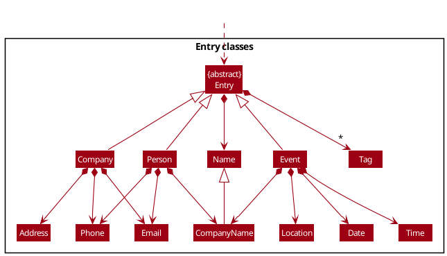
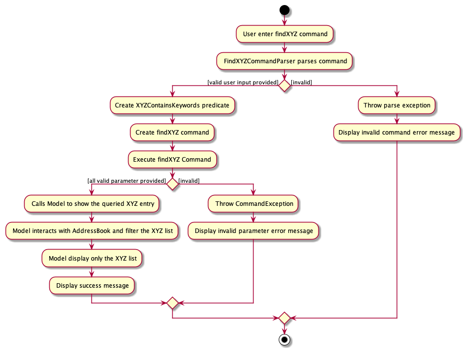

* Table of Contents
{:toc}

--------------------------------------------------------------------------------------------------------------------

## **Acknowledgements**

* InternBuddy is a brown-field project which is forked from [Address Book 3](https://github.com/nus-cs2103-AY2122S2/tp), a software development project (around 6 KLoC) which provide a baseline for InternBuddy.
* Libraries used: [JavaFX](https://openjfx.io/), [Jackson](https://github.com/FasterXML/jackson), [JUnit5](https://github.com/junit-team/junit5)

--------------------------------------------------------------------------------------------------------------------

## **Setting up, getting started**

Refer to the guide [_Setting up and getting started_](SettingUp.md).

--------------------------------------------------------------------------------------------------------------------

## **Design**

:bulb: **Tip:** The `.puml` files used to create diagrams in this document can be found in the [diagrams](https://github.com/AY2122S2-CS2103T-W14-3/tp/tree/master/docs/diagrams/) folder. Refer to the [_PlantUML Tutorial_ at se-edu/guides](https://se-education.org/guides/tutorials/plantUml.html) to learn how to create and edit diagrams.

### Architecture

The ***Architecture Diagram*** given above explains the high-level design of the App.

Given below is a quick overview of main components and how they interact with each other.

**Main components of the architecture**

**`Main`** has two classes called [`Main`](https://github.com/AY2122S2-CS2103T-W14-3/tp/tree/master/src/main/java/seedu/address/Main.java) and [`MainApp`](https://github.com/se-edu/addressbook-level3/tree/master/src/main/java/seedu/address/MainApp.java). It is responsible for,
* At app launch: Initializes the components in the correct sequence, and connects them up with each other.
* At shut down: Shuts down the components and invokes cleanup methods where necessary.

[**`Commons`**](#common-classes) represents a collection of classes used by multiple other components.

The rest of the App consists of four components.

* [**`UI`**](#ui-component): The UI of the App.
* [**`Logic`**](#logic-component): The command executor.
* [**`Model`**](#model-component): Holds the data of the App in memory.
* [**`Storage`**](#storage-component): Reads data from, and writes data to, the hard disk.

**How the architecture components interact with each other**

The *Sequence Diagram* below shows how the components interact with each other for the scenario where the user issues the command `delete 1`.

Each of the four main components (also shown in the diagram above),

* defines its *API* in an `interface` with the same name as the Component.
* implements its functionality using a concrete `{Component Name}Manager` class (which follows the corresponding API `interface` mentioned in the previous point.

For example, the `Logic` component defines its API in the `Logic.java` interface and implements its functionality using
the `LogicManager.java` class which follows the `Logic` interface. Other components interact with a given component 
through its interface rather than the concrete class (reason: to prevent outside components being coupled to the 
implementation of a component), as illustrated in the (partial) class diagram below.

The sections below give more details of each component.

### UI component

The **API** of this component is specified in [`Ui.java`](https://github.com/AY2122S2-CS2103T-W14-3/tp/tree/master/src/main/java/seedu/address/ui/Ui.java)

The UI consists of a `MainWindow` that is made up of parts e.g.`CommandBox`, `ResultDisplay`, `EntryListPanel`, 
`StatusBarFooter` etc. All these, including the `MainWindow`, inherit from the abstract `UiPart` class which 
captures the commonalities between classes that represent parts of the visible GUI.

The `UI` component uses the JavaFx UI framework. The layout of these UI parts are defined in matching `.fxml` files
that are in the `src/main/resources/view` folder. For example, the layout of the[`MainWindow`](https://github.com/AY2122S2-CS2103T-W14-3/tp/tree/master/src/main/java/seedu/address/ui/MainWindow.java)
is specified in [`MainWindow.fxml`](https://github.com/AY2122S2-CS2103T-W14-3/tp/tree/master/src/main/resources/view/MainWindow.fxml)

The `UI` has 3 different `ListPanel` components: `PersonList`, `CompanyList`, and `EventList`. Only one of these lists
are shown at a time in the display.

Notice as the application only shows one list at one time, `EntryListPanel` acts as a placeholder to contain
`PersonListPanel`, `CompanyListPanel`, or `EventListPanel`.

The `UI` component,

* executes user commands using the `Logic` component.
* listens for changes to `Model` data so that the UI can be updated with the modified data.
* keeps a reference to the `Logic` component, because the `UI` relies on the `Logic` to execute commands.
* depends on some classes in the `Model` component, as it displays `Person`, `Company`, and `Event` objects
residing in the `Model`.

### Logic component

**API** : [`Logic.java`](https://github.com/AY2122S2-CS2103T-W14-3/tp/tree/master/src/main/java/seedu/address/logic/Logic.java)

Here's a (partial) class diagram of the `Logic` component:

How the `Logic` component works:
1. When `Logic` is called upon to execute a command, it uses the `AddressBookParser` class to parse the user command.
1. This results in a `Command` object (more precisely, an object of one of its subclasses e.g., `AddCommand`) which is executed by the `LogicManager`.
1. The command can communicate with the `Model` when it is executed (e.g. to add a person).
1. The result of the command execution is encapsulated as a `CommandResult` object which is returned back from `Logic`.

The Sequence Diagram below illustrates the interactions within the `Logic` component for the `execute("delete 1")` API call.

:information_source: **Note:** The lifeline for `DeleteCommandParser` 
should end at the destroy marker (X) but due to a limitation of PlantUML, the lifeline reaches the end of diagram.

Here are the other classes in `Logic` (omitted from the class diagram above) that are used for parsing a user command:

How the parsing works:
* When called upon to parse a user command, the `AddressBookParser` class creates an `XYZCommandParser` (`XYZ` is a 
placeholder for the specific command name e.g., `DeleteCommandParser`) which uses the other classes shown above to parse
 the user command and create a `XYZCommand` object (e.g., `DeleteCommand`) which the `AddressBookParser` returns back as 
a `Command` object.
* All `XYZCommandParser` classes (e.g., `DeleteCommandParser`, `ListPersonCommandParser`, ...) inherit from the `Parser` interface
so that they can be treated similarly where possible e.g, during testing.

### Model component
**API** : [`Model.java`](https://github.com/AY2122S2-CS2103T-W14-3/tp/tree/master/src/main/java/seedu/address/model/Model.java)

The `Model` component,

* stores the address book data i.e., all `Entry` objects 
  * Each type of entry (`Company`, `Person`, and `Event`) is contained in their own `UniqueEntryList` objects.
* stores the currently 'selected' objects (e.g., results of a search query) as a separate _filtered_ list.
  * Each type of entry (`Company`, `Person`, and `Event`) has their own filtered list
  * These filtered lists are exposed to outsiders as an unmodifiable `ObservableList<Entry>` that can be 'observed' 
e.g. the UI can be bound to this list so that the UI automatically updates when the data in the list change.
* stores a `UserPref` object that represents the user’s preferences. This is exposed to the outside as a
`ReadOnlyUserPref` objects.
* does not depend on any of the other three components (as the `Model` represents data entities of the domain,
they should make sense on their own without depending on other components)

Here are the various classes that inherits from and is used by the `Entry` object:

Note that the `CompanyName` object is actually just a `Name` object, so in effect `Person` and `Event` have two
`Name` objects: one for their name, and one for the name of the company they are attached to.

Furthermore, the `CompanyName`
object must match an existing `Company` object in the `AddressBook`.

:information_source: **Note:** An alternative (arguably, a more OOP) model
is given below. It has a `Tag` list in the `AddressBook`, which `Entry` references. This allows `AddressBook` to only 
require one `Tag` object per unique tag, instead of each `Entry` needing their own `Tag` objects. 

### Storage component

**API** : [`Storage.java`](https://github.com/AY2122S2-CS2103T-W14-3/tp/tree/master/src/main/java/seedu/address/storage/Storage.java)

The `Storage` component,
* can save both address book data and user preference data in json format, and read them back into corresponding objects.
* inherits from both `AddressBookStorage` and `UserPrefStorage`, which means it can be treated as either one (if only the functionality of only one is needed).
* depends on some classes in the `Model` component (because the `Storage` component's job is to save/retrieve objects that belong to the `Model`)

### Common classes

Classes used by multiple components are in the `seedu.addressbook.commons` package.

--------------------------------------------------------------------------------------------------------------------

## **Implementation**

This section describes some noteworthy details on how certain features are implemented.

### \[Proposed\] Undo/redo feature

#### Proposed Implementation

The proposed undo/redo mechanism is facilitated by `VersionedAddressBook`. It extends `AddressBook` with an undo/redo history, stored internally as an `addressBookStateList` and `currentStatePointer`. Additionally, it implements the following operations:

* `VersionedAddressBook#commit()` — Saves the current address book state in its history.
* `VersionedAddressBook#undo()` — Restores the previous address book state from its history.
* `VersionedAddressBook#redo()` — Restores a previously undone address book state from its history.

These operations are exposed in the `Model` interface as `Model#commitAddressBook()`, `Model#undoAddressBook()` and `Model#redoAddressBook()` respectively.

Given below is an example usage scenario and how the undo/redo mechanism behaves at each step.

Step 1. The user launches the application for the first time. The `VersionedAddressBook` will be initialized with the initial address book state, and the `currentStatePointer` pointing to that single address book state.

Step 2. The user executes `delete 5` command to delete the 5th person in the address book. The `delete` command calls `Model#commitAddressBook()`, causing the modified state of the address book after the `delete 5` command executes to be saved in the `addressBookStateList`, and the `currentStatePointer` is shifted to the newly inserted address book state.

Step 3. The user executes `addc n/David …​` to add a new person. The `addc` command also calls `Model#commitAddressBook()`, causing another modified address book state to be saved into the `addressBookStateList`.

:information_source: **Note:** If a command fails its execution, it will not call `Model#commitAddressBook()`, so the address book state will not be saved into the `addressBookStateList`.

Step 4. The user now decides that adding the person was a mistake, and decides to undo that action by executing the `undo` command. The `undo` command will call `Model#undoAddressBook()`, which will shift the `currentStatePointer` once to the left, pointing it to the previous address book state, and restores the address book to that state.

:information_source: **Note:** If the `currentStatePointer` is at index 0, pointing to the initial AddressBook state, then there are no previous AddressBook states to restore. The `undo` command uses `Model#canUndoAddressBook()` to check if this is the case. If so, it will return an error to the user rather
than attempting to perform the undo.

The following sequence diagram shows how the undo operation works:

:information_source: **Note:** The lifeline for `UndoCommand` should end at the destroy marker (X) but due to a limitation of PlantUML, the lifeline reaches the end of diagram.

The `redo` command does the opposite — it calls `Model#redoAddressBook()`, which shifts the `currentStatePointer` once to the right, pointing to the previously undone state, and restores the address book to that state.

:information_source: **Note:** If the `currentStatePointer` is at index `addressBookStateList.size() - 1`, pointing to the latest address book state, then there are no undone AddressBook states to restore. The `redo` command uses `Model#canRedoAddressBook()` to check if this is the case. If so, it will return an error to the user rather than attempting to perform the redo.

Step 5. The user then decides to execute the command `listc`. Commands that do not modify the address book, such as `listc`, will usually not call `Model#commitAddressBook()`, `Model#undoAddressBook()` or `Model#redoAddressBook()`. Thus, the `addressBookStateList` remains unchanged.

Step 6. The user executes `clear`, which calls `Model#commitAddressBook()`. Since the `currentStatePointer` is not pointing at the end of the `addressBookStateList`, all address book states after the `currentStatePointer` will be purged. Reason: It no longer makes sense to redo the `addc n/David …​` command. This is the behavior that most modern desktop applications follow.

The following activity diagram summarizes what happens when a user executes a new command:

#### Design considerations:

**Aspect: How undo & redo executes:**

* **Alternative 1 (current choice):** Saves the entire address book.
  * Pros: Easy to implement.
  * Cons: May have performance issues in terms of memory usage.

* **Alternative 2:** Individual command knows how to undo/redo by
  itself.
  * Pros: Will use less memory (e.g. for `delete`, just save the person being deleted).
  * Cons: We must ensure that the implementation of each individual command are correct.

_{more aspects and alternatives to be added}_

### Archive Feature

#### Design

The main idea of the archive feature for InternBuddy is that archived entries will not show up when searching for entries
with the `find` or `list` or `sort` commands unless the user specifies that they specifically want to search for archived entries.
In this way, they function similarly to hidden files in many file managers.

To handle this, the `list`, `find` and `sort` commands needed an extra parameter indicating the search type. For flexibility,
there were 3 kinds of search types: `UNARCHIVED_ONLY`, `ARCHIVED_ONLY`, and `ALL`. The user could still opt
not to explicitly pass a search type; in this case, the default behavior would be `UNARCHIVED_ONLY`.

This extra parameter required the list commands, which previously had no parser, to use a `ListCommandParser` in order
to parse the needed search type. Because the parser would function almost the same for each of the list commands, only one
`ListCommandParser` object was created to handle the 3 kinds of list commands. This itself necessitated creating a
`ListCommand` object class that each of the 3 list command classes would inherit from, so that the `ListCommandParser`
could return any of the 3 list command classes for the `parse()` method.

To deal with the actual archiving, each `Entry` object was given an `isArchived` attribute indicating if the entry
was archived or not. Predicates to check the value of the `isArchived` attribute of each entry could then be applied to the
filtered lists to filter out archived entries (or filter only archived entries).

Finally, the `archive` command was designed to take only the index as the parameter. It would archive the entry specified
by the index that was in the currently displayed list. The `unarchive` command has a similar design.

#### Implementation

For the `archive` command:
1. The user executes `archive 3`.
2. This command is parsed to check if the given index is valid. If not, a `ParseException` is thrown.
3. Otherwise, the created `ArchiveCommand` object will execute `Model#archiveEntry(index, true)`.
4. The model will then retrieve the object from the currently displayed filtered list based on the `index` given and pass
this along with the boolean argument to`ReadOnlyAddressBook#setArchiveEvent()` (or `setArchiveCompany()` or `setArchivePerson()`) depending on
the value of `currentlyDisplayedListType`
5. The address book will then call `setArchiveEntry(object, true)` in the respective `UniqueEntryList`.
6. Finally, the `UniqueEntryList` will search for the passed object and if it exists (which it should unless a bug occurs),
it will call the `setArchived(true)` of the Entry.
7. Finally, the command calls `Model#updateCurrentlyDisplayedList(PREDICATE_SHOW_UNARCHIVED_ONLY)` to change the currently
displayed list to show all its unarchived entries. Note that in order to get the update to work properly,
`Model#updateCurrentlyDisplayedList(PREDICATE_ALL) must be called first.
8. The `CommandResult` of the `archive` command is returned.

A similar process is performed with the `unarchive` command, but `Entry#setArchived()` is ultimately passed `false` instead of `true`.

For one of the list commands, here is a sample process:
1. The user executes `listc`
2. The `ListCommandParser` object is creates with the appropriate `ListType` passed as a parameter to the constructor.
3. The `ListCommandParser` parses the command to see if the search type parameter is valid. If there is none, or if the
passed search type parameter is `unarchived`, `archived`, or `all`, the execution proceeds to 3). Otherwise, a
`ParseException` is thrown.
4. The `ListCommandParser` then creates the appropriate `ListCommand` object based on the `ListType` attribute. The
`ListCommand` object is created with a `SearchType` passed as the parameter.
5. When the `ListCommand` object is executed, it switches the displayed list to the proper one and applies the appropriate
predicate on it depending on the search type.
6. The `CommandResult` of the `find` command is returned.

### Sort Feature

#### Design

The main idea for the sort feature for InternBuddy is that entries can be sorted by the importance of the entry. In InternBuddy, the importance of a company or a person is based on the lexicographical order of the company or person's name. As for event, the importance of an event is based on the date of the event. The sort feature is capable of ordering the entries in ascending or descending order.

The `sort` command functions similarly to its `list` counterpart in terms of display. Both the commands will display the entries accordingly depending on the entry type specified for the command. The difference is that the `sort` command will sort the entries according to the importance of the entry.

Due to its similar nature to the `list` command, the `sort` command extends the `list` command to minimize re-implmenting the same behaviour twice. This is also done to further enforce DRY. The `sort` command also has a `SearchType` parameter. The `SearchType` parameter is optional. The `sort` command takes in an additional `Ordering` parameter as well. The `Ordering` parameter is optional. the `Ordering` parameter allows the user to specify whether the entries should be sorted in ascending or descending order.

Since `sort` is a newly implemented feature, a new parser `SortCommandParser`. Similar to its `list` counterpart, `SortCommandParser` will handle the creation of the 3 kinds of sort commands. Similar to above, the `SortCommandParser` will also handle the parsing of the `SearchType` and `Ordering` parameters. Now the `parse()` method can return any of the 3 sort commands.

To handle the actual sorting, the `SortCommand` will call `Model#sortPersonListByName`/ `Model#sortCompanyListByName`/ `Model#sortEventListByDate` to sort the entries. Each respective call of sort methods in the model calls the same respective method in addressbook.

Please take note that the `SortCommand` does not just sort the displayed list (`FilteredList`), it also sorts the actual stored list (`UniqueEntryList`). This is to ensure that the order of the list persists even after the user has sorted the list (i.e. calling a `find` or `list` command).

#### Common Implementation
Note that we are going to use XYZ as a placeholder of either Company, Event, or Person for this section.

For the `sortXYZ` command: (where `XYZ` is `person`, `company`, or `event`)
1. The user executes `sortXYZ o/descending`.
2. This command is parsed to check if the given optional parameters are there and valid (`o/ORDERING` and `s/SEARCH_TYPE`). If not, a `ParseException` is thrown. In this case, the `Ordering` parameter is set to `DESCENDING` (since `o/descending` is specified, otherwise set to `ASCENDING`) and the `SearchType` parameter is set to `UNARCHIVED` (default value of the optional parameter).
3. Otherwise, the created `SortXYZCommand` object will execute `Model#sortPersonListByName`/ `Model#sortCompanyListByName`/ `Model#sortEventListByDate` depending on `XYZ`.  These methods take 2 parameters: the first is the `Predicate` and the second is the `Ordering`. `Predicate` is generated by the command through the `SearchType` parameter.
4. The model will then call the respective sort method in the address book (i.e. `AddressBook#sortPersonListByName`/ `AddressBook#sortCompanyListByName`/ `AddressBook#sortEventListByDate`). These methods in address book requires 1 parameter, which is the `Comparator<? super XYZ>` object to be used for sorting. The Comparator needed is already predefined in the model.
5. The address book will then call `sort(Comparator<? super XYZ>)` in the respective `UniqueEntryList`.
6. Finally, the `UniqueEntryList` will sort the entries according to the `Comparator` object passed in.
7. Finally, moving to the model again, the `Model#showXYZList(predicate)` method is called to display the list. The `predicate` is generated by the command through the `SearchType` parameter.
8. The `CommandResult` of the `sortXYZ` command is returned.

A similar process is performed with the `unarchive` command, but `Entry#setArchived()` is ultimately passed `false` instead of `true`.

### Adding Feature

#### Design

Adding an Entry whether it is Company, Person, or Event is essential for InternBuddy. In particular, it is one of the 
most important features to make InternBuddy working. However, notice that each entry has different attributes which
can be tricky to implement.

The command designs for each type of entries must be similar to make sure that the code is united and coherent. In particular, 
although the implementation of `addc`, `addp`, and `adde` commands are similar, it is necessary to divide them out to their own classes.

#### Common Implementation
Note that we are going to use XYZ as a placeholder of either Company, Event, or Person for this section.

The Activity Diagram below summarizes what happens when the user enters the add command

For the `addXYZ` command:
1. The user executes `addXYZ` followed by `XYZ` parameters (along with their tags).
2. This command is parsed by `AddXYZCommandParser` to check if the given parameters are valid. If not, a `ParseException` is thrown.
3. Otherwise, an `XYZ` object is created and `AddXYZCommand` object will be created.
4. Next, `AddXYZCommand` will check whether the added `XYZ` object exists in the address book by using `Model#hasEntry()`.
   if the added `XYZ` object is a duplicate, then `CommandException` will be thrown. 
5. Otherwise, the created `AddXYZCommand` object will call `Model#addXYZ()` to add `XYZ` object to the model.
   1. Next, the model will call `AddressBook#addXYZ()`
   2. Note that in the address book, there is a `UniqueEntryList<XYZ>` which hold all the companies in the address book.
      The added `XYZ` object will be added to the list in this function.
   3. Finally, the model will call `updateFilteredXYZList()` to set the display list to be the `XYZ` list.
6. The `CommandResult` of the `XYZ` command is returned.

Here is the Sequence Diagram for the implementation to understand it better. The Sequence Diagram will be a simplified version
of the actual implementation to show the important sections.

In the diagram, `addXYZexample` is just a placeholder for user input. You can look at the UG for sample user input for different
add commands.

#### Specific Implementation

1. When adding a company, InternBuddy has to make sure that no other company of the same name has been added. This is to
prevent users from adding multiple redundant duplicates of companies, which is also one of our design decision to improve
user experience.
   1. `check(xyz)` in the diagram will contain `hasCompany(xyz)`

2. When adding a person, InternBuddy has to make sure that no other person of the same name has been added. This is to
prevent users from adding multiple redundant duplicates of companies, which is also one of our design decision to improve
user experience.
   1. `check(xyz)` in the diagram will contain `hasPerson(xyz)` and `hasCompany(xyz.getCompanyName)`

3. Finally, when adding an event, InternBuddy has to make sure that no other event has the same combination of (name, companyName, date, and time).
This is because we notice that multiple events with the same name should be valid as event's names are more general. Therefore, we consider
more attributes when judging whether two events are the same entry.
   1. `check(xyz)` in the diagram will contain `hasEvent(xyz)` and `hasEvent(xyz.getCompanyName)`
   

### Finding Feature

#### Design
This feature allows the user to display selected `Entry` in the address book. It is facilitated by `ModelManager`. This acts as a way for user to 
filter the entries by their attributes.

The Activity Diagram below summarizes what happens when the user enters the add command

#### Common Implementation
Note that we are going to use XYZ as a placeholder of either Company, Event, or Person for this section.

For the `findXYZ` command:
1. The user executes `findXYZ` followed by `XYZ` parameters (along with their tags).
2. This command is parsed by `FindXYZCommandParser` to check if the given parameters are valid. If not, a `ParseException` is thrown.
3. Otherwise, `XYZContainsKeywordsPredicate` object will be created. Notice that `XYZContainsKeywordsPredicate` is the class responsible to test
   whether a particular `XYZ` object fits the queried entry. With this predicate, `FindXYZCommand` object will be created.
4. Next, `FindXYZCommand` will call `Model#showXYZList(predicate)`.
   1. The model will update the displayed list to be the `XYZ` list and choose only the `XYZ` objects that suits the query
      using `XYZContainsKeywordsPredicat#test()'.
6. The `CommandResult` of the `XYZ` command is returned.

Here is the Sequence Diagram for the implementation to understand it better.

In the diagram, `FindXYZexample` is just a placeholder for user input. You can look at the UG for sample user input for different
find commands.

### List Feature

#### Design
This feature allows the user to display unarchived, archived, or all the `Entry` in the address book. It is facilitated by `ModelManager`. This acts as a way for user to display entries in the most general way (respective to the desired entry type).

As entries can either be archived or unarchived, the parameter `SearchType` can be passed to the `list` command to indicate which entries to display.

#### Common Implementation
Note that we are going to use XYZ as a placeholder of either Company, Event, or Person for this section.

For the `listXYZ` command:
1. The user executes `listXYZ` followed by `SearchType` parameters.
2. This command is parsed by `ListXYZCommandParser` to check if the given parameters are valid. If not, a `ParseException` is thrown.
3. Otherwise, `ListXYZCommand` object will be created.
4. Next, `ListXYZCommand` will call `Model#showXYZList(Predicate)` (`Predicate` is generated by `ListXYZCommand` through `SearchType`).
5. The model will update the displayed list to be the `XYZ` list and choose only the `XYZ` objects that suits the search type (unarchived/ archived/ all) using `SearchType`.
6. The `CommandResult` of the `listXYZ` command is returned.

--------------------------------------------------------------------------------------------------------------------

## **Documentation, logging, testing, configuration, dev-ops**

* [Documentation guide](Documentation.md)
* [Testing guide](Testing.md)
* [Logging guide](Logging.md)
* [Configuration guide](Configuration.md)
* [DevOps guide](DevOps.md)

--------------------------------------------------------------------------------------------------------------------

## **Appendix: Requirements**

### Product scope

**Target user profile**:

* University student who is looking for internships / full time jobs
  * Preferrably university student from School of Computing
* Has a need to manage a significant number of companies, their events, and their contact people during job seeking
* Prefer desktop apps over other types
* Can type fast
* Prefers typing to mouse interactions
* Is reasonably comfortable using CLI apps

**Value proposition**: manage companies, their events, and their contact people faster than a typical mouse/GUI driven app.
Furthermore, `InternBuddy` allows users to effectively combine multiple managing application into one.

### User stories

Priorities: High (must have) - `* * *`, Medium (nice to have) - `* *`, Low (unlikely to have) - `*`

| Priority | As a …​                                                    | I want to …​                                                 | So that I can…​                                                                                                     |
|----------|------------------------------------------------------------|--------------------------------------------------------------|---------------------------------------------------------------------------------------------------------------------|
| `* * *`  | new user                                                   | see usage instructions                                       | refer to instructions when I forget how to use the App                                                              |
| `* * *`  | user                                                       | add companies                                                | keep track of all of my companies                                                                                   |
| `* * *`  | user                                                       | add events related to a company                              | keep track of all of a company’s events                                                                             |
| `* * *`  | user                                                       | add contact people relared to a company                      | easily look up their contact details                                                                                |
| `* * *`  | user                                                       | delete companies                                             | remove companies that I am no longer considering                                                                    |
| `* * *`  | user                                                       | delete events                                                | remove events that have passed or been canceled                                                                     |
| `* * *`  | user                                                       | delete contact people                                        | remove people who are no longer related to companies I'm looking at                                                 |
| `* * *`  | user                                                       | view the list of companies                                   |                                                                                                                     |
| `* * *`  | user                                                       | view the list of events                                      |                                                                                                                     |
| `* * *`  | user                                                       | view the list of contact people                              |                                                                                                                     |
| `* * *`  | user                                                       | save my list                                                 | maintain my list across different sessions                                                                          |
| `* * *`  | user considering many companies                            | find companies by name                                       | locate details of companies without having to go through the whole list                                             |
| `* * *`  | user keeping track of many events                          | find events by name                                          | locate details of events without having to go through the whole list                                                |
| `* * *`  | user keeping track of many contact people                  | find contact people by name                                  | locate their details without having to go through the whole list                                                    |
| `* * *`  | user keeping track of events from many different companies | find events related to a certain company                     | locate details of eventts from a certain company without having to go through the whole list                        |
| `* * *`  | user                                                       | edit the details of a company                                | keep the company details accurate and up to date                                                                    |
| `* * *`  | user                                                       | edit the details of an event                                 | keep the event details accurate and up to date                                                                      |
| `* * *`  | user                                                       | edit the details of a contact person                         | keep their details accurate and up to date                                                                          |
| `* * *`  | user                                                       | receive feedback on whether my command was successful or not | rectify the error in the command if any occurred                                                                    |
| `* *`    | user                                                       | add tags to an entry                                         |                                                                                                                     |
| `* *`    | user                                                       | edit tags of an entry                                        |                                                                                                                     |
| `* *`    | user                                                       | delete tags from an entry                                    |                                                                                                                     |
| `* *`    | user keeping track of many entries                         | find entries by tags                                         | locate that entry without having to go through the whole list                                                       |
| `* *`    | user                                                       | archive companies                                            | ignore companies I am no longer focusing on but can still view their details if necessary                           |
| `* *`    | user                                                       | archive events                                               | ignore events that have passed or been canceled but can still view their details if necessary                       |
| `* *`    | user                                                       | archive contact people                                       | ignore contact people no longer connected to a company I’m looking at but can still view their details if necessary |
| `* *`    | user                                                       | view all events in a certain time frame                      | see all the events within that time frame without going through the whole list                                      |
| `* *`    | user                                                       | view all upcoming events within a certain time frame         | see all important events that will be coming up soon                                                                |
| `* *`    | user keeping track of many events                          | sort events by date                                          | locate an event easily and view their chronological order                                                           |
| `* *`    | user keeping track of many contact people                  | sort persons by name                                         | locate a person easily                                                                                              |
| `* *`    | user considering many companies                            | sort companies by name                                       | locate a company easily                                                                                             |
| `* *`    | new user                                                   | go through a guided tutorial of the app                      | quickly learn how to use the app                                                                                    |
| `* *`    | user                                                       | undo the previous command                                    | undo any mistakes I make                                                                                            |
| `* *`    | user                                                       | redo the previously undone command                           | redo a command I accidentally undid                                                                                 |
| `* *`    | user keeping track of many events                          | delete all past events                                       | avoid having to delete them one by one                                                                              |
| `* *`    | user keeping track of many events                          | archive all past events                                      | avoid having to archive them one by one                                                                             |
| `* *`    | user                                                       | find companies by all its attributes                         | locate details of companies without having to go through the whole list                                             |
| `* *`    | user                                                       | find events by all its attributes                            | locate details of events without having to go through the whole list                                                |
| `* *`    | user                                                       | find people by all its attributes                            | locate details of people without having to go through the whole list                                                |
| `*`      | user                                                       | choose to save or not save the changes made                  | avoid having changes I don't want get saved to the file                                                             |
| `*`      | forgetful user                                             | receive reminders for events happening soon                  | remember them                                                                                                       |
| `*`      | user with multiple computers                               | download the list of contacts                                | send the list to other computers                                                                                    |
| `*`      | user with multiple computers                               | import the list of contacts                                  | maintain my list between different computers                                                                        |
| `*`      | applicant                                                  | send emails directly                                         | send applications without having to open a web browser                                                              |
| `*`      | applicant                                                  | store my resume, cover letter & academic transcript          | easily retrieve them when sending an email                                                                          |
| `*`      | calendar user                                              | download my events in ics format                             | import them into my calendar apps                                                                                   |
| `*`      | LinkedIn user                                              | add contact information from a LinkedIn url                  | easily add LinkedIn contact information to an entry                                                                 |
| `*`      | expert user                                                | remap the commands                                           | use commands I am more comfortable with                                                                             |
| `*`      | expert user                                                | add key bindings/shortcuts                                   | use shortcuts I am comfortable with for efficient usage                                                             |
| `*`      | expert user                                                | add simple scripts                                           | I can automate common tasks                                                                                         |

*{More to be added}*

### Use cases

(For all use cases below, the **System** is the `InternBuddy` and the **Actor** is the `user`, unless specified otherwise)

**Use case: Add a new event for a company**

**MSS**

1.  User requests to add a new event with details given
2.  InternBuddy creates and add a new event to the list of events
3.  InternBuddy shows successful feedback to the user
4.  InternBuddy displays the updated list of events with the new event
5.  User requests to add a new tag to the event with the company name as the tag
6.  InternBuddy adds the tag to the event
7.  InternBuddy shows successful feedback to the user

    Use case ends.

**Use case: Add a new contact person details**

**MSS**

1.  User requests to add a new contact person with details given
2.  InternBuddy creates a new contact person
3.  InternBuddy add the new contact person to the list of contact persons
4.  InternBuddy displays the updated list of contact persons with the new contact person
5.  InternBuddy shows successful feedback to the user

   Use case ends.

**Extensions**
* 5a. User wants to add a company to the contact person
  * 5a1. User requests to add a new tag to the contact person with the company name as the tag
  * 5a2. InternBuddy adds the tag to the contact person
  * 5a3. InternBuddy shows successful feedback to the user

      Use case ends.

* 5a2. contact person not found

   Use case ends.

**Use case: Add a new company**

**MSS**

1.  User requests to add a new company with details given
2.  InternBuddy creates a new company
3.  InternBuddy assign a tag to the company with the company name as the tag
4.  InternBuddy add the new company to the list of companies
5.  InternBuddy displays the updated list of companies with the new company
6.  InternBuddy shows successful feedback to the user

   Use case ends.

**Use case: Hide events that have passed or has been cancelled**

**MSS**

1. User requests to view list of events
2. InternBuddy shows list of events
3. User requests to archive the event
4. InternBuddy archives and hides the event
5. InternBuddy shows successful feedback to the user
6. InternBuddy update list of events
7. InternBuddy display the updated list of events
8. Repeat steps 3-8 for all events to be hidden

    Use case ends.

**Extensions**

* 2a. The list is empty.

  Use case ends.

* 3a. The given index is invalid.

    * 3a1. InternBuddy shows an error feedback to the user

      Use case resumes at step 2.

*{More to be added}*

### Non-Functional Requirements

1. Should work on any _mainstream OS_ as long as it has Java `11` or above installed.
2. Should be able to hold up to 1000 entries without noticeable lag in performance for typical usage.
3. A user with above average typing speed for regular English text (i.e. not code, not system admin commands) should be able to accomplish most of the tasks faster using commands than using the mouse.
4. Entries and their details should be displayed in an intuitive, easy-to-understand manner.
5. The majority of the interactions the user makes with the app should be through the keyboard.
6. Should not use more than 300 MB of RAM memory while in operation.
7. The commands should be intuitive from its name

### Glossary

* **Mainstream OS**: Windows, Linux, Unix, OS-X
* **Entry**: A single entry stored in a list of entries (Contact person/Event/Company)
* **Person**: An entry representing a contact person that consists of a name, company name, phone number, email address,
and a list of tags
* **Event**: An entry representing an event that consists of a name, company name, date, time, location, and a list of tags
* **Company**: An entry representing a company that consists of a name, phone number, email address, and a list of tags

--------------------------------------------------------------------------------------------------------------------

## **Appendix: Instructions for manual testing**

Given below are instructions to test the app manually.

:information_source: **Note:** These instructions only provide a starting point for testers to work on;
testers are expected to do more *exploratory* testing.

### Launch and shutdown

1. Initial launch

   1. Download the jar file and copy into an empty folder

   1. Double-click the jar file Expected: Shows the GUI with a set of sample contacts. The window size may not be optimum.

2. Saving window preferences

   1. Resize the window to an optimum size. Move the window to a different location. Close the window.

   2. Re-launch the app by double-clicking the jar file. 
       Expected: The most recent window size and location is retained.

### Listing Entries

    :information_source: **Note:** Entry can be either a person, company, or events. In particular, each type of entry has different type of attributes.
    1. Company : Name, Phone, Email, Address, Tags
    2. Person : Name, Phone, Email, CompanyName, Tags
    3. Event : Name, CompanyName, Date, Time, Location, Tags

1. Listing persons
   1. Test case: `listp` 
      Expected: All unarchived persons are listed. Status message displays "Listed all unarchived persons".
   2. Test case: `listp s/unarchived` 
      Expected: Same as previous.
   3. Test case: `listp s/all` or `listp s/archived` 
      Expected: All or only all archived persons are listed, respectively. Status message displays accordingly.
   4. Test case: `listp s/X` (where x is anything besides `unarchived`, `archived`, or `all`) 
      Expected: No change in the display. Error details shown in the status message.
2. Listing companies or events
   1. Same as previous, but use `listc` or `liste` instead of `listp`, respectively.

### Deleting an Entry

1. Deleting a person while all persons are being shown
   1. Prerequisites: List all persons using the `listp` command. Multiple persons in the list.
   1. Test case: `delete 1` 
      Expected: First contact is deleted from the list. Details of the deleted contact shown in the status message.
   1. Test case: `delete 0` 
      Expected: No person is deleted. Error details shown in the status message.
   1. Other incorrect delete commands to try: `delete`, `delete x`, `...` (where x is larger than the list size) 
      Expected: Similar to previous.

2. Deleting a company or event while all companies/events are being shown, respectively

   1. Similar procedure for testing deleting a person, but use `listc` before deleting companies or `liste` before deleting events instead of `listp`.
   2. Note: when deleting companies, it is expected that all persons/events with a company name that refers to the deleted
      company will also be deleted

### Adding an Entry

    :information_source: **Note:** Entry can be either a person, company, or events. In particular, each type of entry has different type of attributes.
    1. Company : Name, Phone, Email, Address, Tags
    2. Person : Name, Phone, Email, CompanyName, Tags
    3. Event : Name, CompanyName, Date, Time, Location, Tags

1. Adding a person
   1. Test case: `addp n/N c/C e/example@example.com p/12345678 t/hr` (where `N` is a name not already used by another
   person and `C` is a name of an existing company in the address book)  
      Expected: Person is added to the persons list with the details given. Details of the person are also shown in the
      status message.
   2. Test case: `addp` 
      Expected: No person is added. Error details shown in the status message.
   3. Any `addp` command which is missing a parameter besides `t/`
      Expected: Similar to test 2.
   4. Any `addp` command where the name parameter is a name of an existing person in the address book
      Expected: No person is added. Status message should say something to the effect of "Person already exists".
   5. Any `addp` command where the company parameter is a name of a company that doesn't exist
      Expected: No person is added. Status message should say something to the effect of "Company name does not refer
      to an existing company".

2. Adding a company/event
   1. Similar to adding a person, but use the `addc` and `adde` commands instead. See User Guide for more details.

### Archiving an Entry

1. Archiving an unarchived person
    1. Prerequisites: List all unarchived persons using the `listp` command. Multiple persons in the list.
    2. Test case: `archive 1` 
       Expected: First contact is archived and no longer appears in the list. Details of the archived contact shown in the status message.
    3. Test case: `archive 0` 
       Expected: No person is archived. Error details shown in the status message.
    4. Other incorrect archive commands to try: `archive`, `archive x`, `...` (where x is larger than the list size) 
       Expected: Similar to previous.

2. Archiving an archived person
    1. Prerequisites: List all archived persons using the `listp s/archived` command. Multiple persons in the list.
    2. Test case: `archive 1` 
       Expected: No change. Status message says that the entry is already archived.

3. Unarchiving an archived person
   1. Prerequisites: List all archived persons using the `listp s/archived` command. Multiple persons in the list.
   2. Test case: `unarchive 1` 
      Expected: First contact is archived and no longer appears in the list. Details of the unarchived contact shown in the status message.
   3. Test case: `unarchive 0` 
      Expected: No person is archived. Error details shown in the status message.
   4. Other incorrect archive commands to try: `unarchive`, `unarchive x`, `...` (where x is larger than the list size) 
      Expected: Similar to previous.

4. Unarchiving an unarchived person
    1. Prerequisites: List all unarchived persons using the `listp` command. Multiple persons in the list.
    2. Test case: `archive 1` 
       Expected: No change. Status message says that the entry is already unarchived.

5. Archiving all persons
    1. Prerequisites: List all unarchived persons using the `listp s/unarchived` command. Multiple persons in the list.
    2. Test case: `archive_all` 
       Expected: Empty list is displayed. Status message says something to the effect of "archived all entries"

6. Unarchiving all persons
    1. Prerequisites: List all archived persons using the `listp s/archived` command. Multiple persons in the list.
    2. Test case: `unarchive_all` 
       Expected: Empty list is displayed. Status message says something to the effect of "unarchived all entries"

7. Unarchiving/archiving companies or events
   1. Follow similar procedure to the above, but use `listc` or `liste` beforehand instead of `listp`.

### Finding Entries

    :information_source: **Note:** Entry can be either a person, company, or events. In particular, each type of entry has different type of attributes.
    1. Company : Name, Phone, Email, Address, Tags
    2. Person : Name, Phone, Email, CompanyName, Tags
    3. Event : Name, CompanyName, Date, Time, Location, Tags

1. Finding a person
    1. Finding person by one name
       Test case: `findp n/N` (where `N` is a name of an existing person)  
       Expected: All Person with the name containing `N` is shown in the persons list with the details given. 
       Details of how many people listed are also shown in the
       status message. 
    2. Finding person by non name parameter
       Similar to test case 1, but with different parameter tags. Look at UG for more information.
    3. Finding person by multiple name
       Test case: `findp n/N1 N2` (where `N1` and `N2` is names of existing persons  
       Expected: All Person with the name containing `N1` OR `N2` is shown in the persons list with the details given.
       Details of how many people listed are also shown in the
       status message.
    4. Finding person by no parameters
       Test case: `findp` 
       Expected: No person is listed. Error details shown in the status message.
    5. Finding person with invalid parameter
       Any `findp` command which is missing a parameter besides `t/`
       Expected: Similar to test 4.
    6. Finding non existent person
       Any `findp` command where the parameter is of a not any existing person in the address book
       Expected: No person is listed. Status message should show a successful command message with no person listed.

2. Finding a company/event
    1. Similar to finding a person, but use the `findc` and `findp` commands instead. See User Guide for more details.

### Editing an Entry

    :information_source: **Note:** Entry can be either a person, company, or events. In particular, each type of entry has different type of attributes.
    1. Company : Name, Phone, Email, Address, Tags
    2. Person : Name, Phone, Email, CompanyName, Tags
    3. Event : Name, CompanyName, Date, Time, Location, Tags

1. Editing a person
    

        :information_source: **Note:** 
        You need to make sure that the displayed list is the person list before editing person as the edit command relies on using indexes.
    

    1. Editing a person's name
       Test case: `editp 1 n/N` (where 1 is the index of the person to edit and `N` is the new name)  
       Expected: The person's with index 1 will be changed to `N`.
       Details of how the person edited is also shown in the status message.
    2. Editing a person by non name parameter
       Similar to test case 1, but with different parameter tags. Look at UG for more information.
    3. Editing person without index
       Test case: `editp n/N1`   
       Expected: An error message will show index information that you need to follow. No person will be edited.
    4. Editing person by no parameters
       Test case: `editp` 
       Expected: No person is edited. Error details shown in the status message.
    5. Editing person with invalid parameter
       Any `findp` command which is missing a parameter besides `t/`
       Expected: Similar to test 4.
    6. Editing non existent person
       Any `findp X n/N` command where X is invalid index (below 1 or above the number of people listed)
       Expected: No person is edited. Status message will be an error message

3. Editing a company/event
    1. Similar to finding a company, but use the `editc` and `editp` commands instead. See User Guide for more details.

### Sorting entries

1. Sorting companies
   1. Test case: `sortc` 
      Expected: List of companies is sorted alphabetically. List of companies currently unarchived displayed. Status message displays "Sorted all companies unarchived in ascending order".

   2. Test case: `sortc o/ascending` 
      Expected: Same as previous.

   3. Test case: `sortc o/descending` 
      Expected: List of companies is sorted alphabetically in descending order. List of companies currently unarchived displayed. Status message displays "Sorted all companies unarchived in descending order".

   4. Test case: `sortc o/X` (where X is anything besides `ascending` or `descending`) 
      Expected: No change. Error details shown in status message.

   5. Test case: `sortc s/archived` 
      Expected: List of companies is sorted alphabetically. List of companies currently archived displayed. Status message displays "Sorted all companies archived in ascending order".

   6. Test case: `sortc s/all o/descending` 
      Expected: List of companies is sorted alphabetically in descending order. List of companies displayed. Status message displays "Sorted all companies in descending order".
2. Sorting persons or events
   1. Follow similar procedure to the above, but use sortp or sorte beforehand instead of sortc.

### Saving data

1. Dealing with corrupted data file
   1. Open `addressbook.json` in the `data/` folder
   2. In the first line, add the letter `a` after the bracket
   3. Save and close the file
   4. Start InternBuddy  
   Expected: All lists are empty.

2. Dealing with missing data file
   1. Delete `addressbook.json`
   2. Start InternBuddy  
   Expected: Sample company list is displayed. Persons and Events list also have sample entries.

--------------------------------------------------------------------------------------------------------------------
## **Appendix: Effort**

**Difficulty Level**: Medium

**Effort Required**: Around the effort level required for AB3

**Challenges Faced**:
* implementing the commands to work for all 3 types of entries
* implementing the commands to work with different attributes of different entries.
* extending and refactoring existing architecture to work for all 3 types of entries
* maintaining OOP design and keeping dependencies and code reuse to a minimum
* adding multiple new features that didn't have an existing framework in AB3 originally, such as Archive and Sorting
* finding bugs and writing automated tests for all the new features
* maintaining the property that all `Event` and `Person` objects must refer to a `Company` object - even through editing and deletion
* updating the UI to give it a new look as well as handle the new entries

**Achievements of the Project**:
* enhanced the original AB3 project with all new features, such as Archiving and Sorting
* updated AB3 to support `Companies` and `Events` along with the original `Persons`, including updating all existing commands
 to handle each type of entry
* added many Quality-of-Life commands to improve use, such as a command to delete all entries in a list and being able
  to find entries by attributes other than the name
* upgrading all the commands to more intuitive command
* updating the UI with better colour design to make the application prettier.
* did all of the above while keeping the project OOP, clean, and extendable
