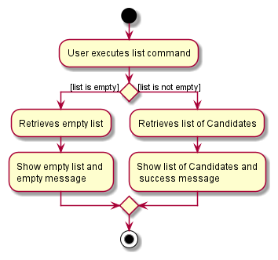

* Table of Contents
{:toc}

--------------------------------------------------------------------------------------------------------------------

## **Acknowledgements**

* {list here sources of all reused/adapted ideas, code, documentation, and third-party libraries -- include links to the original source as well}

--------------------------------------------------------------------------------------------------------------------

## **Setting up, getting started**

Refer to the guide [_Setting up and getting started_](SettingUp.md).

--------------------------------------------------------------------------------------------------------------------

## **Design**

:bulb: **Tip:** The `.puml` files used to create diagrams in this document can be found in the [diagrams](https://github.com/se-edu/addressbook-level3/tree/master/docs/diagrams/) folder. Refer to the [_PlantUML Tutorial_ at se-edu/guides](https://se-education.org/guides/tutorials/plantUml.html) to learn how to create and edit diagrams.

### Architecture

The ***Architecture Diagram*** given above explains the high-level design of the App.

Given below is a quick overview of main components and how they interact with each other.

**Main components of the architecture**

**`Main`** has two classes called [`Main`](https://github.com/se-edu/addressbook-level3/tree/master/src/main/java/seedu/address/Main.java) and [`MainApp`](https://github.com/se-edu/addressbook-level3/tree/master/src/main/java/seedu/address/MainApp.java). It is responsible for,
* At app launch: Initializes the components in the correct sequence, and connects them up with each other.
* At shut down: Shuts down the components and invokes cleanup methods where necessary.

[**`Commons`**](#common-classes) represents a collection of classes used by multiple other components.

The rest of the App consists of four components.

* [**`UI`**](#ui-component): The UI of the App.
* [**`Logic`**](#logic-component): The command executor.
* [**`Model`**](#model-component): Holds the data of the App in memory.
* [**`Storage`**](#storage-component): Reads data from, and writes data to, the hard disk.

**How the architecture components interact with each other**

The *Sequence Diagram* below shows how the components interact with each other for the scenario where the user issues the command `delete 1`.

Each of the four main components (also shown in the diagram above),

* defines its *API* in an `interface` with the same name as the Component.
* implements its functionality using a concrete `{Component Name}Manager` class (which follows the corresponding API `interface` mentioned in the previous point.

For example, the `Logic` component defines its API in the `Logic.java` interface and implements its functionality using the `LogicManager.java` class which follows the `Logic` interface. Other components interact with a given component through its interface rather than the concrete class (reason: to prevent outside component's being coupled to the implementation of a component), as illustrated in the (partial) class diagram below.

The sections below give more details of each component.

### UI component

The **API** of this component is specified in [`Ui.java`](https://github.com/se-edu/addressbook-level3/tree/master/src/main/java/seedu/address/ui/Ui.java)

The UI consists of a `MainWindow` that is made up of parts e.g.`CommandBox`, `ResultDisplay`, `PersonListPanel`, `StatusBarFooter` etc. All these, including the `MainWindow`, inherit from the abstract `UiPart` class which captures the commonalities between classes that represent parts of the visible GUI.

The `UI` component uses the JavaFx UI framework. The layout of these UI parts are defined in matching `.fxml` files that are in the `src/main/resources/view` folder. For example, the layout of the [`MainWindow`](https://github.com/se-edu/addressbook-level3/tree/master/src/main/java/seedu/address/ui/MainWindow.java) is specified in [`MainWindow.fxml`](https://github.com/se-edu/addressbook-level3/tree/master/src/main/resources/view/MainWindow.fxml)

The `UI` component,

* executes user commands using the `Logic` component.
* listens for changes to `Model` data so that the UI can be updated with the modified data.
* keeps a reference to the `Logic` component, because the `UI` relies on the `Logic` to execute commands.
* depends on some classes in the `Model` component, as it displays `Person` object residing in the `Model`.

### Logic component

**API** : [`Logic.java`](https://github.com/se-edu/addressbook-level3/tree/master/src/main/java/seedu/address/logic/Logic.java)

Here's a (partial) class diagram of the `Logic` component:

How the `Logic` component works:
1. When `Logic` is called upon to execute a command, it uses the `AddressBookParser` class to parse the user command.
1. This results in a `Command` object (more precisely, an object of one of its subclasses e.g., `AddCommand`) which is executed by the `LogicManager`.
1. The command can communicate with the `Model` when it is executed (e.g. to add a candidate).
1. The result of the command execution is encapsulated as a `CommandResult` object which is returned back from `Logic`.

The Sequence Diagram below illustrates the interactions within the `Logic` component for the `execute("delete 1")` API call.

:information_source: **Note:** The lifeline for `DeleteCommandParser` should end at the destroy marker (X) but due to a limitation of PlantUML, the lifeline reaches the end of diagram.

Here are the other classes in `Logic` (omitted from the class diagram above) that are used for parsing a user command:

How the parsing works:
* When called upon to parse a user command, the `AddressBookParser` class creates an `XYZCommandParser` (`XYZ` is a placeholder for the specific command name e.g., `AddCommandParser`) which uses the other classes shown above to parse the user command and create a `XYZCommand` object (e.g., `AddCommand`) which the `AddressBookParser` returns back as a `Command` object.
* All `XYZCommandParser` classes (e.g., `AddCommandParser`, `DeleteCommandParser`, ...) inherit from the `Parser` interface so that they can be treated similarly where possible e.g, during testing.

### Model component
**API** : [`Model.java`](https://github.com/se-edu/addressbook-level3/tree/master/src/main/java/seedu/address/model/Model.java)

The `Model` component,

* stores the address book data i.e., all `Person` objects (which are contained in a `UniquePersonList` object).
* stores the currently 'selected' `Person` objects (e.g., results of a search query) as a separate _filtered_ list which is exposed to outsiders as an unmodifiable `ObservableList<Person>` that can be 'observed' e.g. the UI can be bound to this list so that the UI automatically updates when the data in the list change.
* stores a `UserPref` object that represents the user’s preferences. This is exposed to the outside as a `ReadOnlyUserPref` objects.
* does not depend on any of the other three components (as the `Model` represents data entities of the domain, they should make sense on their own without depending on other components)

:information_source: **Note:** An alternative (arguably, a more OOP) model is given below. It has a `Tag` list in the `AddressBook`, which `Person` references. This allows `AddressBook` to only require one `Tag` object per unique tag, instead of each `Person` needing their own `Tag` objects. 

### Storage component

**API** : [`Storage.java`](https://github.com/se-edu/addressbook-level3/tree/master/src/main/java/seedu/address/storage/Storage.java)

The `Storage` component,
* can save both address book data and user preference data in json format, and read them back into corresponding objects.
* inherits from both `AddressBookStorage` and `UserPrefStorage`, which means it can be treated as either one (if only the functionality of only one is needed).
* depends on some classes in the `Model` component (because the `Storage` component's job is to save/retrieve objects that belong to the `Model`)

### Common classes

Classes used by multiple components are in the `seedu.addressbook.commons` package.

--------------------------------------------------------------------------------------------------------------------

## **Implementation**

This section describes some noteworthy details on how certain features are implemented.

### Candidate model

#### Previous Implementation

#### Current Implementation

To suit the direction of where TAlent Assistant™ is headed to, the previous `Person` model has been refactored. Some new entities have been introduced to the new `Candidate` model.

List of new entities:
1. `StudentId`
2. `Course`
3. `Seniority`
4. `ApplicationStatus`
5. `InterviewStatus`
6. `Availability`

### Find feature

#### What is the feature about?
The `find` mechanism is facilitated by `AddressBook`. The `find` command in `TAlent Assistant™`
has been enhanced based on the initial implementation of the `find` command in `AddressBook3`.

The enhancement works by adding a new prefix in the `CliSyntax` class `k/`, which allows the
user to separate multiple keywords. and `f/` which allows the user to specify which field the
`find` command should search for keywords under.

#### How is the feature implemented?
The main logic for `find` command is still implemented within `FindCommand` (which extends from `Command`) and
`FindCommandParser`.

The `FindCommandParser` class has been extended to include a switch-case block to validate
which field the user is trying to search across:
1. `studentId`
2. `course`
3. `seniority`
4. `name`
5. `email`
6. `phone`
7. `applicationStatus` (WIP)
8. `interviewStatus` (WIP)
9. `availability` (WIP)
10. `candidate` (i.e. search across all fields)

Based on the field validated by the switch-case block, a `new findCommand(new ContainsKeywordsPredicate(keywords))`
will be created. The implementation of the original `NameContainsKeywordsPredicate` has been enhanced here.
There is now a `ContainsKeywordsPredicate` parent abstract class extended by each of the above listed fields as subclasses
(e.g. `StudentIdContainsKeywordsPredicate extends ContainsKeywordsPredicate`).

#### Why is the feature implemented as such?
**1. Switch-case block in `FindCommandParser`**  
Other alternatives considered included creating a separate class to execute the logic of checking for which field the
user had entered and return the new `ContainsKeywordsPredicate` subclass *or* to utilise `if`-`else` statements.
In the end, the implementation was done using the switch-case block within the `FindCommandParser` class, as the
class should contain all the necessary logic to parse in the user's input. The syntax for the switch-case block was
also more efficient than `if`-`else` statements and was more relevant for this usage.

**2. Inheritance of `ContainsKeywordsPredicate` to child classes**
Other alternatives considered included creating one single `ContainsKeywordsPredicate` class to implement all the
equality and keyword match checks for each and every field.
However, this would not meet good design principles - this would make it difficult to isolate and resolve bugs during
testing and make scalability and maintainability more complicated.
Further, since all the child classes implement similar logic and methods, it would make sense to create an
(abstract) parent class. This establishes the SRP principle, such that each subclass is only responsible for
checks for the specific related entity, and should not have any other reason to change otherwise.

#### UML Diagrams
**Activity Diagram** 
The following activity diagram summarizes what happens when a user executes a `find` command:  

### Delete feature

#### What is the feature about?
The `delete` feature allows the user to delete a Candidate from the system.
This feature has been enhanced based on the initial implementation of the `delete` command in `AddressBook`.

#### How is the feature implemented?
The main logic is implemented within `DeleteCommand` (which extends from `Command`) and `DeleteCommandParser`. 
A minor enhancement was added to `DeleteCommand` such that if the candidate list is empty, a message indicating that 
there are no candidates in the system is shown to the user (instead of invalid index),
improving the accuracy of the feedback.

#### Why is the feature implemented as such?
**1. Deleting a candidate by `INDEX`**  
The team's original idea was to delete a candidate by its attribute `StudentId` instead of `INDEX`
as every candidate has their own unique `StudentId`. However, upon careful consideration, we realised
that there are two possible problems that could arise from this alternative implementation:
1. App requirements - TAlent Assistant should be faster than GUI
2. Performance - Each time a delete command is executed, the system will be required to iterate through the entire candidate
list to search for the candidate with the matching `StudentId`. 

#### UML Diagrams
**Activity Diagram** 
The following activity diagram summarizes what happens when a user executes a `delete` command:  

### Add feature

#### What is the feature about?
The `add` mechanism is facilitated by `AddressBook`. The implementation of adding a `Candidate` through the `add` command has been enhanced on the existing approach. It extends `Command`. The input parameters of the `add` command has been tweaked slightly, introducing a few more related entities (Refer to [TODO: UPDATE LINK]).

The enhancement works by adding additional prefixes i.e. `id/[StudentId] `c/[Course]`, `yr/[Seniority]`, `avail/[Availability]`. As for the `ApplicationStatus` and `InterviewStatus`, users are not required to enter a value for it as the default value of `PENDING` will be assigned to the entities.

#### How is the feature implemented?

Given below is an example usage scenario and how the `add` mechanism behaves at each step.

:bulb: **Tip:** TAlent Assistant™ comes with preloaded data, user can execute the `clear` command for a fresh state.

Step 1. The user launches the application for the first time. The program will be initialised with the preloaded data.

Step 2. The user proceeds to add a candidate by running the `add` command with its necessary arguments. The image provides an example of this step.

**:information_source: Tip:** Todo: Update image

#### Why is the feature implemented as such?

The `add` command is done up with the goals of being as convenient and efficient for users. It is kept simple with easy to interpret and understand prefixes that convey to the user on what is expected from their input. 

#### UML Diagrams
**Activity Diagram**

The following activity diagram summarizes what happens when a user executes an `add` command:

### \[Proposed\] Undo/redo feature

#### Proposed Implementation

The proposed undo/redo mechanism is facilitated by `VersionedAddressBook`. It extends `AddressBook` with an undo/redo history, stored internally as an `addressBookStateList` and `currentStatePointer`. Additionally, it implements the following operations:

* `VersionedAddressBook#commit()` — Saves the current address book state in its history.
* `VersionedAddressBook#undo()` — Restores the previous address book state from its history.
* `VersionedAddressBook#redo()` — Restores a previously undone address book state from its history.

These operations are exposed in the `Model` interface as `Model#commitAddressBook()`, `Model#undoAddressBook()` and `Model#redoAddressBook()` respectively.

Given below is an example usage scenario and how the undo/redo mechanism behaves at each step.

Step 1. The user launches the application for the first time. The `VersionedAddressBook` will be initialized with the initial address book state, and the `currentStatePointer` pointing to that single address book state.

Step 2. The user executes `delete 5` command to delete the 5th candidate in the address book. The `delete` command calls `Model#commitAddressBook()`, causing the modified state of the address book after the `delete 5` command executes to be saved in the `addressBookStateList`, and the `currentStatePointer` is shifted to the newly inserted address book state.

Step 3. The user executes `add n/David …​` to add a new candidate. The `add` command also calls `Model#commitAddressBook()`, causing another modified address book state to be saved into the `addressBookStateList`.

:information_source: **Note:** If a command fails its execution, it will not call `Model#commitAddressBook()`, so the address book state will not be saved into the `addressBookStateList`.

Step 4. The user now decides that adding the candidate was a mistake, and decides to undo that action by executing the `undo` command. The `undo` command will call `Model#undoAddressBook()`, which will shift the `currentStatePointer` once to the left, pointing it to the previous address book state, and restores the address book to that state.

:information_source: **Note:** If the `currentStatePointer` is at index 0, pointing to the initial AddressBook state, then there are no previous AddressBook states to restore. The `undo` command uses `Model#canUndoAddressBook()` to check if this is the case. If so, it will return an error to the user rather
than attempting to perform the undo.

The following sequence diagram shows how the undo operation works:

:information_source: **Note:** The lifeline for `UndoCommand` should end at the destroy marker (X) but due to a limitation of PlantUML, the lifeline reaches the end of diagram.

The `redo` command does the opposite — it calls `Model#redoAddressBook()`, which shifts the `currentStatePointer` once to the right, pointing to the previously undone state, and restores the address book to that state.

:information_source: **Note:** If the `currentStatePointer` is at index `addressBookStateList.size() - 1`, pointing to the latest address book state, then there are no undone AddressBook states to restore. The `redo` command uses `Model#canRedoAddressBook()` to check if this is the case. If so, it will return an error to the user rather than attempting to perform the redo.

Step 5. The user then decides to execute the command `list`. Commands that do not modify the address book, such as `list`, will usually not call `Model#commitAddressBook()`, `Model#undoAddressBook()` or `Model#redoAddressBook()`. Thus, the `addressBookStateList` remains unchanged.

Step 6. The user executes `clear`, which calls `Model#commitAddressBook()`. Since the `currentStatePointer` is not pointing at the end of the `addressBookStateList`, all address book states after the `currentStatePointer` will be purged. Reason: It no longer makes sense to redo the `add n/David …​` command. This is the behavior that most modern desktop applications follow.

The following activity diagram summarizes what happens when a user executes a new command:

#### Design considerations:

**Aspect: How undo & redo executes:**

* **Alternative 1 (current choice):** Saves the entire address book.
  * Pros: Easy to implement.
  * Cons: May have performance issues in terms of memory usage.

* **Alternative 2:** Individual command knows how to undo/redo by
  itself.
  * Pros: Will use less memory (e.g. for `delete`, just save the candidate being deleted).
  * Cons: We must ensure that the implementation of each individual command are correct.

_{more aspects and alternatives to be added}_

### \[Proposed\] Data archiving

_{Explain here how the data archiving feature will be implemented}_

### List Feature

### What is this feature about?
The `list` feature allows the user to view all available Candidates in the system through the CLI.

This feature in TAlent Assistant™ has been enhanced based on the initial implementation of the `list` command in `AddressBook`.

### How is this feature implemented?
The proposed `list` feature is implemented within `ListCommand` (which extends from `Command`) in `AddressBook`.

A minor enhancement was added to this `list` feature to produce another message to indicate that there are no Candidates
in the system.

### Why is the feature implemented as such?
Instead of the same message being produced in both scenarios, when there are Candidates in the system, or when there are
no Candidates in the system, a new message would allow the user to differentiate between the two. The user would not be
confused in possibly thinking that the TAlent Assistant™ program is unresponsive.

### UML Diagram
The following activity diagram summarizes what happens when a user executes a `list` command:  

### Edit Feature

#### What is this feature about? 
The `edit` feature allows the user to change the attributes of the Candidate in the system though the CLI.
This feature has been enhanced based on the initial implementation of the `edit` command in `AddressBook`.

#### How is this feature implemented?

The proposed edit mechanism is facilitated by `EditCommand`. It is supported by `EditCommandParser` where it will retrieve the attributes that can be edited. 

The user is able to edit key attributes of the Candidate, such as 
* Phone Number
* ApplicationStatus 
* InterviewStatus

Based on the fields that are edited by the user, the EditCommandParser will retreive the information, and update the attributes accordingly.
There are also some attributes that are dependent on another attribute, and we will introduce `Triggers` to update the attributes automatically.
One of such is the `InterviewStatus`. It makes sense that if the application is accepted or rejected, it also means that the interview has been completed.
Hence the `ApplicationStatus` will trigger `InterviewStatus` if the user is changing the `ApplicationStatus` from `Pending` to `Accepted` or `Rejected`.
The `trigger mechanism` (WIP) is currently handled by `EditCommand#triggerInterviewStatus()`. 

#### Why is the feature implemented as such?

**1. Triggers for `ApplicationStatus` and `InterviewStatus`   
For the `ApplicationStatus` and `InterviewStatus`, we initially thought of allowing the user to manually update individual statuses.
(Eg. Updating `ApplicationStatus` to `Accepted` will not trigger `InterviewStatus`).
We initially thought that this would be a cleaner way, and to also make sure there is no wrong information in the system. 
In the end, we went ahead with the triggers as it would make sense for the user to have all the statuses updated automatically, 
and we just need to make more checks in our code. 
The downside to this implementation is that the user will not be able to individually allocate the `InterviewStatus`, but we believe this 
will not be an use case for any user. 

#### UML Diagram 
The following activity diagram summarizes what happens when a user executes a `edit` command for `ApplicationStatus` and `InterviewStatus`  

### Help Window Feature 

#### What is this feature about?
The `help` feature allows the user see the available commands on the system. 
This feature has been enhanced based on the initial implementation of the `help` command in `AddressBook3`.

#### How is this feature implemented?

The proposed `help` mechanism is facilitated by `HelpWindow`. It is supported by `HelpWindowUtil` where it will help the user open the User Guide on their desktop. 
We used the existing implementation, and we modified it that the user can view the full user guide on their personal desktop with the click of a button. 
For this feature, we used the [Desktop API](https://docs.oracle.com/javase/9/docs/api/java/awt/Desktop.html) from Java 9. 

#### Why is the feature implemented as such?

**1. Why allow user to visit full user guide?  
We initially proposed to put the full list of commands and tips on the Help Window. However, we think that this does not improve user experience as 
there will be too many commands available in the window. Hence we decided that we should streamline the important commands on the `HelpWindow`, and the 
other information will be available on the User Guide. 

As the user will not be able to remember the link to our User Guide, we hyperlinked it using the Desktop API that was available from Java.

#### UML Diagram
The following activity diagram summarizes what happens when a user executes a `edit` command for `ApplicationStatus` and `InterviewStatus`  

--------------------------------------------------------------------------------------------------------------------

## **Documentation, logging, testing, configuration, dev-ops**

* [Documentation guide](Documentation.md)
* [Testing guide](Testing.md)
* [Logging guide](Logging.md)
* [Configuration guide](Configuration.md)
* [DevOps guide](DevOps.md)

--------------------------------------------------------------------------------------------------------------------

## **Appendix: Requirements**

### Product scope

**Target user profile**:

* Professor from NUS School of Computing
* Needs to manage a significant number of TA applications
* Prefers desktop apps to other platform apps
* Possesses fast typing speed
* Prefers typing to mouse interactions
* Reasonably comfortable using CLI apps

**Value proposition**: TAlent Assistant™ creates a centralized management system for professors to manage TA
applications by providing access to various application data such as qualifications, experience and
interview availability dates.

### User stories

Priorities: High (must have) - `* * *`, Medium (nice to have) - `* *`, Low (unlikely to have) - `*`

| Priority | As a …​  | I want to …​                          | So that I can…​                                                               |
|----------|----------|---------------------------------------|-------------------------------------------------------------------------------|
| `* * *`  | user     | add a candidate to the system         | keep track of their application details for consideration.                    |
| `* * *`  | user     | delete a candidate from the system    | remove entries that I no longer need.                                         |
| `* * *`  | user     | find a candidate in the system        | access details of the candidate without having to go through the entire list. |
| `* * *`  | user     | list all candidates in the system     | monitor the application pool.                                                 |
| `*`      | user     | sort candidates                       | reorder candidates based on a specific attribute field.                       |
| `* * *`  | user     | schedule TA candidates for interviews | keep track of the interview schedule.                                         |
| `* * *`  | new user | view all available commands           | get familiarised with the system.                                             |

*{More to be added}*

### Use cases

(For all use cases below, the **System** is `TAlent Assistant™ Program` and the **Actor** is the `professor`, unless specified otherwise)

> Note: TA - Teaching Assistant

 

**Use case: List all TA candidates in the system**

**MSS**

1.  User requests to list TAs
2.  TAlent Assistant™ shows all TAs

    Use case ends.

**Extensions**

* 2a. The list is empty
    * 2a1. TAlent Assistant™ feedbacks no TAs in system

    Use case ends.

**Use case: Add a TA into the system**

**MSS**

1.  User requests to add a TA
2.  TAlent Assistant™ requests for TA's details
3.  User inputs details
4.  TAlent Assistant™ adds the new TA

    Use case ends.

**Extensions**

* 3a. The given format is invalid
    * 3a1. TAlent Assistant™ shows an error message

    Use case resumes at step 2.

**Use case: Delete a TA from the system**

**MSS**

1.  User requests to list TA candidates
2.  TAlent Assistant™ displays the list of TA candidates
3.  User requests to delete a specific TA in the list
4.  TAlent Assistant™ deletes the TA from the list and displays the deleted entry

    Use case ends.

**Extensions**

* 3a. The list is empty

    Use case ends.
* 3b. The given index is invalid.

    * 3b1. TAlent Assistant™ displays an error message

  Use case resumes at step 2.

**Use case: Schedule a candidate from the system for an interview**

**MSS**

1.  User requests to list TA candidates
2.  TAlent Assistant™ displays the list of TA candidates
3.  User requests to schedule a specific candidate in the list for an interview on a particular date and time 
4.  TAlent Assistant™ schedules the interview

    Use case ends.

**Extensions**

* 2a. The list is empty

  Use case ends.
* 3a. The given index is invalid

    * 3a1. TAlent Assistant™ displays an error message

  Use case resumes at step 2.

* 3b. The given date and/or time format is invalid

    * 3b1. TAlent Assistant™ displays an error message

  Use case resumes at step 2.

**Use case: Find TAs**

**MSS**

1. User requests to find TAs containing specific keyword(s)
2. TAlent Assistant™ returns a list of TAs that contain one or more of the given keyword(s) 
in the specified attribute field

    Use case ends.

**Extensions**

* 2a. No TA candidate entries contain the given keyword in the specified attribute field
    * 2a1. TAlent Assistant™ returns an empty list with zero search results

    Use case ends.

* 2b. The specified attribute field is invalid
    * 2b1. TAlent Assistant™ returns an error message

    Use case resumes at step 1.

**Sort TAs**

**MSS**

1. User requests to sort TAs by a specific field
2. TAlent Assistant™ returns a list of TAs sorted in order with regard to the specified attribute field

    Use case ends.

* 2b. The specified attribute field is invalid
    * 2b1. TAlent Assistant™ returns an error message

  Use case resumes at step 1.

**Use case: List available commands**

**MSS**

1.  User requests to list available commands
2.  TAlent Assistant™ returns list of available commands and example usages

    Use case ends.

*{More to be added}*

### Non-Functional Requirements

1. Should work on any _mainstream OS_ as long as it has Java `11` or above installed.
2. Should be able to hold up to 1000 entries in the local database with at most 5 seconds delay in performance for typical usage.
3. Should work even without Internet connection.
4. Should work on both 32-bit and 64-bit environments.
5. A user with above average typing speed for regular English text (i.e. not code, not system admin commands) should be able to accomplish most of the tasks faster using commands than using the mouse.
6. The response to any user action should become visible within 3 seconds.
7. Colors used for the user interface should be pleasant and not straining on the eyes.

*{More to be added}*

### Glossary

* **Mainstream OS**: Windows, Linux, Unix, macOS
* **TA**: Teaching Assistant
* **32/64-bit environment**: A system that uses a 32/64-bit processor
* **System admin commands**: Commands that are used on the terminal interface
* **CLI**: Command Line Interface
* **GUI**: Graphical User Interface

--------------------------------------------------------------------------------------------------------------------

## **Appendix: Instructions for manual testing**

Given below are instructions to test the app manually.

:information_source: **Note:** These instructions only provide a starting point for testers to work on;
testers are expected to do more *exploratory* testing.

### Launch and shutdown

1. Initial launch

   1. Download the jar file and copy into an empty folder

   1. Double-click the jar file Expected: Shows the GUI with a set of sample contacts. The window size may not be optimum.

1. Saving window preferences

   1. Resize the window to an optimum size. Move the window to a different location. Close the window.

   1. Re-launch the app by double-clicking the jar file. 
       Expected: The most recent window size and location is retained.

1. _{ more test cases …​ }_

### Deleting a candidate

1. Deleting a candidate while all candidates are being shown

   1. Prerequisites: List all candidates using the `list` command. Multiple candidates in the list.

   1. Test case: `delete 1` 
      Expected: First contact is deleted from the list. Details of the deleted contact shown in the status message. Timestamp in the status bar is updated.

   1. Test case: `delete 0` 
      Expected: No candidate is deleted. Error details shown in the status message. Status bar remains the same.

   1. Other incorrect delete commands to try: `delete`, `delete x`, `...` (where x is larger than the list size) 
      Expected: Similar to previous.

1. _{ more test cases …​ }_

### Saving data

1. Dealing with missing/corrupted data files

   1. _{explain how to simulate a missing/corrupted file, and the expected behavior}_

1. _{ more test cases …​ }_
