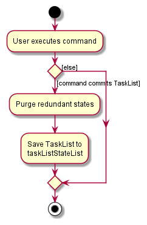

* Table of Contents
{:toc}

--------------------------------------------------------------------------------------------------------------------

## **Acknowledgements**

* {list here sources of all reused/adapted ideas, code, documentation, and third-party libraries -- include links to the original source as well}

--------------------------------------------------------------------------------------------------------------------

## **Setting up, getting started**

Refer to the guide [_Setting up and getting started_](SettingUp.md).

--------------------------------------------------------------------------------------------------------------------

## **Design**

:bulb: **Tip:** The `.puml` files used to create diagrams in this document can be found in the [diagrams](https://github.com/se-edu/addressbook-level3/tree/master/docs/diagrams/) folder. Refer to the [_PlantUML Tutorial_ at se-edu/guides](https://se-education.org/guides/tutorials/plantUml.html) to learn how to create and edit diagrams.

### Architecture

The ***Architecture Diagram*** given above explains the high-level design of the App.

Given below is a quick overview of main components and how they interact with each other.

**Main components of the architecture**

**`Main`** has two classes called [`Main`](https://github.com/se-edu/addressbook-level3/tree/master/src/main/java/seedu/address/Main.java) and [`MainApp`](https://github.com/se-edu/addressbook-level3/tree/master/src/main/java/seedu/address/MainApp.java). It is responsible for,
* At app launch: Initializes the components in the correct sequence, and connects them up with each other.
* At shut down: Shuts down the components and invokes cleanup methods where necessary.

[**`Commons`**](#common-classes) represents a collection of classes used by multiple other components.

The rest of the App consists of four components.

* [**`UI`**](#ui-component): The UI of the App.
* [**`Logic`**](#logic-component): The command executor.
* [**`Model`**](#model-component): Holds the data of the App in memory.
* [**`Storage`**](#storage-component): Reads data from, and writes data to, the hard disk.

**How the architecture components interact with each other**

The *Sequence Diagram* below shows how the components interact with each other for the scenario where the user issues the command `delete 1`.

Each of the four main components (also shown in the diagram above),

* defines its *API* in an `interface` with the same name as the Component.
* implements its functionality using a concrete `{Component Name}Manager` class (which follows the corresponding API `interface` mentioned in the previous point.

For example, the `Logic` component defines its API in the `Logic.java` interface and implements its functionality using the `LogicManager.java` class which follows the `Logic` interface. Other components interact with a given component through its interface rather than the concrete class (reason: to prevent outside component's being coupled to the implementation of a component), as illustrated in the (partial) class diagram below.

The sections below give more details of each component.

### UI component

The **API** of this component is specified in [`Ui.java`](https://github.com/se-edu/addressbook-level3/tree/master/src/main/java/seedu/address/ui/Ui.java)

The UI consists of a `MainWindow` that is made up of parts e.g.`CommandBox`, `ResultDisplay`, `PersonListPanel`, `StatusBarFooter` etc. All these, including the `MainWindow`, inherit from the abstract `UiPart` class which captures the commonalities between classes that represent parts of the visible GUI.  
Furthermore, `AddWindow` and `EditWindow` keeps a reference to `MainWindow`'s `Logic` component in order to execute commands.

The `UI` component uses the JavaFx UI framework. The layout of these UI parts are defined in matching `.fxml` files that are in the `src/main/resources/view` folder. For example, the layout of the [`MainWindow`](https://github.com/se-edu/addressbook-level3/tree/master/src/main/java/seedu/address/ui/MainWindow.java) is specified in [`MainWindow.fxml`](https://github.com/se-edu/addressbook-level3/tree/master/src/main/resources/view/MainWindow.fxml)

The `UI` component,

* executes user commands using the `Logic` component.
* listens for changes to `Model` data so that the UI can be updated with the modified data.
* keeps a reference to the `Logic` component, because the `UI` relies on the `Logic` to execute commands.
* depends on some classes in the `Model` component, as it displays `Person` object residing in the `Model`.

### Logic component

**API** : [`Logic.java`](https://github.com/se-edu/addressbook-level3/tree/master/src/main/java/seedu/address/logic/Logic.java)

Here's a (partial) class diagram of the `Logic` component:

How the `Logic` component works:
1. When `Logic` is called upon to execute a command, it uses the `AddressBookParser` class to parse the user command.
1. This results in a `Command` object (more precisely, an object of one of its subclasses e.g., `AddCommand`) which is executed by the `LogicManager`.
1. The command can communicate with the `Model` when it is executed (e.g. to add a person).
1. The result of the command execution is encapsulated as a `CommandResult` object which is returned back from `Logic`.

The Sequence Diagram below illustrates the interactions within the `Logic` component for the `execute("delete 1")` API call.

The Sequence Diagram below illustrates the interactions from the `Logic` component for the `execute("add")`

:information_source: **Note:** The lifeline for `DeleteCommandParser` should end at the destroy marker (X) but due to a limitation of PlantUML, the lifeline reaches the end of diagram.

Here are the other classes in `Logic` (omitted from the class diagram above) that are used for parsing a user command:

How the parsing works:
* When called upon to parse a user command, the `AddressBookParser` class creates an `XYZCommandParser` (`XYZ` is a placeholder for the specific command name e.g., `AddCommandParser`) which uses the other classes shown above to parse the user command and create a `XYZCommand` object (e.g., `AddCommand`) which the `AddressBookParser` returns back as a `Command` object.
* All `XYZCommandParser` classes (e.g., `AddCommandParser`, `DeleteCommandParser`, ...) inherit from the `Parser` interface so that they can be treated similarly where possible e.g, during testing.

### Model component
**API** : [`Model.java`](https://github.com/se-edu/addressbook-level3/tree/master/src/main/java/seedu/address/model/Model.java)

The `Model` component,

* stores the address book data i.e., all `Person` objects (which are contained in a `UniquePersonList` object).
* stores the currently 'selected' `Person` objects (e.g., results of a search query) as a separate _filtered_ list which is exposed to outsiders as an unmodifiable `ObservableList<Person>` that can be 'observed' e.g. the UI can be bound to this list so that the UI automatically updates when the data in the list change.
* stores a `UserPref` object that represents the user’s preferences. This is exposed to the outside as a `ReadOnlyUserPref` objects.
* does not depend on any of the other three components (as the `Model` represents data entities of the domain, they should make sense on their own without depending on other components)

:information_source: **Note:** An alternative (arguably, a more OOP) model is given below. It has a `Module` list in the `AddressBook`, which `Person` references. This allows `AddressBook` to only require one `Module` object per unique module, instead of each `Person` needing their own `Module` objects. 

### Storage component

**API** : [`Storage.java`](https://github.com/se-edu/addressbook-level3/tree/master/src/main/java/seedu/address/storage/Storage.java)

The `Storage` component,
* can save both address book data and user preference data in json format, and read them back into corresponding objects.
* inherits from both `AddressBookStorage` and `UserPrefStorage`, which means it can be treated as either one (if only the functionality of only one is needed).
* depends on some classes in the `Model` component (because the `Storage` component's job is to save/retrieve objects that belong to the `Model`)

### Common classes

Classes used by multiple components are in the `seedu.addressbook.commons` package.

--------------------------------------------------------------------------------------------------------------------

## **Implementation**

This section describes some noteworthy details on how certain features are implemented.

### Sort feature
#### Implementation

The sort mechanism is facilitated by `PersonComparator`. It compares `Person` objects and stores internally the list of fields to be ordered on as well as the order on each field ("ascending" vs "descending"). 
`PersonComparator` then is passed to `Model`.

Within Model component, 'Model' then passes it into `AddressBook`, and which is then passed into `UniquePersonList` and finally to `ObservableList`. `ObservableList` then sorts itself based on the comparator.

Below is a sequence diagram showing how sort operation works:

`PersonComparator` implements the `Comparator<Person>` interface. 
For a comparator c: 
1. If x < y, `c.compare(x, y) < 0`
2. If x > y, `c.compare(x, y) > 0`
3. If x == y, `c.compare(x, y) == 0`

Within the `PersonComparator`, it compares both persons based on the first field in the list of fields. If they are not equivalent, it returns an Integer depending on the comparison. 
Else, it will check the next field. It returns a `0` when there are no fields left to compare. If `desc` was called on a field, return value will be multipled by `-1`, to invert the ordering.

### Alternatives
#### Aspect: How to compare: `Comparator` vs `Comparable`
####1. Alternative 1
Create many comparators for `Person` depending on what field to compare on and how to compare that field.
- Pros: More flexibility for ways to compare each field. E.g. can compare`Module` field based on number of modules, lexicographic ordering, etc.
- Cons: More complexity for user syntax. Less encapsulation as `Person` has to know the details of it's fields and how it desires to sort them. 
Has to pass all `PersonComparator` that were chosen into `Model` one after another so less efficient.

####2. Alternative 2 (Current)
Each field implements a `Comparable` interface.
- Pros: Easier to implement.
- Cons: Less flexible. Passes only one `PersonComparator` which stores the fields within itself. Each comparison stops once field is not equivalent, therefore is more efficient.

### Comment feature
#### Implementation

The comment mechanism is facilitated by `CommentCommand`. It adds a field of type `Comment` to a `Person` object. 
The `CommentCommand.java` class extends `Command` with the index of the person to add the module to and also a 
`Comment` object which holds the comment that will be given to the person. Additionally, it implements the following 
operations:
* `Command#execute(Model model)` - Returns a message that informs users on the comment that was added to the 
  specific person. 
* `generateSuccessMessage(Person personToEdit)` - Creates and returns the message that informs users if a new comment 
  was added or deleted from `personToEdit`.

Below is a sequence diagram showing how comment operation works:

### Design Considerations
#### Aspect: How to remove a comment 
####1. Alternative 1 (Current choice)
Similar to how `Status` was implemented, upon user input of an empty comment (i.e `comment 1`), the comment of the 
person at the particular index, in this case the first person, will be removed 
- Pros: Can contain all logic related to adding and removing a `comment` all in the `CommentCommand` and 
  `CommentCommandParser` classes. 
- Cons: Not consistent with how the other fields like `Module` and `Person` are removed. These fields are removed 
  via an additional command that specifically handles their deletion (i.e. `deletemodule` and `delete`).

####2. Alternative 2 (Current)
Implement a separate command to handle the removal of `comment`.
- Pros: An empty comment command (`comment 1`) will now show an error message, which is more intuitive.
- Cons: Results in excessive code duplication, as `delete` and `deletemodule` are implemented in a very similar way 
  to how a proposed `deletecomment` command will be implemented.

### GUI for Adding, Editing

#### Implementation

The GUI for `AddWindow` and `EditWindow` are done using JavaFX with SceneBuilder.  
The adding and editing mechanism is driven by the CLI commands, `add` and `edit`, and both goes through their respective `Parser`

User input is retrieved from their respective `TextField`  
User input is strung together to follow the proper `Command` format, which is then passed to `Logic` to handle the rest of the execution  

`AddWindow` allows for the execution of multiple commands within a single window.  
Executing multiple commands (`status`, `addmodule`) is done by checking if the given inputs are valid. If they are valid, we pass the execution to `Logic` to handle the adding of a `Person`. After a `Person` is added, retrieve the last index from `PersonList`, then pass the user inputs for `status` and/or `addmodule` into `Logic` again to execute the commands

The following activity diagram shows how a `Person` with `Status` and `Module` is added when the given command is `add` or when the user opens `AddWindow`

Editing through `EditWindow` is largely similar to the above.

### \[Proposed\] Undo/redo feature

#### Proposed Implementation

The proposed undo/redo mechanism is facilitated by `VersionedAddressBook`. It extends `AddressBook` with an undo/redo history, stored internally as an `addressBookStateList` and `currentStatePointer`. Additionally, it implements the following operations:

* `VersionedAddressBook#commit()` — Saves the current address book state in its history.
* `VersionedAddressBook#undo()` — Restores the previous address book state from its history.
* `VersionedAddressBook#redo()` — Restores a previously undone address book state from its history.

These operations are exposed in the `Model` interface as `Model#commitAddressBook()`, `Model#undoAddressBook()` and `Model#redoAddressBook()` respectively.

Given below is an example usage scenario and how the undo/redo mechanism behaves at each step.

Step 1. The user launches the application for the first time. The `VersionedAddressBook` will be initialized with the initial address book state, and the `currentStatePointer` pointing to that single address book state.

Step 2. The user executes `delete 5` command to delete the 5th person in the address book. The `delete` command calls `Model#commitAddressBook()`, causing the modified state of the address book after the `delete 5` command executes to be saved in the `addressBookStateList`, and the `currentStatePointer` is shifted to the newly inserted address book state.

Step 3. The user executes `add n/David …​` to add a new person. The `add` command also calls `Model#commitAddressBook()`, causing another modified address book state to be saved into the `addressBookStateList`.

:information_source: **Note:** If a command fails its execution, it will not call `Model#commitAddressBook()`, so the address book state will not be saved into the `addressBookStateList`.

Step 4. The user now decides that adding the person was a mistake, and decides to undo that action by executing the `undo` command. The `undo` command will call `Model#undoAddressBook()`, which will shift the `currentStatePointer` once to the left, pointing it to the previous address book state, and restores the address book to that state.

:information_source: **Note:** If the `currentStatePointer` is at index 0, pointing to the initial AddressBook state, then there are no previous AddressBook states to restore. The `undo` command uses `Model#canUndoAddressBook()` to check if this is the case. If so, it will return an error to the user rather
than attempting to perform the undo.

The following sequence diagram shows how the undo operation works:

:information_source: **Note:** The lifeline for `UndoCommand` should end at the destroy marker (X) but due to a limitation of PlantUML, the lifeline reaches the end of diagram.

The `redo` command does the opposite — it calls `Model#redoAddressBook()`, which shifts the `currentStatePointer` once to the right, pointing to the previously undone state, and restores the address book to that state.

:information_source: **Note:** If the `currentStatePointer` is at index `addressBookStateList.size() - 1`, pointing to the latest address book state, then there are no undone AddressBook states to restore. The `redo` command uses `Model#canRedoAddressBook()` to check if this is the case. If so, it will return an error to the user rather than attempting to perform the redo.

Step 5. The user then decides to execute the command `list`. Commands that do not modify the address book, such as `list`, will usually not call `Model#commitAddressBook()`, `Model#undoAddressBook()` or `Model#redoAddressBook()`. Thus, the `addressBookStateList` remains unchanged.

Step 6. The user executes `clear`, which calls `Model#commitAddressBook()`. Since the `currentStatePointer` is not pointing at the end of the `addressBookStateList`, all address book states after the `currentStatePointer` will be purged. Reason: It no longer makes sense to redo the `add n/David …​` command. This is the behavior that most modern desktop applications follow.

The following activity diagram summarizes what happens when a user executes a new command:

#### Design considerations:

**Aspect: How undo & redo executes:**

* **Alternative 1 (current choice):** Saves the entire address book.
  * Pros: Easy to implement.
  * Cons: May have performance issues in terms of memory usage.

* **Alternative 2:** Individual command knows how to undo/redo by
  itself.
  * Pros: Will use less memory (e.g. for `delete`, just save the person being deleted).
  * Cons: We must ensure that the implementation of each individual command are correct.

_{more aspects and alternatives to be added}_

### \[Proposed\] Data archiving

_{Explain here how the data archiving feature will be implemented}_

--------------------------------------------------------------------------------------------------------------------

## **Documentation, logging, testing, configuration, dev-ops**

* [Documentation guide](Documentation.md)
* [Testing guide](Testing.md)
* [Logging guide](Logging.md)
* [Configuration guide](Configuration.md)
* [DevOps guide](DevOps.md)

--------------------------------------------------------------------------------------------------------------------

## **Appendix: Requirements**

### Product scope

**Target user profile**:

* has a need to manage a significant number of contacts within their educational organisation
* prefer desktop apps over other types
* can type fast
* prefers typing to mouse interactions
* is reasonably comfortable using CLI apps

**Value proposition**: manage contacts faster than a typical mouse/GUI driven app

### User stories

Priorities: High (must have) - `* * *`, Medium (nice to have) - `* *`, Low (unlikely to have) - `*`

| Priority | As a …​                                   | I want to …​                 | So that I can…​                                                        |
| -------- |-------------------------------------------|------------------------------|------------------------------------------------------------------------|
| `* * *`  | student                                   | add modules that I am taking | keep track of the modules                                              |
| `* * *`  | new user                                  | see usage instructions       | refer to instructions when I forget how to use the App                 |
| `* * *`  | user                                      | add a new person             |                                                                        |
| `* * *`  | user                                      | delete a person              | remove entries that I no longer need                                   |
| `* * *`  | user                                      | find a person by name        | locate details of persons without having to go through the entire list |
| `* *`    | user                                      | hide private contact details | minimize chance of someone else seeing them by accident                |
| `*`      | user with many persons in the address book | sort persons by name         | locate a person easily                                                 |

*{More to be added}*

### Use cases

(For all use cases below, the **System** is `ModuleMateFinder` and the **Actor** is the `user`, unless specified otherwise)

**Use case: UC01 - Listing all contacts**

**MSS**

1. User requests to list out all contacts.
2. ModuleMateFinder shows a list of all contacts.

   Use case ends.

**Extensions**

- 2a. The list is empty.  
  Use case ends.

**Use case: UC02 - Adding a contact**

**MSS**

1. User requests to add a person as a contact.
2. User inputs the information of the person.
3. ModuleMateFinder adds the person as a contact.

   Use case ends.

**Extensions**

- 3a. The given name already exists in ModuleMateFinder.
    - 3a1. ModuleMateFinder shows an error message.  
      Use case resumes at step 2.

**Use case: UC03 - Favourite a contact**

**MSS**

1. User requests to <u>list contacts (UC01)</u>.
2. ModuleMateFinder shows a list of persons.
3. User requests to favourite a person in the list.
4. ModuleMateFinder favourites the person.

   Use case ends.

**Extensions**

- 2a. The list is empty.  
  Use case ends.
- 3a. The given index is invalid.
    - 3a1. ModuleMateFinder shows an error message.  
      Use case resumes at step 2.

  
**Use case: UC04 - Blacklisting a contact**

**MSS**
1. User requests to <u>list contacts (UC01)</u>.
2. ModuleMateFinder shows a list of persons.
3. User requests to blacklist a person in the list.
4. ModuleMateFinder blacklist the person. 
   
   Use case ends.

**Extensions**
- 2a. The list is empty.  
  Use case ends.
- 3a. The given index is invalid.
    - 3a1. ModuleMateFinder shows an error message.  
      
      Use case resumes at step 2.

**Use case: UC05 - Filter contacts by modules**

**MSS**
1. User requests to <u>list contacts (UC01)</u>.
2. ModuleMateFinder shows a list of persons.
3. User requests to filter the list by a certain module (e.g. `CS3230`).
4. ModuleMateFinder finds all persons with the module `CS3230`.
5. ModuleMateFinder shows a list of persons with the module `CS3230`.  
   Use case ends.

**Extensions**
- 2a. The list is empty.  
  Use case ends.
- 3a. No persons has a matching module.
    - 3a1. ModuleMateFinder shows an empty list.  
      Use case ends.

**Use case: UC06 - Filter contacts by name**

**MSS**
1. User requests to <u>list contacts (UC01)</u>.
2. ModuleMateFinder shows a list of persons.
3. User requests to filter the list by a certain name (e.g. `Hans`).
4. ModuleMateFinder finds all persons with the module `Hans`.
5. ModuleMateFinder shows a list of persons with the module `Hans`.
   Use case ends.

**Extensions**
- 2a. The list is empty.  
  Use case ends.
- 3a. No persons has a matching name.
    - 3a1. ModuleMateFinder shows an empty list.  
      Use case ends.

**Use case: UC07 - Editing a contact's details**

**MSS**

1. User requests to <u>list contacts (UC01)</u>.
2. ModuleMateFinder shows a list of persons.
3. User requests to edit a contact on the list.
4. User inputs the updated information.
5. ModuleMateFinder updates the contact's details.

   Use case ends.

**Extensions**
- 2a. The list is empty.  
  Use case ends.
- 3a. The provided index is invalid.
    - 3a1. ModuleMateFinder displays an error message.
      
      Use case resumes at step 2.

**Use case: UC08 - Deleting a contact**

**MSS**
1. User requests to <u>list contacts (UC01)</u>.
2. ModuleMateFinder shows a list of persons.
3. User requests to delete a contact at a given index.
4. ModuleMateFinder deletes the contact at the index .
   
   Use case ends.

**Extensions**
- 2a. The list is empty.  
  Use case ends.
- 3a. The provided index is invalid.
    - 3a1. ModuleMateFinder displays an error message.
      
      Use case resumes at step 2.
  

**Use case: UC09 - Clearing all entries**

**MSS**

1. User requests to clear all entries in ModuleMateFinder.
2. ModuleMateFinder removes all saved data and displays a success 
message.

**Use case: UC10 - Exiting the application**

**MSS**

1. User requests to exit ModuleMateFinder.
2. ModuleMateFinder closes.
   
   Use case ends.

*{More to be added}*

### Non-Functional Requirements

1. The application must be _free_.
2. Simple to use even if you have no experience.
3. Offline application used by each person.
4. The application should run on Linux, MacOS and Windows as long as it has Java 11 or above installed.
5. The product is not required to handle the forming of groups for users.
6. The product should be highly testable.
7. Documentation for the product must be written clearly and concisely.
8. This product is not required to be installed; it can be run as an executable.
9. Clear and comprehensible error messages?
10. Should work on any _mainstream OS_ as long as it has Java `11` or above installed.
11. Should be able to hold up to 1000 persons without a noticeable sluggishness in performance for typical usage.
12. A user with above average typing speed for regular English text (i.e. not code, not system admin commands) should be able to accomplish most of the tasks faster using commands than using the mouse.

*{More to be added}*

### Glossary

* **Mainstream OS**: Windows, Linux, Unix, OS-X
* **Contact/Person**: A classmate whose information is kept in the address book. 
* **Module**: A course that is held at NUS with specific module codes e.g. CS3230
* **Private contact detail**: A contact detail that is not meant to be shared with others
* **Favourite**: To mark a person favourably
* **Blacklist**: To mark a person unfavourably
* **Fast Typist**: A person who can type at speeds greater or equal to 70 words per minute.

--------------------------------------------------------------------------------------------------------------------

## **Appendix: Instructions for manual testing**

Given below are instructions to test the app manually.

:information_source: **Note:** These instructions only provide a starting point for testers to work on;
testers are expected to do more *exploratory* testing.

### Launch and shutdown

1. Initial launch

   1. Download the jar file and copy into an empty folder

   1. Double-click the jar file Expected: Shows the GUI with a set of sample contacts. The window size may not be optimum.

1. Saving window preferences

   1. Resize the window to an optimum size. Move the window to a different location. Close the window.

   1. Re-launch the app by double-clicking the jar file. 
       Expected: The most recent window size and location is retained.

1. _{ more test cases …​ }_

### Deleting a person

1. Deleting a person while all persons are being shown

   1. Prerequisites: List all persons using the `list` command. Multiple persons in the list.

   1. Test case: `delete 1` 
      Expected: First contact is deleted from the list. Details of the deleted contact shown in the status message. Timestamp in the status bar is updated.

   1. Test case: `delete 0` 
      Expected: No person is deleted. Error details shown in the status message. Status bar remains the same.

   1. Other incorrect delete commands to try: `delete`, `delete x`, `...` (where x is larger than the list size) 
      Expected: Similar to previous.

1. _{ more test cases …​ }_

### Saving data

1. Dealing with missing/corrupted data files

   1. _{explain how to simulate a missing/corrupted file, and the expected behavior}_

1. _{ more test cases …​ }_
