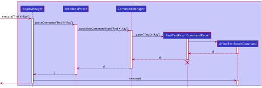

* Table of Contents
{:toc}

--------------------------------------------------------------------------------------------------------------------
## **Design**

### Architecture

The Architecture Diagram given above explains the high-level design of the Tinner. Tinner follows a multi-layered architecture where the lower layers are independent of higher layers. For example, `Main` can use methods found in `Storage` but not the other way around.
Below is a quick overview of main components and how they interact with each other.

**`Main`** has two classes called [`Main`](https://github.com/AY2122S2-CS2103T-T17-1/tp/blob/master/src/main/java/seedu/tinner/Main.java) and [`MainApp`](https://github.com/AY2122S2-CS2103T-T17-1/tp/blob/master/src/main/java/seedu/tinner/MainApp.java). It is responsible for,

* At app launch: Initializes the components in the correct sequence, and connects them up with each other.
* At shut down: Shuts down the components and invokes cleanup methods where necessary.

[**`Commons`**](#common-classes) represents a collection of classes used by multiple other components.

The rest of the App consists of four components.

* [**`UI`**](#ui-component): The UI of the App.
* [**`Logic`**](#logic-component): The command executor.
* [**`Model`**](#model-component): Holds the data of the App in memory.
* [**`Storage`**](#storage-component): Reads data from, and writes data to, the hard disk.

Each of the four components,

* defines its _API_ in an `interface` with the same name as the Component.
* exposes its functionality using a concrete `{Component Name}Manager` class (which implements the corresponding API `interface` mentioned in the previous point.

For example, the `Logic` component (see the class diagram given below) defines its API in the `Logic.java` interface and exposes its functionality using the `LogicManager.java` class which implements the `Logic` interface.

**How the architecture components interact with each other**

The _Sequence Diagram_ below shows how the components interact with each other for the scenario where the user issues the command `deleteCompany 1` when in project view.

The sections below give more details of each component.

### UI Component

**API** :
[`Ui.java`](https://github.com/AY2122S2-CS2103T-T17-1/tp/blob/master/src/main/java/seedu/tinner/ui/Ui.java)

The UI consists of a `MainWindow` that is made up of parts e.g.`CommandBox`, `ResultDisplay`, `CompanyListPanel`, `StatusBarFooter` etc. All these, including the `MainWindow`, inherit from the abstract `UiPart` class which captures the commonalities between classes that represent parts of the visible GUI.

The `CommandBox` and `ResultDisplay` appear at the top of the application for the user
to interact with the application.

The `CompanyListPanel` appears at the center of the application displaying key information of `Company`
from `CompanyCard`.

The `RoleListPanel` appears at the bottom of `CompanyCard` displaying key information of `Role` from `RoleCard`.

The `UI` component uses the JavaFx UI framework. The layout of these UI parts are defined in matching `.fxml` files that are in the `src/main/resources/view` folder. For example, the layout of the `MainWindow` is specified in `MainWindow.fxml`

The `UI` component,
* executes user commands using the `Logic` component.
* listens for changes to `Model` data so that the `UI` can be updated with the modified data.
* keeps a reference to the `Logic` component, because the `UI` relies on the `Logic` to execute commands.
* depends on some classes in the `Model` component, as it displays `Company` and `Role` objects residing in the `Model`.

### Logic Component

**API** :
[`Logic.java`](https://github.com/AY2122S2-CS2103T-T17-1/tp/blob/master/src/main/java/seedu/tinner/logic/Logic.java)

### Model Component

Breakdown of the Company and RoleManager packages:

**API** :
[`Model.java`](https://github.com/AY2122S2-CS2103T-T17-1/tp/blob/master/src/main/java/seedu/tinner/model/Model.java)

The `Model` component,

* stores the company list data i.e., all `Company` objects (which are contained in a `UniqueCompanyList` object).
* stores the currently selected `Company` and `Role` objects (e.g., results of a search query) as a separate filtered list which is exposed to outsiders as an unmodifiable `ObservableList` that can be ‘observed’ e.g. the UI can be bound to this list so that the UI automatically updates when the data in the list change.
* stores a `UserPref` object that represents the user’s preferences. This is exposed to the outside as a `ReadOnlyUserPref` objects.
* does not depend on any of the other three components (as the `Model` represents data entities of the domain, they should make sense on their own without depending on other components)
### Storage Component

**API** :
[`Storage.java`](https://github.com/AY2122S2-CS2103T-T17-1/tp/blob/master/src/main/java/seedu/tinner/storage/Storage.java)

The `Storage` component,

* can save `UserPref` objects in json format and read it back.
* can save `JsonAdaptedCompany` objects in `JsonSerializableCompanyList` in json format and read it back.
* can save `JsonAdaptedRole` objects in `JsonAdaptedCompany` in json format and read it back
* inherits from both `CompanyListStorage` and `UserPrefStorage`,meaning that it can be
  treated as either one (if the functionality of only one is required)
* depends on classes like `Company` and `Role` in the `Model` component (as it is the `Storage` component's
  job to save/retrieve objects that belong to the `Model`)

The `JsonAdaptedCompany` also contains a list of roles in `List<JsonAdaptedRole>` format, as show in the class diagram above.

### Common Classes

---
## **Implementation**

### Find feature

The `find` feature allows users to filter the company list by specifying company name keywords and role name keywords.

#### Implementation
The `find` command is primarily implemented by `FindCommandParser` a class that extends `Parser`, and `FindCommand`, which is a class that extends `Command`. For each `find` command, a `Predicate<Company>` object and a `Predicate<Role>` object will be created. Both `Predicate` objects contain a `test` function to determine whether the given company or role matches the keywords provided in the user input.

* Upon a valid user's input using the `find` command, the `FindCommandParser#parse()`creates a `CompanyNameContainsKeywordsPredicate` which extends `Predicate<Company>`, and a `RoleNameContainsKeywordsPredicate` which extends `Predicate<Role>`.
* The `FindCommandParser#parse()` then uses the `CompanyNameContainsKeywordsPredicate` object and the `RoleNameContainsKeywordsPredicate` object to instantiate the `FindCommand`.
* Then invoking the `FindCommand#execute()` method will update the `model` using the `Model#updateFilteredRoleList()` method, displaying only companies and roles that match the user input.

The following sequence diagram shows how the `find` command operation works with the user input `find c/meta r/software mobile`:

Note that the lifeline of FindCommandParser should end at the destroy marker but due to the limitations of PlantUML, we are unable to depict it.

1. The user will first enter the input `find c/meta r/software mobile`, the `CompayListParser#parseCommand()` method will parse the information `c/meta r/software mobile` to `FindCommandParser` using the method `parse()` based on the keyword `find`.
2. The `FindCommandParser#parse()` method will create a `CompanyNameContainsKeywordsPredicate` object with the company name keywords specified after the prefix `c/` and the role name keywords specified after the prefix `r/`. The `RoleNameContainsKeywordsPredicate` is also created using the role name keywords specified after the prefix `r/`. If a prefix is present, keywords that follow the prefix must be present or else it would be deemed an invalid command.
3. Note that the `CompanyNameContainsKeywordsPredicate` is created using both company name keywords and role name keywords because companies are only displayed if they contain at least one role which matches the role name keywords
4. Either prefix `c/` or `r/` can be absent. Both cannot be absent within the same command or else it would give rise to an invalid command. If absent, an empty array is passed as input in the creation of either or both `CompanyNameContainsKeywordsPredicate` and `RoleNameContainsKeywordsPredicate`.
5. Then the `FindCommandParser#parse()` method will create an `FindCommand` object with the `CompanyNameContainsKeywordsPredicate` object and the `RoleNameContainsKeywordsPredicate` object. 
6. The `FindCommand` object will be returned to the `LogicManager` and will then invoke the `FindCommand#execute()` method to implement the changes.
7. The `Model#updateFilteredRoleList()` is invoked and filters the list of companies to display only companies which match the company name keywords.
8. Similarly, the `Model#updateFilteredRoleList()` also filters the list of roles within each company to display only roles which match the role name keywords.  
9. Upon successful operation, a new `CommandResult` object is returned to the `LogicManager`.

### Edit role feature
The `editRole` command for the `Role` item allows the user to update any fields by specifying
the company index, role index and prefixes of the fields to be updated.

#### Implementation
The `editRole` command is primarily implemented by `EditRoleCommandParser` a class that extends `Parser`, and `EditRoleCommand`, which is a class that extends `Command`. The `EditRoleCommand` has an inner class `EditRoleDescriptor` that holds the changes to the `Role`.

* Upon a valid user's input using the `editRole` command, the `EditRoleCommandParser#parse()`
  creates an `EditRoleDescriptor` with the edited changes to the `Role` fields.
* The `EditRoleCommandParser#parse()` then use the `EditRoleDescriptor` object to instantiate the `EditRoleCommand`.
* Then invoking the `EditRoleCommand#execute()` method will update the `Role` with the new changes.

The following sequence diagram shows how the `editRole` command operation works with the user input `editRole 1 1 d/react js`:

1. The user will first enter the input `editRole 1 1 d/react js`, the `CompayListParser#parseCommand()` method will parse the information `1 1 d/react js` to `EditRoleCommandParser` using the method `parse()` based on the keyword `editRole`.
2. The `EditRoleCommandParser#parse()` method will create an `EditRoleDescriptor` object with all the non-empty fields with the fields' prefixes that are specified by the user such as `s/`,  `b/`, `d/`, etc. In this example, `EditRoleDescriptor#setDescription()` will be used as the description `d/` is a non-empty field with `react js`.
3. Then the `EditRoleCommandParser#parse()` method will create an `EditRoleCommand` object with the company index `1`, role index `1` and the `EditRoleDescriptor` object.
4. The `EditRoleCommand` object will be returned to the `LogicManager` and will then invoke the `EditRoleCommand#execute()` method to implement the changes.
5. The  `EditRoleCommand#execute()` will check the validity of both the indexes, and invoke the `Model#setRole()` method.
6. The  `Model#setRole()` with the company index will set the role to be edited with a new role containing the changes. Then the `Model#updateFilteredRoleList()` filters the list of roles such that the application only displays the edited `Role` to the User.
7. Upon successful operation, a new `CommandResult` object is returned to the `LogicManager`.

## Requirements

### Product scope

**Target user profile**:

Students who...

* want to keep track of tech internships
* are disorganised and tend to miss deadlines
* prefer desktop apps over other types
* can type fast
* prefer typing to mouse interactions
* are reasonably comfortable using CLI apps

**Value proposition**:

* Track (View all your internship applications at a glance)
* Remind (Be reminded of your upcoming assessments)
* Review (Comment on each stage of the application process for future self-improvement or review the company’s hiring process)

### User stories

Priorities: High (must have) - `* * *`, Medium (nice to have) - `* *`, Low (unlikely to have) - `*`

| Priority | As a …​        | I want to …​                                                               | So that I can…​                                          |
|----------|----------------|----------------------------------------------------------------------------|----------------------------------------------------------|
| `* * *`  | user           | add a new company                                                          | add new internship roles to said company                 |
| `* * *`  | user           | add a new internship role                                                  | keep track of said internship application process        |
| `* * *`  | user           | delete a company                                                           | remove companies that I am no longer interested in       |
| `* * *`  | user           | delete an internship role                                                  | remove internship roles that are outdated or complete    |
| `* * *`  | user           | see a summary of my internship applications at a glance                    | have a general overview of the status of my applications |
| `* *`    | user           | search keywords like company name, internship roles, etc.                  | locate my internship application quickly                 |
| `* *`    | user           | sort company names in alphabetical order                                   | locate a company that I may have forgotten about         |
| `* *`    | user           | sort applications in chronological order of deadlines                      | keep track of the timeline of applications               |
| `* *`    | user           | modify each item                                                           | keep Tinner and all its contents up to date              |
| `* *`    | user           | be reminded of upcoming deadlines                                          | be on time with my applications                          |
| `* *`    | organised user | tag applications and events                                                | keep items compartmentalised and thus easier to access   |
| `* *`    | long term user | archive/hide irrelevant events                                             | not get distracted by what is not important              |
| `* *`    | new user       | learn how to use the application via a guide                               | use the application periodically with ease               |
| `*`      | user           | export calendar dates of important events into a .ics or .pdf file         | keep track of my events on an external platform          |
| `*`      | user           | export a list of interview reviews of different companies into a .csv file | share my experience with juniors and peers               |
| `*`      | user           | mark certain entries as my favourites                                      | view those that I am more interested in at a glance      |

*{More to be added}*

### Use cases

(For all use cases below, the **System** is the `Tinner` and the **Actor** is the `user`, unless specified otherwise)

**Use case: UC01 - Add a company**

Guarantees: a company will be successfully created

**MSS**

1. User requests to add a specific company and its information in the list
2. Tinner adds a company to the list
3. Tinner displays the list of companies

   Use case ends

**Extensions**

 1a. The input does not adhere to the command format  
  1a1. Tinner shows an invalid input format error message  
     Use case resumes at step 1

 1b. The specific company is already stored  
  1b1. Tinner shows a duplicate company error message  
     Use case resumes at step 1

**Use case: UC02 - Add an internship role**

Precondition: the company to which the internship role will belong has already been created

Guarantees: an internship role will be successfully created

**MSS**

1. User requests to view a list of companies
2. User requests to add an internship role and provides the relevant details
3. Tinner adds the internship role to the list of roles of the specific company

   Use case ends

**Extensions**

 1a. The input does not adhere to the command format  
  1a1. Tinner shows an invalid input format error message  
     Use case resumes at step 1

**Use case: UC03 - Delete a company**

Precondition: there exists at least one company in the list of companies

Guarantees: a company is successfully removed from the list of companies

**MSS**

1. User requests to view a list of companies
2. Tinner shows a list of companies and the associated internship roles
3. User requests to delete a specific company in the list
4. Tinner deletes the company

   Use case ends

**Extensions**

 3a. The input does not adhere to the command format  
  3a1. Tinner shows an invalid input format error message  
     Use case resumes at step 2

 3b. The input company index is invalid  
  3b1. Tinner shows a company index out of bounds error message  
     Use case resumes at step 2

**Use case: UC04 - Delete an internship role**

Precondition: there exists at least one internship role associated with a company in the list of companies

Guarantees: a specified internship role is successfully removed from the associated company

**MSS**

1. User requests to view a list of companies
2. Tinner shows a list of companies and the associated internship roles
3. User requests to delete a specific internship role of a company in the list
4. Tinner deletes the internship role

   Use case ends

**Extensions**

 3a. The input does not adhere to the command format  
  3a1. Tinner shows an invalid input format error message  
     Use case resumes at step 2

 3b. The input company index is invalid  
  3b1. Tinner shows a company index out of bounds error message  
     Use case resumes at step 2

 3c. The input internship role index is invalid  
  3c1. Tinner shows an internship role index out of bounds error message  
     Use case resumes at step 2

**Use case: UC05 - List all companies**

Precondition: there exist at least one company stored in Tinner

Guarantees: every company stored in Tinner will be shown

**MSS**

1. User requests to view a list of companies
2. Tinner displays all companies in its storage

   Use case ends

*{More to be added}*

### Non-Functional Requirements

1. Should work on any _mainstream OS_ as long as it has Java `11` or above installed
2. Should be able to hold up to 1000 items (companies and internship roles) without a noticeable sluggishness in performance for typical usage
3. Should require no installation
4. A user with above average typing speed for regular English text (i.e. not code, not system admin commands) should be able to accomplish most of the tasks faster using commands than using the mouse
5. Should be responsive and have a latency of less than 3 seconds

*{More to be added}*

### Glossary

* **Mainstream OS**: Windows, Linux, Unix, macOS
* **CLI**: Command Line Interface
* **MSS**: Main Success Scenario
