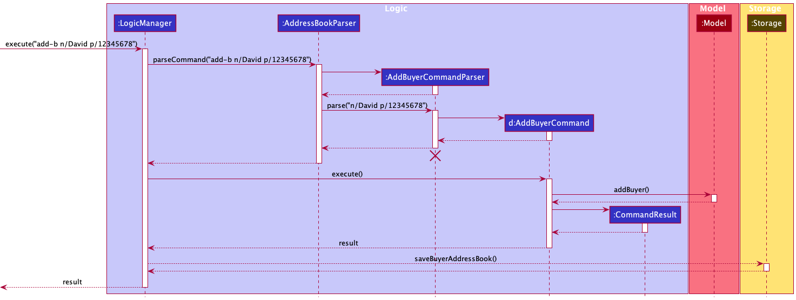

* Table of Contents
  {:toc}

--------------------------------------------------------------------------------------------------------------------

## **Acknowledgements**

* `HouseType` enum methods adapted [here](https://github.com/WJunHong/ip/blob/master/src/main/java/chibot/commands/Keywords.java) with modifications.

--------------------------------------------------------------------------------------------------------------------

## **Design**

<div markdown="block" class="alert alert-info">

**:information_source: Notes about the command format and terminology:**<br>

* The usage of the term `CLIENT` in this guide is general, and represents each Client entity: Buyer, Seller.

* Inputs in `UPPER_CASE` are inputs to be supplied by the user.<br>
  e.g. In `add-b n/NAME`, `NAME` is an input such as `add-b n/Chok Hoe`.

* Items in square brackets are optional inputs.<br>
  e.g In `n/NAME [t/TAG]`, the user can input `n/Chok Hoe t/funny` or simply `n/Chok Hoe`.

</div>  

### Architecture


The ***Architecture Diagram*** given above explains the high-level design of the App.

Given below is a quick overview of main components and how they interact with each other.

**Main components of the architecture**

**`Main`** has two classes called [`Main`](https://github.com/se-edu/addressbook-level3/tree/master/src/main/java/seedu/address/Main.java) and [`MainApp`](https://github.com/se-edu/addressbook-level3/tree/master/src/main/java/seedu/address/MainApp.java). It is responsible for,
* At app launch: Initializes the components in the correct sequence, and connects them up with each other.
* At shut down: Shuts down the components and invokes cleanup methods where necessary.

[**`Commons`**](#common-classes) represents a collection of classes used by multiple other components.

The rest of the App consists of four components.

* [**`UI`**](#ui-component): The UI of the App.
* [**`Logic`**](#logic-component): The command executor.
* [**`Model`**](#model-component): Holds the data of the App in memory.
* [**`Storage`**](#storage-component): Reads data from, and writes data to, the hard disk.


**How the architecture components interact with each other**

The *Sequence Diagram* below shows how the components interact with each other for the scenario where the user issues the command `delete-b 1`.


Each of the four main components (also shown in the diagram above),

* defines its *API* in an `interface` with the same name as the Component.
* implements its functionality using a concrete `{Component Name}Manager` class (which follows the corresponding API `interface` mentioned in the previous point.

For example, the `Logic` component defines its API in the `Logic.java` interface and implements its functionality using the `LogicManager.java` class which follows the `Logic` interface. Other components interact with a given component through its interface rather than the concrete class (reason: to prevent outside component's being coupled to the implementation of a component), as illustrated in the (partial) class diagram below.


The sections below give more details of each component.

### UI component

The **API** of this component is specified in [`Ui.java`](https://github.com/se-edu/addressbook-level3/tree/master/src/main/java/seedu/address/ui/Ui.java)


The UI consists of a `MainWindow` that is made up of parts e.g.`CommandBox`, `ResultDisplay`, `clientListPanel`, `StatusBarFooter` etc. All these, including the `MainWindow`, inherit from the abstract `UiPart` class which captures the commonalities between classes that represent parts of the visible GUI.

The `UI` component uses the JavaFx UI framework. The layout of these UI parts are defined in matching `.fxml` files that are in the `src/main/resources/view` folder. For example, the layout of the [`MainWindow`](https://github.com/se-edu/addressbook-level3/tree/master/src/main/java/seedu/address/ui/MainWindow.java) is specified in [`MainWindow.fxml`](https://github.com/se-edu/addressbook-level3/tree/master/src/main/resources/view/MainWindow.fxml)

The `UI` component,

* executes user commands using the `Logic` component.
* listens for changes to `Model` data so that the UI can be updated with the modified data.
* keeps a reference to the `Logic` component, because the `UI` relies on the `Logic` to execute commands.
* depends on some classes in the `Model` component, as it displays `client` object residing in the `Model`.

### Logic component

**API** : [`Logic.java`](https://github.com/se-edu/addressbook-level3/tree/master/src/main/java/seedu/address/logic/Logic.java)

Here's a (partial) class diagram of the `Logic` component:


How the `Logic` component works:
1. When `Logic` is called upon to execute a command, it uses the `AddressBookParser` class to parse the user command.
1. This results in a `Command` object (more precisely, an object of one of its subclasses e.g., `AddCommand`) which is executed by the `LogicManager`.
1. The command can communicate with the `Model` when it is executed (e.g. to add a client).
1. The result of the command execution is encapsulated as a `CommandResult` object which is returned back from `Logic`.

The Sequence Diagram below illustrates the interactions within the `Logic` component for the `execute("delete-b 1")` API call.


<div markdown="span" class="alert alert-info">:information_source: **Note:** The lifeline for `DeleteBuyerCommandParser` should end at the destroy marker (X) but due to a limitation of PlantUML, the lifeline reaches the end of diagram.
</div>

Here are the other classes in `Logic` (omitted from the class diagram above) that are used for parsing a user command:


How the parsing works:
* When called upon to parse a user command, the `AddressBookParser` class creates an `XYZCommandParser` (`XYZ` is a placeholder for the specific command name e.g., `AddBuyerCommandParser`) which uses the other classes shown above to parse the user command and create a `XYZCommand` object (e.g., `AddBuyerCommand`) which the `AddressBookParser` returns back as a `Command` object.
* All `XYZCommandParser` classes (e.g., `AddBuyerCommandParser`, `DeleteBuyerCommandParser`, ...) inherit from the `Parser` interface so that they can be treated similarly where possible e.g, during testing.

### Model component
**API** : [`Model.java`](https://github.com/se-edu/addressbook-level3/tree/master/src/main/java/seedu/address/model/Model.java)


The `Model` component,

<div markdown="span" class="alert alert-info">:information_source: Recall: the usage of the term `CLIENT` in this guide is general, and represents each Client entity: Buyer & Seller.
</div> 

* stores the address book data i.e., all `CLIENT` objects (which are contained in a `UniqueCLIENTList` object).
* stores the currently 'selected' `CLIENT` objects (e.g., results of a search query) as a separate _filtered_ list which is exposed to outsiders as an unmodifiable `ObservableList<CLIENT>` that can be 'observed' e.g. the UI can be bound to this list so that the UI automatically updates when data in the list changes.
* stores a `UserPref` object that represents the user’s preferences. This is exposed to the outside as a `ReadOnlyUserPref` object.
* does not depend on any of the other three components (as the `Model` represents data entities of the domain, they should make sense on their own without depending on other components)

Let's take a look at the internal structure of the `CLIENT` entity:


* all `CLIENT` objects (Buyer or Seller) have a name and phone number.
* `Buyer` has `PropertyToBuy` while `Seller` has `PropertyToSell`.

Now, what PropertyToBuy and PropertyToSell classes encapsulate:


<div markdown="span" class="alert alert-info">:information_source: Note that we have decided to treat these 2 property classes differently and NOT make them inherit an abstract `Property` class.
 This is because sellers know the exact property (and address of the property) that they are selling. One is more general while one is more specific.
 We can hence extend the code base more flexibly in the future if we remove some fields from PropertyToBuy or add more fields to PropertyToSell.
</div>  

### Storage component

**API** : [`Storage.java`](https://github.com/se-edu/addressbook-level3/tree/master/src/main/java/seedu/address/storage/Storage.java)


The `Storage` component,
* can save buyer address book data, seller address book date, and user preference data in json format, and read them back into corresponding objects.
* inherits from `BuyerAddressBookStorage`, `SellerAddressBookStorage` and `UserPrefStorage`, which means it can be treated as one of those (if only the functionality of only one is needed).
* depends on some classes in the `Model` component (because the `Storage` component's job is to save/retrieve objects that belong to the `Model`)

#### Design Consideration
1. Current Design: Having different storage for buyers and sellers


- Pros: Easier to implement as issues on one side will not affect issues on another. Moreover, when one json file is corrupted, the other json file can still be used.

- Cons: There will be lots of repetitive code.

2. Alternative: Use addressbook.json to contain both buyer and seller list
   
- Pros: Less repetitive code

- Cons: Another layer will be added in the json file, harder to debug and more prone to error.

### Common classes

Classes used by multiple components are in the `seedu.addressbook.commons` package.

--------------------------------------------------------------------------------------------------------------------

## **Implementation**

This section describes some noteworthy details on how certain features are implemented.


### Match feature

#### Implementation

We are currently implementing a Match feature. In implements the following operation:

* `match` —  Matches a Buyer to a List of Sellers.

Format: `match BUYER_INDEX`
* The fields are:
    * `BUYER_INDEX` - index of the Buyer that the user is trying to match with Sellers.
Example: `match 2`

Result:
* The list of sellers that match the buyer's demands will be displayed in the UI.

#### How match is going to be implemented

* The match command will match a Buyer with Sellers whose `PropertyToSell` matches the demands of the `PropertyToBuy` of the buyer.

* How match filters the sellers (How `PropertyToBuy` matches with `PropertyToSell`:

    -  If there exists a **price** where a buyer is willing to buy and seller is willing to sell for in their respective `buyRange` and `sellRange`, **AND**
    - Their `House` are equal (i.e, the `Location` and `HouseType` of the house matches)
        * The `Location` (case-insensitive) should be equal.
        * The `HouseType` of the properties are equal, OR
        * The buyer's `HouseType` is `UNSPECIFIED`, which means he is okay with any house type.

* An example:
    - buyer's `PropertyToBuy`(after `edit-b` or `add-b`) has `House`, and buyer is currently at *index 2* of UniqueBuyerList.
        - `Name`: *Janald*

        - PropertyToBuy:
            - `HouseType`: `BUNGALOW`,
            - `Location`: `Serangoon` and
            - `PriceRange`:(50 000, 100 000) in dollars

    - a certain seller has
        - `Name`: *Junhong*
        - `ProperyToSell`:
            - `House` with `HouseType`: `BUNGALOW` and `Location`: `Serangoon` as well
            - His `PriceRange` that he is willing to sell the property for is (99 999, 200 000)

    - In this case, the PropertyToBuy and PropertyToSell can match(same House, and 99 999 - 100 000 dollars is a matching price)
    - `match 2` will display the list of sellers that match the buyer *Janald*. As a result, *Junhong* will be one of the sellers displayed.

#### Why match should be implemented

* Our AgentSee application helps housing agents to keep track of their clients efficiently.
* Since there are so many buyers and sellers to keep track of, it would be useful for agents to automate the matching of buyers to sellers.
* The match feature will help agents filter and find a matching property that a buyer wants to buy and a seller wants to sell, which is of great convenience for agents to liase buyers with sellers.
* What buyers look for when buying a Property is its `Location`, `HouseType`, and they have a `PriceRange` they are willing to pay for. Therefore, we are implementing `match` such that these conditions are met.


#### Matching to other fields

* We can match buyers with other less strict conditions as well, in case a buyer just wants to take into account a specific criteria.
* For example, we can match buyers and sellers with matching:
    - HouseTypes only (example: `COLONIA`, Since buyers may be looking only for a specific HouseType, regardless of Location)
    - Location only (example: `Toa Payoh`, Since some buyers may like to buy a Property at a specific area, regardless of other conditions)
    - PriceRange only (Since buyers may just be looking for properties in their buy range)

* As such, we have a more flexible match feature which would be ideal for agents to match based on their dynamic client demands.


### Add Buyer feature
The `add-b` command mechanism uses similar interactions as shown in the [Logic Component](#logic-component). Mainly, it can be broken down into these steps:

**Step 1:**

The user types input E.g. `add-b n/David p/12345678` into the `CommandBox` (See [UI component](#ui-component) for more info on `CommandBox`)

**Step 2:**

The `execute(input)` method of `LogicManager`, a subclass of the Logic component, is called with the given input.
An instance of the `AddressBookParser` will begin to parse the input into 2 main sections: the **command**
and the **body** of the command.

The main job of `AddressBookParser` at this step is to identify the `add-b` **command** which was supplied as the 1st word in the input string.

After which, control is handed over to the `AddBuyerCommandParser` component by calling its `AddBuyerCommandParser#parse(body)` method to parse the **body** which was separated out.

**Step 3:**

`AddBuyerCommandParser#parse(body)` verifies if required fields for `add-b` are present.

In our example, since `n/David p/12345678` was included, all required fields are present.

At this step, the new `Buyer` will have been successfully created. A new `AddBuyerCommand` with the Buyer is returned to the `AddressBookParser` to the `LogicManager`

**Step 4:**

The `LogicManager` component then calls `AddBuyerCommand#execute(model)`method of the new `AddBuyerCommand`instance containing the Buyer, with the `Model`component created from [Model component](#model-component).

In this method, if the Buyer does not currently already reside in the application, he/she is added into the Model through the `Model#addBuyer(Buyer)` command and stored in the Model.

(Refer to [Model component](#model-component) to see how Buyers are stored into the model)

A new `CommandResult` representing the successful `add-b` command is initialized and returned.

**Step 5:**

`LogicManager` component will then attempt to update the storage with this new `Model` through the `Storage#saveBuyerAddressBook()` method.

**Step 6:**

Finally, the `CommandResult`is returned to be displayed by `UI` component (Refer to [Architecture](#architecture))

The following Sequence Diagrams summarizes the various steps involved:




### 2. `editbuyer` / `For full details on implementation, check out this [link](https://github.com/AY2122S2-CS2103T-T11-2/tp/tree/master/src/main/java/seedu/address/logic)
editseller` feature
The `editbuyer` / `editseller` command mechanism uses a similar interactions as shown in the [Logic Component](). Mainly, it can be broken down into these steps:
#### Syntax:
```editbuyer [index] n/... p/... t/... prop/ h/... l/... pr/...```

```editseller [index] n/... p/... t/... prop/ h/... l/... pr/...```

Note: All the prefix (like n/, p/, ...) are <b>optional</b>, you could omit any of them but at least one prefix should be provided, and the <b>order</b> of prefix does not matter.

Below are some detailed steps while executing `editbuyer` / `editseller` command:

**We use ```editbuyer``` command as an example, the other command's flow are similar to this command as well.**

---

**Step 1:**

The user types input E.g. `editbuyer 1 n/Chua` into the `CommandBox`

**Step 2:**

Once the user hit Enter,  the  `LogicManager` calls `execute` that takes in everything user typed.
Then, `AddressBookParser` will investigate the user's input. It will takes the first keyword: `editbuyer` and
call the corresponding `EditBuyerCommandParser::parse` by providing the **arguments** (anything after than first word) from user input

**Step 3:**

`EditBuyerCommandParser` parse the argument provided and check the validity of the arguments. If any argument provided
is not valid, an error will be shown the command won't be executed.

In our example, `1 n/Chua` was provided, the index and at least one require prefix are given, so it is a valid argument.

**Step 4:**

Now the `AddressBookParser` returns `EditBuyerCommand` as ``CommandResult``, the `LogicManager` then calls
`CommandResult::execute`.

**Step 5:**

Now the `EditBuyerCommand` will execute and do the work, that is updating the corresponding information from the given
index. A `CommandResult` containing the successful execution result is returned.

**Note:** The validity of the index will be check at this time, if the index is out of bound, the error will be shown
and the edit command will not be executed.

**Step 6:**

`LogicManager` component will then update the storage with the edited `Model` through the
`Storage#saveBuyerAddressBook()` method.

**Step 7:**

Finally, the `CommandResult` is returned to be displayed by `UI` component (Refer to [Architecture](#architecture))

The Sequence Diagrams below summarizes the various steps involved:


---

### Add property for buyer feature
The `add-ptb` command uses a similar mechanism as the `add-b` command mentioned [above](#add-buyer-feature), with the following differences:

1. An index needs to be specified along with the necessary fields
   E.g. `add-ptb 1 h/condo l/Serangoon pr/400000,900000`
2. The Parser (`AddPropertyToBuyCommandParser`) checks if the position parsed in is valid (Greater than equal to 1 and Smaller than or equal to the size of the displayed buyer list).
3. The updated buyer remains in the same position as before.

Alternatives considered:

- Given the time, the add property to buy feature can be integrated with the `add-b` command to allow users to add properties with the buyer,
  instead of doing it in 2 commands.
    - Pros:
        - More flexibility for experienced users
    - Cons:
        - More code to implement and test
- Allow for certain fields to be **optional** if a buyer is yet to give the user the information, but they still wish to add a property first
    - Pros:
        - More flexible design
    - Cons:
        - Hard to implement
        - Error prone

### `sort` feature

The sort feature allows the user to sort the buyers and sellers by name or time in ascending or descending order.

Due to the symmetric nature of the command for buyer and seller, only `sort-b` will be discussed.


Given below is the steps and the sequence diagram for execution of `execute("sort-b by/time o/asc")`


**Step 1:**
The user types input E.g.  `sort-b by/time o/asc` into the `CommandBox` (See [UI component](#ui-component) for more info on `CommandBox`)


**Step 2:**
`AddressBookParser` will check if the command is a sort buyer command. The `AddressbookParser` will then create a `SortBuyerCommandParser`

**Step 3:**
`SortBuyerCommandParser` then checks whether all the prefixes are present and whether the compared item are sortable, and whether the order belongs to either `asc` or `desc`. If yes, a `SortBuyerCommand` is returned.

**Step 2:**
The `execute(model)` method of `SortBuyerCommand` is being called.

**Step 3:**
The `sortFilteredBuyerList(time, asc)` method of `model` is being called, which in turn calls `sortFilteredBuyerList(time, asc)` method of `BuyerAddressBook`, which in turn calls `sortBuyers(time, asc)` from its own copy of `UniqueBuyerList`.


**Step 4:**
The `sortBuyers(time, asc)` alters the `UniqueBuyerList`'s `internalList` permanently and sorts it by the compared item and by the given order.


**Step 5:**
Finally, a `CommandResult` with the relevant feedback is returned to the `LogicManager`.

The following Sequence Diagrams summarizes the various steps involved:


Design Considerations:
Current Design: The structure of internal list change permanently, and instead of passing the comparator, the `comparedItem` and `order` are passed around in every method call.

**Pros:**
- It alters the internal list completely, so that the app 'saves' users last sorting option.
- Easier to implement to pass the `comparedItem` and `order` are around.

**Cons:**
- Some people might not want the sorted result to be saved.
- `comparedItem` and `order` will be passed in many layers before reaching  the `internalList`, less abstraction.

Alternative 1: Sort the list temporarily and maintain the original list in the chronological order.

**Pros:**
- The functionality seems more natural: when you sort something you might not want the structure of the `internalList` to change permanently.

**Cons:**
- Harder to implement, needs to change the `FilteredList` to `SortedList` in `ModelManager`.


Alternative 2: Pass a comparator along instead of `comparedItem` and `order`

**Pros:**
- Better abstraction, easier to maintain

**Cons:**
- Harder to implement, not efficient for sort with limited options.


### \[Proposed\] Undo/redo feature

#### Proposed Implementation

The proposed undo/redo mechanism is facilitated by `VersionedClientAddressBook`. It extends `ClientAddressBook` with an undo/redo history, stored internally as an `addressBookStateList` and `currentStatePointer`. Additionally, it implements the following operations:

* `VersionedClientAddressBook#commit()` — Saves the current address book state in its history.
* `VersionedClientAddressBook#undo()` — Restores the previous address book state from its history.
* `VersionedClientAddressBook#redo()` — Restores a previously undone address book state from its history.

These operations are exposed in the `Model` interface as `Model#commitClientAddressBook()`, `Model#undoClientAddressBook()` and `Model#redoClientAddressBook()` respectively.

Given below is an example usage scenario and how the undo/redo mechanism behaves at each step.

Step 1. The user launches the application for the first time. The `VersionedClientAddressBook` will be initialized with the initial address book state, and the `currentStatePointer` pointing to that single address book state.


Step 2. The user executes `delete-b/delete-s 5` command to delete the 5th client in the address book. The `delete-b/s` command calls `Model#commitClientAddressBook()`, causing the modified state of the address book after the `delete 5` command executes to be saved in the `clientAddressBookStateList`, and the `currentStatePointer` is shifted to the newly inserted address book state.


Step 3. The user executes `add-b/s n/David …​` to add a new client. The `add-b/s` command also calls `Model#commitClientAddressBook()`, causing another modified address book state to be saved into the `clientAddressBookStateList`.


<div markdown="span" class="alert alert-info">:information_source: **Note:** If a command fails its execution, it will not call `Model#commitClientAddressBook()`, so the address book state will not be saved into the `clientAddressBookStateList`.

</div>

Step 4. The user now decides that adding the client was a mistake, and decides to undo that action by executing the `undo` command. The `undo` command will call `Model#undoClientAddressBook()`, which will shift the `currentStatePointer` once to the left, pointing it to the previous address book state, and restores the address book to that state.


<div markdown="span" class="alert alert-info">:information_source: **Note:** If the `currentStatePointer` is at index 0, pointing to the initial AddressBook state, then there are no previous AddressBook states to restore. The `undo` command uses `Model#canUndoAddressBook()` to check if this is the case. If so, it will return an error to the user rather
than attempting to perform the undo.

</div>

The following sequence diagram shows how the undo operation works:


<div markdown="span" class="alert alert-info">:information_source: **Note:** The lifeline for `UndoCommand` should end at the destroy marker (X) but due to a limitation of PlantUML, the lifeline reaches the end of diagram.

</div>

The `redo` command does the opposite — it calls `Model#redoAddressBook()`, which shifts the `currentStatePointer` once to the right, pointing to the previously undone state, and restores the address book to that state.

<div markdown="span" class="alert alert-info">:information_source: **Note:** If the `currentStatePointer` is at index `addressBookStateList.size() - 1`, pointing to the latest address book state, then there are no undone AddressBook states to restore. The `redo` command uses `Model#canRedoClientAddressBook()` to check if this is the case. If so, it will return an error to the user rather than attempting to perform the redo.

</div>

Step 5. The user then decides to execute the command `list`. Commands that do not modify the address book, such as `list`, will usually not call `Model#commitClientAddressBook()`, `Model#undoClientAddressBook()` or `Model#redoClientAddressBook()`. Thus, the `clientAddressBookStateList` remains unchanged.


Step 6. The user executes `clear`, which calls `Model#commitAddressBook()`. Since the `currentStatePointer` is not pointing at the end of the `addressBookStateList`, all address book states after the `currentStatePointer` will be purged. Reason: It no longer makes sense to redo the `add-b/s n/David …​` command. This is the behavior that most modern desktop applications follow.


The following activity diagram summarizes what happens when a user executes a new command:


#### Design considerations:

**Aspect: How undo & redo executes:**

* **Alternative 1 (current choice):** Saves the entire address book.
    * Pros: Easy to implement.
    * Cons: May have performance issues in terms of memory usage.

* **Alternative 2:** Individual command knows how to undo/redo by
  itself.
    * Pros: Will use less memory (e.g. for `delete-b/s`, just save the client being deleted).
    * Cons: We must ensure that the implementation of each individual command are correct.

_{more aspects and alternatives to be added}_

### Clear buyer list/Clear seller list

#### Implementation

We are currently implementing a clear buyer list and clear seller list function.
#### Syntax:
- `clear-b` - clears the buyer list
- `clear-s` - clears the seller list
- `clear-all` - clears both lists

#### Result:
- specified list is cleared without affecting the other list

#### Implementation of clear buyer and clear seller
The contents of the buyer list and/or the seller list in `model` is cleared.
This is done by setting a new `BuyerAddressBook` and/or `SellerAddressBook` in our model.

#### Why is it implemented this way
The user has more options to selectively clear specified books in contrast to AB3 where the old `clear` command clears the entire addressbook without discretion.

#### Alternatives
A copy of the uncleared list is kept, next the content of the whole addressbook can be cleared by using `clear-all`, followed by loading of the uncleared content.

### Find buyer/Find seller

#### Syntax:
- `find-b DELIMITER/KEYWORD [MORE_KEYWORDS]`
- `find-s DELIMITER/KEYWORD [MORE_KEYWORDS]`

Examples:
- `find-b n/junhong junheng` searches for buyers with junhong or junheng in their name
- `find-s h/hdb 5room` searches for sellers whose house types has HDB and 5 room in their name (i.e. 5 room HDB).

#### Result:
returns a filtered list of sellers or buyers

#### Implementation of find buyer and find seller

The `find-s` and `find-b` command first goes through parsing by `FindBuyerCommandParser` or `FindSellerCommandParser`, parsing the DELIMITER and keywords to create a predicate. For example, inputting `find-b l/Bishan` creates a `BuyerLocationContainsKeywordPredicate` predicate with KEYWORDS as parameters.

Next, said predicate is passed into `FindBuyerCommand` or `FindSellerCommand`. This function would then call `updateFilteredSellerList` or `updateFilteredBuyerList` of `model` and filters the list based on the given predicate. The commands then calls `getFilteredSellerList` or `getFilteredBuyerList`
in order to return the filtered list of sellers or buyers, whichever specified by the command.

#### Why is it implemented this way
Having a seperate buyer and seller list means we need to seperate the find command into find buyer and find seller in order to filter the desired list. Having seperate address books helps in this regard as the version of `getFilteredBuyerList` or `getFilteredSellerList` can be used.

### List buyer/List seller

#### Syntax:
- `list-b`
- `list-s`

Examples:
- `list-b` lists all current buyers
- `list-s` lists all current sellers
-
#### Result:
returns an unfiltered list of sellers or buyers

#### Implementation of list buyer and list seller
The `updateFilteredBuyerList` or `updateFilteredSellerList` of `model` is called, with parameters `PREDICATE_SHOW_ALL_BUYERS`. This will list the unfiltered buyer or seller list, whichever specified

#### Why is it implemented this way
Having a seperate buyer and seller list means we need to seperate the list command into list buyer and list seller in order to show the desired list. Having seperate address books helps in this regard as the version of `updateFilteredBuyerList` or `updateFilteredSellerList` can be used.


--------------------------------------------------------------------------------------------------------------------

## **Documentation, logging, testing, configuration, dev-ops**

* [Documentation guide](Documentation.md)
* [Testing guide](Testing.md)
* [Logging guide](Logging.md)
* [Configuration guide](Configuration.md)
* [DevOps guide](DevOps.md)

--------------------------------------------------------------------------------------------------------------------

## **Appendix: Requirements**

### Product scope

**Target user profile**:

* real estate agent
* has a need to manage clients in an organized fashion
* mainly uses desktop for work
* prefers typing to mouse interactions
* is reasonably comfortable using CLI apps

**Value proposition**: Able to keep track of client's preferences, housing details and budget


### User stories

Priorities: High (must have) - `* * *`, Medium (nice to have) - `* *`, Low (unlikely to have) - `*`

| Priority | As a …​                                    | I want to …​                                                                     | So that I can…​                                                        |
|----------|--------------------------------------------|----------------------------------------------------------------------------------|------------------------------------------------------------------------|
| `* * *`  | new user                                   | see usage instructions                                                           | refer to instructions when I forget how to use the App                 |
| `* * *`  | user                                       | add a new client                                                                 |                                                                        |
| `* * *`  | user                                       | delete a client                                                                  | remove entries that I no longer need                                   |
| `* * *`  | user                                       | find a client by name                                                            | locate details of clients without having to go through the entire list |
| `* *`    | user                                       | hide private contact details                                                     | minimize chance of someone else seeing them by accident                |
| `*`      | user with many clients in the address book | sort clients by name                                                             | locate a client easily                                                 |
| Priority | As a …​                                    | I want to …​                                                                     | So that I can…​                                                        |
| `* * *`  | housing agent with many clients            | view client details fast                                                         | can deal with customers easily when they contact me                    |
| `* * *`  | housing agent                              | add a new client quickly with a quick description                                | update my client list efficiently                                      |
| `* * *`  | housing agent                              | see relevant information about my clients                                        | understand their needs                                                 |
| `* * *`  | housing agent                              | edit my client data                                                              | stay in touch with their changing needs                                |
| `* * *`  | housing agent                              | delete a client when their house has been sold or after they have bought a house | not mix up information in the future                                   |
| `* * *`  | housing agent                              | access some of my favourite clients quickly                                      | always focus on them                                                   |
| `* * *`  | housing agent                              | "tag" my clients with custom text                                                | remember every client easily                                           |
| `* * *`  | housing agent with too many clients        | be able to find a client by name                                                 | locate them easily and quickly                                         |
| `* *`    | housing agent                              | have access to my search history                                                 | look up my recently contacted clients                                  |
| `* *`    | new user                                   | have a quick guide to start me off                                               | learn how to use the application                                       |
| `* *`    | housing agent                              | check my important deadlines                                                     | avoid missing important meetings with my clients                       |


*{More to be added}*

### Use cases

(For all use cases below, the **System** is `AgentSee` and the **Actor** is the `user`, unless specified otherwise)


**Use case: Delete a seller**

**MSS**

1. User requests to list sellers
2. System shows a list of sellers
3. User requests to delete a specific seller in the list
4. System deletes the seller

Use case ends

**Extensions**

* 3a. System detects an error in User input.
    * 3a1. System shows an error message.

      Use case resumes from step 3.

**Use case: Add a seller**

**MSS**

1.  User types in seller information
2.  System adds the new seller

Use case ends

**Extensions**

* 1a. System detects an error in User input.

    * 1a1. System shows an error message.

      Use case resumes from step 1.

*{More to be added}*


### Non-Functional Requirements


1.  Should work on any _mainstream OS_ as long as it has Java `11` or above installed.
2.  Should be able to hold up to 1000 clients without a noticeable sluggishness in performance for typical usage.
3.  A user with above average typing speed for regular English text (i.e. not code, not system admin commands) should be able to accomplish most of the tasks faster using commands than using the mouse.
1.  Essential: Technical: Should work on any _mainstream OS_ as long as it has Java `11` or above installed.
2.  Typical: Performance: Should be able to hold up to 1000 clients without a noticeable sluggishness in performance for typical usage.
3.  Typical: A user with above average typing speed for regular English text (i.e. not code, not system admin commands) should be able to accomplish most of the tasks faster using commands than using the mouse.
4.  Essential" Technical: Should work on both 32-bit and 64-bit environments.
5.  Novel: Quality: Should be usable by a novice who is not extremely tech savvy.
6.  Typical: Scalability: Features and improvements should be easy to implement iteratively.
6.  Typical: Constraints: Minimal mouse clicking to interact with Ui.
7.  Essential: Process requirements: the project is expected to adhere to a schedule that delivers a feature set according to the module requirements.
8.  Typical: Business/domain: Clients should be unique; they cannot have the exact same fields.
9.  Notes about project scope: the product is not required to handle any sort of physical printing (e.g client list hardcopy).
10. Typical: Disaster recovery: If user makes a mistake on his client list, he should be able to recover from the mistake quickly without too much stress.


*{More to be added}*

### Glossary

* **Mainstream OS**: Windows, Linux, Unix, OS-X
* **Private contact detail**: A contact detail that is not meant to be shared with others
* **Real estate agent**: Agent who is the medium that manages clients, and is the target persona for our product.
* **Client**: `Buyers` who is looking to buy their property and `Sellers` who is looking to sell their property.
* **Address**: Address of the Property that Sellers are trying to sell.
* **Property**: The property that the buyer is looking to buy/ seller is looking to sell.

--------------------------------------------------------------------------------------------------------------------

## **Appendix: Instructions for manual testing**

Given below are instructions to test the app manually.

<div markdown="span" class="alert alert-info">:information_source: **Note:** These instructions only provide a starting point for testers to work on;
testers are expected to do more *exploratory* testing.

</div>

### Launch and shutdown

1. Initial launch

    1. Download the jar file and copy into an empty folder
    2. Run `java -jar addressbook.jar` in the directory containing the jar file.
    3. Alternatively, double-click the jar file Expected: Shows the GUI with a set of sample contacts. The window size may not be optimum.

1. Saving window preferences

    1. Resize the window to an optimum size. Move the window to a different location. Close the window.

    1. Re-launch the app by double-clicking the jar file.<br>
       Expected: The most recent window size and location is retained.


### Saving data

1. Dealing with missing/corrupted data files
    
   example JSON format of the `buyeraddressbook.json`  and `selleraddressbook`:


   ```buyeraddressbook.json```:
    
    ```
    {
      "buyers" : [ {
        "name" : "Shi Hong",
        "phone" : "12345678",
        "appointment" : "2022-03-31-17-00",
        "tagged" : [ "smart" ],
        "propertyToBuy" : {
          "house" : {
            "houseType" : "Bungalow",
            "location" : "clementi"
          },
          "priceRange" : {
            "lower" : "500000",
            "upper" : "600000"
          }
        }
      }, {
        "name" : "Jun Hong",
        "phone" : "87654321",
        "appointment" : "",
        "tagged" : [ ],
        "propertyToBuy" : null
      }
    }
    ```

   ```selleraddressbook.json```:

    ```
    {
      "sellers" : [ {
        "name" : "chua",
        "phone" : "1234",
        "appointment" : "",
        "tagged" : [ "tag1", "tag2" ],
        "propertyToSell" : {
          "house" : {
            "houseType" : "Bungalow",
            "location" : "cueens town"
          },
          "priceRange" : {
            "lower" : "24",
            "upper" : "48"
          },
          "address" : "Utown"
        }
      }, {
        "name" : "Ben Leong",
        "phone" : "87654321",
        "appointment" : "",
        "tagged" : [ "friendly" ],
        "propertyToSell" : null
      }
    }
    ```


   1. Any of the following situation will cause the file to be broken and will start with empty buyer address book/ seller address book:
   - The `"sellers"`/`"buyers"` tag is spelled wrongly
   - The bracket `{` and `}`is not closed well
   - the `"name"` /`phone `/ `appointment` is `null`
   - The format of the `name` is incorrect, i.e. chua@hong, pikaso_lim...
   - The format of the `phone` is incorrect, i.e. not a number format, less than 3 digits
   - The format of the appointment is incorrect, i.e. not in the correct form yyyy-MM-dd-HH-mm (This will not let the app start correctly)
   - The `"tagged"` field is not covered with `[` and `]`
   - The `"propertyToBuy"`/`"propertyToSell"` format is wrong,correct format should be either `null` or JSON format as shown above.
     - If `"houseType"` is put `null` (It is considered as corrupted file and the app would not start).
     - `"priceRange"`:
     
     `"lower"` is more than `"upper"` value, i.e. `"lower"` > `"upper"`
   

