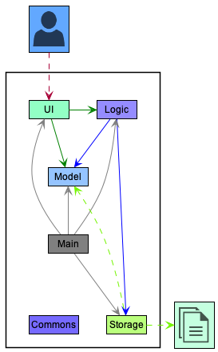
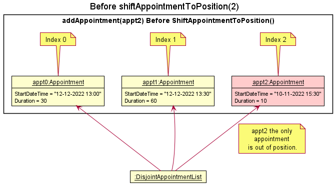
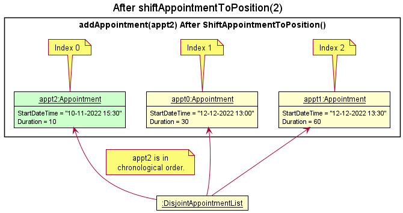
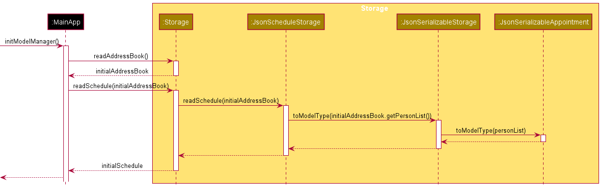
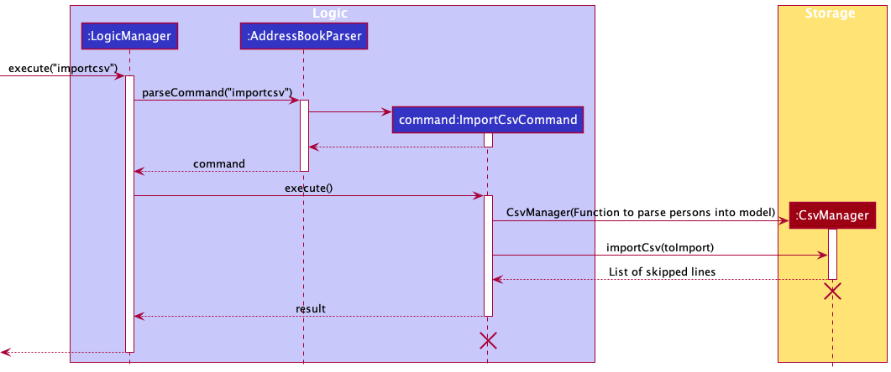
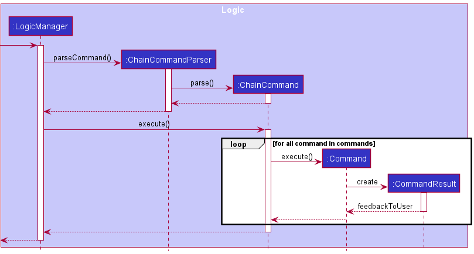

* Table of Contents
{:toc}

--------------------------------------------------------------------------------------------------------------------

## **Acknowledgements**

* {list here sources of all reused/adapted ideas, code, documentation, and third-party libraries -- include links to the original source as well}

--------------------------------------------------------------------------------------------------------------------

## **Setting up, getting started**

Refer to the guide [_Setting up and getting started_](SettingUp.md).

--------------------------------------------------------------------------------------------------------------------

## **Design**

:bulb: **Tip:** The `.puml` files used to create diagrams in this document can be found in the [diagrams](https://github.com/AY2122S2-CS2103-W17-1/tp/tree/master/docs/diagrams/) folder. Refer to the [_PlantUML Tutorial_ at se-edu/guides](https://se-education.org/guides/tutorials/plantUml.html) to learn how to create and edit diagrams.

### Architecture

The ***Architecture Diagram*** given above explains the high-level design of the App.

Given below is a quick overview of main components and how they interact with each other.

**Main components of the architecture**

**`Main`** has two classes called [`Main`](https://github.com/AY2122S2-CS2103-W17-1/tp/tree/master/src/main/java/seedu/contax/Main.java) and [`MainApp`](https://github.com/AY2122S2-CS2103-W17-1/tp/tree/master/src/main/java/seedu/contax/MainApp.java). It is responsible for,
* At app launch: Initializes the components in the correct sequence, and connects them up with each other.
* At shut down: Shuts down the components and invokes cleanup methods where necessary.

[**`Commons`**](#common-classes) represents a collection of classes used by multiple other components.

The rest of the App consists of four components.

* [**`UI`**](#ui-component): The UI of the App.
* [**`Logic`**](#logic-component): The command executor.
* [**`Model`**](#model-component): Holds the data of the App in memory.
* [**`Storage`**](#storage-component): Reads data from, and writes data to, the hard disk.

**How the architecture components interact with each other**

The *Sequence Diagram* below shows how the components interact with each other for the scenario where the user issues the command `delete 1`.

Each of the four main components (also shown in the diagram above),

* defines its *API* in an `interface` with the same name as the Component.
* implements its functionality using a concrete `{Component Name}Manager` class (which follows the corresponding API `interface` mentioned in the previous point.

For example, the `Logic` component defines its API in the `Logic.java` interface and implements its functionality using the `LogicManager.java` class which follows the `Logic` interface. Other components interact with a given component through its interface rather than the concrete class (reason: to prevent outside component's being coupled to the implementation of a component), as illustrated in the (partial) class diagram below.

The sections below give more details of each component.

### UI component

The **API** of this component is specified in [`Ui.java`](https://github.com/AY2122S2-CS2103-W17-1/tp/tree/master/src/main/java/seedu/contax/ui/Ui.java)

The UI consists of a `MainWindow` that is made up of parts e.g.`CommandBox`, `ResultDisplay`, `PersonListPanel`, `StatusBarFooter` etc. All these, including the `MainWindow`, inherit from the abstract `UiPart` class which captures the commonalities between classes that represent parts of the visible GUI.

The `UI` component uses the JavaFx UI framework. The layout of these UI parts are defined in matching `.fxml` files that are in the `src/main/resources/view` folder. For example, the layout of the [`MainWindow`](https://github.com/AY2122S2-CS2103-W17-1/tp/tree/master/src/main/java/seedu/contax/ui/MainWindow.java) is specified in [`MainWindow.fxml`](https://github.com/AY2122S2-CS2103-W17-1/tp/tree/master/src/main/resources/view/MainWindow.fxml)

The `UI` component,

* executes user commands using the `Logic` component.
* listens for changes to `Model` data so that the UI can be updated with the modified data.
* keeps a reference to the `Logic` component, because the `UI` relies on the `Logic` to execute commands.
* depends on some classes in the `Model` component, as it displays `Person` object residing in the `Model`.

### Logic component

**API** : [`Logic.java`](https://github.com/AY2122S2-CS2103-W17-1/tp/tree/master/src/main/java/seedu/contax/logic/Logic.java)

Here's a (partial) class diagram of the `Logic` component:

How the `Logic` component works:
1. When `Logic` is called upon to execute a command, it uses the `AddressBookParser` class to parse the user command.
1. This results in a `Command` object (more precisely, an object of one of its subclasses e.g., `AddCommand`) which is executed by the `LogicManager`.
1. The command can communicate with the `Model` when it is executed (e.g. to add a person).
1. The result of the command execution is encapsulated as a `CommandResult` object which is returned back from `Logic`.

The Sequence Diagram below illustrates the interactions within the `Logic` component for the `execute("delete 1")` API call.

:information_source: **Note:** The lifeline for `DeleteCommandParser` should end at the destroy marker (X) but due to a limitation of PlantUML, the lifeline reaches the end of diagram.

Here are the other classes in `Logic` (omitted from the class diagram above) that are used for parsing a user command:

How the parsing works:
* When called upon to parse a user command, the `AddressBookParser` class creates an `XYZCommandParser` (`XYZ` is a placeholder for the specific command name e.g., `AddCommandParser`) which uses the other classes shown above to parse the user command and create a `XYZCommand` object (e.g., `AddCommand`) which the `AddressBookParser` returns back as a `Command` object.
* All `XYZCommandParser` classes (e.g., `AddCommandParser`, `DeleteCommandParser`, ...) inherit from the `Parser` interface so that they can be treated similarly where possible e.g, during testing.

### Model component
**API** : [`Model.java`](https://github.com/AY2122S2-CS2103-W17-1/tp/tree/master/src/main/java/seedu/contax/model/Model.java)

The `Model` component,

* stores the address book data i.e., all `Person` objects (which are contained in a `UniquePersonList` object).
* stores the currently 'selected' `Person` objects (e.g., results of a search query) as a separate _filtered_ list which is exposed to outsiders as an unmodifiable `ObservableList<Person>` that can be 'observed' e.g. the UI can be bound to this list so that the UI automatically updates when the data in the list change.
* stores the schedule data i.e., all `Appointment` objects (which are contained in a `DisjointAppointmentList` object).
* store the tag data i.e., all `Tag` objects (which are contained in a `UniqueTagList` object).
* stores a `UserPref` object that represents the user’s preferences. This is exposed to the outside as a `ReadOnlyUserPref` objects.
* does not depend on any of the other three components (as the `Model` represents data entities of the domain, they should make sense on their own without depending on other components)

:information_source: **Note:** An alternative (arguably, a more OOP) model is given below. It has a `Tag` list in the `AddressBook`, which `Person` references. This allows `AddressBook` to only require one `Tag` object per unique tag, instead of each `Person` needing their own `Tag` objects. 

Within the `model` package, there also exists an `IndexedCsvFile` model that helps with the parsing of CSV files for the Import CSV function. However, the class does not maintain any persistent instances, and does not fit within the model component diagram, serving solely as a helper model.

### Storage component

**API** : [`Storage.java`](https://github.com/AY2122S2-CS2103-W17-1/tp/tree/master/src/main/java/seedu/contax/storage/Storage.java)

The `Storage` component,
* can save both address book data and user preference data in json format, and read them back into corresponding objects.
* inherits from both `AddressBookStorage` and `UserPrefStorage`, which means it can be treated as either one (if only the functionality of only one is needed).
* depends on some classes in the `Model` component (because the `Storage` component's job is to save/retrieve objects that belong to the `Model`)

Within the `storage` package, there also exists a `CsvManager` class that is a helper that provides file IO related operations for working with CSV files. It is used in the Import CSV or Export CSV features. This class does not fit within the storage component diagram as it does not interact with any other classes, serving solely as a helper class.

### Common classes

Classes used by multiple components are in the `seedu.contax.commons` package.

### AddressBook and Schedule Subsystems

Departing from the 4-component architectural view of the system, the App can also be logically partitioned into 3 distinct subsystems based on functionality.
These subsystems are namely the:

* Address Book Subsystem
* Schedule Subsystem
* Command Parsing, Processing and Display Subsystem

Functionally, the Address Book and Schedule subsystem are near identical copies of each other, with the exception being the type of data being managed and the
logic specific to each type of data. They serve the the same purpose of storing and managing data related to Contacts and Appointments respectively, and are hence structured similarly across the 4 architectural components, with similar flows for equivalent operations (E.g. `deletePerson` and `deleteAppointment`).

As such, the detailed descriptions for the Address Book subsystem above can be translated to equivalents for the Schedule subsystem.

--------------------------------------------------------------------------------------------------------------------

## **Implementation**

This section describes some noteworthy details on how certain features are implemented.

### Tag Management

This section will describe tag management in the address book as well as the features implemented.

### Centralising Tags in the Address Book

In the previous implementation, all `Tag` objects are independent of one another despite having the same tag names. To improve the usability of the address book, the tags are centralised so that the user can easily manage them as well as searching for `Person` objects that contain the tag.
This is done by creating a `UniqueTagList` within `AddressBook` which will store all tags that were created by the user. Whenever a command relating to `Tag` is executed, it will not only apply the changes to the `Tag` in the `UniqueTagList` but will also propagate these changes to the relevant `Person`s who contain the specified tag.
All operations relating to the `Tag` objects are done at the `AddressBook` level to ensure that the `Tag` objects and `Person` objects are properly synchronised.

Another benefit that comes with the centralised tag list is that the user can maintain tags even if it is not associated with any `Person` objects. The rationale to maintain `Tag` separately is to allow the user to reuse the tag depending on their workflow (i.e. A user may want to maintain the `prospective clients` tag even if he/she currently does not have any prospective clients.)

### Edit Tag Feature - `edittag`

The tag editing feature is similar to the system used for `Person` but extended to propagate the changes to the `Person` objects. This feature is implemented at the `AddressBook` level, and the related functions are:

* `AddressBook#setTag(target, editedTag)`
* `AddressBook#setPersonsWithTag(target, editedTag)`

Note: `target` refers to the tag to be updated, and `editedTag` is the replacement tag specified by the user.

### Serialisation and Inflation

`Tag` serialisation and inflation is handled by the `Storage` component. The current implementation augments the existing method from `JsonSerializableAddressBook` through the addition of reading a list of tag names from the JSON file and saving them.

#### Serialisation of Tags

Since the tags are independent to the `Person`, the serialisation does not require any special attention for the dependency, as the integrity is guaranteed by the `AddressBook` component.

#### Inflation of Tags

To ensure the `Tag` objects are properly added into the address book, `JsonSerializableAddressBook#toModelType()` has been modified to inflate the tags first before the person. This is to ensure that duplicate tags are not added into the address book by accident and will only add tags that do not exist in the tag list (which could be caused by the user manually adding the tags in the user-editable JSON file).
A helper method `JSONSerializableAddressBook#addMissingTags()` is implemented to check all `Tag` objects within each `Person` and add only the missing `Tag` objects.

### The Appointments Model

This section will describe the implementation of the models used by the appointments subsystem. An overview is shown in the partial class diagram below.

#### The `DisjointAppointmentList` Class

All persistent `Appointment` objects in the system are stored in a `DisjointAppointmentList` object at the lowest level. `DisjointAppointmentList` is a partial implementation of a `List`, supporting only a minimal set of list operations including `add()`, `set()`, `remove()` and `contains()`. It enforces the following constraints upon the `Appointment` objects contained in the list:
* All `Appointment` objects in the list must not have overlapping periods, that is, for all distinct `Appointment` objects `A1` and `A2` in the list, `A1.startDateTime >= A2.endDateTime` or `A2.startStartTime >= A1.endDateTime`.
* All `Appointment` objects are chronologically sorted by `startDateTime` within the list.

||
| - |
||

The no-overlap constraint is enforced at such a low level as a defensive measure so that all higher-level classes that use this class is guaranteed a list of appointments that is consistent with the application constraints (that is to have no overlapping appointments in the schedule). This eliminates the need for higher-level classes to check and possibly recover from an inconsistent list.

While chronological ordering can arguably be enforced in `ModelManager` or even the `UI` component, the decision to implement it at such a low level is due to the fact that `DisjointAppointmentList` is the only class that has direct access to the underlying list of appointments.
Although manipulation using the public methods can be done, they do not provide index-level manipulation, and are hence less efficient due to the extra `List#indexOf` operation required. The solution of implementing additional index-based operations exists, but would result in highly specialized methods that are only used by the sorting function, unnecessarily complicating the class.

In order to efficiently maintain chronological ordering upon list modification, `DisjointAppointmentList` implements the shifting operation of *Insertion Sort* in the private method `DisjointAppointmentList#shiftAppointmentToPosition(index)`. *Insertion Sort* is **significantly faster** than the default Java list sort function, which uses *Quick Sort*, when only 1 element is out of place. For list modifications, this is always the case, and the implementation will result in better sorting performance. 

||
| - |
||

*Merge Sort* is however still used in the initial construction of the `DisjointAppointmentList`, where there is no such guarantee that **only one** `Appointment` object is out of position.

#### The `Schedule` Wrapper Class

The `Schedule` class is a mutable wrapper around an underlying `DisjointAppointmentList` that logically represents a container for `Appointment` objects in the system. A `Schedule` object is contained in the `Model` stored in `MainApp#model`, and serves as the single point of truth for all the `Appointment` models in the Appointment subsystem. Multiple `Schedule` objects may exist concurrently in the system, but should be avoided where possible.

In terms of implementation, `Schedule` simply passes through the methods implemented by the backing `DisjointAppointmentList`. A defensive read-only copy of the underlying `DisjointAppointmentList` can be obtained from `Schedule#getAppointmentList()`.

A call of `Model#addAppointment()` is shown below to illustrate how a call is propagated through the model classes. Note how underlying calls are progressively abstracted from upper levels.

#### Defensive `Schedule`

`Schedule` implements the `ReadOnlySchedule` interface, which exposes only the getter method `Schedule#getAppointmentList()` for the underlying `DisjointAppointmentList`. While `ModelManager` maintains a mutable copy of `Schedule`, all other classes accessing `Schedule` through `Model#getSchedule()` use a defensive version of `Schedule` to prevent unintended modifications to the list of `Appointment` objects.

### Appointments Filtering Feature - `appointmentsbetween`

The `Appointment` filtering feature mirrors the system used for `Person`, and is facilitated by `FilteredList` from the JavaFX library. This feature is implemented at the `ModelManager` level, and the related functions are:

* `Model#updateFilteredAppointmentList(Predicate)`
* `Model#getFilteredAppointmentList()`

The filtering is implemented at the `ModelManager` level because it is the highest common level that can be accessed by both the `Logic` and `UI` components.
This allows code for filtering to be centralized, while allowing the lower level classes in the `Model` component access to the full unfiltered list of `Appointment` objects.

The sequence diagram below illustrates an example of both `Parser` and `UI` accessing the appointment filtering functionality.

### Schedule Serialization and Inflation

`Schedule` serialization and inflation is handled by the `Storage` component in a simliar fashion to the serialization and inflation of `AddressBook`. Importantly, because appointments depend on the existence of persons in the `AddressBook`, the `AddressBook` **must** be inflated **before** `Schedule` is inflated.
Subsequent sections will describe how the dependence on `AddressBook` is handled during the process of serializing and inflating `Schedule`.

#### Serialization of Schedule

Because each schedule stores a reference to a `Person`, serialization does not require special attention for the dependency, since the integrity of the dependency is guaranteed by the `Model` component (through the consistency of its data lists).

#### Inflation of Schedule

This operation is particularly tricky as the dependency requires the data in `AddressBook` to be inflated correctly before `Schedule` can be inflated. This is handled in the `MainApp#initModelManager()` method, in which the implementation guarantees that `AddressBook` must be inflated first. The sequence diagram below shows this process and how `AddressBook` is propagated inwards.

#### Schedule Data as a Separate JSON File

The data for `Schedule`, containing multiple `Appointment` objects is stored in a file separate from `AddressBook`. This is a conscious decision after considering the usability requirement that the JSON data file should be user-editable. Clustering both AddressBook and Schedule data into a single file would have made the JSON file extremely large and cluttered, reducing the ease of editing it manually should the user choose. Separating Schedule and AddressBook allows the user to quickly narrow down the area to edit, making the task slightly easier.

However, this implementation comes with the increased risk of desynchronization between the AddressBook and Schedule data files. This is deemed an acceptable risk, but is also mitigated by validation checks during the inflation process to discard invalid appointment data, ensuring that the application only works with valid appointments.

### Result List Model Type Switching Feature

Due to the fact that the application handles multiple model types, including `Person`, `Appointment` and `Tag`, there is a need for the UI to handle the display of different models and their associated data.
The approach taken is a "Focus" action that `Command` objects can request in the `CommandResult` they return after execution. The implementation of the focus is shown in the partial class diagram below.

#### Flow of Events

The returned `CommandResult` is then used by `MainWindow` to switch between different result lists, according to the model type being requested. This is done through the `MainWindow#changeListContentType()` method, which implements the actual UI manipulation.

### The Onboarding Guide

This section describes the implementation of the onboarding guide component.

#### Accessing the Onboarding Guide
The onboarding guide is accessible through an onboarding prompt, which only appears if the data currently in application is the sample data that is seeded during the first run. The onboarding prompt leads the user to inititate the guided onboarding tutorial. The onboarding guide can also be alternatively accessed through the menu bar.

#### The `OnboardingWindow` Class
To mimic the actual environment of ContaX, the OnboardingWindow appears as a clone of the MainWindow, but with a different set of UI and logic components aimed towards providing a quick start guide.

The class diagram of the UI components are as follows:

#### Onboarding models
The `OnboardingStep` and `OnboardingStory` models are implemented to support the onboarding component. Functionally, each `OnboardingStep` instance represents a step in the onboarding guide, containing a set of instruction for the `OnboardingWindow`. The `OnboardingStory` on the other hand represents an onboarding sequence comprised of a series of OnboardingSteps.

##### The `OnboardingStep` Class
The purpose of the OnboardingStep is to soley contain UI and logic updates for the OnboardingWindow and is therefore implemented with minimal functionalities, providing only getters and setters for initialization and processing.

##### The `OnboardingStory` Class
The OnboardingStory serves as a simple container class for `OnboardingStep` objects, providing a basic subset of list functionalities.

#### The `OnboardingStoryManager` Class
The OnboardingStoryManager is a driver class for the OnboardingWindow containing the necessary logic to interact with the OnboardingStory and OnboardingStep. This is accomplished by keeping track of the onboarding guide's progress and providing the OnboardingWindow with the current OnboardingStep whenever a specified event is detected.

The sequence diagram of a mouse click event interaction is as follows:

#### Processing of OnboardingSteps
Upon the processing of an OnboardingStep, the OnboardingWindow propagates the instruction to the other UI components to update them accordingly. In cases that the OnboardingStep does not contain any instruction for a particular UI components, that component's update function will not be invoked and will therefore remain the same.

A possible sequence of processing is as follows:

#### Directing User's Attention

Throughout the onboarding guide, Overlays and Highlights are used to direct the user's attention for a better user experience. Within the OnboardingWindow, multiple UI objects are implemented with the functionality to be highlighted with a yellow border to attract the user's attention.

##### The `Overlay` Class
The Overlay class is implemented using 2 translucent panes binded to the top and bottom of the OnboardingWindow. This makes it possible to create an desired area of focus by leaving only an area uncovered.

### Import and Export CSV Features

This section describes some of the details as to how the import and export CSV features were implemented

#### Import CSV

The import CSV function is meant to append to the current address book with new data imported from any CSV file. The intention is to allow users to be able to import from a Microsoft Excel compatible format. Since there are multiple different templates for contacts in CSV files across various platforms, such as Microsoft Outlook and Google Contacts, the feature is designed to be as flexible as possible, allowing the user to specify mappings for the information contained in the various columns.

The arguments that are parsed here are the custom column numbers for each value, e.g. `n/3 p/4 e/5 a/6 t/7` will read `Name` from column 3, `Phone` from column 4, `Email` from column 5, `Address` from column 6 and `Tags` from column 7

In the event that any of the data fields read do not conform to the restrictions given by each of the components in `Person`, that particular line will be skipped. For example, if the record in a line has an email that does not have the `@` symbol or if the record contains a duplicated name that already exists in the Address Book, the entire line will be skipped.

The `CSVManager` takes in a `IndexedCsvFile` object, opens the file and reads the lines. The logic that performs the parsing of data fields and creation of `Person` models is specified in the import command, and is passed as an anonymous function to CsvManager. The sequence diagram is as follows:

#### Export CSV

The Export CSV function is meant to value add upon the existing `.json` file saving to provide an alternative option, especially for users who prefer interacting with a Microsoft Excel compatible format.

The resulting `addressbook.csv` that will be produced will be in the following format:

| Name        | Phone        | Email        | Address        | Tags                            |
|-------------|--------------|--------------|----------------|---------------------------------|
| Person Name | Person Phone | Person Email | Person Address | Person Tag 1;Person Tag 2; .... |

Multiple tags are delimited by the `;` character.

Like the Import feature, File IO operations are also separated into the `CsvManager` class, such that the command logic takes the current address book, parses them into the appropriate strings, then passes it to the `CsvManager` to handle the writing to file.

The sequence diagram is as follows:

The exported file can be subsequently imported back into any other instance of ContaX, similar to the existing `.json` system of import/export.

### Enhanced Find Logic

The previous implementation of the find function is limited to only searching the name field. The enhancement to the feature allows users to search for `Person` objects by more attributes, including by the `phone`, `email` and `address` fields.
This is done by creating a helper `SearchType` model within the `model.util` package and abstracting the original `NameConstrainsKeywordsPredicate` to form `ConstrainsKeywordsPredicate` then create different inherit of three different types of predicate.
The sequence diagram is as follows:

### Mass Operation Features

#### Chain Command

This extension allows the user to chain multiple commands together.

:information_source: **Note:** A command failure may lead to the following commands being invalid (e.g. if create person failed, you cannot edit the newly created person), causing an exception to be thrown.

The sequence diagram is as follows:

#### Range Command

This extension allows the user to perform range of commands based on `index`. During the conversion from user input to list of commands `from/INDEX to/INDEX` is essential for parsing to generate new commands. The validation for `INDEX` followed as original edit command index validation.

#### Batch Command

This extension allows the editing of `Person` objects that have attributes matching a specific value. Since this matching requires the objects to already exist, only edit and delete operations can be performed. The command translates the `Person` objects matching the condition into a series of indexes and executes the specified command on them sequentially.

The sequence diagram is as follows:

The multiple commands executed will return a `CommandResult` which contains a list of feedback messages of the results executed combined all together and returned as `feedbackToUser`

### \[Proposed\] Undo/redo feature

#### Proposed Implementation

The proposed undo/redo mechanism is facilitated by `VersionedAddressBook`. It extends `AddressBook` with an undo/redo history, stored internally as an `addressBookStateList` and `currentStatePointer`. Additionally, it implements the following operations:

* `VersionedAddressBook#commit()` — Saves the current address book state in its history.
* `VersionedAddressBook#undo()` — Restores the previous address book state from its history.
* `VersionedAddressBook#redo()` — Restores a previously undone address book state from its history.

These operations are exposed in the `Model` interface as `Model#commitAddressBook()`, `Model#undoAddressBook()` and `Model#redoAddressBook()` respectively.

Given below is an example usage scenario and how the undo/redo mechanism behaves at each step.

Step 1. The user launches the application for the first time. The `VersionedAddressBook` will be initialized with the initial address book state, and the `currentStatePointer` pointing to that single address book state.

Step 2. The user executes `delete 5` command to delete the 5th person in the address book. The `delete` command calls `Model#commitAddressBook()`, causing the modified state of the address book after the `delete 5` command executes to be saved in the `addressBookStateList`, and the `currentStatePointer` is shifted to the newly inserted address book state.

Step 3. The user executes `add n/David …​` to add a new person. The `add` command also calls `Model#commitAddressBook()`, causing another modified address book state to be saved into the `addressBookStateList`.

:information_source: **Note:** If a command fails its execution, it will not call `Model#commitAddressBook()`, so the address book state will not be saved into the `addressBookStateList`.

Step 4. The user now decides that adding the person was a mistake, and decides to undo that action by executing the `undo` command. The `undo` command will call `Model#undoAddressBook()`, which will shift the `currentStatePointer` once to the left, pointing it to the previous address book state, and restores the address book to that state.

:information_source: **Note:** If the `currentStatePointer` is at index 0, pointing to the initial AddressBook state, then there are no previous AddressBook states to restore. The `undo` command uses `Model#canUndoAddressBook()` to check if this is the case. If so, it will return an error to the user rather
than attempting to perform the undo.

The following sequence diagram shows how the undo operation works:

:information_source: **Note:** The lifeline for `UndoCommand` should end at the destroy marker (X) but due to a limitation of PlantUML, the lifeline reaches the end of diagram.

The `redo` command does the opposite — it calls `Model#redoAddressBook()`, which shifts the `currentStatePointer` once to the right, pointing to the previously undone state, and restores the address book to that state.

:information_source: **Note:** If the `currentStatePointer` is at index `addressBookStateList.size() - 1`, pointing to the latest address book state, then there are no undone AddressBook states to restore. The `redo` command uses `Model#canRedoAddressBook()` to check if this is the case. If so, it will return an error to the user rather than attempting to perform the redo.

Step 5. The user then decides to execute the command `list`. Commands that do not modify the address book, such as `list`, will usually not call `Model#commitAddressBook()`, `Model#undoAddressBook()` or `Model#redoAddressBook()`. Thus, the `addressBookStateList` remains unchanged.

Step 6. The user executes `clear`, which calls `Model#commitAddressBook()`. Since the `currentStatePointer` is not pointing at the end of the `addressBookStateList`, all address book states after the `currentStatePointer` will be purged. Reason: It no longer makes sense to redo the `add n/David …​` command. This is the behavior that most modern desktop applications follow.

The following activity diagram summarizes what happens when a user executes a new command:

#### Design considerations:

**Aspect: How undo & redo executes:**

* **Alternative 1 (current choice):** Saves the entire address book.
  * Pros: Easy to implement.
  * Cons: May have performance issues in terms of memory usage.

* **Alternative 2:** Individual command knows how to undo/redo by
  itself.
  * Pros: Will use less memory (e.g. for `delete`, just save the person being deleted).
  * Cons: We must ensure that the implementation of each individual command are correct.

_{more aspects and alternatives to be added}_

### \[Proposed\] Data archiving

_{Explain here how the data archiving feature will be implemented}_

--------------------------------------------------------------------------------------------------------------------

## **Documentation, logging, testing, configuration, dev-ops**

* [Documentation guide](Documentation.md)
* [Testing guide](Testing.md)
* [Logging guide](Logging.md)
* [Configuration guide](Configuration.md)
* [DevOps guide](DevOps.md)

--------------------------------------------------------------------------------------------------------------------

## **Appendix: Requirements**

### Product scope

**Target user profile**:

* Needs to manage a large number of contacts
* Has a busy schedule with many appointments and meetings
* Needs to know when he is free very quickly
* May need documents or information related to contacts or meetings
* Prefers keyboard over mouse interactions for on-the-go usage
* Is reasonably comfortable using apps with text-based inputs
* Currently uses excel for managing contacts

**Value proposition**: Allows efficient management of a large list of contacts together with a schedule, providing an integrated solution for tracking work-related information.

### User stories

Priorities: High (must have) - `* * *`, Medium (nice to have) - `* *`, Low (unlikely to have) - `*`

| Priority | As a …​                                     | I want to …​                                                                         | So that I can…​                                                     |
| -------- | ------------------------------------------ | ----------------------------------------------------------------------------------- | ---------------------------------------------------------------------- |
| `* * *`  | beginner user                              | see usage instructions and tutorials                                                | remember how to perform certain tasks                                  |
| `* * *`  | new user on my first run of the App        | see examples and onboarding guides                                                  | quickly learn how to use the application                               |
| `*    `  | beginner user                              | see examples for all commands that can be used                                      | learn from them and modify them for my needs                           |
| `* * *`  | user                                       | add a new person to my address book                                                 | record their information                                               |
| `* * *`  | user                                       | list all the people in my address book                                              | see everyone in my address book                                        |
| `* * *`  | user                                       | find a person by name                                                               | locate details of persons without having to go through the entire list |
| `* *  `  | forgetful user                             | find a person by contact number, email or other attributes                          | find people even if I forget their name                                |
| `* * *`  | user                                       | delete a person in my address book                                                  | remove people if I no longer need to remember them                     |
| `* * *`  | user                                       | edit a person in my address book                                                    | update the information of various people when they change              |
| `* * *`  | user keeping track of many kinds of people | add tags to persons in my address book                                              | group multiple contacts together as a broader category                 |
| `* *  `  | power user                                 | find a person by tags                                                               | easily find subgroups of persons within my address book                |
| `* * *`  | new user                                   | import data from an Excel compatible format                                         | transfer my current list of persons from an Excel document             |
| `* *  `  | seasoned user                              | export my address book to an Excel compatible format                                | share my address book in a widely known document format                |
| `*    `  | power user                                 | link documents to a person                                                          | easily locate related documents for a person                           |
| `*    `  | power user                                 | unlink documents from a person                                                      | remove documents no longer required for a person                       |
| `* * *`  | user                                       | create a new appointment in my schedule                                             | keep track of things that I need to do at different times              |
| `* * *`  | user                                       | list all appointments in my schedule                                                | have an overview of all scheduled events                               |
| `* *  `  | user                                       | edit the details of an appointment                                                  | respond to any changes in my schedule                                  |
| `* * *`  | user                                       | delete an appointment                                                               | free up my schedule if events are cancelled                            |
| `* * *`  | user                                       | find appointments within a range of dates                                           | plan my day(s) ahead of time                                           |
| `*    `  | user                                       | view all appointments on a calendar interface                                       | get an overview of all my appointments in the month                    |
| `* *  `  | user                                       | search for appointments by a person's name                                          | find all appointments related to a particular person                   |
| `* *  `  | user                                       | be reminded of things that are happening on a particular day                        | remember to attend them                                                |
| `* *  `  | power user                                 | add a to-do list to an appointment                                                  | be reminded to make preparations for that appointment                  |
| `* *  `  | power user                                 | view the to-do list of an appointment                                               | ensure that I am fully prepared for the appointment                    |
| `* *  `  | power user                                 | indicate if a task in the to-do list of an appointment is done                      | keep track of the things that are already done                         |
| `* *  `  | power user                                 | search for appointments by tags and other filters                                   | easily find appointments amongst my large address book                 |
| `* *  `  | power user                                 | link documents to an appointment                                                    | easily find them to prepare for my appointment                         |
| `*    `  | seasoned user                              | export contact information to PDF                                                   | easily print mailing labels for contacts                               |
| `* * *`  | seasoned user                              | directly edit the .json data file to add/edit persons                               | manage the address book faster                                         |
| `* * *`  | seasoned user                              | export and import the .json file                                                    | easily transfer the data in ContaX across multiple users or devices    |
| `*    `  | seasoned user                              | export all my data files as backup                                                  | have a copy of the contact list and import it in case of data loss     |
| `* * *`  | seasoned user                              | enter commands that perform an action on multiple contacts in a single step         | efficiently manage my address book                                     |
| `* *  `  | seasoned user                              | enter commands that perform an action on multiple appointments in a single step     | efficiently manage my schedule                                         |
| `*    `  | seasoned user                              | customise the names and format of text-based commands                               | easily remember and use commands I need                                |
| `* * *`  | seasoned user                              | batch multiple commands together                                                    | perform complex tasks in a single action                               |
| `*    `  | seasoned user                              | add macros to chain multiple actions together as custom command                     | perform complex actions that I need in 1 command                       |

### Use cases

(For all use cases below, the **System** is the `ContaX` and the **Actor** is the `user`, unless specified otherwise)

**Use case: List persons**

**MSS**

1. User requests to list persons
2. ContaX shows a list of persons

    Use case ends.

**Use case: Add a person**

**MSS**

1. User requests to add a person
2. ContaX adds the person

    Use case ends.

**Extensions**

* 1a. The command given is in an invalid format

    * 1a1. ContaX shows an error message indicating that the given command is of invalid format.

    * Use case ends.

* 1b. A parameter given is in an invalid format

    * 1b1. ContaX shows an error message indicating that the given parameter is of invalid format.

    * Use case ends.

* 1c. The person already exists

    * 1c1. ContaX shows an error message indicating that the person already exists.

    * Use case ends.

**Use case: Delete a person**

**MSS**

1.  User requests to list persons
2.  ContaX shows a list of persons
3.  User requests to delete a specific person in the list
4.  ContaX deletes the person

    Use case ends.

**Extensions**

* 2a. The list is empty

  Use case ends.

* 3a. The command given is in an invalid format

    * 3a1. ContaX shows an error message indicating that the given command is of invalid format.

    * Use case resumes at step 2.

**Use case: Edit a person**

**MSS**

1. User requests to list persons
2. ContaX shows a list of persons
3. User requests to modify a specific person and enters new values
4. ContaX edits the person accordingly

    Use case ends.

**Extensions**

* 2a. The list is empty.

  Use case ends.

* 3a. The command given is in an invalid format

    * 3a1. ContaX shows an error message indicating that the given command is of invalid format.

    * Use case resumes at step 2.

* 3b. A parameter given is in an invalid format

    * 1b1. ContaX shows an error message indicating that the given parameter is of invalid format.

    * Use case resumes at step 2.

**Use case: List appointments**

**MSS**

1. User requests to list appointments
2. ContaX shows a list of appointments

    Use case ends.

**Use case: Add an appointment**

**MSS**

1. User requests to add an appointment
2. ContaX adds the appointment

    Use case ends.

**Extensions**

* 1a. The command given is in an invalid format

    * 1a1. ContaX shows an error message indicating that the given command is of invalid format.

    * Use case ends.
* 1b. A parameter given is in an invalid format

    * 1b1. ContaX shows an error message indicating that the given parameter is of invalid format.

    * Use case ends.

* 1c. The appointment timing overlaps with another appointment

    * 1c1. ContaX shows an error message indicating that the appointment cannot be created due to overlaps.

    * Use case ends.

**Use case: Delete an appointment**

**MSS**

1.  User requests to list appointments
2.  ContaX shows a list of appointments
3.  User requests to delete a specific appointments in the list
4.  ContaX deletes the appointment

    Use case ends.

**Extensions**

* 2a. The list is empty.

  Use case ends.

* 3a. The command given is in an invalid format

    * 3a1. ContaX shows an error message indicating that the given command is of invalid format.

    * Use case resumes at step 2.

**Use case: Edit an appointment**

**MSS**

1. User requests to list appointments
2. ContaX shows a list of appointments
3. User requests to modify a specific appointment and enters new values
4. ContaX edits the appointment.

**Extensions**

* 2a. The list is empty.

  Use case ends.

* 3a. The command given is in an invalid format

    * 3a1. ContaX shows an error message indicating that the given command is of invalid format.

    * Use case resumes at step 2.

* 3b. A parameter given is in an invalid format

    * 3b1. ContaX shows an error message indicating that the given parameter is of invalid format.

    * Use case resumes at step 2.

**Use case: Export address book**

**MSS**

1. User requests to export address book as file for ContaX
2. ContaX saves a CSV file to the disk according to the format requested by the user

   Use case ends.

**Extensions**

* 1a. User requests to export address book as file for Google Contacts

  Use case resumes at step 2.

* 1b. User requests to export address book as file for Microsoft Outlook

  Use case resumes at step 2.

**Use Case: Import CSV file**

**MSS**

1. User requests to import a CSV file
2. User selects the CSV file to import
3. ContactX imports the given CSV file

    Use case ends.

**Extensions**

* 2a. Invalid CSV file selected

    * 2a1. ContaX shows an error message indicating that the CSV file selected is invalid.

    * Use case ends.

**Use case: User requests to perform a batch command**

**MSS**

1. User requests to perform a batch command which includes a condition
2. ContaX executes the command based on the given condition

    Use case ends.

**Extensions**

* 1a. The command given is in an invalid format

    * 1a1. ContaX shows an error message indicating that the given command is of invalid format.

    * Use case ends.

* 1b. There are no entries that matches the given condition

    * Use case ends.

**Use case: User requests to perform a command on a specified range**

**MSS**

1. User requests to perform a command to a specified range
2. ContaX executes the command based on the given range

    Use case ends.

**Extensions**

* * 1a. The command given is in an invalid format

    * 1a1. ContaX shows an error message indicating that the given command is of invalid format.

    * Use case ends.

**Use case: User requests to chain multiple commands**

**MSS**

1. User requests to perform multiple commands by chaining them
2. ContaX starts from the first command
3. ContaX executes the command
4. If there is a subsequent chained command, ContaX repeats from step 3 on the next command

    Use case ends.

**Extensions**

* 1a. The command given is in an invalid format

    * 1a1. ContaX shows an error message indicating that the given command is of invalid format.

    * Use case ends.

### Non-Functional Requirements

1.  Should work on any _mainstream OS_ as long as it has Java `11` or above installed.
2.  Should be able to hold up to 1000 persons without a noticeable sluggishness in performance for typical usage.
3.  A user with above average typing speed for regular English text (i.e. not code, not system admin commands) should be able to accomplish most of the tasks faster using commands than using the mouse.
4.  Should be intutitive for a first-time user to perform basic actions.
5.  The data file should be understandable to tech-savvy human readers.
6.  The system's design should follow the *Object-Oriented Paradigm (OOP)*.
7.  Should be packageable into a single JAR file.
8.  No initial setup should be required before running the application.
9.  Should function properly without an internet connection.
10. Graphical User Interface (GUI) should be properly displayed on screens with a minimum resolution of `1280x720`.
11. Graphical User Interface (GUI) should be properly displayed with `100%`, `125%` and `150%` text scaling configurations.

### Glossary

* **Mainstream OS**: Windows, Linux, Unix, OS-X
* **Address Book**: The part of ContaX that keeps track of a list of Persons
* **Schedule**: The part of ContaX that keeps track of Appointments

--------------------------------------------------------------------------------------------------------------------

## **Appendix: Instructions for manual testing**

Given below are instructions to test the app manually.

:information_source: **Note:** These instructions only provide a starting point for testers to work on;
testers are expected to do more *exploratory* testing.

### Launch and shutdown

1. Initial launch

   1. Download the jar file and copy into an empty folder

   1. Double-click the jar file Expected: Shows the GUI with a set of sample contacts. The window size may not be optimum.

1. Saving window preferences

   1. Resize the window to an optimum size. Move the window to a different location. Close the window.

   1. Re-launch the app by double-clicking the jar file. 
       Expected: The most recent window size and location is retained.

1. _{ more test cases …​ }_

### Deleting a person

1. Deleting a person while all persons are being shown

   1. Prerequisites: List all persons using the `list` command. Multiple persons in the list.

   1. Test case: `delete 1` 
      Expected: First contact is deleted from the list. Details of the deleted contact shown in the status message. Timestamp in the status bar is updated.

   1. Test case: `delete 0` 
      Expected: No person is deleted. Error details shown in the status message. Status bar remains the same.

   1. Other incorrect delete commands to try: `delete`, `delete x`, `...` (where x is larger than the list size) 
      Expected: Similar to previous.

1. _{ more test cases …​ }_

### Saving data

1. Dealing with missing/corrupted data files

   1. _{explain how to simulate a missing/corrupted file, and the expected behavior}_

1. _{ more test cases …​ }_
