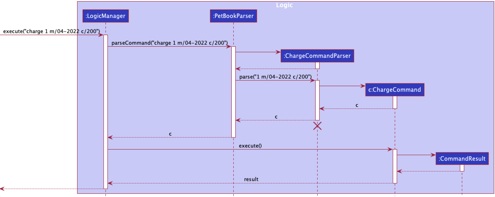
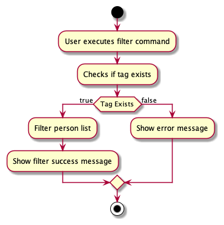
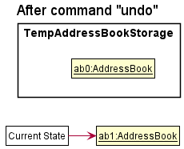
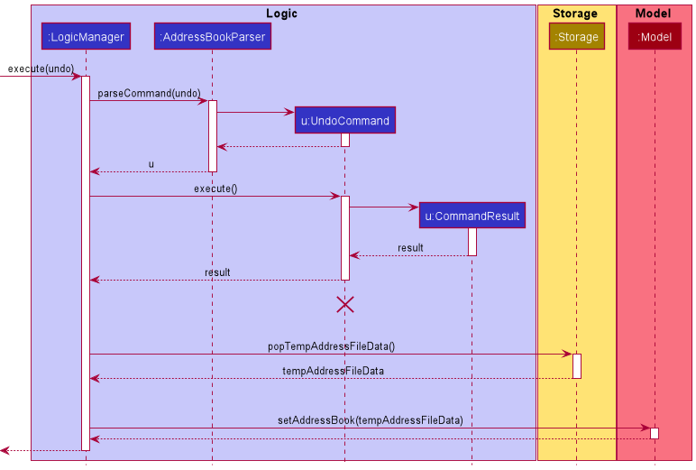

* Table of Contents
{:toc}
--------------------------------------------------------------------------------------------------------------------

## **Acknowledgements**

* This project is adapted from a generic application called AddressBook-Level3 (AB3) (from https://se-education.org) as the starting point.

--------------------------------------------------------------------------------------------------------------------

## **Setting up, getting started**

Refer to the guide [_Setting up and getting started_](SettingUp.md).

--------------------------------------------------------------------------------------------------------------------

## **Design**

:bulb: **Tip:** The `.puml` files used to create diagrams in this document can be found in the [diagrams](https://github.com/se-edu/addressbook-level3/tree/master/docs/diagrams/) folder. Refer to the [_PlantUML Tutorial_ at se-edu/guides](https://se-education.org/guides/tutorials/plantUml.html) to learn how to create and edit diagrams.

### Architecture

    

The ***Architecture Diagram*** given above explains the high-level design of the App.

Given below is a quick overview of main components and how they interact with each other.

**Main components of the architecture**

**`Main`** has two classes called [`Main`](https://github.com/AY2122S2-CS2103T-T13-1/tp/blob/master/src/main/java/woofareyou/Main.java) and [`MainApp`](https://github.com/AY2122S2-CS2103T-T13-1/tp/blob/master/src/main/java/woofareyou/MainApp.java). It is responsible for:
* At app launch: Initializes the components in the correct sequence, and connects them up with each other.
* At shut down: Shuts down the components and invokes cleanup methods where necessary.

[**`Commons`**](#common-classes) represents a collection of classes used by multiple other components.

The rest of the App consists of four components.

* [**`UI`**](#ui-component): The UI of the App.
* [**`Logic`**](#logic-component): The command executor.
* [**`Model`**](#model-component): Holds the data of the App in memory.
* [**`Storage`**](#storage-component): Reads data from, and writes data to, the hard disk.

**How the architecture components interact with each other**

The *Sequence Diagram* below shows how the components interact with each other for the scenario where the user issues the command `delete 1`.

    

Each of the four main components (also shown in the diagram above),

* defines its *API* in an `interface` with the same name as the Component.
* implements its functionality using a concrete `{Component Name}Manager` class (which follows the corresponding API `interface` mentioned in the previous point.

For example, the `Logic` component defines its API in the `Logic.java` interface and implements its functionality using the `LogicManager.java` class which follows the `Logic` interface. Other components interact with a given component through its interface rather than the concrete class (reason: to prevent outside component's being coupled to the implementation of a component), as illustrated in the (partial) class diagram below.

    

The sections below give more details of each component.

### UI component

The **API** of this component is specified in [`Ui.java`](https://github.com/AY2122S2-CS2103T-T13-1/tp/blob/master/src/main/java/woofareyou/ui/Ui.java)

The UI consists of a `MainWindow` that is made up of parts e.g.`CommandBox`, `ResultDisplay`, `PetListPanel`, `StatusBarFooter` etc. All these, including the `MainWindow`, inherit from the abstract `UiPart` class which captures the commonalities between classes that represent parts of the visible GUI.

The `UI` component uses the JavaFx UI framework. The layout of these UI parts are defined in matching `.fxml` files that are in the `src/main/resources/view` folder. For example, the layout of the [`MainWindow`](https://github.com/se-edu/addressbook-level3/tree/master/src/main/java/seedu/address/ui/MainWindow.java) is specified in [`MainWindow.fxml`](https://github.com/se-edu/addressbook-level3/tree/master/src/main/resources/view/MainWindow.fxml)

The `UI` component,

* executes user commands using the `Logic` component.
* listens for changes to `Model` data so that the UI can be updated with the modified data.
* keeps a reference to the `Logic` component, because the `UI` relies on the `Logic` to execute commands.
* depends on some classes in the `Model` component, as it displays `Pet` object residing in the `Model`.

### Logic component

**API** : [`Logic.java`](https://github.com/AY2122S2-CS2103T-T13-1/tp/blob/master/src/main/java/woofareyou/logic/Logic.java)

Here's a (partial) class diagram of the `Logic` component:

    

How the `Logic` component works:
1. When `Logic` is called upon to execute a command, it uses the `PetBookParser` class to parse the user command.
1. This results in a `Command` object (more precisely, an object of one of its subclasses e.g., `AddCommand`) which is executed by the `LogicManager`.
1. The command can communicate with the `Model` when it is executed (e.g. to add a pet).
1. The result of the command execution is encapsulated as a `CommandResult` object which is returned back from `Logic`.

The Sequence Diagram below illustrates the interactions within the `Logic` component for the `execute("delete 1")` API call.

:information_source: **Note:** The lifeline for `DeleteCommandParser` should end at the destroy marker (X) but due to a limitation of PlantUML, the lifeline reaches the end of diagram.

Here are the other classes in `Logic` (omitted from the class diagram above) that are used for parsing a user command:

    

How the parsing works:
* When called upon to parse a user command, the `PetBookParser` class creates an `XYZCommandParser` (`XYZ` is a placeholder for the specific command name e.g., `AddCommandParser`) which uses the other classes shown above to parse the user command and create a `XYZCommand` object (e.g., `AddCommand`) which the `PetBookParser` returns back as a `Command` object.
* All `XYZCommandParser` classes (e.g., `AddCommandParser`, `DeleteCommandParser`, ...) inherit from the `Parser` interface so that they can be treated similarly where possible e.g, during testing.

### Model component
**API** : [`Model.java`](https://github.com/AY2122S2-CS2103T-T13-1/tp/blob/master/src/main/java/woofareyou/model/Model.java)

The `Model` component,

* stores WoofAreYou data i.e., all `Pet` objects (which are contained in a `UniquePetList` object).
* stores the currently 'selected' `Pet` objects (e.g., results of a search query) as a separate _filtered_ list which is exposed to outsiders as an unmodifiable `ObservableList<Pet>` that can be 'observed' e.g. the UI can be bound to this list so that the UI automatically updates when the data in the list change.
* stores a `UserPref` object that represents the user’s preferences. This is exposed to the outside as a `ReadOnlyUserPref` objects.
* does not depend on any of the other three components (as the `Model` represents data entities of the domain, they should make sense on their own without depending on other components)

:information_source: **Note:** An alternative (arguably, a more OOP) model is given below. It has a `Tag` list in the `PetBook`, which `Pet` references. This allows `PetBook` to only require one `Tag` object per unique tag, instead of each `Pet` needing their own `Tag` objects. 

    

### Storage component

**API** : [`Storage.java`](https://github.com/AY2122S2-CS2103T-T13-1/tp/blob/master/src/main/java/woofareyou/storage/Storage.java)

    

The `Storage` component,
* can save both WoofAreYou data and user preference data in json format, and read them back into corresponding objects.
* inherits from both `PetBookStorage` and `UserPrefStorage`, which means it can be treated as either one (if only the functionality of only one is needed).
* depends on some classes in the `Model` component (because the `Storage` component's job is to save/retrieve objects that belong to the `Model`)

### Common classes

Classes used by multiple components are in the `woofareyou.commons` package.

--------------------------------------------------------------------------------------------------------------------

## **Implementation**

This section describes some noteworthy details on how certain features are implemented.

### Sorting feature

#### Implementation

The proposed sorting mechanism is facilitated by `SortCommand` class. It extends `Command`
and takes in a field that the user wishes to sort WoofAreYou by. The field is parsed by
`SortCommandParser`.

The primary sorting operation that takes place in the SortCommand class is sortPetList. This operation is exposed
in the `Model` interface as Model#sortPetList().

Pet list can only be sorted by pet name, owner name, appointment dates, pick-up time or drop-off time. Each class implements the `Comparable` interface so that
they can be compared and sorted alphabetically.

The following sequence diagram shows how the sort operation works:

The following activity diagram summarizes what happens when a user executes a new sort command:

#### Design considerations:

* **Alternative 1 (current choice):** Currently the comparator classes for both owner name and pet name are generated
  within the `sortPetList` method in `UniquePetList`.
    * Pros: Easy to implement.
    * Cons: May be confusing to edit if there are more comparator classes in the future.

* **Alternative 2:** Generate a new package containing the various comparator classes.
    * Pros: Cleaner code. Better for future scalability.
    * Cons: Contributes to more lines of code. Harder to set up initially.

### Charge feature

#### Implementation

The proposed charge mechanism is facilitated by `ChargeCommand` class. It extends `Command`. It takes in a pet, a month with a year and the charge-per-day for that month. These fields are parsed by `ChargeCommandParser`. Additionally, it implements the following operations:

* `ChargeCommand#generateSuccessMessage()` — Generates a message containing the total amount chargeable to be shown to the user.
* `ChargeCommand#execute()` — Fetches attendance details of a pet and computes a month's total amount chargeable.
* `ChargeCommand#equals()` — Checks if a `ChargeCommand` equates another.

Given below is an example usage scenario and how the charge mechanism behaves at each step.

The user executes command `charge 1 m/04-2022 c/200` to compute total amount chargeable to the pet at index 1 in April 2022 where each day costs $200. The `charge` command is parsed by `ChargeCommandParser` which then sends the pet index, month-year and daily charge to create a new `ChargeCommand` instance.

The following sequence diagram shows how the charge operation works:

:information_source: **Note:** The lifeline for `ChargeCommandParser` should end at the destroy marker (X) but due to a limitation of PlantUML, the lifeline reaches the end of diagram.

#### Design considerations:

**Aspect: How charge executes:**

* **Alternative 1 (current choice):** Gets attendance from a pet's attendanceHashMap and compute charge.
    * Pros: Saves memory.
    * Cons: May have performance issues in terms of recomputing the same pet's monthly charge.

* **Alternative 2:** Save charge as an attribute for each pet.
    * Pros: Easier to get charge.
    * Cons: Will use more memory and require more code to maintain it.

### Appointment feature

#### Implementation

The proposed appointment feature is facilitated by the `AppointmentCommand` class which extends `Command` class. The
`AppointmentCommand` takes in a valid mandatory index which specifics the pet that the command is to be used on,
followed by either **one** prefix (*clear*) or **two** prefixes (*dateTime* and *location*) based on the objective the
user is trying to accomplish. The fields are parsed by `AppointmentCommandParser` class.

Appointment feature can be used to accomplish the following 2 tasks:
1. Add and store pet's appointment details. (*dateTime and Location prefixes*)
2. Clear and delete pet's appointment details. (*clear prefix*)

The operation of updating the pet's appointment details and updating the pet filter list are done by methods in the
Model interface as Model#setPet() and Model#updateFilterPetList() respectively.

The following sequence diagram below illustrates the interactions between the `Logic` component and `Model` component
for the `execute("app 1 clear")` API call:

The following activity diagram summarizes what happens when a user executes a new Appointmentcommand:

    

#### Design considerations:

* **Alternative 1 (current choice):** Currently the appointment command is responsible for both the adding and clearing
  of appointment details to / from a `Pet`. These 2 tasks follow a similar command format and are differentiated only
  by the prefixes / augments.
    * Pros: Easy and simple to implement.
    * Cons: User may struggle to get familiar with the command.

* **Alternative 2:** Add a new `clear` command to clear and delete contents of variables based on input field.
    * Pros: Better for future scalability.
    * Cons: Complex implementation. More lines of code. Harder to set up initially.

### Filter feature

#### Implementation
The proposed filter mechanism is facilitated by `FilterCommand` class.
It extends `Command` and takes in a field that the user wishes to filter WoofAreYou by followed by
a given filter word. The field is parsed by `FilterCommandParser`. A filter word will follow after the keyword to
indicate what the user wants to filter out specifically.

Currently, pet list can be filtered by date, owner name and tag. Users can only filter WoofAreYou by one field at
a time only. `FilterCommandParser` ensure this by throwing a `ParseException` when more than one filter field is
entered.

`FilterCommandParser` parses the arguments and classifies the fields into the three different classes as represented by
`DateContainsFilterDatePredicate`, `OwnerNameContainsFilterWordPredicate` and `TagContainsFilterWordPredicate` classes.

The class diagram below shows the relationship between the classes and `FilterByContainsFilterWordPredicate`.

Each class extends the `FilterByContainsFilterWordPredicate` class, which implements the `Predicate<Pet>` interface,
in order for `FindCommand` to handle different fields appropriately and consequently test each pet differently for a
match in the specified field.

`FindCommand` then updates the pet book using one of the three classes (`Predicates`). Each class has a different
way of testing `Pet`.

The following sequence diagram shows how the filter operation works when `filter byTag/ beagle` is called:

The following activity diagram summarizes what happens when a user executes a new `filter` command:

#### Design considerations:

* **Alternative 1 (current choice):** Currently each filter field extends its own `FilterByContainsFilterWordPredicate` class.
    * Pros: Easy to implement and increases flexibility when testing using a `Predicate`.
    * Cons: May generate a lot more classes if filter fields were to expand in the future.

* **Alternative 2:** Generate a new package containing the various predicate and methods to identify different fields.
    * Pros: Cleaner code. Better for future scalability.
    * Cons: Requires more lines of code. Harder to set up initially. Risk being messy if not careful.

### Undo feature

#### Implementation

The undo mechanism is facilitated by VersionedPetBook. It extends PetBook with an undo history, stored internally as an petBookStateList and currentStatePointer. Additionally, it implements the following operations:

* `VersionedPetBook#commit()` — Saves the current WoofAreYou state in its history.
* `VersionedPetBook#undo()` — Restores the previous WoofAreYou state from its history.

These operations are exposed in the Model interface as Model#undo().

Given below is an example usage scenario and how the undo mechanism behaves at each step.

Step 1. The user launches the application for the first time. The VersionedPetBook will be initialized with the initial WoofAreYou state, and the currentStatePointer pointing to that single WoofAreYou state.

  

Step 2. The user executes delete 5 command to delete the 5th pet in WoofAreYou. The delete command calls Model#deletePet(), which in turn calls VersionedPetBook#commit()
causing the modified state of WoofAreYou after the delete 5 command executes to be saved in the petBookStateList, and the currentStatePointer is shifted to the newly inserted WoofAreYou state.

  

Step 3. The user executes add n/David …  to add a new pet. The add command also calls Model#addPet(), which in turn calls VersionedPetBook#commit()
causing another modified WoofAreYou state to be saved into the petBookStateList.

  

:information_source: Note: If a command fails its execution, it will not call VersionedPetBook#commit(), so the WoofAreYou state will not be saved into the petBookStateList.

Step 4. The user now decides that adding the pet was a mistake, and decides to undo that action by executing the undo command. The undo command will call Model#undo(), which will shift the currentStatePointer once to the left, pointing it to the previous WoofAreYou state, and restores the WoofAreYou to that state.

  

:information_source: Note: If the currentStatePointer is at index 0, pointing to the initial PetBook state, then there are no previous PetBook states to restore. If so, it will return an error to the user.

The following sequence diagram shows how the undo operation works:

  

:information_source: Note: The lifeline for UndoCommand should end at the destroy marker (X) but due to a limitation of PlantUML, the lifeline reaches the end of diagram.

Step 5. The user then decides to execute the command list. Commands that do not modify WoofAreYou, such as list, will usually not call VersionedPetBook#commit() or Model#undo(). 
Thus, the petBookStateList remains unchanged.

  

  

The following activity diagram summarizes what happens when a user executes a new command:

    

#### Design considerations:

Aspect: How undo executes:

* Alternative 1 (current choice): Saves the entirety of WoofAreYou.
    * Pros: Easy to implement.
    * Cons: May have performance issues in terms of memory usage.

* Alternative 2: Individual command knows how to undo/redo by
  itself.
    * Pros: Will use less memory (e.g. for delete, just save the pet being deleted).
    * Cons: We must ensure that the implementation of each individual command are correct.

### Attendance feature

#### Proposed Implementation
The proposed attendance feature is facilitated by the two classes `PresentAttendanceCommand` and `AbsentAttendanceCommand`,
which extend the `Command` class. The commands allow users to either mark a pet as present or absent on a particular day.
Initially, user input, which includes the index of the pet, date, as well as pick-up and drop-off time (if applicable),
is parsed by the `PresentAttendanceCommandParser` or `AbsentAttendanceCommandParser` classes into the command classes above.
The command classes are then passed on to the `Model` component for execution.

During command execution, data from the user input is parsed into one of two subclasses of `AttendanceEntry` objects.
The attendance entry is then stored into `AttendanceHashMap`. A class diagram illustrating the structure of `AttendanceHashMap`
can be seen below.

    

The `AttendanceHashMap` in pets consists of mappings of dates to `AttendanceEntry` objects. The class hence acts as an "attendance sheet",
and is the main repository of data within the Model component that facilitates `Attendance` functionalities.

The operation of updating the pet's attendance details and updating the GUI to reflect such changes are done by methods
in the Model interface as `Model#setPet()` and `Model#updateFilterPetList()` respectively. `Attendance` GUI is also
supported by the `AttendanceTag`, `TransportTag` and `AttendanceUtil` classes as well as methods.

The following sequence diagram below models the interactions between the Logic as well as the Model components to
update the backend and frontend of the application for the `absent` command.

The sequence model follows a similar structure for the `present` command as well.

In addition, the activity diagram below illustrates the workflow of attendance commands.

    

#### Design considerations:

**Aspect: Attendance data within `Model` component**

* **Alternative 1 (current choice):** Attendance entries in every pet's `AttendanceHashMap`.
    * Pros: Better OOP and performance.
    * Cons: Higher memory usage.
* **Alternative 2:** All attendance entries in a single HashMap.
    * Pros: Lesser memory usage, easier to implement.
    * Cons: Nested data structure, lack of OOP and separation of concerns.
    
--------------------------------------------------------------------------------------------------------------------

## **Documentation, logging, testing, configuration, dev-ops**

* [Documentation guide](Documentation.md)
* [Testing guide](Testing.md)
* [Logging guide](Logging.md)
* [Configuration guide](Configuration.md)
* [DevOps guide](DevOps.md)

--------------------------------------------------------------------------------------------------------------------

## **Appendix: Requirements**

### Product scope

**Target user profile**:

* Pet daycare centre owners
* Has a need to manage administrative details of pets on a daily basis
* Prefers desktop apps over other types
* Prefers typing to mouse interactions
* Is reasonably comfortable using CLI apps

**Value proposition**: Manage administrative duties faster than a typical mouse/ GUI driven app and Excel

### User stories

Priorities: High (must have) - `* * *`, Medium (nice to have) - `* *`, Low (unlikely to have) - `*`

| Priority | As a …​           | I want to …​                                                    | So that I can…​                                                    |
|----------|-------------------|-----------------------------------------------------------------|--------------------------------------------------------------------|
| `* * *`  | pet daycare owner | retrieve pet owner's contact                                    | contact pet owners                                                 |
| `* * *`  | pet daycare owner | tag different types of pets                                     | easily differentiate between the types of pets                     |
| `* * *`  | pet daycare owner | track when pets require pickup or drop-off                      | schedule the school bus for each day                               |
| `* * *`  | pet daycare owner | track the different food preferences required by different pets | make sure the pets are served the right foods                      |
| `* * *`  | pet daycare owner | track the attendance of pets                                    | charge pet owners the correct amount depending on pet's attendance |
| `* * *`  | pet daycare owner | add pets in the daycare to system                               | have a consolidated information sheet                              |
| `* * *`  | pet daycare owner | retrieve the pets addresses                                     | inform the school bus driver correctly                             |
| `* * *`  | pet daycare owner | find pets by their INDEX                                        | retrieve the pet information accordingly                           |
| `* * *`  | pet daycare owner | delete pet's information from the system                        | information of pets that are in the system will be up to date      |
| `* *`    | pet daycare owner | tabulate the monthly charge of each pets                        | bill owners accordingly                                            |
| `* *`    | pet daycare owner | track pets' grooming appointments                               | remember to bring them for grooming                                |
| `* *`    | pet daycare owner | track the allergies that each pet has                           | avoid giving them food they may be allergic to                     |
| `* *`    | pet daycare owner | order pets chronologically by there name                        | easily search for their name in the system                         |
| `* *`    | pet daycare owner | order pets' appointments chronologically                        | know what is the next appointment I should take note of            |
| `*`      | pet daycare owner | track the vet appointments of pets                              | make sure pets do not miss their medical appointments              |
| `*`      | pet daycare owner | track the medicine that pets need to take                       | feed them medicine appropriately                                   |
| `*`      | pet daycare owner | change the attendance of pets anytime I want                    | allow for last minute scheduling                                   |
| `*`      | pet daycare owner | update pet's information                                        | keep pets' information up to date                                  |
| `*`      | pet daycare owner | update pet owner's information                                  | keep pets' information up to date                                  |
| `*`      | pet daycare owner | access the previous attendance of pets                          | update owners if they were to enquire                              |
| `*`      | pet daycare owner | find the number of pets present in the daycare fo each day      | arrange the necessary manpower                                     |

### Use cases

(For all use cases below, the **System** is `WoofAreYou` and the **Actor** is the `user`, unless specified otherwise)

**Use case: Add a pet**

**MSS**

1.  User adds a pet with pet details
2.  System shows confirmation message that pet details are added

Use case ends.

**Extensions**

* 1a. User keyed in wrong command format.

    * 1a1. System shows an error message.

      Use case resumes at step 1.
* 1b. User keyed in a duplicate pet.

    * 1b1. System shows and error message.

      Use case resumes at step 1.

**Use case: Delete a pet**

**MSS**

1.  User deletes a pet with `INDEX`
2.  System shows confirmation message that pet details are deleted

Use case ends.

**Extensions**

* 1a. User keyed in invalid `INDEX`.

    * 1a1. System shows an error message.

      Use case resumes at step 1.

**Use case: Find pet**

**MSS**

1.  User finds a pet using `NAME_OF_PET`.
2.  System shows a list of pets with names matching `NAME_OF_PET`.

Use case ends.

**Extensions**

* 1a. User keyed in invalid pet name.

    * 1a1. System shows empty list.

      Use case resumes at step 1.

**Use case: Key in pet dietary requirements**

**MSS**

1.  User keys in a requirement for pet at `INDEX`.
2.  System shows success message for diet added.

Use case ends.

**Extensions**

* 1a. User keyed in invalid `INDEX`.

    * 1a1. System shows an error message.

      Use case resumes at step 1.

* 1b. User included special characters in dietary requirement.

    * 1b1. System shows an error message that dietary requirements only can consist of alphanumeric characters and spacing.

      Use case resumes at step 1.

**Use case: Key in pet appointment**

**MSS**

1.  User keys in a requirement for pet at `INDEX` followed by date, time and location.
2.  System shows success message for diet added.

Use case ends.

**Extensions**

* 1a. User keyed in invalid `INDEX`.

    * 1a1. System shows an error message.

      Use case resumes at step 1.

* 1b. User keyed in invalid format for date and time.

    * 1b1. System shows an error message.

      Use case resumes at step 1.

**Use case: Mark pet as present**

**MSS**

1.  User keys in `INDEX`, date, pick up and drop off time.
2.  System shows success message in marking a pet as present.

Use case ends.

**Extensions**

* 1a. User keyed in invalid `INDEX`.

    * 1a1. System shows an error message.

      Use case resumes at step 1.

* 1b. User keyed in a date format that is of invalid format.

    * 1b1. System shows an error message.

      Use case resumes at step 1.

* 1c. User keyed in a time format that is of invalid format.

    * 1c1. System shows an error message.

      Use case resumes at step 1.
* 1d. User keyed in pick-up time that is after drop-off time. 

    * 1d1. System shows an error message.
  
      Use case resumes at step 1.

**Use case: Mark pet as absent**

**MSS**

1.  User keys in `INDEX` and date.
2.  System shows success message in marking a pet as absent.

Use case ends.

**Extensions**

* 1a. User keyed in invalid `INDEX`.

    * 1a1. System shows an error message.

      Use case resumes at step 1.

* 1b. User keyed in a date format that is of invalid format.

    * 1b1. System shows an error message.

      Use case resumes at step 1.

**Use case: Sort pet list**

**MSS**

1.  User keys in `sort` followed by the parameter they want to sort by.
2.  System shows a sorted list of pets.

Use case ends.

**Extensions**

* 1a. User keyed in invalid parameter to sort by.

    * 1a1. System shows an error message.

      Use case resumes at step 1.

**Use case: Filter pet list**

**MSS**

1.  User keys in `filter` followed by a field to filter by.
2.  System shows a filtered pet list.

Use case ends.

**Extensions**

* 1a. User keyed in invalid parameter.

    * 1a1. System shows an error message.

      Use case resumes at step 1.

* 1b. User keyed in a date format that is of invalid format for parameter `byDate/` or `byApp/`.

    * 1b1. System shows an error message.

      Use case resumes at step 1.

**Use case: Charge a pet**

**MSS**

1.  User keys in `INDEX` a month and cost to charge per day.
2.  System shows message of how much to charge the pet for that month.

Use case ends.

**Extensions**

* 1a. User keyed in invalid `INDEX`.

    * 1a1. System shows an error message.

      Use case resumes at step 1.

* 1b. User keyed in a cost that is of invalid format.

    * 1b1. System shows an error message.

      Use case resumes at step 1.

**Use case: Undo**

**MSS**

1.  User keys undo.
2.  System undoes the previous command executed.

Use case ends.

**Extensions**

* 1a. Previous command was `clear`, `list`, `find` or `help` and user tries to undo.

    * 1a1. System will not the previous command.

      Use case resumes at step 1.

**Use case: Exit**

**MSS**

1.  User keys exit.
2.  System terminates the program.

Use case ends.

--------------------------------------------------------------------------------------------------------------------

### Non-Functional Requirements

1.  Should work on any _mainstream OS_ as long as it has Java `11` or above installed.
2.  Should be able to hold up to 1000 pets without a noticeable sluggishness in performance for typical usage.
3.  A user with above average typing speed for regular English text (i.e. not code, not system admin commands) should be able to accomplish most of the tasks faster using commands than using the mouse.

### Glossary

* **Mainstream OS**: Windows, Linux, Unix, OS-X

--------------------------------------------------------------------------------------------------------------------

## **Appendix: Instructions for manual testing**

Given below are instructions to test the app manually.

**:information_source: **Note:** **
These instructions only provide a starting point for testers to work on;
testers are expected to do more *exploratory* testing.

### Launch and shutdown

1. Initial launch

    1. Download the jar file and copy into an empty folder

    2. Double-click the jar file. 
       Expected: Shows the GUI with a set of sample contacts. The window size may not be optimum.

2. Saving window preferences

    1. Resize the window to an optimum size. Move the window to a different location. Close the window.

    2. Re-launch the app by double-clicking the jar file. 
       Expected: The most recent window size and location is retained.

### Adding a pet

1. Adding a pet
    1. Test case: `add n/Hazel o/Romeo Tan p/91234567 a/30 East Coast Road t/Golden Dachshund`
       Expected: A pet with all the details will be added to the pet list and success message shown in the status message.
    2. Test case: `add`
       Expected: No pet will be added. Error details shown in the status message. Pet list remains the same.

### Editing a pet

1. Editing a pet
    1. Prerequisites: Pet list must have at least 1 pet in it.
    2. Test case: `edit 1 p/92345678`
       Expected: Pet at index 1 will have the owner's phone number changed to 92345678. Success message shown in the
       status message.
    3. Test case: `edit 0 n/Woofie`
       Expected: No pet is edited. Error details shown in the status message.

### Marking attendance of a pet

1. Marking a pet as present
    1. Prerequisites: Pet list must have at least 1 pet in it.
    2. Test case: `present 1 date/21-03-2022`
       Expected: Pet at index 1 will be marked as present on 21 March 2022 without any pick up or drop off time. Success
       message shown in status message.
    3. Test case: `present 1 date/22-03-2022 pu/09:00 do/18:00`
       Expected: Pet at index 1 will be marked as present on 22 March 2022 with pick up time at 9am and drop off time at
       6pm. Success message shown in status message. If date is within past 7 days, attendance tag in GUI will turn green.
    4. Test case: `present 1 date/04-31-2022`
       Expected: Attendance of pet at index 1 will not be marked. Error details shown in the status message.
    5. Test case: `present 0 date/22-03-2022`
       Expected: No pet will be marked as present. Error message will be shown in status message.
2. Marking a pet as absent
    1. Prerequisites: Pet list must have at least 1 pet in it.
    2. Test case: `absent 1 date/22-03-2022`
       Expected: Pet at index 1 will be marked as absent on 22 March 2022. Success message shown in status message. If
       date is within past 7 days, attendance tag in GUI will turn red.
    3. Test case: `absent 0 date/22-03-2022`
       Expected: No pet will be marked as absent. Error message shown in status message.

### Charging a pet

1. Charging a pet for the month
    1. Prerequisites: Pet list must have at least 1 pet in it.
    2. Test case: `charge 1 m/03-2022 c/100.00`
       Expected: Total chargeable amount for pet at index 1 for the month of March 2022 will be shown in status message.
    3. Test case: `charge 1 m/2022-03 c/100.00`
       Expected: No chargeable amount will be calculated. Error message shown in status message.
    4. Test case: `charge 1 m/03-2022 c/100.0101`
       Expected: No chargeable amount will be calculated. Error message shown in status message.

### Adding a pet's dietary requirement

1. Adding a dietary requirement
    1. Prerequisites: Pet list must have at least 1 pet in it.
    2. Test case: `diet 1 d/Only feed dry kibble`
       Expected: Dietary requirement is added to pet at index 1. Description of dietary requirement shown on pet card
       with a purple label. Success message shown in status message.
    3. Test case: `diet 0 d/Only feed dry kibble`
       Expected: No dietary requirement is added. Error message shown in status message.

### Adding an appointment for pet

1. Adding an appointment
    1. Prerequisites: Pet list must have at least 1 pet in it.
    2. Test case: `app 1 dt/22-03-2022 09:00 at/NUS Vet`
       Expected: Appointment on 22 March 2022 at NUS Vet added for pet at index 1. Appointment details shown on pet card.
       If appointment date is today, the appointment label will turn green. If the appointment date has passed, the label
       will turn red, and if the appointment is in the future the label will be grey. Success message shown in status message.
    3. Test case: `app 1 dt/04-31-2022 09:00 at/NUS Vet`
       Expected: No appointment added. Error message shown in status message
    4. Test case: `app 0 dt/22-03-2022 09:00 at/NUS Vet`
       Expected: No appointment added. Error message shown in status message.
2. Clearing an appointment:
    1. Prerequisites: Pet list must have at least 1 pet in it.
    2. Test case: `app 1 clear`
       Expected: Appointment for pet at index 1 cleared. GUI will not display any appointment details.
    3. Test case: `app 0 clear`
       Expected: No appointment cleared. Error message shown in status message.

### Sorting pet list

1. Sorting pet list
    1. Prerequisites: Pet list must have at least 1 pet in it.
    2. Test case: `sort owner`
       Expected: Pet list sorted alphabetically by owners' name
    3. Test case: `sort somethingElse`
       Expected: Pet list not sorted. Error message shown in status message.

### Filtering pet list

1. Filtering pet list
    1. Prerequisites: Pet list must have at least 1 pet in it.
    2. Test case: `filter byOwner/Alice`
       Expected: Pet list only shows pets with owner name similar to Alice after filtering.
    3. Test case: `filter byDate/22-03-2022`
       Expected: Pet list only shows pets which are present for daycare on 22 March 2022
    4. Test case: `filter byApp/04-31-2022`
       Expected: Pet list not filtered. Error message shown in status message.

--------------------------------------------------------------------------------------------------------------------

## **Appendix: Effort**

## Model

WoofAreYou's `Model` draws inspiration from original [AB3](https://se-education.org/addressbook-level3/DeveloperGuide.html).
However, WoofAreYou's model is more complicated because it is specifically adapted to handle `Pet` attributes instead of
just `Person` objects.

In WoofAreYou, it is crucial to keep track of pets' attendance. Hence, the `AttendanceHashMap` class in WoofAreYou is
essential for many of the functionalities. Not only does `AttendanceHashMap` need to modify the database directly to store
potentially large amount of attendance entries for each pet, it has to ensure that these data are easily retrievable.
Similarly, the `Appointment` class has to be flexible to cater to the ever-changing nature of pets' appointments.
These 2 classes utilised Java's `LocalDate`, `LocalTime` and `LocalDateTime` libraries to facilitate parsing of arguments
which saved significant amount of time in handling invalid inputs.

Complex attributes such as `Charge` were also implemented to calculate the specific cost every month for each pet. The
`Model` of WoofAreYou supports higher level features and commands like sorting, filtering and undoing to increase efficiency
that are not present in AB3.

All the different classes in WoofAreYou `Model` have to interact with one another to ensure cohesiveness and efficient
navigability for the user. For instance, filtering and sort have to access the `AttendanceHashMap` or `Appointment` class
to retrieve the relevant dates. There are many ways of implementing these commands and a lot of effort is put into
the design consideration as discussed in the previous sections.

After many rounds of refinement, the current `Model` of WoofAreYou is one of the more efficient and scalable models
catered for its purpose.

## Logic

WoofAreYou's `Logic` is more advanced than that of AB3. WoofAreYou supports many more commands such as `sort`,
`filter`, `undo`, `diet`, `app`, and the different commands for marking attendance. Existing commands of AB3 like
`edit` and `find` are also enhanced to handle the complex `Model` of WoofAreYou.

Significant effort was placed in implementing the `Logic` for WoofAreYou. It encompasses the logic for pets'
`AttendanceHashMap`, `Diet`, `Appointment` and `Charge` on top of the logic that AB3 has initially which has been adapted
for WoofAreYou.

A huge amount of time was dedicated in validating user input for different commands. This is to ensure that WoofAreYou
is user-friendly enough to support inputs that are both intuitive for users and manageable for developers. Additional
effort was put into crafting error messages to ensure smooth handling of invalid input.

## Storage

WoofAreYou's `Storage` extends that of AB3 to increase functionality and store a variety of attributes that pets may
have. `AttendanceHashMap`, `Appointment`, `Diet` and `Tags` are carefully organised and stored as separate entries in a
JSON file. Doing so ensures that these attributes are unique to each pet and can be retrieved easily for other implementations.

More time and effort were spent in crafting the JSON entries of `AttendanceEntry` as it needs to store dates that
the pet was present or absent, and also their respective pick-up and drop off timings. All these are well
encapsulated in an organised format in the JSON file for easy retrieval.

## UI

WoofAreYou's `UI` is designed to be very dependent on visual cues to enhance user-friendliness. Every command that the
user execute will be accompanied by a status message at the very least. This status message appears at the top of
WoofAreYou to help users understand what is going on after each execution. In the event of any invalid input, error
messages shown are crafted to be intuitive and easily understandable so that users can rectify their mistakes.

### Attendance Visual Cues

WoofAreYou has a dedicated column on the right to indicate a pet's attendance. A significant amount of effort is put into
the design of this feature as attendance is the crux of a daycare's operation. Different coloring of date labels
serves as visual cues for absent and present attendance entries of each pet. It is designed this way so that daycare
owners rely on WoofAreYou for any form of attendance recollection rather than on their memory.

### Appointment Visual Cues

WoofAreYou has a dedicated label for appointments that pets may have. Similarly, a lot of thought were put into its design
to allow daycare owners to rely less on memory. A great amount of effort is spent synchronising the dates with the
different color codes of the appointment label. This visual cue informs daycare owners when an appointment has already
passed, is ongoing or yet to happen.

### Diet Visual Cues

WoofAreYou also has a dedicated label for dietary requirements of pets. It is meant to emphasise any important request
that a pet may have in terms of its diet. Hence, more consideration were put into making this feature more prominent in
the GUI.

### Challenges

Since WoofAreYou handles a lot more information and data compared to AB3, the GUI may be more cluttered. In order to
make the GUI neater, more VBox and HBox components are introduced to accommodate more information displayed. This initially led to formatting
issues of certain fields like addresses or tags being truncated and the GUI being less user-friendly. Character limit
was then introduced to ensure that input will not exceed its allocated space but this led to other bugs. Eventually, a hybrid
approach of increased character limit and resizable components is currently adopted to enhance user-friendliness.

## Overall

In conclusion, WoofAreYou was a challenging project for the team. The team started off ambitiously, coming up with
features that could make a huge impact on daycare owners' lives. Unfortunately, given the limited time period, some
features had to be sacrificed for more essential ones.

The team members all put in equal amount of effort into making WoofAreYou a success. Effort levels since the first
iteration has been consistently increasing. Despite our busy schedules, all members made a conscious effort to meet
weekly and work rigorously on WoofAreYou. Pull requests were generated every other day and reviews followed shortly.
The team showed immense responsiveness when dealing with issues and worked at a very high level.

From understanding the original code, implementing new features to conducting rigorous testing, the team ensured that
every piece of work they had to do was of a high standard. With the given time constraints, the team has put in all the
effort they can to make WoofAreYou a viable and concrete product that can already be used in the industry. Although
WoofAreYou may not be perfect, there is always room for improvement and the team is proud of the end product.
