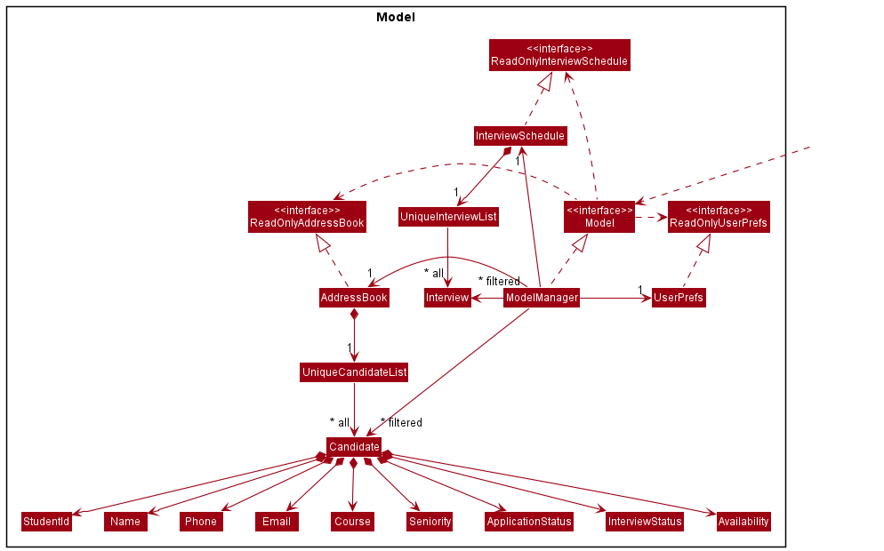
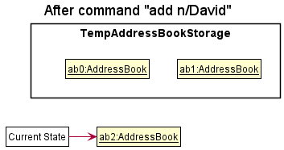

# Developer Guide
---

Table of Contents
  * Acknowledgements
  * Setting up, getting started
  * Design
    * Architecture
    * UI Component
    * Logic Component
    * Model Component
    * Storage Component
    * Common classes
  * Implementation
  * Documentation, logging, testing, configuration, dev-ops
  * Appendix: Requirements
    * Product Scope
    * User Stories
    * Use Cases
    * Non-Functional Requirements
    * Glossary
  * Appendix: Instructions for manual testing
    * Launch and shutdown
    * Deleting a person
    * Saving data

--------------------------------------------------------------------------------------------------------------------

## **Acknowledgements**

* {list here sources of all reused/adapted ideas, code, documentation, and third-party libraries -- include links to the original source as well}

--------------------------------------------------------------------------------------------------------------------

## **Setting up, getting started**

Refer to the guide [_Setting up and getting started_](SettingUp.md).

--------------------------------------------------------------------------------------------------------------------

## **Design**

:bulb: **Tip:** The `.puml` files used to create diagrams in this document can be found in the [diagrams](https://github.com/se-edu/addressbook-level3/tree/master/docs/diagrams/) folder. Refer to the [_PlantUML Tutorial_ at se-edu/guides](https://se-education.org/guides/tutorials/plantUml.html) to learn how to create and edit diagrams.

### Architecture

The ***Architecture Diagram*** given above explains the high-level design of the App.

Given below is a quick overview of main components and how they interact with each other.

**Main components of the architecture**

**`Main`** has two classes called [`Main`](https://github.com/se-edu/addressbook-level3/tree/master/src/main/java/seedu/address/Main.java) and [`MainApp`](https://github.com/se-edu/addressbook-level3/tree/master/src/main/java/seedu/address/MainApp.java). It is responsible for,
* At app launch: Initializes the components in the correct sequence, and connects them up with each other.
* At shut down: Shuts down the components and invokes cleanup methods where necessary.

[**`Commons`**](#common-classes) represents a collection of classes used by multiple other components.

The rest of the App consists of four components.

* [**`UI`**](#ui-component): The UI of the App.
* [**`Logic`**](#logic-component): The command executor.
* [**`Model`**](#model-component): Holds the data of the App in memory.
* [**`Storage`**](#storage-component): Reads data from, and writes data to, the hard disk.

**How the architecture components interact with each other**

The *Sequence Diagram* below shows how the components interact with each other for the scenario where the user issues the command `delete 1`.

Each of the four main components (also shown in the diagram above),

* defines its *API* in an `interface` with the same name as the Component.
* implements its functionality using a concrete `{Component Name}Manager` class (which follows the corresponding API `interface` mentioned in the previous point.

For example, the `Logic` component defines its API in the `Logic.java` interface and implements its functionality using the `LogicManager.java` class which follows the `Logic` interface. Other components interact with a given component through its interface rather than the concrete class (reason: to prevent outside component's being coupled to the implementation of a component), as illustrated in the (partial) class diagram below.

The sections below give more details of each component.

### UI component

The **API** of this component is specified in [`Ui.java`](https://github.com/se-edu/addressbook-level3/tree/master/src/main/java/seedu/address/ui/Ui.java)

The UI consists of a `MainWindow` that is made up of parts e.g.`CommandBox`, `ResultDisplay`, `PersonListPanel`, `StatusBarFooter` etc. All these, including the `MainWindow`, inherit from the abstract `UiPart` class which captures the commonalities between classes that represent parts of the visible GUI.

The `UI` component uses the JavaFx UI framework. The layout of these UI parts are defined in matching `.fxml` files that are in the `src/main/resources/view` folder. For example, the layout of the [`MainWindow`](https://github.com/se-edu/addressbook-level3/tree/master/src/main/java/seedu/address/ui/MainWindow.java) is specified in [`MainWindow.fxml`](https://github.com/se-edu/addressbook-level3/tree/master/src/main/resources/view/MainWindow.fxml)

The `UI` component,

* executes user commands using the `Logic` component.
* listens for changes to `Model` data so that the UI can be updated with the modified data.
* keeps a reference to the `Logic` component, because the `UI` relies on the `Logic` to execute commands.
* depends on some classes in the `Model` component, as it displays `Person` object residing in the `Model`.

### Logic component

**API** : [`Logic.java`](https://github.com/se-edu/addressbook-level3/tree/master/src/main/java/seedu/address/logic/Logic.java)

Here's a (partial) class diagram of the `Logic` component:

How the `Logic` component works:
1. When `Logic` is called upon to execute a command, it uses the `AddressBookParser` class to parse the user command.
1. This results in a `Command` object (more precisely, an object of one of its subclasses e.g., `AddCommand`) which is executed by the `LogicManager`.
1. The command can communicate with the `Model` when it is executed (e.g. to add a person).
1. The result of the command execution is encapsulated as a `CommandResult` object which is returned back from `Logic`.

The Sequence Diagram below illustrates the interactions within the `Logic` component for the `execute("delete 1")` API call.

:information_source: **Note:** The lifeline for `DeleteCommandParser` should end at the destroy marker (X) but due to a limitation of PlantUML, the lifeline reaches the end of diagram.

Here are the other classes in `Logic` (omitted from the class diagram above) that are used for parsing a user command:

How the parsing works:
* When called upon to parse a user command, the `AddressBookParser` class creates an `XYZCommandParser` (`XYZ` is a placeholder for the specific command name e.g., `AddCommandParser`) which uses the other classes shown above to parse the user command and create a `XYZCommand` object (e.g., `AddCommand`) which the `AddressBookParser` returns back as a `Command` object.
* All `XYZCommandParser` classes (e.g., `AddCommandParser`, `DeleteCommandParser`, ...) inherit from the `Parser` interface so that they can be treated similarly where possible e.g, during testing.

### Model component
**API** : [`Model.java`](https://github.com/se-edu/addressbook-level3/tree/master/src/main/java/seedu/address/model/Model.java)

The `Model` component,

* stores the address book data i.e., all `Person` objects (which are contained in a `UniquePersonList` object).
* stores the currently 'selected' `Person` objects (e.g., results of a search query) as a separate _filtered_ list which is exposed to outsiders as an unmodifiable `ObservableList<Person>` that can be 'observed' e.g. the UI can be bound to this list so that the UI automatically updates when the data in the list change.
* stores a `UserPref` object that represents the user’s preferences. This is exposed to the outside as a `ReadOnlyUserPref` objects.
* does not depend on any of the other three components (as the `Model` represents data entities of the domain, they should make sense on their own without depending on other components)

:information_source: **Note:** An alternative (arguably, a more OOP) model is given below. It has a `Tag` list in the `AddressBook`, which `Person` references. This allows `AddressBook` to only require one `Tag` object per unique tag, instead of each `Person` needing their own `Tag` objects. 

### Storage component

**API** : [`Storage.java`](https://github.com/se-edu/addressbook-level3/tree/master/src/main/java/seedu/address/storage/Storage.java)

The `Storage` component,
* can save both address book data and user preference data in json format, and read them back into corresponding objects.
* inherits from both `AddressBookStorage` and `UserPrefStorage`, which means it can be treated as either one (if only the functionality of only one is needed).
* depends on some classes in the `Model` component (because the `Storage` component's job is to save/retrieve objects that belong to the `Model`)

### Common classes

Classes used by multiple components are in the `seedu.addressbook.commons` package.

--------------------------------------------------------------------------------------------------------------------

## **Implementation**

This section describes some noteworthy details on how certain features are implemented.

### Adding Clip feature

The addition of the clip feature is facilitated by the `AddToClipboardCommand`, `AddToClipboardCommandParser`, and `NameExistsPredicate` classes.

`AddToClipboardCommandParser` parses the input to obtain the name of the contact that the user wishes to clip. It then creates a `NameExistsPredicate`, which it passes to a `AddToClipboardCommand`. When `Commmand#execute` is called, `AddToClipboardCommand` uses the `NameExistsPredicate` to filter out exact matches to the given name via the `Model#getFilteredPersonList()` method.

**Aspect: TBD:**

Currently, the user must specify the exact name of the contact they wish to clip. We want to allow the user to specify an index as an alternative.

### Adding Priority Level feature

The addition of priorities is facilitated by the `Tag` and `Priority` classes. In addition to a `tagName`, the tag now also has a priority level, represented by the `Priority` enum.

Currently, there are 4 priority levels that a tag can have, as provided by the `Priority` enum. If unspecified, the default `Priority` is `null`. The priority of a tag is set by the `ParserUtil`'s methods- specifically using `parseTag` and `parsePriority`

#### Design considerations:

**Aspect: TBD:**

* **Alternative 1 (current choice):** Give Priority to Tag
  * Pros: Can go into detail. Tasks the agent has to do can be captured in the tags. For the same person, some tasks may be very urgent and some may not be as urgent. The specifics can be conveyed much better.
  * Cons: Not very easy to implement. Hard to adapt for future features (e.g. how to sort by priority in the future)

* **Alternative 2:** Give Priority to Person
  itself.
  * Pros: Easier to implement, and easy to extend for future features such as `sort`.
  * Cons: We cannot give so much nuance- if someone has some issues that are urgent, and others that aren't, this cannot be captured.

_{more aspects and alternatives to be added}_
#### Listing by priority
The PriorityList() command. facilitated by `PriorityListCommand` and `TagPriorityComparator`, allows users to sort and display their contact list by the priority level of their contact's tags. 
The priority level of a person with multiple tags will be treated as the highest priority out of all his/her tags.

**Aspect: How prioList executes:**

### Adding more fields for Find
Having multiple fields for the `FindCommand` is facilitated by the improvement of the `FindCommandParser` and the creation of different types of `Predicate`. The `CombineContainsKeywordsPredicate` is used in order to combine the various `Predicate` for multiple fields searching. It is the main driver for `FindCommand#execute(model)` in updating the filteredPersonsList.

The improved `FindCommandParser` makes use of the `ArgumentMultimap` and the `ArgumentTokenizer` (similar to how it is implemented in the `AddCommandParser`) to retrieve the prefix-argument mapping. The `Parse` command in `FindCommandParser` uses the `ArgumentMultimap` generated by the `ArgumentTokenizer`'s tokenize method to create the relevant `Predicate` related to the field that the user has stated.

The different `Predicate` inherits from the `FieldContainsKeywordsPredicate`. The`CombineContainsKeywordsPredicate` is the combination of the various `Predicate`.
- Each subclass of `FieldContainsKeywordsPredicate` implements a concrete method `test` relevant to filtering the Person for the particular field.
- `CombineContainsKeywordsPredicate` makes use of all the subclasses of `FieldContainsKeywordsPredicate` `test` method in order to update the filteredPersonList from the `Model` using all the `FieldContainsKeywordsPredicate` created.

#### Design considerations:
The `FindCommandParser` was implemented this way as there are multiple prefixes in the new multi-field find command. So it requires a mapping of the different prefixes with their respective arguments.

The predicate is implemented in this way since updating the filteredPersonList in the `Model` class requires a single `Predicate`, so a single `CombineContainsKeywordsPredicate` was used, where the `CombineContainsKeywordsPredicate#test(person)` will make use of all the subclasses of `FieldContainsKeywordsPredicate` to update the filteredPersonList.

**Aspect: How FindCommand executes:**

* **Alternative 1 (current choice):** A combined predicate that makes use of the different subclasses of `FieldContainsKeywordsPredicate`
    * Pros: More modularised as it makes use of the individual predicates for each field.
    * Cons: May have some redundancy

* **Alternative 2:** Using just one predicate to encompass all the fields
    * Pros: Code is cleaner and less redundant
    * Cons: Implementation and testing might be harder as it is less modulariseds

_{more aspects and alternatives to be added}_

### Adding the ability to export AddressBook to CSV and back

The ability to convert a collection of Persons to a CSV file is facilitated by `CsvUtil` and `CsvAdaptedPerson`.

`CsvAdaptedPerson` is a CSV-friendly version of `Person`, with a method that allows it to be converted to a CSV-friendly string, while `CsvUtil` allows for the writing of a `CsvAdaptedPerson` object to a CSV file.

The implementation of writing the AddressBook to CSV is as follows:

When the user wishes to save the current state of the AddressBook to CSV, either through the `export` command or by clicking on the button in the dropdown, the following events occur:

Step 1: `MainWindow#handleSaveToCsv` is called, which:
- calls `MainWindow#handleSaveFile` to obtain a destination file location from the user to save to.
- then calls `LogicManager#saveAddressBookToCsv`

Step 2: `LogicManager#saveAddressBookToCsv`is called, which calls `StorageManager#saveAddressBookToCsv`

Step 3: `StorageManager#saveAddressBookToCsv` is called, which calls `CsvAddressBookStorage#saveAddressBook`

Step 4: `CsvAddressBookStorage#saveAddressBook` is called, which
- creates a file at the given location, if it does not exist yet
- generates a `List` of `CsvAdaptedPerson` from the AddressBook
- calls `CsvUtil#saveCsvFile`

Step 5: `CsvUtil#saveCsvFile` is called, which writes the contents of the AddressBook to the CSV file.

A similar flow of events occur for the loading of a CSV file to the AddressBook.

#### Design considerations:

The functionality was implemented this way to stick to the existing codebase as much as possible.

There is existing functionality to export the AddressBook to JSON, hence the classes involved with CSV files are organised and structured in a similar way.

### Adding the ability to Undo Add/Delete/Edit command

The ability to undo an Add/Delete Edit command is facilitated by `ModelManager`. It stores a copy of the current address book as an `AddressBook`. 
Additionally, it implements the following operations:

- AddressBook#copy() - Makes a copy of the current address book.
- Command#undo() - Reverts the address book to a copy before the last command.

Given below is an example usage scenario and how the undo mechanism behaves at each step.

Step 1. The user launches the application for the first time. The `AddressBook` will be initialized with the initial address book state.

Step 2. The user executes `delete 5` command to delete the 5th person in the address book. The `delete` command calls `ModelManager#copyAddressBook()`, making a copy of the address book and pointing `backup` to it before the `delete 5` command executes, and the `AddressBook` is updated without the deleted person.

Step 3. The user now decides that deleting the person was a mistake, and decides to undo that action by executing the `undo` command. The `undo` command will call `Model#undoCommand()`, which will revert the `AddressBook`, by pointing it to the `backup`, and restores the address book to that state.

#### Design considerations:

**Aspect: How undo executes:**

* **Alternative 1 (current choice):** Saves the entire address book.
    * Pros: Easy to implement.
    * Cons: May have performance issues in terms of memory usage.

* **Alternative 2:** Individual command knows how to undo/redo by
  itself.
    * Pros: Will use less memory (e.g. for `delete`, just save the person being deleted).
    * Cons: We must ensure that the implementation of each individual command are correct.

_{more aspects and alternatives to be added}_

### \[Proposed\] Undo/redo feature

#### Proposed Implementation

The proposed undo/redo mechanism is facilitated by `VersionedAddressBook`. It extends `AddressBook` with an undo/redo history, stored internally as an `addressBookStateList` and `currentStatePointer`. Additionally, it implements the following operations:

* `VersionedAddressBook#commit()` — Saves the current address book state in its history.
* `VersionedAddressBook#undo()` — Restores the previous address book state from its history.
* `VersionedAddressBook#redo()` — Restores a previously undone address book state from its history.

These operations are exposed in the `Model` interface as `Model#commitAddressBook()`, `Model#undoAddressBook()` and `Model#redoAddressBook()` respectively.

Given below is an example usage scenario and how the undo/redo mechanism behaves at each step.

Step 1. The user launches the application for the first time. The `VersionedAddressBook` will be initialized with the initial address book state, and the `currentStatePointer` pointing to that single address book state.

Step 2. The user executes `delete 5` command to delete the 5th person in the address book. The `delete` command calls `Model#commitAddressBook()`, causing the modified state of the address book after the `delete 5` command executes to be saved in the `addressBookStateList`, and the `currentStatePointer` is shifted to the newly inserted address book state.

Step 3. The user executes `add n/David …​` to add a new person. The `add` command also calls `Model#commitAddressBook()`, causing another modified address book state to be saved into the `addressBookStateList`.

:information_source: **Note:** If a command fails its execution, it will not call `Model#commitAddressBook()`, so the address book state will not be saved into the `addressBookStateList`.

Step 4. The user now decides that adding the person was a mistake, and decides to undo that action by executing the `undo` command. The `undo` command will call `Model#undoAddressBook()`, which will shift the `currentStatePointer` once to the left, pointing it to the previous address book state, and restores the address book to that state.

:information_source: **Note:** If the `currentStatePointer` is at index 0, pointing to the initial AddressBook state, then there are no previous AddressBook states to restore. The `undo` command uses `Model#canUndoAddressBook()` to check if this is the case. If so, it will return an error to the user rather
than attempting to perform the undo.

The following sequence diagram shows how the undo operation works:

:information_source: **Note:** The lifeline for `UndoCommand` should end at the destroy marker (X) but due to a limitation of PlantUML, the lifeline reaches the end of diagram.

The `redo` command does the opposite — it calls `Model#redoAddressBook()`, which shifts the `currentStatePointer` once to the right, pointing to the previously undone state, and restores the address book to that state.

:information_source: **Note:** If the `currentStatePointer` is at index `addressBookStateList.size() - 1`, pointing to the latest address book state, then there are no undone AddressBook states to restore. The `redo` command uses `Model#canRedoAddressBook()` to check if this is the case. If so, it will return an error to the user rather than attempting to perform the redo.

Step 5. The user then decides to execute the command `list`. Commands that do not modify the address book, such as `list`, will usually not call `Model#commitAddressBook()`, `Model#undoAddressBook()` or `Model#redoAddressBook()`. Thus, the `addressBookStateList` remains unchanged.

Step 6. The user executes `clear`, which calls `Model#commitAddressBook()`. Since the `currentStatePointer` is not pointing at the end of the `addressBookStateList`, all address book states after the `currentStatePointer` will be purged. Reason: It no longer makes sense to redo the `add n/David …​` command. This is the behavior that most modern desktop applications follow.

The following activity diagram summarizes what happens when a user executes a new command:

#### Design considerations:

**Aspect: How undo & redo executes:**

* **Alternative 1 (current choice):** Saves the entire address book.
  * Pros: Easy to implement.
  * Cons: May have performance issues in terms of memory usage.

* **Alternative 2:** Individual command knows how to undo/redo by
  itself.
  * Pros: Will use less memory (e.g. for `delete`, just save the person being deleted).
  * Cons: We must ensure that the implementation of each individual command are correct.

_{more aspects and alternatives to be added}_

### \[Proposed\] Data archiving

_{Explain here how the data archiving feature will be implemented}_

--------------------------------------------------------------------------------------------------------------------

## **Documentation, logging, testing, configuration, dev-ops**

* [Documentation guide](Documentation.md)
* [Testing guide](Testing.md)
* [Logging guide](Logging.md)
* [Configuration guide](Configuration.md)
* [DevOps guide](DevOps.md)

--------------------------------------------------------------------------------------------------------------------

## **Appendix: Requirements**

### Product scope

**Target user profile**:

A tech savvy insurance agent who:
* has to manage a significant number of clients and their different profiles
* prefers quick commands to locate his clients in his address book
* has to meet up with clients to introduce new packages at different locations
* is on the move often, prefers an app that can be used efficiently and relabily on the go

**Value proposition**:
* Allow clients to be saved, ordered and filtered by different categories
* Allow different pieces of data to be saved for different clients
* Has short commands for address book to be used efficiently and reliably on the go

### User stories

Priorities: High (must have) - `* * *`, Medium (nice to have) - `* *`, Low (unlikely to have) - `*`

| Priority | As a …​                                    | I want to …​                     | So that I can…​                                                        |
| -------- | ------------------------------------------ | ------------------------------ | ---------------------------------------------------------------------- |
| `* * *`  | new user                                     | have a quick guide         | learn how to use the address book efficiently and effectively                 |
| `* * *`  | user                                         | add a new client               | have a list of my clients                                                                       |
| `* * *`  | user                                         | delete an old client                | remove clients who have stopped working with me                                   |
| `* * *`  | user                                         | update a client's details          | keep information of my clients accurate and up-to-date |
| `* * *`  | user                                         | list all clients         | have an overview of my clientele |
| `* * *`  | user                                         | have an 'information' field in each client's details          | store miscellaneous infomation pertaining to each client |
| `* *`    | user                                         | sort my clients   |  see contacts in ascending/descending order w.r.t a certain priority (i.e. next meeting)               |
| `* *`    | user on-the-move                             | have keyboard shortcuts   |  use the app efficiently and reliably               |
| `* *`    | clumsy user                                  | undo my last command |  revert if I made a mistake in my previous command               |
| `* *`    | clumsy user                                  | have autocorrect for commands |  make minor mistyping errors without having to rewrite entire commands               |
| `* *`    | user with many clients in the address book   | search for clients           | obtain information about a client easily                                            |
| `* *`    | user with many clients in the address book   | filter clients           | obtain information about a group of clients easily                                            |
| `* *`    | user with many clients in the address book   | pin certain clients           | easily access them |
| `* *`    | anxious user                                 | set reminders                 | be alerted for upcoming meetings, deadlines etc.
| `* *`    | user                                         | see relationships between my clients  | manage entire families/groups of friends at the same time and tailor pacakages specifically for them |
| `*`      | user                                         | export my data into other formats such as Excel | visualise and share information with others |
| `*`      | user                                         | import and view the data of others' using this app | help out my colleagues when needed |
| `*`      | night-owl user                               | turn on dark mode           | strain my eyes less when working at night |
| `*`      | artsy user                                   | artsy mode                      | enjoy different visuals on the app

*{More to be added}*

### Use cases

(For all use cases below, the **System** is the `AddressBook` and the **Actor** is the `user`, unless specified otherwise)

**Use case: Add a person**

**MSS**

1. User requests to add a person
2. User keys in person's details
3. AddressBook adds the person

    Use case ends.

**Use case: Delete a person**

**MSS**

1. User requests to list persons
2. AddressBook shows a list of persons
3. User requests to delete a specific person in the list
4. AddressBook deletes the person

    Use case ends.

**Extensions**

* 2a. The list is empty.

  Use case ends.

* 3a. The given index is invalid.

    * 3a1. AddressBook shows an error message.

      Use case resumes at step 2.

**Use case: Edit a person**

**MSS**

1. User requests to list persons
2. AddressBook shows a list of persons
3. User requests to edit a specific person in the list
4. User keys in edited person's details
5. AddressBook edits the person

   Use case ends.

**Extensions**

* 2a. The list is empty.

  Use case ends.

* 3a. The given index is invalid.

    * 3a1. AddressBook shows an error message.

      Use case resumes at step 2.

**Use case: Find a person**

**MSS**

1. User requests to list specific persons
2. User keys in keywords to search for
3. AddressBook shows a list of persons matching the keyword

   Use case ends.

**Extensions**

* 2a. The given keywords are invalid.

    * 2a1. AddressBook shows an error message.

      Use case resumes at step 2.

* 3a. The list is empty.

  Use case ends.

**Use case: Clear address book**

**MSS**

1. User requests to clear all persons
2. AddressBook shows an empty list

   Use case ends.

*{More to be added}*

### Non-Functional Requirements

1.  Should work on any _mainstream OS_ as long as it has Java `11` or above installed.
2.  Should be able to hold up to 1000 persons without a noticeable sluggishness in performance for typical usage.
3.  A user with above average typing speed for regular English text (i.e. not code, not system admin commands) should be able to accomplish most of the tasks faster using commands than using the mouse.
4.  A new user should be able to learn how to use all functions of the address book within 10 minutes.
5.  Product should come with a storage system, and should not depend on external servers/Database Management Systems (DBMS)
6.  Product should work without an installer.
7.  Source code is open source.
8.  Features should be easy to test, for both manual and automated testing.

*{More to be added (?)}*

### Glossary

* **Mainstream OS**: Windows, Linux, Unix, OS-X

--------------------------------------------------------------------------------------------------------------------

## **Appendix: Instructions for manual testing**

Given below are instructions to test the app manually.

:information_source: **Note:** These instructions only provide a starting point for testers to work on;
testers are expected to do more *exploratory* testing.

### Launch and shutdown

1. Initial launch

   1. Download the jar file and copy into an empty folder

   1. Double-click the jar file Expected: Shows the GUI with a set of sample contacts. The window size may not be optimum.

1. Saving window preferences

   1. Resize the window to an optimum size. Move the window to a different location. Close the window.

   1. Re-launch the app by double-clicking the jar file. 
       Expected: The most recent window size and location is retained.

1. _{ more test cases …​ }_

### Deleting a person

1. Deleting a person while all persons are being shown

   1. Prerequisites: List all persons using the `list` command. Multiple persons in the list.

   1. Test case: `delete 1` 
      Expected: First contact is deleted from the list. Details of the deleted contact shown in the status message. Timestamp in the status bar is updated.

   1. Test case: `delete 0` 
      Expected: No person is deleted. Error details shown in the status message. Status bar remains the same.

   1. Other incorrect delete commands to try: `delete`, `delete x`, `...` (where x is larger than the list size) 
      Expected: Similar to previous.

1. _{ more test cases …​ }_

### Saving data

1. Dealing with missing/corrupted data files

   1. _{explain how to simulate a missing/corrupted file, and the expected behavior}_

1. _{ more test cases …​ }_
