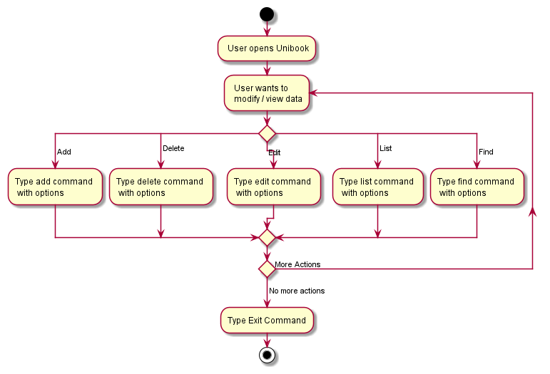
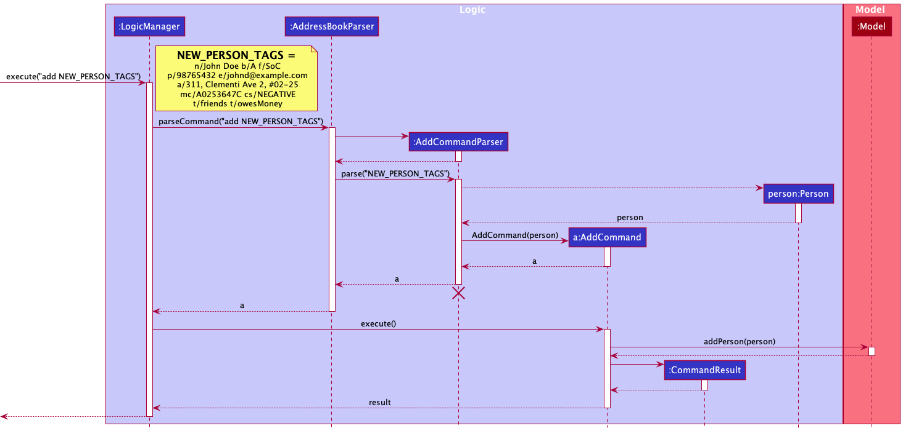

* Table of Contents
{:toc}

--------------------------------------------------------------------------------------------------------------------

## **Acknowledgements**
As UniBook is a brownfield project based on the _AddressBook Level-3_ project created by the [SE-EDU intiative](https://se-education.org), many of the diagrams and descriptions present in this guide have been adapted from the [AB3 developer guide](https://se-education.org/addressbook-level3/DeveloperGuide.html).

--------------------------------------------------------------------------------------------------------------------
## **Setting up, getting started**

Refer to the guide [_Setting up and getting started_](SettingUp.md).

--------------------------------------------------------------------------------------------------------------------
## **User Activity Flow**

The image above is an activity diagram of when a User uses the application. After the User opens Unibook, the user can
choose what they want to do with the app, whether it be modifying or viewing the data. The command given then executes.
If the user has more commands to give, they can keep repeating the process. Otherwise, they can use the Exit command to
close the application.

--------------------------------------------------------------------------------------------------------------------
## **Design**

:bulb: **Tip:** The `.puml` files used to create diagrams in this document can be found in the [diagrams](https://github.com/AY2122S2-CS2103-W16-1/tp/tree/master/docs/diagrams) folder. Refer to the [_PlantUML Tutorial_ at se-edu/guides](https://se-education.org/guides/tutorials/plantUml.html) to learn how to create and edit diagrams.

### Architecture

The ***Architecture Diagram*** given above explains the high-level design of the App.

Given below is a quick overview of main components and how they interact with each other.

**Main components of the architecture**

**`Main`** has two classes called [`Main`](https://github.com/AY2122S2-CS2103-W16-1/tp/blob/master/src/main/java/unibook/Main.java) and [`MainApp`](https://github.com/AY2122S2-CS2103-W16-1/tp/blob/master/src/main/java/unibook/MainApp.java). It is responsible for,
* At app launch: Initializes the components in the correct sequence, and connects them up with each other.
* At shut down: Shuts down the components and invokes cleanup methods where necessary.

[**`Commons`**](#common-classes) represents a collection of classes used by multiple other components.

The rest of the App consists of four components.

* [**`UI`**](#ui-component): The UI of the App.
* [**`Logic`**](#logic-component): The command executor.
* [**`Model`**](#model-component): Holds the data of the App in memory.
* [**`Storage`**](#storage-component): Reads data from, and writes data to, the hard disk.

**How the architecture components interact with each other**

The *Sequence Diagram* below shows how the components interact with each other for the scenario where the user issues the command `delete 1`.

Each of the four main components (also shown in the diagram above),

* defines its *API* in an `interface` with the same name as the Component.
* implements its functionality using a concrete `{Component Name}Manager` class (which follows the corresponding API `interface` mentioned in the previous point.

For example, the `Logic` component defines its API in the `Logic.java` interface and implements its functionality using the `LogicManager.java` class which follows the `Logic` interface. Other components interact with a given component through its interface rather than the concrete class (reason: to prevent outside component's being coupled to the implementation of a component), as illustrated in the (partial) class diagram below.

The sections below give more details of each component.

### UI component

The **API** of this component is specified in [`Ui.java`](https://github.com/AY2122S2-CS2103-W16-1/tp/blob/master/src/main/java/unibook/ui/Ui.java)

The UI consists of a `MainWindow` that is made up of parts e.g.`CommandBox`, `ResultDisplay`, `StatusBarFooter` etc. All these, including the `MainWindow`, inherit from the abstract `UiPart` class which captures the commonalities between classes that represent parts of the visible GUI.

The `UI` component uses the JavaFx UI framework. The layout of these UI parts are defined in matching `.fxml` files that are in the `src/main/resources/view` folder. For example, the layout of the [`MainWindow`](https://github.com/AY2122S2-CS2103-W16-1/tp/blob/master/src/main/java/unibook/ui/MainWindow.java) is specified in [`MainWindow.fxml`](https://github.com/AY2122S2-CS2103-W16-1/tp/blob/master/src/main/resources/view/MainWindow.fxml)

The `UI` component,

* executes user commands using the `Logic` component.
* listens for changes to `Model` data so that the UI can be updated with the modified data.
* keeps a reference to the `Logic` component, because the `UI` relies on the `Logic` to execute commands. 

The `MainWindow` of the `UI` component is composed of 3 sub-components, called views - `PeopleView`, `ModulesView` and `GroupsView`. A view refers to what a user is seeing on `MainWindow`. Only 1 view can be shown at a time. The user can switch between these views with the `list` command.

#### Views Sub-Components

The `Views` Sub-Components consists of 3 distinct views:

* `PeopleView`
  * Consists of the `PersonListPanel` class, which displays a list of filtered persons to the user in the form of multiple instances of `StudentCard` and `ProfessorCard`.
  * Also consists of multiple instances of `ModuleAndGroupMiniCard` which displays module codes and the group names of each group in each module to the user.
* `ModuleView`
  * Consists of the `ModuleListPanel` class, which displays a list of filtered modules to the user in the form of instances of `ModuleCard`. 
    * Each `ModuleCard` displays information on a module such as: 
      * groups in the module in the form of instances of `GroupCard`
      * students in the module in the form of instances of `StudentCard`
      * professors in the module in the form of instances of `ProfessorCard`
      * key events of the module in the form of instances of `ModuleKeyEventCard`
* `GroupView`
  * Consists of the `GroupsView` class, which displays a list of filtered groups to the user in the form of instances of `GroupCard`.
    * Each `GroupCard` displays information on a group such as:
      * members of the group in the form of instances of `StudentCard`

All classes in the `Views` Sub-Component inherit from `UiPart` abstract class which captures the commonalities between classes that represent parts of the visible GUI.
      
### Logic component

**API** : [`Logic.java`](https://github.com/AY2122S2-CS2103-W16-1/tp/blob/master/src/main/java/unibook/logic/Logic.java)

Here's a (partial) class diagram of the `Logic` component:

How the `Logic` component works:
1. When `Logic` is called upon to execute a command, it uses the `UniBookParser` class to parse the user command.
1. This results in a `Command` object (more precisely, an object of one of its subclasses e.g., `AddCommand`) which is executed by the `LogicManager`.
1. The command can communicate with the `Model` when it is executed (e.g. to add a person).
1. The result of the command execution is encapsulated as a `CommandResult` object which is returned back from `Logic`.

The Sequence Diagram below illustrates the interactions within the `Logic` component for the `execute("delete 1")` API call.

:information_source: **Note:** The lifeline for `DeleteCommandParser` should end at the destroy marker (X) but due to a limitation of PlantUML, the lifeline reaches the end of diagram.

Here are the other classes in `Logic` (omitted from the class diagram above) that are used for parsing a user command:

How the parsing works:
* When called upon to parse a user command, the `UniBookParser` class creates an `XYZCommandParser` (`XYZ` is a placeholder for the specific command name e.g., `AddCommandParser`) which uses the other classes shown above to parse the user command and create a `XYZCommand` object (e.g., `AddCommand`) which the `UniBookParser` returns back as a `Command` object.
* All `XYZCommandParser` classes (e.g., `AddCommandParser`, `DeleteCommandParser`, ...) inherit from the `Parser` interface so that they can be treated similarly where possible e.g, during testing.

### Model component
**API** : [`Model.java`](https://github.com/AY2122S2-CS2103-W16-1/tp/blob/master/src/main/java/unibook/model/Model.java)

The `Model` component,

* stores the UniBook data
  * all `Person` objects (which are contained in a `UniquePersonList` object)
    * `Person` class is abstract, a `Person` object must be either of subtype `Student` or a `Professor`
  * all `Module` objects (which are contained in a `ModuleList` object)
  * all `Group` objects (which are contained in the `Module` objects they belong to)
* stores the currently 'selected' `Person` objects (e.g., results of a search query) as a separate _filtered_ list which is exposed to outsiders as an unmodifiable `ObservableList<Person>` that can be 'observed' e.g. the UI can be bound to this list so that the UI automatically updates when the data in the list change.
* stores the currently 'selected' `Module` objects (e.g., results of a search query) as a separate _filtered_ list which is exposed to outsiders as an unmodifiable `ObservableList<Module>` that can be 'observed' e.g. the UI can be bound to this list so that the UI automatically updates when the data in the list change.
* stores a `UserPref` object that represents the user’s preferences. This is exposed to the outside as a `ReadOnlyUserPref` objects.
* does not depend on any of the other three components (as the `Model` represents data entities of the domain, they should make sense on their own without depending on other components)

### Storage component

**API** : [`Storage.java`](https://github.com/AY2122S2-CS2103-W16-1/tp/blob/master/src/main/java/unibook/storage/Storage.java)

The `Storage` component,
* can save both UniBook data and user preference data in json format, and read them back into corresponding objects.
* inherits from both `UniBookStorage` and `UserPrefStorage`, which means it can be treated as either one (if only the functionality of only one is needed).
* depends on some classes in the `Model` component (because the `Storage` component's job is to save/retrieve objects that belong to the `Model`)

The `JsonAdaptedStudent` and `JsonAdaptedProfessor` classes inherit from the abstract `JsonAdaptedPerson` class, which holds all the common fields that both classes share.

### Common classes

Classes used by multiple components are in the `unibook.commons` package.

--------------------------------------------------------------------------------------------------------------------

## **Implementation**

### Add feature
The add feature enables the user to add a module/student/professor/group/event/meeting to the UniBook depending on the option specified by the user. 

Given below is an example of a sequence diagram that shows the flow using the input `add o/module n/Software Engineering m/CS2103`.

The command is first parsed with `execute("add o/module n/Software Engineering m/CS2103", true, false, false)` where `true`, `false` and `false` are boolean variables which indicate whether the `Person` or `Module` or `Group` view is active. Following that, the `parseCommand` method in `UniBookParser` will be called, which in turn calls `AddCommandParser`. This instantiates a new `AddCommand` object which is returned to `UniBookParser`. After which, the `AddCommand` is passed to `LogicManager` and the `execute` method will run. The `model` object will be accessed to update the current list of modules in the UniBook. Finally, the `CommandResult` will be returned.

The add command can also add a group/student/professor/event/meeting. In these cases, the flow of the program is still largely similar, except that `model` object will be accessed to update the respective fields of students/professors/groups.

### Edit feature
The add feature enables the user to edit a module/person/group/event/meeting to the UniBook depending on the option specified by the user. 

Given below is an example of a sequence diagram that shows the flow using the input `edit 1 o/person n/Alex`.

The command is first parsed with `execute("edit 1 o/person n/Alex", true, false, false)` where `true`, `false` and `false` are boolean variables which indicate whether the `Person` or `Module` or `Group` view is active. Following that, the `parseCommand` method in `UniBookParser` will be called, which in turn calls `EditCommandParser`. This instantiates a new `EditCommandDescriptor` object which is used to create a new `EditCommand` object, and returned to `UniBookParser`. After which, the `EditCommand`and returned to `EditCommand`. The`execute` method will run. Finally, the `CommandResult` will be returned and the `setPerson` method will be called to update the people list in the `model` object.

The edit command can also add a group/student/professor/event/meeting. In these cases, the flow of the program is still largely similar, except that `model` object will be accessed to update the respective fields of students/professors/groups.

### Delete feature
The delete feature enables the user to delete a module/student/professor/group/event/meeting/key event from the UniBook depending on the option specified by the user.

Given below is an example of a sequence diagram that shows the flow using the input `delete 1` on the people view.

The command is first parsed with `execute("delete 1", true, false, false)` where `true`, `false` and `false` are boolean variables which indicate whether the `Person` or `Module` or `Group` view is active. Following that, the `parseCommand` method in `UniBookParser` will be called, which in turn calls `DeleteCommandParser`. This instantiates a new `DeleteCommand` object which is returned to `UniBookParser`. After which, the `DeleteCommand` is passed to `LogicManager` and the `execute` method will run. There will be checks to ensure that the command is able to be done, for example, if the index provided is out of range, no person will be deleted and the error message should inform the user that their command was invalid and how it can be fixed. Every command type will access model in different ways depending on what checks need to be done and how the model needs to be accessed. In this case, the `model` object will be accessed to delete the person at that index from the UniBook. Finally, the `CommandResult` will be returned.

### List feature
The list feature enables the user to customise which modules/people/groups are currently visible. As an example, the sequence
diagram below shows the flow using the input `list type/professors` which runs on the people view.

The command is first parsed with `execute("list type/professors", true, false, false)` where the boolean variables indicate whether the `People`, `Modules` or `Groups` view is currently active. Subsequently, the 
`parseCommand` method in `UniBookParser` is called which will call `ListCommandParser`, which creates the 
`ListCommand` for `ListCommandParser` to pass to `UniBookParser`. Subsequently the `ListCommand` is returned to 
`LogicManager` and the `execute` method is run. In this case the `Model` instance is accessed to update the predicate
which changes the entries appropriately (in this case showing all professors), 
before finally returning the `CommandResult`.

Note that the `List` command can also list modules or groups and in this case the flow would be very similar, just that the 
appropriate boolean variables will be flipped to represent the correct view.

--------------------------------------------------------------------------------------------------------------------

## **Documentation, logging, testing, configuration, dev-ops**

* [Documentation guide](Documentation.md)
* [Testing guide](Testing.md)
* [Logging guide](Logging.md)
* [Configuration guide](Configuration.md)
* [DevOps guide](DevOps.md)

--------------------------------------------------------------------------------------------------------------------

## **Appendix: Requirements**

### Product scope

**Target user profile**:

* university student taking modules in the curriculum 
* has a need to manage a significant number of contacts
* has a need to find relevant contacts pertaining to a specific module
* is reasonably comfortable using CLI apps

**Value proposition**: allows user to find relevant contacts (eg professors, classmates) from a specific module quickly

### User stories

Priorities: High (must have) - `* * *`, Medium (nice to have) - `* *`, Low (unlikely to have) - `*`

| Priority | As a …​                                                              | I want to …​                                                                                           | So that I can…​                                                                                        |
|----------|----------------------------------------------------------------------|--------------------------------------------------------------------------------------------------------|--------------------------------------------------------------------------------------------------------|
| `* * *`  | student                                                              | add contacts of other students taking a specific module                                                | easily contact other students for help.                                                                |
| `* * *`  | student                                                              | add important dates of a module's events                                                               | easily keep track of when my exams/submissions are.                                                    |
| `* * *`  | student                                                              | add my groupmates of a module into a group                                                             | quickly look for the contact information of my groupmates.                                             |
| `* * *`  | student                                                              | add meeting dates of my project group                                                                  | keep track of when my group meetings are and attend them.                                              |
| `* * *`  | student                                                              | add contacts of my professors                                                                          | easily contact the professors for consultation.                                                        |
| `* * *`  | student                                                              | remove contacts of students who have finished the module                                               | only keep the contacts I need                                                                          |
| `* * *`  | student                                                              | view all my contacts                                                                                   |
| `* * *`  | student                                                              | view all the details of each module I am a student of                                                  |
| `* * *`  | student                                                              | edit specific details of a contact                                                                     |
| `* * *`  | student                                                              | find the relevant contact details (eg office location, email) to reach my professors or other students | contact others quickly                                                                                 |
| `* * *`  | student                                                              | find classmates and their contact details taking the same module                                       | form teams with them for group projects                                                                |
| `* * `   | student with many modules                                            | flag any important contacts to saved contacts                                                          | easily find the relevant contact in a hassle-free manner in the future                                 |
| `* * `   | student with many modules                                            | remove modules that I have completed                                                                   |
| `* *`    | student with many modules                                            | add key events such as exams, assignments deadlines                                                    | remember these important dates                                                                         |
| `* *`    | student with many modules                                            | remove key events after they are over                                                                  |
| `* * `   | student with a group in a module                                     | add and find contacts of other students in a specific group                                            | contact them quickly                                                                                   |
| `* * `   | student with a group in a module                                     | remove the group after the work is done                                                                |                                                                                                        |
| `* * `   | student with a group in a module                                     | add group meeting times                                                                                | remember the meeting time                                                                              |
| `* * `   | student with a group in a module                                     | remove meeting times after the meeting is done                                                         |
| `* * *`  | student with a group in a module                                     | view all the members of my group on one page                                                           |
| `* * *`  | tech savvy user who is well-versed in using command-line interfaces  | use command-lines to carry out a command                                                               | use UniBook quickly                                                                              |
| `* *`    | student with many contacts in the UniBook                            | find a person by their name                                                                            | locate a person easily                                                                                 |
| `* *`    | student who is less tech-savvy and more visually-inclined            | navigate through different pages of UniBook with a click                                               | not have to remember commands to do a simple task like view another page, enhancing my user experience |

### Use cases

**Use Case: UC01 - Add a Person**

Actor: User

**MSS**

1. User requests to add a person.
2. UniBook adds the appropriate person object to the system.

Use case ends.

**Extensions**
* 1a. The UniBook list is currently full.
  - Use case ends.
  
* 1a. The user request is wrongly formatted/incomplete.
    - 1a1. User is prompted to enter the format correctly.
    - Use case ends.

* 1a. The user inputs an unaccepted input for any of the fields.
    - 1a1. User is prompted about the input's constraints.
    - Use case ends.

**Use Case: UC02 - Add a Module**

Actor: User

**MSS**

1. User requests to add a module.
2. UniBook adds the appropriate module object to the system.

Use case ends.

**Extensions**
* 1a. The UniBook list is currently full.
    - Use case ends.

* 1a. The user request is wrongly formatted/incomplete.
    - 1a1. User is prompted to enter the format correctly.
    - Use case ends.

* 1a. The user inputs an unaccepted input for any of the fields.
    - 1a1. User is prompted about the input's constraints.
    - Use case ends.

**Use Case: UC03 - Add a Group to a Module**

Actor: User

**MSS**

1. User requests to add a group to a module.
2. UniBook adds the appropriate group object to the system.

Use case ends.

**Extensions**
* 1a. The UniBook list is currently full.
    - Use case ends.

* 1a. The user request is wrongly formatted/incomplete.
    - 1a1. User is prompted to enter the format correctly.
    - Use case ends.

* 1a. The user inputs an unaccepted input for any of the fields.
    - 1a1. User is prompted about the input's constraints.
    - Use case ends.

**Use Case: UC04 - Add a Key Event to a Module**

Actor: User

**MSS**

1. User requests to add a key event to a module.
2. UniBook updates the respective module in the system.

Use case ends.

**Extensions**

* 1a. The user request is wrongly formatted/incomplete.
    - 1a1. User is prompted to enter the format correctly.
    - Use case ends.

* 1a. The user inputs an unaccepted input for any of the fields.
    - 1a1. User is prompted about the input's constraints.
    - Use case ends.

**Use Case: UC05 - Add a meeting time to a Group of a Module**

Actor: User

**MSS**

1. User requests to add a meeting time to a group of a module.
2. UniBook updates the meeting time list of the group of the respective module in the system.

Use case ends.

**Extensions**

* 1a. The user request is wrongly formatted/incomplete.
    - 1a1. User is prompted to enter the format correctly.
    - Use case ends.

* 1a. The user inputs an unaccepted input for any of the fields.
    - 1a1. User is prompted about the input's constraints.
    - Use case ends.
    
**Use case: UC06 - List People of a specific type**

Actor: User

**MSS**

1. User requests to list all people of a specific type (e.g. professors)
2. UniBook displays all professors.

**Extensions**
* 1a. The user request is wrongly formatted/incomplete.
  * 1a1. User is prompted to enter the command correctly.
  * Use case ends.

* 1a. The user is currently on the wrong view
  * 1a1. User is prompted to change views.
  * Use case ends.

Use case ends.

**Use case: UC07 - Change currently active view**

Actor: User

**MSS**

1. User requests to change views (e.g. to groups, modules or people)
2. UniBook switches the view and displays all entries successfully.

**Extensions**
* 1a. The user request is wrongly formatted/incomplete.
    * 1a1. User is prompted to enter the command correctly.
    * Use case ends.

* 1a. The user attempts to change to the view he/she is currently on.
    * 1a1. User is informed in the command result that he/she is already on the view.
    * Use case ends.

Use case ends.

**Use case: UC08 - Narrow down specific group from modules view**

Actor: User

**MSS**

1. User gives the command to see a specific group whilst in modules view.
2. UniBook switches the view to groups view and displays only that specific group.

**Extensions**
* 1a. The user request is wrongly formatted/incomplete.
    * 1a1. User is prompted to enter the command correctly.
    * Use case ends.

* 1a. The modules view currently has more than 1 module showing
    * 1a1. UniBook still switches to group page and displays all matching modules instead of one specific module.
    * Use case ends.

Use case ends.

**Use Case: UC09 - Edit Person/Module/Group/Key Event**

Actor: User

**Guarantees**

- No changes will be made to any data if the user request is wrongly formatted/incomplete.

**MSS**

1. User requests to edit person/module/group/key event using `o/OPTION`
2. UniBook updates the relevant data according to the user command.

Use case ends.

**Extensions**
* 1a. The person/module/group/key event does not exist in UniBook.
    - The user is notified that the person/module does not exist.
    - Use case ends.

* 1a. The user request is wrongly formatted/incomplete.
    - 1a1. User is prompted to enter the format correctly.
    - Use case ends.

**Use Case: UC10 - Finding specific persons**

Actor: User

**MSS**

1. User requests to find a specific person.
2. UniBook displays the people who match the specified search criteria.

Use case ends.

**Use Case: UC11 - Deleting Person, Module or Group**

Actor: User

**Guarantees**

- Nothing will be deleted if the user request is wrongly formatted/incomplete/incorrect.

**MSS**

1. User requests to delete a specified set of data (Person, Module or Group).
2. UniBook removes the specified set of data from the system.
3. The UI is updated to no longer reflect or display this data.

Use case ends.

**Extensions**
* 1a. The person, module or group does not exist
    * The user is notified that the person, module or group does not exist.
    * Use case ends.
* 1a. The user request is wrongly formatted/incomplete/incorrect.
    - 1a1. User is prompted to enter the format correctly.
    - Use case ends.
    
**Use Case UC06 - Viewing more details of a module or group from _people view_**  

Actor: User

**MSS**
1. User wants to view more details fo a module or group from the module code or group code he sees on _people view_.
2. User clicks with the mouse on the displayed module code / group name that he wants view more details of.
3. UniBook changes to _modules view_/_groups view_ showing all the details of the module/group that the User wants to view.

Use case ends.

### Non-Functional Requirements

1. Should be able to work on any Popular Operating System as long as Java is installed.
2. The program should be able to handle up to 500 students per module.
3. System should respond to commands within 2 seconds.
4. There should be no memory leaks.

### Glossary

* **User**: A user of UniBook, either a student or a professor.
* **Module**: A university course, which has professor(s) teaching it, and students participating in it. 
* **Group**: A group within a module. For example, a tutorial group or project group.
* **Popular Operating System**: Windows, Linux, Unix, MacOS

--------------------------------------------------------------------------------------------------------------------

## **Appendix: Instructions for manual testing**

Given below are instructions to test the app manually.

:information_source: **Note:** These instructions only provide a starting point for testers to work on;
testers are expected to do more *exploratory* testing.

### Launch and shutdown

1. Initial launch

   1. Download the jar file and copy into an empty folder

   1. Double-click the jar file Expected: Shows the GUI with a set of sample contacts. The window size may not be optimum.

1. Saving window preferences

   1. Resize the window to an optimum size. Move the window to a different location. Close the window.

   1. Re-launch the app by double-clicking the jar file. 
       Expected: The most recent window size and location is retained.

1. _{ more test cases …​ }_

### Switching views
1. Switching to `People`/`Modules`/`Groups` view

    1. Prerequisites: `People`/`Modules`/`Groups` view not currently showing respectively. If an attempt to switch to currently active view is made, nothing happens.
    
    2. Test case: `list o/view v/people` 
       Expected: The UniBook switches to the `People` view and lists all entries there.
       
    3. Test case: `list o/view v/modules` 
      Expected: The UniBook switches to the `Modules` view and lists all entries there.       
       
    4. Test case: `list o/view v/groups` 
      Expected: The UniBook switches to the `Groups` view and lists all entries there.

### Listing all entries
1. List all entries in currently active view.
    1. Test Case: `list` 
       Expected: The UniBook lists all `People`/`Modules`/`Groups` depending on the currently active view.

### Listing specific entries
1. List people of a specific type.
    1. Prerequisites: Currently on `People` view.
    2. Test case: `list type/professors` 
        Expected: All professors are listed.
    3. Test case: `list type/students` 
        Expected: All students are listed.
       
2. List people from a specific module
    1. Prerequisites: Currently on `People` view.
    2. Test case: `list o/module m/CS2103` 
        Expected: Everybody associated with module code `CS2103`, if it exists, will be listed.
    3. Test case: `list o/module m/cs2103 type/professors`  
        Expected: Every professor associated with module code`CS2103`, if it exists, will be listed.

3. List people from a specific group in a module
    1. Prerequisites: Currently on `People` view.
    2. Test case: `list o/group m/CS2103 g/W100-1` 
        Expected: All students in group `W100-1`, of `CS2103`, if it exists, will be listed.
    
4. List a module with a specific module code
    1. Prerequisites: Currently on `Modules` view.
    2. Test case: `list m/CS2103` 
        Expected: The module with code `CS2103` is listed, if it exists.

5. List module(s) with name matching a specific keyword       
   1. Prerequisites: Currently on `Modules` view.
   2. Test case: `list n/Software` 
       Expected: Modules with names that contain `Software` are listed, if it exists.
       
6. List module(s) with key event(s) on a specific date
    1. Prerequisites: Currently on `Modules` view.
    2. Test case: `list dt/2022-05-04` 
        Expected: Modules with any key event(s) falling on `2022-05-04` are listed.

7. List module(s) with key event(s) of a specific type
    1. Prerequisites: Currently on `Modules` view.
    2. Test case: `list ke/EXAM` 
        Expected: Modules with `EXAM` key event(s) will be listed.

8. List group(s) with a specific name
    1. Prerequisites: Currently on `Groups` view.
    2. Test case: `list g/W100-1` 
        Expected: Groups with name `W100-1` will be listed.
    3. Test case: `list g/W100-1 m/CS2103` 
        Expected: The specific group `W100-1` in `CS2103` will be listed.
       
9. List group(s) with a specific meeting date
   1. Prerequisites: Currently on `Groups` view.
   2. Test case: `list mt/2022-05-04` 
       Expected: Groups with meetings on `2022/05/04` are listed.

### Deleting a person

1. Deleting a person while all persons are being shown

   1. Prerequisites: List all persons using the `list` command. Multiple persons in the list.

   1. Test case: `delete 1` 
      Expected: First contact is deleted from the list. Details of the deleted contact shown in the status message. Timestamp in the status bar is updated.

   1. Test case: `delete 0` 
      Expected: No person is deleted. Error details shown in the status message. Status bar remains the same.

   1. Other incorrect delete commands to try: `delete`, `delete x`, `...` (where x is larger than the list size) 
      Expected: Similar to previous.

1. _{ more test cases …​ }_

### Editing a person

1. Editing a person while on people view (similarly for module/group/key event)

   1. Prerequisites: List all persons using the `list o/view v/people` command. Multiple persons in the list.

   1. Test case: `edit 1 o/person n/Greg` 
      Expected: First contact's name from the list changed to Greg from the list. Details of the edited contact shown in the status message.

   1. Test case: `edit 1` 
      Expected: No object is edited. Error details shown in the status message. Status bar remains the same.

   1. Other incorrect delete commands to try: `edit`, `edit x`, `...` (where x is larger than the list size) 
      Expected: Similar to previous.

1. _{ more test cases …​ }_

### Saving data

1. Dealing with missing/corrupted data files

   1. _{explain how to simulate a missing/corrupted file, and the expected behavior}_

1. _{ more test cases …​ }_
