* Table of Contents
{:toc}

--------------------------------------------------------------------------------------------------------------------

## **Acknowledgements**

* This project is based on the [AddressBook-Level3 project](https://github.com/se-edu/addressbook-level3) created by the [SE-EDU initiative](https://se-education.org/).
* The following libraries were also used in the project.
  * [JavaFX](https://openjfx.io/) for the Graphical User Interface (GUI).
  * [Jackson](https://github.com/FasterXML/jackson) for JSON Parsing.
  * [JUnit5](https://github.com/junit-team/junit5) for Testing.

--------------------------------------------------------------------------------------------------------------------

## **Setting up, getting started**

Refer to the guide [_Setting up and getting started_](SettingUp.md).

--------------------------------------------------------------------------------------------------------------------

## **Application Design**

:bulb: **Tip:** The `.puml` files used to create diagrams in this document can be found in the [diagrams](https://github.com/AY2122S2-CS2103-W17-1/tp/tree/master/docs/diagrams/) folder. Refer to the [_PlantUML Tutorial_ at se-edu/guides](https://se-education.org/guides/tutorials/plantUml.html) to learn how to create and edit diagrams.

### Overall System Architecture

The ***Architecture Diagram*** above provides a high-level view of the Application design and structure.

A quick overview of main components and how they interact with each other is provided below, while further details can be found in the subsequent sections.

**Main components of the architecture**

**`Main`** has two classes called [`Main`](https://github.com/AY2122S2-CS2103-W17-1/tp/tree/master/src/main/java/seedu/contax/Main.java) and [`MainApp`](https://github.com/AY2122S2-CS2103-W17-1/tp/tree/master/src/main/java/seedu/contax/MainApp.java). It is responsible for,
* At app launch: Initializes the components in the correct sequence, and connects them up with each other.
* At shut down: Shuts down the components and invokes cleanup methods where necessary.

[**`Commons`**](#common-classes) represents a collection of classes used by multiple other components.

The rest of the App consists of four major components.

* [**`UI`**](#ui-component): The UI of the App.
* [**`Logic`**](#logic-component): The command executor.
* [**`Model`**](#model-component): Holds the data of the App in memory.
* [**`Storage`**](#storage-component): Reads data from, and writes data to, the hard disk.

:bulb: **Quick Note:** The following sections will focus primarily on the four major components `UI`, `Logic`, `Model`, `Storage`.

**How the architecture components interact with each other**

The *Sequence Diagram* below shows how the components interact with each other for the scenario where the user issues the command `deleteperson 1`.

Each of the four main components (also shown in the diagram above),

* defines its *API* in an `interface` with the same name as the Component.
* implements its functionality using a concrete `{Component Name}Manager` class (which follows the corresponding API `interface` mentioned in the previous point.

For example, the `Logic` component defines its API in the `Logic.java` interface and implements its functionality using the `LogicManager.java` class which follows the `Logic` interface. Other components interact with a given component through its interface rather than the concrete class (reason: to prevent outside component's being coupled to the implementation of a component), as illustrated in the (partial) class diagram below.

The sections below give more details of each component.

### UI component

The `UI` component,

* executes user commands using the `Logic` component.
* listens for changes to `Model` data so that the UI can be updated with the modified data.
* keeps a reference to the `Logic` component, because the `UI` relies on the `Logic` to execute commands.
* depends on some classes in the `Model` component, as it displays `Person`, `Tag`, `Appointment` and `AppointmentSlot` objects residing in the `Model`.

:information_source: The **API** of this component is specified in [`Ui.java`](https://github.com/AY2122S2-CS2103-W17-1/tp/tree/master/src/main/java/seedu/contax/ui/Ui.java).

The UI consists of a `MainWindow` that is made up of parts e.g.`CommandBox`, `ResultDisplay`, `PersonListPanel`, `StatusBarFooter` etc. All these, including the `MainWindow`, inherit from the abstract `UiPart` class which captures the commonalities between classes that represent parts of the visible GUI.

The `UI` component uses the JavaFx UI framework. The layout of these UI parts are defined in matching `.fxml` files that are in the `src/main/resources/view` folder. For example, the layout of the [`MainWindow`](https://github.com/AY2122S2-CS2103-W17-1/tp/tree/master/src/main/java/seedu/contax/ui/MainWindow.java) is specified in [`MainWindow.fxml`](https://github.com/AY2122S2-CS2103-W17-1/tp/tree/master/src/main/resources/view/MainWindow.fxml).

There are exactly 3 `ListPanel<T>` in `MainWindow`, corresponding to each type of `Person`, `ScheduleItem` and `Tag`. Each child of a `ListPanel<T>` implements the `RecyclableCard<T>` interface of the same type.

:information_source: **Note:** One of the `ListPanel<T>` is a subclass `ScheduleItemListPanel`, which specifically handles displaying both `Appointment` and `AppointmentSlot` models in a single list.

The `Card` component of the `UI` class diagram has been omitted from the overall view for brevity. The detailed view of the component is as follows.

The structure roughly follows the factory design pattern, with modifications in `ScheduleItemCardFactory` to handle the logic specific to the composition hidden by `ScheduleItemCard`. The factories for `TagCard` and `PersonCard` are implemented as anonymous lambda functions, so they are omitted from the class diagram.

Each `{model}Card` depends on the corresponding `{model}` in the Model component for populating data onto the UI.

### Logic component

The `Logic` component,

* maintains references to both `Model` and `Storage`.
* parses user inputs into `Command` objects.
* executes `Command` objects to perform some action.

:information_source: The **API** of this component is specified in: [`Logic.java`](https://github.com/AY2122S2-CS2103-W17-1/tp/tree/master/src/main/java/seedu/contax/logic/Logic.java)

Here's a (partial) class diagram of the `Logic` component:

How the `Logic` component works:
1. When `Logic` is called upon to execute a command, it uses the `AddressBookParser` class to parse the user command.
1. This results in a `Command` object (more precisely, an object of one of its subclasses e.g., `AddPersonCommand`) which is executed by the `LogicManager`.
1. The command can communicate with the `Model` when it is executed (e.g. to add a person).
1. The result of the command execution is encapsulated as a `CommandResult` object which is returned back from `Logic`.

The Sequence Diagram below illustrates the interactions within the `Logic` component for the `execute("deleteperson 1")` API call.

:information_source: **Note:** The lifeline for `DeleteCommandParser` should end at the destroy marker (X) but due to a limitation of PlantUML, the lifeline reaches the end of diagram.

Here are the other classes in `Logic` (omitted from the class diagram above) that are used for parsing a user command:

How the parsing works:
* When called upon to parse a user command, the `AddressBookParser` class creates an `XYZCommandParser` (`XYZ` is a placeholder for the specific command name e.g., `AddCommandParser`) which uses the other classes shown above to parse the user command and create a `XYZCommand` object (e.g., `AddCommand`) which the `AddressBookParser` returns back as a `Command` object.
* All `XYZCommandParser` classes (e.g., `AddCommandParser`, `DeleteCommandParser`, ...) inherit from the `Parser` interface so that they can be treated similarly where possible e.g, during testing.

### Model component

The `Model` component,

* stores and organizes all data entities used within the application in multiple *container classes*.
* stores the currently 'selected' objects for each data entity in separate _filtered_ lists.
* stores a `UserPref` object that represents the user’s preferences. This is exposed externally as a `ReadOnlyUserPref` object.
* does not depend on any of the other three components (as the `Model` represents data entities of the domain, they should make sense on their own without depending on other components).

:information_source: The **API** of this component is specified in: [`Model.java`](https://github.com/AY2122S2-CS2103-W17-1/tp/tree/master/src/main/java/seedu/contax/model/Model.java)

The **high-level partial class diagram** above shows how the model component is structured, without showing the details of the inner-workings of the `AddressBook` and `Schedule` models. Separate detailed diagrams for each of the `AddressBook` and `Schedule` subcomponents are shown further below.

The following table summarizes how different data entity objects are organized in `Model`.

| Data Stored  | Entity        | Container Class           | Exposed Filtered List Getter   |
|--------------|---------------|---------------------------|--------------------------------|
| Address Book | `Person`      | `UniquePersonList`        | `getFilteredPersonList()`      |
| Tag          | `Tag`         | `UniqueTagList`           | `getFilteredTagList()`         |
| Schedule     | `Appointment` | `DisjointAppointmentList` | `getFilteredAppointmentList()` |

For each of the data entities, 'selected' objects (e.g., results of a search query) of each type is exposed externally as unmodifiable `ObservableList<{Entity}>` lists which can be 'observed'. For example, the UI can be bound to this list so that the UI automatically updates when the data in the list change.

The class diagram above illustrates how the `AddressBook` subcomponent is structured, including how `Tag` and `Person` are stored internally.

The class diagram above illustrates how the `Schedule` subcomponent is structured.

In addition to the `Appointment` objects in the Schedule, empty slots in the Schedule are also modelled as `AppointmentSlot` objects, contained in `AppointmentSlotList`. This list dynamically generates itself based on the Schedule and provided filter conditions.

Both the `DisjointAppointmentList` and `AppointmentSlotList` are further combined into a single unified list of `ScheduleItem` objects that is separately exposed externally.

The Schedule subcomponent is structured such that:

* The bulk of the scheduling-related functionality is abstracted to `ScheduleItem`, which is the supertype of `Appointment` and `AppointmentSlot`.
* `ScheduleItem` implements the `TemporalComparable` interface, which allows `Appointment` and `AppointmentSlot` to be compared.
* The `DisjointAppointmentList` only stores `Appointment` and not `AppointmentSlot` objects.

For further details of how the `Schedule` subcomponent works together to expose a unified `ObservableList<ScheduleItem>` list, see the [implementation](#implementation) section.

Within the `model` package, there also exists an `IndexedCsvFile` model that helps with the parsing of CSV files for the Import CSV function. However, the class does not maintain any persistent instances, and does not fit within the model component diagram, serving solely as a helper model.

### Storage component

The `Storage` component,

* can save address book data, schedule data and user preference data in json format, and read them back into corresponding objects.
* depends on some classes in the `Model` component (because the `Storage` component's job is to save/retrieve objects that belong to the `Model`)

:information_source: The **API** of this component is specified in: [`Storage.java`](https://github.com/AY2122S2-CS2103-W17-1/tp/tree/master/src/main/java/seedu/contax/storage/Storage.java)

Note that in the class diagram `Storage` inherits from `AddressBookStorage`, `ScheduleStorage` and `UserPrefStorage`, which means it can be treated as either one (if only the functionality of only one is needed).

Within the `storage` package, there also exists a `CsvManager` class that is a helper that provides file IO related operations for working with CSV files. It is used in the Import CSV or Export CSV features. This class does not fit within the storage component diagram as it does not interact with any other classes, serving solely as a helper class.

### Common classes

Classes used by multiple components are in the `seedu.contax.commons` package.

### Alternate Architectural View By Functionality

Departing from the 4-component architectural view of the system, the App can also be logically partitioned into **3 distinct subsystems** based on **functionality**.
These subsystems are namely the:

* Address Book Subsystem
* Schedule Subsystem
* Command Parsing, Processing and Display Subsystem (or Simply the Driver Subsystem)

Functionally, the Address Book and Schedule subsystem are near identical copies of each other, with the exception being the type of data being managed and the
logic specific to each type of data. They serve the same purpose of storing and managing data related to Contacts and Appointments respectively, and are hence structured similarly across the 4 architectural components, with similar flows for equivalent operations (E.g. `deletePerson` and `deleteAppointment`).

As such, detailed descriptions for the Address Book subsystem can be easily translated to equivalents for the Schedule subsystem.

--------------------------------------------------------------------------------------------------------------------

## **Implementation**

This section describes some noteworthy details on how certain features are implemented. The section is organized by functionality.

### Centralising Tags in the Address Book

In the previous implementation, all `Tag` objects are independent of one another despite having the same tag names. To improve the usability of the address book, the tags are centralised so that the user can easily manage them as well as searching for `Person` objects that contain the tag.
This is done by creating a `UniqueTagList` within `AddressBook` which will store all tags that were created by the user. Whenever a command relating to `Tag` is executed, it will not only apply the changes to the `Tag` in the `UniqueTagList` but will also propagate these changes to the relevant `Person`s who contain the specified tag.
All operations relating to the `Tag` objects are done at the `AddressBook` level to ensure that the `Tag` objects and `Person` objects are properly synchronised.

Another benefit that comes with the centralised tag list is that the user can maintain tags even if it is not associated with any `Person` objects. The rationale to maintain `Tag` separately is to allow the user to reuse the tag depending on their workflow (i.e. A user may want to maintain the `prospective clients` tag even if he/she currently does not have any prospective clients.)

Below is a partial class diagram of the Tag subsystem.

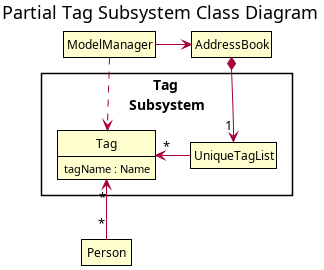

### Defensive `AddressBook`

As the `Tag` objects are moved to its own subsystem, there is a need to synchronise the `Tag` and `Person` subsystems which is done through cascading any changes made from `Tag` to `Person`. For example, if a `Tag` object is deleted, this tag should also be removed for all `Person` objects containing that tag. 
For operations involving `Person`, if there are missing tags that do not exist in the `UniqueTagList`, those tags will be added into the system before performing the operation on `Person`. 
For operations involving `Tag`, the changes will propagate to `Person` objects that contain the specified `Tag`. See the edit tag feature below for an example of `Tag` propagation.

To ensure that the tags and persons are properly synchronised, some modifications are made to `AddressBook#setPersons()` and `AddressBook#setTags()`. In the case of `AddressBook#setTags()`, the `AddressBook` will first strip any `Tag` objects from `Person` that are not in the new list before setting the new tags to the `AddressBook`.
In the case of `AddressBook#setPersons()`, `AddressBook` will add any tags that are in `Person` but not in the tag list. This will ensure that all `Tag` objects are recorded before setting the new persons to the `AddressBook`.

Below are the modified sequence diagrams of `AddressBook#setPersons()` and `AddressBook#setTags()`

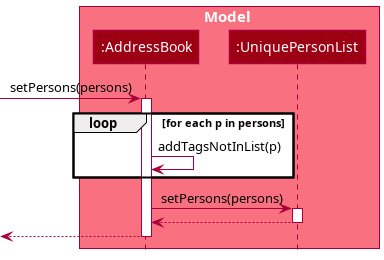

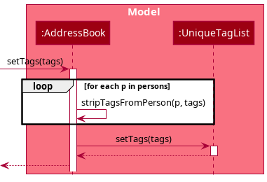

### Edit Tag Feature - `edittag`

The tag editing feature is similar to the system used for `Person` but extended to propagate the changes to the `Person` objects. This feature is implemented at the `AddressBook` level, and the related functions are:

* `AddressBook#setTag(target, editedTag)`
* `AddressBook#setPersonsWithTag(target, editedTag)`

Note: `target` refers to the tag to be updated, and `editedTag` is the replacement tag specified by the user.

### Tag Serialisation and Inflation

`Tag` serialisation and inflation is handled by the `Storage` component. The current implementation augments the existing method from `JsonSerializableAddressBook` through the addition of reading a list of tag names from the JSON file and saving them.

#### Serialisation of Tags

Since the tags are independent to the `Person`, the serialisation does not require any special attention for the dependency, as the integrity is guaranteed by the `AddressBook` component.

#### Inflation of Tags

To ensure the `Tag` objects are properly added into the address book, `JsonSerializableAddressBook#toModelType()` has been modified to inflate the tags first before the person. This is to ensure that duplicate tags are not added into the address book by accident and will only add tags that do not exist in the tag list (which could be caused by the user manually adding the tags in the user-editable JSON file).
A helper method `JSONSerializableAddressBook#addMissingTags()` is implemented to check all `Tag` objects within each `Person` and add only the missing `Tag` objects.

### The Schedule and Appointment Models

This section describes the implementation of the models used by the Schedule subsystem for storing and managing `Appointment` objects. It starts from the lowest level, and slowly works its way upwards.

:information_source: The overall **design goal** of the Schedule subsystem is to expose a **single** list of `ScheduleItem` objects through the `Model#getScheduleItemList()` method for the Logic and UI Components to access and display.  This list includes both `Appointment` and `AppointmentSlot` objects sorted in **chronological** order so that it can be directly used by external classes, unifying the ordering maintenance to the Model component.

An overview of the structure is shown in the partial class diagram below. Note that this diagram omits unrelated methods, and shows a high-level view of how classes are organized.

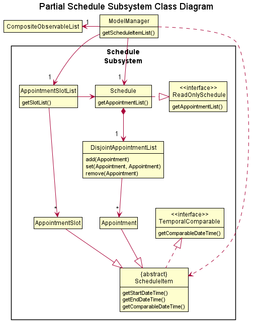

#### The `ScheduleItem` Class

There are 2 classes that represent items in the schedule, namely

- **`Appointment`**: Represents a user-defined appointment in the `Schedule`.
- **`AppointmentSlot`**: Represents empty slots in the `Schedule`, which are automatically computed based on `Appointment` objects.

Both `Appointment` and `AppointmentSlot` inherit from the `ScheduleItem` class. The classes are structured such that common scheduling-related logic are abstracted into the `ScheduleItem` class, while subclasses `Appointment` and `AppointmentSlot` handle the data-related logic.

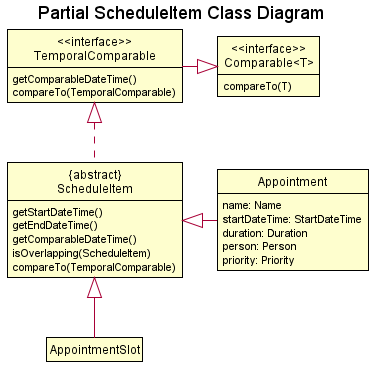

In particular, the `ScheduleItem` class implements the `TemporalComparable` interface, which allows the sorting of `Appointment` and `AppointmentSlot` objects through a **unified natural ordering**. This ordering is used by the lists containing these objects, including both `CompositeObservableList` and `DisjointAppointmentList`.

The scheduling-related methods of note implemented by `ScheduleItem` are:

* Getters `getStartDateTime()` and `getEndDateTime()`
* Comparator helper method `getComparableDateTime()`
* Comparable method `compareTo(ScheduleItem)`
* Helper method `isOverlapping(ScheduleItem)` for checking if the `ScheduleItem` overlaps with another `ScheduleItem`

:information_source: Two `ScheduleItem` objects are said to be **overlapping** if  `S1.getStartDateTime() < S2.getEndDateTime()` or  `A2.getStartDateTime() < A1.getEndDateTime()`

#### The `DisjointAppointmentList` Class

All persistent `Appointment` objects in the system are stored in a `DisjointAppointmentList` at the lowest level. `DisjointAppointmentList` is a partial implementation of a `List`, supporting only a minimal set of list operations including `add()`, `set()`, `remove()` and `contains()`. It enforces the following constraints upon the `Appointment` objects contained in the list:
* All `Appointment` objects in the list *must not* have overlapping periods, enforced through the `ScheduleItem#isOverlapping(ScheduleItem)` method.
  * This means that for all distinct `Appointment` objects `A1` and `A2` in the list,
    * `A1.getStartDateTime() >= A2.getEndDateTime()` or
    * `A2.getStartDateTime() >= A1.getEndDateTime()`.
* All `Appointment` objects are chronologically sorted by `startDateTime` within the list.

|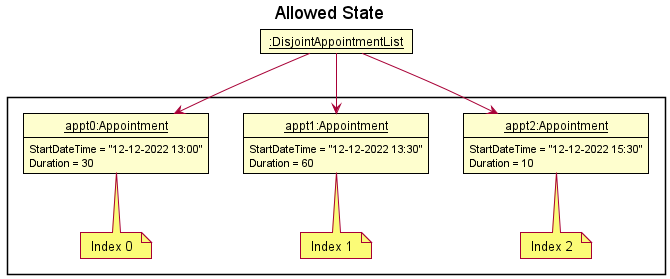|
| - |
|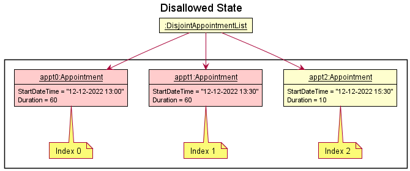|

The no-overlap constraint is enforced at such a low level as a defensive measure so that all higher-level classes that use `DisjointAppointmentList` are guaranteed a list of appointments that is consistent with the application constraints (that is to have no overlapping appointments in the schedule). This eliminates the need for higher-level classes to check and possibly recover from an inconsistent list.

While chronological ordering can arguably be enforced in `ModelManager` or even the `UI` component, the decision to implement it at such a low level is due to the fact that `DisjointAppointmentList` is the only class that has direct access to the underlying list of appointments.
Although manipulation using the public methods can be done, they do not provide index-level manipulation, and are hence less efficient due to the extra `List#indexOf` operation required. The solution of implementing additional index-based operations exists, but would result in highly specialized methods that are only used by the sorting function, unnecessarily complicating the class.

In order to efficiently maintain chronological ordering upon list modification, `DisjointAppointmentList` implements the shifting operation of *Insertion Sort* in the private method `shiftAppointmentToPosition(index)`. *Insertion Sort* is **significantly faster** than the default Java list sort function, which uses *Quick Sort*, when only 1 element is out of place. For list modifications, this is always the case, and the implementation will result in better sorting performance.

:information_source: **QuickSort vs Insertion Sort** The built-in Java *QuickSort* is still used in the initial construction of the `DisjointAppointmentList`, where there is no such guarantee that **only one** `Appointment` object is out of position.

||
| - |
||

#### The `Schedule` Wrapper Class

The `Schedule` class is a mutable wrapper around an underlying `DisjointAppointmentList` that logically represents a container for `Appointment` objects in the system. A `Schedule` object is contained in the `Model` object stored in `MainApp#model`, and serves as the single point of truth for all the persistent `Appointment` models in the Appointment subsystem.

:rotating_light: &nbsp; Multiple `Schedule` objects may exist concurrently in the system, but should be avoided where possible.

In terms of implementation, `Schedule` simply passes through the methods implemented by the backing `DisjointAppointmentList`. A defensive **read-only copy** of the underlying `DisjointAppointmentList` can be obtained from `Schedule#getAppointmentList()`.

A call of `Model#addAppointment()` is shown below to illustrate how a call is propagated through the model classes. Note how underlying calls are progressively abstracted from upper levels.

#### Defensive `Schedule`

`Schedule` implements the `ReadOnlySchedule` interface, which exposes only getter methods of the `Schedule` class. While `ModelManager` maintains a mutable copy of `Schedule`, all other classes accessing `Schedule` through `Model#getSchedule()` use a defensive version of `Schedule`. This prevents unintended modifications to the list of `Appointment` objects by external classes, and restricts that all modifications to the `Schedule` must be made through `ModelManager`.

#### Appointment Slot List

The `freebetween` feature requires the display of available slots chronologically between `Appointment` objects in the schedule. In order to support this, available slots in the `Schedule` are modelled as `AppointmentSlot` objects. However, since the list of `AppointmentSlot` objects for the `Schedule` are dependent on and change with the `Appointment` contained within it, it is not possible to maintain a separate independent list of `AppointmentSlot` objects.

Instead, the design of the system uses a wrapper `AppointmentSlotList` class that automatically computes the available slots in the `Schedule`. The `AppointmentSlotList` watches the backing `Schedule` for changes, and updates itself automatically. This design creates a layer of abstraction that ensures the list of `AppointmentSlot` objects in `AppointmentSlotList` are always consistent with the backing `Schedule`.

The `AppointmentSlotList` must be configured with some `TimeRange` using the `AppointmentSlotList#updateFilteredRange(TimeRange, int)` method for it to generate `AppointmentSlot` objects.

#### Appointment and AppointmentSlot List Composition

Since there are 2 separately maintained `ScheduleItem` lists, namely a filtered `DisjointAppointmentList` and `AppointmentSlotList`, there is a need to aggregate them into a single unified list for classes external to the Model component to use. The list must:

* contain all elements from both lists
* be chronologically sorted
* be chronologically disjoint

This is done using the `CompositeObservableList`, which takes 2 backing **sorted** `ObservableList` objects and merges them into a single **sorted** `ObservableList`, which is then exposed by the `Model` interface to external classes. `CompositeObservableList` watches the backing lists for changes, and updates its aggregated list according to any changes made to the underlying list, ensuring that the 3 constraints listed above are satisfied.

Using the above instance, the resultant `CompositeObservableList` is shown in the object diagram below.

:rotating_light: &nbsp; If the backing lists are not sorted, then the result list will also not be sorted.

### Appointments Filtering Feature - `apptbetween`

The `Appointment` filtering feature mirrors the system used for `Person`, and is facilitated by `FilteredList` from the JavaFX library. This feature is implemented at the `ModelManager` level, and the related functions are:

* `Model#updateFilteredAppointmentList(Predicate)`
* `Model#getFilteredAppointmentList()`

The filtering is implemented at the `ModelManager` level because it is the highest common level that can be accessed by both the `Logic` and `UI` components.
This allows code for filtering to be centralized, while allowing the lower level classes in the `Model` component access to the full unfiltered list of `Appointment` objects.

The sequence diagram below illustrates an example of both `Logic` and `UI` accessing the appointment filtering functionality.

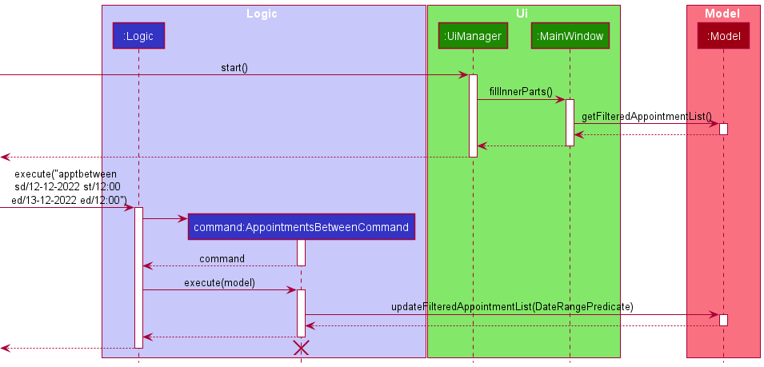

### Schedule Serialization and Inflation

`Schedule` serialization and inflation is handled by the `Storage` component in a simliar fashion to the serialization and inflation of `AddressBook`.

:rotating_light: **Important Note:** 
Because appointments depend on the existence of persons in the `AddressBook`, the `AddressBook` **must** be inflated **before** `Schedule` is inflated.

The inflation process is also designed to be forgiving, and will skip corrupted records instead of invalidating the entire data file.

Subsequent sections will describe how the dependence on `AddressBook` is handled during the process of serializing and inflating `Schedule`.

#### Serialization of Schedule

Because each schedule stores a reference to a `Person`, serialization does not require special attention for the dependency, since the integrity of the dependency is guaranteed by the `Model` component (through the consistency of its data lists).

#### Inflation of Schedule

This operation is particularly tricky as the dependency requires the data in `AddressBook` to be inflated correctly before `Schedule` can be inflated. This is handled in the `MainApp#initModelManager()` method, in which the implementation guarantees that `AddressBook` must be inflated first. The sequence diagram below shows this process and how `AddressBook` is propagated inwards.

It is important to note the design consideration that the coupling of `AddressBook` to the inflation methods stops at the `JsonScheduleStorage` component, as deeper levels work with the type `List<Person>` instead.

#### Schedule Data as a Separate JSON File

The data for `Schedule`, containing multiple `Appointment` objects is stored in a file separate from `AddressBook`. This is a conscious decision after considering the usability requirement that the JSON data file(s) should be user-editable. Clustering both the AddressBook and Schedule data into a single JSON file would have made it extremely large and cluttered, reducing the ease of editing it manually should the user choose. Separating Schedule and AddressBook data files allows the user to quickly narrow down the area to edit, making the task slightly easier.

However, this implementation comes with the increased risk of desynchronization between the AddressBook and Schedule data files. This is deemed an acceptable risk, but is also mitigated by validation checks during the inflation process to discard invalid appointment data, ensuring that the application only works with valid appointments.

### Edit Appointment Priority Feature - `prioritizeappt`

The priority feature is similar to the edit for `Appointment` but specifically changes the appointment's priority to one of the `Priority` values.
The `Priority` enum values provide the display name of the priority levels, and the static `Priority#getFromDisplayName()` method handles the case-insensitive String to enum conversion.

### Date Time Input Parsing

The app accepts multiple date and time formats to make it easier for users to input. This functionality is implemented by the `DateUtil` class, supported by the `commons.util.datetimeparser` package.

A high-level overview of the organization of the package is shown below.

The organization of the time parser mirrors the date parser, and their purposes are as follows:

* `TimeParser` / `DateParser`: Contains the actual parsing logic for determining the input format and the parsing logic to use
* `TimeParserPatternProvider` / `DateParserPatternProvider`: Contains the Regex patterns required for parsing

A flow of a client class using the parsing services provided by `DateUtil` for a dateTime input is as follows (Note that all classes and methods are static):

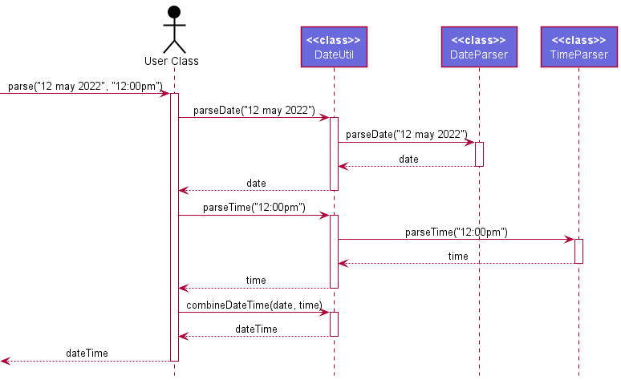

### Result List Model Type Switching Feature

Due to the fact that the application handles multiple model types, including `Person`, `Appointment` and `Tag`, there is a need for the UI to handle the display of different models and their associated data.
The approach taken is a "Focus" action that `Command` objects can request in the `CommandResult` they return after execution. The implementation of the focus is shown in the partial class diagram below.

#### Flow of Events

The returned `CommandResult` is then used by `MainWindow` to switch between different result lists, according to the model type being requested. This is done through the `MainWindow#changeListContentType()` method, which implements the actual UI manipulation.

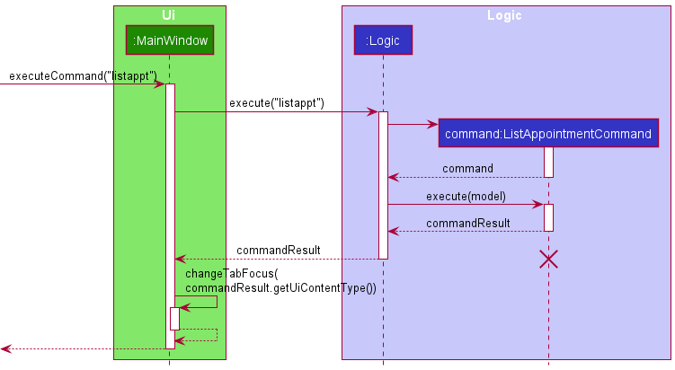

### The Onboarding Guide

This section describes the implementation of the onboarding guide component.

#### Accessing the Onboarding Guide
The onboarding guide is accessible through an onboarding prompt, which only appears if the data currently in application is the sample data that is seeded during the first run. The onboarding prompt leads the user to inititate the guided onboarding tutorial. The onboarding guide can also be alternatively accessed through the menu bar.

#### The `OnboardingWindow` Class
To mimic the actual environment of ContaX, the OnboardingWindow appears as a clone of the MainWindow, but with a different set of UI and logic components aimed towards providing a quick start guide.

The class diagram of the UI components are as follows:

#### Onboarding models
The `OnboardingStep` and `OnboardingStory` models are implemented to support the onboarding component. Functionally, each `OnboardingStep` instance represents a step in the onboarding guide, containing a set of instruction for the `OnboardingWindow`. The `OnboardingStory` on the other hand represents an onboarding sequence comprised of a series of OnboardingSteps.

##### The `OnboardingStep` Class
The purpose of the OnboardingStep is to soley contain UI and logic updates for the OnboardingWindow and is therefore implemented with minimal functionalities, providing only getters and setters for initialization and processing.

##### The `OnboardingStory` Class
The OnboardingStory serves as a simple container class for `OnboardingStep` objects, providing a basic subset of list functionalities.

#### The `OnboardingStoryManager` Class
The OnboardingStoryManager is a driver class for the OnboardingWindow containing the necessary logic to interact with the OnboardingStory and OnboardingStep. This is accomplished by keeping track of the onboarding guide's progress and providing the OnboardingWindow with the current OnboardingStep whenever a specified event is detected.

The sequence diagram of a mouse click event interaction is as follows:
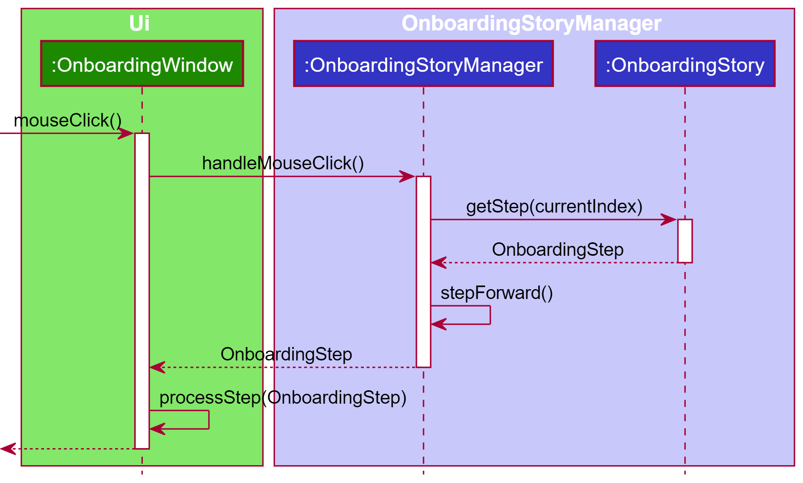

#### Processing of OnboardingSteps
Upon the processing of an OnboardingStep, the OnboardingWindow propagates the instruction to the other UI components to update them accordingly. In cases that the OnboardingStep does not contain any instruction for a particular UI components, that component's update function will not be invoked and will therefore remain the same.

A possible sequence of processing is as follows:

#### Directing User's Attention

Throughout the onboarding guide, Overlays and Highlights are used to direct the user's attention for a better user experience. Within the OnboardingWindow, multiple UI objects are implemented with the functionality to be highlighted with a yellow border to attract the user's attention.

##### The `Overlay` Class
The Overlay class is implemented using 2 translucent panes binded to the top and bottom of the OnboardingWindow. This makes it possible to create an desired area of focus by leaving only an area uncovered.

### Markdown-like Text Processing
The `TextStyleHelper` class contains a text processor that processes common text stylings into UI elements. This is mainly used in the `ResultDisplay` UI component, where it shows text output each time a command is executed. In particular, it is used in the error messages, in order to present error messages better.

Example of styled text:

It can be easily used in other components of ContaX if the need arises.

It currently supports:
- Italics
  - Enclosing text with `*`
- Bold
  - Enclosing text with `**`
- Bold and Italics
  - Enclosing text with `***`
- Monospaced
  - Enclosing text with `` ` ``

This was done by changing the `ResultDisplay` to use a `TextFlow` object, and dynamically generating a List of styled `Text` objects to add to the `ResultDisplay`.

A partial sequence diagram showing the process of how the UI uses the text styler is as follows:
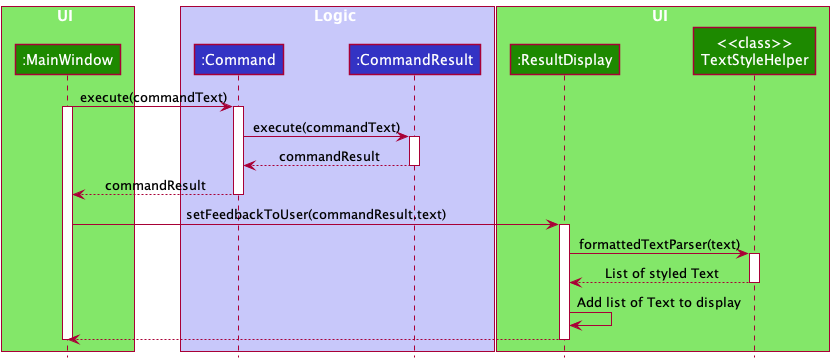

### Import and Export CSV Features

This section describes some of the details as to how the import and export CSV features were implemented

#### Import CSV

The import CSV function is meant to append to the current address book with new data imported from any CSV file. The intention is to allow users to be able to import from a Microsoft Excel compatible format. Since there are multiple different templates for contacts in CSV files across various platforms, such as Microsoft Outlook and Google Contacts, the feature is designed to be as flexible as possible, allowing the user to specify mappings for the information contained in the various columns.

The arguments that are parsed here are the custom column numbers for each value, e.g. `n/3 p/4 e/5 a/6 t/7` will read `Name` from column 3, `Phone` from column 4, `Email` from column 5, `Address` from column 6 and `Tags` from column 7

In the event that any of the data fields read do not conform to the restrictions given by each of the components in `Person`, that particular line will be skipped. For example, if the record in a line has an email that does not have the `@` symbol or if the record contains a duplicated name that already exists in the Address Book, the entire line will be skipped.

The `CSVManager` takes in a `IndexedCsvFile` object, opens the file and reads the lines. The logic that performs the parsing of data fields and creation of `Person` models is specified in the import command, and is passed as an anonymous function to CsvManager. The sequence diagram is as follows:

#### Export CSV

The Export CSV function is meant to value add upon the existing `.json` file saving to provide an alternative option, especially for users who prefer interacting with a Microsoft Excel compatible format.

The resulting `addressbook.csv` that will be produced will be in the following format:

| Name        | Phone        | Email        | Address        | Tags                            |
|-------------|--------------|--------------|----------------|---------------------------------|
| Person Name | Person Phone | Person Email | Person Address | Person Tag 1;Person Tag 2; .... |

Multiple tags are delimited by the `;` character.

Like the Import feature, File IO operations are also separated into the `CsvManager` class, such that the command logic takes the current address book, parses them into the appropriate strings, then passes it to the `CsvManager` to handle the writing to file.

The sequence diagram is as follows:

The exported file can be subsequently imported back into any other instance of ContaX, similar to the existing `.json` system of import/export.

### Enhanced Find Logic

The previous implementation of the find function is limited to only searching the name field. The enhancement to the feature allows users to search for `Person` objects by more attributes, including by the `phone`, `email` and `address` fields.
This is done by creating a helper `SearchType` model within the `model.util` package and abstracting the original `NameConstrainsKeywordsPredicate` to form `ConstrainsKeywordsPredicate` then create different inherit of three different types of predicate.
The sequence diagram is as follows:
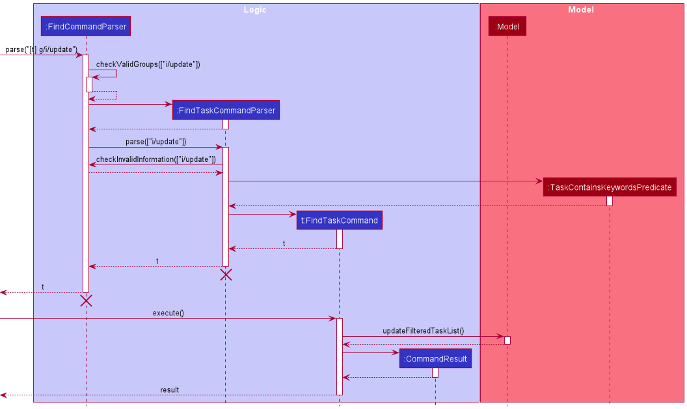

### Mass Operation Features

#### Chain Command

This extension allows the user to chain multiple commands together.

:information_source: **Note:** A command failure may lead to the following commands being invalid (e.g. if create person failed, you cannot edit the newly created person), causing an exception to be thrown.

The sequence diagram is as follows:

#### Range Command

This extension allows the user to perform a command on a range of persons based on their displayed index. During the conversion from user input to list of commands `from/INDEX to/INDEX` is used to generate the new commands that will be executed.

#### Batch Command

This extension allows the editing of `Person` objects that have attributes matching a specific value. Since this matching requires the objects to already exist, only edit and delete operations can be performed. The command translates the `Person` objects matching the condition into a series of indexes and executes the specified command on them sequentially.
The field of Batch Command parameters are checked in a defensive way that only one equal, start or end can be accepted.

The sequence diagram is as follows:
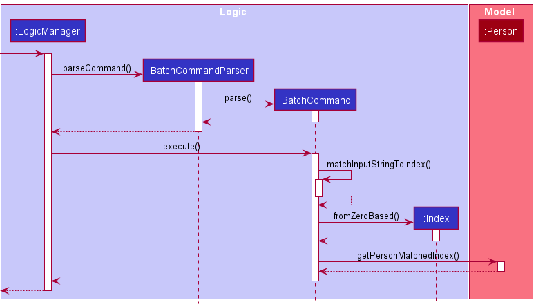

The multiple commands executed will return a `CommandResult` which contains a list of feedback messages of the results executed combined all together and returned as `feedbackToUser`

### \[Proposed\] Tag Finding Feature

The proposed find tag feature is similar to `findperson` where the user can search for tags from the specified keywords. This feature was not implemented as our target user need not maintain a large number of tags (compared to persons and appointments). However, if this feature is required in the future, the developer simply needs to implement the `Logic` components as the required components in `Model` already exists.
Similar to the system used for person, `Tag` filtering is facilitated by `FilteredList` from the JavaFX library which is implemented at the `ModelManager` level, and the related functions are:

* `Model#updateFilteredTagList()`
* `Model#getFilteredTagList()`

The filtering is implemented at the `ModelManager` level as it is the highest common level between the `Logic` and `Ui` components which allows the filtering to be centralized, while allowing the lower level classes in the `Model` component access the unfiltered list of the `Tag` object.

The sequence diagrams below illustrates the proposed implementations to access the tag filtering functionality.

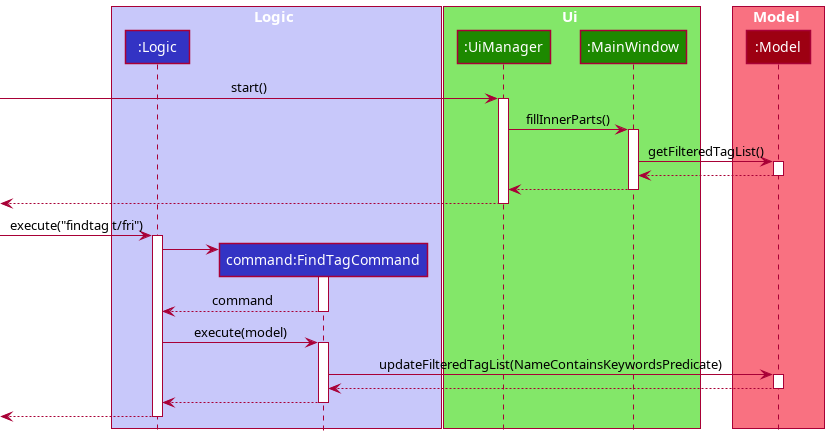

--------------------------------------------------------------------------------------------------------------------

## **Documentation, logging, testing, configuration, dev-ops**

* [Documentation guide](Documentation.md)
* [Testing guide](Testing.md)
* [Logging guide](Logging.md)
* [Configuration guide](Configuration.md)
* [DevOps guide](DevOps.md)

--------------------------------------------------------------------------------------------------------------------

## **Appendix: Requirements**

### Product scope

**Target user profile**:

* Needs to manage a large number of contacts
* Has a busy schedule with many appointments and meetings
* Needs to know when he is free very quickly
* Needs to manage information related to contacts and meetings efficiently
* Prefers keyboard over mouse interactions for on-the-go usage
* Is reasonably comfortable using apps with text-based inputs
* Currently uses excel for managing contacts

**Value proposition**: Allows efficient management of a large list of contacts together with a schedule, providing an integrated solution for tracking work-related information.

### User stories

This section lists the user stories that were both implemented in the system and considered but dropped in favour of other user stories.

#### Implemented User Stories

Priorities: High (must have) - `* * *`, Medium (nice to have) - `* *`, Low (unlikely to have) - `*`

| Priority | As a …​                                     | I want to …​                                                                         | So that I can…​                                                     |
|----------| ------------------------------------------ | ----------------------------------------------------------------------------------- | ---------------------------------------------------------------------- |
| `* * *`  | new user on my first run of the App        | see examples and onboarding guides                                                  | quickly learn how to use the application                               |
| `* * *`  | beginner user                              | see examples for all commands that can be used                                      | learn from them and modify them for my needs                           |
| `* * *`  | user                                       | add a new person to my address book                                                 | record their information                                               |
| `* * *`  | user                                       | list all the people in my address book                                              | see everyone in my address book                                        |
| `* * *`  | user                                       | find a person by name                                                               | locate details of persons without having to go through the entire list |
| `* *  `  | forgetful user                             | find a person by contact number, email or other attributes                          | find people even if I forget their name                                |
| `* * *`  | user                                       | delete a person in my address book                                                  | remove people if I no longer need to remember them                     |
| `* * *`  | user                                       | edit a person in my address book                                                    | update the information of various people when they change              |
| `* * *`  | user keeping track of many kinds of people | add tags to persons in my address book                                              | group multiple contacts together as a broader category                 |
| `* *  `  | power user                                 | find a person by tags                                                               | easily find subgroups of persons within my address book                |
| `* * *`  | new user                                   | import data from an Excel compatible format                                         | transfer my current list of persons from an Excel document             |
| `* *  `  | seasoned user                              | export my address book to an Excel compatible format                                | share my address book in a widely known document format                |
| `* * *`  | user                                       | create a new appointment in my schedule                                             | keep track of things that I need to do at different times              |
| `* * *`  | user                                       | list all appointments in my schedule                                                | have an overview of all scheduled events                               |
| `* *  `  | user                                       | edit the details of an appointment                                                  | respond to any changes in my schedule                                  |
| `* * *`  | user                                       | delete an appointment                                                               | free up my schedule if events are cancelled                            |
| `* * *`  | user                                       | find appointments within a range of dates                                           | plan my day(s) ahead of time                                           |
| `* *  `  | user                                       | search for appointments by a person's name                                          | find all appointments related to a particular person                   |
| `* * *`  | seasoned user                              | directly edit the .json data file to add/edit persons                               | manage the address book faster                                         |
| `* * *`  | seasoned user                              | export and import the .json file                                                    | easily transfer the data in ContaX across multiple users or devices    |
| `* * *`  | seasoned user                              | enter commands that perform an action on multiple contacts in a single step         | efficiently manage my address book                                     |
| `* *  `  | seasoned user                              | enter commands that perform an action on multiple appointments in a single step     | efficiently manage my schedule                                         |
| `* * *`  | seasoned user                              | batch multiple commands together                                                    | perform complex tasks in a single action                               |

#### User Stories Not Implemented

The following user stories were considered but ultimately not implemented. Some reasons for not implementing are listed below.

* The UI was made intuitive with only 1 text field for input so that there is no ambiguity for the user
* Document linking and handling is infeasible due the requirement of either an external file system or a large internal data folder for maintaining the fields
* A To-Do list does not add value to the problem that is being tackled
* Custom commands add significant complexity without much value. It was decided that keeping the commands simple and short would eliminate the need for this entirely.
* Finding tags by name does not add value to the problem that is being tackled

| Priority | As a …​        | I want to …​                                                    | So that I can…​                                                    |
|----------|----------------|-----------------------------------------------------------------|--------------------------------------------------------------------|
| `*    `  | beginner user  | see usage instructions and tutorials                            | remember how to perform certain tasks                              |
| `*    `  | power user     | link documents to a person                                      | easily locate related documents for a person                       |
| `*    `  | power user     | unlink documents from a person                                  | remove documents no longer required for a person                   |
| `*    `  | user           | view all appointments on a calendar interface                   | get an overview of all my appointments in the month                |
| `* *  `  | user           | be reminded of things that are happening on a particular day    | remember to attend them                                            |
| `* *  `  | forgetful user | find a tag by name                                              | locate details of tag without having to go through the entire list |
| `* *  `  | power user     | add a to-do list to an appointment                              | be reminded to make preparations for that appointment              |
| `* *  `  | power user     | view the to-do list of an appointment                           | ensure that I am fully prepared for the appointment                |
| `* *  `  | power user     | indicate if a task in the to-do list of an appointment is done  | keep track of the things that are already done                     |
| `* *  `  | power user     | search for appointments by tags and other filters               | easily find appointments amongst my large address book             |
| `* *  `  | power user     | link documents to an appointment                                | easily find them to prepare for my appointment                     |
| `*    `  | seasoned user  | export contact information to PDF                               | easily print mailing labels for contacts                           |
| `*    `  | seasoned user  | export all my data files as backup                              | have a copy of the contact list and import it in case of data loss |
| `*    `  | seasoned user  | customise the names and format of text-based commands           | easily remember and use commands I need                            |
| `*    `  | seasoned user  | add macros to chain multiple actions together as custom command | perform complex actions that I need in 1 command                   |

### Use cases

(For all use cases below, the **System** is the `ContaX` and the **Actor** is the `user`, unless specified otherwise)

Note that since underline is not allowed in markdown, included use cases are **bolded** instead.

#### Person-Related Use Cases

**UC1: List Persons**

**MSS**

1. User requests to list persons.
2. ContaX shows a list of persons.  
   Use case ends. &nbsp;

**UC2: Add Person**

**MSS**

1. User requests to add a person.
2. User enters details of the new person.
3. ContaX adds the new person.
4. ContaX shows that the person has been added successfully.  
   Use case ends. &nbsp;

**Extensions**

* 2a. ContaX detects that a required person attribute was not supplied.
    * 2a1. ContaX shows an error message indicating that there is a missing required attribute. &nbsp;
    * Use case ends. &nbsp;

* 2b. ContaX detects that a supplied attribute has an invalid value.
    * 2b1. ContaX shows an error message indicating that the supplied parameter is invalid.
    * 2b2. ContaX shows the expected allowed values. &nbsp;
    * Use case ends. &nbsp;

* 2c. ContaX detects that the person already exists.
    * 2c1. ContaX shows an error message indicating that the person already exists. &nbsp;
    * Use case ends. &nbsp;

**UC3: Delete Person**

**MSS**

1. User requests to **list persons (UC1)**.
2. ContaX displays a list of persons.
3. User requests to delete a person.
4. User selects the person to delete.
5. ContaX deletes the person.
6. ContaX displays a message indicating that the person was successfully deleted.  
   Use case ends. &nbsp;

**Extensions**

* 1a. User filters person by attribute.
  * 1a1. User **finds person (UC5)**.
  * Use case resumes from step 2. &nbsp;

* 1b. User filters persons by tag keyword.
  * 1b1. User **finds person by tag (UC10)**.
  * Use case resumes from step 2. &nbsp;

* 2a. ContaX has no persons to list. &nbsp;
  * Use case ends. &nbsp;

* 3a. ContaX cannot find the requested person to delete.
  * 3a1. ContaX shows an error message indicating that no such person exists. &nbsp;
  * Use case ends. &nbsp;

**UC4: Edit Person**

**MSS**

1. User requests to **list persons (UC1)**.
2. ContaX shows a list of persons.
3. User requests to edit person.
4. User enters details to modify a specific person.
5. ContaX updates the specified person.
6. ContaX displays a message indicating that the person was successfully edited.  
   Use case ends. &nbsp;

**Extensions**

* 1a. User filters person by attribute.
    * 1a1. User **finds person (UC5)**.
    * Use case resumes from step 2. &nbsp;

* 1b. User filters persons by tag keyword.
    * 1b1. User **finds person by tag (UC10)**.
    * Use case resumes from step 2. &nbsp;

* 2a. ContaX has no persons to list. &nbsp;
  * Use case ends. &nbsp;

* 4a. ContaX detects that a required person attribute was not supplied.
    * 4a1. ContaX shows an error message indicating that there is a missing required attribute. &nbsp;
    * Use case ends. &nbsp;

* 4b. ContaX detects that a supplied attribute has an invalid value
    * 4b1. ContaX shows an error message indicating that the supplied parameter is invalid.
    * 4b2. ContaX shows the expected allowed values. &nbsp;
    * Use case ends. &nbsp;

* 5a. ContaX cannot find the requested person to edit.
    * 5a1. ContaX shows an error message indicating that no such person exists. &nbsp;
    * Use case ends. &nbsp;

* 5b. ContaX detects that a person with the same name already exists.
    * 5b1. ContaX shows an error message indicating that the person already exists. &nbsp;
    * Use case ends. &nbsp;

**UC5: Find Persons**

**MSS**

1. User requests to find persons.
2. User enters details to find person by.
3. ContaX shows a list of persons that matches the specified details.  
   Use case ends. &nbsp;

**Extensions**

* 2a. ContaX detects that a required person attribute was not supplied.
  * 2a1. ContaX shows an error message indicating that there is a missing required attribute. &nbsp;
  * Use case ends. &nbsp;

* 2b. ContaX detects that a supplied attribute has an invalid value
  * 2b1. ContaX shows an error message indicating that the supplied parameter is invalid.
  * 2b2. ContaX shows the expected allowed values. &nbsp;
  * Use case ends. &nbsp;

* 3a. ContaX has no persons to list. &nbsp;
  * 3a1. Use case ends. &nbsp;

#### Tag-Related Use Cases

**UC6: List All Tags**

**MSS**

1. User requests to list tags.
2. ContaX shows a list of tags.  
    Use case ends. &nbsp;

**UC7: Add Person Tag**

**MSS**

1. User requests to add tag.
2. User enters details to add tag.
3. ContaX adds new tag.
4. ContaX shows that the appointment has been added successfully. &nbsp;
   Use case ends. &nbsp;

**Extensions**

* 2a. ContaX detects that the required tag attributed was not supplied.
  * 2a1. ContaX shows an error message indicating that there is a missing required attribute. &nbsp;
  * Use case ends. &nbsp;

* 2b. ContaX detects that invalid characters were supplied.
  * 2b1. ContaX shows an error message indicating that an invalid character was found.
  * 2b2. ContaX shows the expected allowed values. &nbsp;
  * Use case ends. &nbsp;

* 3a. ContaX detects that the tag already exists.
  * 3a1. ContaX shows an error message indicating that the tag already exists in the system. &nbsp;
  * Use case ends. &nbsp;

**UC8: Edit Person Tag**

**MSS**

1. User **lists all tags (UC6)**.
2. User requests to edit tag.
3. User enters details to edit tag.
4. ContaX updates the specified tag.
5. ContaX shows that the tag has been edited successfully.  
   Use case ends. &nbsp;

**Extensions**

* 3a. ContaX detects that the required tag attributed was not supplied.
    * 3a1. ContaX shows an error message indicating that there is a missing required attribute. &nbsp;
    * Use case ends. &nbsp;

* 3b. ContaX detects that invalid characters were supplied.
    * 3b1. ContaX shows an error message indicating that an invalid character was found.
    * 3b2. ContaX shows the expected allowed values. &nbsp;
    * Use case ends. &nbsp;

* 4a. ContaX cannot find the requested tag to edit.
  * 4a1. ContaX shows an error message indicating that no such tag exists. &nbsp;
  * Use case ends. &nbsp;

* 4b. ContaX detects that the updated tag already exists.
  * 4b1. Contax shows an error message indicating that the tag already exists in the system. &nbsp;
  * Use case ends. &nbsp;

**UC9: Delete Person Tag**

**MSS**

1. User **list All Tags (UC6)**.
2. User requests to delete tag.
3. User enters details to delete tag.
4. ContaX deletes the specified tag.
5. ContaX shows that the tag has been deleted successfully.  
   Use case ends. &nbsp;

**Extensions**

* 3a. ContaX detects that the required tag attributed was not supplied.
    * 3a1. ContaX shows an error message indicating that there is a missing required attribute. &nbsp;
    * Use case ends. &nbsp;

* 4a. ContaX cannot find the requested tag to delete.
    * 4a1. ContaX shows an error message indicating that no such tag exists. &nbsp;
    * Use case ends. &nbsp;

**UC10: Find Persons By Tag**

**MSS**

1. User requests to find persons by tag.
2. User enters keyword to search by.
3. ContaX shows a list of persons whose tags contain the specified keyword.  
   Use case ends. &nbsp;

**Extensions**

* 2a. ContaX detects that the keyword was not supplied.
  * 2a1. ContaX shows an error message prompting for the keyword. &nbsp;
  * Use case ends. &nbsp;

* 2b. ContaX detects that invalid characters were supplied.
    * 2b1. ContaX shows an error message indicating that an invalid character was found.
    * 2b2. ContaX shows the expected allowed values. &nbsp;
    * Use case ends. &nbsp;

* 3a. ContaX has no persons to list. &nbsp;
  * Use case ends. &nbsp;

#### Appointment-Related Use Cases

**UC11: List All Appointments**

**MSS**

1. User requests to list appointments.
2. ContaX shows a list of all appointments.  
   Use case ends.

**UC12: Add Appointment**

**MSS**

1. User requests to add an appointment.
2. User enters details of the new appointment.
3. ContaX saves the new appointment.
4. ContaX shows that the appointment has been added successfully.  
   Use case ends.

**Extensions**

* 2a. ContaX detects that a required appointment attribute was not supplied.
  * 2a1. ContaX shows an error message indicating that there is a missing required attribute. &nbsp;
  * Use case ends. &nbsp;

* 2b. ContaX detects that a supplied attribute has an invalid value.
  * 2b1. ContaX shows an error message indicating that the supplied parameter is invalid.
  * 2b2. ContaX shows the expected allowed values. &nbsp;
  *  Use case ends. &nbsp;

* 2c. ContaX detects that the appointment details supplied overlaps with another appointment already in ContaX.
  * 2c1. ContaX shows an error message indicating that the appointment cannot be created due to overlapping appointments. &nbsp;
  * Use case ends. &nbsp;

**UC13: Delete Appointment**

**MSS**

1. User **lists all appointments (UC11)**.
2. ContaX displays a list of appointments.
3. User requests to delete a specific appointments in the list.
4. ContaX deletes the appointment.
5. ContaX displays a message indicating that the appointment was deleted.  
    Use case ends.

**Extensions**

* 1a. User filters appointments by condition.
  * 1a1. User **finds appointments (UC15)** &nbsp;
  * Use Case resumes from step 2. &nbsp;

* 1b. User lists appointments with available slots in the schedule.
  * 1b1. User **finds schedule slots (UC16)** &nbsp;
  * 1b2. Use Case resumes from step 2. &nbsp;

* 2a. ContaX has no appointments to list. &nbsp;
  * Use case ends. &nbsp;

* 3a. ContaX cannot find the requested appointment to delete.
    * 3a1. ContaX shows an error message indicating that no such appointment exists. &nbsp;
    * Use case resumes at step 2. &nbsp;

**UC14: Edit Appointment**

**MSS**

1. User **lists all appointments (UC11)**.
2. ContaX displays a list of appointments.
3. User requests to modify a specific appointment.
4. User enters the new attributes for the appointment.
5. ContaX saves the modified appointment.
6. ContaX displays a message indicating that the appointment was successfully edited.  
   Use case ends.

**Extensions**

* 1a. User filters appointments by condition.
    * 1a1. User **finds appointments (UC15)** &nbsp;
    * Use Case resumes from step 2. &nbsp;

* 1b. User lists appointments with available slots in the schedule.
    * 1b1. User **finds schedule slots (UC16)** &nbsp;
    * 1b2. Use Case resumes from step 2. &nbsp;

* 2a. ContaX has no appointments to list. &nbsp;
    * Use case ends. &nbsp;

* 3a. ContaX cannot find the requested appointment to edit.
    * 3a1. ContaX shows an error message indicating that no such appointment exists. &nbsp;
    * Use case resumes at step 2. &nbsp;

* 4a. ContaX detects that a supplied attribute has an invalid value.
    * 4a1. ContaX shows an error message indicating that the supplied parameter is invalid.
    * 4a2. ContaX shows the expected allowed values. &nbsp;
    *  Use case resumes at step 2. &nbsp;

* 4b. ContaX detects that the appointment details supplied overlaps with another appointment already in ContaX.
    * 4b1. ContaX shows an error message indicating that the appointment cannot be edited due to overlapping appointments. &nbsp;
    * Use case ends. &nbsp;

**UC15: Find Appointments**

**MSS**

1. User decides to search by keyword.
2. User enters a keyword to search by.
3. ContaX shows a list of all appointments with names containing the keyword.  
   Use case ends.

**Extensions**

* 1a. User decides to search for appointments by date range.
    * 1a1. User enters the start and end date to search between.
    * 1a2. ContaX shows a list of all appointments between the specified start and end date. &nbsp;
    * Use Case ends. &nbsp;

* 2a. User searches by a specific appointment attribute.
    * 2a1. User enters the attribute to search by.
    * 2a2. ContaX shows a list of all appointments with keyword contained in the specified attribute. &nbsp;
    * Use Case ends. &nbsp;

**UC16: Find Schedule Slots**

**MSS**

1. User enters the properties of the slots to search for and a time period to search between.
2. ContaX shows a list of appointments within the time period.
3. ContaX shows a list of all slots in the schedule within the time period.  
   Use case ends.

**Extensions**

* 1a. User enters invalid slot properties.
    * 1a1. ContaX shows an error message that the properties entered are invalid. &nbsp;
    * Use Case ends. &nbsp;

**UC17: Edit Appointment Priority**

**MSS**

1. User **lists all appointments (UC11)**.
2. ContaX displays a list of appointments.
3. User requests to modify the priority level of a specific appointment.
4. User enters the new priority for the appointment.
5. ContaX saves the modified appointment.
6. ContaX displays a message indicating that the appointment was successfully edited.  
   Use case ends.

**Extensions**

* 1a. User filters appointments by condition.
    * 1a1. User **finds appointments (UC15)** &nbsp;
    * Use Case resumes from step 2. &nbsp;

* 1b. User lists appointments with available slots in the schedule.
    * 1b1. User **finds schedule slots (UC16)** &nbsp;
    * 1b2. Use Case resumes from step 2. &nbsp;

* 2a. ContaX has no appointments to list. &nbsp;
    * Use case ends. &nbsp;

* 3a. ContaX cannot find the requested appointment to edit.
    * 3a1. ContaX shows an error message indicating that no such appointment exists. &nbsp;
    * Use case resumes at step 2. &nbsp;

* 4a. User enters invalid priority.
    * 4a1. ContaX shows an error message indicating that the supplied priority is invalid &nbsp;
    * Use case resumes at step 2. &nbsp;

#### Import/Export CSV UseCases

**UC18: Export CSV File**

**MSS**

1. User requests to export address book as file for ContaX
2. ContaX saves a CSV file to the disk  
   Use case ends.

**UC19: Import CSV file**

**MSS**

1. User requests to import a CSV file from a specified file path
2. ContactX imports the contacts from given CSV file  
    Use case ends.

**Extensions**

* 1a. User enters custom column definitions &nbsp;
    * Use case resumes at step 2 &nbsp;

* 2a. Invalid CSV file selected
    * 2a1. ContaX shows an error message indicating that the CSV file selected is invalid. &nbsp;
    * Use case ends. &nbsp;

### Non-Functional Requirements

1.  Should work on any _mainstream OS_ as long as it has Java `11` or above installed.
2.  Should be able to hold up to 1000 persons and appointments without a noticeable sluggishness in performance for typical usage.
3.  A user with above average typing speed for regular English text (i.e. not code, not system admin commands) should be able to accomplish most of the tasks faster using commands than using the mouse.
4.  Should be intuitive for a first-time user to perform basic actions.
5.  The data file should be understandable to tech-savvy human readers.
6.  The system's design should follow the *Object-Oriented Paradigm (OOP)*.
7.  Should be packageable into a single JAR file.
8.  No initial setup should be required before running the application.
9.  Should function properly without an internet connection.
10. Graphical User Interface (GUI) should be properly displayed on screens with a minimum resolution of `1280x720`.
11. Graphical User Interface (GUI) should be properly displayed with `100%`, `125%` and `150%` text scaling configurations.

### Glossary

* **Mainstream OS**: Windows, Linux, Unix, OS-X
* **Address Book**: The part of ContaX that keeps track of a list of Persons
* **Schedule**: The part of ContaX that keeps track of Appointments
* * **Contact** and **Person**: These 2 terms are used interchangably, and refer to a single record in the Address Book
* **Appointment**: Refers to a single record in the Schedule
* **Appointment Slot**: Refers to an empty time range in the Schedule
* **CSV**: Comma-separated values. Common file format used for data spreadsheets, compatible with Microsoft Excel and other similar spreadsheet applications
* **Onboarding Guide**: The quick start guide to ContaX
* **Disjoint Appointments**: Appointments are disjoint if the time periods they span do not overlap with each other, that is, one appointment starts after the other appointment ends
* **Overlapping Appointments**: Appointments are overlapping if they are not disjoint
* **Natural Ordering**: The order in which objects should be arranged

--------------------------------------------------------------------------------------------------------------------

## **Appendix 1: Instructions for manual testing**

Given below are instructions to test the app manually.

:information_source: **Note:** These instructions only provide a starting point for testers to work on;
testers are expected to do more *exploratory* testing.

### Launch and shutdown

1. Initial launch

   1. Download the jar file and copy into an empty folder

   2. Double-click the jar file Expected: Shows the GUI with a set of sample contacts. The window size may not be optimum.

2. Saving window preferences

   1. Resize the window to an optimum size. Move the window to a different location. Close the window.

   2. Re-launch the app by double-clicking the jar file. 
       Expected: The most recent window size and location is retained.

### Tabbed View
1. Tabs automatically change on `list*` command

   1. Test case: `listtags`  
      Expected: The selected tab should be changed to `Tags` if the user was not at that tab.
   
  2. Test case: `listpersons`  
     Expected: The selected tab should be changed to `Persons` if the user was not at that tab.

  3. Test case: `listappt`  
     Expected: The selected tab should be changed to `Appointments` if the user was not at that tab.

### Saving data

1. Dealing with missing/corrupted data files

   1. Test case: Missing data file 
      **Expected:** Default contacts are loaded instead. Upon an operation that interacts with the data, e.g. add/delete/edit persons, the data will then be saved as `addressbook.json`.
   
   2. Test case: Corrupted JSON Structure in data file 
      **Expected:** An empty AddressBook will be loaded instead. Upon an operation that interacts with the data, the existing corrupted `addressbook.json` file will be replaced with the new data.

   3. Test case: Invalid Person record in JSON data file (e.g. alphabets in phone number) 
      **Expected:** Data is loaded into ContaX normally, with invalid entries skipped.

   4. Test case: Invalid Appointment record in JSON data file (e.g. restricted symbols in appointment name) 
      **Expected:** Data is loaded into ContaX normally, with invalid entries skipped.

2. Manually editing JSON entries

   1. Prerequisites: Do not have an active instance of ContaX open.
   
   2. Test case: Editing the entries directly from the JSON file  
      **Expected:** Upon opening of ContaX, the previously edited data is loaded into ContaX normally.
   
   3. Test case: Editing the entries but with invalid data  
      **Expected:** Upon opening of ContaX, the particular entry will be skipped.

### Importing Contacts from CSV Files

1. Importing contacts from a CSV File

   1. Prerequisites: Must have an existing CSV File with contact information.
   
   2. Test case: CSV File was exported previously from another instance of ContaX, or is in proper ContaX format (ContaX format details can be found [here](https://ay2122s2-cs2103-w17-1.github.io/tp/UserGuide.html#exporting-the-data-exportcsv))  
      **Expected:** Entries in the CSV file are successfully appended into ContaX.
   
   3. Test case: CSV File was in another format but has the necessary entries of each contact (Name, Phone, Email, Address, Tags). `importcsv` command executed specifying each of the column numbers to read from.  
      **Expected:** Entries in the CSV file are successfully appended into ContaX.
   
   4. Test case: Contact information in CSV File has invalid information (e.g. alphabets in phone number) 
      **Expected:** The particular entries that have invalid information will be skipped during the import.

### Exporting Contacts as CSV Files

1. Exporting contacts from a CSV File

   1. Test case: `exportcsv` command executed  
      **Expected:** Current contact information will be saved to the file location `data\addressbook.csv`
   
   2. Test case: Command executed with empty address book  
      **Expected:** File is still created but only contains the headers.

### Resizing the Help Window

1. Resizing the Help Window

   1. Prerequisite: Help Window is open

   1. Test case: Resize Help Window to be smaller  
   Expected: The Help Window's dimensions will not go below `1000x600`.

   1. Test case: Resize Help Window to be larger  
   Expected: The Help Window's dimensions will not go above `1250x700`.

### Resizing the Onboarding Guide prompt

1. Resizing the Onboarding Guide prompt

   1. Prerequisite: Onboarding Guide prompt is open

   2. Test case: Resize Onboarding Guide prompt to be smaller  
   Expected: The prompt's dimensions will not go below `500x150`.

   3. Test case: Resize Onboarding Guide prompt to be larger  
   Expected: The prompt's dimensions will not go above `700x400`.

### Sample Commands

1. Launch the application and type any of the commands below into the input box. The table lists the expected action of the command.

:information_source: **Note:** This section only lists a few complex commands with arguments. For more information on each of the commands, refer to the [user guide](https://ay2122s2-cs2103-w17-1.github.io/tp/UserGuide.html).

| **Command**                                                                                       | **Expected Action**                                            |
|---------------------------------------------------------------------------------------------------|----------------------------------------------------------------|
| `addperson n/Johnny Ong p/12345678 e/sample@domain.com a/123 Chestnut Drive t/friend t/colleague` | Adds a new contact called Johnny Ong                           |
| `deleteperson 1`                                                                                  | Deletes the contact at index 1                                 |
| `editperson 1 n/James Lee`                                                                        | Changes the name of the contact at index 1 to James Lee        |
| `findperson James Jake`                                                                           | Finds contacts whose name contains James or Jake               |
| `addtag n/Clients`                                                                                | Adds a new tag called Clients                                  |
| `edittag 1 t/Blocked`                                                                             | Edits the tag at index 1 to be named Blocked                   |
| `deletetag 1`                                                                                     | Deletes the tag at index 1                                     |
| `addappt n/Call Bob d/14-02-2022 t/11:00 p/2 l/60`                                                | Adds an appointment called Call Bob                            |
| `deleteappt 1`                                                                                    | Deletes the appointment at index 1                             |
| `editappt 1 n/Call Boss`                                                                          | Changes the name of the appointment at index 1 to Call Boss    |
| `apptbetween sd/21-10-2022`                                                                       | List all appointments from 21 october 2022                     |
| `freebetween l/40`                                                                                | Lists empty slots in the schedule that at at least 1 hour long |
| `findappt Meeting`                                                                                | Find appointments that contain the word Meeting in the name    |
| `batch editperson p/87654321 by/phone =/12345678`                                                 | Edits all persons whose phone numbers are 12345678             |
| `range editperson p/87654321 from/1 to/10`                                                        | Edits all persons from index 1 to 10                           |
| `chain editappt 1 l/360 && listappt`                                                              | Edits the appointment at index 1 and lists all appointments    |

## **Appendix 2: Effort**

* Difficulty level
   * We developed a lot of different features with varying levels of difficulty, depth and complexity.
   * As a whole, we felt the difficulty level of the project was Moderate.
   * As we choose to extend AB-3, we needed an extensive understanding of the system design. This was required in order to extend the system in a way that seamlessly integrates with the existing AB-3.
* Challenges Faced
   * As every member worked on multiple issues and features, the following list are just some we picked out and is not exhaustive.
     * Working with the `csv` format without a library required writing a parser from scratch
     * Involved comparatively more UI work than AB-3, especially for onboarding components, which complicated testing.
     * JavaFX UI elements not being consistent across platforms, requiring additional manual testing.
     * Range and Chain commands were tough to test due to many possible test cases, requiring additional testing and fixing.
     * Appointments subsystem was built upon the existing AB-3 system, requiring heavy modification and many additions to achieve the intended end product.
     * In order to manage deadlines, we had to set workflows such as internal PR freeze deadlines and internal milestone closing deadlines.
* Effort Required
  * Extensive modification to the current code base.
  * Extensive amount of tests written to cover as many scenarios as possible.
  * We had extensive weekly meeting early in order to ensure every developer knows what is required for the week.
* Achievements
  * Built a product that we feel fulfills our initial targets.
  * Achieved all `Must Have` User Stories.
  * Met all milestones and deadlines, including internally set deadlines.
* Reuse
  * The overall design and structure took heavy inspiration from the original AB-3, and closely resembles it.
