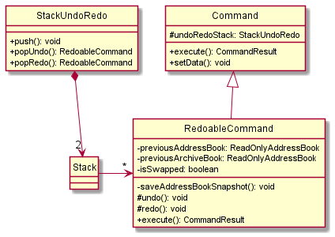
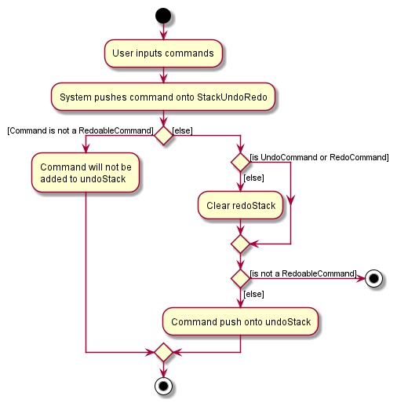
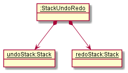
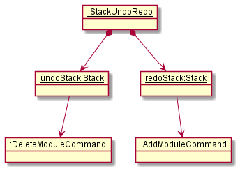

* Table of Contents
{:toc}

--------------------------------------------------------------------------------------------------------------------

## **Introduction**

ModuleMateFinder is a desktop address-book-like application that is designed for university students. It is used to 
keep track of your friends' contacts, as well as the modules they are taking. ModuleMateFinder is optimized for use 
via the CLI, and it has a GUI created with JavaFX. It is written in Java.

This Developer Guide documents the architecture, design implementations and considerations of various 
components and features in ModuleMateFinder, and aims to allow developers to gain a deeper understanding on the 
application.

--------------------------------------------------------------------------------------------------------------------

## **Acknowledgements**

* Code reused from [tutorial](https://nus-cs2103-ay2122s2.github.io/tp/tutorials/AddRemark.html) for implementing `Remark`
--------------------------------------------------------------------------------------------------------------------

## **Setting up, getting started**

Refer to the guide [_Setting up and getting started_](SettingUp.md).

--------------------------------------------------------------------------------------------------------------------

## **Design**

:bulb: **Tip:** The `.puml` files used to create diagrams in this document can be found in the [diagrams](https://github.com/se-edu/addressbook-level3/tree/master/docs/diagrams/) folder. Refer to the [_PlantUML Tutorial_ at se-edu/guides](https://se-education.org/guides/tutorials/plantUml.html) to learn how to create and edit diagrams.

### Architecture

The ***Architecture Diagram*** given above explains the high-level design of the App.

Given below is a quick overview of main components and how they interact with each other.

**Main components of the architecture**

**`Main`** has two classes called [`Main`](https://github.com/se-edu/addressbook-level3/tree/master/src/main/java/seedu/address/Main.java) and [`MainApp`](https://github.com/se-edu/addressbook-level3/tree/master/src/main/java/seedu/address/MainApp.java). It is responsible for,
* At app launch: Initializes the components in the correct sequence, and connects them up with each other.
* At shut down: Shuts down the components and invokes cleanup methods where necessary.

[**`Commons`**](#common-classes) represents a collection of classes used by multiple other components.

The rest of the App consists of four components.

* [**`UI`**](#ui-component): The UI of the App.
* [**`Logic`**](#logic-component): The command executor.
* [**`Model`**](#model-component): Holds the data of the App in memory.
* [**`Storage`**](#storage-component): Reads data from, and writes data to, the hard disk.

**How the architecture components interact with each other**

The *Sequence Diagram* below shows how the components interact with each other for the scenario where the user issues the command `delete 1`.

Each of the four main components (also shown in the diagram above),

* defines its *API* in an `interface` with the same name as the Component.
* implements its functionality using a concrete `{Component Name}Manager` class (which follows the corresponding API `interface` mentioned in the previous point.

For example, the `Logic` component defines its API in the `Logic.java` interface and implements its functionality using the `LogicManager.java` class which follows the `Logic` interface. Other components interact with a given component through its interface rather than the concrete class (reason: to prevent outside component's being coupled to the implementation of a component), as illustrated in the (partial) class diagram below.

The sections below give more details of each component.

### UI component

The **API** of this component is specified in [`Ui.java`](https://github.com/se-edu/addressbook-level3/tree/master/src/main/java/seedu/address/ui/Ui.java)

The UI consists of a `MainWindow` that is made up of parts e.g.`CommandBox`, `ResultDisplay`, `PersonListPanel`, `StatusBarFooter` etc. All these, including the `MainWindow`, inherit from the abstract `UiPart` class which captures the commonalities between classes that represent parts of the visible GUI.  
Furthermore, `AddWindow` and `EditWindow` keeps a reference to `MainWindow`'s `Logic` component in order to execute commands.

The `UI` component uses the JavaFx UI framework. The layout of these UI parts are defined in matching `.fxml` files that are in the `src/main/resources/view` folder. For example, the layout of the [`MainWindow`](https://github.com/se-edu/addressbook-level3/tree/master/src/main/java/seedu/address/ui/MainWindow.java) is specified in [`MainWindow.fxml`](https://github.com/se-edu/addressbook-level3/tree/master/src/main/resources/view/MainWindow.fxml)

The `UI` component,

* executes user commands using the `Logic` component.
* listens for changes to `Model` data so that the UI can be updated with the modified data.
* keeps a reference to the `Logic` component, because the `UI` relies on the `Logic` to execute commands.
* depends on some classes in the `Model` component, as it displays `Person` object residing in the `Model`.

### Logic component

**API** : [`Logic.java`](https://github.com/se-edu/addressbook-level3/tree/master/src/main/java/seedu/address/logic/Logic.java)

Here's a (partial) class diagram of the `Logic` component:

How the `Logic` component works:
1. When `Logic` is called upon to execute a command, it uses the `AddressBookParser` class to parse the user command.
1. This results in a `Command` object (more precisely, an object of one of its subclasses e.g., `AddCommand`) which is executed by the `LogicManager`.
1. The command can communicate with the `Model` when it is executed (e.g. to add a person).
1. The result of the command execution is encapsulated as a `CommandResult` object which is returned back from `Logic`.

The Sequence Diagram below illustrates the interactions within the `Logic` component for the `execute("delete 1")` API call.

The Sequence Diagram below illustrates the interactions from the `Logic` component for the `execute("add")`

:information_source: **Note:** The lifeline for `DeleteCommandParser` should end at the destroy marker (X) but due to a limitation of PlantUML, the lifeline reaches the end of diagram.

Here are the other classes in `Logic` (omitted from the class diagram above) that are used for parsing a user command:

How the parsing works:
* When called upon to parse a user command, the `AddressBookParser` class creates an `XYZCommandParser` (`XYZ` is a placeholder for the specific command name e.g., `AddCommandParser`) which uses the other classes shown above to parse the user command and create a `XYZCommand` object (e.g., `AddCommand`) which the `AddressBookParser` returns back as a `Command` object.
* All `XYZCommandParser` classes (e.g., `AddCommandParser`, `DeleteCommandParser`, ...) inherit from the `Parser` interface so that they can be treated similarly where possible e.g, during testing.

### Model component
**API** : [`Model.java`](https://github.com/AY2122S2-CS2103T-T13-4/tp/blob/master/src/main/java/seedu/address/model/Model.java)

The `Model` component,

* stores the address book data i.e., all `Person` objects (which are contained in a `UniquePersonList` object).
* stores the currently 'selected' `Person` objects (e.g., results of a search query) as a separate _filtered_ list which is exposed to outsiders as an unmodifiable `ObservableList<Person>` that can be 'observed' e.g. the UI can be bound to this list so that the UI automatically updates when the data in the list change.
* stores a `UserPref` object that represents the user’s preferences. This is exposed to the outside as a `ReadOnlyUserPref` objects.
* does not depend on any of the other three components (as the `Model` represents data entities of the domain, they should make sense on their own without depending on other components)

:information_source: **Note:** An alternative (arguably, a more OOP) model is given below. It has a `Module` list in the `AddressBook`, which `Person` references. This allows `AddressBook` to only require one `Module` object per unique module, instead of each `Person` needing their own `Module` objects. 

### Storage component

**API** : [`Storage.java`](https://github.com/se-edu/addressbook-level3/tree/master/src/main/java/seedu/address/storage/Storage.java)

The `Storage` component,
* can save both address book data and user preference data in json format, and read them back into corresponding objects.
* inherits from both `AddressBookStorage` and `UserPrefStorage`, which means it can be treated as either one (if only the functionality of only one is needed).
* depends on some classes in the `Model` component (because the `Storage` component's job is to save/retrieve objects that belong to the `Model`)

### Common classes

Classes used by multiple components are in the `seedu.addressbook.commons` package.

--------------------------------------------------------------------------------------------------------------------

## **Implementation**

This section describes some noteworthy details on how certain features are implemented.
  
### Add Modules Feature
#### Implementation

The add modules mechanism is facilitated by `AddModulesCommand`. Its functionality is implemented in the `AddModulesCommand.java` class which follows the `Command` interface. It extends `Command` with a list of modules `List<Module>` that is to be added to an existing person, as well as the index of the person to add the modules to, stored internally as `modulesToAdd` and `targetIndex` respectively.

Additionally, it implements the following operations: 
* `Command#execute(Model model)` - Returns the feedback message containing information about module(s) added to a target person, for eventual displays in the GUI.
* `createEditedPerson(Person personToEdit, List<Module> modulesToAdd)` - Creates and returns a Person with `modulesToAdd` added to the existing details of `personToEdit`.
* `hasModulesInCommon(Person personToEdit, List<Module> proposedModules)` - Returns true if `personToEdit` contains any modules in `proposedModules`.
* `getNewModules(Person personToEdit, List<Module> proposedModules)` - Returns List of non-duplicated modules, which may be empty if no unique modules exist.
* `getCommandResult(...)` - Returns a `CommandResult` with the appropriate feedback depending on if any new modules are added.

Below is a sequence diagram showing the overview of how add modules works:

Each `Person` has a `Set<Module>` that represents the Collection of `Modules` associated with that `Person`.
Hence, we utilize the behaviour of the `Set` data structure to both store and add modules to a person, automatically adding any new unique Modules while ignoring Modules that already exist, without requiring any further duplicate-checking on our part.

While this underlying implementation works, we need to capture exactly what new modules were added on top of existing modules, so that we can display a meaningful feedback to our user.
This can be achieved using the `hasNewModules()` and `getNewModules()` internal helper functions.

`getCommandResult()` of `execute()` utilizes these helper functions to create a `CommandResult` object containing varied feedback messages depending on the following possibilities:
1. Case 1: Modules from user input contain only new modules
   * Shows new modules added
2. Case 2: Modules from user input contain some new modules
   * Shows new modules added, with warning that some modules already exist
3. Case 3: Modules from user input contain no new modules
   * Shows warning that modules already exist, no new modules added, along with list of existing modules (to show the user that despite the "error", no further actions associated with typical failed commands need to be taken)
       
### Sort feature
#### Implementation

The sort mechanism is facilitated by `PersonComparator`. It compares `Person` objects and stores internally the **list of fields** to be ordered on as well as the **order** on each field ("ascending" vs "descending"). 
`PersonComparator` then is passed to `Model`.

Within Model component, 'Model' then passes it into `AddressBook`, and which is then passed into `UniquePersonList` and finally to `ObservableList`. `ObservableList` then sorts itself based on the comparator.

Below is a sequence diagram showing how sort operation works:

Within the `PersonComparator`, it compares both persons based on the first field in the **list of fields**. If they are not equivalent, it returns the result of the comparison taking into account the **order**. 
Else, it will check the next field. When there are no fields remaining, it specifies that the two persons are equivalent.

### Alternatives
#### Aspect: How to compare: `Comparator` vs `Comparable`
####1. Alternative 1 (Current)
Each field implements a `Comparable` interface.
- Pros:
    - Easier to implement.
- Cons:
    - Less flexible.
    - Passes only one `PersonComparator` into `Model`, which stores list of fields to be sorted on. 

####2. Alternative 2
Create a comparator for `Person` for each specific field to compare on and how to compare that field. Choose a list of comparators and sort model on them one by one.
- Pros: 
  - More flexibility for ways to compare each field. E.g. can compare`Module` field based on number of modules, lexicographic ordering, etc.
- Cons: 
  - More complexity for user syntax. 
  - Less encapsulation as `PersonComparator` has to know the details of `Person` fields and how it desires to sort them. 
  - Has to pass all `PersonComparator` that were chosen into `Model` one after another so less efficient.
  

### Comment feature
#### Implementation

The comment mechanism is facilitated by `CommentCommand`. It adds a field of type `Comment` to a `Person` object. 
The `CommentCommand.java` class extends `Command` with the index of the person to add the module to and also a 
`Comment` object which holds the comment that will be given to the person. Additionally, it implements the following 
operations:
* `Command#execute(Model model)` - Returns a message that informs users on the comment that was added to the 
  specific person. 
* `generateSuccessMessage(Person personToEdit)` - Creates and returns the message that informs users if a new comment 
  was added or deleted from `personToEdit`.

Below is a sequence diagram showing how comment operation works:

#### Design Considerations
##### Aspect: How to remove a comment 
#####1. Alternative 1 (Current choice)
Similar to how `Status` was implemented, upon user input of an empty comment (i.e `comment 1 c/`), the comment of the 
person at the particular index, in this case the first person, will be removed.
- Pros: 
  - Can contain all logic related to adding and removing a `comment` all in the `CommentCommand` and 
    `CommentCommandParser` classes. 
  - Does not give the users too many commands to remember.
  - Avoid potential problems where users/reviewers expect a designated delete command for all fields, when some fields 
    cannot be just simply deleted on its own, e.g. address, name etc.
- Cons: 
  - Not consistent with how the other fields like `Module` and `Person` are removed. 
  
####2. Alternative 2 
Implement a separate command to handle the removal of `comment`.
- Pros: 
  - An empty comment command (`comment 1`) will show an error message, which is more intuitive.
- Cons: 
  - Results in excessive code duplication, as `delete` and `deletemodules` are implemented in a very similar way 
    to how a proposed `deletecomment` command will be implemented.
      

### GUI for Adding, Editing

#### Implementation

The GUI for `AddWindow` and `EditWindow` are done using JavaFX with SceneBuilder.  
The adding and editing mechanism is driven by the CLI commands, `add` and `edit`, and both goes through their respective `Parser`

Step 1: User input is retrieved from its respective `TextField`.  

Step 2: User input is strung together to follow the proper `Command` format, which is then passed to `Logic` to handle 
the rest of the execution.  

Step 3: `AddWindow` allows for the execution of multiple commands within a single window. Executing multiple 
commands (`status`, `addmodules`) is done by checking if the given inputs are valid. 

Step 4: If they are valid, we pass the execution to `Logic` to handle the adding of a `Person`. 

Step 5: After a `Person` is added, retrieve the last index from `PersonList`, then pass the user inputs for `status` and/or `addmodules` into `Logic` again to execute the commands

The following activity diagram shows how a `Person` with `Status` and `Module` is added when the given command is `add` or when the user opens `AddWindow`

Editing through `EditWindow` is largely similar to the above.
  

### Undo/Redo Feature

#### Current Implementation

The undo/redo mechanism is facilitated by `StackUndoRedo`. The implemented undo/redo feature would be best described as two stacks of commands that the user has performed:

- `undoStack` serves to store a "history" of the commands they have performed.
- `redoStack` is a collection of their commands that lead up to initial condition at which they started performing the undo.

The central concept is to store a stack of commands that essentially functions as a history-list of the commands. Essentially, we leverage on the stack's data structure of the which is a linear data structure that is based on the principle of Last In First Out (LIFO). Based on the implementation described above, `undoStack` is populated by pushing a user's command in the application. 

Then, when the user performs an undo, the command is firstly popped from `undoStack` and used to restore previous state, and then we store that command onto `redoStack`.

`StackUndoRedo` contains 2 stacks, `undoStack` and `redoStack`. The `undoStack` and `redoStack` contain commands that are of type `RedoableCommand`. `RedoableCommand` extends Command and has the following attributes and methods.

When a `RedoableCommand` is being executed, the methods `saveAddressBookSnapshot(Model model)` will be called. This ensures that the current states are stored within the command.

After a command is executed, it will be added into the `StackUndoRedo`. The specific process is explained in the activity diagram below.

Next, when undo is being performed, `undoStack` will remove the first command in its stack and add it to `redoStack`. It will then call `RedoableCommand` `undo()` of the command that is removed. The `undo()` method will then set the model to the previous snapshot of `saveAddressBookSnapshot`. 

Likewise, when redo is being performed, `redoStack` will remove the first command in its stack and add it to `undoStack`. It will then call `RedoableCommand` `redo()` of the command that is removed. The `redo()` method will then execute the command again.

Given below is an example of a usage scenario and how the undo/redo mechanism behaves at each step.

Step 1. The user launches the application. The `StackUndoRedo` will be initialized.

Step 2. The user executes delete command. The delete command will be pushed into the `StackUndoRedo`.

Step 3. The user executes add module command to add a new module. 

Step 4. The user now decides that adding of module was a mistake, and decides to undo that action by executing the undo command.

> <b>Note:</b> undoCommand will check if there is any command that can be undone by calling `StackUndoRedo` canUndo() method.

The following sequence diagram shows how the undo operation works:

> <b>Note:</b> The redo command will call `popRedo()` method in `StackUndoRedo`and `redo()` method in `RedoableCommand` .

Step 5. The user executes clear. Due to not being an `UndoCommand` or `RedoCommand`, it causes the `redoStack` to be cleared.

Step 6. User executes list command. Commands that are not undoable are not added into the `undoStack`.

#### Design considerations:

**Aspect: How undo & redo executes:**

* **Alternative 1 (current choice):** Saves the entire address book.
  * Pros: Implementation is easy.
  * Cons: Memory usage may cause performance issues.

* **Alternative 2:** Individual command has attached logic that allows it to undo/redo by itself.
  * Pros: Will use less memory (e.g. just save what is being deleted).
  * Cons: Must ensure that the implementation of each command is correct. Adds a lot of complexity that may not seem justified as it is to only accomodate the undo/redo feature.

**Aspect: Data structure to support the undo/redo commands:**

* **Alternative 1 (current choice):** Use 2 stacks to store the history of the Models.
  * Pros: Implementation is easier and the logic would be much more manageable to debug.
  * Cons: Duplicated Logic.

* **Alternative 2:** Use `HistoryManager` for undo/redo.
  * Pros: Does not need to maintain separate stacks and able to use what is in the codebase.
  * Cons: Single Responsibility Principle and Separation of Concerns are violated as `HistoryManager` would need to handle two different things._

--------------------------------------------------------------------------------------------------------------------

## **Documentation, logging, testing, configuration, dev-ops**

* [Documentation guide](Documentation.md)
* [Testing guide](Testing.md)
* [Logging guide](Logging.md)
* [Configuration guide](Configuration.md)
* [DevOps guide](DevOps.md)

--------------------------------------------------------------------------------------------------------------------

## **Appendix: Requirements**

### Product scope

**Target user profile**:

* students who are looking for group mates
* students who want to keep track of the modules their friends are taking or have taken
* has a need to manage a significant number of contacts within their educational organisation
* prefer desktop apps over other types
* can type fast
* prefers typing to mouse interactions
* is reasonably comfortable using CLI apps

**Value proposition**: ModuleMateFinder provides a platform that allows students to manage their contacts and find 
group mates easier by consolidating important information such as modules taken. 

### User stories

Priorities: High (must have) - `* * *`, Medium (nice to have) - `* *`, Low (unlikely to have) - `*`

| Priority | As a …​               | I want to …​                                 | So that I can…​                                                        |
|----------|-----------------------|----------------------------------------------|------------------------------------------------------------------------|
| `* * *`  | student               | add modules that I am taking                 | keep track of the modules                                              |
| `* * *`  | conscientious student | add comments to my contacts                  | know what my contacts are like                                         |
| `* * *`  | student               | highlight certain contacts                   | know whether I would like to work with them or not                     |
| `* * *`  | new user              | see usage instructions                       | refer to instructions when I forget how to use the App                 |
| `* * *`  | user                  | add a new contact                            |                                                                        |
| `* * *`  | user                  | delete a contact                             | remove entries that I no longer need                                   |
| `* * *`  | user                  | find a person by name                        | locate details of persons without having to go through the entire list |
| `* * *`  | organised student     | sort my contacts                             | properly track my contacts                                             |
| `* *`    | inexperienced user    | have an easy way to use complicated commands | use the commands easily                                                |
| `* *`    | organised student     | archive graduated students                   | separate current and past students                                     |
| `* *`    | user                  | hide private contact details                 | minimize chance of someone else seeing them by accident                |
| ` * `    | competitive student   | see the CAP of other students                | see my own standing                                                    |
| ` * `    | student               | keep future modules in a wishlist            | show my friends the modules I want to take in the future               |

### Use cases

ModuleMateFinder provides the necessary features that support the management of contact information such as adding,
deleting, listing, sorting, finding and editing. Moreover, there are module related features that are more specific
to the context of ModuleMateFinder. The Use Cases listed below demonstrate their usages.

(For all use cases below, the **System** is `ModuleMateFinder` and the **Actor** is the `user`, unless specified otherwise)
  

**Use case: UC01 - Listing all contacts**

**MSS**
1. User requests to list out all contacts.
2. ModuleMateFinder shows a list of all contacts.

   Use case ends.

**Extensions**

- 2a. The list is empty.  
  Use case ends.
    

**Use case: UC02 - Adding a contact**

**MSS**

1. User requests to add a person as a contact.
2. User inputs the information of the person.
3. ModuleMateFinder adds the person as a contact.

   Use case ends.

**Extensions**

- 3a. The given name already exists in ModuleMateFinder.
    - 3a1. ModuleMateFinder shows an error message.  
      Use case resumes at step 2.
        

**Use case: UC03 - Adding modules to a contact**

**MSS**
1. User requests to <u>list contacts (UC01)</u>.
2. ModuleMateFinder shows a list of persons.
3. User requests to add modules to a person.
4. ModuleMateFinder adds the modules to the person.

   Use case ends.

**Extensions**
- 2a. The list is empty.  
  Use case ends.
- 3a. The given index is invalid.
    - 3a1. ModuleMateFinder shows an error message.

      Use case resumes at step 2.
- 3b. The module has already been added to the person.
    - 3b1. ModuleMateFinder shows an error message.

      Use case resumes at step 2.
        

**Use case: UC04 - Adding a comment to a contact**

**MSS**
1. User requests to <u>list contacts (UC01)</u>.
2. ModuleMateFinder shows a list of persons.
3. User requests to leave a comment for a person in the list.
4. ModuleMateFinder saves the comment for the person.

   Use case ends.

**Extensions**
- 2a. The list is empty.  
  Use case ends.
- 3a. The given index is invalid.
    - 3a1. ModuleMateFinder shows an error message.

      Use case resumes at step 2.
        

**Use case: UC05 - Favourite a contact**

**MSS**

1. User requests to <u>list contacts (UC01)</u>.
2. ModuleMateFinder shows a list of persons.
3. User requests to favourite a person in the list.
4. ModuleMateFinder favourites the person.

   Use case ends.

**Extensions**

- 2a. The list is empty.  
  Use case ends.
- 3a. The given index is invalid.
    - 3a1. ModuleMateFinder shows an error message.  
      Use case resumes at step 2.
        

**Use case: UC06 - Blacklisting a contact**

**MSS**
1. User requests to <u>list contacts (UC01)</u>.
2. ModuleMateFinder shows a list of persons.
3. User requests to blacklist a person in the list.
4. ModuleMateFinder blacklist the person. 
   
   Use case ends.

**Extensions**
- 2a. The list is empty.  
  Use case ends.
- 3a. The given index is invalid.
    - 3a1. ModuleMateFinder shows an error message.  
      
      Use case resumes at step 2.
        
    

**Use case: UC07 - Copying contacts**

**MSS**
1. User requests to copy contact's information.
2. ModuleMateFinder copies the contacts into the user's desired format.

   Use case ends.
     

**Use case: UC08 - Clearing all entries**

**MSS**

1. User requests to clear all entries in ModuleMateFinder.
2. ModuleMateFinder removes all saved data and displays a success
   message.
     

**Use case: UC09 - Clearing all Modules from a contact**

**MSS**

1. User requests to <u>list contacts (UC01)</u>.
2. ModuleMateFinder shows a list of persons.
3. User requests to clear modules from a person at a given index.
4. ModuleMateFinder clears all modules from the person at given index.  
   Use case ends.

**Extensions**
- 2a. The list is empty.  
Use case ends.
- 3a. The provided index is invalid.
  - 3a1. ModuleMateFinder displays an error message.  
    Use case resumes at step 2.

**Use case: UC10 - Deleting a contact**

**MSS**
1. User requests to <u>list contacts (UC01)</u>.
2. ModuleMateFinder shows a list of persons.
3. User requests to delete a contact at a given index.
4. ModuleMateFinder deletes the contact at the index.

   Use case ends.

**Extensions**
- 2a. The list is empty.  
  Use case ends.
- 3a. The provided index is invalid.
    - 3a1. ModuleMateFinder displays an error message.

      Use case resumes at step 2.
        

      
**Use case: UC11 - Deleting modules a contact**

**MSS**
1. User requests to <u>list contacts (UC01)</u>.
2. ModuleMateFinder shows a list of persons.
3. User requests to delete modules from a contact at a given index.
4. ModuleMateFinder deletes the given modules from the contact at the index.

   Use case ends.

**Extensions**
- 2a. The list is empty.  
  Use case ends.
- 3a. The provided index is invalid.
    - 3a1. ModuleMateFinder displays an error message.

      Use case resumes at step 2.
        
- 3b. The provided module(s) do not exist.
  - 3b1. ModuleMateFinder displays an error message.  
    Use case resumes at step 2.

**Use case: UC12 - Editing a contact's details**

**MSS**

1. User requests to <u>list contacts (UC01)</u>.
2. ModuleMateFinder shows a list of persons.
3. User requests to edit a contact on the list.
4. User inputs the updated information.
5. ModuleMateFinder updates the contact's details.

   Use case ends.

**Extensions**
- 2a. The list is empty.  
  Use case ends.
- 3a. The provided index is invalid.
    - 3a1. ModuleMateFinder displays an error message.

      Use case resumes at step 2.
        

**Use case: UC13 - Find contacts by name**

**MSS**
1. User requests to <u>list contacts (UC01)</u>.
2. ModuleMateFinder shows a list of persons.
3. User requests to filter the list by a certain name (e.g. `Hans`).
4. ModuleMateFinder finds all persons with the module `Hans`.
5. ModuleMateFinder shows a list of persons with the module `Hans`.  
   Use case ends.

**Extensions**
- 2a. The list is empty.  
  Use case ends.
- 3a. No persons has a matching name.
    - 3a1. ModuleMateFinder shows an empty list.  
      Use case ends.
        

**Use case: UC14 - Filter contacts by modules**

**MSS**
1. User requests to <u>list contacts (UC01)</u>.
2. ModuleMateFinder shows a list of persons.
3. User requests to filter the list by a certain module (e.g. `CS3230`).
4. ModuleMateFinder finds all persons with the module `CS3230`.
5. ModuleMateFinder shows a list of persons with the module `CS3230`.  
   Use case ends.

**Extensions**
- 2a. The list is empty.  
  Use case ends.
- 3a. No persons has a matching module.
    - 3a1. ModuleMateFinder shows an empty list.  
      Use case ends.
        
    
      
**Use case: UC15 - Sorting contacts**

**MSS**
1. User requests to <u>list contacts (UC01)</u>.
2. ModuleMateFinder shows a list of persons.
3. User requests to sort contacts in list.
4. ModuleMateFinder sorts contacts according to user's requirements.

   Use case ends.

**Extensions**
- 2a. The list is empty.  
  Use case ends.
- 3a. No fields are specified.
    - 3a1. ModuleMateFinder displays an error message.

      Use case resumes at step 2.
        

**Use case: UC16 - Switching between books**

**MSS**
1. User types `switch` or presses `F10`.
2. ModuleMateFinder switches to the other book.  
   Use case ends.

**Extensions**:
- 1a. User is in the default book.
  - 1a1. ModuleMateFinder switches to the archives.  
    Use case ends.
- 1b. User is in the archives.
  - 1b1. ModuleMateFinder switches back to the default.  
    Use case ends.

**Use case: UC17 - Archiving a contact**

**MSS**
1. User requests to <u>list contacts (UC01)</u>.
2. ModuleMateFinder shows a list of persons.
3. User requests to archive a contact at a given index.
4. ModuleMateFinder archives the contact at the given index.

   Use case ends.

**Extensions**
- 2a. The list is empty.  
  Use case ends.
- 3a. User is in archives.
  - 3a1. ModuleMateFinder displays an error message.  
    Use case resumes at step 2.

**Use case: UC18 - Unarchiving a contact**

**MSS**
1. User requests to <u>switch to archives (UC16)</u>.
2. ModuleMateFinder shows a list of persons in the archives.
3. User requests to unarchive a contact at a given index.
4. ModuleMateFinder unarchives the contact at the given index.

   Use case ends.

**Extensions**
- 2a. The list is empty.  
  Use case ends.
- 3a. User is the default book.
    - 3a1. ModuleMateFinder displays an error message.  
      Use case resumes at step 2.
    

**Use case: UC19 - Exiting the application**

**MSS**

1. User requests to exit ModuleMateFinder.
2. ModuleMateFinder closes.
   
   Use case ends.
     

### Non-Functional Requirements

1. The application must be _free_.
2. Simple to use even if you have no experience.
3. Offline application used by each person.
4. The application should run on Linux, MacOS and Windows as long as it has Java 11 or above installed.
5. The product is not required to handle the forming of groups for users.
6. The product should be highly testable.
7. Documentation for the product must be written clearly and concisely.
8. This product is not required to be installed; it can be run as an executable.
9. Clear and comprehensible error messages?
10. Should work on any _mainstream OS_ as long as it has Java `11` or above installed.
11. Should be able to hold up to 1000 persons without a noticeable sluggishness in performance for typical usage.
12. A user with above average typing speed for regular English text (i.e. not code, not system admin commands) should be able to accomplish most of the tasks faster using commands than using the mouse.

### Glossary

* **Mainstream OS**: Windows, Linux, Unix, OS-X
* **Contact/Person**: A classmate whose information is kept in the address book. 
* **Module**: A course that is held at NUS with specific module codes e.g. CS3230
* **Private contact detail**: A contact detail that is not meant to be shared with others
* **Favourite**: To mark a person favourably
* **Blacklist**: To mark a person unfavourably
* **Fast Typist**: A person who can type at speeds greater or equal to 70 words per minute.

--------------------------------------------------------------------------------------------------------------------

## **Appendix: Instructions for manual testing**

Given below are instructions to test the app manually.

:information_source: **Note:** These instructions only provide a starting point for testers to work on;
testers are expected to do more *exploratory* testing.

### Launch and shutdown

1. Initial launch

   1. Download the jar file and copy into an empty folder

   1. Double-click the jar file Expected: Shows the GUI with a set of sample contacts. The window size may not be optimum.

1. Saving window preferences

   1. Resize the window to an optimum size. Move the window to a different location. Close the window.

   1. Re-launch the app by double-clicking the jar file. 
       Expected: The most recent window size and location is retained.

1. _{ more test cases …​ }_

### Deleting a person

1. Deleting a person while all persons are being shown

   1. Prerequisites: List all persons using the `list` command. Multiple persons in the list.

   1. Test case: `delete 1` 
      Expected: First contact is deleted from the list. Details of the deleted contact shown in the status message. Timestamp in the status bar is updated.

   1. Test case: `delete 0` 
      Expected: No person is deleted. Error details shown in the status message. Status bar remains the same.

   1. Other incorrect delete commands to try: `delete`, `delete x`, `...` (where x is larger than the list size) 
      Expected: Similar to previous.

1. _{ more test cases …​ }_

### Saving data

1. Dealing with missing/corrupted data files

   1. _{explain how to simulate a missing/corrupted file, and the expected behavior}_

1. _{ more test cases …​ }_

## **Appendix: Effort**

If the effort required to create AddressBook3 is 100, we think that the effort to create ModuleMateFinder is **_at least 125_**.

Our group has put in significant effort to change the model of AB3 in order to fit the requirements of ModuleMateFinder. Furthermore, we have implemented several features that goes well with our product.  
To attest to that minimal amount effort, we have over 300 test cases, and added over 7.5k LOC.

### Notable Changes

- **Archives**
  - To ensure that users could keep their contacts list organised, we added the ability to archive their contacts.
  - As such, we had to figure the best way to change the underlying architecture of `Model` and `Storage` in order to accommodate two `AddressBook`.

- **Undo/Redo**
  - We allowed undoing and redoing commands in case users change their minds or make mistakes.
  - We had to account for the state of both `AddressBook` and `ArchiveBook`.

- **Copy**
  - As there are a lot of details being stored in ModuleMateFinder, we decided to provide a way for users to retrieve information easily from their contacts by having a `copy` command.
  - This allows users to retrieve, for example, a contact's email to their clipboard and use it to send an email to them.
  - We implemented different formats to allow different uses of copying, such as csv for excel.
- **Sort**
  - We give users the ability to sort their contacts rather than simply remaining disorganised. This has multiple benefits to the user, especially when it comes to finding ModuleMates.
  - For example, users can choose to sort by any parameter such as `Name` or `Status` as well as choose ordering. This allows them to effectively go through their contacts list.
- **Filter**
  - Rather than allowing users to use `find` to find common modules between their contacts, we decided to implement a new command, `filter`.
  - The two commands have different use cases that we did not want to mix up, so this required the addition of a new `Predicate`.
  - With respect to AB3, the `find` command could not find users by `Tag`, so this is a much needed enhancement for ModuleMateFinder.
- **Updated GUI**
  - In AB3, the GUI is very bare and plain. We altered the base UI to have a different, more relatable theme.
  - Instead of using only text to represent certain fields, we decided to use visual representations as well, such as diagrams for `status`.
  - Furthermore, we also added new windows in order to help unfamiliar users with the different commands, while ensuring that it stays optimised for fast typists.
  - Hence, we had to research and design on the best ways to optimise GUI for fast typists.
- **Test Cases**
  - Many of the test cases would not have worked with ModuleMateFinder. We had to modify many of the unit tests in order to accommodate for this.
  - We also had to add more test cases, especially for commands prone to bugs such as `Copy`.
