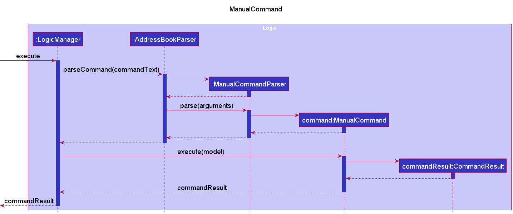
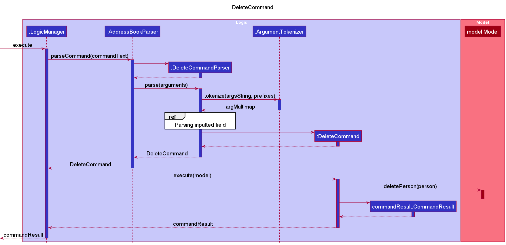
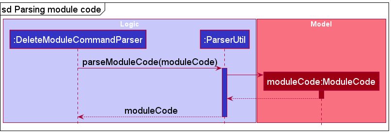
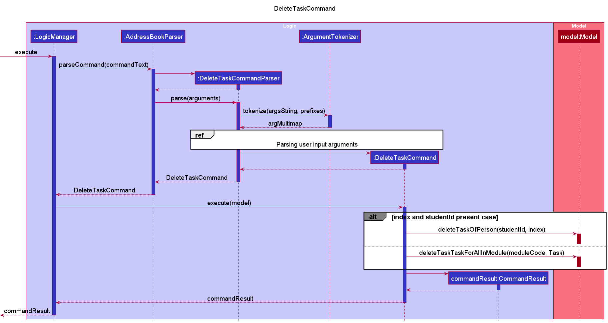
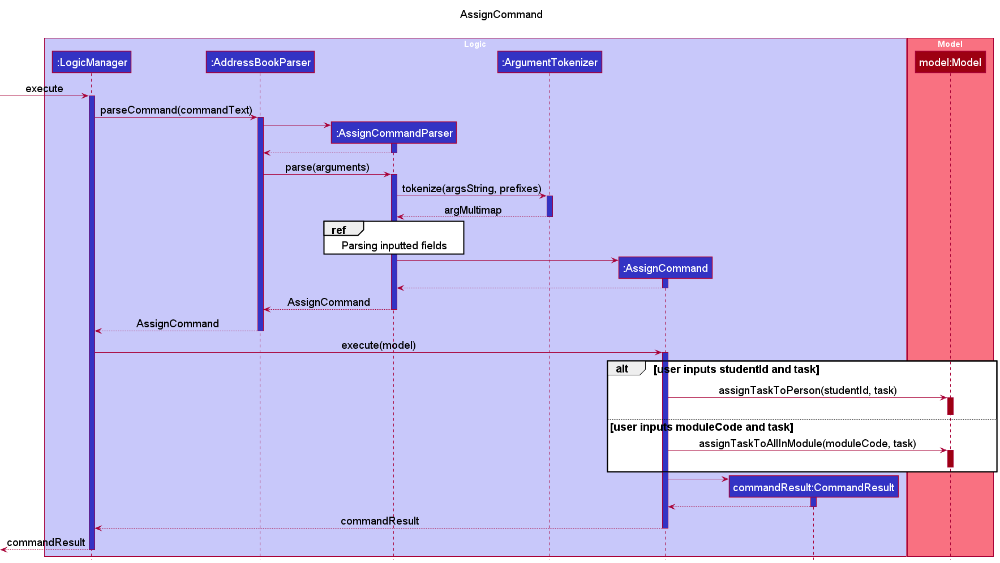
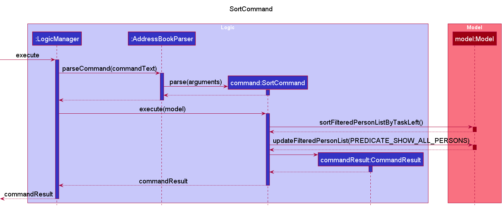

* Table of Contents
{:toc}

--------------------------------------------------------------------------------------------------------------------

## **Acknowledgements**

This project is based on the AddressBook-Level3 project created by the [SE-EDU initiative](https://se-education.org).

--------------------------------------------------------------------------------------------------------------------

## **Setting up, getting started**

Refer to TAPA's [Quick Start Guide](https://ay2122s2-cs2103t-w09-4.github.io/tp/UserGuide.html#quick-start).

--------------------------------------------------------------------------------------------------------------------

## **Design**

:bulb: **Tip:** The `.puml` files used to create diagrams in this document can be found in the [diagrams](https://github.com/se-edu/addressbook-level3/tree/master/docs/diagrams/) folder. Refer to the [_PlantUML Tutorial_ at se-edu/guides](https://se-education.org/guides/tutorials/plantUml.html) to learn how to create and edit diagrams.

### Architecture

The ***Architecture Diagram*** given above explains the high-level design of the App.

Given below is a quick overview of main components and how they interact with each other.

**Main components of the architecture**

**`Main`** has two classes called [`Main`](https://github.com/se-edu/addressbook-level3/tree/master/src/main/java/seedu/address/Main.java) and [`MainApp`](https://github.com/se-edu/addressbook-level3/tree/master/src/main/java/seedu/address/MainApp.java). It is responsible for,
* At app launch: Initializes the components in the correct sequence, and connects them up with each other.
* At shut down: Shuts down the components and invokes cleanup methods where necessary.

[**`Commons`**](#common-classes) represents a collection of classes used by multiple other components.

The rest of the App consists of four components.

* [**`UI`**](#ui-component): The UI of the App.
* [**`Logic`**](#logic-component): The command executor.
* [**`Model`**](#model-component): Holds the data of the App in memory.
* [**`Storage`**](#storage-component): Reads data from, and writes data to, the hard disk.

**How the architecture components interact with each other**

The *Sequence Diagram* below shows how the components interact with each other for the scenario where the user issues the command `delete 1`.

Each of the four main components (also shown in the diagram above),

* defines its *API* in an `interface` with the same name as the Component.
* implements its functionality using a concrete `{Component Name}Manager` class (which follows the corresponding API `interface` mentioned in the previous point.

For example, the `Logic` component defines its API in the `Logic.java` interface and implements its functionality using the `LogicManager.java` class which follows the `Logic` interface. Other components interact with a given component through its interface rather than the concrete class (reason: to prevent outside component's being coupled to the implementation of a component), as illustrated in the (partial) class diagram below.

The sections below give more details of each component.

### UI component

The **API** of this component is specified in [`Ui.java`](https://github.com/se-edu/addressbook-level3/tree/master/src/main/java/seedu/address/ui/Ui.java)

The UI consists of a `MainWindow` that is made up of parts e.g.`CommandBox`, `ResultDisplay`, `PersonListPanel`, `StatusBarFooter` etc. All these, including the `MainWindow`, inherit from the abstract `UiPart` class which captures the commonalities between classes that represent parts of the visible GUI.

The `UI` component uses the JavaFx UI framework. The layout of these UI parts are defined in matching `.fxml` files that are in the `src/main/resources/view` folder. For example, the layout of the [`MainWindow`](https://github.com/se-edu/addressbook-level3/tree/master/src/main/java/seedu/address/ui/MainWindow.java) is specified in [`MainWindow.fxml`](https://github.com/se-edu/addressbook-level3/tree/master/src/main/resources/view/MainWindow.fxml)

The `UI` component,

* executes user commands using the `Logic` component.
* listens for changes to `Model` data so that the UI can be updated with the modified data.
* keeps a reference to the `Logic` component, because the `UI` relies on the `Logic` to execute commands.
* depends on some classes in the `Model` component, as it displays `Person` object residing in the `Model`.

### Logic component

**API** : [`Logic.java`](https://github.com/se-edu/addressbook-level3/tree/master/src/main/java/seedu/address/logic/Logic.java)

Here's a (partial) class diagram of the `Logic` component:

How the `Logic` component works:
1. When `Logic` is called upon to execute a command, it uses the `AddressBookParser` class to parse the user command.
1. This results in a `Command` object (more precisely, an object of one of its subclasses e.g., `AddCommand`) which is executed by the `LogicManager`.
1. The command can communicate with the `Model` when it is executed (e.g. to add a `Person`).
1. The result of the command execution is encapsulated as a `CommandResult` object which is returned back from `Logic`.

The Sequence Diagrams below illustrate the interactions within the `Logic` component for the `execute("delete 1")` API call.

Here are the other classes in `Logic` (omitted from the class diagram above) that are used for parsing a user command:

How the parsing works:
* When called upon to parse a user command, the `AddressBookParser` class creates an `XYZCommandParser` (`XYZ` is a placeholder for the specific command name e.g., `AddCommandParser`) which uses the other classes shown above to parse the user command and create a `XYZCommand` object (e.g., `AddCommand`) which the `AddressBookParser` returns back as a `Command` object.
* All `XYZCommandParser` classes (e.g., `AddCommandParser`, `DeleteCommandParser`, ...) inherit from the `Parser` interface so that they can be treated similarly where possible e.g, during testing.

### Model component
**API** : [`Model.java`](https://github.com/se-edu/addressbook-level3/tree/master/src/main/java/seedu/address/model/Model.java)

The `Model` component,

* stores TAPA's data i.e., all `Person` objects (which are contained in a `UniquePersonList` object).
* stores the currently 'selected' `Person` objects (e.g., results of a search query) as a separate _filtered_ list which is exposed to outsiders as an unmodifiable `ObservableList<Person>` that can be 'observed' e.g. the UI can be bound to this list so that the UI automatically updates when the data in the list change.
* stores a `UserPref` object that represents the user’s preferences. This is exposed to the outside as a `ReadOnlyUserPref` objects.
* does not depend on any of the other three components (as the `Model` represents data entities of the domain, they should make sense on their own without depending on other components)

### Storage component

**API** : [`Storage.java`](https://github.com/se-edu/addressbook-level3/tree/master/src/main/java/seedu/address/storage/Storage.java)

The `Storage` component,
* can save both TAPA's data and user preference data in json format, and read them back into corresponding objects.
* inherits from both `AddressBookStorage` and `UserPrefStorage`, which means it can be treated as either one (if only the functionality of only one is needed).
* depends on some classes in the `Model` component (because the `Storage` component's job is to save/retrieve objects that belong to the `Model`)

### Common classes

Classes used by multiple components are in the `seedu.addressbook.commons` package.

--------------------------------------------------------------------------------------------------------------------

## **Implementation**

This section describes some noteworthy details on how certain features are implemented.

### Manual Command

#### Description

The `manual` command displays the format and a short description for a particular command. During the execution of the `manual` command, the user's input is being parsed in `ManualCommandParser`. After which, a new `ManualCommand` object will be created, and is subsequently executed by the `LogicManager`.

#### Implementation
1. Upon receiving the user input, the `LogicManager` starts to parse the given input text using `AddressBookParser#parseCommand()`.
2. The `AddressBookParser` invokes the respective `Parser` based on the first word of the input text.
3. Since the first word in the user input matches the word "manual", `ManualCommandParser#parse(arguments)` will be called. In this case, the arguments refer to the remaining input text after the exclusion of the command word "manual".
    
:information_source:
    <b>Note:</b> A `ParseException` will be thrown if the argument is invalid.
    

4. The supplied argument will be trimmed using `String#trim()`.
5. The `ManualCommandParser` will create a new `ManualCommand` (using the `argument` in Step 4), which will be returned to `LogicManager`.
6. The `LogicManager` will call `ManualCommand#execute(Model model)`. If the `argument` is invalid, a `CommandException` will be thrown.
7. Lastly, the `ManualCommand` will create a new `CommandResult` which will be returned to `LogicManager`.

The following sequence diagram shows how the manual command works:

### Add Command

#### Description

The `add` command allows users to add a particular student into TAPA.
Since not all fields are compulsory during the execution of the `add` command,
the user's input is being parsed in `AddressBookParser`. After which, a new `AddCommand`
object will be created, and is subsequently executed by the `LogicManager`.

#### Implementation

1. Upon receiving the user input,
   the `LogicManager` starts to parse the given input text using `AddressBookParser#parseCommand()`.
2. The `AddressBookParser` invokes the respective `Parser` based on the first word of the input text.
3. Since the first word in the user input matches the word "add", `AddCommandParser#parse(arguments)` will be called.
   In this case, the arguments refer to the remaining input text after the exclusion of the command word ("add").
4. In the `AddCommandParser#parse(arguments)`, the arguments will be tokenized into an `ArgumentMultimap`,
   by using `ArgumentTokenizer#tokenize(String argsString, Prefix... prefixes)`.

    
:information_source: 
    <b>Note:</b> A `ParseException` will be thrown if the prefix of the compulsory fields are missing.
    
 

5. The `AddCommandParser` will pass the studentId input (found in the `ArgumentMultimap`)
   into `ParserUtil#parseStudentId(String studentId)`.

   
:information_source: 
   <b>Note:</b> A `NullPointerException` will be thrown if the supplied string argument is `null`.
    
 

6. In `ParserUtil#parseStudentId(String studentId)`, the supplied argument will be trimmed using `String#trim()`.
7. `StudentId#isValidId(String studentId)` will then be invoked,
   which checks if the trimmed argument is valid (according to the Regex supplied).
   If the argument is valid, a new `StudentId` object will be created and returned to the `AddCommandParser`.
   If the argument is not valid, a `ParseException` will be thrown.
8. Step 5 to 7 will be repeated for the other compulsory fields (`name`, `moduleCode`)
   and optional fields (`phone`, `telegramHandle`, `email`), by using their respective parse methods in `ParserUtil`.

   
:information_source: 
   <b>Note:</b> If an optional field is not supplied (i.e. not found in the `ArgumentMultimap`), 
   the extra parsing process in steps 5 to 7 will be skipped.
   Instead, the respective object will be created and initialized to `null`.
    

9. The `AddCommandParser` will create a new `Person`.
10. A new `AddCommand` will be created (using the `Person` in Step 9) and returned to the `LogicManager`.
11. The `LogicManager` will then call `AddCommand#execute(Model model)`.
12. In the `AddCommand`, the `model#hasPerson(Person person)` will be invoked. If the `Person` already exist
    in TAPA, a `CommandException` will be thrown.

    
:information_source: 
    <b>Note:</b> In TAPA, two `Person` are considered as equal only if they have the same `studentId`.
    
 

13. The `AddCommand` will call `model.addPerson(Person person)`, which adds the `Person` into the `AddressBook`.
14. Lastly, the `AddCommand` will create a new `CommandResult`, which will be returned to `LogicManager`.

The following sequence diagram shows how the add operation works:

### Delete Command

#### Description

The `delete` command allows users to delete particular students from TAPA.
Since not all fields are compulsory during the execution of the `delete` command,
the user's input is being parsed in `AddressBookParser`. After which, a new `DeleteCommand`
object will be created, and is subsequently executed by the `LogicManager`.

#### Implementation

1. Upon receiving the user input,
   the `LogicManager` starts to parse the given input text using `AddressBookParser#parseCommand()`.
2. The `AddressBookParser` invokes the respective `Parser` based on the first word of the input text.
3. Since the first word in the user input matches the word "delete", `DeleteCommandParser#parse(arguments)` will be called.
   In this case, the arguments refer to the remaining input text after the exclusion of the command word ("delete").
4. In the `DeleteCommandParser#parse(arguments)`, the arguments will be tokenized into an `ArgumentMultimap`,
   by using `ArgumentTokenizer#tokenize(String argsString, Prefix... prefixes)`.

    
:information_source: 
    <b>Note:</b> A `ParseException` will be thrown if the prefix of the compulsory fields are missing.
    
 

5. The `DeleteCommandParser` will pass the studentId input (found in the `ArgumentMultimap`)
   into `ParserUtil#parseStudentId(String studentId)`.

   
:information_source: 
   <b>Note:</b> A `NullPointerException` will be thrown if the supplied string argument is `null`.
    
 

6. In `ParserUtil#parseStudentId(String studentId)`, the supplied argument will be trimmed using `String#trim()`.
7. `StudentId#isValidId(String studentId)` will then be invoked,
   which checks if the trimmed argument is valid (according to the Regex supplied).
   If the argument is valid, a new `StudentId` object will be created and returned to the `DeleteCommandParser`.
   If the argument is not valid, a `ParseException` will be thrown.

   
:information_source: 
   <b>Note:</b> The above description for Steps 5 to 7 is specifically for when `studentId` is used as the input field.
   Depending on the type of input field used (`StudentId` or `Index`), Steps 5 to 7 will
   be executed using the parse methods in `ParserUtil` that are specific to the field. In the case of indices, an `Index` array is created in place of the `StudentId`.
    

8. A new `DeleteCommand` will be created (using the `StudentId` or `Index` array returned in Step 8) and returned to the `LogicManager`.
9. The `LogicManager` will then call `DeleteCommand#execute(Model model)`.
10. In the `DeleteCommand`, a new `StudentIdContainsKeywordsPredicate` is created if `StudentId` was used as the input.
11. If `StudentId` was used, the `model#updateFilteredPersonList(Predicate<Person> predicate)` will then be invoked, which
    updates the filter of the `PersonList` to filter by the given `StudentIdContainsKeywordsPredicate`, after which the entry (if any) that matches the `StudentIdContainsKeywordsPredicate` will be deleted by invoking `model#deletePerson(Person person)`.
12. Otherwise, if an `Index` array was used, a list of `Person`s corresponding to their `Index` in the displayed list will be created, after which they will be processed one by one for deletion.
13. Lastly, the `DeleteCommand` will create a new `CommandResult`, which will be returned to `LogicManager`.

The following sequence diagram shows how the delete operation works:

### DeleteModule Command

#### Description

The `deleteModule` command allows users to delete all students of the inputted `ModuleCode` from TAPA.
During the execution of the `deleteModule` command, the user's input is being parsed in `AddressBookParser`.
After which, a new `DeleteModuleCommand` object will be created, and is subsequently executed by the `LogicManager`.

#### Implementation

1. Upon receiving the user input,
   the `LogicManager` starts to parse the given input text using `AddressBookParser#parseCommand()`.
2. The `AddressBookParser` invokes the respective `Parser` based on the first word of the input text.
3. Since the first word in the user input matches the word "deleteModule", `DeleteModuleCommandParser#parse(arguments)` will be called.
   In this case, the arguments refer to the remaining input text after the exclusion of the command word ("deleteModule").
4. In the `DeleteModuleCommandParser#parse(arguments)`, the arguments will be tokenized into an `ArgumentMultimap`,
   by using `ArgumentTokenizer#tokenize(String argsString, Prefix... prefixes)`.
   
    
:information_source: 
    <b>Note:</b> A `ParseException` will be thrown if the prefix of the compulsory field is missing.
    

5. The `DeleteModuleCommandParser` will pass the moduleCode input (found in the `ArgumentMultimap`)
   into `ParserUtil#parseModuleCode(String moduleCode)`.

   
:information_source: 
   <b>Note:</b> A `NullPointerException` will be thrown if the supplied string argument is `null`.
    
 

6. In `ParserUtil#parseModuleCode(String moduleCode)`, the supplied argument will be trimmed using `String#trim()`.
7. `ModuleCode#isValidModuleCode(String moduleCode)` will then be invoked,
   which checks if the trimmed argument is valid (according to the Regex supplied).
   If the argument is valid, a new `ModuleCode` object will be created and returned to the `DeleteModuleCommandParser`.
   If the argument is not valid, a `ParseException` will be thrown.

8. The `DeleteModuleCommandParser` will create a new `ModuleCodeContainsKeywordsPredicate`.
9. A new `DeleteModuleCommand` will be created (using the `ModuleCodeContainsKeywordsPredicate` returned in Step 8) and returned to the `LogicManager`.
10. The `LogicManager` will then call `DeleteModuleCommand#execute(Model model)`.
11. The `model#updateFilteredPersonList(Predicate<Person> predicate)` will then be invoked, which
    updates the filter of the `PersonList` to filter by the given `ModuleIdContainsKeywordsPredicate`.
12. Each `Person` that appears in the filtered list will then be deleted by invoking `model#deletePerson(Person person)`.
13. Lastly, the `DeleteModuleCommand` will create a new `CommandResult`, which will be returned to `LogicManager`.

The following sequence diagram shows how the deleteModule operation works:

### DeleteTask Command

#### Description

The `deleteTask` command allows users to delete to task that was previously assigned to students.
During the execution of the `deleteTask` command, the user's input is being parsed in `AddressBookParser`.
After which, a new `deleteTaskCommand` object will be created, and is subsequently executed by the LogicManager.

#### Implementation

1. Upon receiving the user input,
   the `LogicManager` starts to parse the given input text using `AddressBookParser#parseCommand()`.
2. The `AddressBookParser` invokes the respective `Parser` based on the first word of the input text.
3. Since the first word in the user input matches the word "deleteTask", `DeleteTaskCommandParser#parse(arguments)` will be called.
   In this case, the arguments refer to the remaining input text after the exclusion of the command word ("deleteTask").
4. In the `DeleteTaskCommandParser#parse(arguments)`, the arguments will be tokenized into an `ArgumentMultimap`,
   by using `ArgumentTokenizer#tokenize(String argsString, Prefix... prefixes)`.

   
:information_source: 
    <b>Note:</b> A `ParseException` will be thrown if the prefix of `StudentId`, `Index`, `ModuleCode`, and `TaskName` is missing.
    Either the pair (consisting of `StudentId` and `Index`) or the pair (consisting of `ModuleCode` and `TaskName`) must be provided.   
   

5. If either `Index` or `StudentId` is given, the `indexOrStudentIdGiven(ArgumentMultimap argMultimap)` method is invoked.

    
:information_source:
     <b>Note:</b> A `ParseException` will be thrown if the prefix of `StudentId`, or `Index` is missing.
     Both `StudentId` and `Index` must be provided.   
    

   
    1. The `indexOrStudentIdGiven` method will pass the `studentId` input (found in the `ArgumentMultimap`) into `ParserUtil#parseStudentId(String studentId)`.
   
    
:information_source: 
    <b>Note:</b> A `NullPointerException` will be thrown if the supplied string argument is `null`.
    

    2. In `ParserUtil#parseStudentId(String studentId)`, the supplied argument will be trimmed using `String#trim()`.
    3. `StudentId#isValidId(String studentId)` method will then be invoked,
    which checks if the trimmed argument is valid (according to the Regex supplied).
    If the argument is valid, a new `StudentId` object will be created and returned to the `DeleteTaskCommandParser`.
    If the argument is not valid, a `ParseException` will be thrown.
    4. The `indexOrStudentIdGiven` method will pass the index input (found in the `ArgumentMultimap`) into
       `ParserUtil#parseIndex(String oneBasedIndex)`.
       
    
:information_source: 
    <b>Note:</b> A `NullPointerException` will be thrown if the supplied string argument is `null`.
    

   
    5.  In `ParserUtil#parseIndex(String oneBasedIndex)`, the supplied argument will be trimmed using `String#trim()`.
    6. `Index#isValidId(String Index)` will then be invoked, which checks if the trimmed argument is valid (according to the Regex supplied). 
    If the argument is valid, a new `Index` object will be created and returned to the `DeleteTaskCommandParser`.
    If the argument is not valid, a `ParseException` will be thrown.
    7. A new `DeleteTaskCommand(StudentId studentId, Index index)` will be created (using the `StudentId` and `Index` object created in Step 3 and 6) and returned to the `LogicManager`.
   

6. If either `ModuleCode` or `TaskName` is given, the `moduleCodeOrTaskNameGiven(ArgumentMultimap argMultimap)` method is invoked.
   
    
:information_source: 
    <b>Note:</b> A `ParseException` will be thrown if the prefix of `ModuleCode`, or `TaskName` is missing.
    Both `ModuleCode` and `TaskName` must be provided.   
    

    1. The `moduleCodeOrTaskNameGiven` method will pass the moduleCode input (found in the `ArgumentMultimap`) into `ParserUtil#parseModuleCode(String moduleCode).`
   
    
:information_source: 
    <b>Note:</b> A `NullPointerException` will be thrown if the supplied string argument is `null`.
    

   
    2. In `ParserUtil#parseModuleCode(String moduleCode)`, the supplied argument will be trimmed using `String#trim()`.
    3. `ModuleCode#isValidModuleCode(String moduleCode)` will then be invoked,
    which checks if the trimmed argument is valid (according to the Regex supplied).
    If the argument is valid, a new `ModuleCode` object will be created and returned to the `DeleteTaskCommandParser`.
    If the argument is not valid, a `ParseException` will be thrown.
    4. The `moduleCodeOrTaskNameGiven` method will pass the taskName input (found in the `ArgumentMultimap`) into 
       `ParserUtil#parseTask(String task)`.

    
:information_source: 
    <b>Note:</b> A `NullPointerException` will be thrown if the supplied string argument is `null`.
    

    5. In `ParserUtil#parseTask(String task)`, the supplied argument will be trimmed using `String#trim()`.
    6. `Task#isValidTaskName(String test)` will then be invoked, which checks if the trimmed argument is valid (according to the Regex supplied).
      If the argument is valid, a new `Task` object will be created and returned to the `DeleteTaskCommandParser`.
      If the argument is not valid, a `ParseException` will be thrown.
    7. A new `DeleteTaskCommand(ModuleCode moduleCode, Task task)` will be created (using the `ModuleCode` and `Task` object created in Step 3 and 6) and returned to the `LogicManager`.

7. The `LogicManager` will then call `DeleteTaskCommand#execute(Model model)`.
8. If the both the `studentId` and `index` is present then `model#deleteTaskOfPerson(StudentId studentId, Index index)` method is invoked.
   1. `AddressBook#deleteTaskOfPerson(StudentId studentId, Index index)`is invoked, which invokes `UniquePersonList#deleteTaskOfPerson(StudentId studentId, Index index)` method.
   2. This method will iterate through each `Person` object in and check for matching `studentId`.
      If found, the method will get a copy of the `Person` object by invoking `Person#getCopy()`, deletes the task by invoking `Person#deleteTask(Index index)`. 
      If the index is out of bounds, `InvalidTaskIndexException()` will be thrown by the `taskList#deleteTask(Index index)` method. 
      If no student with matching studentId is found, `PersonNotFoundException()` will be thrown. 
   3. The updated `Person` will be replaced the current `Person` object.
   4. If the task is successfully deleted, the `model#updateFilteredPersonList(Predicate<Person> predicate)` will then be invoked by `model#deleteTaskOfPerson(StudentId studentId, Index index)` method, which
      updates the filter of the `PersonList` to filter by the given `PREDICATE_SHOW_ALL_PERSONS`.
   
9. If the both the `moduleCode` and `task` is present then `model#deleteTaskForAllInModule(ModuleCode moduleCode, Task task)` method is invoked.
   1. `AddressBook#deleteTaskForAllInModule(ModuleCode moduleCode, Task task)`is invoked, which invokes `UniquePersonList#deleteTaskForAllInModule(ModuleCode moduleCode, Task task)` method.
   2. This method will iterate through each `Person` object in and check for matching `moduleCode`.
      If found, the method will get a copy of the `Person` object by invoking `Person#getCopy()`, deletes the task by invoking `Person#deleteTask(Task task)`.
      If no task is found, `TaskNotFoundException()` will be thrown by the `taskList#deleteTask(Task task)` method.
      If no student with matching moduleCode is found, `ModuleCodeNotFoundException()` will be thrown.
   3. The updated `Person` will be replaced the current `Person` object.
   4. If the task is successfully deleted, the `model#updateFilteredPersonList(Predicate<Person> predicate)` will then be invoked by `model#deleteTaskForAllInModule(ModuleCode moduleCode, Task task)` method, which
      updates the filter of the `PersonList` to filter by the given `PREDICATE_SHOW_ALL_PERSONS`.
   
10. Lastly, the `DeleteTaskCommand` will create a new `CommandResult` which `CommandResult` will be returned to `LogicManager`.

### Assign Command

#### Description

The `assign` command allows users to assign tasks to student.
During the execution of the `assign` command, the user's input is being parsed in `AddressBookParser`.
After which, a new `AssignCommand` object will be created, and is subsequently executed by the LogicManager.

#### Implementation

1. Upon receiving the user input,
   the `LogicManager` starts to parse the given input text using `AdddressBookParser#parseCommand()`.
2. The `AddressBookParser` invokes the respective `Parser` based on the first word of the input text.
3. Since the first word in the user input matches the word "assign", `AssignCommandParser#parse(arguments)` will be called.
   In this case, the arguments refer to the remaining input text after the exclusion of the command word ("assign").
4. In the `AssignCommandParser#parse(arguments)`, the arguments will be tokenized into an `ArgumentMultimap`,
   by using `ArgumentTokenizer#tokenize(String argsString, Prefex... prefixes)`.

   
:information_source:
    <b>Note:</b> A `ParseException` will be thrown if the prefix of `Task` is missing, or if either the prefix of `StudentId` or `ModuleCode` is missing, as they are compulsory fields.
   
 

5. The `AssignCommandParser` will pass the studentId input (found in the `ArgumentMultimap`)
   into `ParserUtil#parseStudentId(String studentId)`.

   
:information_source:
   <b>Note:</b> A `NullPointerException` will be thrown if the supplied string argument is `null`.
   
 

6. In `ParserUtil#parseStudentId(String studentId)`, the supplied argument will be trimmed using `String#trim()`.
7. `StudentId#isValidId(String studentId)` will then be invoked,
   which checks if the trimmed argument is valid (according to the Regex supplied).
   If the argument is valid, a new StudentId object will be created and returned to the `AssignCommandParser`.
   If the argument is not valid, a `ParseException` will be thrown.

   
:information_source: 
   <b>Note:</b> The above description for Steps 5 to 7 is specifically for when `studentId` is used as the input field.
   In the case of `moduleCode`, the `Module` prefix will be used to tokenize the input.
   Depending on the type of input field used (`studentId` or `moduleCode`), Steps 5 to 7 will be executed using the parse 
   methods in `ParserUtil` that are specific to the field. The argument's validity would be checked in their respective classes as well.
    

8. The `AssignCommandParser` will pass the task input (found in the `ArgumentMultimap`)
   into `ParserUtil#parseTask(String task)`.

   
:information_source:
   <b>Note:</b> A `NullPointerException` will be thrown if the supplied string argument is `null`.
   

9. In `ParserUtil#parseTask(String task)`, the supplied argument will be trimmed using `String#trim()`.
10. `Task#isValidTaskName(String task)` will then be invoked,
    which checks if the trimmed argument is valid (according to the Regex supplied).
    If the argument is valid, a new Task object will be created and returned to the `AssignCommandParser`.
    If the argument is not valid, a `ParseException` will be thrown.
    
11. A new `AssignCommand` will be created (using the `StudentId` or `ModuleCode` object and `Task` object created) and returned to the `LogicManager`.
    
12. The `LogicManager` will then call `AssignCommand#execute(Model model)`.
    
13. If `StudentId` is used, `AssignCommand#assignTaskToPerson(StudentId studentId, Task task)` method will be invoked, 
    which will in turn invoke `model#assignTaskToPerson(StudentId studentId, Task task)` method and 
    `AddressBook#assignTaskToPerson(StudentId studentId, Task task)` method. If `ModuleCode` is used, 
    `AssignCommand#assignTaskToAllInModule(ModuleCode moduleCode, Task task)` method will be invoked, which will in 
    turn invoke `model#assignTaskToAllInModule(ModuleCode moduleCode, Task task)` method and 
    `AddressBook#assignTaskToAllInModule(ModuleCode moduleCode, Task task)` method.
    
14. If `StudentId` is used, `UniquePersonList#assignTaskToPerson(StudentId studentId, Task task)` method is called.
    If `ModuleCode` is used, `UniquePersonList#assignTaskToAllInModule(ModuleCode moduleCoded, Task task)` is called.
    This will iterate through each `Person` object and check for matching `studentId` or `moduleCode`. 

   
:information_source:
   <b>Note:</b> 
   If no student(s) with a matching `studentId` or `moduleCode` is found, then `PersonNotFoundException` or `ModuleCodeNotFoundException` will be thrown.
   

15. If a `Student` object with matching `studentId` or `moduleCode` is found the method uses `Person#isTaskAlreadyPresent(Task task)` 
    method to check if the `task` is assigned.
    If no similar `task` is found, the following step will take place.

   
:information_source:
   <b>Note:</b>
   If all the student(s) has already been assigned that task, then `DuplicateTaskException` will be thrown. 
   If some, not all students in the `moduleCode` has already been assigned that task, then `PartialDuplicateTaskException` will be thrown.
   

16. The method gets copy of the `Student` object by invoking `Person#getCopy()` method. The copy is updated to include `task` by invoking `Person#addTask(Task task)`.
17. `Person#addTask(Task task)` method will invoke `TaskList#addTask(Task task)`, which adds the task to a list of assigned tasks.
18. The `model#updateFilteredPersonList(PREDICATE_SHOW_ALL_PERSONS)` is then invoked such that the list is filtered by the predicate created. In this case all the students will be in the filtered list.
19. Lastly, the `AssignCommand` will create a new `CommandResult`, which will be returned to `LogicManager`.

### Task Command

#### Description

The `task` command allows users to check and view all the tasks belonging to a particular student.
During the execution of the `task` command, the user's input is being parsed in `AddressBookParser`.
After which, a new `TaskCommand` object will be created, and is subsequently executed by the LogicManager.

#### Implementation

1. Upon receiving the user input,
   the `LogicManager` starts to parse the given input text using `AdddressBookParser#parseCommand()`.
2. The `AddressBookParser` invokes the respective `Parser` based on the first word of the input text.
3. Since the first word in the user input matches the word "task", `TaskCommandParser#parse(arguments)` will be called.
   In this case, the arguments refer to the remaining input text after the exclusion of the command word ("task").
4. In the `TaskCommandParser#parse(arguments)`, the arguments will be tokenized into an `ArgumentMultimap`,
   by using `ArgumentTokenizer#tokenize(String argsString, Prefix... prefixes)`.

   
:information_source: 
   <b>Note:</b> A `ParseException` will be thrown if the prefix of `StudentId` is missing, as it is a compulsory field.
   

5. The `TaskCommandParser` will pass the studentId input (found in the `ArgumentMultimap`)
   into `ParserUtil#parseStudentId(String studentId)`.

   
:information_source: 
   <b>Note:</b> A `NullPointerException` will be thrown if the supplied string argument is `null`.
   

6. In `ParserUtil#parseStudentId(String studentId)`, the supplied argument will be trimmed using `String#trim()`.
7. `StudentId#isValidId(String studentId)` will then be invoked,
   which checks if the trimmed argument is valid (according to the Regex supplied).
   If the argument is valid, a new StudentId object will be created and returned to the `TaskCommandParser`.
   If the argument is not valid, a `ParseException` will be thrown.
8. A new `TaskCommand` will be created (using the `StudentId` object created in Step 7) and returned to the `LogicManager`.
9. The `LogicManager` will then call `TaskCommand#execute(Model model)`.
10. In the `TaskCommand`, a `StudentIdContainsKeywordsPredicate` is created using the studentId.
11. The `model#updateFilteredPersonList(predicate)` is then invoked such that the list is filtered by the predicate created.
12. The `model#getFilteredPersonList()` is then called.
    The size of the resulting list determines if there is any `Person` that corresponds to the specified `studentId`.
    If the size is equals to 0, a `CommandException` will be thrown.

    
:information_source: 
    <b>Note:</b> The `studentId` is a UNIQUE field in TAPA, so multiple students cannot have the same `studentId`.
    

13. The `Person` object in the filtered list is then extracted out using `model#getFilteredPersonList().get(0)`.
14. The `TaskList` belong to this `Person` can then be retrieved using `Person#getTaskList()`.
15. If this `TaskList` is null or empty, a `CommandException` will be thrown.
16. The `TaskCommand` iterates through this `TaskList`, and categorises the tasks into two new `TaskList`
    according to the task's completion status.
17. Lastly, the `TaskCommand` will create a new `CommandResult` by using the `TaskList` in Step 16.
    This `CommandResult` will then be returned to `LogicManager`.

### Find Command

#### Description

The `find` command allows users to find a particular student into TAPA.
Since not all fields are compulsory during the execution of the `find` command,
the user's input is being parsed in `AddressBookParser`. After which, a new `FindCommand`
object will be created, and is subsequently executed by the `LogicManager`.

#### Implementation

1. Upon receiving the user input,
   the `LogicManager` starts to parse the given input text using `AddressBookParser#parseCommand()`.
2. The `AddressBookParser` invokes the respective `Parser` based on the first word of the input text.
3. Since the first word in the user input matches the word "find", `FindCommandParser#parse(arguments)` will be called.
   In this case, the arguments refer to the remaining input text after the exclusion of the command word ("find").
4. In the `FindCommandParser#parse(arguments)`, the arguments will be tokenized into an `ArgumentMultimap`,
   by using `ArgumentTokenizer#tokenize(String argsString, Prefix... prefixes)`.

    
:information_source: 
    <b>Note:</b> A `ParseException` will be thrown if the prefix of the compulsory fields are missing.
    
 

5. The `FindCommandParser` will pass the studentId input (found in the `ArgumentMultimap`)
   into `ParserUtil#parseStudentId(String studentId)`.

   
:information_source: 
   <b>Note:</b> A `NullPointerException` will be thrown if the supplied string argument is `null`.
    
 

6. In `ParserUtil#parseStudentId(String studentId)`, the supplied argument will be trimmed using `String#trim()`.
7. `StudentId#isValidId(String studentId)` will then be invoked,
   which checks if the trimmed argument is valid (according to the Regex supplied).
   If the argument is valid, a new `StudentId` object will be created and returned to the `FindCommandParser`.
   If the argument is not valid, a `ParseException` will be thrown.

   
:information_source: 
   <b>Note:</b> The above description for Steps 5 to 7 is specifically for when `studentId` is used as the input field.
   Depending on the type of input field used (`studentId`, `name`, `moduleCode`), Steps 5 to 7 will 
   be executed using the parse methods in `ParserUtil` that are specific to the field.
    
 

8. The `FindCommandParser` will create a new `Predicate`.
9. A new `FindCommand` will be created (using the `Predicate` in Step 8) and returned to the `LogicManager`.
10. The `LogicManager` will then call `FindCommand#execute(Model model)`.
11. In the `FindCommand`, the `model#updateFilteredPersonList(Predicate<Person> predicate)` will be invoked, which
    updates the filter of the `PersonList` to filter by the given `Predicate`.
12. Lastly, the `FindCommand` will create a new `CommandResult`, which will be returned to `LogicManager`.

The following sequence diagram shows how the find operation works:

### Mark Command

#### Description

The `mark` command marks a specific undone task as done for a particular student. During the execution of the `mark` command, the user's input is being parsed in `AddressBookParser`. After which, a new `MarkCommand` object will be created, and is subsequently executed by the `LogicManager`.

#### Implementation
1. Upon receiving the user input, the `LogicManager` starts to parse the given input text using `AddressBookParser#parseCommand()`.
2. The `AddressBookParser` invokes the respective `Parser` based on the first word of the input text.
3. Since the first word in the user input matches the word "mark", `MarkCommandParser#parse(arguments)` will be called. In this case, the arguments refer to the remaining input text after the exclusion of the command word "mark".
4. In the `AddressBookParser#parseCommand(arguments)`, the arguments will be tokenized into an `ArgumentMultiMap`, by `using ArgumentTokenizer#tokenize(String argsString, Prefix... prefixes)`.
    
:information_source:
    <b>Note:</b> A `ParseException` will be thrown if the prefix of the compulsory fields are missing or if the arguments are invalid.
    

5. The `MarkCommandParser` will pass the studentId input (found in the `ArgumentMultiMap`) into `ParserUtil#parseStudentId(String studentId)`.
    
:information_source:
    <b>Note:</b> A `NullPointerException` will be thrown if the supplied string argument is `null`.
    

6. In `ParserUtil#parseStudentId(String studentId)`, the supplied argument will be trimmed using `String#trim()`.
7. `StudentId#isValidId(String studentId)` will then be invoked, which checks if the trimmed argument is valid (according to the Regex supplied). If the argument is valid, a new `StudentId` object will be created and returned to the `MarkCommandParser`. If the argument is not valid, a `ParseException` will be thrown.
8. The `MarkCommandParser` will pass the index input (found in the `ArgumentMultiMap`) into `ParserUtil#parseIndex(Index index)`.
    
:information_source:
    <b>Note:</b> A `NullPointerException` will be thrown if the supplied string argument is null.
    

9. In `ParserUtil#parseStudentId(Index index)`, the supplied argument will be trimmed using `String#trim()`.
10. `Index#isValidId(Index index)` will then be invoked, which checks if the trimmed argument is valid (according to the Regex supplied). If the argument is valid, a new `Index` object will be created and returned to the `MarkCommandParser`. If the argument is not valid, a `ParseException` will be thrown.
11. The `MarkCommandParser` will create a new `MarkCommand` object using the `StudentId` and `Index` created in Step 7 and 10 respectively.
12. The `LogicManager` will then call `MarkCommand#execute(Model model)`.
13. The `MarkCommand` will call `model#markTaskOfPerson(Student studentId, Index index)`, which marks the task (corresponding to the supplied index) of the given student as done.
    
:information_source:
    <b>Note:</b> A `CommandException` will be thrown if the supplied `index` or `studentId` is invalid, or if the task is already marked as completed.
    

    
14. Lastly, the `MarkCommand` will create a new `CommandResult`, which will be returned to `LogicManager`.

The following sequence diagrams shows how the mark command works:

### Unmark Command

#### Description

The `unmark` command marks a specific done task as undone for a particular student. During the execution of the `unmark` command, the user's input is being parsed in `AddressBookParser`. After which, a new `UnmarkCommand` object will be created, and is subsequently executed by the `LogicManager`.

#### Implementation
1. Upon receiving the user input, the `LogicManager` starts to parse the given input text using `AddressBookParser#parseCommand()`.
2. The `AddressBookParser` invokes the respective `Parser` based on the first word of the input text.
3. Since the first word in the user input matches the word "unmark", `UnmarkCommandParser#parse(arguments)` will be called. In this case, the arguments refer to the remaining input text after the exclusion of the command word "unmark".
4. In the `AddressBookParser#parseCommand(arguments)`, the arguments will be tokenized into an `ArgumentMultiMap`, by `using ArgumentTokenizer#tokenize(String argsString, Prefix... prefixes)`.
    
:information_source:
    <b>Note:</b> A `ParseException` will be thrown if the prefix of the compulsory fields are missing or if the arguments are invalid.
    

5. The `UnmarkCommandParser` will pass the studentId input (found in the `ArgumentMultiMap`) into `ParserUtil#parseStudentId(String studentId)`.
    
:information_source:
    <b>Note:</b> A `NullPointerException` will be thrown if the supplied string argument is `null`.
    

6. In `ParserUtil#parseStudentId(String studentId)`, the supplied argument will be trimmed using `String#trim()`.
7. `StudentId#isValidId(String studentId)` will then be invoked, which checks if the trimmed argument is valid (according to the Regex supplied). If the argument is valid, a new `StudentId` object will be created and returned to the `UnmarkCommandParser`. If the argument is not valid, a `ParseException` will be thrown.
8. The `UnmarkCommandParser` will pass the index input (found in the `ArgumentMultiMap`) into `ParserUtil#parseIndex(Index index)`.
    
:information_source:
    <b>Note:</b> A `NullPointerException` will be thrown if the supplied string argument is `null`.
    

9. In `ParserUtil#parseStudentId(Index index)`, the supplied argument will be trimmed using `String#trim()`.
10. `Index#isValidId(Index index)` will then be invoked, which checks if the trimmed argument is valid (according to the Regex supplied). If the argument is valid, a new `Index` object will be created and returned to the `UnmarkCommandParser`. If the argument is not valid, a `ParseException` will be thrown.
11. The `UnmarkCommandParser` will create a new `UnmarkCommand` object using the `StudentId` and `Index` created in Step 7 and 10 respectively.
12. The `LogicManager` will then call `UnmarkCommand#execute(Model model)`.
13. The `UnmarkCommand` will call `model#unmarkTaskOfPerson(Student studentId, Index index)`, which marks the task (corresponding to the supplied index) of the given student as undone.
    
:information_source:
    <b>Note:</b> A `CommandException` will be thrown if the supplied `index` or `studentId` is invalid, or if the task is already marked as not complete.
    

14. Lastly, the `UnmarkCommand` will create a new `CommandResult`, which will be returned to `LogicManager`.

The following sequence diagrams shows how the unmark command works:

### Clear Command

#### Description

The `clear` command deletes all students currently stored in TAPA. During the execution of the `clear` command, a new `ClearCommand` object will be created, and is executed by the `LogicManager`. The `MainWindow` changes the `commandBox` to only recognise a followup `confirm` command. If the user executes a `confirm` command, a new `ConfirmClearCommand` object is created and executed by the `LogicManager`. Subsequently, `ModelManager` clears the students currently stored in TAPA.

#### Implementation
1. Upon receiving the user input, the `LogicManager` starts to parse the given input text using `AddressBookParser#parseCommand()`.
2. A new `ClearCommand` is created by `AddressBookParser` and returned to the `LogicManager`.
3. The `LogicManager` will then call `ClearCommand#execute(Model model)`, which returns a new `CommandResult` object (with its `isClearRequest` field set to `true`) to the `LogicManager`.
4. The `CommandResult` (with its `isClearRequest` field set to `true`) is then returned to the `MainWindow`.
5. To confirm the user's decision to clear TAPA, the `MainWindow` executes `MainWindow#handleClearRequest()` which updates the `CommandBox` to only recognise a `confirm` input for the next command.
    
:information_source:
    <b>Note:</b> A `CommandException` will be thrown if the user inputs anything other than confirm for the next input. The CommandBox then returns to accepting all commands as described in the user guide.
    

6. If the user inputs `confirm`, `LogicManager` parses the given input text using `AddressBookParser#parseCommand()` and a new `ConfirmClearCommand` is created and returned to the `LogicManager`.
7. The `LogicManager` will then call `ConfirmClearCommand#execute(Model model)`.
8. In the `ConfirmClearCommand`, `model.setAddressBook(new AddressBook())` is invoked, resetting the current list of students stored in TAPA to an empty list.
9. Lastly, the `ConfirmClearCommand` will create a new `CommandResult`, which will be returned to the `LogicManager`.

### Archive Command

#### Description

The `archive` command allows users to save the current state of the data in TAPA,
into a separate `.json` file. This newly created file can be found in the same
folder as the original data file (in `/data`). In addition, it will have a file name
that corresponds to the date and time (up to 6 significant figures) in which the
command is being called. This ensures that files created will have a unique file name
in most cases.

#### Implementation

1. Upon receiving the user input,
   the `LogicManager` starts to parse the given input text using `AddressBookParser#parseCommand()`.
2. The `AddressBookParser` invokes the respective `Parser` based on the first word of the input text.
3. Since the first word in the user input matches the word "archive", `ArchiveCommand()` will be called.
4. As `ArchiveCommand` utilizes the default constructor, it simply returns a new `ArchiveCommand` object to
   the `AddressBookParser`.
5. This `ArchiveCommand` object will then be subsequently returned to the `LogicManager`.
6. The `LogicManager` calls `ArchiveCommand#execute(Model model)`.
7. In `ArchiveCommand`, the `Path` to the existing `AddressBook` is extracted, 
   by calling `model#getAddressBookFilePath()`.
8. Similarly, the existing `AddressBook` is also extracted, by calling `model#getAddressBook()`.
9. With the help of the `DateTimeFormatter` and `LocalDateTime` in the Java 8 Date Time API, 
   the file name and path of the new `.json` data file can be obtained.
10. The new `.json` data file can now be created, using `FileUtil.createIfMissing(newPath)`.
    A `CommandException` will be thrown if `ArchiveCommand` fails to create this file.
11. The current copy of the `AddressBook` can be "copied" into a new `JsonSerializableAddressBook`,
    which will be used to populate the new `.json` data file that was created 
    (by utilizing `JsonUtil#saveJsonFile(T JsonFile, Path path)`).
    A `CommandException` will be thrown if `ArchiveCommand` fails to populate the data file.
12. Lastly, the `ArchiveCommand` will create a new `CommandResult`, which will then be returned to `LogicManager`.

### Progress Command

#### Description

The `progress` command allows users to view the completion status of all students who are taking a particular
module and are assigned to a particular task.
During the execution of the `progress` command, the user's input is being parsed in `AddressBookParser`.
After which, a new `ProgressCommand` object will be created, and is subsequently executed by the `LogicManager`.

#### Implementation

1. Upon receiving the user input,
   the `LogicManager` starts to parse the given input text using `AddressBookParser#parseCommand()`.
2. The `AddressBookParser` invokes the respective `Parser` based on the first word of the input text.
3. Since the first word in the user input matches the word "progress", 
   `ProgressCommandParser#parse(arguments)` will be called.
   In this case, the arguments refer to the remaining input text after the exclusion of the command word ("progress").
4. In the `ProgressCommandParser#parse(arguments)`, the arguments will be tokenized into an `ArgumentMultimap`,
   by using `ArgumentTokenizer#tokenize(String argsString, Prefix... prefixes)`.

   
:information_source: 
      <b>Note:</b> A `ParseException` will be thrown if the prefix of the compulsory fields are missing.
   

5. The `ProgressCommandParser` will pass the moduleCode input (found in the `ArgumentMultimap`)
   into `ParserUtil#parseModuleCode(String moduleCode)`.

   
:information_source: 
     <b>Note:</b> A `NullPointerException` will be thrown if the supplied string argument is `null`.
   

6. In `ParserUtil#parseModuleCode(String moduleCode)`, the supplied argument will be trimmed using `String#trim()`.
7. `ModuleCode#isValidModuleCode(String moduleCode)` will then be invoked, which checks if the trimmed argument is
   valid (according to the Regex supplied).
   If the argument is valid, a new `ModuleCode` object will be created and returned to the `ProgressCommandParser`.
   If the argument is invalid, a `ParseException` will be thrown.
8. Steps 5 to 7 will be repeated for the "task name" field, by using its respective parse methods in `ParserUtil`.
9. A new `ProgressCommand` will be created (using the parsed `ModuleCode` and `Task` objects) 
   and returned to the `LogicManager`.
10. The `LogicManager` will then call `ProgressCommand#execute(Model model)`.
11. In the `ProgressCommand`, the `model#checkProgress(ModuleCode moduleCode, Task task)` will be invoked.
    This method iterates through each `Person` object. If the `Person` has the same `ModuleCode` and `Task`
    assigned to him/her, the `Person` object and the completion status 
    (either completed/incomplete, denoted by a boolean value) will be added to a `LinkedHashMap<Person, boolean>`.
12. If the resulting `LinkedHashMap` is null or empty, a `CommandException` will be thrown.
13. This `LinkedHashMap` will be used to generate the output string.
14. The output string will be used in creating a new `CommandResult` object.
15. Lastly, the `CommandResult` object will be returned to `LogicManager`.

### Sort Command

#### Description

The `sort` command allows the users to view the list of students in TAPA, sorted by the number of incomplete tasks in **descending** order.
During the execution of the `sort` command, the user's input is being parsed in `AddressBookParser`.
After which, a new `SortCommand` object will be created, and is subsequently executed by the `LogicManager`.

#### Implementation

1. Upon receiving the user input,
   the `LogicManager` starts to parse the given input text using `AddressBookParser#parseCommand()`.
2. The `AddressBookParser` invokes the respective `Parser` based on the first word of the input text.
3. Since the first word in the user input matches the word "sort", `SortCommand()` will be called.
4. As `SortCommand` utilizes the default constructor, it simply returns a new `SortCommand` object to
   the `AddressBookParser`.
5. This `SortCommand` object will then be subsequently returned to the `LogicManager`.
6. The `LogicManager` calls `SortCommand#execute(Model model)`.
7. In `SortCommand`, the current list of students in TAPA will be sorted by the number of incomplete tasks in **descending** order by calling `model#sortFilteredPersonListByTaskLeft()`.
8. In `SortCommand`, the current list of students in TAPA will be updated to reflect the changes to the list, after the sort by calling `model#updateFilteredPersonList(PREDICATE_SHOW_ALL_PERSONS)`.
9. Lastly, the `SortCommand` will create a new `CommandResult`, which will then be returned to `LogicManager`.

### \[Proposed\] Undo/redo feature

#### Proposed Implementation

The proposed undo/redo mechanism is facilitated by `VersionedAddressBook`. It extends `AddressBook` with an undo/redo history, stored internally as an `addressBookStateList` and `currentStatePointer`. Additionally, it implements the following operations:

* `VersionedAddressBook#commit()` — Saves the current address book state in its history.
* `VersionedAddressBook#undo()` — Restores the previous address book state from its history.
* `VersionedAddressBook#redo()` — Restores a previously undone address book state from its history.

These operations are exposed in the `Model` interface as `Model#commitAddressBook()`, `Model#undoAddressBook()` and `Model#redoAddressBook()` respectively.

Given below is an example usage scenario and how the undo/redo mechanism behaves at each step.

Step 1. The user launches the application for the first time. The `VersionedAddressBook` will be initialized with the initial address book state, and the `currentStatePointer` pointing to that single address book state.

Step 2. The user executes `delete 5` command to delete the 5th person in the address book. The `delete` command calls `Model#commitAddressBook()`, causing the modified state of the address book after the `delete 5` command executes to be saved in the `addressBookStateList`, and the `currentStatePointer` is shifted to the newly inserted address book state.

Step 3. The user executes `add n/David …​` to add a new person. The `add` command also calls `Model#commitAddressBook()`, causing another modified address book state to be saved into the `addressBookStateList`.

:information_source: <b>Note:</b> If a command fails its execution, it will not call Model#commitAddressBook(), so the address book state will not be saved into the addressBookStateList.

Step 4. The user now decides that adding the person was a mistake, and decides to undo that action by executing the `undo` command. The `undo` command will call `Model#undoAddressBook()`, which will shift the `currentStatePointer` once to the left, pointing it to the previous address book state, and restores the address book to that state.

:information_source: <b>Note:</b> If the currentStatePointer is at index 0, pointing to the initial AddressBook state, then there are no previous AddressBook states to restore. The undo command uses Model#canUndoAddressBook() to check if this is the case. If so, it will return an error to the user rather
than attempting to perform the undo.

The following sequence diagram shows how the undo operation works:

:information_source: <b>Note:</b> The lifeline for UndoCommand should end at the destroy marker (X) but due to a limitation of PlantUML, the lifeline reaches the end of diagram.

The `redo` command does the opposite — it calls `Model#redoAddressBook()`, which shifts the `currentStatePointer` once to the right, pointing to the previously undone state, and restores the address book to that state.

:information_source: <b>Note:</b> If the currentStatePointer is at index addressBookStateList.size() - 1, pointing to the latest address book state, then there are no undone AddressBook states to restore. The redo command uses Model#canRedoAddressBook() to check if this is the case. If so, it will return an error to the user rather than attempting to perform the redo.

Step 5. The user then decides to execute the command `list`. Commands that do not modify the address book, such as `list`, will usually not call `Model#commitAddressBook()`, `Model#undoAddressBook()` or `Model#redoAddressBook()`. Thus, the `addressBookStateList` remains unchanged.

Step 6. The user executes `clear`, which calls `Model#commitAddressBook()`. Since the `currentStatePointer` is not pointing at the end of the `addressBookStateList`, all address book states after the `currentStatePointer` will be purged. Reason: It no longer makes sense to redo the `add n/David …​` command. This is the behavior that most modern desktop applications follow.

The following activity diagram summarizes what happens when a user executes a new command:

#### Design considerations:

**Aspect: How undo & redo executes:**

* **Alternative 1 (current choice):** Saves the entire address book.
  * Pros: Easy to implement.
  * Cons: May have performance issues in terms of memory usage.

* **Alternative 2:** Individual command knows how to undo/redo by
  itself.
  * Pros: Will use less memory (e.g. for `delete`, just save the person being deleted).
  * Cons: We must ensure that the implementation of each individual command are correct.

_{more aspects and alternatives to be added}_

--------------------------------------------------------------------------------------------------------------------

## **Documentation, logging, testing, configuration, dev-ops**

* [Documentation guide](Documentation.md)
* [Testing guide](Testing.md)
* [Logging guide](Logging.md)
* [Configuration guide](Configuration.md)
* [DevOps guide](DevOps.md)

--------------------------------------------------------------------------------------------------------------------

## **Appendix: Requirements**

### Product scope

**Target user profile**: Teaching Assistants who

* has a need to manage a significant number of students (especially across multiple modules)
* prefers desktop apps over other types
* can type fast
* prefers typing to mouse interactions
* is reasonably comfortable using CLI apps

**Value proposition**:  better manage the student’s contact and progress,
especially for those who are teaching multiple classes/modules at the same time.
It is optimised for use on CLI.

### User stories

Priorities: High (must have) - `* * *`, Medium (nice to have) - `* *`, Low (unlikely to have) - `*`

| Priority | As a …​                                                | I want to …​                                                                        | So that I can…​                                                                                        |
| -------- | --------------------------------------------------------- | -------------------------------------------------------------------------------------- | ----------------------------------------------------------------------------------------------------------|
| `* * *`  | Teaching Assistant                                        | add students to TAPA                                                                   | know which students are taking my classes                                                                 |
| `* * *`  | Teaching Assistant                                        | delete a specific student from TAPA                                                    | remove student who has withdrawn from the module during the semester                                      |
| `* * *`  | Teaching Assistant                                        | list students alphabetically                                                           | print students in a list as their names would appear on the official class list                           |
| `* * *`  | Teaching Assistant                                        | tag students                                                                           | know what modules they are taking                                                                         |
| `* * *`  | Teaching Assistant                                        | filter students by their tags                                                          | view the progress of students in each separate tag (different class/module)                               |
| `* * *`  | Teaching Assistant                                        | define my own tasks for each module                                                    | customise the tasks to each module                                                                        |
| `* * *`  | Teaching Assistant                                        | undo the most recent command entered                                                   | revert any unwanted changes (such as deleting student) without much trouble                               |
| `* * *`  | Teaching Assistant                                        | delete a task given to a student                                                       | remove tasks that has incorrect information or has been assigned wrongly                                  |
| `* * *`  | Teaching Assistant                                        | list the students who have/have not completed a specific task                          | track the completion status of a specific task                                                            |
| `* * *`  | Teaching Assistant                                        | assign tasks to a specific student                                                     | allocate and track a task that is given to the student                                                    |
| `* * *`  | Teaching Assistant who is teaching in multiple semesters  | archive the existing data                                                              | save a copy on the local machine before undergoing a complete deletion of data                            |
| `* *`    | Teaching Assistant                                        | see all the tasks that a student currently has                                         | observe his/her progress                                                                                  |
| `* *`    | Teaching Assistant                                        | save existing data to hard drive                                                       | access the data again when I reopen the app                                                               |
| `* *`    | Teaching Assistant                                        | delete all students from TAPA                                                          | remove students that were taught in previous semesters and are no longer relevant                         |
| `* *`    | Teaching Assistant                                        | mark/unmark students’ tasks according to the completion status                         | update his/her progress                                                                                   |
| `* *`    | Teaching Assistant                                        | see students’ contact details (such as email address)                                  | contact them if needed                                                                                    |
| `* *`    | Teaching Assistant                                        | find a student                                                                         | check details of a specific student                                                                       |
| `* *`    | Teaching Assistant                                        | display the possible actions that  I can take, or do                                   | have a quick reference without the need of reading a user guide                                           |
| `* *`    | Teaching Assistant                                        | edit the details of the students                                                       | fix any errors that occurred during the insertion of student details                                      |
| `* *`    | Teaching Assistant                                        | delete multiple students from TAPA                                                     | remove students that are no longer being taught, without needing to delete them individually              |
| `* *`    | Teaching Assistant                                        | display student progress                                                               | see who is lagging behind                                                                                 |
| `* *`    | Teaching Assistant                                        | update the student’s tags                                                              | edit when the student drop/take a new module                                                              |
| `* *`    | Teaching Assistant                                        | sort students by their progress (based on the number of tasks completed)               | see how the class is performing                                                                           |
| `* *`    | Teaching Assistant                                        | edit details of a task given to a student                                              | update the details of an assignment in case of future changes/extensions                                  |
| `* *`    | Teaching Assistant                                        | assign tasks to multiple students                                                      | allocate tasks to students without having to individually assign them                                     |
| `* *`    | Teaching Assistant                                        | delete tasks assigned to multiple students                                             | remove any task that has incorrect information without having to individually delete it from each student |
| `*`      | Teaching Assistant                                        | track attendance                                                                       | mark attendance for modules that require student attendance                                               |
| `*`      | Teaching Assistant                                        | see modules I’m teaching at a glance                                                   | remind myself of what needs to be prepared for classes                                                    |
| `*`      | Teaching Assistant                                        | see student’s timetable                                                                | find a good time to arrange a consult with them                                                           |
| `*`      | Teaching Assistant who is a long time user                | type in chain commands                                                                 | execute multiple different commands quickly                                                               |
| `*`      | Teaching Assistant who is a long time user                | send emails from the command line                                                      | send emails to students with specific tags quickly                                                        |
| `*`      | Teaching Assistant who is used to CLI commands            | customise commands                                                                     | execute commands quickly                                                                                  |
| `*`      | Teaching Assistant                                        | view grades scored by students in each assignment                                      | understand which topics they are finding difficult                                                        |
| `*`      | Teaching Assistant                                        | be able to highlight or feature certain students                                       | know which students are performing the best or need more help                                             |

*{More to be added}*

### Use cases

(For all use cases below, the **System** is the `TAPA` and the **Actor** is the `user`, unless specified otherwise)

**Use case: UC01 - Add a student**

**MSS**

1. User requests to add a specific student.
2. TAPA shows the updated list of students.

    Use case ends.

**Extensions**

* 1a. A student with the same Student ID already exists.

    * 1a1. TAPA shows an error message.

        Use case ends.

* 1b. The Student ID of the student is not in the input command.

    * 1b1. TAPA shows an error message.

        Use case ends.

* 1c. The name of the student is not in the input command.

    * 1c1. TAPA shows an error message.

        Use case ends.

* 1d. The module code that the student is currently taking is not in the input command.

    * 1d1. TAPA shows an error message.

        Use case ends.

**Use case: UC02 - List all students**

**MSS**

1. User requests to list students.
2. TAPA shows a list of students in alphabetical order sorted by their name.

   Use case ends.

**Extensions**

* 2a. The list is empty.

  Use case ends.

**Use case: UC03 - Delete a student**

**MSS**

1. User requests to list students.
2. TAPA shows a list of students.
3. User requests to delete a specific student in the list.
4. TAPA deletes the students.

   Use case ends.

**Extensions**

* 2a. The list is empty.

    Use case ends.

* 3a. The given index is invalid.

    * 3a1. TAPA shows an error message.

      Use case resumes from step 2.

* 3b. The given student id is invalid.

    * 3b1. TAPA shows an error message.

      Use case resumes from step 2.

**Use case: UC04 - Edit a student**

**MSS**

1. User requests to list students.
2. TAPA shows a list of students.
3. User requests edits to the supplied details of a specific student in the list.
4. TAPA updates the details of the student with the supplied details.

   Use case ends.

**Extensions**

* 2a. The list is empty.

  Use case ends.

* 3a. The given index is invalid.

    * 3a1. TAPA shows an error message.

      Use case resumes from step 2.

* 3b. The given field is invalid.

    * 3b1. TAPA shows an error message.

      Use case resumes from step 2.

* 3c. The new Student ID specified is already in the database.

    * 3c1. TAPA shows an error message.

      Use case resumes from step 2.

**Use case: UC05 - Assign a task to a student**

**MSS**
1. User requests TAPA to assign a task to a student. (This can be done for an individual student or for all students taking the same module)
2. TAPA shows the updated list of students.

    Use case ends.

**Extensions**

* 1a. If studentId is given and a student with the given studentId does not exist.

    * 1a1. TAPA shows an error message.

      Use case ends.

* 1b. If module code is given and no student is taking a module with the given module code.

    * 1b1. TAPA shows an error message.

      Use case ends.

* 1c. The student has already been assigned with a task that has the same name.

    * 1c1. TAPA shows an error message.

      Use case ends.

**Use case: UC06 - Delete a task assigned to a student**

**MSS**

1. User requests to list students.
2. TAPA shows a list of students.
3. User requests to delete a task that was assigned to a student. (This can be done for an individual student or for all the students taking the same module.)
4. TAPA updates the details of the student with the supplied details.

   Use case ends.

**Extensions**

* 2a. The list is empty.

  Use case ends.

* 3a. If studentId is given and a student with the given studentId does not exist.

    * 3a1. TAPA shows an error message.

      Use case ends.

* 3b. If the value of the specified index is less than 1 or greater than the number of tasks assigned to that student.

   * 3b1. TAPA shows an error message.

     Use case ends.

* 3c. If module code is given and no student is taking a module with the given module code.

    * 3c1. TAPA shows an error message.

      Use case ends.

* 3d. The task name already is assigned to the present.

    * 3d1. TAPA shows an error message.

      Use case ends.

*{More to be added}*

### Non-Functional Requirements

1.  Should work on any _mainstream OS_ as long as it has Java `11` or above installed.
2.  Should be able to hold up to 1000 students without a noticeable sluggishness in performance for typical usage.
3.  Usage should be more efficient than a regular contact management application for a user who types fast in English text.
4.  Should be usable by a novice who has never used a contact management application before.
5.  The system should respond within 3 seconds.
6.  The student's data should only be stored locally.

*{More to be added}*

### Glossary

* **Mainstream OS**: Windows, Linux, Unix, OS-X
* **Module**: A specific class that a student is taking
* **Tag**: A category that the student belong to (usually denotes the module that is currently being taken)
* **Person**: A student in TAPA. 
--------------------------------------------------------------------------------------------------------------------

## **Appendix: Instructions for manual testing**

Given below are instructions to test the app manually.

:information_source:<b>Note:</b> These instructions only provide a starting point for testers to work on;
testers are expected to do more *exploratory* testing.

### Launch and shutdown

1. Initial launch

   1. Download the jar file and copy into an empty folder.

   1. Double-click the jar file Expected: Shows the GUI with a set of sample contacts. The window size may not be optimum.

1. Saving window preferences

   1. Resize the window to an optimum size. Move the window to a different location. Close the window.

   1. Re-launch the app by double-clicking the jar file. 
       Expected: The most recent window size and location is retained.

1. _{ more test cases …​ }_

### Deleting a person

1. Deleting a person while all persons are being shown

   1. Prerequisites: List all persons using the `list` command. Multiple persons in the list.

   1. Test case: `delete 1` 
      Expected: First contact is deleted from the list. Details of the deleted contact shown in the status message. Timestamp in the status bar is updated.

   1. Test case: `delete 0` 
      Expected: No person is deleted. Error details shown in the status message. Status bar remains the same.

   1. Other incorrect delete commands to try: `delete`, `delete x`, `...` (where x is larger than the list size) 
      Expected: Similar to previous.

1. _{ more test cases …​ }_

### Saving data

1. Dealing with missing/corrupted data files

   1. _{explain how to simulate a missing/corrupted file, and the expected behavior}_

1. _{ more test cases …​ }_
