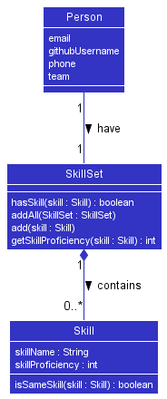
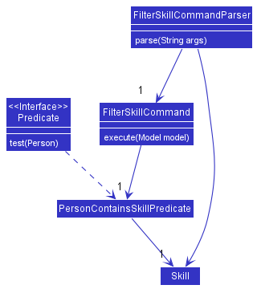
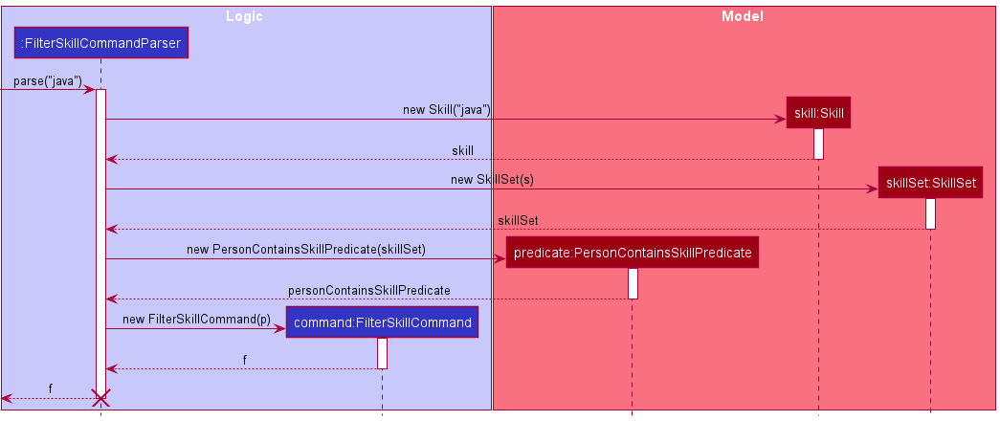

* Table of Contents
{:toc}

--------------------------------------------------------------------------------------------------------------------

## **Acknowledgements**

This project would not have been possible without the help of [Ivan](https://github.com/wpinrui), and [prof Damith](https://github.com/damithc)

--------------------------------------------------------------------------------------------------------------------

## **Setting up, getting started**

Refer to the guide [_Setting up and getting started_](SettingUp.md).

--------------------------------------------------------------------------------------------------------------------

## **Design**

:bulb: **Tip:** The `.puml` files used to create diagrams in this document can be found in the [diagrams](https://github.com/AY2122S2-CS2103T-W13-3/tp/tree/master/docs/diagrams) folder. Refer to the [_PlantUML Tutorial_ at se-edu/guides](https://se-education.org/guides/tutorials/plantUml.html) to learn how to create and edit diagrams.

### Architecture

The ***Architecture Diagram*** given above explains the high-level design of the App.

Given below is a quick overview of main components and how they interact with each other.

**Main components of the architecture**

**`Main`** has two classes called [`Main`](https://github.com/AY2122S2-CS2103T-W13-3/tp/blob/master/src/main/java/seedu/address/Main.java) and [`MainApp`](https://github.com/AY2122S2-CS2103T-W13-3/tp/blob/master/src/main/java/seedu/address/MainApp.java). It is responsible for,
* At app launch: Initializes the components in the correct sequence, and connects them up with each other.
* At shut down: Shuts down the components and invokes cleanup methods where necessary.

[**`Commons`**](#common-classes) represents a collection of classes used by multiple other components.

The rest of the App consists of four components.

* [**`UI`**](#ui-component): The UI of the App.
* [**`Logic`**](#logic-component): The command executor.
* [**`Model`**](#model-component): Holds the data of the App in memory.
* [**`Storage`**](#storage-component): Reads data from, and writes data to, the hard disk.

**How the architecture components interact with each other**

The *Sequence Diagram* below shows how the components interact with each other for the scenario where the user issues the command `delete 1`.

Each of the four main components (also shown in the diagram above),

* defines its *API* in an `interface` with the same name as the Component.
* implements its functionality using a concrete `{Component Name}Manager` class (which follows the corresponding API `interface` mentioned in the previous point.

For example, the `Logic` component defines its API in the `Logic.java` interface and implements its functionality using the `LogicManager.java` class which follows the `Logic` interface. Other components interact with a given component through its interface rather than the concrete class (reason: to prevent outside component's being coupled to the implementation of a component), as illustrated in the (partial) class diagram below.

The sections below give more details of each component.

### UI component

The **API** of this component is specified in [`Ui.java`](https://github.com/AY2122S2-CS2103T-W13-3/tp/blob/master/src/main/java/seedu/address/ui/Ui.java)

The UI consists of a `MainWindow` that is made up of parts e.g.`CommandBox`, `ResultDisplay`, `PersonListPanel`, `StatusBarFooter` etc. All these, including the `MainWindow`, inherit from the abstract `UiPart` class which captures the commonalities between classes that represent parts of the visible GUI.

The `UI` component uses the JavaFx UI framework. The layout of these UI parts are defined in matching `.fxml` files that are in the `src/main/resources/view` folder. For example, the layout of the [`MainWindow`](https://github.com/AY2122S2-CS2103T-W13-3/tp/blob/master/src/main/java/seedu/address/ui/MainWindow.java) is specified in [`MainWindow.fxml`](https://github.com/AY2122S2-CS2103T-W13-3/tp/blob/master/src/main/resources/view/MainWindow.fxml)

The `UI` component,

* executes user commands using the `Logic` component.
* listens for changes to `Model` data so that the UI can be updated with the modified data.
* keeps a reference to the `Logic` component, because the `UI` relies on the `Logic` to execute commands.
* depends on some classes in the `Model` component, as it displays `Person` object residing in the `Model`.

### Logic component

**API** : [`Logic.java`](https://github.com/AY2122S2-CS2103T-W13-3/tp/blob/master/src/main/java/seedu/address/logic/Logic.java)

Here's a (partial) class diagram of the `Logic` component:

How the `Logic` component works:
1. When `Logic` is called upon to execute a command, it uses the `AddressBookParser` class to parse the user command.
1. This results in a `Command` object (more precisely, an object of one of its subclasses e.g., `AddCommand`) which is executed by the `LogicManager`.
1. The command can communicate with the `Model` when it is executed (e.g. to add a person).
1. The result of the command execution is encapsulated as a `CommandResult` object which is returned back from `Logic`.

The Sequence Diagram below illustrates the interactions within the `Logic` component for the `execute("delete 1")` API call.

The Sequence Diagram below illustrates the interactions within the `Logic` component for the `execute("add n/junha p/12341234 g/B1LL e/bill@exmple.com")` API call. The input string is abbreviated to [ADD].

:information_source: **Note:** The lifeline for `DeleteCommandParser` should end at the destroy marker (X) but due to a limitation of PlantUML, the lifeline reaches the end of diagram.

Here are the other classes in `Logic` (omitted from the class diagram above) that are used for parsing a user command:

How the parsing works:
* When called upon to parse a user command, the `AddressBookParser` class creates an `XYZCommandParser` (`XYZ` is a placeholder for the specific command name e.g., `AddCommandParser`) which uses the other classes shown above to parse the user command and create a `XYZCommand` object (e.g., `AddCommand`) which the `AddressBookParser` returns back as a `Command` object.
* All `XYZCommandParser` classes (e.g., `AddCommandParser`, `DeleteCommandParser`, ...) inherit from the `Parser` interface so that they can be treated similarly where possible e.g, during testing.

### Model component
**API** : [`Model.java`](https://github.com/AY2122S2-CS2103T-W13-3/tp/blob/master/src/main/java/seedu/address/model/Model.java)

The `Model` component,

* stores the address book data abstracted as a `AddressBook` object. i.e., all `Person` objects (which are contained in a `UniquePersonList` object).
* `VersionedAddressBook` is a child class of `AddressBook` that stores the change of the `AddressBook` whenever data is changed, for `undo` and `redo` command.
* stores the currently 'selected' `Person` objects (e.g., results of a search query) as a separate _filtered_ list which is exposed to outsiders as an unmodifiable `ObservableList<Person>` that can be 'observed' e.g. the UI can be bound to this list so that the UI automatically updates when the data in the list change.
* stores a `UserPref` object that represents the user’s preferences. This is exposed to the outside as a `ReadOnlyUserPref` objects.
* does not depend on any of the other three components (as the `Model` represents data entities of the domain, they should make sense on their own without depending on other components)

:information_source: **Note:** An alternative (arguably, a more OOP) model is given below. It has a `Team` and `Skill` list in the `AddressBook`, which `Person` references. This allows `AddressBook` to only require one object per unique `Team` and `Skill`, instead of each `Person` needing their own `Team` or `Skill` objects. 

### Storage component

**API** : [`Storage.java`](https://github.com/AY2122S2-CS2103T-W13-3/tp/blob/master/src/main/java/seedu/address/storage/Storage.java)

The `Storage` component,
* can save both address book data and user preference data in json format, and read them back into corresponding objects.
* inherits from both `AddressBookStorage` and `UserPrefStorage`, which means it can be treated as either one (if only the functionality of only one is needed).
* depends on some classes in the `Model` component (because the `Storage` component's job is to save/retrieve objects that belong to the `Model`)

### Common classes

Classes used by multiple components are in the `seedu.addressbook.commons` package.

### SkillSet class
The 'SkillSet' class,
* stores a Set of `Skill`
* is used to manipulate `Skill` objects

### Skill class

The `Skill` class,
* can store an alphanumeric skill name value and an integer ranging from 1 to 100 for skill proficiency value
* is a field of the `Person` class
* is used for sorting by `Skill` proficiency level

Given below is an example of how `SkillSet` interacts with the `Skill` class when the `Person` class calls the method
`getSkillProficency(Skill)`

--------------------------------------------------------------------------------------------------------------------

## **Implementation**

This section describes some noteworthy details on how certain features are implemented.
### Edit feature
#### Implementation

`EditCommand` is responsible for the `edit` command. `EditCommandParser` provides necessary information to `EditCommand` when creating it through parse method. The information includes `isResetMode`, `EditPersonDescriptor`, and `indices`. `indices` is the reference to the list of `index` in the displayed list in GUI, of the person(s) to be edited. `EditPersonDescriptor` encapsulates how the person(s) should be edited, such as which field(e.g. name) should be changed to what(a new name). `isResetMode` is true if the user declared `o/r` to activate reset mode in command, and false otherwise.

### Team forming feature

#### Implementation

`MakeTeamCommand` which supports this feature is a command which is responsible for two distinct command words: `team` and `unteam`.
With most commands implemented in **HackNet** being responsible for one and only one command word, the `MakeTeamCommand` is an exception due to the similarity between the 2 actions.

We have decided that it is preferable to use an enumeration to distinguish the two actions the command can perform, rather than having 2 distinct classes, due to their overlapping implementations.
It is recommended that such a design is used for two commands with similar implementations that perform opposite actions.

#### Execution

Below is a sequence diagram showing the execution path for this command

By making use of the enumeration `TeamAction`, this command decides its execution path to either add or remove someone from the list of potential teammates.

Similar logic required by the command after (e.g. `model#setPerson`) regardless of the path taken will hence have a single implementation, reducing the risks of having 2 out-of-sync commands.

### Filtering feature

#### Implementation
`FilterSkillCommand` is a command which is responsible for one command word: `filter`.
This command is used to display a list of people who has the skill specified in the command argument.

#### Execution

Below is a sequence diagram showing the execution path when this command is entered.
The execution path for this diagram only shows the creation of the `FilterSkillCommand`.
The execution of the command is the same as all other commands (e.g. `Delete` and `Add`).
You may refer to them if you require so.

### Undo/redo feature

#### Implementation

The proposed undo/redo mechanism is facilitated by `VersionedAddressBook`. It extends `AddressBook` with an undo/redo history, stored internally as an `addressBookStateList` and `currentStatePointer`. Additionally, it implements the following operations:

* `VersionedAddressBook#commit()` — Saves the current address book state in its history.
* `VersionedAddressBook#undo()` — Restores the previous address book state from its history.
* `VersionedAddressBook#redo()` — Restores a previously undone address book state from its history.

These operations are exposed in the `Model` interface as `Model#commitAddressBook()`, `Model#undoAddressBook()` and `Model#redoAddressBook()` respectively.

Given below is an example usage scenario and how the undo/redo mechanism behaves at each step.

Step 1. The user launches the application for the first time. The `VersionedAddressBook` will be initialized with the initial address book state, and the `currentStatePointer` pointing to that single address book state.

Step 2. The user executes `delete 5` command to delete the 5th person in the address book. The `delete` command calls `Model#commitAddressBook()`, causing the modified state of the address book after the `delete 5` command executes to be saved in the `addressBookStateList`, and the `currentStatePointer` is shifted to the newly inserted address book state.

Step 3. The user executes `add n/David …​` to add a new person. The `add` command also calls `Model#commitAddressBook()`, causing another modified address book state to be saved into the `addressBookStateList`.

:information_source: **Note:** If a command fails its execution, it will not call `Model#commitAddressBook()`, so the address book state will not be saved into the `addressBookStateList`.

Step 4. The user now decides that adding the person was a mistake, and decides to undo that action by executing the `undo` command. The `undo` command will call `Model#undoAddressBook()`, which will shift the `currentStatePointer` once to the left, pointing it to the previous address book state, and restores the address book to that state.

:information_source: **Note:** If the `currentStatePointer` is at index 0, pointing to the initial AddressBook state, then there are no previous AddressBook states to restore. The `undo` command uses `Model#canUndoAddressBook()` to check if this is the case. If so, it will return an error to the user rather
than attempting to perform the undo.

The following sequence diagram shows how the undo operation works:

:information_source: **Note:** The lifeline for `UndoCommand` should end at the destroy marker (X) but due to a limitation of PlantUML, the lifeline reaches the end of diagram.

The `redo` command does the opposite — it calls `Model#redoAddressBook()`, which shifts the `currentStatePointer` once to the right, pointing to the previously undone state, and restores the address book to that state.

:information_source: **Note:** If the `currentStatePointer` is at index `addressBookStateList.size() - 1`, pointing to the latest address book state, then there are no undone AddressBook states to restore. The `redo` command uses `Model#canRedoAddressBook()` to check if this is the case. If so, it will return an error to the user rather than attempting to perform the redo.

Step 5. The user then decides to execute the command `list`. Commands that do not modify the address book, such as `list`, will usually not call `Model#commitAddressBook()`, `Model#undoAddressBook()` or `Model#redoAddressBook()`. Thus, the `addressBookStateList` remains unchanged.

Step 6. The user executes `clear`, which calls `Model#commitAddressBook()`. Since the `currentStatePointer` is not pointing at the end of the `addressBookStateList`, all address book states after the `currentStatePointer` will be purged. Reason: It no longer makes sense to redo the `add n/David …​` command. This is the behavior that most modern desktop applications follow.

The following activity diagram summarizes what happens when a user executes a new command:

--------------------------------------------------------------------------------------------------------------------

## **Documentation, logging, testing, configuration, dev-ops**

* [Documentation guide](Documentation.md)
* [Testing guide](Testing.md)
* [Logging guide](Logging.md)
* [Configuration guide](Configuration.md)
* [DevOps guide](DevOps.md)

--------------------------------------------------------------------------------------------------------------------

## **Appendix: Requirements**

### Product scope

**Target user profile**:

* NUS Computing student looking for teammates to do team projects with
* prefer desktop apps over other types
* can type fast
* prefers typing to mouse interactions
* is reasonably comfortable using CLI apps

**Value proposition**: Provide ability for users to sort contacts by technical skills and find teammates with specific technical skills.
Hacknet functions as an addressbook to store all relevant details of potential teammates, as well as all the relevant information required to search and filter to form teams for the project.

### User stories

Priorities: High (must have) - A, Medium (nice to have) - B, Low (unlikely to have) - C

| Priority | As a …​                                             | I want to …​                                                          | So that I can…​                                                                       |
|----------|-----------------------------------------------------|-----------------------------------------------------------------------|---------------------------------------------------------------------------------------|
| A        | Beginner user                                       | Save contacts even after HackNet is closed                            | Access those contacts again without having to keep HackNet running the whole time     |
| A        | User familiar with CLI                              | Make use of HackNet through the use of CLI                            | I do not have to take a long time getting used to HackNet                             |
| A        | Beginner user                                       | Manually add a new contact                                            | I am able to have his details                                                         |
| A        | Beginner user                                       | Delete a contact                                                      | Remove a contact from my address book                                                 |
| A        | Beginner user                                       | I can view my added contacts                                          | So that I can see the contacts I have saved                                           |
| B        | Expert user                                         | Sort my contacts by relevant details                                  | I can find potential teammates faster                                                 |
| B        | Expert user                                         | create my custom teams to label teammates by                          | I can search for relevant teammates faster                                            |
| B        | Intermediate user                                   | Look at the github profile of a potential teammate                    | I can further scrutinize the person’s past experience/project                         |
| B        | Intermediate user                                   | Filter out people based on certain skills i.e. proficient in java     | I can easily look for the teammate that complements my skill                          |
| B        | Intermediate user                                   | Add people into my ‘basket’.                                          | I can simulate possible team-ups for the project                                      |
| B        | Potential user                                      | Get help on the features available                                    | I can try those features out                                                          |
| B        | Expert user                                         | Share my profile with others                                          | Other people will be able contact me if they think that i fit their team              |
| B        | New user urgently searching for project members     | Download HackNet and share contacts with an avid user                 | I can have a large selection of project members to choose from                        |
| B        | Users who prefer typing to mouse interaction        | Use HackNet with minimal mouse interaction                            | User HackNet to add contacts faster                                                   |
| B        | Intermediate user                                   | Create my profile and populate it with my details                     | I can share it with others                                                            |
| B        | Beginner user                                       | Undo my last command                                                  | I can rectify my mistakes                                                             |
| B        | Someone who wants to upskill in a less focused area | Check my contacts and see which skills are not well focused on        | I can know which skill are less popular                                               |
| B        | Visual person                                       | Use different colors to differentiate my contacts by technical skills | I can classify my contacts at a glance                                                |
| B        | Expert user                                         | Tweak settings such as shortcuts and preferences                      | I can be more productive with HackNet                                                 |
| B        | Person with a friend also using HackNet             | Add him to my team and share contacts                                 | We can share contacts with a team                                                     |
| B        | Intermediate user                                   | Use batch actions                                                     | Add teams to multiple people in a single action                                       |
| B        | Intermediate user                                   | View past teammates                                                   | Keep track of who i worked with before                                                |
| B        | Expert user                                         | Request/suggest a feature to the developer                            | Future experience with the app gets faster and more user friendly                     |
| B        | Expert user                                         | Choose specific formats to display info in                            | Formats are more natural(date formats and name formats etc)                           |
| B        | Expert user                                         | Enter multiple commands at one time                                   | I can perform tedious tasks more quickly                                              |
| B        | Beginner user                                       | Follow a interactive tutorial                                         | Get to know the basic features without looking at the documentation                   |
| B        | Intermediate user                                   | Export a save data of the contacts                                    | To work with the same data in a different/new pc                                      |
| B        | Users who can type fast                             | Enter commands quickly on HackNet                                     | Navigate through HackNet faster                                                       |
| B        | Users with need to manage large number of contacts  | Manage large number of contacts effortlessly                          | Search for contacts through the use of different search options easily / add contacts |
| B        | User who value my privacy                           | Make my contact private so others cannot share it                     | Only users that directly share contacts with me will have my contact                  |

### Use cases

(For all use cases below, the **System** is `HackNet` and the **Actor** is the `user`, unless specified otherwise)

<ins>**Use case: UC01 - Add contact**</ins>

**MSS**
1. User adds a contact specifying personal details and technical skills.
2. HackNet displays list of persons with new contact added.

   Use case ends.

**Extensions**
* 1a. Data entered is invalid.
    * 1a1. HackNet shows an error message.

      Use case ends.

<ins>**Use case: UC02 - View contact's portfolio**</ins>

**MSS**
1. User <ins>adds a contact (UC01)</ins> with a specific GitHub username.
2. User requests to view the GitHub portfolio of contact.
3. HackNet shows the GitHub profile associated with stored username.

   Use case ends.

**Extensions**
* 3a. GitHub username does not exist.
  * 3a1. HackNet shows an error page.

    Use case ends.

<ins>**Use case: UC03 - Form potential team**</ins>

**MSS**
1. User requests to see list of persons with a specific technical skill.
2. HackNet shows a list of persons with the specified skill.
3. User chooses specified person to be potential teammate.
4. HackNet marks chosen person as potential teammate.

    Steps 1 - 4 are repeated until user has chosen all potential teammates to form his team.
5. User requests to see list of potential teammates.
6. HackNet shows the list of all persons marked as potential teammates.

    Use case ends.

**Extensions**

* 3a. The person is already marked as potential teammate previously.
  * 3a1. HackNet shows an error message.

    Use case resumes from step 2.

<ins>**Use case: UC04 - View past teammates**</ins>

**MSS**
1. User tags specified person to a past project team.
2. HackNet links person to the specified project team.
3. User requests to show a list of persons tagged to his past project team.
4. HackNet shows the list of all persons linked with a past project team.

<ins>**Use case: UC05 - Edit a person**</ins>

**MSS**

1.  User requests to list persons
2.  HackNet shows a list of persons
3.  User requests to edit a specific person in the list
4.  HackNet edits the person

    Use case ends.

**Extensions**

* 2a. The list is empty.

  Use case ends.

* 3a. The given index is invalid or execution of command will result in person with duplicate email, Github username or phone number field.

    * 3a1. HackNet shows an error message.

      Use case resumes at step 3.

<ins>**Use case: UC06 - Find a person by skill**</ins>

**MSS**

1. User filters contacts by skill name
2. HackNet displays list of person(s) with matching skill name
3. User sorts contacts by skill name
4. HackNet displays list of person(s) with matching skill name in descending order
5. User found person

    Use case ends.

**Extensions**

* 1a. The list is empty.

  Use case ends.

* *a. At any time user found person

    Use case ends.

### Non-Functional Requirements

1. Should work on any _mainstream OS_ as long as it has Java `11` or above installed.
2. Should be able to hold up to 1000 persons and respond under 3s for all user inputs.
3. A user with above average typing speed for regular English text (i.e. not code, not system admin commands) should be able to accomplish most of the tasks faster using commands than using the mouse.
4. The program should not have functionalities sharing data with others.
5. Raw data stored must be human-readable and easy to edit for power users. (at their own risk)
6. Product should be able to work without internet connection.
7. User commands must be easy to understand and use.
9. HackNet must be free of charge and open sourced.
10. HackNet must be able to run after downloading and not require installation.

### Glossary

* **Mainstream OS**: Windows, Linux, Unix, OS-X
* **Private contact detail**: A contact detail that is not meant to be shared with others
* **Team**: A group of potential teammates that user wants to work with for their project
* **Contact**: An entry in HackNet

--------------------------------------------------------------------------------------------------------------------

## **Appendix: Instructions for manual testing**

Given below are instructions to test the app manually.

:information_source: **Note:** These instructions only provide a starting point for testers to work on;
testers are expected to do more *exploratory* testing.

### Launch and shutdown

1. Initial launch

   1. Download the jar file and copy into an empty folder

   1. Double-click the jar file Expected: Shows the GUI with a set of sample contacts. The window size may not be optimum.

1. Saving window preferences

   1. Resize the window to an optimum size. Move the window to a different location. Close the window.

   1. Re-launch the app by double-clicking the jar file. 
       Expected: The most recent window size and location is retained.

### Deleting a person

1. Deleting a person while all persons are being shown

   1. Prerequisites: List all persons using the `list` command. Multiple persons in the list.

   1. Test case: `delete 1` 
      Expected: First contact is deleted from the list. Details of the deleted contact shown in the status message. Timestamp in the status bar is updated.

   1. Test case: `delete 0` 
      Expected: No person is deleted. Error details shown in the status message. Status bar remains the same.

   1. Other incorrect delete commands to try: `delete`, `delete x`, `...` (where x is larger than the list size) 
      Expected: Similar to previous.

### Saving data

1. Dealing with missing/corrupted data files

   1. Delete the first line containing `{` in the data file `data/addressbook.json`.
   2. Start the application and exit right after.

    Expected: Data from data file is cleared and contains no entry.

## **Appendix: Effort**

1. Although the `skill` feature was built on AB3's `tag`, there was significant difficulty in implementing it as `tag` only took in 1 argument while `skill` took in 2: `skill name` and `skill proficiency` with both of different types. To add on, `tag` did not contain much interaction with the user but `skill` is used in many of HackNet's features such as `sort` and we had to maintain one unique `skill` for every person and updating it only when the `skill profiency` is different. Further abstraction was also done with the `skill` feature by implementing a `skillset` to contain all `skill`s and allow for other developers to easily interact with `skill` without knowing the implementation.
2. There was much difficulty faced in making the `skill` in HackNet's GUI reflect different colour based on input `skill proficiency`. This is because simply changing the `.fxml` file will not work as it was not possible to obtain the `skill proficiency` values there. After tracing the code and finding where the `Label` was created, methods such as `setTextFill()` did not work too. Finally, with help from the [forum](https://github.com/nus-cs2103-AY2122S2/forum/issues/225), a fellow student suggested a fix with `setStyle()`.
3. The sorting feature required additional work to make sure it is extensible. Firstly, the `ObservableList` serving as the display list of the application needed to support sorting. However, we could not just change the `FilteredList` into a `SortedList` as filtering still needs to be allowed. After some searching of JavaFX documentations, we managed to wrap the `FilteredList` with the `SortedList`, enabling both sorting and filtering together.
4. It was also non-trivial to make use of CSS to implement the potential teammate highlighting box. By looking into specific properties like border-width and border-color, we experimented multiple combinations to create the highlighting to improve user experience.
