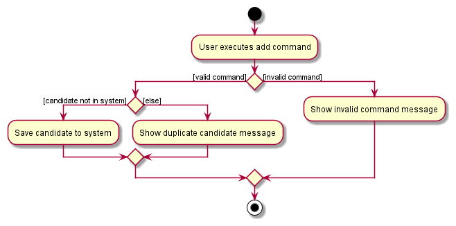
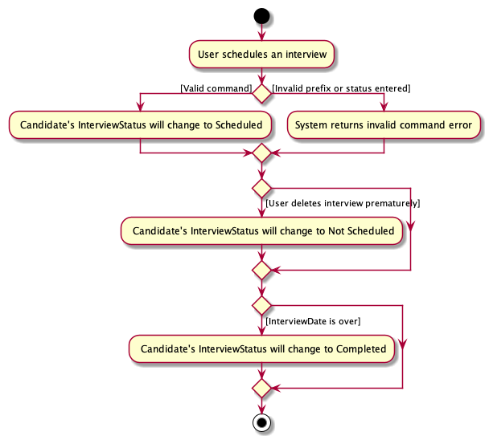
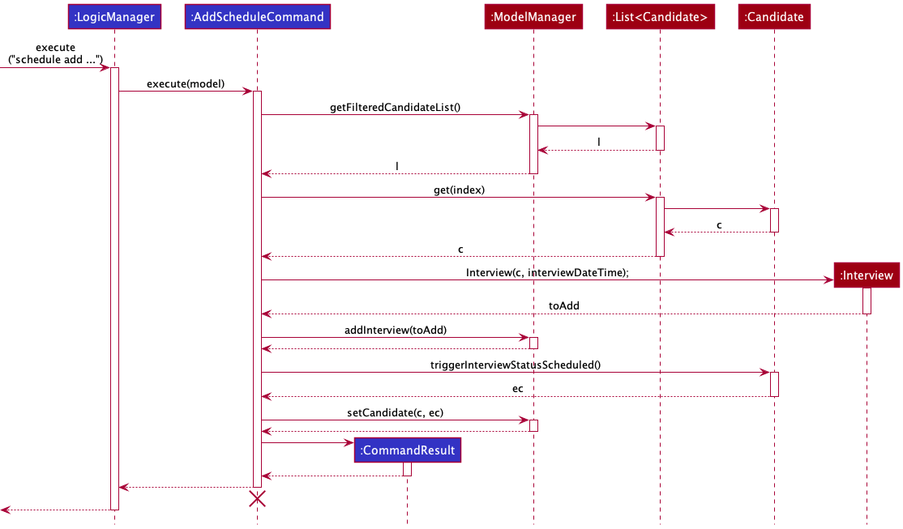

* Table of Contents
{:toc}

--------------------------------------------------------------------------------------------------------------------

## **Acknowledgements**

* [Application's Icon](https://img.icons8.com/doodle/344/apple-calendar--v1.png)

--------------------------------------------------------------------------------------------------------------------

## **Setting up, getting started**

Refer to the guide [_Setting up and getting started_](SettingUp.md).

--------------------------------------------------------------------------------------------------------------------

## **Design**

:bulb: **Tip:** The `.puml` files used to create diagrams in this document can be found in the [diagrams](https://github.com/AY2122S2-CS2103-F11-2/tp/tree/master/docs/diagrams) folder. Refer to the [_PlantUML Tutorial_ at se-edu/guides](https://se-education.org/guides/tutorials/plantUml.html) to learn how to create and edit diagrams.

**:information_source: Note about `AddressBook` named classes/packages:** 

TAlent Assistant™'s development team has decided to stick with AB3's naming convention for certain classes or the application's package, unless otherwise stated.

### Architecture

The ***Architecture Diagram*** given above explains the high-level design of the App.

Given below is a quick overview of main components and how they interact with each other.

**Main components of the architecture**

**`Main`** has two classes called [`Main`](https://github.com/AY2122S2-CS2103-F11-2/tp/blob/master/src/main/java/seedu/address/Main.java) and [`MainApp`](https://github.com/AY2122S2-CS2103-F11-2/tp/blob/master/src/main/java/seedu/address/MainApp.java). It is responsible for,
* At app launch: Initializes the components in the correct sequence, and connects them up with each other.
* At shut down: Shuts down the components and invokes cleanup methods where necessary.

[**`Commons`**](#common-classes) represents a collection of classes used by multiple other components.

The rest of the App consists of four components.

* [**`UI`**](#ui-component): The UI of the App.
* [**`Logic`**](#logic-component): The command executor.
* [**`Model`**](#model-component): Holds the data of the App in memory.
* [**`Storage`**](#storage-component): Reads data from, and writes data to, the hard disk.

**How the architecture components interact with each other**

The *Sequence Diagram* below shows how the components interact with each other for the scenario where the user issues the command `delete 1`.

Each of the four main components (also shown in the diagram above),

* defines its *API* in an `interface` with the same name as the Component.
* implements its functionality using a concrete `{Component Name}Manager` class (which follows the corresponding API `interface` mentioned in the previous point.

For example, the `Logic` component defines its API in the `Logic.java` interface and implements its functionality using the `LogicManager.java` class which follows the `Logic` interface. Other components interact with a given component through its interface rather than the concrete class (reason: to prevent outside component's being coupled to the implementation of a component), as illustrated in the (partial) class diagram below.

The sections below give more details of each component.

### UI component

The **API** of this component is specified in [`Ui.java`](https://github.com/AY2122S2-CS2103-F11-2/tp/blob/master/src/main/java/seedu/address/ui/Ui.java)

**:information_source: Notes about UI Class Diagram:** 

To make things more concise and for neatness, we have taken out the `UIPart` abstract class.
All classes associated with `MainWindow` and itself are connected to this abstract class (Again, not shown in the image below).

The UI consists of a `MainWindow` that is made up of parts e.g.`CommandBox`, `ResultDisplay`, `CandidateListPanel`, `InterviewListPanel`, `FocusCard`, `StatusBarFooter` etc. All these, including the `MainWindow`, inherit from the abstract `UiPart` class which captures the commonalities between classes that represent parts of the visible GUI.

The `UI` component uses the JavaFx UI framework. The layout of these UI parts are defined in matching `.fxml` files that are in the `src/main/resources/view` folder. For example, the layout of the [`MainWindow`](https://github.com/AY2122S2-CS2103-F11-2/tp/blob/master/src/main/java/seedu/address/ui/MainWindow.java) is specified in [`MainWindow.fxml`](https://github.com/AY2122S2-CS2103-F11-2/tp/blob/master/src/main/resources/view/MainWindow.fxml)

The `UI` component,
* executes user commands using the `Logic` component.
* listens for changes to `Model` data so that the UI can be updated with the modified data.
* keeps a reference to the `Logic` component, because the `UI` relies on the `Logic` to execute commands.
* depends on some classes in the `Model` component, as it displays `Candidate` or `Interview` object residing in the `Model`.

### Logic component

**API** : [`Logic.java`](https://github.com/AY2122S2-CS2103-F11-2/tp/blob/master/src/main/java/seedu/address/logic/Logic.java)

Here's a (partial) class diagram of the `Logic` component:

How the `Logic` component works:
1. When `Logic` is called upon to execute a command, it uses the `AddressBookParser` class to parse the user command.
1. This results in a `Command` object (more precisely, an object of one of its subclasses e.g., `AddCommand`) which is executed by the `LogicManager`.
1. The command can communicate with the `Model` when it is executed (e.g. to add a candidate).
1. The result of the command execution is encapsulated as a `CommandResult` object which is returned back from `Logic`.

The Sequence Diagram below illustrates the interactions within the `Logic` component for the `execute("delete 1")` API call.

:information_source: **Note:** The lifeline for `DeleteCommandParser` should end at the destroy marker (X) but due to a limitation of PlantUML, the lifeline reaches the end of diagram.

Here are the other classes in `Logic` (omitted from the class diagram above) that are used for parsing a user command:

How the parsing works:
* When called upon to parse a user command, the `AddressBookParser` class creates an `XYZCommandParser` (`XYZ` is a placeholder for the specific command name e.g., `AddCommandParser`) which uses the other classes shown above to parse the user command and create a `XYZCommand` object (e.g., `AddCommand`) which the `AddressBookParser` returns back as a `Command` object.
* All `XYZCommandParser` classes (e.g., `AddCommandParser`, `DeleteCommandParser`, ...) inherit from the `Parser` interface so that they can be treated similarly where possible e.g, during testing.

### Model component
**API** : [`Model.java`](https://github.com/AY2122S2-CS2103-F11-2/tp/blob/master/src/main/java/seedu/address/model/Model.java)

The `Model` component,

* stores the TAlent Assistant™'s data i.e., all `Candidate` objects (which are contained in a `UniqueCandidateList` object).
* stores the currently 'selected' `Candidate` objects (e.g., results of a `find` or `sort` query) as a separate _filtered_ list which is exposed to outsiders as an unmodifiable `ObservableList<Candidate>` that can be 'observed' e.g. the UI can be bounded to this list so that the UI automatically updates when the data in the list change.
* stores Candidates' `Interview` objects (which are contained in a `UniqueInterviewList` object).
* stores the currently 'selected' `Interview` objects as a separate _filtered_ list which is exposed to outsiders as an unmodifiable `ObservableList<Interview>` that can be 'observed' e.g. the UI can be bounded to this list so that the UI automatically updates when the data in the list change.
* stores a `UserPref` object that represents the user’s preferences. This is exposed to the outside as a `ReadOnlyUserPref` objects.
* does not depend on any of the other three components (as the `Model` represents data entities of the domain, they should make sense on their own without depending on other components)

### Storage component

**API** : [`Storage.java`](https://github.com/AY2122S2-CS2103-F11-2/tp/blob/master/src/main/java/seedu/address/storage/Storage.java)

The `Storage` component,
* can save address book data, interview schedule data and user preference data in json format, and read them back into corresponding objects.
* inherits from `AddressBookStorage`, `InterviewScheduleStorage` and `UserPrefStorage`, which means it can be treated as either one (if only the functionality of only one is needed).
* depends on some classes in the `Model` component (because the `Storage` component's job is to save/retrieve objects that belong to the `Model`)

### Common classes

Classes used by multiple components are in the `seedu.addressbook.commons` package.

--------------------------------------------------------------------------------------------------------------------

## **Implementation**

This section describes some noteworthy details on how certain features are implemented.

**:information_source: Note about `AddressBook` named classes:** 

TAlent Assistant™'s development team has decided to stick with AB3's naming convention for certain classes, unless otherwise stated.

### Add feature

#### What is the feature about?
The `add` mechanism is facilitated by `AddressBook`. The implementation of adding a `Candidate` through the `add` command has been enhanced on the existing approach. It extends `Command`. The input parameters of the `add` command has been tweaked, introducing a few more related attributes.

The enhancement works by adding additional prefixes i.e. `id/[StudentId]`, `c/[Course]`, `yr/[Seniority]`, `avail/[Availability]`. As for the attributes `ApplicationStatus` and `InterviewStatus`, users are not required to enter a value for it as the default value of `PENDING` will be assigned.

#### How is the feature implemented?

Given below is an example usage scenario and how the `add` mechanism behaves at each step.

:bulb: **Tip:** TAlent Assistant™ comes with preloaded data, user can execute the `clear` command for a fresh state.

Step 1. The user launches the application for the first time. The program will be initialised with the preloaded data.

Step 2. The user proceeds to add a candidate by running the `add` command with its necessary arguments. The image provides an example of this step.

#### Why is the feature implemented as such?

The `add` command is done up with the goals of being as convenient and efficient as possible for the users. It is kept simple with easy to interpret and understandable prefixes that convey to the user on what is expected from their input.

#### UML Diagrams
**Activity Diagram**

The following activity diagram summarizes what happens when a user executes an `add` command:

### ApplicationStatus Feature

#### What is the feature about?

This feature implements a tagging system attached to the Candidate's profile in our Application. This way, our user can
easily see which candidates are `Accepted`, `Rejected`, or `Pending`. This will help enhance user experience when using our application.

#### How is the feature implemented?

This feature is currently embedded into the `EditCommand` feature. Currently, a user could edit the `ApplicationStatus` by using the
using the `Edit` command.

#### Why is the feature implemented as such?
We designed this tagging system is such a way that when a user is first added into the system, the user's `ApplicationStatus`
will be set to default of `pending`. This will help the user to minimise the amount of commands to type when adding in a Candidate.

The `ApplicationStatus` is currently implemented as a class by itself, and each `Candidate` has an `ApplicationStatus` embedded into their profile.
To change their status, the `EditCommandParser` will look out for the prefix to change the status, and will change their status accordingly.

In the initial phase of the project, we wanted the ApplicationStatus to be a `String` inside the `Candidate`. However after much consideration,
we have decided to make it a class of its own. This way, we can defensively design and code the `ApplicationStatus` and prevent any rouge data
from being entered.

#### UML Diagrams
**Activity Diagram** 
The following activity diagram summarizes what happens when a user executes a `Edit ApplicationStatus` command:  

### InterviewStatus Feature

#### What is the feature about?

This feature implements a tagging system attached to the Candidate's profile in our Application. This way, our user can
easily see which candidates are `Scheduled`, `Not Scheduled`, or `Completed`. This will help enhance user experience when using our application.

#### How is the feature implemented?

This feature currently uses our `trigger` inside the Candidate class, namely `Candidate#triggerInterviewStatusNotScheduled()`,
`Candidate#triggerInterviewStatusScheduled()` and `Candidate#triggerInterviewStatusCompleted()`.

When a `Candidate` is scheduled for an interview, it will `trigger` the `InterviewStatus` of the Candidate to be `scheduled`.
When a `Candidate`'s interview is over, the trigger will automatically mark the `Candidate`'s `InterviewStatus` as `completed`.
If an interview date is deleted prematurely, the `InterviewStatus` of the `Candidate` will be reverted back to `Not Scheduled`.

#### Why is the feature implemented as such?
We designed this tagging system is such a way that when a user is first added into the system, the user's `ApplicationStatus`
will be set to default of `Not Scheduled`. This will help the user to minimise the amount of commands to type when adding in a Candidate.

In the initial planning phase of the project, we intended for the `InterviewStatus` to be `triggered` by many factors, such as `ApplicationStatus`,
the current date and time, etc.
However by coupling these two statuses together, the user will have lesser flexibility to change either `ApplicationStatus` or `InterviewStatus.
Hence we decided to keep them independent.

We also decided that when an interview is deleted prematurely, that the `InterviewStatus` will revert back to `not scheduled`, as it will help to differentiate
which `Candidate` has yet to be scheduled.

We also implemented a blocking system, such that if a `Candidate` has completed their interview, the system will not be able to schedule them for
another interview (by checking their `InterviewStatus`)

#### UML Diagrams
**Activity Diagram** 
The following activity diagram summarizes what happens for the `InterviewStatus`  

### Find feature

#### What is the feature about?
The `find` mechanism is facilitated by `AddressBook`. The `find` command in `TAlent Assistant™`
has been enhanced based on the initial implementation of the `find` command in `AddressBook`.

The enhancement works by adding a new prefix in the `CliSyntax` class `k/`, which allows the
user to separate multiple keywords and `f/` which allows the user to specify which field the
`find` command should search for keywords under.

#### How is the feature implemented?
The main logic for `find` command is still implemented within `FindCommand` (which extends from `Command`) and
`FindCommandParser`.

The `FindCommandParser` class has been extended to include a switch-case block to validate
which field the user is trying to search across:
1. `studentId`
2. `course`
3. `seniority`
4. `name`
5. `email`
6. `phone`
7. `appStatus` (stands for candidate's application status)
8. `intStatus` (stands for candidate's interview status)
9. `avail` (stands for candidate's availability)
10. `all` (i.e. search across all fields of the candidate)

Based on the field validated by the switch-case block, a `new findCommand(new ContainsKeywordsPredicate(keywords))`
will be created. The implementation of the original `NameContainsKeywordsPredicate` has been enhanced here.
There is now a `ContainsKeywordsPredicate` parent abstract class extended by each of the above listed fields as subclasses
(e.g. `StudentIdContainsKeywordsPredicate extends ContainsKeywordsPredicate`).

#### Why is the feature implemented as such?
**1. Switch-case block in `FindCommandParser`**  
Other alternatives considered included creating a separate class to execute the logic of checking for which field the
user had entered and return the new `ContainsKeywordsPredicate` subclass *or* to utilise `if`-`else` statements.
In the end, the implementation was done using the switch-case block within the `FindCommandParser` class, as the
class should contain all the necessary logic to parse in the user's input. The syntax for the switch-case block was
also more efficient than `if`-`else` statements and was more relevant for this usage.

**2. Inheritance of `ContainsKeywordsPredicate` to child classes**
Other alternatives considered included creating one single `ContainsKeywordsPredicate` class to implement all the
equality and keyword match checks for each and every field.
However, this would not meet good design principles - this would make it difficult to isolate and resolve bugs during
testing and make scalability and maintainability more complicated.
Further, since all the child classes implement similar logic and methods, it would make sense to create an
(abstract) parent class. This establishes the SRP principle, such that each subclass is only responsible for
checks for the specific related entity, and should not have any other reason to change otherwise.

**3. Allowing searches across multiple fields**
Currently the `find` command is implemented such that the parser will only validate the last `ATTRIBUTE_FIELD` parsed in
by the user, and execute the `ContainsKeywordsPredicate` test against it. An alternative was to allow searches across multiple
`ATTRIBUTE_FIELDS`. Though this is implementable by checking the validity of each of the `ATTRIBUTE_FIELD` parsed in,
it is considered out of scope in this particular iteration. Given as all the fields hold extremely different values,
the user is unlikely to be searching for the same set of keywords across multiple fields. Instead, following the behaviour
of other commands, the `FindCommandParser` will take in the last `f/` prefix.

#### UML Diagrams
**Activity Diagram** 
The following activity diagram summarizes a high level view of what happens when a user executes a `find` command:  

### Sort feature

#### What is the feature about?
The `sort` mechanism utilises the existing command class model from `AddressBook`. It introduces new methods and modifies current
implementation of existing methods in order to allow the user to sort the displayed candidates list by a specific
field.

A new `s/` prefix is added in the `CliSyntax`, which is used to accurately parse in the `ATTRIBUTE_FIELD` that the user
would like to sort the displayed candidate list by. The implementation in `SortCommand` class works by calling 
`model.updateSortedCandidateList(sortComparator)`, which updates the sorted order of the existing `CandidateList` in the system.

#### How is the feature implemented?
The parser for the `sort` command works similarly to all other commands implemented. In this case, as the user
may potentially key in multiple valid `s/` prefix fields, we utilise the `ArgumentTokenizer` in order to parse
in all the inputs, and only utilise the last `s/` prefix field.

The main logic for executing the `sort` command works within the `ModelManager` and `AddressBook` classes. When the
sort command is executed, a valid Comparator is passed as an argument into the `updateSortedCandidateList()` method, which
is called from the `ModelManager` class. Here, the `ModelManager` class acts as an intermediate layer
which then calls the `sortCandidates()` method in the `AddressBook` class.

The `sortCandidates()` method creates an exact copy of the existing `CandidateList` currently
in the system, before sorting it by the `Comparator` passed as its argument and setting
the new `CandidateList` in the system to be that of the sorted copy.

#### Why is the feature implemented as such?
**1. Modification of `ObservableList<Candidate>`** 
The `ObservableList<Candidate>` accessible by calling `getFilteredCandidateList()` in the `ModelManager` class
is an unmodifiable copy. In order to retain the integrity of data accessible through in the `ModelManager`, the modification of the candidate 
list is instead implemented within the `AddressBook` class. This separates the responsibilities of `AddressBook` class (which
wraps all data in the system) from the `ModelManager` class, which provides a slightly higher level of abstraction to access
the in memory data.

#### UML Diagrams
The following simplified partial sequence diagram showcases what happened when `execute` is called from the `LogicManager`.

Explanation of sequence when a `sort s/name` is parsed in is explained.

**Step 1.** (Not shown by diagram) The new `SortCommand` object is created with the `Comparator<Candidate>` object passed in as the argument when
the user enters the command.

**Step 2.** The`SortCommand#execute` method is called from `LogicManager` with the `Model` object passed in.

**Step 3.** `ModelManager#updateSortedCandidateList` is called, where the `ModelManager` class
implements the `Model` interface. The `Comparator<Candidate>` object is passed in as the argument.

**Step 4.** The `AddressBook#sortCandidates` is then called where a new copy of the candidate list is created as a `List<Candidate>` and sorted using the comparator.

**Step 5.** The candidate list in the system is then set as the new sorted copy using the `AddressBook#setCandidates` method call.

**Step 6.** Finally, `SortCommand#execute` method returns a new `CommandResult` object with feedback message to be displayed.

### Focus Feature

#### What is this feature about?
The 'focus' feature utilises the different panels in our application. It will bring up the intended Candidate's information,
such as course, email into the middle panel for the user to see.

#### How is this feature implemented?
This feature is implemented with the similar implementation of `CandidateListCard`, as we utilise the JavaFX codes to
create the `view`. We also introduced new features such as `ImageView`, where the extra information will consist of a display
picture for the Candidate.

#### Why is the feature implemented as such?
We created a new return value in `CommandResult` to get the `Index` of the intended Candidate. We implemented it this way
to not alter the existing database, as the intended purpose of this feature was not to edit the candidate's information.
We considered creating another database for this feature, by fetching more details from the secondary database, but we considered
that this will be a heavy headway for our application.

#### UML Diagram
The following activity diagram summarizes what happens when a user executes a `focus` command. 

### Scheduling interviews feature

#### What is this feature about?
The `AddScheduleCommand`, `EditScheduleCommand`, `DeleteScheduleCommand` and `ClearScheduleCommand` features allow
the user to add, edit, delete or clear all interviews respectively.

#### How is this feature implemented?
This feature is modelled after AB3's `add`, `edit`, `delete` and `clear` commands for consistency. Interview objects
created upon the `schedule add` command are contained in a `UniqueInterviewList` object and exposed to outsiders as
an unmodifiable `ObservableList<Interview>`.

#### Why is this feature implemented as such?
* **Alternative 1 (Current Choice)**: Newly created interviews are added to a list of interviews, and
  each interview object contains its corresponding `Candidate`.
    * Pros: No need to iterate through every candidate to initialise the interview schedule. Better performanece when
      editing or deleting interviews by index in the interview schedule.
    * Cons: Editing a `Candidate` attribute requires an update to their corresponding `Interview`'s `Candidate` object.
* Alternative 2: Every candidate has an `Interview` attribute, initialised to null. When a candidate is scheduled for an
  interview, the newly created interview is assigned to be the candidate's `Interview` attribute.
    * Pros: Editing a `Candidate` attribute does not affect their `Interview` attribute.
    * Cons: Interview schedule has to iterate through every candidate to search for existing interviews during initialisation.
  Editing or deleting interviews by index from the interview schedule would require further iterations through the candidate list
  to find the target interview.

#### UML Diagram
Below is a simplified sequence diagram showing how an `AddScheduleCommand` is parsed under the `Logic` 
component when a user adds an interview to the schedule. Note that all four schedule commands `AddScheduleCommand`, 
`EditScheduleCommand`, `DeleteScheduleCommand` and `ClearScheduleCommand` follow a similar structure.

Below is another sequence diagram with a more in depth view of how the `AddScheduleCommand` is executed after parsing.

Explanation of sequence when a `AddScheduleCommand` is called.

**Step 1.** The user executes the command `schedule add candidate/1 at/24-05-2022`.

**Step 2.** User input is passed to the `AddressBookParser`, which calls `ScheduleCommandParser#parse`, 
which then calls `AddScheduleCommandParser#parse` to create a new `AddScheduleCommand`.

**Step 3.** The `AddScheduleCommand` will then be executed by calling its `execute` method.

**Step 4.** Since the Model is passed to `AddScheduleCommand#execute`, it is able to call a method `Model#getFilteredCandidateList` to get the last candidate list shown.

**Step 5.** From the candidate list, we can find the desired candidate to schedule for interview by calling the `get` function with the specified Index.

**Step 6.** A new `Interview` is created for the candidate and the Model#addInterview method is called to add the `Interview` to the Model.

**Step 7.** After the interview is successfully added, we call the `Candidate#triggerInterviewStatusScheduled` method which returns
the `Candidate` with his interview status set to `Scheduled`. The Model will then call Model#setCandidate to update the candidate in the list.

--------------------------------------------------------------------------------------------------------------------

## **Documentation, logging, testing, configuration, dev-ops**

* [Documentation guide](Documentation.md)
* [Testing guide](Testing.md)
* [Logging guide](Logging.md)
* [Configuration guide](Configuration.md)
* [DevOps guide](DevOps.md)

--------------------------------------------------------------------------------------------------------------------

## **Appendix: Requirements**

### Product scope

**Target user profile**:

* Professor from NUS School of Computing
* Needs to manage a significant number of TA applications for a particular module
* Prefers desktop apps to other platform apps
* Possesses fast typing speed
* Prefers typing to mouse interactions
* Reasonably comfortable using CLI apps

**Value proposition**: TAlent Assistant™ creates a centralized management system for NUS School of Computing professors to manage
undergraduate TA applications by providing easy access to candidates' data to review their general availability for
scheduling interviews during office hours.

### User stories

Priorities: High (must have) - `* * *`, Medium (nice to have) - `* *`, Low (unlikely to have) - `*`

| Priority | As a …​  | I want to …​                                            | So that I can…​                                                                    |
|----------|----------|---------------------------------------------------------|------------------------------------------------------------------------------------|
| `* * *`  | user     | add a candidate to the system                           | keep track of their application details for consideration.                         |
| `* * *`  | user     | focus on a specific candidate from the system           | have a better understanding of the candidate.                                      |
| `* * *`  | user     | edit a candidate in the system                          | correct any wrong inputs when I added this candidate.                              |
| `* * *`  | user     | delete a candidate from the system                      | remove entries that I no longer need.                                              |
| `* * *`  | user     | find a candidate in the system                          | access details of the candidate without having to go through the entire list.      |
| `* * *`  | user     | list all candidates in the system                       | monitor the application pool.                                                      |
| `* *`    | user     | sort candidates in the system                           | view the candidates in a more organised manner based on a certain attribute field. |
| `* *`    | user     | clear all candidates in the system                      | start from a fresh list of candidates.                                             |
| `* * *`  | user     | view scheduled interviews within a specific time period | keep track of the upcoming interview schedule.                                     |
| `* * *`  | user     | schedule TA candidates for interviews                   | keep track of the interview schedule.                                              |
| `* * *`  | user     | retrieve the scheduled interview details of a candidate | work around my schedule for the interview.                                         |
| `* * *`  | user     | re-schedule an interview                                | fit this interview into the candidate's schedule or even mine.                     |
| `* * *`  | user     | delete an interview                                     | revert the scheduling of the specific candidate.                                   |
| `* *`    | user     | clear all interviews in my schedule                     | remove all upcoming interviews conveniently.                                       |
| `* * *`  | user     | update the remark for a candidate in the system         | keep a note of important details relating to the candidate.                        |
| `* * *`  | new user | view all available commands                             | get familiarised with the system.                                                  |

### Use cases

(For all use cases below, the **System** is `TAlent Assistant™` and the **Actor** is the `professor`, unless specified otherwise)

**:information_source: Notes on the abbreviations:** TA - Teaching Assistant

 

**Use case: List all candidates in the system**

**MSS**

1. User requests to list candidates
2. TAlent Assistant™ shows all candidates

Use case ends.

**Extensions**

* 2a. The list is empty
    * 2a1. TAlent Assistant™ feedbacks no candidates in system

  Use case ends.

**Use case: Add a candidate into the system**

**MSS**

1.  User requests to add a candidate
2.  TAlent Assistant™ requests for candidate's details
3.  User inputs details
4.  TAlent Assistant™ adds the new candidate

Use case ends.

**Extensions**

* 3a. The given format is invalid
    * 3a1. TAlent Assistant™ shows an error message

  Use case resumes at step 2.

**Use case: Edit an existing candidate in the system**

**MSS**

1.  User requests to edit a candidate
2.  TAlent Assistant™ requests for candidate's inputs
3.  User selects candidate to edit and inputs the updated details
4.  TAlent Assistant™ edit the specified candidate

Use case ends.

**Extensions**

* 3a. The given format is invalid
    * 3a1. TAlent Assistant™ shows an error message

  Use case resumes at step 2.

**Use case: Delete a candidate from the system**

**MSS**

1.  User requests to list TA candidates
2.  TAlent Assistant™ displays the list of TA candidates
3.  User requests to delete a specific candidate in the list
4.  TAlent Assistant™ deletes the candidate from the list and displays the deleted entry

  Use case ends.

**Extensions**

* 3a. The list is empty

  Use case ends.

* 3b. The given index is invalid.
    * 3b1. TAlent Assistant™ displays an error message

  Use case resumes at step 2.

**Use case: Schedule a candidate from the system for an interview**

**MSS**

1.  User requests to list TA candidates
2.  TAlent Assistant™ displays the list of TA candidates
3.  User requests to schedule a specific candidate in the list for an interview on a particular date and time
4.  TAlent Assistant™ schedules the interview and marks the Interview Status of the candidate as Scheduled.

  Use case ends.

**Extensions**

* 2a. The candidate list is empty

  Use case ends.

* 3a. The given index is invalid
    * 3a1. TAlent Assistant™ displays an error message

  Use case resumes at step 3.

* 3b. The given date and/or time format is invalid or in the past
    * 3b1. TAlent Assistant™ displays an error message

  Use case resumes at step 3.

**Use case: Reschedule an interview in the system**

**MSS**

1.  User requests to view interview schedule
2.  TAlent Assistant™ displays the list of interviews in the schedule
3.  User requests to reschedule a specific interview to a particular date and time
4.  TAlent Assistant™ reschedules the interview to the new date and time

Use case ends.

**Extensions**

* 2a. The interview schedule is empty

  Use case ends.
* 3a. The given (interview) index is invalid
  * 3a1. TAlent Assistant™ displays an error message

  Use case resumes at step 3.

* 3b. The given date and/or time format is invalid or in the past
  * 3b1. TAlent Assistant™ displays an error message

  Use case resumes at step 3.

**Use case: Delete an interview in the system**

**MSS**

1.  User requests to view interview schedule
2.  TAlent Assistant™ displays the list of interviews in the schedule
3.  User requests to delete a specific interview
4.  TAlent Assistant™ removes the interview from the schedule

Use case ends.

**Extensions**

* 2a. The interview schedule is empty

  Use case ends.
* 3a. The given (interview) index is invalid

  * 3a1. TAlent Assistant™ displays an error message

  Use case resumes at step 3.

**Use case: Find candidates in the system**

**MSS**

1. User requests to find candidates containing specific keyword(s)
2. TAlent Assistant™ returns a list of candidates that contain one or more of the given keyword(s)
   in the specified attribute field

Use case ends.

**Extensions**

* 2a. No TA candidate entries contain the given keyword in the specified attribute field
    * 2a1. TAlent Assistant™ returns an empty list with zero search results

  Use case ends.

* 2b. The specified attribute field is invalid
    * 2b1. TAlent Assistant™ returns an error message

  Use case resumes at step 1.

**Use case: Sort candidates in the system**

**MSS**

1. User requests to sort candidates by a specific attribute field
2. TAlent Assistant™ returns a list of candidates sorted with regard to the specified attribute field

Use case ends.

* 2b. The specified attribute field is invalid
    * 2b1. TAlent Assistant™ returns an error message

  Use case resumes at step 1.

**Use case: View scheduled interviews in the system**

**MSS**

1. User requests to view scheduled interviews within a specific time period
2. TAlent Assistant™ returns a list of scheduled interviews within the specified time period, sorted from earliest to latest

Use case ends.

* 2b. The specified time period is invalid
    * 2b1. TAlent Assistant™ returns an error message

  Use case resumes at step 1.

**Use case: Update remark of a candidate in the system**

**MSS**

1. User requests to update the remark of a candidate in the system
2. TAlent Assistant™ returns the candidate with the updated remark in the feedback panel

Use case ends.

* 2b. The candidate specified is displayed in the focus panel
    * 2b1. TAlent Assistant™ updates the candidate's remark displayed

    Use case resumes at step 1.

**Use case: List available commands**

**MSS**

1.  User requests to list available commands
2.  TAlent Assistant™ returns list of available commands and example usages

Use case ends.

**Use case: Marks candidate's application status**

**MSS**

1. User wants to edit a candidate's application status
2. TAlent Assistant™ will update the status of the candidate, and display it on the UI.

Use case ends.

* 2a. The status entered by the user is invalid
    * 2a1. TAlent Assistant™ returns an error message
    
  Use case ends.

* 2b. The Candidate does not exist
    * 2b1. TAlent Assistant™ returns an error message
    
  Use case ends.

**Use case: Change the Interview Status of the Candidate**

Preconditions: Candidate has an interview scheduled.

**MSS**

1. User wants to change the Interview Status of the Candidate to Completed.
2. TAlent Assistant™ will update the Interview Status of the candidate once the interview slot is over.

Use case ends.

* 2a. User deletes the interview slot before the interview starts
    * 2a1. TAlent Assistant™ will change the Interview Status of the Candidate to Not Scheduled.
      
  Use case ends.

**Use case: User wants to see more details of the Candidate**

**MSS**

1. User requests to see more information about the Candidate.
2. TAlent Assistant™ will return all the information available for the Candidate selected.

Use case ends.

* 2a. Candidate does not exist in the system.
    * 2a1. TAlent Assistant™ returns an error message

    Use case ends.

**Use case: Clear all candidates in the system**

**MSS**

1.  User requests to clear all candidates
2.  TAlent Assistant™ clears all candidates

Use case ends.

**Use case: Clear all interviews in the system**

**MSS**

1.  User requests to clear all interviews
2.  TAlent Assistant™ clears all interviews in the schedule

Use case ends.

### Non-Functional Requirements

1. TAlent Assistant™ should work on any _mainstream OS_ as long as it has Java `11` or above installed.
2. TAlent Assistant™ should work on both 32-bit and 64-bit environments.
3. TAlent Assistant™ should be able to hold up to 100 candidate entries in the local database with at most 2 seconds delay in performance for typical usage.
4. TAlent Assistant™ should be able to hold up to 100 scheduled interview entries in the local database with at most 2 seconds delay in performance for typical usage.
5. TAlent Assistant™ should work under common screen resolutions.
6. TAlent Assistant™ is for individual use.
7. TAlent Assistant™ should work even without Internet connection.
8. A user with above average typing speed for regular English text (i.e. not code, not system admin commands) should be able to accomplish most of the tasks faster using commands than using the mouse.
9. The response to any user action should become visible within 3 seconds.
10. Colors used for the user interface should be pleasant and not straining on the eyes.

### Glossary

* **Mainstream OS**: Windows, Linux, Unix, macOS
* **TA**: Teaching Assistant
* **32/64-bit environment**: A system that uses a 32/64-bit processor
* **System admin commands**: Commands that are used on the terminal interface
* **CLI**: Command Line Interface
* **GUI**: Graphical User Interface

--------------------------------------------------------------------------------------------------------------------

## **Appendix: Instructions for manual testing**

Given below are instructions to test the app manually.

:information_source: **Note:** These instructions only provide a starting point for testers to work on;
testers are expected to do more *exploratory* testing.

### Launch and shutdown

1. Initial launch

    1. Download the jar file and copy into an empty folder

    1. Double-click the jar file Expected: Shows the GUI with a set of sample candidates. The window size may not be optimum.

2. Saving window preferences

    1. Resize the window to an optimum size. Move the window to a different location. Close the window.

    2. Re-launch the app by double-clicking the jar file. 
       Expected: The most recent window size and location is retained.
   
3. Resizing panels

   1. Resize the bottom panels accordingly. Close the window.

   2. Re-launch the app by double-clicking the jar file 
      Expected: The panels will be resized to its default size. All three panels will have equal width.

### Adding a candidate

1. Adding a candidate into the system

   1. Test case: `add id\A0123456B n/John Doe p/87654321 e/E0123456@u.nus.edu c/Computer Science yr/2 avail/1,2,3` 
      Expected: 1st parameter is incorrect. It should be `id/A0123456B` with a forward slash `/`. All prefixes and its value are tied with a forward slash `/`.
   
   2. Test case: `add id/A0123456B` 
      Expected: All attributes of a `Candidate` should be present in the `add` command. An error message will be shown with the full `add` command statement.

   3. Test case: `add id/A0123456B n/John Doe p/87654321 e/E0123456 c/CS yr/2 avail/monday,tuesday,wednesday` 
      Expected: There are invalid values for `email`, `course` and `availability`. All values provided in the `add` command will be validated by the system. 

### Editing a candidate

1. Editing a candidate while all candidates are being shown

   1. Prerequisites: System contains only two candidates, candidate 1 is: `id/A0654321B  n/Jane Doe p/81234657 e/E0654321@u.nus.edu c/Computer Science yr/2 avail/1,2,3`
      and candidate 2 is: `id/A0123456B  n/Peter Parker p/87654321 e/E0123456@u.nus.edu c/Computer Science yr/2 avail/1,2,3`
   
   2. Test case: `edit 1 n/Mary Jane` 
      Expected: First candidate's name has been updated to show Mary Jane.
   
   3. Test case: `edit 0 n/Mary Jane` 
      Expected: No candidate is edited. An error message will be shown.

   4. Test case: `edit 1 id/A0123456B p/87654321 e/E0123456@u.nus.edu` 
      Expected: Parameters to be edited belongs to another candidate in the system. An error message will be shown.
   
   5. Test case: `edit 1 id/A0123456B n/Jane Doe p/87654321 e/E0123456 c/CS yr/2 avail/monday,tuesday,wednesday` 
      Expected: There are invalid values for `email`, `course` and `availability`. All values provided in the `edit` command will be validated by the system.

### Deleting a candidate 

1. Deleting a candidate while all candidates are being shown

    1. Prerequisites: List all candidates using the `list` command. Multiple candidates in the list.

    2. Test case: `delete 1` 
        Expected: First candidate is deleted from the list. Details of the deleted candidate shown in the status message.

    3. Test case: `delete 0` 
       Expected: No candidate is deleted. Error details shown in the status message. Status bar remains the same.

    4. Other incorrect delete commands to try: `delete`, `delete x`, `...` (where x is larger than the list size) 
       Expected: Similar to previous.
    
### Scheduling an interview

1. Adding an interview into the system

    1. Prerequisite: List all candidates using the `list` command. Multiple candidates in the list.
   
    2. Test case: `schedule add 1 at/03-08-2022`  
       Expected: 1st parameter is incorrect. It should be `candidate/1` with a forward slash `/`.

    3. Test case: `schedule add candidate/1` 
       Expected: The `DATE_TIME` of an `Interview` should be present in the ` schedule add` command.  Error details shown in the status message.

    4. Test case: `schedule add candidate/1 at/03/08/2022` 
       Expected: The `DATE_TIME` of an interview must be in the format `dd-MM-yyyy`. Error details shown in the status message.

    5. Test case: `schedule add candidate/1 at/20-02-2000` 
       Expected: The `DATE_TIME` of an interview must not be in the past. Error details shown in the status message.

    6. Test case: `schedule add candidate/1 at/03-08-2022` 
       Expected: Interview is successfully added to the schedule. Details of interview shown in the status message. 
       Note: The candidate must be available on the given `DATE_TIME`.
    
### Deleting an interview

1. Deleting an existing interview in the system
    
    1. Prerequisite: View all interviews using the `view all` command. Multiple interviews in the schedule.
   
    2. Test case: `schedule add 1 at/03-08-2022`  
       Expected: 1st parameter is incorrect. It should be `candidate/1` with a forward slash `/`. All prefixes and its value are tied with a forward slash `/`.

    3. Test case: `schedule delete 1` 
       Expected: First interview is deleted from the list. Details of deleted interview shown in the status message.

    4. Test case: `schedule delete 0` 
       Expected: No interview is deleted. Error details shown in the status message.
   
    5. Other incorrect delete commands to try: `schedule delete`, `schedule delete x`, `...` (where x is larger than the list size) 
       Expected: Similar to previous.
    
### Viewing the interview schedule

1. Viewing the interview schedule for a specific time period

    1. Prerequisites: Schedule an interview using the `schedule add` command that is within 7 days of the current date and time.
   Schedule another interview using the `schedule add` command that is after 7 days but within 14 days of the current date and time.

    2. Test case: `view week` 
       Expected: The earlier interview scheduled within 7 days of the current date and time is displayed in the interview
   panel. The other interview scheduled after 7 days of the current date and time is not displayed. Number of interviews listed is displayed in the feedback panel.

    5. Test case: `view` 
       Expected: No change to the interview schedule already displayed. Error message is shown in the feedback panel.

    6. Other incorrect view commands to try: `view this week`, `view xxx` (where 'xxx' is any string other than the accepted keywords `all`, `today`, `week` or `month` for time period specified) 
       Expected: No change to the interview schedule already displayed. Error message is shown in the feedback panel.

### Updating a candidate's remark

1. Updating a candidate's remark while the candidate is displayed in the focus panel

    1. Prerequisites: List all candidates using the `list` command. Multiple candidates in the list. Bring up the details
   of the first candidate listed to the focus panel using the `focus 1` command.

    2. Test case: `remark 1 r/` 
       Expected: Remark for candidate at index 1 in the displayed candidate list is removed. Focus panel updates
       to display the remark field as `No remark added!`. Details of the candidate with the updated remark is shown in the feedback panel.

    5. Test case: `remark 1 r/updated remark` 
       Expected: Remark for candidate at index 1 in the displayed candidate list is updated. Focus panel updates
       to display the remark field as `updated remark`. Details of the candidate with the updated remark is shown in the feedback panel.

    7. Incorrect remark commands to try: `remark 0`, `remark 1 r`, `remark r/` 
       Expected: No update to remarks of any candidate. Error message is shown in the feedback panel.

2. Updating a candidate's remark while only some candidates are being shown
    1. Prerequisites: List all candidates using the `list` command. Multiple candidates in the list. Bring up the details
       of the first candidate listed to the focus panel using the `focus 1` command. 
       Use the `find` command to display a new filtered list of candidates excluding the first candidate previously listed.

    2. Test case: `remark 1 r/new remark` 
       Expected: Remark for candidate at index 1 in the currently displayed candidate list is updated to
       `new remark`. Details of the candidate with the updated remark is shown in the feedback panel. Focus panel does not update the remark of the currently displayed candidate.

### Sorting candidates in the system

1. Sorting candidates while all candidates are being shown

    1. Prerequisites: List all candidates using the `list` command. Multiple candidates in the list.

    1. Test case: `sort s/name` 
       Expected: All candidates are sorted in case-insensitive alphanumerical order 0-9, A-Z based on each candidate's displayed name. Number of candidates sorted is shown in the feedback panel.

    1. Test case: `sort s/name s/course` 
       Expected: The last sorting key `course` will be utilised and verified. All candidates are sorted in case-insensitive alphanumerical order 0-9, A-Z based on each candidate's displayed course.  Number of candidates sorted is shown in the feedback panel.

    1. Incorrect sort commands to try: `sort`, `sort s/xxx` (where xxx is an invalid attribute field to be sorted by) 
       Expected: No change to the list of candidates already displayed. Error message is shown in the feedback panel.

2. Sorting candidates while only some candidates are being shown

    1. Prerequisites: List all candidates using the `list` command. Multiple candidates in the list.
       Use the `find` command to display a new filtered list with fewer candidates. Multiple candidates in the filtered list.

    2. Test case: `sort s/name` 
       Expected: Currently displayed candidates are sorted in case-insensitive alphanumerical order 0-9, A-Z based on each candidate's displayed name. Number of candidates sorted is shown in the feedback panel.

### Finding candidates in the system

1. Finding a candidate from existing candidates in the system

    1. Prerequisites: Add a new candidate with the name `Alex Chang` using the `add` command.

   1. Test case: `find k/Alex f/name` 
      Expected: Only candidates containing `Alex` in their names (case-insensitive) should be displayed. Previously added candidate with the name `Alex Chang` should be displayed. Number of candidates found and displayed is shown in the feedback panel.

   1. Test case: `find k/Alex f/` 
      Expected: Only candidates containing `Alex` in any of their valid searchable attribute fields (case-insensitive) should be displayed. Previously added candidate with the name `Alex Chang` should be displayed. Number of candidates found and displayed is shown in the feedback panel.

   1. Incorrect find commands to try: `find`, `find f/xxx` (where xxx is any invalid attribute field to search by) 
      Expected: No change to the list of candidates already displayed. Error message is shown in the feedback panel.

### Bringing candidate data to center panel

1. Loading up `Candidate's` details into the center panel in the application. 

   1. Test case: `focus` on a `Candidate` in the system.  
   Expected: The `Candidate's` information will be shown on the center panel.

   2. Test case: `focus` on an `INDEX` that is out of bounds.  
      Expected: No `Candidate` will be shown in the center panel, and an error message will be displayed. 

   3. Test case: `schedule clear` when `Candidate's` information is currently displayed on the center panel.  
      Expected: `Candidate's` interview schedule will be automatically refreshed on the center panel.
   
   4. Test case: `schedule add` when `Candidate's` information is currently displayed on the center panel.  
      Expected: `Candidate's` interview schedule will be automatically refreshed on the center panel.
   
   5. Test case: `schedule edit` when `Candidate's` information is currently displayed on the center panel.  
      Expected: `Candidate's` interview schedule will be automatically refreshed on the center panel.
   
   6. Test case: `edit as/` when `Candidate's` information is currently displayed on the center panel. 
      Expected: `Candidate's` `ApplicationStatus` will be automatically refreshed on the center panel.

   7. Test case: `edit` other attributes of `Candidate` when `Candidate's` information is currently displayed on the center panel.  
      Expected: The center panel will be cleared. 

   8. Test case: `clear` when `Candidate's` information is currently displayed on the center panel.  
      Expected: The center panel will be cleared.

### Saving data

1. Dealing with missing data files 
   1. Prerequisites: Missing `data/talentassistant.json`.
   
   2. Test case: Delete `data/talentassistant.json` and relaunch the application. 
      Expected: Application will be populated with sample data.

2. Dealing with corrupted data files
   1. Prerequisites: `data/talentassistant.json` is modified to contain invalid details.
   
   2. Test case: Modify a `Candidate`'s phone number to start with any digit other than 6, 8 or 9 and launch the application. 
      Expected: Application will start without any data.
   
   3. Test case: Modify a `Candidate`'s phone number to start with any digit other than 6, 8 or 9 while the application is running. 
      Expected: Application continues to run smoothly.

