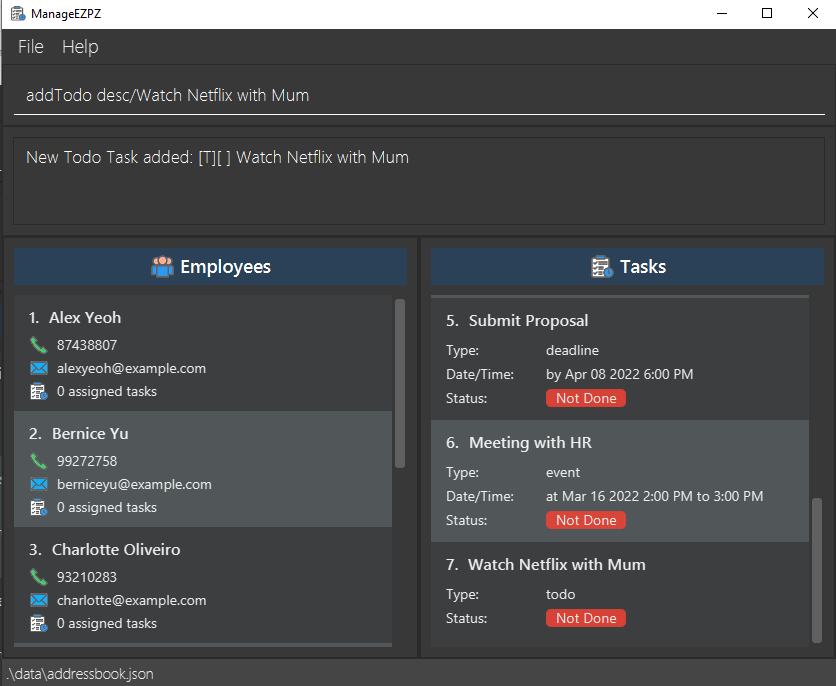
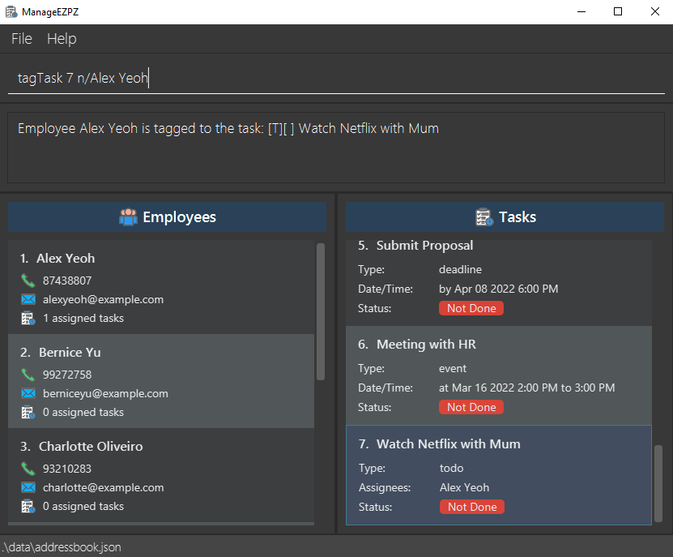

* Table of Contents
  {:toc}

--------------------------------------------------------------------------------------------------------------------

## **Acknowledgements**
* https://ay2021s2-cs2103t-t12-4.github.io/tp/DeveloperGuide.html#endpoint-components {Documentation idea of splitting the Model component into 2, to prevent cramping of image}
* {list here sources of all reused/adapted ideas, code, documentation, and third-party libraries -- include links to the original source as well}

--------------------------------------------------------------------------------------------------------------------

## **Setting up, getting started**

Refer to the guide [_Setting up and getting started_](SettingUp.md).

--------------------------------------------------------------------------------------------------------------------

## **Design**

:bulb: **Tip:** The `.puml` files used to create diagrams in this document can be found in the [diagrams](https://github.com/se-edu/addressbook-level3/tree/master/docs/diagrams/) folder. Refer to the [_PlantUML Tutorial_ at se-edu/guides](https://se-education.org/guides/tutorials/plantUml.html) to learn how to create and edit diagrams.

### Architecture

The ***Architecture Diagram*** given above explains the high-level design of the App.

Given below is a quick overview of main components and how they interact with each other.

**Main components of the architecture**

**`Main`** has two classes called [`Main`](https://github.com/se-edu/addressbook-level3/tree/master/src/main/java/seedu/address/Main.java) and [`MainApp`](https://github.com/se-edu/addressbook-level3/tree/master/src/main/java/seedu/address/MainApp.java). It is responsible for,
* At app launch: Initializes the components in the correct sequence, and connects them up with each other.
* At shut down: Shuts down the components and invokes cleanup methods where necessary.

[**`Commons`**](#common-classes) represents a collection of classes used by multiple other components.

The rest of the App consists of four components.

* [**`UI`**](#ui-component): The UI of the App.
* [**`Logic`**](#logic-component): The command executor.
* [**`Model`**](#model-component): Holds the data of the App in memory.
* [**`Storage`**](#storage-component): Reads data from, and writes data to, the hard disk.

**How the architecture components interact with each other**

The *Sequence Diagram* below shows how the components interact with each other for the scenario where the user issues the command `delete 1`.

Each of the four main components (also shown in the diagram above),

* defines its *API* in an `interface` with the same name as the Component.
* implements its functionality using a concrete `{Component Name}Manager` class (which follows the corresponding API `interface` mentioned in the previous point.

For example, the `Logic` component defines its API in the `Logic.java` interface and implements its functionality using the `LogicManager.java` class which follows the `Logic` interface. Other components interact with a given component through its interface rather than the concrete class (reason: to prevent outside component's being coupled to the implementation of a component), as illustrated in the (partial) class diagram below.

The sections below give more details of each component.

### UI component

The **API** of this component is specified in [`Ui.java`](https://github.com/se-edu/addressbook-level3/tree/master/src/main/java/seedu/address/ui/Ui.java)

The UI consists of a `MainWindow` that is made up of parts e.g.`CommandBox`, `ResultDisplay`, `PersonListPanel`, `StatusBarFooter` etc. All these, including the `MainWindow`, inherit from the abstract `UiPart` class which captures the commonalities between classes that represent parts of the visible GUI.

The `UI` component uses the JavaFx UI framework. The layout of these UI parts are defined in matching `.fxml` files that are in the `src/main/resources/view` folder. For example, the layout of the [`MainWindow`](https://github.com/se-edu/addressbook-level3/tree/master/src/main/java/seedu/address/ui/MainWindow.java) is specified in [`MainWindow.fxml`](https://github.com/se-edu/addressbook-level3/tree/master/src/main/resources/view/MainWindow.fxml)

The `UI` component,

* executes user commands using the `Logic` component.
* listens for changes to `Model` data so that the UI can be updated with the modified data.
* keeps a reference to the `Logic` component, because the `UI` relies on the `Logic` to execute commands.
* depends on some classes in the `Model` component, as it displays `Person` object residing in the `Model`.

### Logic component

**API** : [`Logic.java`](https://github.com/se-edu/addressbook-level3/tree/master/src/main/java/seedu/address/logic/Logic.java)

Here's a (partial) class diagram of the `Logic` component:

How the `Logic` component works:
1. When `Logic` is called upon to execute a command, it uses the `AddressBookParser` class to parse the user command.
1. This results in a `Command` object (more precisely, an object of one of its subclasses e.g., `AddCommand`) which is executed by the `LogicManager`.
1. The command can communicate with the `Model` when it is executed (e.g. to add a person).
1. The result of the command execution is encapsulated as a `CommandResult` object which is returned back from `Logic`.

The Sequence Diagram below illustrates the interactions within the `Logic` component for the `execute("delete 1")` API call.

:information_source: **Note:** The lifeline for `DeleteCommandParser` should end at the destroy marker (X) but due to a limitation of PlantUML, the lifeline reaches the end of diagram.

Here are the other classes in `Logic` (omitted from the class diagram above) that are used for parsing a user command:

How the parsing works:
* When called upon to parse a user command, the `AddressBookParser` class creates an `XYZCommandParser` (`XYZ` is a placeholder for the specific command name e.g., `AddCommandParser`) which uses the other classes shown above to parse the user command and create a `XYZCommand` object (e.g., `AddCommand`) which the `AddressBookParser` returns back as a `Command` object.
* All `XYZCommandParser` classes (e.g., `AddCommandParser`, `DeleteCommandParser`, ...) inherit from the `Parser` interface so that they can be treated similarly where possible e.g, during testing.

### Model component
**API** : [`Model.java`](https://github.com/AY2122S2-CS2103-F11-1/tp/blob/master/src/main/java/manageezpz/model/Model.java)

The `Model` component,

* stores the address book data i.e., all `Person` objects (which are contained in a `UniquePersonList` object).
* stores the task list data i.e., all `Task` objects (which are contained in a `UniqueTaskList` object).
* stores the currently 'selected' `Person` objects (e.g., results of a search query) as a separate _filtered_ list which is exposed to outsiders as an unmodifiable `ObservableList<Person>` that can be 'observed' e.g. the UI can be bound to this list so that the UI automatically updates when the data in the list change.
* stores the currently 'selected' `Task` objects (e.g., results of a search query) as a separate _filtered_ list which is exposed to outsiders as an unmodifiable `ObservableList<Task>` that can be 'observed' e.g. the UI can be bound to this list so that the UI automatically updates when the data in the list change.
* stores a `UserPref` object that represents the user’s preferences. This is exposed to the outside as a `ReadOnlyUserPref` objects.
* does not depend on any of the other three components (as the `Model` represents data entities of the domain, they should make sense on their own without depending on other components)

:information_source: **Note:** An alternative (arguably, a more OOP) model is given below. It has a `Tag` list in the `TaskList`, which `Task` references. This allows `TaskList` to only require one `Tag` object per unique tag, instead of each `Task` needing their own `Tag` objects. 

### Storage component

**API** : [`Storage.java`](https://github.com/AY2122S2-CS2103-F11-1/tp/blob/master/src/main/java/manageezpz/storage/Storage.java)

The `Storage` component,
* can save both address book data and user preference data in json format, and read them back into corresponding objects.
* inherits from both `AddressBookStorage` and `UserPrefStorage`, which means it can be treated as either one (if only the functionality of only one is needed).
* depends on some classes in the `Model` component (because the `Storage` component's job is to save/retrieve objects that belong to the `Model`)
* `JsonAddressBookStorage` has a `JsonSerializableAddressBook`, which have `JsonAdaptedPerson` and `JsonAdaptedTask` to store and load both Persons and Tasks.

### Common classes

Classes used by multiple components are in the `seedu.addressbook.commons` package.

--------------------------------------------------------------------------------------------------------------------

## **Implementation**

This section describes some noteworthy details on how certain features are implemented.

### **Task Components**
- Added Classes into the model Component to encapsulate a Task.

#### **Implementation**

A `Task`,
- is stored in `uniqueTaskList` of the Model
- can be represented by a `Todo`, `Event`, or `Deadline`

A `Task` contains the following attributes,
1. a `Description`, which represent the details of the Task to be stored in the `uniqueTaskList`
2. a `Date`, which represent the day, month and year as specified by a number of the Task
3. a `Time`, which represent the period during the Task exists or happens
4. can be assigned/Tagged to multiple different `Person`
5. a type, to differentiate between the different types of task
6. can be marked/unmarked based on whether the task is done or not.
7. can be assigned to a single `Priority` such as "LOW", "MEDIUM" or "HIGH"

#### Aspect: How the components within Task are added or changed
- **Current Choice**: Attributes within `Task` are immutable, meaning that if there is an attribute that has to be edited, a new Task object has to be created.
  * Pros: Concept of Immutability is met, making the code less prone to bugs as all components of an Task object are fixed
  * Cons: Less flexible, more steps needed in editing Task objects
- Alternative 1: Allow certain components within Task, like Time and Date to be mutable
  * Pros: Less overhead as fewer objects are created
  * Cons: Prone to error as a Component might not be correctly changed

### Task Adding feature

#### What is Task Adding feature about?

The Add Task mechanism is facilitated by `AddressBook`. This feature enhances `AddressBook` by allowing to store not only `Person`, but also `Task`. This is stored internally as a `UniquePersonList` and `UniqueTaskList`. Additionally, the feature implements the following operations:

* `AddressBook#addTodo(Todo)` —  Adds the `Todo` Task to `UniqueTaskList`
* `AddressBook#addDeadline(Deadline)` — Adds the `Deadline` Task to `UniqueTaskList`
* `AddressBook#addEvent(Event)` — Adds the `Event` Task to `UniqueTaskList`

For the command, the feature extends `command`, and is implemented as such:
* `addTodo desc/TASK_DESCRIPTION` 
* `addDeadline desc/TASK_DESCRIPTION by/DATE TIME`
* `addEvent desc/TASK_DESCRIPTION at/DATE START_TIME END_TIME`

#### Implementation Flow of Task Adding feature

Given below is an example usage scenario and how the Task Adding mechanism behaves at each step.

Note: ManageEZPZ comes with preloaded data, and can be started on a fresh state with the `clear` command.

Step 1. The user launches the application for the first time. ManageEZPZ will be initialized with the preloaded data.

Step 2. The user executes `addTodo desc/Watch Netflix with Mum` command to create a new `Todo` Task.

#### Design considerations:
- The Task adding commands are straight-to-the-point and efficient for users to add Tasks to ManageEZPZ.
- The prefixes allow users to understand what the different types of Task need in order to be created.

#### UML Diagram for Adding Todo Task

The following activity diagram summarizes what happens when a user executes a new `addTodo` command:

### Tagging Task to Employee feature

#### What is Tagging Task to Employee feature about?

The Tag Task mechanism is facilitated by `AddressBook`. 
This feature enhances `AddressBook` by allowing users to assign multiple `Person` to a `Task`. Additionally, the feature implements the following operations:

* `AddressBook#tagTask(Task,Person)` —  Assign `Person` to `Task`
* `AddressBook#untagTask(Task,Person)` —  Deallocate the `Person` from `Task`

For the command, the feature extends `command`, and is implemented as such:
* `tagTask INDEX name/PERSON_NAME`
* `untagTask INDEX name/PERSON_NAME`

#### Implementation Flow of Tagging Task to Employee feature

Given below is an example usage scenario and how the Tagging Task to Employee mechanism behaves at each step.

Note: ManageEZPZ comes with preloaded data, and can be started on a fresh state with the `clear` command.

Step 1. The user launches the application for the first time. ManageEZPZ will be initialized with the preloaded data.

Step 2. The user executes `tagTask 4 n/Alex Yeoh` command to assign `Alex Yeoh` to the 4th `Task`.

#### Design considerations:
- The Tagging commands are efficient for users to assign a `Person` to be in-charge of a `Task`.
- The Prefix allow users to simply input the name of the `Person` from ManageEZPZ.
- Users will be able to see the `Task` assigned to `Person` immediately after tagging.

#### UML Diagram for tagTask Command

The following activity diagram summarizes what happens when a user executes a new `tagTask` command:

_{more aspects and alternatives to be added}_
--------------------------------------------------------------------------------------------------------------------

## **Documentation, logging, testing, configuration, dev-ops**

* [Documentation guide](Documentation.md)
* [Testing guide](Testing.md)
* [Logging guide](Logging.md)
* [Configuration guide](Configuration.md)
* [DevOps guide](DevOps.md)

--------------------------------------------------------------------------------------------------------------------

## **Appendix: Requirements**

### Product scope

**Target user profile**:

* Company Managers/Supervisors wants to keep track of all the tasks given to their subordinates
* They need to assign tasks to their subordinates as well
* Prefers typing commands instead of clicking buttons
* Needs a local database to store all tasks

**Value proposition**: 

* An application to show all the tasks assigned to the employees
* Tasks should be assigned to the employees as well
* Commands are typed using command lines
* All tasks created are stored in the local database

### User stories

Priorities: High (must have) - `* * *`, Medium (nice to have) - `* *`, Low (unlikely to have) - `*`

| Priority | As a …​        | I want to …​                                                               | So that I can…​                                                                                   |
|----------|----------------|----------------------------------------------------------------------------|---------------------------------------------------------------------------------------------------|
| `* * *`  | user           | add a task to the database                                                 | better organise my time                                                                           |
| `* * *`  | user           | delete a task from the database                                            | better organise my list                                                                           |
| `* * *`  | user           | view all my tasks                                                          | have a better picture of my schedule                                                              |
| `* * *`  | user           | able to edit a task                                                        | update any details                                                                                |
| `* * *`  | user           | able to view my tasks for the day (i.e. today)                             | better manage my time                                                                             |
| `* * *`  | user           | able to view the tasks for the week                                        | have a better picture of my schedule for the week                                                 |
| `* * *`  | user           | view the tasks on a specific day                                           | plan for that day ahead                                                                           |
| `* *`    | CEO or manager | have the flexibility to reschedule tasks that are assigned to any employee | better manage the manpower and deadlines                                                          |
| `* *`    | manager        | retrieve the list of tasks allocated with an employee                      | allow myself to have an overview of the employee's workload. For example, command: ``Track <name> |
| `* *`    | new user       | have a more begineer-friendly user guide                                   | learn more about the product                                                                      |
| `* *`    | recurring user | be able to see tasks that are due within X number of days                  | better manage my time                                                                             |
| `* *`    | advance user   | able to sort tasks based on a specific location                            | better plan my travel to that location                                                            |

### Use cases

> Definition:
> - For all use cases below, the **System** is `ManageEZPZ` and the **Actor** is the `User`, unless specified otherwise.
> - More specifically, the `User` are **Supervisors**.

> Guarantees:
> - For any use cases below that changes any data, ManageEZPZ will guarantee that the data is updated and saved.
****

**Use Case 1 - Add Task**

**MSS**

1. User starts up ManageEZPZ
2. ManageEZPZ greets User with our HELP page, with all the commands.
3. User uses the appropriate command to add Task.
4. ManageEZPZ adds the task & confirms with a successful message that the task is added.

    Use case ends.

**Extensions**

* 3a. User uses one of the three `addTask` commands: 
    * 3a1. User uses `addTask /todo` command 

      Use case resumes from step 4. 

    * 3a2. User uses `addTask /event` command 

      Use case resumes from step 4. 

    * 3a3. User uses `addTask /deadline` command 

      Use case resumes from step 4. 
    
* 3b. User uses Add Task Commands with the wrong syntax 

    * 3b1. ManageEZPZ sends an error message to User, indicating the
      format for adding Task is incorrect, attached with the correct syntax format. 

      Use case ends.

****

**Use Case 2 - Delete Task**

**MSS**

1. User starts up ManageEZPZ
2. ManageEZPZ greets User with our HELP page, with all the commands.
3. User uses the appropriate command to delete a Task
4. ManageEZPZ deletes the Task & confirms with a successful message that the Task is deleted. 

   Use case ends.

**Extensions**

* 3a. ManageEZPZ detects an error in the entered data. (Invalid index) 
    * 3a1. ManageEZPZ sends an error message to User, indicating the Index used for the delete
      command is incorrect, attached with the correct syntax format. 

      Use case ends.

****

**Use Case 3 - List Tasks**

**MSS**

1. User starts up ManageEZPZ
2. ManageEZPZ greets User with our HELP page, with all the commands.
3. User enters the command to list Tasks.
4. ManageEZPZ displays the Tasks according.

   Use case ends.

**Extensions**

* 3a. User uses one of the five `list` Task commands: 
    * 3a1. User uses `list /all` command 

      Use case resumes from step 4. 

    * 3a2. User uses `list /todo` command 

      Use case resumes from step 4. 

    * 3a3. User uses `list /deadline` command 

      Use case resumes from step 4. 

    * 3a2. User uses `list /event` command 

      Use case resumes from step 4. 

    * 3a3. User uses `list /today` command 

      Use case resumes from step 4. 
    
* 3b. User uses list Task commands with the wrong syntax. 
    * 3b1. ManageEZPZ sends an error message to User, that the list
      command is incorrect, attached with the correct syntax format. 

      Use case ends.

****

**Use Case 4 - Mark Tasks**

Preconditions: User is currently using ManageEZPZ.

**MSS**

1. User enters the command to view Tasks.
2. ManageEZPZ displays the Tasks.
3. User wants to mark a Task as finished, enters command to mark Task.
4. ManageEZPZ marks the Task & confirms with a successful message that the task is marked

   Use case ends.

**Extensions**

* 3a. ManageEZPZ detects an error in the entered data. (Invalid Index) 

    * 3a1. ManageEZPZ sends an error message to User, indicating the Index used for
      the Mark command is incorrect, attached with the correct syntax format. 
      
      Use Case ends.

****

**Use Case 5 - Unmark Tasks**

Preconditions: User is currently using ManageEZPZ.

**MSS**

1. User enters the command to view Tasks.
2. ManageEZPZ displays the Tasks.
3. User realises that Task is marked as done, but is actually not done.
4. User enters command to unmark Task for the specific Task Number.
5. ManageEZPZ unmarks the Task & confirms with a successful message that the task is unmarked. 

   Use case ends.

**Extensions**

* 4a. ManageEZPZ detects an error in the entered data. (Invalid Index) 

    * 4a1. ManageEZPZ sends an error message to User, indicating the Index used for
      the unmark command is incorrect, attached with the correct syntax format. 
      
      Use Case ends.

****

**Use Case 6 - Find Tasks**

**MSS**

1. User starts up ManageEZPZ
2. ManageEZPZ greets User with our HELP page, with all the commands.
3. User enters the command to find Tasks.
4. ManageEZPZ displays the Task(s) which matches the search keyword. 

   Use case ends.

**Extensions**

* 3a. User uses one of the two Find Task commands: 

    * 3a1. User uses `find /task TASK_DESCRIPTION` command 

      Use case resumes from step 4. 

    * 3a2. User uses `find /date DD-MM-YYYY` command 

      Use case resumes from step 4. 

* 3b. User uses find Task commands with the wrong syntax 

    * 3b1. ManageEZPZ sends an error message to User, indicating syntax used for
      the find Task command is incorrect, attached with the correct syntax format. 
      
      Use Case ends.

****

**Use Case 7 - Add Employee**

**MSS**
1. User starts up ManageEZPZ.
2. ManageEZPZ greets User with our HELP page, with all the commands.
3. User wants to add a new Employee, enters command to add Employee.
4. ManageEZPZ adds the Employee & confirms with a successful message that the task is marked 

   Use case ends.

**Extensions**

* 3a. ManageEZPZ detects an error in the entered data. 

    * 3a1. ManageEZPZ sends an error message to User, indicating the
      format for the add Employee command is incorrect, attached with the
      correct syntax format. 
      
      Use Case ends.

****

**Use Case 8 - Clear all Tasks**

**MSS**

1. User enters the command to clear all Tasks
2. ManageEZPZ clears all Tasks & confirms with a successful 
message that all Task are cleared. 

   Use case ends.

****

**Use Case 9 - Exit ManageEZPZ**

**MSS**

1. User enters a command to exit ManageEZPZ.
2. ManageEZPZ confirms with a successful exit message.
3. ManageEZPZ saves all changes to disk. 

   Use case ends.

****
*{More to be added}*
****
### Non-Functional Requirements

#### Technical Requirements

1. ManageEZPZ should be able to run on any _mainstream OS_ as long as it has Java `11` or above installed.
2. ManageEZPZ should work on both 32-bit and 64-bit environments.
3. ManageEZPZ should be able to store and retrieve task data from File.
4. ManageEZPZ must occupy as little storage as possible.
5. ManageEZPZ should be backward compatible with data produced by earlier versions of itself.

#### Performance Requirements

1. ManageEZPZ should respond within two seconds for any queries.
   * ManageEZPZ should be closed/terminated within 2 seconds.
2. ManageEZPZ should work well under both normal and high workloads. 
3. ManageEZPZ should be scalable.
4. ManageEZPZ should be able to load huge amounts of data in a short amount of time.

#### Quality Requirements

1. ManageEZPZ should be easy to use by a novice.
2. ManageEZPZ should be in English.
3. The UI and fonts used in ManageEZPZ should be big enough for senior managers/supervisors.

#### Process Requirements

1. ManageEZPZ is expected to adhere to a schedule that delivers a feature set every 2 weeks.
2. Updates to ManageEZPZ should be able to roll out to existing clients remotely.

#### Other Noteworthy Points

1. ManageEZPZ should not be used to support management of illegal activities

### Glossary

| Terms             | Meaning                                                                     |
|:------------------|:----------------------------------------------------------------------------|
| **Mainstream OS** | Windows, Linux, Unix, OS-X                                                  |
| **Users**         | Applies to both supervisors & employees                                     |
| **command**       | A message sent as an input from User, that coincides with our Command List  |
| **todo**          | A task that only needs a description with no dates or times                 |
| **deadline**      | A task that needs a description, a date, and a end time                     |
| **event**         | A task that needs a description, a date, start and end times                |
| **mark**          | To indicate that Task is done                                               |
| **unmark**        | To indicate that Task is not done                                           |

--------------------------------------------------------------------------------------------------------------------

## **Appendix: Instructions for manual testing**

Given below are instructions to test the app manually.

:information_source: **Note:** These instructions only provide a starting point for testers to work on;
testers are expected to do more *exploratory* testing.

### Launch and shutdown

1. Initial launch

    1. Download the jar file and copy into an empty folder

    1. Double-click the jar file Expected: Shows the GUI with a set of sample contacts. The window size may not be optimum.

1. Saving window preferences

    1. Resize the window to an optimum size. Move the window to a different location. Close the window.

    1. Re-launch the app by double-clicking the jar file. 
       Expected: The most recent window size and location is retained.

1. _{ more test cases …​ }_

### Deleting a person

1. Deleting a person while all persons are being shown

    1. Prerequisites: List all persons using the `list` command. Multiple persons in the list.

    1. Test case: `delete 1` 
       Expected: First contact is deleted from the list. Details of the deleted contact shown in the status message. Timestamp in the status bar is updated.

    1. Test case: `delete 0` 
       Expected: No person is deleted. Error details shown in the status message. Status bar remains the same.

    1. Other incorrect delete commands to try: `delete`, `delete x`, `...` (where x is larger than the list size) 
       Expected: Similar to previous.

1. _{ more test cases …​ }_

### Saving data

1. Dealing with missing/corrupted data files

    1. _{explain how to simulate a missing/corrupted file, and the expected behavior}_

1. _{ more test cases …​ }_
