* Table of Contents
{:toc}

--------------------------------------------------------------------------------------------------------------------
## **Introduction**

  

TAPA (Teaching Assistant's Personal Assistant) is a desktop app that allows TAs to better manage their student’s progress,
especially for those who are teaching multiple classes/modules at the same time. It is optimised for use on a CLI.

TAPA's developer guide is written for developers who wish to contribute to our project. 
The developer guide will explain the technical aspects of the inner workings behind TAPA, and how the various components will come together.

--------------------------------------------------------------------------------------------------------------------

## **Acknowledgements**

This project is based on the AddressBook-Level3 project created by the [SE-EDU initiative](https://se-education.org).

--------------------------------------------------------------------------------------------------------------------

## **Setting up, getting started**

Refer to TAPA's [Quick Start Guide](https://ay2122s2-cs2103t-w09-4.github.io/tp/UserGuide.html#quick-start).

--------------------------------------------------------------------------------------------------------------------

## **Design**

:bulb: **Tip:** The `.puml` files used to create diagrams in this document can be found in the [diagrams](https://github.com/AY2122S2-CS2103T-W09-4/tp/tree/master/docs/diagrams) folder. Refer to the [_PlantUML Tutorial_ at se-edu/guides](https://se-education.org/guides/tutorials/plantUml.html) to learn how to create and edit diagrams.

### Architecture

The ***Architecture Diagram*** given above explains the high-level design of the App.

Given below is a quick overview of main components and how they interact with each other.

**Main components of the architecture**

**`Main`** has two classes called [`Main`](https://github.com/AY2122S2-CS2103T-W09-4/tp/blob/master/src/main/java/seedu/address/Main.java) and [`MainApp`](https://github.com/AY2122S2-CS2103T-W09-4/tp/blob/master/src/main/java/seedu/address/MainApp.java). It is responsible for,
* At app launch: Initializes the components in the correct sequence, and connects them up with each other.
* At shut down: Shuts down the components and invokes cleanup methods where necessary.

[**`Commons`**](#common-classes) represents a collection of classes used by multiple other components.

The rest of the App consists of four components.

* [**`UI`**](#ui-component): The UI of the App.
* [**`Logic`**](#logic-component): The command executor.
* [**`Model`**](#model-component): Holds the data of the App in memory.
* [**`Storage`**](#storage-component): Reads data from, and writes data to, the hard disk.

**How the architecture components interact with each other**

The *Sequence Diagram* below shows how the components interact with each other for the scenario where the user issues the command `delete 1`.

Each of the four main components (also shown in the diagram above),

* defines its *API* in an `interface` with the same name as the Component.
* implements its functionality using a concrete `{Component Name}Manager` class (which follows the corresponding API `interface` mentioned in the previous point).

For example, the `Logic` component defines its API in the `Logic.java` interface and implements its functionality using the `LogicManager.java` class which follows the `Logic` interface. Other components interact with a given component through its interface rather than the concrete class (reason: to prevent outside component's being coupled to the implementation of a component), as illustrated in the (partial) class diagram below.

The sections below give more details of each component.

### UI component

The **API** of this component is specified in [`Ui.java`](https://github.com/AY2122S2-CS2103T-W09-4/tp/blob/master/src/main/java/seedu/address/ui/Ui.java)

The UI consists of a `MainWindow` that is made up of parts e.g.`CommandBox`, `ResultDisplay`, `PersonListPanel`, `StatusBarFooter` etc. All these, including the `MainWindow`, inherit from the abstract `UiPart` class which captures the commonalities between classes that represent parts of the visible GUI.

The `UI` component uses the JavaFx UI framework. The layout of these UI parts are defined in matching `.fxml` files that are in the `src/main/resources/view` folder. For example, the layout of the [`MainWindow`](https://github.com/AY2122S2-CS2103T-W09-4/tp/blob/master/src/main/java/seedu/address/ui/MainWindow.java) is specified in [`MainWindow.fxml`](https://github.com/AY2122S2-CS2103T-W09-4/tp/blob/master/src/main/resources/view/MainWindow.fxml)

The `UI` component,

* executes user commands using the `Logic` component.
* listens for changes to `Model` data so that the UI can be updated with the modified data.
* keeps a reference to the `Logic` component, because the `UI` relies on the `Logic` to execute commands.
* depends on some classes in the `Model` component, as it displays `Person` object residing in the `Model`.

### Logic component

**API** : [`Logic.java`](https://github.com/AY2122S2-CS2103T-W09-4/tp/blob/master/src/main/java/seedu/address/logic/Logic.java)

Here's a (partial) class diagram of the `Logic` component:

How the `Logic` component works:
1. When `Logic` is called upon to execute a command, it uses the `AddressBookParser` class to parse the user command.
1. This results in a `Command` object (more precisely, an object of one of its subclasses e.g., `AddCommand`) which is executed by the `LogicManager`.
1. The command can communicate with the `Model` when it is executed (e.g. to add a `Person`).
1. The result of the command execution is encapsulated as a `CommandResult` object which is returned from `Logic`.

The Sequence Diagrams below illustrate the interactions within the `Logic` component for the `execute("delete 1")` API call.

Here are the other classes in `Logic` (omitted from the class diagram above) that are used for parsing a user command:

How the parsing works:
* When called upon to parse a user command, the `AddressBookParser` class creates an `XYZCommandParser` (`XYZ` is a placeholder for the specific command name e.g., `AddCommandParser`) which uses the other classes shown above to parse the user command and create a `XYZCommand` object (e.g., `AddCommand`) which the `AddressBookParser` returns back as a `Command` object.
* All `XYZCommandParser` classes (e.g., `AddCommandParser`, `DeleteCommandParser`, ...) inherit from the `Parser` interface so that they can be treated similarly where possible e.g, during testing.

### Model component
**API** : [`Model.java`](https://github.com/AY2122S2-CS2103T-W09-4/tp/blob/master/src/main/java/seedu/address/model/Model.java)

The `Model` component,

* stores TAPA's data i.e., all `Person` objects (which are contained in a `UniquePersonList` object).
* stores the currently 'selected' `Person` objects (e.g., results of a search query) as a separate _filtered_ list which is exposed to outsiders as an unmodifiable `ObservableList<Person>` that can be 'observed' e.g. the UI can be bound to this list so that the UI automatically updates when the data in the list change.
* stores a `UserPref` object that represents the user’s preferences. This is exposed to the outside as a `ReadOnlyUserPref` objects.
* does not depend on any of the other three components (as the `Model` represents data entities of the domain, they should make sense on their own without depending on other components)

### Storage component

**API** : [`Storage.java`](https://github.com/AY2122S2-CS2103T-W09-4/tp/blob/master/src/main/java/seedu/address/storage/Storage.java)

The `Storage` component,
* can save both TAPA's data and user preference data in json format, and read them back into corresponding objects.
* inherits from both `AddressBookStorage` and `UserPrefStorage`, which means it can be treated as either one (if only the functionality of only one is needed).
* depends on some classes in the `Model` component (because the `Storage` component's job is to save/retrieve objects that belong to the `Model`)

### Common classes

Classes used by multiple components are in the `seedu.address.commons` package.

--------------------------------------------------------------------------------------------------------------------

## **Implementation**

This section describes some noteworthy details on how certain features are implemented.

### Add Command

#### Description

The `add` command allows users to add a particular student into TAPA.
Since not all fields are compulsory during the execution of the `add` command,
the user's input is being parsed in `AddressBookParser`. After which, a new `AddCommand`
object will be created, and is subsequently executed by the `LogicManager`.

#### Implementation

1. Upon receiving the user input,
   the `LogicManager` starts to parse the given input text using `AddressBookParser#parseCommand()`.
2. The `AddressBookParser` invokes the respective `Parser` based on the first word of the input text.
3. Since the first word in the user input matches the word "add", `AddCommandParser#parse(arguments)` will be called.
   In this case, the arguments refer to the remaining input text after the exclusion of the command word ("add").
4. In the `AddCommandParser#parse(arguments)`, the arguments will be tokenized into an `ArgumentMultimap`,
   by using `ArgumentTokenizer#tokenize(String argsString, Prefix... prefixes)`.

    
:information_source: 
    <b>Note:</b> A `ParseException` will be thrown if the prefix of the compulsory fields are missing.
    
 

5. The `AddCommandParser` will pass the studentId input (found in the `ArgumentMultimap`)
   into `ParserUtil#parseStudentId(String studentId)`.

   
:information_source: 
   <b>Note:</b> A `NullPointerException` will be thrown if the supplied string argument is `null`.
    
 

6. In `ParserUtil#parseStudentId(String studentId)`, the supplied argument will be trimmed using `String#trim()`.
7. `StudentId#isValidId(String studentId)` will then be invoked,
   which checks if the trimmed argument is valid (according to the Regex supplied).
   If the argument is valid, a new `StudentId` object will be created and returned to the `AddCommandParser`.
   If the argument is not valid, a `ParseException` will be thrown.
8. Step 5 to 7 will be repeated for the other compulsory fields (`name`, `moduleCode`)
   and optional fields (`phone`, `telegramHandle`, `email`), by using their respective parse methods in `ParserUtil`.

   | Field          | Parse Methods                              |
   |----------------|--------------------------------------------|
   | Index          | parseIndex(String oneBasedIndex)           |
   | StudentId      | parseStudentId(String studentId)           |
   | Name           | parseName(String name)                     |
   | ModuleCode     | parseModuleCode(String moduleCode)         |
   | Phone          | parsePhone(String phone)                   |
   | TelegramHandle | parseTelegramHandle(String telegramHandle) |
   | Email          | parseEmail(String email)                   |
   | Task           | parseTask(String task)                     |

   
:information_source: 
   <b>Note:</b> If an optional field is not supplied (i.e. not found in the `ArgumentMultimap`), 
   the extra parsing process in steps 5 to 7 will be skipped.
   Instead, the respective object will be created and initialized to `null`.
    

9. The `AddCommandParser` will create a new `Person`.
10. A new `AddCommand` will be created (using the `Person` in Step 9) and returned to the `LogicManager`.
11. The `LogicManager` will then call `AddCommand#execute(Model model)`.
12. In the `AddCommand`, the `model#hasPerson(Person person)` will be invoked. If the `Person` already exist
    in TAPA, a `CommandException` will be thrown.

    
:information_source: 
    <b>Note:</b> In TAPA, two `Person` are considered as equal only if they have the same `studentId`.
    
 

13. The `AddCommand` will call `model.addPerson(Person person)`, which adds the `Person` into the `AddressBook`.
14. Lastly, the `AddCommand` will create a new `CommandResult`, which will be returned to `LogicManager`.

The following sequence diagram shows how the add operation works:

### Delete Command

#### Description

The `delete` command allows users to delete particular students from TAPA.
Since not all fields are compulsory during the execution of the `delete` command,
the user's input is being parsed in `AddressBookParser`. After which, a new `DeleteCommand`
object will be created, and is subsequently executed by the `LogicManager`.

#### Implementation

1. Upon receiving the user input,
   the `LogicManager` starts to parse the given input text using `AddressBookParser#parseCommand()`.
2. The `AddressBookParser` invokes the respective `Parser` based on the first word of the input text.
3. Since the first word in the user input matches the word "delete", `DeleteCommandParser#parse(arguments)` will be called.
   In this case, the arguments refer to the remaining input text after the exclusion of the command word ("delete").
4. In the `DeleteCommandParser#parse(arguments)`, the arguments will be tokenized into an `ArgumentMultimap`,
   by using `ArgumentTokenizer#tokenize(String argsString, Prefix... prefixes)`.

    
:information_source: 
    <b>Note:</b> A `ParseException` will be thrown if the prefix of the compulsory fields are missing.
    
 

5. The `DeleteCommandParser` will pass the studentId input (found in the `ArgumentMultimap`)
   into `ParserUtil#parseStudentId(String studentId)`.

   
:information_source: 
   <b>Note:</b> A `NullPointerException` will be thrown if the supplied string argument is `null`.
    
 

6. In `ParserUtil#parseStudentId(String studentId)`, the supplied argument will be trimmed using `String#trim()`.
7. `StudentId#isValidId(String studentId)` will then be invoked,
   which checks if the trimmed argument is valid (according to the Regex supplied).
   If the argument is valid, a new `StudentId` object will be created and returned to the `DeleteCommandParser`.
   If the argument is not valid, a `ParseException` will be thrown.

   
:information_source: 
   <b>Note:</b> The above description for Steps 5 to 7 is specifically for when `studentId` is used as the input field.
   Depending on the type of input field used (`StudentId` or `Index`), Steps 5 to 7 will
   be executed using the parse methods in `ParserUtil` that are specific to the field. In the case of indices, an `Index` array is created in place of the `StudentId`.
    

   | Field          | Parse Methods                              |
   |----------------|--------------------------------------------|
   | Index          | parseIndex(String oneBasedIndex)           |
   | StudentId      | parseStudentId(String studentId)           |
   | Name           | parseName(String name)                     |
   | ModuleCode     | parseModuleCode(String moduleCode)         |
   | Phone          | parsePhone(String phone)                   |
   | TelegramHandle | parseTelegramHandle(String telegramHandle) |
   | Email          | parseEmail(String email)                   |
   | Task           | parseTask(String task)                     |

8. A new `DeleteCommand` will be created (using the `StudentId` or `Index` array returned in Step 8) and returned to the `LogicManager`.
9. The `LogicManager` will then call `DeleteCommand#execute(Model model)`.
10. In the `DeleteCommand`, a new `StudentIdContainsKeywordsPredicate` is created if `StudentId` was used as the input.
11. If `StudentId` was used, the `model#updateFilteredPersonList(Predicate<Person> predicate)` will then be invoked, which
    updates the filter of the `PersonList` to filter by the given `StudentIdContainsKeywordsPredicate`, after which the entry (if any) that matches the `StudentIdContainsKeywordsPredicate` will be deleted by invoking `model#deletePerson(Person person)`.
12. Otherwise, if an `Index` array was used, a list of `Person`s corresponding to their `Index` in the displayed list will be created, after which they will be processed one by one for deletion.
13. Lastly, the `DeleteCommand` will create a new `CommandResult`, which will be returned to `LogicManager`.

The following sequence diagram shows how the delete operation works:

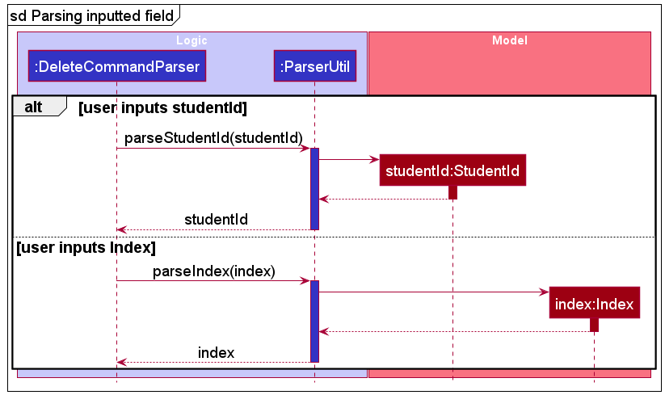

### DeleteModule Command

#### Description

The `deleteModule` command allows users to delete all students of the inputted `ModuleCode` from TAPA.
During the execution of the `deleteModule` command, the user's input is being parsed in `AddressBookParser`.
After which, a new `DeleteModuleCommand` object will be created, and is subsequently executed by the `LogicManager`.

#### Implementation

1. Upon receiving the user input,
   the `LogicManager` starts to parse the given input text using `AddressBookParser#parseCommand()`.
2. The `AddressBookParser` invokes the respective `Parser` based on the first word of the input text.
3. Since the first word in the user input matches the word "deleteModule", `DeleteModuleCommandParser#parse(arguments)` will be called.
   In this case, the arguments refer to the remaining input text after the exclusion of the command word ("deleteModule").
4. In the `DeleteModuleCommandParser#parse(arguments)`, the arguments will be tokenized into an `ArgumentMultimap`,
   by using `ArgumentTokenizer#tokenize(String argsString, Prefix... prefixes)`.
   
    
:information_source: 
    <b>Note:</b> A `ParseException` will be thrown if the prefix of the compulsory field is missing.
    

5. The `DeleteModuleCommandParser` will pass the moduleCode input (found in the `ArgumentMultimap`)
   into `ParserUtil#parseModuleCode(String moduleCode)`.

   
:information_source: 
   <b>Note:</b> A `NullPointerException` will be thrown if the supplied string argument is `null`.
    
 

6. In `ParserUtil#parseModuleCode(String moduleCode)`, the supplied argument will be trimmed using `String#trim()`.
7. `ModuleCode#isValidModuleCode(String moduleCode)` will then be invoked,
   which checks if the trimmed argument is valid (according to the Regex supplied).
   If the argument is valid, a new `ModuleCode` object will be created and returned to the `DeleteModuleCommandParser`.
   If the argument is not valid, a `ParseException` will be thrown.
8. The `DeleteModuleCommandParser` will create a new `ModuleCodeContainsKeywordsPredicate`.
9. A new `DeleteModuleCommand` will be created (using the `ModuleCodeContainsKeywordsPredicate` returned in Step 8) and returned to the `LogicManager`.
10. The `LogicManager` will then call `DeleteModuleCommand#execute(Model model)`.
11. The `model#updateFilteredPersonList(Predicate<Person> predicate)` will then be invoked, which
    updates the filter of the `PersonList` to filter by the given `ModuleIdContainsKeywordsPredicate`.
12. Each `Person` that appears in the filtered list will then be deleted by invoking `model#deletePerson(Person person)`.
13. Lastly, the `DeleteModuleCommand` will create a new `CommandResult`, which will be returned to `LogicManager`.

The following sequence diagram shows how the deleteModule operation works:

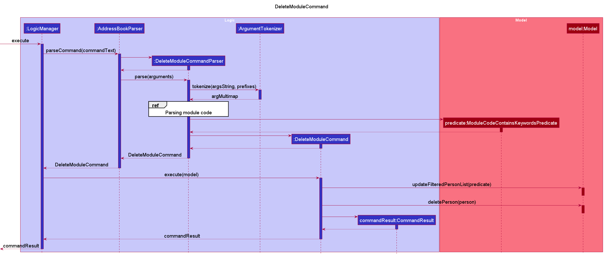

### Find Command

#### Description

The `find` command allows users to find a particular student into TAPA.
Since not all fields are compulsory during the execution of the `find` command,
the user's input is being parsed in `AddressBookParser`. After which, a new `FindCommand`
object will be created, and is subsequently executed by the `LogicManager`.

#### Implementation

1. Upon receiving the user input,
   the `LogicManager` starts to parse the given input text using `AddressBookParser#parseCommand()`.
2. The `AddressBookParser` invokes the respective `Parser` based on the first word of the input text.
3. Since the first word in the user input matches the word "find", `FindCommandParser#parse(arguments)` will be called.
   In this case, the arguments refer to the remaining input text after the exclusion of the command word ("find").
4. In the `FindCommandParser#parse(arguments)`, the arguments will be tokenized into an `ArgumentMultimap`,
   by using `ArgumentTokenizer#tokenize(String argsString, Prefix... prefixes)`.

    
:information_source: 
    <b>Note:</b> A `ParseException` will be thrown if the prefix of the compulsory fields are missing.
    
 

5. The `FindCommandParser` will pass the studentId input (found in the `ArgumentMultimap`)
   into `ParserUtil#parseStudentId(String studentId)`.

   
:information_source: 
   <b>Note:</b> A `NullPointerException` will be thrown if the supplied string argument is `null`.
    
 

6. In `ParserUtil#parseStudentId(String studentId)`, the supplied argument will be trimmed using `String#trim()`.
7. `StudentId#isValidId(String studentId)` will then be invoked,
   which checks if the trimmed argument is valid (according to the Regex supplied).
   If the argument is valid, a new `StudentId` object will be created and returned to the `FindCommandParser`.
   If the argument is not valid, a `ParseException` will be thrown.

   
:information_source: 
   <b>Note:</b> The above description for Steps 5 to 7 is specifically for when `studentId` is used as the input field.
   Depending on the type of input field used (`studentId`, `name`, `moduleCode`), Steps 5 to 7 will 
   be executed using the parse methods in `ParserUtil` that are specific to the field.
    
 

   | Field          | Parse Methods                              |
      |----------------|--------------------------------------------|
   | Index          | parseIndex(String oneBasedIndex)           |
   | StudentId      | parseStudentId(String studentId)           |
   | Name           | parseName(String name)                     |
   | ModuleCode     | parseModuleCode(String moduleCode)         |
   | Phone          | parsePhone(String phone)                   |
   | TelegramHandle | parseTelegramHandle(String telegramHandle) |
   | Email          | parseEmail(String email)                   |
   | Task           | parseTask(String task)                     |

8. The `FindCommandParser` will create a new `Predicate`.
9. A new `FindCommand` will be created (using the `Predicate` in Step 8) and returned to the `LogicManager`.
10. The `LogicManager` will then call `FindCommand#execute(Model model)`.
11. In the `FindCommand`, the `model#updateFilteredPersonList(Predicate<Person> predicate)` will be invoked, which
    updates the filter of the `PersonList` to filter by the given `Predicate`.
12. Lastly, the `FindCommand` will create a new `CommandResult`, which will be returned to `LogicManager`.

The following sequence diagram shows how the find operation works:

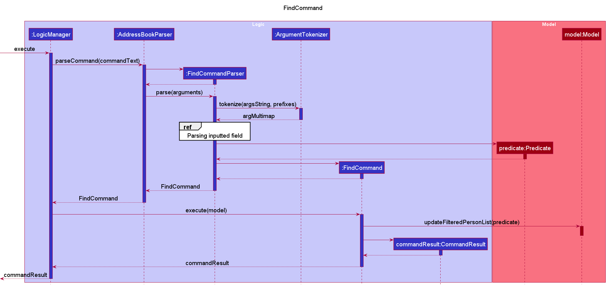

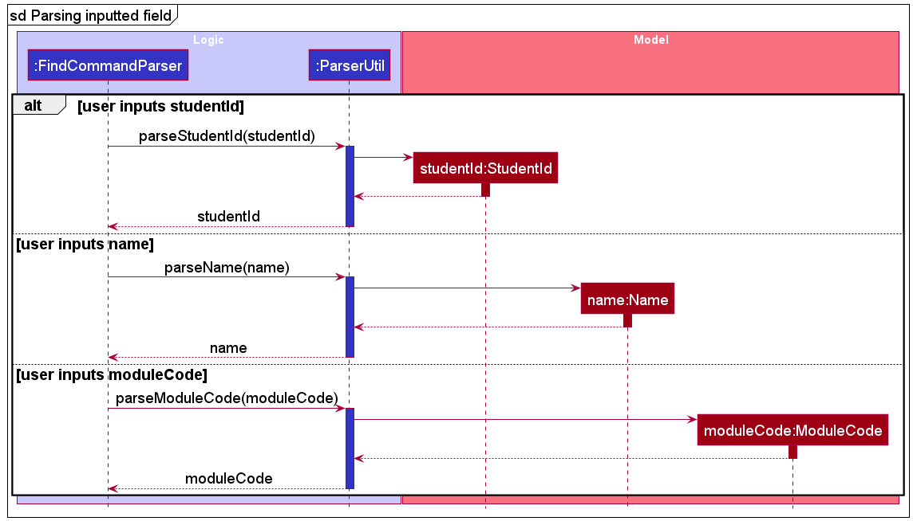

### Task Command

#### Description

The `task` command allows users to check and view all the tasks belonging to a particular student.
During the execution of the `task` command, the user's input is being parsed in `AddressBookParser`.
After which, a new `TaskCommand` object will be created, and is subsequently executed by the LogicManager.

#### Implementation

1. Upon receiving the user input,
   the `LogicManager` starts to parse the given input text using `AdddressBookParser#parseCommand()`.
2. The `AddressBookParser` invokes the respective `Parser` based on the first word of the input text.
3. Since the first word in the user input matches the word "task", `TaskCommandParser#parse(arguments)` will be called.
   In this case, the arguments refer to the remaining input text after the exclusion of the command word ("task").
4. In the `TaskCommandParser#parse(arguments)`, the arguments will be tokenized into an `ArgumentMultimap`,
   by using `ArgumentTokenizer#tokenize(String argsString, Prefix... prefixes)`.

   
:information_source: 
   <b>Note:</b> A `ParseException` will be thrown if the prefix of `StudentId` is missing, as it is a compulsory field.
   

5. The `TaskCommandParser` will pass the studentId input (found in the `ArgumentMultimap`)
   into `ParserUtil#parseStudentId(String studentId)`.

   
:information_source: 
   <b>Note:</b> A `NullPointerException` will be thrown if the supplied string argument is `null`.
   

6. In `ParserUtil#parseStudentId(String studentId)`, the supplied argument will be trimmed using `String#trim()`.
7. `StudentId#isValidId(String studentId)` will then be invoked,
   which checks if the trimmed argument is valid (according to the Regex supplied).
   If the argument is valid, a new StudentId object will be created and returned to the `TaskCommandParser`.
   If the argument is not valid, a `ParseException` will be thrown.
8. A new `TaskCommand` will be created (using the `StudentId` object created in Step 7) and returned to the `LogicManager`.
9. The `LogicManager` will then call `TaskCommand#execute(Model model)`.
10. In the `TaskCommand`, a `StudentIdContainsKeywordsPredicate` is created using the studentId.
11. The `model#updateFilteredPersonList(predicate)` is then invoked such that the list is filtered by the predicate created.
12. The `model#getFilteredPersonList()` is then called.
    The size of the resulting list determines if there is any `Person` that corresponds to the specified `studentId`.
    If the size is equals to 0, a `CommandException` will be thrown.

    
:information_source: 
    <b>Note:</b> The `studentId` is a UNIQUE field in TAPA, so multiple students cannot have the same `studentId`.
    

13. The `Person` object in the filtered list is then extracted out using `model#getFilteredPersonList().get(0)`.
14. The `TaskList` belong to this `Person` can then be retrieved using `Person#getTaskList()`.
15. If this `TaskList` is null or empty, a `CommandException` will be thrown.
16. The `TaskCommand` iterates through this `TaskList`, and categorises the tasks into two new `TaskList`
    according to the task's completion status.
17. Lastly, the `TaskCommand` will create a new `CommandResult` by using the `TaskList` in Step 16.
    This `CommandResult` will then be returned to `LogicManager`.

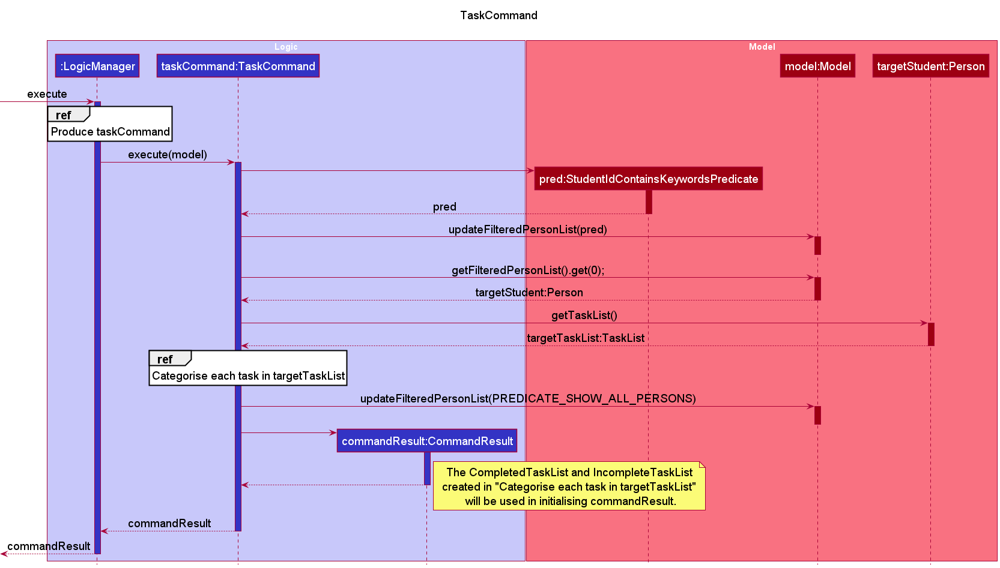

### Mark Command

#### Description

The `mark` command marks a specific undone task as done for a particular student. During the execution of the `mark` command, the user's input is being parsed in `AddressBookParser`. After which, a new `MarkCommand` object will be created, and is subsequently executed by the `LogicManager`.

#### Implementation
1. Upon receiving the user input, the `LogicManager` starts to parse the given input text using `AddressBookParser#parseCommand()`.
2. The `AddressBookParser` invokes the respective `Parser` based on the first word of the input text.
3. Since the first word in the user input matches the word "mark", `MarkCommandParser#parse(arguments)` will be called. In this case, the arguments refer to the remaining input text after the exclusion of the command word "mark".
4. In the `AddressBookParser#parseCommand(arguments)`, the arguments will be tokenized into an `ArgumentMultiMap`, by `using ArgumentTokenizer#tokenize(String argsString, Prefix... prefixes)`.
    
    
:information_source:
    <b>Note:</b> A `ParseException` will be thrown if the prefix of the compulsory fields are missing or if the arguments are invalid.
    

5. The `MarkCommandParser` will pass the studentId input (found in the `ArgumentMultiMap`) into `ParserUtil#parseStudentId(String studentId)`.
    
    
:information_source:
    <b>Note:</b> A `NullPointerException` will be thrown if the supplied string argument is `null`.
    

6. In `ParserUtil#parseStudentId(String studentId)`, the supplied argument will be trimmed using `String#trim()`.
7. `StudentId#isValidId(String studentId)` will then be invoked, which checks if the trimmed argument is valid (according to the Regex supplied). If the argument is valid, a new `StudentId` object will be created and returned to the `MarkCommandParser`. If the argument is not valid, a `ParseException` will be thrown.
8. The `MarkCommandParser` will pass the index input (found in the `ArgumentMultiMap`) into `ParserUtil#parseIndex(Index index)`.
    
    
:information_source:
    <b>Note:</b> A `NullPointerException` will be thrown if the supplied string argument is null.
    

9. In `ParserUtil#parseStudentId(Index index)`, the supplied argument will be trimmed using `String#trim()`.
10. `Index#isValidId(Index index)` will then be invoked, which checks if the trimmed argument is valid (according to the Regex supplied). If the argument is valid, a new `Index` object will be created and returned to the `MarkCommandParser`. If the argument is not valid, a `ParseException` will be thrown.
11. The `MarkCommandParser` will create a new `MarkCommand` object using the `StudentId` and `Index` created in Step 7 and 10 respectively.
12. The `LogicManager` will then call `MarkCommand#execute(Model model)`.
13. The `MarkCommand` will call `model#markTaskOfPerson(Student studentId, Index index)`, which marks the task (corresponding to the supplied index) of the given student as done.
    
    
:information_source:
    <b>Note:</b> A `CommandException` will be thrown if the supplied `index` or `studentId` is invalid, or if the task is already marked as completed.
    

    
14. Lastly, the `MarkCommand` will create a new `CommandResult`, which will be returned to `LogicManager`.

The following sequence diagrams shows how the mark command works:

### Unmark Command

#### Description

The `unmark` command marks a specific done task as undone for a particular student. During the execution of the `unmark` command, the user's input is being parsed in `AddressBookParser`. After which, a new `UnmarkCommand` object will be created, and is subsequently executed by the `LogicManager`.

#### Implementation
1. Upon receiving the user input, the `LogicManager` starts to parse the given input text using `AddressBookParser#parseCommand()`.
2. The `AddressBookParser` invokes the respective `Parser` based on the first word of the input text.
3. Since the first word in the user input matches the word "unmark", `UnmarkCommandParser#parse(arguments)` will be called. In this case, the arguments refer to the remaining input text after the exclusion of the command word "unmark".
4. In the `AddressBookParser#parseCommand(arguments)`, the arguments will be tokenized into an `ArgumentMultiMap`, by `using ArgumentTokenizer#tokenize(String argsString, Prefix... prefixes)`.
    
    
:information_source:
    <b>Note:</b> A `ParseException` will be thrown if the prefix of the compulsory fields are missing or if the arguments are invalid.
    

5. The `UnmarkCommandParser` will pass the studentId input (found in the `ArgumentMultiMap`) into `ParserUtil#parseStudentId(String studentId)`.
    
    
:information_source:
    <b>Note:</b> A `NullPointerException` will be thrown if the supplied string argument is `null`.
    

6. In `ParserUtil#parseStudentId(String studentId)`, the supplied argument will be trimmed using `String#trim()`.
7. `StudentId#isValidId(String studentId)` will then be invoked, which checks if the trimmed argument is valid (according to the Regex supplied). If the argument is valid, a new `StudentId` object will be created and returned to the `UnmarkCommandParser`. If the argument is not valid, a `ParseException` will be thrown.
8. The `UnmarkCommandParser` will pass the index input (found in the `ArgumentMultiMap`) into `ParserUtil#parseIndex(Index index)`.
    
    
:information_source:
    <b>Note:</b> A `NullPointerException` will be thrown if the supplied string argument is `null`.
    

9. In `ParserUtil#parseStudentId(Index index)`, the supplied argument will be trimmed using `String#trim()`.
10. `Index#isValidId(Index index)` will then be invoked, which checks if the trimmed argument is valid (according to the Regex supplied). If the argument is valid, a new `Index` object will be created and returned to the `UnmarkCommandParser`. If the argument is not valid, a `ParseException` will be thrown.
11. The `UnmarkCommandParser` will create a new `UnmarkCommand` object using the `StudentId` and `Index` created in Step 7 and 10 respectively.
12. The `LogicManager` will then call `UnmarkCommand#execute(Model model)`.
13. The `UnmarkCommand` will call `model#unmarkTaskOfPerson(Student studentId, Index index)`, which marks the task (corresponding to the supplied index) of the given student as undone.
    
    
:information_source:
    <b>Note:</b> A `CommandException` will be thrown if the supplied `index` or `studentId` is invalid, or if the task is already marked as not complete.
    

14. Lastly, the `UnmarkCommand` will create a new `CommandResult`, which will be returned to `LogicManager`.

The following sequence diagrams shows how the unmark command works:

### Clear Command

#### Description

The `clear` command deletes all students currently stored in TAPA. Before all the students are deleted, the user will have to confirm their decision by inputting "confirm".

#### Implementation
1. When the user inputs "clear", the `LogicManager` parses the given input text using `AddressBookParser#parseCommand()`.
2. A new `ClearCommand` is created by `AddressBookParser` and returned to the `LogicManager`.
3. The `LogicManager` calls `ClearCommand#execute(Model model)`, which returns a new `CommandResult` object (with its `isClearRequest` field set to `true`) to the `LogicManager`.
4. The `CommandResult` (with its `isClearRequest` field set to `true`) is then returned to the `MainWindow`.
5. To confirm the user's decision to clear TAPA, the `MainWindow` executes `MainWindow#handleClearRequest()` which updates the `CommandBox` to only recognise a "confirm" input for the next command.

   
   
   
:information_source:
   <b>Note:</b> A `CommandException` will be thrown if the user inputs anything other than "confirm" for the next input. The `CommandBox` will then return to its normal operation, accepting all commands as described in the user guide.
   

   
   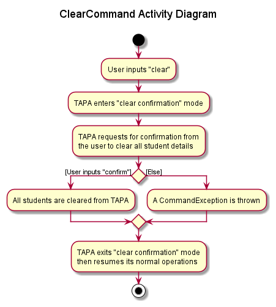

6. If the user inputs "confirm", the `LogicManager` parses the given input text using `AddressBookParser#parseCommand()`, then a new `ConfirmClearCommand` is created and returned to the `LogicManager`.
7. The `LogicManager` will then call `ConfirmClearCommand#execute(Model model)`.
8. The `ConfirmClearCommand` calls `Model#setAddressBook(new AddressBook())` which resets the current list of students stored in TAPA to an empty list.
9. Lastly, the `ConfirmClearCommand` creates a new `CommandResult`, which is returned to the `LogicManager`.

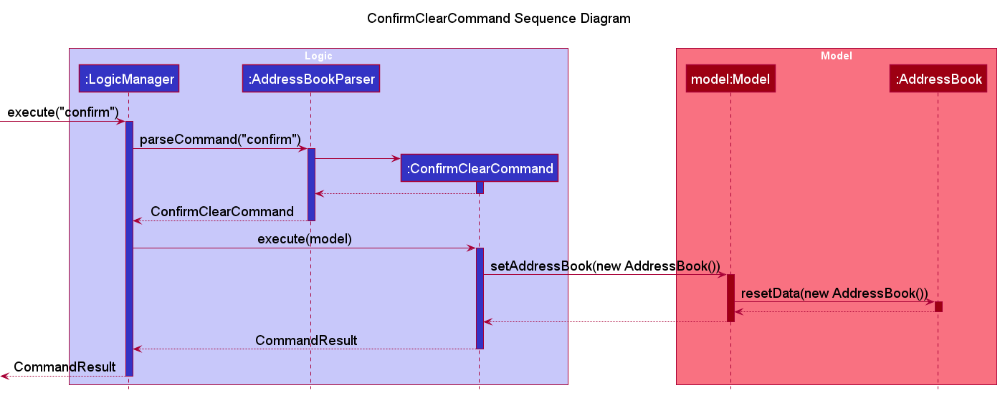

#### Design considerations

**Aspect: How TAPA confirms the user's decision to clear TAPA**

* **Alternative 1 (current choice):** Have the user input "confirm", which is treated by TAPA as a command being executed.
   * Pros: Easy to implement and test. Having the user type "confirm" is an added safety measure to ensure the user does not clear TAPA accidentally.
   * Cons: The user would take a longer time to clear TAPA than if a "confirm" button is implemented.

* **Alternative 2:** Have a pop-up window with a "confirm" button which the user can click to confirm or cancel their decision.
   * Pros: Faster to click a button than having to type "confirm" to clear TAPA.
   * Cons: More difficult to implement and test as it involves extending the UI.

### Archive Command

#### Description

The `archive` command allows users to save the current state of the data in TAPA,
into a separate `.json` file. This newly created file can be found in the same
folder as the original data file (in `/data`). In addition, it will have a file name
that corresponds to the date and time (up to 6 significant figures) in which the
command is being called. This ensures that files created will have a unique file name
in most cases.

#### Implementation

1. Upon receiving the user input,
   the `LogicManager` starts to parse the given input text using `AddressBookParser#parseCommand()`.
2. The `AddressBookParser` invokes the respective `Parser` based on the first word of the input text.
3. Since the first word in the user input matches the word "archive", `ArchiveCommand()` will be called.
4. As `ArchiveCommand` utilizes the default constructor, it simply returns a new `ArchiveCommand` object to
   the `AddressBookParser`.
5. This `ArchiveCommand` object will then be subsequently returned to the `LogicManager`.
6. The `LogicManager` calls `ArchiveCommand#execute(Model model)`.
7. In `ArchiveCommand`, the `Path` to the existing `AddressBook` is extracted, 
   by calling `model#getAddressBookFilePath()`.
8. Similarly, the existing `AddressBook` is also extracted, by calling `model#getAddressBook()`.
9. With the help of the `DateTimeFormatter` and `LocalDateTime` in the Java 8 Date Time API, 
   the file name and path of the new `.json` data file can be obtained.
10. The new `.json` data file can now be created, using `FileUtil.createIfMissing(newPath)`.
    A `CommandException` will be thrown if `ArchiveCommand` fails to create this file.
11. The current copy of the `AddressBook` can be "copied" into a new `JsonSerializableAddressBook`,
    which will be used to populate the new `.json` data file that was created 
    (by utilizing `JsonUtil#saveJsonFile(T JsonFile, Path path)`).
    A `CommandException` will be thrown if `ArchiveCommand` fails to populate the data file.
12. Lastly, the `ArchiveCommand` will create a new `CommandResult`, which will then be returned to `LogicManager`.

### Assign Command

#### Description

The `assign` command allows users to assign tasks to student.
During the execution of the `assign` command, the user's input is being parsed in `AddressBookParser`.
After which, a new `AssignCommand` object will be created, and is subsequently executed by the LogicManager.

#### Implementation

1. Upon receiving the user input,
   the `LogicManager` starts to parse the given input text using `AdddressBookParser#parseCommand()`.
2. The `AddressBookParser` invokes the respective `Parser` based on the first word of the input text.
3. Since the first word in the user input matches the word "assign", `AssignCommandParser#parse(arguments)` will be called.
   In this case, the arguments refer to the remaining input text after the exclusion of the command word ("assign").
4. In the `AssignCommandParser#parse(arguments)`, the arguments will be tokenized into an `ArgumentMultimap`,
   by using `ArgumentTokenizer#tokenize(String argsString, Prefex... prefixes)`.

   
:information_source:
    <b>Note:</b> A `ParseException` will be thrown if the prefix of `Task` is missing, or if either the prefix of `StudentId` or `ModuleCode` is missing, as they are compulsory fields.
   
 

5. The `AssignCommandParser` will pass the studentId input (found in the `ArgumentMultimap`)
   into `ParserUtil#parseStudentId(String studentId)`.

   
:information_source:
   <b>Note:</b> A `NullPointerException` will be thrown if the supplied string argument is `null`.
   
 

6. In `ParserUtil#parseStudentId(String studentId)`, the supplied argument will be trimmed using `String#trim()`.
7. `StudentId#isValidId(String studentId)` will then be invoked,
   which checks if the trimmed argument is valid (according to the Regex supplied).
   If the argument is valid, a new StudentId object will be created and returned to the `AssignCommandParser`.
   If the argument is not valid, a `ParseException` will be thrown.

   
:information_source: 
   <b>Note:</b> The above description for Steps 5 to 7 is specifically for when `studentId` is used as the input field.
   In the case of `moduleCode`, the `Module` prefix will be used to tokenize the input.
   Depending on the type of input field used (`studentId` or `moduleCode`), Steps 5 to 7 will be executed using the parse 
   methods in `ParserUtil` that are specific to the field. The argument's validity would be checked in their respective classes as well.
    

8. The `AssignCommandParser` will pass the task input (found in the `ArgumentMultimap`)
   into `ParserUtil#parseTask(String task)`.

   
:information_source:
   <b>Note:</b> A `NullPointerException` will be thrown if the supplied string argument is `null`.
   

9. In `ParserUtil#parseTask(String task)`, the supplied argument will be trimmed using `String#trim()`.
10. `Task#isValidTaskName(String task)` will then be invoked,
    which checks if the trimmed argument is valid (according to the Regex supplied).
    If the argument is valid, a new Task object will be created and returned to the `AssignCommandParser`.
    If the argument is not valid, a `ParseException` will be thrown.

11. A new `AssignCommand` will be created (using the `StudentId` or `ModuleCode` object and `Task` object created) and returned to the `LogicManager`.

12. The `LogicManager` will then call `AssignCommand#execute(Model model)`.

13. If `StudentId` is used, `AssignCommand#assignTaskToPerson(StudentId studentId, Task task)` method will be invoked,
    which will in turn invoke `model#assignTaskToPerson(StudentId studentId, Task task)` method and
    `AddressBook#assignTaskToPerson(StudentId studentId, Task task)` method. If `ModuleCode` is used,
    `AssignCommand#assignTaskToAllInModule(ModuleCode moduleCode, Task task)` method will be invoked, which will in
    turn invoke `model#assignTaskToAllInModule(ModuleCode moduleCode, Task task)` method and
    `AddressBook#assignTaskToAllInModule(ModuleCode moduleCode, Task task)` method.

14. If `StudentId` is used, `UniquePersonList#assignTaskToPerson(StudentId studentId, Task task)` method is called.
    If `ModuleCode` is used, `UniquePersonList#assignTaskToAllInModule(ModuleCode moduleCoded, Task task)` is called.
    This will iterate through each `Person` object and check for matching `studentId` or `moduleCode`.

      
:information_source:
      <b>Note:</b> 
      If no student(s) with a matching `studentId` or `moduleCode` is found, then `PersonNotFoundException` or `ModuleCodeNotFoundException` will be thrown.
      

15. If a `Student` object with matching `studentId` or `moduleCode` is found the method uses `Person#isTaskAlreadyPresent(Task task)`
    method to check if the `task` is assigned.
    If no similar `task` is found, the following step will take place.

      
:information_source:
      <b>Note:</b>
      If all the student(s) has already been assigned that task, then `DuplicateTaskException` will be thrown. 
      If some, not all students in the `moduleCode` has already been assigned that task, then `PartialDuplicateTaskException` will be thrown.
      

16. The method gets copy of the `Student` object by invoking `Person#getCopy()` method. The copy is updated to include `task` by invoking `Person#addTask(Task task)`.
17. `Person#addTask(Task task)` method will invoke `TaskList#addTask(Task task)`, which adds the task to a list of assigned tasks.
18. The `model#updateFilteredPersonList(PREDICATE_SHOW_ALL_PERSONS)` is then invoked such that the list is filtered by the predicate created. In this case all the students will be in the filtered list.
19. Lastly, the `AssignCommand` will create a new `CommandResult`, which will be returned to `LogicManager`.

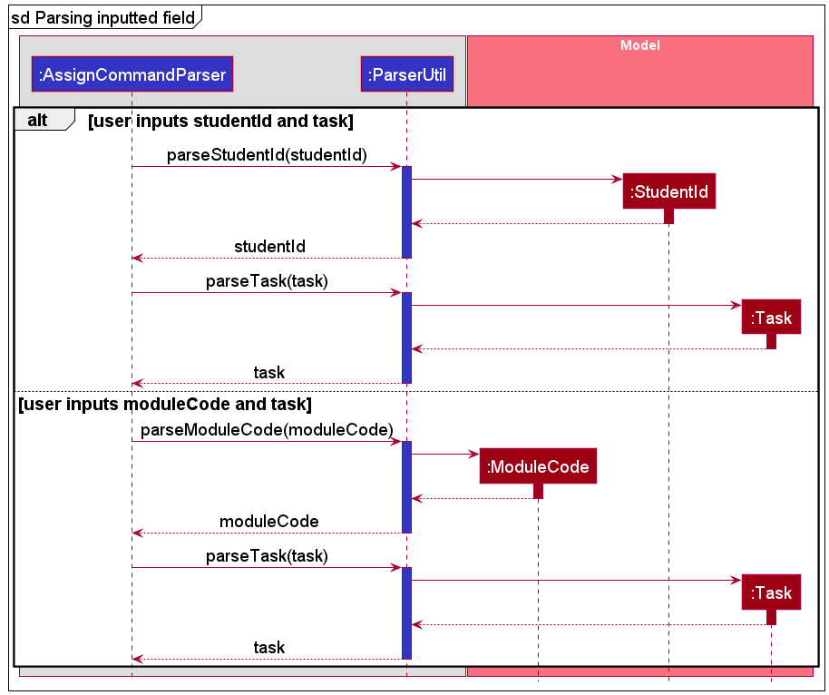

### Progress Command

#### Description

The `progress` command allows users to view the completion status of all students who are taking a particular
module and are assigned to a particular task.
During the execution of the `progress` command, the user's input is being parsed in `AddressBookParser`.
After which, a new `ProgressCommand` object will be created, and is subsequently executed by the `LogicManager`.

#### Implementation

1. Upon receiving the user input,
   the `LogicManager` starts to parse the given input text using `AddressBookParser#parseCommand()`.
2. The `AddressBookParser` invokes the respective `Parser` based on the first word of the input text.
3. Since the first word in the user input matches the word "progress", 
   `ProgressCommandParser#parse(arguments)` will be called.
   In this case, the arguments refer to the remaining input text after the exclusion of the command word ("progress").
4. In the `ProgressCommandParser#parse(arguments)`, the arguments will be tokenized into an `ArgumentMultimap`,
   by using `ArgumentTokenizer#tokenize(String argsString, Prefix... prefixes)`.

   
:information_source: 
      <b>Note:</b> A `ParseException` will be thrown if the prefix of the compulsory fields are missing.
   

5. The `ProgressCommandParser` will pass the moduleCode input (found in the `ArgumentMultimap`)
   into `ParserUtil#parseModuleCode(String moduleCode)`.

   
:information_source: 
     <b>Note:</b> A `NullPointerException` will be thrown if the supplied string argument is `null`.
   

6. In `ParserUtil#parseModuleCode(String moduleCode)`, the supplied argument will be trimmed using `String#trim()`.
7. `ModuleCode#isValidModuleCode(String moduleCode)` will then be invoked, which checks if the trimmed argument is
   valid (according to the Regex supplied).
   If the argument is valid, a new `ModuleCode` object will be created and returned to the `ProgressCommandParser`.
   If the argument is invalid, a `ParseException` will be thrown.
8. Steps 5 to 7 will be repeated for the "task name" field, by using its respective parse methods in `ParserUtil`.
9. A new `ProgressCommand` will be created (using the parsed `ModuleCode` and `Task` objects) 
   and returned to the `LogicManager`.
10. The `LogicManager` will then call `ProgressCommand#execute(Model model)`.
11. In the `ProgressCommand`, the `model#checkProgress(ModuleCode moduleCode, Task task)` will be invoked.
    This method iterates through each `Person` object. If the `Person` has the same `ModuleCode` and `Task`
    assigned to him/her, the `Person` object and the completion status 
    (either completed/incomplete, denoted by a boolean value) will be added to a `LinkedHashMap<Person, boolean>`.
12. If the resulting `LinkedHashMap` is null or empty, a `CommandException` will be thrown.
13. This `LinkedHashMap` will be used to generate the output string.
14. The output string will be used in creating a new `CommandResult` object.
15. Lastly, the `CommandResult` object will be returned to `LogicManager`.

### DeleteTask Command

#### Description

The `deleteTask` command allows users to delete to task that was previously assigned to students.
During the execution of the `deleteTask` command, the user's input is being parsed in `AddressBookParser`.
After which, a new `deleteTaskCommand` object will be created, and is subsequently executed by the LogicManager.

#### Implementation

1. Upon receiving the user input,
   the `LogicManager` starts to parse the given input text using `AddressBookParser#parseCommand()`.
2. The `AddressBookParser` invokes the respective `Parser` based on the first word of the input text.
3. Since the first word in the user input matches the word "deleteTask", `DeleteTaskCommandParser#parse(arguments)` will be called.
   In this case, the arguments refer to the remaining input text after the exclusion of the command word ("deleteTask").
4. In the `DeleteTaskCommandParser#parse(arguments)`, the arguments will be tokenized into an `ArgumentMultimap`,
   by using `ArgumentTokenizer#tokenize(String argsString, Prefix... prefixes)`.

   
:information_source: 
    <b>Note:</b> A `ParseException` will be thrown if the prefix of `StudentId`, `Index`, `ModuleCode`, and `TaskName` is missing.
    Either the pair (consisting of `StudentId` and `Index`) or the pair (consisting of `ModuleCode` and `TaskName`) must be provided.   
   

5. If either `Index` or `StudentId` is given, the `indexOrStudentIdGiven(ArgumentMultimap argMultimap)` method is invoked.

    
:information_source:
     <b>Note:</b> A `ParseException` will be thrown if the prefix of `StudentId`, or `Index` is missing.
     Both `StudentId` and `Index` must be provided.   
    

   i. The `indexOrStudentIdGiven` method will pass the `studentId` input (found in the `ArgumentMultimap`) into `ParserUtil#parseStudentId(String studentId)`.

   
:information_source: 
     <b>Note:</b> A `NullPointerException` will be thrown if the supplied string argument is `null`.
   

   ii. In `ParserUtil#parseStudentId(String studentId)`, the supplied argument will be trimmed using `String#trim()`.

   iii. `StudentId#isValidId(String studentId)` method will then be invoked,
   which checks if the trimmed argument is valid (according to the Regex supplied).
   If the argument is valid, a new `StudentId` object will be created and returned to the `DeleteTaskCommandParser`.
   If the argument is not valid, a `ParseException` will be thrown.

   iv. The `indexOrStudentIdGiven` method will pass the index input (found in the `ArgumentMultimap`) into
   `ParserUtil#parseIndex(String oneBasedIndex)`.

    
:information_source: 
      <b>Note:</b> A `NullPointerException` will be thrown if the supplied string argument is `null`.
    

   v.  In `ParserUtil#parseIndex(String oneBasedIndex)`, the supplied argument will be trimmed using `String#trim()`.

   vi. `Index#isValidId(String Index)` will then be invoked, which checks if the trimmed argument is valid (according to the Regex supplied).
   If the argument is valid, a new `Index` object will be created and returned to the `DeleteTaskCommandParser`.
   If the argument is not valid, a `ParseException` will be thrown.

   vii. A new `DeleteTaskCommand(StudentId studentId, Index index)` will be created (using the `StudentId` and `Index` object created in Step 3 and 6) and returned to the `LogicManager`.

6. If either `ModuleCode` or `TaskName` is given, the `moduleCodeOrTaskNameGiven(ArgumentMultimap argMultimap)` method is invoked.

    
:information_source: 
      <b>Note:</b> A `ParseException` will be thrown if the prefix of `ModuleCode`, or `TaskName` is missing.
    Both `ModuleCode` and `TaskName` must be provided.   
    

   i. The `moduleCodeOrTaskNameGiven` method will pass the moduleCode input (found in the `ArgumentMultimap`) into `ParserUtil#parseModuleCode(String moduleCode)`.

    
:information_source: 
      <b>Note:</b> A `NullPointerException` will be thrown if the supplied string argument is `null`.
    

   ii. In `ParserUtil#parseModuleCode(String moduleCode)`, the supplied argument will be trimmed using `String#trim()`.

   iii. `ModuleCode#isValidModuleCode(String moduleCode)` will then be invoked,
   which checks if the trimmed argument is valid (according to the Regex supplied).
   If the argument is valid, a new `ModuleCode` object will be created and returned to the `DeleteTaskCommandParser`.
   If the argument is not valid, a `ParseException` will be thrown.

   iv. The `moduleCodeOrTaskNameGiven` method will pass the taskName input (found in the `ArgumentMultimap`) into
   `ParserUtil#parseTask(String task)`.

    
:information_source: 
       <b>Note:</b> A `NullPointerException` will be thrown if the supplied string argument is `null`.
    

   v. In `ParserUtil#parseTask(String task)`, the supplied argument will be trimmed using `String#trim()`.

   vi. `Task#isValidTaskName(String test)` will then be invoked, which checks if the trimmed argument is valid (according to the Regex supplied).
   If the argument is valid, a new `Task` object will be created and returned to the `DeleteTaskCommandParser`.
   If the argument is not valid, a `ParseException` will be thrown.

   vii. A new `DeleteTaskCommand(ModuleCode moduleCode, Task task)` will be created (using the `ModuleCode` and `Task` object created in Step 3 and 6) and returned to the `LogicManager`.

7. The `LogicManager` will then call `DeleteTaskCommand#execute(Model model)`.
8. If the both the `studentId` and `index` is present then `model#deleteTaskOfPerson(StudentId studentId, Index index)` method is invoked.

   i. `AddressBook#deleteTaskOfPerson(StudentId studentId, Index index)`is invoked, which invokes `UniquePersonList#deleteTaskOfPerson(StudentId studentId, Index index)` method.

   ii. This method will iterate through each `Person` object in and check for matching `studentId`.
   If found, the method will get a copy of the `Person` object by invoking `Person#getCopy()`, deletes the task by invoking `Person#deleteTask(Index index)`.
   If the index is out of bounds, `InvalidTaskIndexException()` will be thrown by the `taskList#deleteTask(Index index)` method.
   If no student with matching studentId is found, `PersonNotFoundException()` will be thrown.

   iii. The updated `Person` will be replaced the current `Person` object.

   iv. If the task is successfully deleted, the `model#updateFilteredPersonList(Predicate<Person> predicate)` will then be invoked by `model#deleteTaskOfPerson(StudentId studentId, Index index)` method, which
   updates the filter of the `PersonList` to filter by the given `PREDICATE_SHOW_ALL_PERSONS`.

9. If the both the `moduleCode` and `task` is present then `model#deleteTaskForAllInModule(ModuleCode moduleCode, Task task)` method is invoked.

   i. `AddressBook#deleteTaskForAllInModule(ModuleCode moduleCode, Task task)`is invoked, which invokes `UniquePersonList#deleteTaskForAllInModule(ModuleCode moduleCode, Task task)` method.

   ii. This method will iterate through each `Person` object in and check for matching `moduleCode`.
   If found, the method will get a copy of the `Person` object by invoking `Person#getCopy()`, deletes the task by invoking `Person#deleteTask(Task task)`.
   If no task is found, `TaskNotFoundException()` will be thrown by the `taskList#deleteTask(Task task)` method.
   If no student with matching moduleCode is found, `ModuleCodeNotFoundException()` will be thrown.

   iii. The updated `Person` will be replaced the current `Person` object.

   iv. If the task is successfully deleted, the `model#updateFilteredPersonList(Predicate<Person> predicate)` will then be invoked by `model#deleteTaskForAllInModule(ModuleCode moduleCode, Task task)` method, which
   updates the filter of the `PersonList` to filter by the given `PREDICATE_SHOW_ALL_PERSONS`.

10. Lastly, the `DeleteTaskCommand` will create a new `CommandResult` which `CommandResult` will be returned to `LogicManager`.

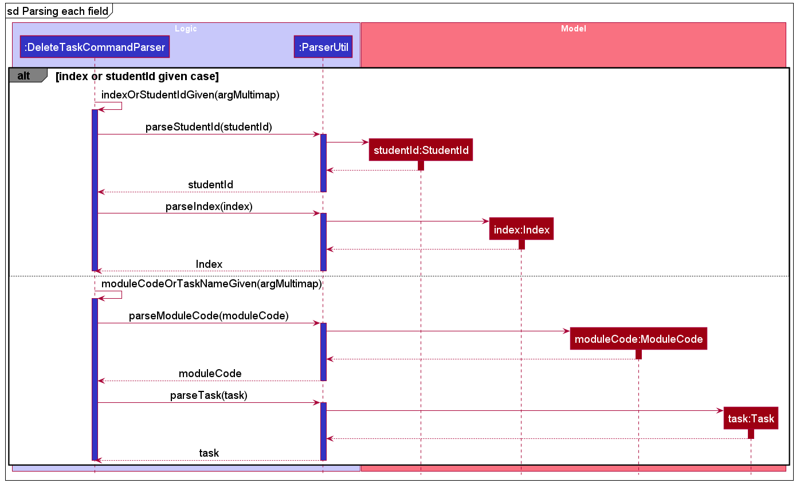

### History Command

#### Description

The `history` command displays a list of the user's previously executed commands. It is facilitated by `CommandHistory`, which stores the list of commands.

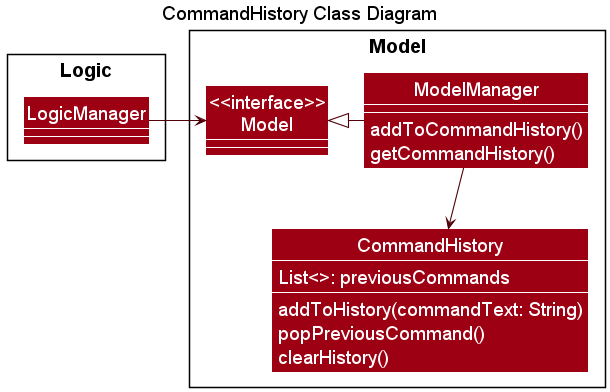

:information_source:
<b>Note:</b> The :arrow_up_small: Up and :arrow_down_small: Down keyboard arrow keys can also be used to browse through the user's previously executed commands. This functionality is also facilitated by `CommandHistory`.

#### Implementation

1. When the user launches the application, `ModelManager` is initialised with a new `CommandHistory` object.
2. Whenever the user successfully executes a command, the `LogicManager` calls `Model#addToCommandHistory()`. This adds the command to the list of previously executed commands in `CommandHistory`.

   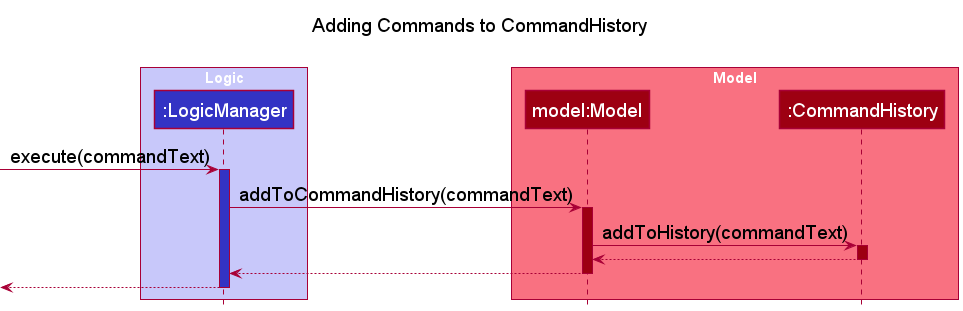

3. When the user inputs "history", the `LogicManager` parses the given input text using `AddressBookParser#parseCommand()`.
4. A new `HistoryCommand` is created by `AddressBookParser` and returned to the `LogicManager`. 
5. The `LogicManager` will then call `HistoryCommand#execute(Model model)`. 
6. Following this, the `HistoryCommand` calls `Model#getCommandHistory()` to retrieve the list of previously executed commands. 
7. The `HistoryCommand` then calls `CommandHistory#display()` to convert the list to a `String` which is returned to `LogicManager` through a new `CommandResult`.

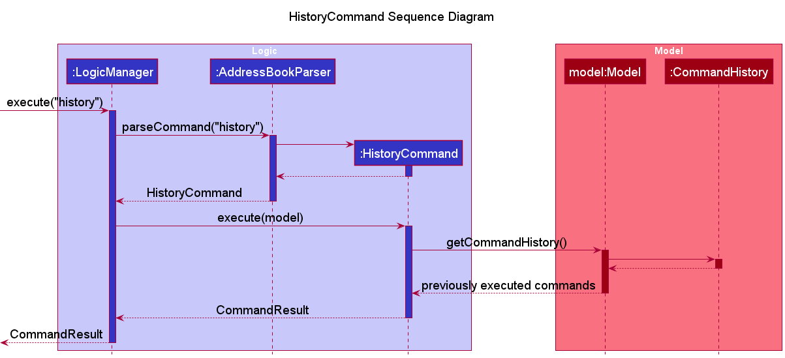

### Undo Command

#### Description

The `undo` command reverts the most recently executed command by restoring TAPA to its previous state before the last command was executed. It is facilitated by `AddressBookHistory` which saves all the details in TAPA as each command is executed during the current user session.

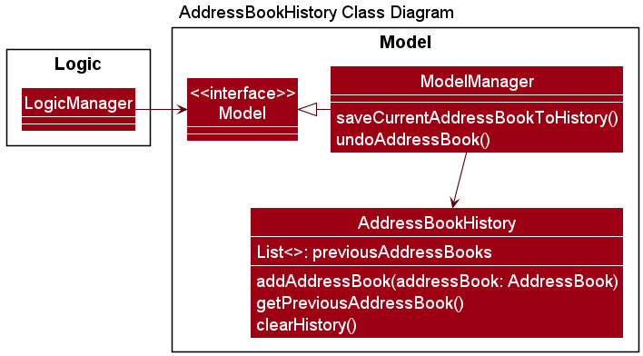

#### Implementation

1. When the user launches the application, `ModelManager` is initialised with a new `AddressBookHistory` object.
2. Whenever the user successfully executes a command (excluding `clear` and `undo` itself), the `LogicManager` calls `Model#saveCurrentAddressBookToHistory()`. This adds a copy of TAPA to the list of TAPA’s previous states in `AddressBookHistory`.

   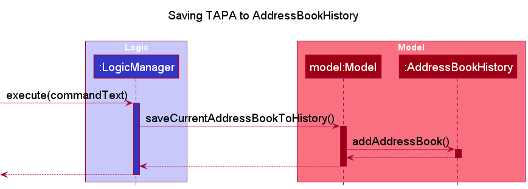

3. When the user inputs "undo", the `LogicManager` parses the given input text using `AddressBookParser#parseCommand()`.
4. A new `UndoCommand` is created by `AddressBookParser` and returned to the `LogicManager`.
5. The `LogicManager` will then call `UndoCommand#execute(Model model)`.
6. Following this, the `UndoCommand` calls `Model#undoAddressBook()` to revert the current details stored in TAPA to those stored before the previous command was executed. (Within `ModelManager`, `AddressBookHistory#getPreviousAddressBook` is called to retrieve the state of TAPA before the previous command.)
7. Lastly, the `UndoCommand` creates a new `CommandResult` which is returned to the `LogicManager`.

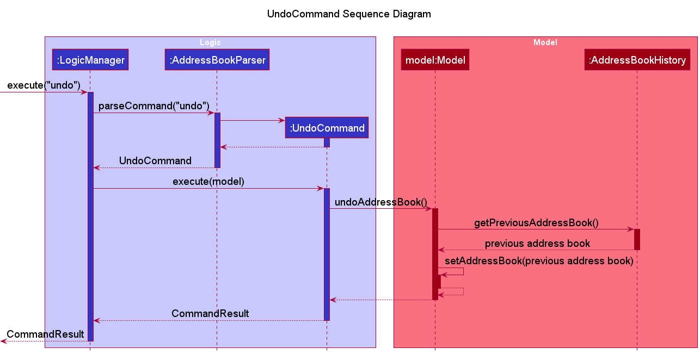

#### Design considerations

**Aspect: How the `UndoCommand` reverts the changes made by the previous command**

* **Alternative 1 (current choice):** Store the details of TAPA after each successfully executed command, then recover them when `undo` is executed.
   * Pros: Easy to implement and test.
   * Cons: Will take up more memory with each command executed.

* **Alternative 2:** Extend each command to be able to revert the changes it has made to TAPA.
   * Pros: Will not incur major performance issues as it uses less memory.
   * Cons: More difficult to implement and test. Each command would need a unique implementation to be undone and this would also need to be implemented for commands added in the future.

### Sort Command

#### Description

The `sort` command allows the users to view the list of students in TAPA, sorted by the number of incomplete tasks in **descending** order.
During the execution of the `sort` command, the user's input is being parsed in `AddressBookParser`.
After which, a new `SortCommand` object will be created, and is subsequently executed by the `LogicManager`.

#### Implementation

1. Upon receiving the user input,
   the `LogicManager` starts to parse the given input text using `AddressBookParser#parseCommand()`.
2. The `AddressBookParser` invokes the respective `Parser` based on the first word of the input text.
3. Since the first word in the user input matches the word "sort", `SortCommand()` will be called.
4. As `SortCommand` utilizes the default constructor, it simply returns a new `SortCommand` object to
   the `AddressBookParser`.
5. This `SortCommand` object will then be subsequently returned to the `LogicManager`.
6. The `LogicManager` calls `SortCommand#execute(Model model)`.
7. In `SortCommand`, the current list of students in TAPA will be sorted by the number of incomplete tasks in **descending** order by calling `model#sortFilteredPersonListByTaskLeft()`.
8. In `SortCommand`, the current list of students in TAPA will be updated to reflect the changes to the list, after the sort by calling `model#updateFilteredPersonList(PREDICATE_SHOW_ALL_PERSONS)`.
9. Lastly, the `SortCommand` will create a new `CommandResult`, which will then be returned to `LogicManager`.

### Manual Command

#### Description

The `manual` command displays the format and a short description for a particular command. During the execution of the `manual` command, the user's input is being parsed in `ManualCommandParser`. After which, a new `ManualCommand` object will be created, and is subsequently executed by the `LogicManager`.

#### Implementation
1. Upon receiving the user input, the `LogicManager` starts to parse the given input text using `AddressBookParser#parseCommand()`.
2. The `AddressBookParser` invokes the respective `Parser` based on the first word of the input text.
3. Since the first word in the user input matches the word "manual", `ManualCommandParser#parse(arguments)` will be called. In this case, the arguments refer to the remaining input text after the exclusion of the command word "manual".

    
:information_source:
    <b>Note:</b> A `ParseException` will be thrown if the argument is invalid.
    

4. The supplied argument will be trimmed using `String#trim()`.
5. The `ManualCommandParser` will create a new `ManualCommand` (using the `argument` in Step 4), which will be returned to `LogicManager`.
6. The `LogicManager` will call `ManualCommand#execute(Model model)`. If the `argument` is invalid, a `CommandException` will be thrown.
7. Lastly, the `ManualCommand` will create a new `CommandResult` which will be returned to `LogicManager`.

The following sequence diagram shows how the manual command works:

--------------------------------------------------------------------------------------------------------------------

## **Appendix: Requirements**

### Product scope

**Target user profile**  
Teaching Assistants who:
* Need to manage a significant number of students (especially across multiple modules)
* Prefer desktop apps over other platforms
* Can type fast
* Prefer typing to mouse interactions
* Are reasonably comfortable using CLI apps

**Value proposition**  
TAPA will allow TAs to better manage their student’s contact and progress,
especially for TAs who are teaching multiple classes/modules at the same time.
It is optimised for use on CLI, and allows for more efficient student detail management for TAs who can type fast.

### User stories

Priorities: High (must have) - `* * *`, Medium (nice to have) - `* *`, Low (unlikely to have) - `*`

| Priority | As a …​                                                | I want to …​                                                                        | So that I can…​                                                                                        |
| -------- | --------------------------------------------------------- | -------------------------------------------------------------------------------------- | ----------------------------------------------------------------------------------------------------------|
| `* * *`  | Teaching Assistant                                        | add students to TAPA                                                                   | know which students are taking my classes                                                                 |
| `* * *`  | Teaching Assistant                                        | delete a specific student from TAPA                                                    | remove student who has withdrawn from the module during the semester                                      |
| `* * *`  | Teaching Assistant                                        | list students alphabetically                                                           | print students in a list as their names would appear on the official class list                           |
| `* * *`  | Teaching Assistant                                        | tag students                                                                           | know what modules they are taking                                                                         |
| `* * *`  | Teaching Assistant                                        | filter students by their tags                                                          | view the progress of students in each separate tag (different class/module)                               |
| `* * *`  | Teaching Assistant                                        | define my own tasks for each module                                                    | customise the tasks to each module                                                                        |
| `* * *`  | Teaching Assistant                                        | undo the most recent command entered                                                   | revert any unwanted changes (such as deleting student) without much trouble                               |
| `* * *`  | Teaching Assistant                                        | delete a task given to a student                                                       | remove tasks that has incorrect information or has been assigned wrongly                                  |
| `* * *`  | Teaching Assistant                                        | list the students who have/have not completed a specific task                          | track the completion status of a specific task                                                            |
| `* * *`  | Teaching Assistant                                        | assign tasks to a specific student                                                     | allocate and track a task that is given to the student                                                    |
| `* * *`  | Teaching Assistant who is teaching in multiple semesters  | archive the existing data                                                              | save a copy on the local machine before undergoing a complete deletion of data                            |
| `* *`    | Teaching Assistant                                        | see all the tasks that a student currently has                                         | observe his/her progress                                                                                  |
| `* *`    | Teaching Assistant                                        | save existing data to hard drive                                                       | access the data again when I reopen the app                                                               |
| `* *`    | Teaching Assistant                                        | delete all students from TAPA                                                          | remove students that were taught in previous semesters and are no longer relevant                         |
| `* *`    | Teaching Assistant                                        | mark/unmark students’ tasks according to the completion status                         | update his/her progress                                                                                   |
| `* *`    | Teaching Assistant                                        | see students’ contact details (such as email address)                                  | contact them if needed                                                                                    |
| `* *`    | Teaching Assistant                                        | find a student                                                                         | check details of a specific student                                                                       |
| `* *`    | Teaching Assistant                                        | display the possible actions that  I can take, or do                                   | have a quick reference without the need of reading a user guide                                           |
| `* *`    | Teaching Assistant                                        | edit the details of the students                                                       | fix any errors that occurred during the insertion of student details                                      |
| `* *`    | Teaching Assistant                                        | delete multiple students from TAPA                                                     | remove students that are no longer being taught, without needing to delete them individually              |
| `* *`    | Teaching Assistant                                        | display student progress                                                               | see who is lagging behind                                                                                 |
| `* *`    | Teaching Assistant                                        | update the student’s tags                                                              | edit when the student drop/take a new module                                                              |
| `* *`    | Teaching Assistant                                        | sort students by their progress (based on the number of tasks completed)               | see how the class is performing                                                                           |
| `* *`    | Teaching Assistant                                        | edit details of a task given to a student                                              | update the details of an assignment in case of future changes/extensions                                  |
| `* *`    | Teaching Assistant                                        | assign tasks to multiple students                                                      | allocate tasks to students without having to individually assign them                                     |
| `* *`    | Teaching Assistant                                        | delete tasks assigned to multiple students                                             | remove any task that has incorrect information without having to individually delete it from each student |
| `*`      | Teaching Assistant                                        | track attendance                                                                       | mark attendance for modules that require student attendance                                               |
| `*`      | Teaching Assistant                                        | see modules I’m teaching at a glance                                                   | remind myself of what needs to be prepared for classes                                                    |
| `*`      | Teaching Assistant                                        | see student’s timetable                                                                | find a good time to arrange a consult with them                                                           |
| `*`      | Teaching Assistant who is a long time user                | type in chain commands                                                                 | execute multiple different commands quickly                                                               |
| `*`      | Teaching Assistant who is a long time user                | send emails from the command line                                                      | send emails to students with specific tags quickly                                                        |
| `*`      | Teaching Assistant who is used to CLI commands            | customise commands                                                                     | execute commands quickly                                                                                  |
| `*`      | Teaching Assistant                                        | view grades scored by students in each assignment                                      | understand which topics they are finding difficult                                                        |
| `*`      | Teaching Assistant                                        | be able to highlight or feature certain students                                       | know which students are performing the best or need more help                                             |

### Use cases

(For all use cases below, the **System** is the `TAPA` and the **Actor** is the `user`, unless specified otherwise)

#### Use case UC01 - Add a student

**MSS**

1. User requests to add a specific student.
2. TAPA shows the updated list of students.

    Use case ends.

**Extensions**

* 1a. A student with the same student ID already exists.

    * 1a1. TAPA shows an error message.

        Use case ends.

* 1b. The student ID of the student is not in the input command.

    * 1b1. TAPA shows an error message.

        Use case ends.

* 1c. The name of the student is not in the input command.

    * 1c1. TAPA shows an error message.

        Use case ends.

* 1d. The module code that the student is currently taking is not in the input command.

    * 1d1. TAPA shows an error message.

        Use case ends.

* 1e. The fields specified are in an invalid format.

   * 1e1. TAPA shows an error message.

       Use case ends.
   
#### Use case UC02 - Delete a student

**MSS**

1. User requests to list students.
2. TAPA shows a list of students.
3. User requests to delete a specific student in the list.
4. TAPA deletes the students.

   Use case ends.

**Extensions**

* 2a. The list is empty.

    Use case ends.

* 3a. The given index is invalid.

    * 3a1. TAPA shows an error message.

      Use case resumes from step 2.

* 3b. The given student ID is invalid.

    * 3b1. TAPA shows an error message.

      Use case resumes from step 2.

#### Use case: UC03 - Delete all students from a module

**MSS**

1. User requests to delete all students from a particular module.
2. TAPA deletes the students.

   Use case ends.

**Extensions**

* 1a. The given module code is invalid.

   * 1a1. TAPA shows an error message.

     Use case resumes from step 1.

* 1b. There are no students taking the module specified by the given module code.

   * 1b1. TAPA shows an error message.

     Use case resumes from step 1.

#### Use case: UC04 - Finding a student

**MSS**

1. User requests to find students that match the inputted search field.
2. TAPA displays the students who fit the request.

   Use case ends.

**Extensions**

* 1a. The given student ID is invalid.

   * 1a1. TAPA shows an error message.

     Use case resumes from step 1.

* 1b. The given module code is invalid.

   * 1b1. TAPA shows an error message.

     Use case resumes from step 1.

#### Use case: UC05 - Check all the tasks that a student has

**MSS**

1. User requests to check all the tasks that a student has.
2. TAPA shows a list of tasks that the student has.

   Use case ends.

**Extensions**

* 1a. The specified student ID is invalid (not in a correct format).

   * 1a1. TAPA shows an error message.

     Use case ends.

* 1b. There is no student with the specified student ID in TAPA.

   * 1b1. TAPA shows an error message.

     Use case ends.

* 2b. The student does not have any tasks assigned to him/her.

   * 2b1. TAPA shows an error message.

     Use case ends.

#### Use case: UC06 - Marking an undone task as complete

**MSS**

1. User requests to list students.
2. TAPA shows a list of students.
3. User requests to mark a student's task as done.
4. TAPA shows the updated list of students.

   Use case ends.

**Extensions**

* 2a. The list is empty.

  Use case ends.

* 3a. If student ID is given, and a student with the given student ID does not exist.

   * 3a1. TAPA shows an error message.

     Use case ends.

* 3b. If the index given is out of range, that is, it is a non-positive number, or greater than the number of tasks assigned to that person.

   * 3b1. TAPA shows an error message.

     Use case ends.

* 3c. The specified task with the given index has already been marked as complete.

   * 3c1. TAPA shows an error message.

     Use case ends.

#### Use case: UC07 - Marking a done task as incomplete

**MSS**

1. User requests to list students.
2. TAPA shows a list of students.
3. User requests to mark a student's task as undone.
4. TAPA shows the updated list of students.

   Use case ends.

**Extensions**

* 2a. The list is empty.

  Use case ends.

* 3a. If student ID is given, and a student with the given student ID does not exist.

   * 3a1. TAPA shows an error message.

     Use case ends.

* 3b. If the index is out of range, that is, it is a non-positive number, or greater than the number of tasks assigned to that person.

   * 3b1. TAPA shows an error message.

     Use case ends.

* 3c. The specified task with the given index has already been marked as incomplete.

   * 3c1. TAPA shows an error message.

     Use case ends.

#### Use case UC08 - Edit a student

**MSS**

1. User requests to list students.
2. TAPA shows a list of students.
3. User requests edits to the supplied details of a specific student in the list.
4. TAPA updates the details of the student with the supplied details.

   Use case ends.

**Extensions**

* 2a. The list is empty.

  Use case ends.

* 3a. The given index is invalid.

    * 3a1. TAPA shows an error message.

      Use case resumes from step 2.

* 3b. The given field is invalid.

    * 3b1. TAPA shows an error message.

      Use case resumes from step 2.

* 3c. The new student ID specified is already in the database.

    * 3c1. TAPA shows an error message.

      Use case resumes from step 2.

#### Use case: UC09 - Save a copy of the data in TAPA

**MSS**

1. User request to save a copy of the data that is currently being stored in TAPA.
2. TAPA creates a new data file in the same directory as the existing stored data.
3. TAPA copies the content of the existing stored data into the new data file.

**Extensions**

* 2a. There is already a data file that has the same file name as the new data file that is going to be created.

   * 2a1. TAPA does not create a new data file.

     Use case resumes from step 3.

* 2b. User does not have the permission to create a new file.

   * 2b1. TAPA shows an error message.

     Use case ends.

* 3. There is an unexpected error when copying from the existing data file to the new data file.

   * 3a1. TAPA shows an error message.

     Use case ends.

#### Use case: UC10 - List all students

**MSS**

1. User requests to list students.
2. TAPA shows a list of students in alphabetical order sorted by their name.

   Use case ends.

**Extensions**

* 2a. The list is empty.

  Use case ends.

#### Use case: UC11 - Assign a task to a student

**MSS**
1. User requests TAPA to assign a task to a student. (This can be done for an individual student or for all students taking the same module)
2. TAPA shows the updated list of students.

    Use case ends.

**Extensions**

* 1a. If studentId is given, and a student with the given studentId does not exist.

    * 1a1. TAPA shows an error message.

      Use case ends.

* 1b. If module code is given and no student is taking a module with the given module code.

    * 1b1. TAPA shows an error message.

      Use case ends.

* 1c. The student has already been assigned with a task that has the same name.

    * 1c1. TAPA shows an error message.

      Use case ends.

#### Use case: UC12 - View the completion status of a particular task

**MSS**

1. User request to view which students (in a particular module) have completed or have yet to complete a particular task.
2. TAPA shows a list of students who are taking this module and are currently assigned with the specified tasks (along with their respective completion status).

**Extensions**

* 1a. The specified task name is invalid (not in a correct format).

   * 1a1. TAPA shows an error message.

     Use case ends.

* 1b. The specified module code is invalid (not in a correct format).

   * 1b1. TAPA shows an error message.

     Use case ends.

* 2a. There are no students who are taking this module and are assigned with the specified task.

   * 2a1. TAPA shows an error message.

     Use case ends.

#### Use case: UC13 - Delete a task assigned to a student

**MSS**

1. User requests to list students.
2. TAPA shows a list of students.
3. User requests to delete a task that was assigned to a student. (This can be done for an individual student or for all the students taking the same module.)
4. TAPA updates the details of the student with the supplied details.

   Use case ends.

**Extensions**

* 2a. The list is empty.

  Use case ends.

* 3a. If studentId is given, and a student with the given studentId does not exist.

    * 3a1. TAPA shows an error message.

      Use case ends.

* 3b. If the value of the specified index is less than 1 or greater than the number of tasks assigned to that student.

   * 3b1. TAPA shows an error message.

     Use case ends.

* 3c. If module code is given and no student is taking a module with the given module code.

    * 3c1. TAPA shows an error message.

      Use case ends.

* 3d. The task name already is assigned to the present.

    * 3d1. TAPA shows an error message.

      Use case ends.

#### Use case: UC14 - Sorting list of students by their number of incomplete tasks in descending order

**MSS**

1. User requests to sort students.
2. TAPA shows a list of students in order, sorted by their number of incomplete tasks in descending order.

   Use case ends.

* 2a. The list is empty.

  Use case ends.

#### Use case: UC15 - Finding out what a certain command does

**MSS**

1. User requests TAPA to provide a description for a particular command, as well as how to use the command.
2. TAPA provides a short description of what the specified command does.
3. TAPA provides the format for how to use the command.
4. TAPA provides an example to show the user how to use the command.

   Use case ends.

**Extensions**

*  1a. The user does not input a specific command.

   * 1a1. TAPA provides the list of all available commands.

     Use case ends.
   
*  1b. The user inputs a command that is not valid (not in the existing list of commands)

   * 1b1. TAPA shows an error message.

     Use case ends.
   
### Non-Functional Requirements

1.  Should work on any _mainstream OS_ as long as it has Java `11` or above installed.
2.  Should be able to hold up to 1000 students without a noticeable sluggishness in performance for typical usage.
3.  Usage should be more efficient than a regular contact management application for a user who types fast in English text.
4.  Should be usable by a novice who has never used a contact management application before.
5.  The system should respond within 3 seconds.
6.  The student's data should only be stored locally.

### Glossary

* **Mainstream OS**: Windows, Linux, Unix, OS-X
* **Module**: A specific class that a student is taking
* **Tag**: A category that the student belong to (usually denotes the module that is currently being taken)
* **Person**: A student in TAPA
* **Student ID/Matriculation number**: Used interchangeably to refer to the unique identification number of a student

--------------------------------------------------------------------------------------------------------------------

## **Appendix: Instructions for manual testing**

Given below are instructions to test the app manually.

:information_source:<b> Note:</b> These instructions only provide a starting point for testers to work on;
testers are expected to do more *exploratory* testing.

### Launch and shutdown

1. Initial launch

   1. Download the jar file and copy into an empty folder.

   1. Double-click the jar file Expected: Shows the GUI with a set of sample contacts. The window size may not be optimum.

2. Saving window preferences

   1. Resize the window to an optimum size. Move the window to a different location. Close the window.

   1. Re-launch the app by double-clicking the jar file. 
       Expected: The most recent window size and location is retained.

3. Shutdown
   
   1. Shut down TAPA using the `exit` command.
   
       Expected: TAPA exits immediately.

### Adding a student

1. Adding a student to TAPA

   1. Prerequisites: Sample data is loaded in TAPA.

   2. Test case: `add i/A0000000R m/CS2100 n/Test` 
      Expected: No student is added as there is already another student in TAPA who has the same student ID. Error message will be displayed to the user.

   3. Test case: `add m/CS2100 n/Test`, `add i/AXXXXXXXR m/CS2100`, `add i/AXXXXXXXR n/Test` 
      Expected: No student is added due to missing compulsory fields. Error message will be displayed to the user.

   4. Test case: `add i/AXXXXXXXR m/CS2100 n/Test` 
      Expected: Student is added into TAPA, even if some/all optional fields are missing.

   5. Test case: `add i/A!@#$%^&R m/CS2100 n/Test` 
      Expected: No student is added due to invalid format for student ID. Error message will be displayed to the user.

   6. Other incorrect add commands to try: `add i/AXXXXXXXR m/CS2@00 n/Test`, `add i/AXXXXXXXR m/CS2100 n/T@st` 
      Expected: Similar to previous
      
### Assigning task(s) to students

1. Assigning task(s) to students by their student ID

   1. Prerequisites: 
      1. Sample data is loaded in TAPA. 
      2. The student associated with the student ID ("A0000000Z") has a task (Task A) assigned to him/her.

   2. Test case: `assign`, `assign i/A1111111Z`, `assign tn/Task A` 
      Expected: An error message will be displayed to the user, due to missing compulsory fields (student ID and task name).
      
   3. Test case: `assign i/A!@#$%^&R tn/Task A`, `assign i/A1111111Z tn/@@@@` 
      Expected: An error message will be displayed to the user, due to invalid format for student ID or task name.

   4. Test case: `assign i/AXXXXXXXR tn/Task A` 
      Expected: An error message will be displayed to the user, as there are no students associated with this student ID in TAPA.

   5. Test case: `assign i/A0000000Z tn/Task A` 
      Expected: An error message will be displayed to the user, as the task (Task A) has already been assigned to the student associated with the student ID ("A0000000Z").
      
   6. Test case: `assign i/A0000000Z tn/Task B` 
      Expected: The list of students in TAPA will be updated, with the task (Task B) being assigned to the student associated with the student ID ("A0000000Z").
      
2. Assigning task(s) to students by their module code
   
   1. Prerequisites: 
      1. Sample data is loaded in TAPA. 
      2. The students associated with the student ID ("A0000000Z") and ("A1111111Z") has a task (Task A) assigned to them. 
      3. The student associated with the student ID ("A5555555Z") has the same module code (CS2100) as the student associated with the student ID ("A0000000Z").

   2. Test case: `assign`, `assign m/CS2100`, `assign tn/Task A` 
      Expected: An error message will be displayed to the user, due to missing compulsory fields (module code and task name).

   3. Test case: `assign m/CS@@@@ tn/Task A`, `assign m/CS2100 tn/@@@@` 
      Expected: An error message will be displayed to the user, due to invalid format for module code or task name.

   4. Test case: `assign m/LAM1201 tn/Task A` 
      Expected: An error message will be displayed to the user, as there are no students associated with this module code in TAPA.

   5. Test case: `assign m/CS2101 tn/Task A` 
      Expected: An error message will be displayed to the user, all the students with the module code (CS2101) already has the specified task (Task A) assigned to them.

   6. Test case: `assign m/CS2100 tn/Task A` 
      Expected: The list of students in TAPA will be updated, with the task (Task A) being assigned to the student associated with the student ID ("A5555555Z"). A message will be displayed to the user, informing that the task is only assigned to **some** of the students in the module (CS2100).

   7. Test case: `assign m/CS2100 tn/Task B` 
      Expected: The list of students in TAPA will be updated, with the task (Task B) being assigned to the students associated with the module code (CS2100).

### Marking an incomplete task as complete

1. Marking an incomplete task as complete

   1. Prerequisites: 
      1. Sample data is loaded in TAPA. 
      2. The student associated with the student ID ("A0000000Z") has an incomplete task assigned to him/her, and the task is the first and only one on his/her task list. 
      3. The student associated with the student ID ("A1111111Z") has a complete task assigned to him/her, and the task is the first and only one on his/her task list.

   2. Test case: `mark`, `mark i/A0000000Z`, `mark idx/1` 
      Expected: An error message will be displayed to the user, due to missing compulsory fields (student ID and task index).

   3. Test case: `mark i/A!@#$%^&R idx/1`, `mark i/A0000000Z idx/0`, `mark i/A0000000Z idx/-1` 
      Expected: An error message will be displayed to the user, due to invalid format for student ID or task index.

   4. Test case: `mark i/A0000000Z idx/3` 
      Expected: An error message will be displayed to the user, due to the task index being out of range.

   5. Test case: `mark i/A1111111Z idx/1` 
      Expected: An error message will be displayed to the user, due to the task being already marked as complete.

   5. Test case: `mark i/A0000000Z idx/1` 
      Expected:  The list of students in TAPA will be updated, with the first task belonging to the student associated with the student ID ("A0000000Z") marked as complete.

### Marking a complete task as incomplete

1. Marking a complete task as incomplete

   1. Prerequisites: 
      1. Sample data is loaded in TAPA. 
      2. The student associated with the student ID ("A0000000Z") has an incomplete task assigned to him/her, and the task is the first and only one on his/her task list. 
      3. The student associated with the student ID ("A1111111Z") has a complete task assigned to him/her, and the task is the first and only one on his/her task list.

   2. Test case: `ununmark`, `unmark i/A0000000Z`, `unmark idx/1` 
      Expected: An error message will be displayed to the user, due to missing compulsory fields (student ID and task index).

   3. Test case: `unmark i/A!@#$%^&R idx/1`, `unmark i/A0000000Z idx/0`, `unmark i/A0000000Z idx/-1` 
      Expected: An error message will be displayed to the user, due to invalid format for student ID or task index.

   4. Test case: `unmark i/A0000000Z idx/3` 
      Expected: An error message will be displayed to the user, due to the task index being out of range.

   5. Test case: `unmark i/A0000000Z idx/1` 
      Expected: An error message will be displayed to the user, due to the task being already marked as incomplete.

   5. Test case: `unmark i/A1111111Z idx/1` 
      Expected:  The list of students in TAPA will be updated, with the first task belonging to the student associated with the student ID ("A1111111Z") marked as incomplete.

### Checking all the tasks that a student has

1. Checking all the tasks that a student has

   1. Prerequisites: 
      1. Sample data is loaded in TAPA. 
      2. The student associated with the student ID ("A0000000Z") has a task assigned to him/her. 
   
   2. Test case: `task` 
      Expected: An error message will be displayed to the user, due to missing compulsory field (student ID).
   
   3. Test case: `task i/A!@#$%^&R` 
      Expected: An error message will be displayed to the user, due to invalid format for student ID.
   
   4. Test case: `task i/AXXXXXXXR` 
      Expected: An error message will be displayed to the user, as there are no students associated with this student ID in TAPA.
   
   5. Test case: `task i/A1111111Z` 
      Expected: An error message will be displayed to the user, as there are no tasks assigned to this student.

   6. Test case: `task i/A0000000Z` 
      Expected: An output list will be displayed to the user, which consists of all the tasks ("Task A") that are assigned to the student.

### Viewing the completion status of a particular task

1. Viewing the completion status of a particular task

   1. Prerequisites: 
      1. Sample data is loaded in TAPA. 
      2. All students taking the module ("CS2100") are being assigned with a task ("Task A").

   2. Test case: `progress`, `progress m/CS2100`, `progress tn/Task A` 
      Expected: An error message will be displayed to the user, due to missing compulsory fields (module code and task name).

   3. Test case: `progress m/CS@@@@ tn/Task A`, `progress m/CS2100 tn/T@sk @` 
      Expected: An error message will be displayed to the user, due to invalid format for module code/task name.

   4. Test case: `progress m/CS2100 tn/Task B` 
      Expected: An error message will be displayed to the user, as no students who are taking "CS2100" are assigned with "Task B".

   5. Test case: `progress m/CS2100 tn/Task A` 
      Expected: An output list will be displayed to the user, which consists of all students (and their respective completion status) who are taking "CS2100" and are assigned with "Task A".

### Sorting the list of students in TAPA by the number of incomplete tasks in descending order

1. Sorting the list of students in TAPA by the number of incomplete tasks in **descending** order

   1. Prerequisites: Sample data is loaded in TAPA.
   
   2. Test case: `sort` 
      Expected: The list of students in TAPA will be updated, and the students will be in order by the number of incomplete tasks in **descending** order.
      
### Displaying a manual guide for TAPA

1. Display the format, example, and a short description for a specified command

   1. Prerequisites: No prerequisites required
   
   2. Test case: `manual @@@@`, `manual sleep` 
      Expected: An error message will be displayed to the user, due to the specified command not existing.
      
   3. Test case: `manual add` 
      Expected: The format, example, and a short description for the command `add` will be displayed.
      
2. Displays all possible commands

   1. Prerequisites: No prerequisites required

   2. Test case: `manual` 
      Expected: All possible commands are listed out.

### Archiving details

1. Saving a copy of the details currently saved in TAPA into a separate file

   1. Prerequisites: Sample data is loaded in TAPA.
   
   2. Test Case: `archive` 
      Expected: A new `.json` file is created in `/data`, with the same contents as the original `.json` data file.

2. Saving a copy of the details currently saved in TAPA into a separate file
   
   1. Prerequisites: 
      1. Sample data is loaded in TAPA. 
      2. Remove the data directory's (`/data`) read and write permissions. 
   
   2. Test case: `archive` 
      Expected: An error message will be displayed to the user, due to errors in creating/writing to a new `.json` file.

### Deleting students by index or student ID

1. Deleting a student(s) using their index while all students are being shown

   1. Prerequisites: List all students using the `list` command. Multiple students in the list.

   1. Test case: `delete 1` 
      Expected: First student is deleted from the list. Details of the deleted student shown in the status message.
      
   1. Test case: `delete 1 2` 
      Expected: First and second students are deleted from the list. Status message states that 2 students were deleted.

   1. Test case: `delete 0` 
      Expected: No student is deleted. Error details shown in the status message.
      
   1. Test case: `delete 0 1` 
      Expected: No student is deleted. Error details shown in the status message.
      
   1. Test case: `delete` 
      Expected: No student is deleted. Error details shown in the status message.
      
   1. Test case: `delete -1` 
      Expected: No student is deleted. Error details shown in the status message.
      
   1. Test case: `delete x`, where x > number of students in the list 
      Expected: No student is deleted. Error details shown in the status message.

1. Deleting a student using their student ID

      1. Prerequisites: 
          1. Sample data is loaded in TAPA. 
          2. One student has "A0000000Z" as their student ID. 
          3. No student has "A9999999X" as their student ID. 

   1. Test case: `delete i/A0000000Z` 
      Expected: The student with student ID "A0000000Z" deleted from the list. Details of the deleted student shown in the status message.
      
   1. Test case: `delete i/A9999999X` 
      Expected: No student is deleted. Error details shown in the status message.

   1. Test case: `delete i/@@@` 
      Expected: No student is deleted. Error details shown in the status message.
      
   1. Test case: `delete i/` 
      Expected: No student is deleted. Error details shown in the status message.
      
   1. Test case: `delete` 
      Expected: No student is deleted. Error details shown in the status message.
      
### Deleting students by module code

1. Deleting students by module code

   1. Prerequisites: 
         1. Sample data is loaded in TAPA. 
         2. One or more students have "CS2100" as their module code.
         3. No students have "CS9999" as their module code.

   1. Test case: `deleteModule m/CS2100` 
      Expected: The students with module code "CS2100" are deleted from the list. Status message states number of students deleted.
      
   1. Test case: `deleteModule m/CS9999` 
      Expected: No student is deleted. Error details shown in the status message.

   1. Test case: `deleteModule m/@@@` 
      Expected: No student is deleted. Error details shown in the status message.
      
    1. Test case: `deleteModule m/` 
      Expected: No student is deleted. Error details shown in the status message.
      
    1. Test case: `deleteModule` 
      Expected: No student is deleted. Error details shown in the status message.
      
    1. Test case: `deleteModule m/CS CS` 
      Expected: No student is deleted. Error details shown in the status message.
      
### Finding students

1. Finding a student using their name

      1. Prerequisites: 
          1. Sample data is loaded in TAPA. 
          2. One or more students have "John" in their name.
          3. No students have "Dueet" in their name.

   1. Test case: `find n/John` 
      Expected: All students with "John" in their names (but not Johnathan, Johnny etc) are listed. Status message states how many students were listed.
      
   1. Test case: `find n/Dueet` 
      Expected: Student list displays no results. Status message states that 0 students were listed.
      
   1. Test case: `find n/John i/AAA` 
      Expected: Find command not executed. Error details shown in the status message.
      
   1. Test case: `find n/@@@` 
      Expected: Find command not executed. Error details shown in the status message.

   1. Test case: `find n/` 
      Expected: Find command not executed. Error details shown in the status message.
      
   1. Test case: `find` 
      Expected: Find command not executed. Error details shown in the status message.

1. Finding a student using their student ID

      1. Prerequisites: 
          1. Sample data is loaded in TAPA. 
          2. One student has "A0000000Z" as their student ID. 
          3. No student has "A9999999X" as their student ID. 

   1. Test case: `find i/A0000000Z` 
      Expected: The student with student ID "A0000000Z" is listed. Status message states that one student was listed.
      
   1. Test case: `find i/A9999999X` 
      Expected: No students listed. Status message states that 0 students were listed.
      
   1. Test case: `find i/A0000000Z n/John` 
      Expected: Find command not executed. Error details shown in the status message.

   1. Test case: `find i/@@@` 
      Expected: Find command not executed. Error details shown in the status message.
      
   1. Test case: `find i/` 
      Expected: Find command not executed. Error details shown in the status message.
      
   1. Test case: `find` 
      Expected: Find command not executed. Error details shown in the status message.
      
1. Finding a student using their module code

      1. Prerequisites: 
          1. Sample data is loaded in TAPA. 
          2. One or more students have "CS2100" as their module code. 
          3. No student has "CS9999" as their module code. 

   1. Test case: `find m/CS2100` 
      Expected: All students with "CS2100" as their module code are listed. Status message states how many students were listed.
      
   1. Test case: `find m/CS9999` 
      Expected: No students listed. Status message states that 0 students were listed.
      
   1. Test case: `find m/CS2100 i/A0000000Z` 
      Expected: Find command not executed. Error details shown in the status message.

   1. Test case: `find m/@@@` 
      Expected: Find command not executed. Error details shown in the status message.
      
   1. Test case: `find m/` 
      Expected: Find command not executed. Error details shown in the status message.
      
   1. Test case: `find` 
      Expected: Find command not executed. Error details shown in the status message.

### Saving data

1. Dealing with corrupted entries

   1. The `data` files can be found in the data folder of the repository, and will be named `addressbook`. 
   2. Modify the first entry in the data file, by deleting the word "Name" from it.
   3. Restart the application.
      Expected: TAPA will display an empty list.

2. Dealing with missing entries
   
   1. The `data` files can be found in the data folder of the repository, and will be named `addressbook`. 
   2. Remove all entries from the data file.
   3. Restart the application.
   Expected: TAPA will display an empty list.

3. Dealing with missing data file

    1. The `data` files can be found in the data folder of the repository, and will be named `addressbook`.
    2. Delete `addressbook.json`.
    3. Restart the application.
    Expected: A new data file will be created, and TAPA will populate it with sample data entries. This list of sample entries will be displayed to the user as well.

*{More to be added}*
