* Table of Contents 
{:toc}

--------------------------------------------------------------------------------------------------------------------

## **1. Introduction**
Tracey is a desktop app for University housing committee (Hall Masters) to manage their students and premises.
Tracey is optimized for those that work well with Command Line Interface (CLI). She is equipped with Graphical User Interface (GUI) for an effective user experience.

This is a Developer Guide written to help developers get a deeper understanding of how Tracey is implemented and the reasons this project is done a certain way.
It explains the internal structure and how components in the architecture work together to allow users to command Tracey.
Our team will like to welcome you by means of allowing you admire our work.

--------------------------------------------------------------------------------------------------------------------

## **2. Acknowledgements**

* {list here sources of all reused/adapted ideas, code, documentation, and third-party libraries -- include links to the original source as well}

--------------------------------------------------------------------------------------------------------------------

## **3. Setting up, getting started**

Refer to the guide [_Setting up and getting started_](SettingUp.md).

--------------------------------------------------------------------------------------------------------------------

## **4. Design**

Find out more on the structure and architecture of **Tracey** in this section.

:bulb: **Tip:** The `.puml` files used to create diagrams in this document can be found in the [diagrams](https://github.com/se-edu/addressbook-level3/tree/master/docs/diagrams/) folder. Refer to the [_PlantUML Tutorial_ at se-edu/guides](https://se-education.org/guides/tutorials/plantUml.html) to learn how to create and edit diagrams.

### 4.1. Architecture

The ***Architecture Diagram*** given above explains the high-level design of the App.

Given below is a quick overview of main components and how they interact with each other.

**Main components of the architecture**

**`Main`** has two classes called [`Main`](https://github.com/AY2122S2-CS2103T-T12-3/tp/blob/master/src/main/java/seedu/address/Main.java) and [`MainApp`](https://github.com/AY2122S2-CS2103T-T12-3/tp/blob/master/src/main/java/seedu/address/MainApp.java). It is responsible for,
* At app launch: Initializes the components in the correct sequence, and connects them up with each other.
* At shut down: Shuts down the components and invokes cleanup methods where necessary.

[**`Commons`**](#common-classes) represents a collection of classes used by multiple other components.

The rest of the App consists of four components.

* [**`UI`**](#ui-component): The UI of the App.
* [**`Logic`**](#logic-component): The command executor.
* [**`Model`**](#model-component): Holds the data of the App in memory.
* [**`Storage`**](#storage-component): Reads data from, and writes data to, the hard disk.

**How the architecture components interact with each other**

The *Sequence Diagram* below shows how the components interact with each other for the scenario where the user issues the command `delete 1`.

Each of the four main components (also shown in the diagram above),

* defines its *API* in an `interface` with the same name as the Component.
* implements its functionality using a concrete `{Component Name}Manager` class (which follows the corresponding API `interface` mentioned in the previous point.

For example, the `Logic` component defines its API in the `Logic.java` interface and implements its functionality using the `LogicManager.java` class which follows the `Logic` interface. Other components interact with a given component through its interface rather than the concrete class (reason: to prevent outside component's being coupled to the implementation of a component), as illustrated in the (partial) class diagram below.

The sections below give more details of each component.

### 4.2. UI component

The structure of the UI component will be explained here.

The **API** of this component is specified in [`Ui.java`](https://github.com/AY2122S2-CS2103T-T12-3/tp/blob/master/src/main/java/seedu/address/ui/Ui.java)

The UI consists of a `MainWindow` that is made up of parts e.g.`CommandBox`, `ResultDisplay`, `PersonListPanel`, `StatusBarFooter` etc. All these, including the `MainWindow`, inherit from the abstract `UiPart` class which captures the commonalities between classes that represent parts of the visible GUI.

The `UI` component uses the JavaFx UI framework. The layout of these UI parts are defined in matching `.fxml` files that are in the `src/main/resources/view` folder. For example, the layout of the [`MainWindow`](https://github.com/se-edu/addressbook-level3/tree/master/src/main/java/seedu/address/ui/MainWindow.java) is specified in [`MainWindow.fxml`](https://github.com/se-edu/addressbook-level3/tree/master/src/main/resources/view/MainWindow.fxml)

The `UI` component,

* executes user commands using the `Logic` component.
* listens for changes to `Model` data so that the UI can be updated with the modified data.
* keeps a reference to the `Logic` component, because the `UI` relies on the `Logic` to execute commands.
* depends on some classes in the `Model` component, as it displays `Person` object residing in the `Model`.

### 4.3. Logic component

The structure of the Logic component will be explained here.

**API** : [`Logic.java`](https://github.com/AY2122S2-CS2103T-T12-3/tp/blob/master/src/main/java/seedu/address/logic/Logic.java)

Here's a (partial) class diagram of the `Logic` component:

How the `Logic` component works:
1. When `Logic` is called upon to execute a command, it uses the `AddressBookParser` class to parse the user command.
2. This results in a `Command` object (more precisely, an object of one of its subclasses e.g., `AddCommand`) which is executed by the `LogicManager`.
3. The command can communicate with the `Model` when it is executed (e.g. to add a person).
4. The result of the command execution is encapsulated as a `CommandResult` object which is returned back from `Logic`.

The Sequence Diagram below illustrates the interactions within the `Logic` component for the `execute("delete 1")` API call.

:information_source: **Note:** The lifeline for `DeleteCommandParser` should end at the destroy marker (X) but due to a limitation of PlantUML, the lifeline reaches the end of diagram.

Here are the other classes in `Logic` (omitted from the class diagram above) that are used for parsing a user command:

How the parsing works:
* When called upon to parse a user command, the `AddressBookParser` class creates an `XYZCommandParser` (`XYZ` is a placeholder for the specific command name e.g., `AddCommandParser`) which uses the other classes shown above to parse the user command and create a `XYZCommand` object (e.g., `AddCommand`) which the `AddressBookParser` returns back as a `Command` object.
* All `XYZCommandParser` classes (e.g., `AddCommandParser`, `DeleteCommandParser`, ...) inherit from the `Parser` interface so that they can be treated similarly where possible e.g, during testing.

### 4.4. Model component

The structure of the Model component will be explained here.

**API** : [`Model.java`](https://github.com/AY2122S2-CS2103T-T12-3/tp/tree/master/src/main/java/seedu/address/model)

The `Model` component,

* stores the address book data i.e., all `Person` objects (which are contained in a `UniquePersonList` object).
* stores the currently 'selected' `Person` objects (e.g., results of a search query) as a separate _filtered_ list which is exposed to outsiders as an unmodifiable `ObservableList<Person>` that can be 'observed' e.g. the UI can be bound to this list so that the UI automatically updates when the data in the list change.
* stores a `UserPref` object that represents the user’s preferences. This is exposed to the outside as a `ReadOnlyUserPref` objects.
* does not depend on any of the other three components (as the `Model` represents data entities of the domain, they should make sense on their own without depending on other components)

:information_source: **Note:** An alternative (arguably, a more OOP) model is given below. It has a `Tag` list in the `AddressBook`, which `Person` references. This allows `AddressBook` to only require one `Tag` object per unique tag, instead of each `Person` needing their own `Tag` objects. 

### 4.5. Storage component

The structure of the Storage component will be explained here.

**API** : [`Storage.java`](https://github.com/AY2122S2-CS2103T-T12-3/tp/tree/master/src/main/java/seedu/address/storage)

The `Storage` component,
* can save both address book data and user preference data in json format, and read them back into corresponding objects.
* inherits from both `AddressBookStorage` and `UserPrefStorage`, which means it can be treated as either one (if only the functionality of only one is needed).
* depends on some classes in the `Model` component (because the `Storage` component's job is to save/retrieve objects that belong to the `Model`)

### 4.6. Common classes

Classes used by multiple components are in the `seedu.addressbook.commons` package.

--------------------------------------------------------------------------------------------------------------------

## **5. Implementation**

This section describes some noteworthy details on how certain features are implemented.

Currently, **Tracey** helps with 15 different types of commands:
1. `help user`
2. `add student`
3. `edit student data`
4. `delete student`
5. `undo command`
6. `redo command`
7. `find student`
8. `filter statuses`
9. `list all data`
10. `copy email addresses`
11. `summarise all data`
12. `archive data`
13. `resize display window`
14. `clear all data`
15. `exit application`

These 15 features enables of **Tracey** to manage the covid situation in the hall.
All 15 features extends from the `abstract` `Command` class.   

The table below summarises the 15 different tracking commands:

| Command                        | Command Word | Purpose                                                               |
|--------------------------------|--------------|-----------------------------------------------------------------------|
| `help user`                    | `help`       | Provide a how-to-use on this app.                                     |
| `add student`                  | `add`        | Adds a new student profile.                                           |
| `edit student data`            | `edit`       | Edits an existing student.                                            |
| `delete student`               | `delete`     | Delete an existing student.                                           |
| `undo command`                 | `undo`       | Undoes the previous command.                                          |
| `redo command`                 | `redo`       | Redoes the previous command that was undone.                          |
| `find student`                 | `find`       | Find an existing student.                                             |
| `filter statuses`              | `filter`     | Filter out a list of students by covid status.                        |
| `list all data`                | `list`       | List out all students in Tracey.                                      |
| `show email`                   | `email`      | Open email window to copy list of emails.                             |
| `summarise all data`           | `summarise`  | Make pie charts out of the data.                                      |
| `archive database`             | `archive`    | Saves a copy of the working database for archival purposes.           |
| `resize result display window` | `resize`     | Resize the result display window based on options with pre-set sizes. |
| `clear all data`               | `clear`      | Empty the database.                                                   |
| `exit application`             | `exit`       | Exits the application.                                                |

### 5.1. Help feature

The help mechanism implements the following sequence for the method call execute("help").

#### 5.1.1. What is the Help feature

The help feature opens up a separate window that contains a simple user guide for the user to adhere to. The window contains a list of commands that Tracey provides, their formats and examples.
When the Help Window is open, the user can also choose to view the comprehensive user guide on the user's default browser by clicking on the `Open User Guide` button.

The `help` command is as follows:

* `help`

The user can choose when to execute the `help` command.

The activity diagram shows the possible execution paths for the `help` command.

#### 5.1.2. Path Execution of Help Command

When a user opens Tracey, they may need some help regarding the commands. They may achieve this by using the `help` command. When the Help Window opens, the user may choose to view the comprehensive user guide by clicking on the `Open User Guide` button.

#### 5.1.3. Structure of Help Command

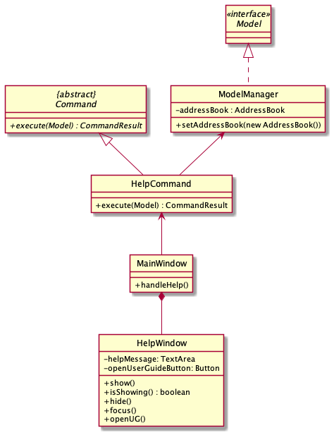

The class diagram above depicts the structure of `HelpCommand`. As per any Command class, HelpCommand needs to extend the abstract class Command.

#### 5.1.4. Interaction between objects when Help Command is executed

When a user inputs a `help` command into the Tracey, the `executeCommand()` method of `MainWindow` will be called and this will call the `execute()` method of `LogicManager`. This will trigger a parsing process by `AddressBookParser`,  which then instantiates an `HelpCommand` object.

Following this, the `LogicManager` will call the `execute()` method of the `HelpCommand` object. In this method, a `CommandResult` object will be instantiated.

Back in the `MainWindow`'s `executeCommand()` method, it will determine if the `CommandResult` is a `HelpCommand` by calling the `isShowHelp()` method. Following this, the `handleHelp()` method is called.

If the Help Window is showing, the `focus()` method of the HelpWindow is called. Else when the Help Window is not showing, the `show()` method of the HelpWindow is called. For both alternate paths, when the user clicks on the `Open User Guide` button, this will call the `openUG()` method of the HelpWindow object.

### 5.2. Add feature

The add mechanism implements the following sequence and interactions for the method call execute("add NEW_PERSON_TAGS") on a LogicManager object where NEW_PERSON_TAGS refers to the tags of a person to be added.

#### 5.2.1. What is the Add feature

The add feature allows users to add a student contact to the Tracey database with the specified details. 

The original AB3 implementation of the add feature only had a selected general few tags to be used (name, email, address, phone, email). To address our target users for this application, we added the tags block, faculty, matriculation number and covid status.

In order to accommodate this new fields, we added new attributes into the `Person` Class and also created `Block`, `Faculty`, `MatriculationNumber` and `CovidStatus` classes.

This also required changes to `CLISyntax` to include the new prefixes for the added classes.

These tags are compulsory: `Name`,`Block`, `Phone`, `Email`, `Address` `Faculty`, `MatriculationNumber` and `CovidStatus`

#### 5.2.2. Path Execution of Add Command

Modelling the workflow of the `Add` Command, when the user inputs an **Add Command**, the command is checked if the required prefixes are present **and** the parameters of the command are valid. If not valid, a **ParseException** will be thrown. If valid, the parameters are then checked for uniqueness. If it is a duplicate `Person` object, a **CommandException** is thrown. Else, a new `Person` object is created and added to `AddressBook`. Subsequently, the result is printed out to the User.

#### 5.2.3. Structure of Add Command

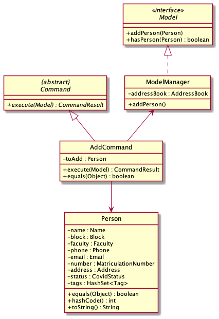

The class diagram above depicts the structure of `AddCommand`. As per any Command class, AddCommand needs to extend the abstract class Command.

Additionally, there are a few final static messages to be displayed to the user for various scenarios when utilising the AddCommand:

1. `MESSAGE_SUCCESS`:
   - Scenario: Adding of the specified `Person` to the database is successful.
   - Message: "New person added: %1$s" where "%1$s" is the added person's details.
2. `MESSAGE_DUPLICATE_PERSON`:
   - Scenario: Specified `Person` already exists in the database due to conflicting `MatriculationNumber`, `Phone` or `Email`.
   - Message: "This person's %s already exists in the address book" where "%s" refers to the unique fields: `Phone`, `Matriculation Number`, `Email`.

#### 5.2.4. Interaction between objects when Add Command is executed

:information_source: **Note** 

* The lifeline for `AddCommand` should end at the destroy marker (X) but due to a limitation of PlantUML, the lifeline reaches the end of diagram.
* Replace `NEW_PERSON_TAGS` in the sequence diagram with the tags stated in the notes shown in the sequence diagram.

When a user inputs an add command, the `execute()` method of `LogicManager` will be called and this will trigger a parsing process by `AddressBookParser`, `AddCommandParser` and `ParserUtil` to check the validity of the input prefixes and parameters. If the input is valid, a `Person` object is instantiated and this object is subsequently used as a parameter to instantiate an `AddCommand` object.

Following this, `LogicManager` will call the `execute()` method of the `AddCommand` object. In this method, the `hasPerson()` method of the `Model` class will be called, checking to see if this person exists in the database. If the person does not exist, a **CommandException** is thrown. Else, the `addPerson()` method of the `model` is called. Finally, it instantiates a new `CommandResult` object containing a string that indicates success of Add Command.

### 5.3. Edit feature

In this section, the functionality of the `edit` feature, the expected execution path, the structure of the **EditCommand** class and the interactions between objects with the **EditCommand** object will be discussed.

#### 5.3.1. What is the Edit feature

The edit feature allows the user to edit field values of exising student with new values.

The `edit` command is as follows:

`edit [INDEX] [PREFIX/NEW_VALUE]...` where `[PREFIX/NEW_VALUE]...` indicates one or more new fields in which the user wishes to edit.

The original AB3 implementation of this feature allows editing fields without making any new changes on the `Person`. e.g. If a `Person` with `name` of  John (indexed 1) is already present in the address book, then the command `edit 1 n/John` will still work.
In addition, for attribute types that need to be unique for each `Person` e.g. `Phone`, `Email` and `Matriculation Number`, the edited value for these unique attribute types still work even if it already exists in Tracey.
 e.g. Given the two following `Person` objects in Tracey:
* `name`: John `Email`: john123@gmail.com (indexed 1)
* `name`: Johnny `Email` johnny123@gmail.com (indexed 2)

The command `edit 2 e/john123@gmail.com` still works and the new `Email` value for Johnny would be updated to `john123@gmail.com` even though this email already exists in the address book for John and each student in Tracey must have an unique `Email`.

In order to address these issues, we have enhanced the `EditCommand` to include `EditCommand#editChecker()` to address the former issue and `Person#isDifferentPerson()` to address the latter issue.

#### 5.3.2. Path Execution of Edit Command

Modelling the workflow of the `Edit` Command, when the user inputs an **Edit Command**, the command is checked if the required prefixes are correct, the index is not out of range **and** fields are of the correct format. If the requirements are not met, a **ParseException**
will be thrown, else the new field values are then checked against its corresponding field values to be edited for duplicates. If there are any duplicates, a **Command Exception** will be thrown, else the new values that required uniqueness (`e.g.` `Phone``Email` `Matriculation Number`) are checked against the address book
for if it already exists. If it does, a **Command Exception** will be thrown, else the field values to be edited are updated with the new field values as a success message would be shown to the user.

#### 5.3.3. Structure of Edit Command

The class diagram above depicts the structure of `EditCommand`. As per any `Command` class, `EditCommand` needs to extend the abstract class `Command`.

Additionally, there are a few final static messages to be displayed to the user for various scenarios when utilising the **EditCommand**:
1.`MESSAGE_EDIT_PERSON_SUCCESS`:
- Scenario: Editing of the attribute(s) of the specified `Person` in the database is successful.
- Message: "Edited Person: %1$s" where %1$s refers to the updated details of the `Person`.
2. `MESSAGE_NOT_EDITED`:
- Scenario: No attribute is specified for the `Person` to be edited.
- Message: "At least one field to edit must be provided."
3. `MESSAGE_DUPLICATE_PERSON`:
- Scenario: New values used for attribute(s) that requires uniqueness e.g. `Phone` `Email` `Matriculation Number` already exists in the database.
- Message: "This person already exists in the address book."
4. `MESSAGE_SAME_INPUT`:
- Scenario: New values used for attribute(s) is duplicates of the corresponding attribute(s) to be edited.
- Message: "The edited value is the same as the current one."

#### 5.3.4. Interaction between objects when Edit Command is executed

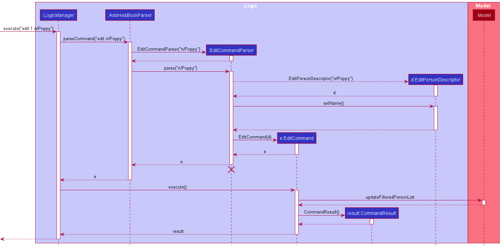

:information_source: **Note:** The lifeline for `EditCommand` should end at the destroy marker (X) but due to limitation of PlantUML, the lifeline reaches the end of diagram.

The above figure illustrates the important interactions of `EditCommand` when the user successfully edit the `name` attribute of the student at index 1 to Poppy.

When a user inputs an `EditCommand`, `LogicManager#execute()` will be invoked and this will trigger a parsing process by `AddressBookParser`, `EditCommandParser` and `ParserUtil` to check the validity of the input index, prefixes and parameters. If the input is valid, a `EditPersonDescriptor` object is instantiated and this object is subsequently used as a parameter to instantiate an `EditCommand` object.
The `EditCommand` object is then passed back to the `LogicManager` which will then invoked `EditCommand#execute()`. This execute method will call two other helper methods `EditCommand#editChecker()` and `Person#isDifferentPerson()`, which both are not shown in the sequence diagram and is used further validation.
The main functions of these two methods are to check if the new values are duplicate of the corresponding fields to be edited and if the new values for fields that requires uniqueness already exists in the address book respectively.
The `ObservableList` in the `Model` class then updates the display of the contacts, placing the edited person to the bottom of the list (or placing it at the last index).

TThe `ObservableList` is a JavaFX class which observes and automatically changes the list once an update is performed.

### 5.4. Delete feature

The delete mechanism implements the following sequence and interactions for the method call execute("delete INDEX") where INDEX refers to the index of the individual displayed in the result display.

#### 5.4.1. What is the Delete feature

The delete feature allows users to delete a student contact from the Tracey database.

The `delete` command is as follows: 

* `delete INDEX`

#### 5.4.2. Path Execution of Delete Command

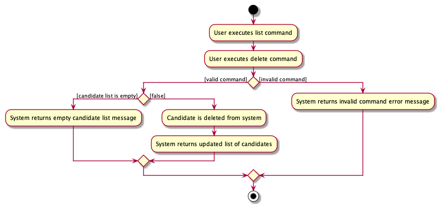

There are three possible execution paths for the delete command

1. User provides an invalid delete command input   This results in a parse exception
2. User provides a valid delete command input but provides an index that does not exist in Tracey   This results in a CommandException
3. User provides a valid delete command input and a valid index   The specified student contact will be deleted from Tracey

#### 5.4.3. Structure of Delete Command

The class diagram above depicts the structure of `DeleteCommand`. As per any Command class, DeleteCommand needs to extend the abstract class Command.

#### 5.4.4. Interaction between objects when Delete Command is executed

When a user inputs a delete command, the `execute()` method of `LogicManager` will be called and this will trigger a parsing process by `AddressBookParser`, `DeleteCommandParser` and `ParserUtil` to check the validity of the input prefixes and parameters. If the input is valid, a `DeleteCommand` object is instantiated.

Following this, `LogicManager` will call the `execute()` method of the `DeleteCommand` object. In this method, `getFilteredPersonList()` of the `ModelManager` class is called. Then `deletePerson(Person)` method of the `Model` class will be called, deleting the student from the database.  Finally, it instantiates a new `CommandResult` object containing a string that indicates success of Delete Command.

### 5.5. Undo/Redo features

In this section, the functionality of the undo and redo features, the expected execution path, the structure of the UndoCommand and RedoCommand class, and the interactions between objects with the UndoCommand and RedoCommand objects will be discussed.

#### 5.5.1. What are the Undo and Redo features

The undo feature allows users reverse an `add`, `edit`, or `delete` command.

The redo feature allows users to reverse an `undo` command.

#### 5.5.2. Execution of Undo Command

The `undo` command is as follows:

* `undo`

Calling this command undoes only the last executed add, edit or delete command, and can only be used after executing an add, edit, or delete command.

This command cannot be used in succession to undo previously executed commands besides the last executed one.

#### 5.5.3. Execution of Redo Command

The `redo` command is as follows:

* `redo`

Calling this command reverses only the last executed undo command, and can only be used after executing an undo command.

This command cannot be used in succession.

### 5.5.4. Path execution of Undo and Redo Commands

The activity diagram shows the possible execution paths for the `undo` and `redo` command.

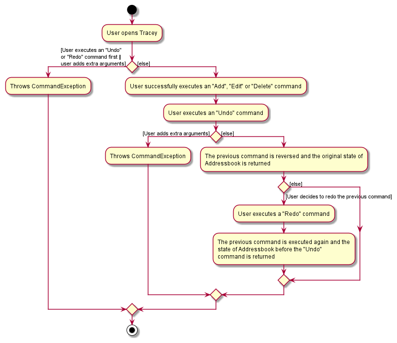

#### 5.5.5. Implementation

The proposed undo/redo mechanism is facilitated by `AddressBook`. On top of the current state of the `UniquePersonList` of `Person` objects, it stores two additional states, the history and the "original" state. Additionally, it implements the following operations:

* `AddressBook#saveHistory()` — Saves the current persons list state in its history.
* `AddressBook#restoreHistory()` — Restores the previous state of the persons list from its history and deletes the history.
* `AddressBook#saveOriginal()` — Saves the current persons list state in an "original" state, used after an `undo` command is called.
* `AddressBook#restoreOriginal()` — Restores the previous state of the persons list from its "original" state and deletes the history.

The restoreHistory() and restoreOriginal() operations are exposed in the `Model` interface as `Model#restoreHistory()` and `Model#restoreOriginal()` respectively.

Given below is an example usage scenario and how the undo/redo mechanism behaves at each step.

Step 1. The user launches the application for the first time. The `AddressBook` will be initialized with only the current state (state A) of the list of `Person` objects as `persons`.

Step 2. The user executes `delete 5` command to delete the 5th person in the address book, modifying `persons` (now having a state B). The `delete` command calls `Model#saveHistory()`, causing the modified state of the address book before the `delete 5` command executes to be saved in the `personsHistory`.

Step 3. The user now decides that deleting the person was a mistake, and decides to undo that action by executing the `undo` command. The `undo` command will call `Model#restoreHistory()`, which will replace the current state of `persons` with state A in `personsHistory`.

The original list with the person at index 5 deleted, shown as state B, will be stored in `personsOriginal` and `personsHistory` will be set to null.

Step 4. The user then decides that the initial delete was not a mistake, and decides to redo that action by executing the `redo` command. The `redo` command will call `Model#restoreOriginal()`, which will replace the current state of `persons` with state B in `personsOriginal`.

`personsOriginal` will then be set to null.

:information_source: **Note:** If `undo` is called as the first command or in succession, `personsHistory` will be null. The `undo` command uses `Model#checkHistory()` to check if this is the case. If so, it will return an error to the user rather
than attempting to perform the undo. Similarly, if `redo` is called as the first command or in succession, `personsOriginal` will be null. The `redo` command uses `Model#checkOriginal()` to check if this is the case and will also throw an error if so.

#### 5.5.6. Structure of Undo and Redo Commands

The following is a class diagram of the undo and redo features.

The above class diagram shows the structure of the UndoCommand and RedoCommand and their associated classes and interfaces. Some methods and fields are not included because they are not extensively utilised in UndoCommand and RedoCommand; such as public static fields and getter/setter methods.

#### 5.5.7. Interaction between objects when the Undo and Redo Commands are executed

The following sequence diagram shows how the undo operation works:

:information_source: **Note:** The lifeline for `UndoCommand` should end at the destroy marker (X) but due to a limitation of PlantUML, the lifeline reaches the end of diagram.

The following sequence diagram shows how the redo operation works:

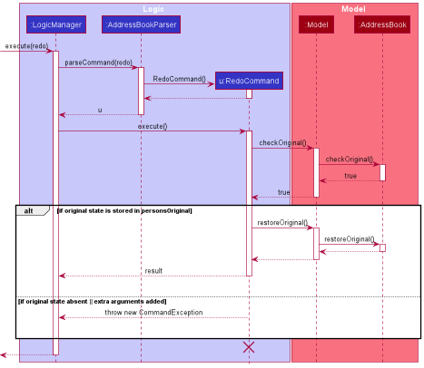

:information_source: **Note:** The lifeline for `RedoCommand` should end at the destroy marker (X) but due to a limitation of PlantUML, the lifeline reaches the end of diagram.

### 5.6. Find feature

The find mechanism implements the following sequence for the method call execute("find").

#### 5.6.1. What is the Find feature

The find feature allows users to find a particular contact by its name in Tracey and retrieve their specific details.

The `find` command is as follows:

`find NAME`

The user does not need to input the full name of the contact. However, the contact's name has to start with `NAME`.

e.g. `find J`
This will return any contacts' details whose names start with J in Tracey.

e.g. `find Ja`
This will return a contact with name 'Jack'.

e.g. `find ck`
This will not return a contact with name 'Jack'.

#### 5.6.2. Path execution of Find Command

The activity diagram below shows the possible execution paths for the `find` command:

There are two possible execution paths for this command.

1. User inputs the `find` command with invalid or empty arguments. A CommandException will be thrown, and Tracey will
   display an error message that informs the contact details the user try to search is not found.

2. User inputs the `find` command with valid arguments. Tracey returns a list of contact details that matches the
   input name from the existing database, and displays the contact list to the user.

#### 5.6.3. Interactions between objects when Find command is executed

The sequence diagram below illustrates the execution of `find` command:

The argument typed into Tracey's text box will first be taken in by the `execute` method in `LogicManager`. It will
then be parsed by the `parseCommand` function in the `AddressBookParser` object.

A `FindCommandParser` object will then be created to parse this input, with its `parse` function. A
NameContainsKeywordsPredicate object is then created, containing the name that the user has entered.
This NameContainsKeywordsPredicate object is then used to create a FindCommand object.

Subsequently, the `parseCommand` method in `LogicManager` will continue to create a `CommandResult`, displaying
a success message and a list of the students that match the name.

 

### 5.7. Filter feature

In this section, the functionality of the filter feature, the expected execution path, the structure of the FilterCommand class, the structure of the FilterCommand class and the interactions between objects with the FilterCommand object will be discussed.

#### 5.7.1. What is the Filter feature

The filter feature allows users to retrieve a list of specific students, filtering them by covid status, and/or faculty, and/or block.

#### 5.7.2. Path execution of Filter Command

The `filter` command is as follows:

* `filter cs/[COVID STATUS] f/[FACULTY] b/[BLOCK]`

The user can choose whether to input filter criteria for some or all of the fields. However, at least one field must be specified.  

The user can thus choose different combinations of filter criteria depending on the motive. For example, if a block head wants to cater to the covid-positive students in a certain block, the user can simply filter by both covid status and block to find out the details of this group of people.

eg.
`filter cs/positive f/soc`  
This is still a valid input even though the filter criteria for block was not specified. The resultant list will contain students who are both covid-positive and from the faculty "SOC".

The activity diagram shows the possible execution paths for the `filter` command.

There are two possible execution paths for this command.

1. User inputs the `filter` command with invalid or empty arguments. A ParseException will be thrown, and Tracey will display an error message along with the correct input format to the user.
2. User inputs the `filter` command with valid arguments. Tracey then stores the specified filter criteria, and displays a list based on those criteria.

#### 5.7.3. Structure of Filter Command

The following is a class diagram of the filter feature.

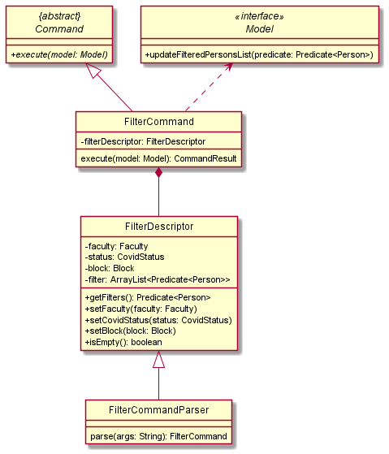

The above class diagram shows the structure of the FilterCommand and its associated classes and interfaces. Some methods and fields are not included because they are not extensively utilised in FilterCommand; such as public static fields and getter/setter methods.

#### 5.7.4. Interaction between objects when the Filter Command is executed

The sequence diagram below shows the interactions between objects during the execution of a `filter` command.

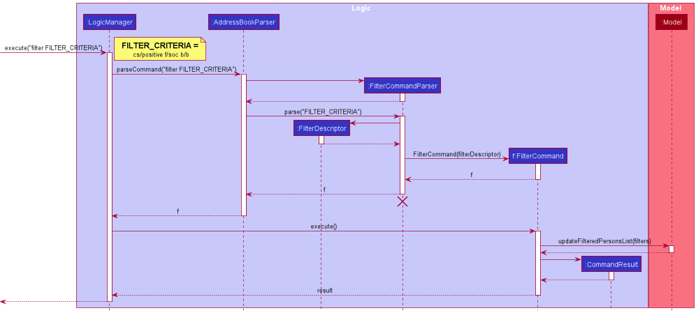

The arguments typed into Tracey's text box will first be taken in by the `execute` method in `LogicManager`. It will then be parsed by the `parseCommmand` function in the `AddressBookParser` object.

A `FilterCommandParser` object will then be created to parse this input, with its `parse` function. A `FilterDescriptor` object is then created, containing the filter criteria that the user has entered. This `FilterDescriptor` object is then used to create a `FilterCommand` object.

Subsequently, the `parseCommand` method in `LogicManager` will continue to create a `CommandResult`, displaying a success message and a list of the filtered students.

The `ArgumentMultimap` class is used to parse the user input and store the filtering criteria, based on the respective prefixes of the different fields. This was used so that the input criteria of each field can be taken from the user input irregardless of the order that they typed it in.
The `FilterDescriptor` takes in the filter criteria and returns a single predicate encompassing all the criteria on its `getFilters` method, so that this predicate can be used as an argument for the `updateFilteredPersonsList` method of the `Model` object, displaying a list of students that were filtered by this predicate.

### 5.8. List Feature

The list mechanism implements the following sequence for the method call execute("list").

#### 5.8.1. What is the List feature

The list feature will display all students and their details on the main window.
Each student's name, phone number, email, address, block letter, faculty, matriculation number, covid status and tags will be shown in the form of cards.

The `list` command is as follows:

`list`

The user can choose when to execute the list command.

The activity diagram shows the possible execution paths for the `list` command.

#### 5.8.2. Path Execution of List Command

There are two possible execution paths for this command.
1. User inputs `list` command. The Main Window will show all students and their particulars. After which, a message will be sent to the user that the command is successfully executed.
2. User inputs `list` command with additional parameters. Tracey will throw a ParseException to indicate that the format of the list input format is wrong.

#### 5.8.3. Structure of List Command

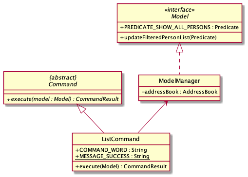

The class diagram above depicts the structure of `ListCommand`. As per any Command class, ListCommand needs to extend the abstract class Command.

#### 5.8.4. Interactions between objects when List Command is executed

When a user inputs a list command into the Tracey, the `executeCommand()` method of `MainWindow` will be called and this will call the `execute()` method of `LogicManager`. This will trigger a parsing process by `AddressBookParser`,  which then instantiates an `ListCommand` object.

Following this, the `LogicManager` will call the `execute()` method of the `ListCommand` object. In this method,
the `updatedFilteredPersonList` method of the `Model` class will be called, making sure the list of students are displayed on the Window. A `CommandResult` object with user feedback is hence instantiated.

### 5.9. Email Feature

The email mechanism implements the following sequence for the method call execute("email").

#### 5.9.1. What is the Email feature

The email feature opens up a separate window containing the emails of the students found in the current list displayed. The email feature allows a user to copy the email list to their clipboard to paste in their email platform of choice.

The `email` command is as follows:

* `email`

The user can choose when to execute the email command.

The activity diagram shows the possible execution paths for the `email` command.

#### 5.9.2. Path Execution of Email Command

There are two possible execution paths for this command.
1. User inputs `email` command. After the Email Window opens, the user can choose copy the emails in the list by clicking on the copy email button. After which, the user can close the Email Window.
2. User inputs `email` command. After the Email Window opens, the user chooses not to copy the emails in the list. After which, the user can close the Email Window.

#### 5.9.3. Structure of Email Command

The class diagram above depicts the structure of `EmailCommand`. As per any Command class, EmailCommand needs to extend the abstract class Command.

#### 5.9.4. Interactions between objects when Email Command is executed

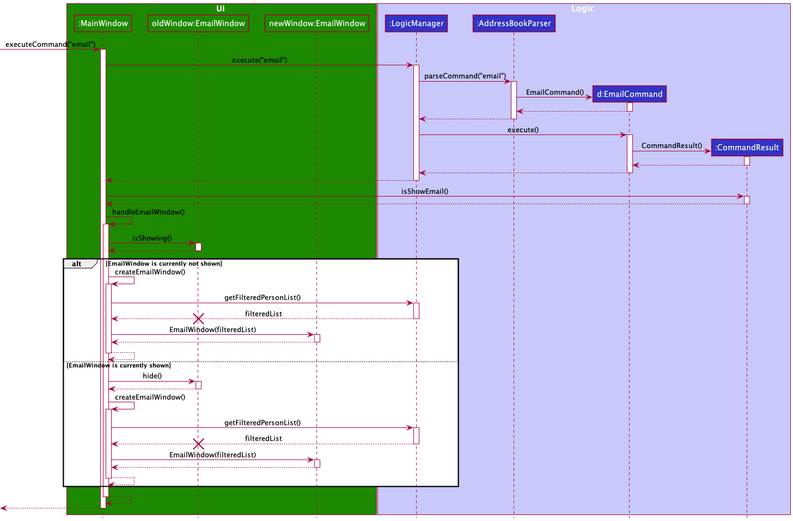

When a user inputs an email command into the Tracey, the `executeCommand()` method of `MainWindow` will be called and this will call the `execute()` method of `LogicManager`. This will trigger a parsing process by `AddressBookParser`,  which then instantiates an `EmailCommand` object.

Following this, the `LogicManager` will call the `execute()` method of the `EmailCommand` object. In this method, a `CommandResult` object will be instantiated.

Back in the `MainWindow`'s `executeCommand()` method, it will then call the `handleEmailWindow()` method which will then instantiate an `EmailWindow` object.

Afterwards, the `LogicManager` calls the `show()` method of `EmailWindow` and the `EmailWindow` will be shown to the user.

### 5.10. Summarise feature

The summarise mechanism implements the following sequence and interactions for the method call execute("summarise").

#### 5.10.1. What is the summarise feature

The summarise feature allows users to visualise the statistics of students in the Hall by their covid status and their faculty/block.
Firstly, Tracey will calculate how many positive cases are there in total. She will then calculate how many are positive, negative and on HRN in each block. She will then do the same with the students' faculties.
Data on each block and faculties will be drawn as pie charts and bar chart on a separate window.

This is helpful to determine if there is a specific block or faculty facing a covid superspread. Hall masters and leaders can be more certain on their follow-up actions to keep
their hall safe. This feature is unique from the List feature due to its additional computational ability to make better sense out of the data in Tracey.

#### 5.10.2. Path Execution of Summarise Command

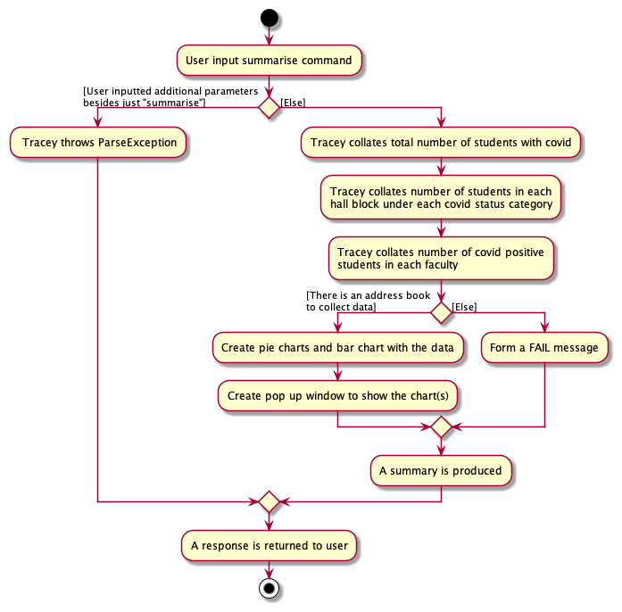

As seen in the above activity diagram, there are three possible execution paths for this command.
1. User inputs `summarise` command with students' records stored in Tracey. After the Pie Chart Window opens, the user can scroll through the window to see the pie charts for each block followed by the bar chart categorised by faculty.
2. User inputs `summarise` command with no students' records stored in Tracey. Tracey will just respond that there is no students to summarise. The Pie Chart Window will not open.
3. User inputs `summarise` command with additional parameters. Tracey will throw a **ParseException** to indicate that the format of the summarise input is wrong.

#### 5.10.3. Structure of Summarise Command

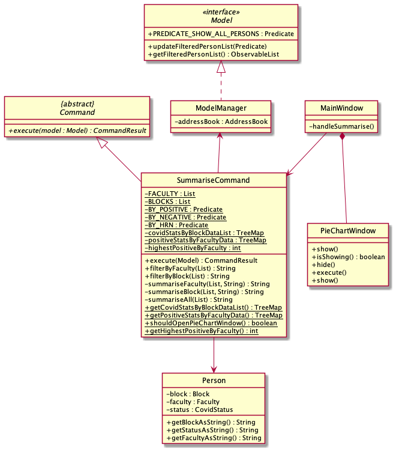

The above class diagram shows the structure of the Summarise Command and its associated classes and interfaces.

#### 5.10.4. Interaction between objects when Summarise Command is executed

:information_source: **Note:** The lifeline for `SummariseCommand` should end at the destroy marker (X) but due to a limitation of PlantUML, the lifeline reaches the end of diagram.

The sequence diagram above shows the interactions between objects during the execution of a `summarise` command.

When execute is called on the SummariseCommand object, there are multiple call back to self to anaylse and produce the result back to the Logic Manager.

When a user inputs a summarise command, the `execute()` method of `LogicManager` will be called and this will trigger a parsing process by `AddressBookParser`.
If the input is valid, an `SummariseCommand` object will be instantiated. If the input is invalid with additional parameters beside `summarise`, an exception will be thrown.

Following the valid input, `Logic Manager` will call the `execute()` method of the `SummariseCommand` object. In this method,
the `updatedFilteredPersonList` method and `getFilteredPersonList` method of the `Model` class will be called, making sure the list of students are displayed on the UI.
After getting the list of students, the `SummariseCommand` object will call its own `summariseAll` method to generate a message regarding total number
of covid cases in that hall. Then, `filterByBlock` method is then called on the same list again to organise the students into separate lists according to their block.
`filterByBlock` will call on its own `summariseBlock` method to generate statistics of covid statuses in each block of the hall. The statistics will be stored in `covidStatsByBlockDataList`.
`filerByFaculty` is then called on the list once again to organise the students into separate lists according to their faculty.
`summariseFaculty` method is then called to generate statistics of covid statuses in each faculty of students in the hall. The statistics will be stored in `positiveStatsByFacultyData`.
At the same time, `summariseFaculty` will stored the highest number of covid cases amongst the faculties in `highestPositiveByFaculty`.

Finally, it returns a new `CommandResult` object containing a string that indicates either failure or success of Summarise Command.
A pop-up window with the pie charts aligned to the message response will be generated to aid in the visualisation of data.

#### 5.10.5. Pie Chart Window feature

The pie chart window mechanism implements the following sequence and interactions for the method call execute("summarise").

##### 5.10.5.1. What is the Pie Chart Window feature

Pie Chart Window feature opens up a separate window that contains charts for the user to view.
The window contains pie charts that summarises how each block is doing according to the types of covid statuses and a bar chart that
summarises how many covid positive students each faculty has in the hall.

##### 5.10.5.2. Structure of Pie Chart Window Feature

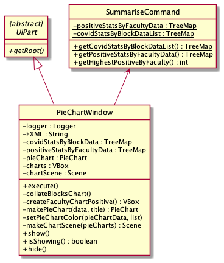

The above class diagram shows the structure of the Pie Chart Window and its associated classes and interfaces.
The Pie Chart Window has dependencies on the UiPart class as it uses the method `UiPart#getRoot()` from it to make the window.

##### 5.10.5.3. Interactions between objects when Pie Chart Window Feature is used

This feature is implemented using a new class `PieChartWindow` and modifications to `SummariseCommand` and `MainWindow`.
When the user inputs `SummariseCommand`, `SummariseCommand#summariseFaculty()` and `SummariseCommand#summariseBlock()` will
be invoked and puts the necessary data into a `TreeMap` that is a static variable of `SummariseCommand`. In `MainWindow#executeCommand()`,
it will invoke `MainWindow#handleSummarise()` which first check whether the pie chart window is to be displayed by calling `SummariseCommand#shouldOpenPieChartWindow()`.
If true and the window is already opened previously by the user, `MainWindow#handleSummarise()` will call `PieChartWindow#hide()` to close the window.
Regardless, `MainWindow#handleSummarise()` will call `PieChartWindow#execute()` to create the pie chart and opens a new window.
The data needed for the pie chart is obtained using `SummariseCommand#getPositiveStatsByFacultyData()` and `SummariseCommand#getCovidStatsByBlockDataList()`.

Below are links for implementation of the classes and its methods:
* [`PieChartWindow`](../src/main/java/seedu/address/ui/PieChartWindow.java)
* [`SummariseCommand`](../src/main/java/seedu/address/logic/commands/SummariseCommand.java)
* [`MainWindow`](../src/main/java/seedu/address/ui/MainWindow.java)

#### 5.10.6. Why it is implemented that way

The data needed for the pie charts should be coupled with `SummariseCommand`, therefore it is necessary to implement this feature in such a way that the pie chart data is created upon invocation `SummariseCommand`. A `PieChartWindow` controller and FXML class is also needed to abstract the creation of the pie charts and opening a new window respectively. The `MainWindow` class is then modified accordingly.

#### 5.10.7. Alternatives considered

**Aspect: How data is passed to the pie charts:**

* **Alternative 1 (current choice):** `SummariseCommand` will pass in necessary data into data structures (`TreeMap` in this case) upon invocation which then can be obtained using getter methods
    * Pros: Easy to implement.
    * Cons: Dependent on the `SummariseCommand` class to pass in correct inputs.
    * Other consideration(s): Use the Singleton design principle for the data structures.

* **Alternative 2:** Parse the feedback to user message from `SummariseCommand`
    * Pros: No modifications to the `SummariseCommand` class.
    * Cons: Dependent on the feedback message, need to implement complicated methods to parse the message, parsing methods need to be modified if the format of the feedback message is changed.

### 5.11. Data archiving feature

In this section, the functionality of the `archive` feature, the expected execution path, the structure of the **ArchiveCommand** class, the structure of the **ArchiveCommandParser** class and the interactions between objects with the **ArchiveCommand** object will be discussed.

#### 5.11.1. What is the Archive feature

This feature allows the user to save a copy of the working database, which can be then used for archival purposes such as future reference or restore the database back to a working version.

This command will save a copy of the working database at a file path which is dependent on the user's local computer's time and date.
When the user uses this command, a folder named `archive` will be created if it is not yet created at the directory relative to the database file.
Inside this `archive` folder will contain subdirectories named after the user's computer local date in `DDMMYY` format and inside these subdirectories will contain the archived files which is named after the user's computer
local date and time in `DDMMYYHHmmssSSS` format. The reason this format is used is to ensure that all archived files name are unique.

The `archive` command is as follows:
* `archive`

#### 5.11.2. Implementation

The archive command will save the archived file into a subdirectory of a directory relative to the address book file path.
`ArchiveCommand#initArchiveFilePath()` will produce the archived file path using the directory path of the address book file as the base directory.
e.g. If the address book file is saved in `ROOT/data`, then a directory called `archive` will be saved in `ROOT/data` and the
subdirectories will be saved as `ROOT/data/DATE` and the archived file path is `ROOT/data/DATE/ARCHIVED_FILE`.
`FileUtil#createIfMissing()` will create a dummy file at the archive file path.
The address book file will then be copied over to this dummy file at the archived file path using `Files#copy()`.

Below are links for implementation of the classes and its methods:
* [`FileUtil`](https://github.com/AY2122S2-CS2103T-T12-3/tp/blob/master/src/main/java/seedu/address/commons/util/FileUtil.java)
* [`ArchiveCommand`](https://github.com/AY2122S2-CS2103T-T12-3/tp/blob/master/src/main/java/seedu/address/logic/commands/ArchiveCommand.java)
* [`Files#copy()`](https://docs.oracle.com/javase/7/docs/api/java/nio/file/Files.html#copy(java.io.InputStream,%20java.nio.file.Path,%20java.nio.file.CopyOption...))

#### 5.11.3. Path Execution of Archive Command

Modelling the workflow of the `Archive` Command, when the user inputs an **Archive Command**, the command is checked if there are any extra parameters. If there is, a `CommandException` will be thrown, else the command then checks if the
working database file to be archived is present. If it is not present, a `CommandException` will be thrown, else the command then proceeds to copy the file. If there is an error copying the file, a `CommandException` will be thrown, else
the archived file will be saved in its respective file path and a success message will be shown to the user.

#### 5.11.4. Structure of Archive Command

The class diagram above depicts the structure of `ArchiveCommand`. As per any `Command` class, `ArchiveCommand` needs to extend the abstract class `Command`.

#### 5.11.5. Interactions between objects when Archive Command is executed

:information_source: **Note:** The lifeline for `ArchiveCommand` should end at the destroy marker (X) but due to a limitation of PlantUML, the lifeline reaches the end of diagram.

The above figure illustrates the important interactions of `ArchiveCommand` when the user successfully archived the current working database file.

When a user inputs `archive`, `LogicManager#execute()` will be invoked and this will trigger a parsing process by `AddressBookParser` to check if there are any extra parameters. If the input is valid, the file path of
the working database file is obtained using `Model#getAddressBookFilePath()`. A dummy copy of the archived file is then created at its file path using `FileUtil#createIfMissing()`, after which the data from the
working database file is copied over to this dummy file using `Files#copy()`. If the archived file is successfully created and copied, the user can then find this file at its file path.

### 5.12. Resizing result display window feature

In this section, the functionality of the `resize` feature, the expected execution path, the structure of the **ResizeCommand** class and the interactions between objects with the **ResizeCommand** object will be discussed.

#### 5.12.1. What is the Resize feature
This feature allows the user to resize the result display window in the case they have a small application window size, and/or they want to have a better view at the result feedback text after keying in a command, which is especially true for the `SummariseCommand`
which displays quite a long result feedback text.

The `resize` command is as follows:
* `resize 1`

This feature provides the user with three different resizing options to choose from, which are `1`, `2` and `3` with each number being a multiplier of the default result display window size (1 being the default size).

#### 5.12.2. Structure of Resize Command

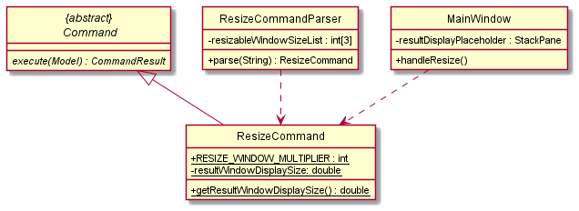

The class diagram above depicts the structure of `ResizeCommand`. As per any `Command` class, `ResizeCommand` needs to extend the abstract class `Command`.

#### 5.12.3. Path Execution of Resize Command

Modelling the workflow of the `Resize` Command, when the user inputs a **Resize Command**, the command is checked if the parameter is valid. If it is invalid, a `ParseException` will be thrown, else the result
display window in the GUI is resized according to the user's option. A success message is then displayed to the user.

#### 5.12.4. Interactions between objects when Resize Command is executed

The above figure illustrates the important interactions of `ResizeCommand` when the user successfully resizes the result display window.

:information_source: **Note:** The lifeline for `ResizeCommand` should end at the destroy marker (X) but due to a limitation of PlantUML, the lifeline reaches the end of diagram.

When a user inputs `resize 1`, `MainWindow#executeCommand()` will be invoked which in turn calls `LogicManager#execute()`. This will trigger a parsing process by `AddressBookParser` and `ResizeCommandParser` to check for valid command type and parameters.
This will then create a `ResizeCommand` object which is then executed by the `LogicManager` via `ResizeCommand#execute()` which will then update the value needed to set the result display window size. This value is used by the `MainWindow#handleResizeResultDisplayWindow()`
which sets the window in the GUI according to the user's desired option.

### 5.13. Clear feature

In this section, the functionality of the `clear` feature, the expected execution path, the structure of the **ClearCommand** class and the interactions between objects with the **ClearCommand** object will be discussed.

#### 5.13.1. What is the Clear feature

The clear mechanism implements the following sequence and interactions for the method call execute("clear") on a LogicManager object.

The original AB3 implementation of the clear feature acts a similar way to how we clear the address list. This clear feature allows
user to replace the list of students with an empty one. Previous data are swiped away.

#### 5.13.1. Path Execution of Clear Command

#### 5.13.2. Structure of Clear Command

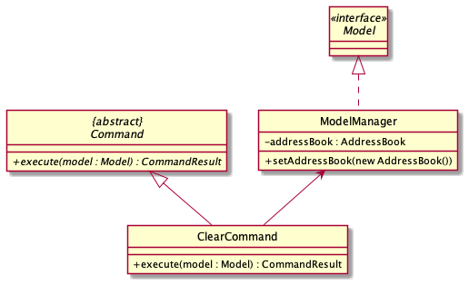

The class diagram above depicts the structure of `ClearCommand`. As per any Command class, ClearCommand needs to extend the abstract class Command.

Additionally, there is a static final static message to be displayed to the user when utilising the Clear Command:

1. `MESSAGE_SUCCESS`
   - Scenario: Tracey database successfully cleared.
   - Message: "Tracey has been cleared!".

#### 5.13.3. Interaction between objects when Clear Command is executed

When a user inputs a clear command, the `execute()` method of `LogicManager` will be called and this will trigger a parsing process by `AddressBookParser`, creating a new ClearCommand object.

Afterwards, the `execute()` method of this ClearCommand object is called, which calls the Model's `setAddressBook(AddressBook)` feature, setting a new AddressBook object to clear the database.

 

### 5.14. Exit Feature

The exit mechanism implements the following sequence for the method call execute("exit").

#### 5.14.1. What is the Exit feature

The exit feature allows users to exit from Tracey after they finish with it.

The `exit` command is as follows:

* `exit`

The user can choose when to exit the programme  

The activity diagram shows the possible execution paths for the `exit` command.

#### 5.14.2. Path Execution of Exit Command:

There are three possible execution path for this command.

1. User inputs the `exit` command with additional parameters   A ParseException is thrown
2. User correctly inputs `exit` command but secondary windows are open   Secondary windows are hidden first before the application closes
3. User correctly inputs `exit` command and no secondary windows are open   Application closes

The sequence diagram below shows the interactions between objects during the execution of a `exit` command.

#### 5.14.3. Structure of Exit Command

The class diagram above depicts the structure of `ExitCommand`. As per any Command class, ExitCommand needs to extend the abstract class Command.

#### 5.14.4. Interaction between objects when Exit Command is executed:

When a user inputs an exit command into the Tracey, the `executeCommand()` method of `MainWindow` will be called and this will call the `execute()` method of `LogicManager`. This will trigger a parsing process by `AddressBookParser`,  which then instantiates an `ExitCommand` object.

Following this, the `LogicManager` will call the `execute()` method of the `ExitCommand` object. In this method, a `CommandResult` object will be instantiated.

Back in the `MainWindow`'s `executeCommand()` method, it will then call the `handleExit()` method which will hide all windows and the primary stage.

Subsequently, the application closes and the MainWindow is deleted.

--------------------------------------------------------------------------------------------------------------------

### 5.15. Potential Feature: Import 

This section explains the potential import feature. 
The import mechanism will implement the following sequence for the method call execute("import").

#### 5.15.1. What is the Import feature

The import feature allows users to import an Excel file that contains a list of student records into Tracey.

The `import` command is as follows:

`import FILE PATH`

#### 5.15.2. Path execution of the Import Command

The activity diagram shows the possible execution paths for the `import` command.

There are two possible execution paths for this command.

1. User inputs the `import` command with invalid or empty arguments. A ParseException will be thrown, and Tracey will display an error message along with the correct input format to the user.
2. User inputs the `import` command with valid arguments. Tracey then stores the specified filter criteria, and displays a list based on those criteria.

#### 5.15.3. Interactions between objects when the Import Command is executed

The sequence diagram below shows the interactions between objects during the execution of a `import` command.

--------------------------------------------------------------------------------------------------------------------

## **6. Documentation, logging, testing, configuration, dev-ops**

* [Documentation guide](Documentation.md)
* [Testing guide](Testing.md)
* [Logging guide](Logging.md)
* [Configuration guide](Configuration.md)
* [DevOps guide](DevOps.md)

--------------------------------------------------------------------------------------------------------------------

## **7. Appendices**

### 7.1. Appendix A: Requirements

#### 7.1.1. Product scope

**Target user profile**:

* has a need to manage a significant number of contacts for contact-tracing of students
* has a simple-to-use product to check on health status of students
* prefer desktop apps over other types
* can type fast
* prefers typing to mouse interactions
* is reasonably comfortable using CLI apps

**Value proposition**:

This application aims to keep track of students’ covid status. This is a central repository for covid status updating to ease the facilitation of
management of NUS students within residential halls. It will be easier to read and update covid status.

Every students’ info in one integrated application platform. The app will help to manage students across different
faculties within NUS (no support for other schools).

#### 7.1.2. User stories

Priorities: High (must have) - `* * *`, Medium (nice to have) - `* *`, Low (unlikely to have) - `*`

| Priority | As a …​                                 | I want to …​                     | So that I can…​                                                |
| -------- | ------------------------------------------ | ------------------------------ | ---------------------------------------------------------------------- |
| `* * *`  | Hall admin                                 | obtain student contact information | quickly contact students if required                               |
| `* * *`  | Hall admin                                 | get a list of students with covid  |  find out any possible hotspots                                    |
| `* * *`  | Hall admin                                 | save the data locally              | for easy dissemination of information to other admins              |
| `* * *`  | Hall admin                                 | find details of a particular student | follow up with checking on the student                           |
| `* * *`  | Hall admin                                 | add a student’s details into the system | store their details for reference                             |
| `* * *`  | First time user                            | add a list of students with their info into the system  | have a centralised hub for covid health status |
| `* * *`  | Hall admin                                 | delete a user from the system      | remove wrongly keyed in inputs from the system                     |
| `* * *`  | Hall admin                                 | clear the system database          | quickly restore the initial state of the system and to start on a clean slate again             |
| `* * *`  | Hall admin                                 | edit a contact’s information       | can modify any change in contact details regarding a user          |
| `* * *`  | Professors                                 | get the statistics of covid cases among different groups of students | can use for further medical research |
| `* *`    | Hall admin                                 | seek help if unfamiliar with Tracey | straighten out any uncertainties regarding the usage of the system |
| `* *`    | Hall admin                                 | easily keep track and update  the covid status of students  | monitor the block that has the highest incidences of Covid-19 |
| `* *`    | Hall admin                                 | store the date when the student tested positive for covid   | check the duration for which the student has to be isolated for                |
| `* *`    | Busy admin                                 | retrieve a list of all email addresses | email them to know their well-being                                           |
| `* *`    | Hall admin                                 | categorise contacts according to faculty | I am happy                                                   |
| `* *`    | Hall admin                                 | filter out those students with covid easily     | plan for hall events   |
| `* *`    | Hall admin                                 | easily export data from the application  | to show my boss                                              |
| `* *`    | UHC people                                 | get the number of students with covid    | prepare enough medical resources accordingly                 |
| `* *`    | Hall admin                                 | easy method to Import data into the app  | save the hassle                                              |
| `* *`    | Hostel Management people                   | retrieve the number of students with covid in the different hostel  | Can plan out the number of rooms for covid use like quarantine etc.                |
| `* *`    | User                                       | have a quick keyword search     | to find a specific person if unsure of his full name or complete contact number                |
| `* `     | Hall leaders                               | get the name of students with covid     | check if their CCA members have Covid                                   |
| `* `     | Residence Fellow                           | know covid status of students and staffs     | come up with hall policies                                   |

### 7.1.3. Use cases

(For all use cases below, the **System** is the `Tracey` and the **Actor** is the `user`, unless specified otherwise)

#### Use case: UC01 - Delete a student

**MSS**

1.  User requests to list students.
2.  Tracey shows a list of students.
3.  User requests to delete a specific student in the list.
4.  Tracey deletes the person.

    Use case ends.

**Extensions**

* 2a. The list is empty.

  Use case ends.

* 3a. The given index is invalid.

    * 3a1. Tracey shows an error message.

      Use case resumes at step 2.

#### Use case: UC02 - Search for a student

**MSS**

1.  User requests to search for student.
2.  Tracey shows the info of student with that matching name.

    Use case ends.

**Extensions**

* 2a. The list does not contain student(s) of that name.

  Use case ends.

* 2b. The given student name exists multiple places on the list.

    * 2b1. Tracey shows a list of students with the name with their info.

      Use case ends.

#### Use case: UC03 - Add a student into Tracey

**MSS**

1.  User requests to add the student with his/her details such as year, faculty, covid status.
2.  Tracey adds the student with all his/her details into its database.
3.  Tracey shows the info of student with that matching name.

    Use case ends.

**Extensions**

* 1a. The student info has an invalid format.

    * 1a1. Tracey will inform user that he/she did not provide the correct information.

    * 1a2. User provide the correct details in the correct format.

        Use case ends.

* 1b. The student to be added already exists in the list by Tracey.

    * 1b1. Tracey inform user that the contact exists in her database.

        Use case ends.

* 1c. User adds multiple students in one go.

    * 1c1. Tracey will list out a list of new students added with their info.

        Use case ends.

* 1d. User uses wrong pre-defined constants for fields such as faculty or covid status.

    * 1d1. Tracey will provide a list of pre-defined constants for the user.

        Use case ends.

#### Use case: UC04 - Edit information of a student

**MSS**

1.  User requests to list students.
2.  Tracey shows a list of students.
3.  User requests to edit a specific student in the list.
4.  Tracey updates details of the person.

    Use case ends.

**Extensions**

* 1a. The list is empty.

    * 1a1. Tracey shows an empty list.

        Use case ends.

* 2a. The given student name exists multiple places on the list.

    * 2a1. Tracey will inform user that he/she did not provide the information in the correct format.

    * 2a2. User will key in the correct format to edit the student's details.

        Use case ends.

#### Use case: UC05 - Clear the system database

**MSS**

1.  User requests to clear all students.
2.  Tracey deletes all students from its database.
3.  Tracey shows an empty list.

    Use case ends.

#### Use case: UC06 - Summarize the system database for number of Covid patient

**MSS**

1.  User requests to summarise the number of students with covid.
2.  Tracey shows a pie chart and statements showing the proportion of students with different covid statuses.

    Use case ends.

#### Use case: UC07 - List all students

**MSS**

1.  User requests to list all students.
2.  Tracey shows a list of students.

    Use case ends.

**Extensions**

* 1a. The list is empty.
    * 1a1. Tracey shows an empty list.

  Use case ends.

#### Use case: UC08 - Request for help from Tracey

**MSS**

1.  User requests Tracey for more details on what she can do.
2.  Tracey redirects user to user guide.

    Use case ends.

**Extensions**

* 2a. The user guide is empty.

  Use case ends.

#### Use case: UC09 - Filter a list of students of specified covid status, and/or faculty, and/or block

**MSS**

1. User wants to filter a list of students of a specified covid status, faculty and block.
2. User keys in the details of students to filter out.
3. Tracey returns a list of students of the specified covid status, faculty and block.

   Use case ends.

**Extensions**

* 2a. Tracey detects invalid or empty arguments in user input.
    * 2a1. Tracey displays a error message and shows the correct input format.

      Use case ends.

* 2b. User only inputs details for one or two of the fields (covid status, faculty or block).
    * 2b1. Tracey returns a list of students of the specified details.

      Use case ends.

#### Use case: UC10 - Summarise all students for some overview of covid situation

**MSS**

1.  User requests to summarise all students to get how the hall is doing with covid.
2.  Tracey shows a pop-up window of pie charts representing the covid situation in each hall block.

    Use case ends.

**Extensions**

* 2a. There is no data in database for Tracey to form a helpful response.

  Use case ends.

#### Use case: UC11 - Resizing the result window display in the GUI of the application

**MSS**

1.  User requests to resize the result display window.
2.  Tracey will resize the result display window in the GUI according to the option supplied by the user.

    Use case ends.

**Extensions**

* 1a. User keys in invalid resizing option.

  Use case ends.

#### Use case: UC12 - Saving the working database file for archival purposes

**MSS**

1.  User requests save the current working database file.
2.  Tracey will save the current working database file at a specified file path.

    Use case ends.

**Extensions**

* 1a. The working database file is not present.
  * 1a1. There is no file to copy from.

  Use case ends.

* 1b. There is already an archived file with the same specified name
  * 1b1. This archived file is replaced with a new archived file.

  Use case ends.

#### Use case: UC13 - Exiting from the Tracey application

**MSS**

1.  User requests to exit from the application.
2.  Tracey will close the application.

    Use case ends.

#### Use case: UC14 - Undoing a previous command

**MSS**

1.  User requests to undo the previous command that was made.
2.  Tracey will undo the previous command and restore any previous changes.

    Use case ends.

**Extensions**

* 1a. The previous command used cannot be undone.
    * 1a1. Tracey will display a message which states that there are no previous changes to be undone.

  Use case ends.

#### Use case: UC15 - Redoing a undo command

**MSS**

1.  User requests to redo an undo command that was made on another previous command.
2.  Tracey will revert any changes made by the undo command on another previous command.

    Use case ends.

**Extensions**

* 1a. The user did not use the undo command before using the redo command.
    * 1a1. Tracey will display a message which states that there are no previous changes to be reverted.

  Use case ends.

#### Use case: UC16 - Getting the email of students

**MSS**

1.  User requests to get the email of the students.
2.  Tracey will copy all the email of the students to the user's clipboard. 

    Use case ends.

### 7.1.4. Non-Functional Requirements

1.  Application is offered free.
2.  Has storage function
3. Source code is open source
4. The user interface should be intuitive enough for users who are not IT-savvy.
5. Should be compatible with Mac and Windows
6. A record table should be able to have up to 5000 NUS students.
7. the application should work on both 32-bit and 64-bit environments.
8. The application will always answer the user.
9. The application cannot handle image input.
10. The application cannot store 2 or more schools into a instance of application
11. Product is not required to handle printing of reports
12. Product should respond within 10 seconds.

### 7.2. Appendix B: Glossary

*Table 1: List of prefixes, fields, pre-defined constants and constraints.*

| **Prefix** | **Meaning** |    **Pre-defined constants**                                                                              | Constraints                                                             |
|:-----:|:--------------------:|:-----------------------------------------------------------------------------------------------------:|:-----------------------------------------------------------------------:|
| `n/`  | Name                 | None                                                                                                  | Can only contain alphanumeric characters and spaces.                    |
| `p/`  | Phone Number         | None                                                                                                  | Can only be numbers at least 3 digits long.                             |
| `e/`  | Email                | None                                                                                                  | An email address should begin with a local part containing alphanumeric characters and these special characters: `+_.-`. The local part cannot start with a special character. This should be followed by a '@' and then a domain name.  The domain name should be made up of domain labels separated by periods, and must end with a domain label at least 2 characters long and each domain label can only consist of alphanumeric characters, separated only by hyphens, if any. |
| `a/`  | Address              | None                                                                                                  | Cannot be blank.                                                        |
| `f/`  | Faculty              | `FASS` `BIZ` `SOC` `SCALE` `FOD` `CDE` `DUKE` `FOL` `YLLSOM` `YSTCOM` `SOPP` `LKYSPP` `SPH` `FOS`     | Can only be one of the pre-defined constants, and is case-insensitive.  |
| `mc/` | Matriculation Number | None                                                                                                  | Can only start with an "A", followed by 7 digits, ending with a letter. |
| `cs/` | Covid Status         | `Positive` `Negative` `HRN`                                                                       | Can only be one of the pre-defined constants, and is case-insensitive. |
| `b/`  | Block                | `A` `B` `C` `D` `E`                                                                               | Can only be one of the pre-defined constants, and is case-insensitive. |
| `t/`  | Optional tag(s)      | None                                                                                                  | Can only contain alphanumeric characters and spaces. Must be no more than 30 characters. |

*Table 2: Specific terminology used.*

| Term                           | Meaning                                                                                                                                                                                                                                                                                              |
|--------------------------------|------------------------------------------------------------------------------------------------------------------------------------------------------------------------------------------------------------------------------------------------------------------------------------------------------|
| Block                          | The building or demarcated area within a residential hall that a student resides in. Typically, A residential hall is separated into 5 blocks: A, B, C, D and E.                                                                                                                                     |
| Command Line Interface (CLI)   | A text-based user interface used to run applications.                                                                                                                                                                                                                                                |
| Covid Status                   | A status to indicate whether a person is Covid-positive or has a has a health risk notice (HRN).                                                                                                                                                                                                     |
| Faculty                        | A group of departments in a university with a major division of knowledge. E.g. The School of Computing (SOC).                                                                                                                                                                                       |
| Graphical User Interface (GUI) | A system of interactive visual components used for managing user interaction with an application.                                                                                                                                                                                                    |
| Health Risk Notice (HRN)       | A label on a person to indicate that he/she has been identified as a close contact or household member of a Covid positive case.                                                                                                                                                                     |
| JAR File                       | JAR stands for **J**ava **AR**chive. This is a cross-platform file archive format that combines and compresses a large number of files into one, handling class files, audio and image files.                                                                                                        |
| Matriculation Number           | A student's unique identification number; also known as Student ID.                                                                                                                                                                                                                                  |
| Prefix                         | A set of one or more characters placed before others. When using Tracey, one or more letters followed by a forward slash (e.g. `cs/`) is used as a prefix to a detail to be input. The set of prefixes used by Tracey is shown in figure 3 under <a href='#adding-a-contact'>"Adding a contact"</a>. |
| Pre-defined constant           | Specific values that certain fields can only take. E.g. The pre-defined constants for Covid Status are `Positive`, `Negative` and `HRN`. Thus, these are the only values that can be input with the Covid Status prefix. Any other values would result in an error.                                  |
| Uniform Resource Locator (URL) | A reference to a web resource specifying its location in a computer network and the mechanism for its retrieval; more commonly known as a web address.                                                                                                                                               |
| Mainstream OS                  | A Windows, Linux, Unix, OS-X operating system that computers run on.                                                                                                                                                                                                                                 |
| Covid-19                       | An infectious disease caused by the SARS-CoV-2 virus.                                                                                                                                                                                                                                                |
| NUS Hall                       | Hall of residence in the National University of Singapore.                                                                                                                                                                                                                                           |
| Hall leaders                   | Student leaders in NUS halls.                                                                                                                                                                                                                                                                        |

--------------------------------------------------------------------------------------------------------------------

## 7.3. Appendix C: Instructions for manual testing

Given below are instructions to test the app manually.

:information_source: **Note:** These instructions only provide a starting point for testers to work on;
testers are expected to do more *exploratory* testing.

#### 7.3.1. Launch and shutdown

1. Initial launch

    1. Download the jar file and copy into an empty folder

    1. Double-click the jar file Expected: Shows the GUI with a set of sample contacts. The window size may not be optimum.

2. Saving window preferences

    1. Resize the window to an optimum size. Move the window to a different location. Close the window.

    1. Re-launch the app by double-clicking the jar file. 
       Expected: The most recent window size and location is retained.

3. _{ more test cases …​ }_

#### 7.3.2. Adding a person
1. Adding a person into Tracey. After addition, the student contact will be displayed at the bottom of the displayed list

   a. Test case : `add n/John Doe b/E f/SoC p/98765432 e/johnd@example.com a/311, Clementi Ave 2, #02-25 mc/A0253647C cs/NEGATIVE`     Expected: Insert a student contact with the above details to the list and displayed on the GUI.

   b. Test case : `add n/John Doe b/E f/SoC p/98765432 e/johnd@example.com a/311, Clementi Ave 2, #02-25 mc/A0253647C cs/NEGATIVE t/leader`   Expected: Insert a student contact with the above details with the tags displayed.

   c. Test case : `add n/John Doe n/Daniel Doe b/E f/SoC p/98765432 e/johnd@example.com a/311, Clementi Ave 2, #02-25 mc/A0253647C cs/NEGATIVE`   Expected: Inserts a student contact with the second specified name parameter. 

   d. Test case : Invalid Syntax   Expected: No student is added into Tracey. Error details shown in response message. Help message also displayed in response message for the user to try again to insert correctly. 

   e. Test case : Insert order with existing `MatriculationNumber`, `Phone` or `Email`   Expected: Error will message will be displayed stating that the duplicate unique field already exists in Tracey and thus stated student will not be added.
   

#### 7.3.3. Deleting a person

1. Deleting a person while all persons are being shown  Prerequisites: List all persons using the `list` command. Multiple persons in the list.

   a. Test case: `delete 1` 
      Expected: First contact is deleted from the list. Details of the deleted contact shown in the status message.

   b. Test case: `delete 0` 
      Expected: No person is deleted. Error details shown in the status message.

   c. Other incorrect delete commands to try: `delete`, `delete x`, `...` (where x is larger than the list size) 
      Expected: Similar to previous.

#### 7.3.4. Summarising the data

1. Summarising all the students' data at that specific time using the `summarise` command.
   A separate window containing charts that categorises student by covid status and faculty or block will be shown if there are student data in Tracey.

    a. Test case: `summarise` on a non-empty list of students  
       Expected: Pie Chart Window will display at least one pie chart and one bar chart.

    b. Test case: `summarise` on an empty list of students  
       Expected: No Pie Chart Window displayed. Tracey will respond with "Nothing to summarise".

    c. Test case: `summarise` on a non-empty list of students followed by a `delete 1` command without closing the Pie Chart Window and use `summarise` again  
       Expected: New Pie Chart Window will display containing updated data set due to a deletion.

    d. Test case: `summarise` on a non-empty list of students followed by a `exit` command without closing the Pie Chart Window  
       Expected: Existing Pie Chart Window will close along with the Main Window.

    e. Other incorrect summarise commands to try: `summarise positive`, `summarise 3`  
       Expected: Error message indicating format of command is wrong.

#### 7.3.5. Help user
1. Display a help window for user to access command format and examples.

   a. Test case: Press F1   Expected: Help window opens.

   b. Test case: `help`   Expected:  Help window opens.

   c. Test case: `help` with additional parameters after the `help` command  Expected: The response box will display an invalid command message.

   d. Test case: Click on file, followed by clicking on help   Expected: Help window opens.

#### 7.3.6. Listing the data

1. List all the students in Tracey. The order of students arranged is dependent on who is the last added/edited student
   a. Test case: `list`  
      Expected: All students are shown on the Main Window.

   b. Test case: `list` on an empty list of students  
      Expected: No students will be shown. Instead, it shows a list of no students.

   c. Test case: `list` `ANY_WORDS_OR_CHARACTERS` 
      Expected: Error message indicating format of command is wrong.

#### 7.3.7. Clearing the data
1. Clear the Tracey database.

   a. Test case: `clear`   Expected: Tracey database is cleared. Empty list shown to user.

   b. Test case: `clear` with additional parameters after the `clear` command  Expected: The response box will display an invalid command message.

#### 7.3.8. Exiting the application
1. Exit the application using the `exit` command.

   a. Test case: `exit`   Expected: The GUI window will be closed.

   b. Test case: `exit` with additional parameters after the `exit` command   Expected: The response box will display an invalid command message.

#### 7.3.9. Finding a person

1. Finding a person by their full name

   a. Prerequisites: Add contacts with names of `Andy` and `Bob` by using `add` command 

   b. Test case: `find Andy` 
          Expected: List details of `Andy`. Details of matched contacts shown in the status message.

   c. Test case: `find Carl` 
             Expected: No person is found. Error details shown in the status message. 
 
   d. Other incorrect delete commands to try: `find`, `find x` (where x is any number) 
             Expected: Similar to previous.

2. Finding a person by using name's prefix 

   a.Prerequisites: Add contacts with names of `Andy`, `Anna` and `Bob` by using `add` command

   b. Test case: `find An` 
       Expected: List details of `Andy` and `Anna`. Details of matched contacts shown in the status message.

   c. Test case: `find dy` 
       Expected: No person is found. Error details shown in the status message.

   d. Other incorrect delete commands to try: `find na`, `find ob`  
       Expected: Similar to previous.

#### 7.3.10. Saving data

1. Dealing with missing/corrupted data files when the application is close.

    a. prerequisites: Multiple persons in the list. The Tracey application is not open. There is a file named `addressbook.json` in ROOT/data, if it is not present, simply launch the Tracey application, input `list` (which will create the `addressbook.json` file) and close the application.
    
    b. Test case: Open the `addressbook.json` file in ROOT/data with a text editor and change the first contact's `Phone` to be the same as the second contact's phone. Launch the Tracey application. Ensure that the changes are saved before launching. 
       Expected: There is no contacts rendered in the list.

    c. Other test cases to try: Instead of changing the contact's attributes that require uniqueness, you can change other different attributes to the wrong format, such as putting a special character for the `Name` attribute.

2. Dealing with missing/corrupted data files when the application is open.

    a. prerequisites: Multiple persons in the list. The Tracey application is open. There is a file named `addressbook.json` in ROOT/data, if it is not present, input `list` (which will create the `addressbook.json` file).   

    b. Test case: Open the `addressbook.json` file in ROOT/data with a text editor and change the first contact's `Phone` to be the same as the second contact's phone. Ensure that the changes are saved. Input a command such as `list`. 
       Expected: The contacts are still present in the list. The `addressbook.json` file will be restored back to the previous working state.

#### 7.3.11. Editing a person

1. Editing a person while all person are being shown

    a. Prerequisites: List all persons using the `list` command. Multiple persons in the list. 

    b. Test case: `edit 1 n/Poppy doopy` 
       Expected: First contact `name` is changed to Poppy doopy. This contact is placed at the bottom of the list, index of all other contacts is incremented by one. Details of the edited contact shown in the status message. Timestamp in the status bar is updated.  
    
    c. Test case: `edit -1 n/Poppy doopy` 
       Expected: No person's details is edited. Error details is shown in the status message. Status bar remains the same.

    d. Test case: Use the same value for the edited field, that is if contact at 2nd index has `Phone` of 123456, test using `edit 2 p/123456` 
       Expected: Second contact's details is not edited. Error details is shown in the status message. Status bar remains the same.

    e. Test case: Use a value that already exits in other contacts for a field that requires uniqueness e.g. `Phone` `Email` `Matriculation Number`, that is if third contact's `Email` is test@gmail.com then test using `edit 2 e/test@gmail.com`. 
       Expected: Second contact's details is not edited. Error details is shown in the status message. Status bar remains the same.

    f. Other incorrect edit commands to try: `edit`, `delete x`, `...` (where x is larger than the list size), use same values for other fields to be edited for the same person, use values that for fields that require uniqueness but already exists for other contacts. 

#### 7.3.12. Undoing and redoing a command

1. Undoing and redoing a command
    a. Prerequisites: List all persons using the `list` command. Multiple persons in the list. 
    b. Test case: `delete 1`, then `undo`, then `redo` 
    Expected: The contact at index 1 will be deleted, then restored at index 1 after `undo` is entered. The contact will be deleted again after `redo` is entered. 
    c. Test case: `edit 1 n/Poppy doopy`, then `undo`, then `redo` 
    Expected: The name of the contact at index 1 will be changed to Poppy doopy and shifted to the bottom of the list, then back to the original name and at index 1 after `undo` is entered. The contact's name will be changed to Poppy Doopy again after `redo` is entered. 
    d. Test case: `add n/John Doe b/E f/SoC p/98765432 e/johnd@example.com a/311, Clementi Ave 2, #02-25 mc/A0253647C cs/NEGATIVE`, then `undo`, then `redo` 
    Expected: A new contact will be added to the list, then removed again when `undo` is entered. The contact will be added again after `redo` is entered. 

#### 7.3.13. Filtering by criteria

2. Filtering by covid status, faculty and/or block
    a. Prerequisites: List all persons using the `list command`. Multiple persons in the list. 
    b. Test case: `filter f/soc` 
    Expected: A list of all the contacts with faculty 'SOC' will be returned. If no such contacts exist, the list will be empty. 
    c. Test case: `filter cs/positive` 
    Expected: A list of all the contacts with covid status 'Positive' will be returned. If no such contacts exist, the list will be empty. 
    d. Test case: `filter b/e` 
    Expected: A list of all the contacts with block 'E' will be returned. If no such contacts exist, the list will be empty. 
    e. Test case: `filter f/soc cs/negative` 
    Expected: A list of all the contacts with faculty 'SOC' and covid status 'Negative' will be returned. If no such contacts exist, the list will be empty. 
    f. Test case: `filter f/soc cs/positive b/a` 
    Expected: A list of all the contacts with faculty 'SOC', covid status 'Positive' and block 'A' will be returned. If no such contacts exist, the list will be empty. 
   
#### 7.3.14. Archiving the database

1. Saving the working copy of the Tracey database

    a. Prerequisites: Ensure that there is a file named `addressbook.json` inside the directory ROOT/data. 

    b. Test case: `archive` 
       Expected: A folder named archive is created in the directory ROOT/data if it is already not there. A folder named after your local PC's date in the format of `DDMMYY` is created in this archive directory if it is not already there. An archived file named after your local PC's date and time in the format of `DDMMYY_HHmmssSSS.json` is found in the directory. Timestamp in the status bar is updated.
    
2. Manually inspecting the archived file of a working database file

    a. Prerequisites: Successful use of `archive` on a working database file and there is an archived file created in the specified directory. No further amendments made to `addressbook.json` or the recently archived file. Must use the `addressbook.json` file and its corresponding archived file for this test.

    b. Test case: Manually inspect the contents of both `addressbook.json` and the archived file named `DDMMYY_HHmmssSSS.json`. 
       Expected: The contents of both files is exactly the same.

3. Saving a corrupted copy of the Tracey database

    a. Prerequisites: Multiple persons in the list. Ensure that there is a file named `addressbook.json` inside the directory ROOT/data. The Tracey application is open.

    b. Test case: Open the `addressbook.json` file in ROOT/data and amend the first contact's `Name` to include a special character. Input the `archive` command. 
       Expected: A folder named archive is created in the directory ROOT/data if it is already not there. A folder named after your local PC's date in the format of `DDMMYY` is created in this archive directory if it is not already there. An archived file named after your local PC's date and time in the format of `DDMMYY_HHmmssSSS.json` is found in the directory. Timestamp in the status bar is updated.

4. Manually inspecting the archived file of a working database file

   a. Prerequisites: Successful use of `archive` on a corrupted database file and there is an archived file created in the specified directory. No further amendments made to `addressbook.json` or the recently archived file. Must use the `addressbook.json` file and its corresponding archived file for this test.

   b. Test case: Manually inspect the contents of both `addressbook.json` and the archived file named `DDMMYY_HHmmssSSS.json`. 
      Expected: The contents of `addressbook.json` is of the previous working state while the archived file is of the same content as the corrupted database file.

5. Attempting to archive a non-existent Tracey database

   a. Prerequisites: Ensure that there is no file named `addressbook.json` inside the directory ROOT/data.
    
   b. Test case: `archive` 
      Expected: No archived file is created in the specified directory. Error details is shown in the status message. Status bar remains the same.

6. Inputting extra parameters 

    a. Prerequisites: None

    b. Test case: `archive x`(where x = any value) 
       Expected: No archived file is created in the specified directory. Error details is shown in the status message. Status bar remains the same.

### 7.3.15. Resizing the result display window

1. Using the command line to resize

   a. Prerequisites: The result display window is in its default size (option 1)
   
   b. Test case: `resize x`(where x = 1, 2 or 3) 
      Expected: The result display window will be resized according to `x` where the value of `x` is the multiplier to the default size. The result display window will remain the same size if the window size is already at `x`. used Timestamp in the status bar is updated.
    
   c. Test case: `resize x`(where x = any value other than 1, 2 or 3) 
      Expected: The result display window will not be resized. Error details shown in the status message. Status bar remains the same.

2. Using the button in the GUI to resize

   a. Prerequisites: The result display window is in its default size (option 1) 

   b. Test case: Click on the `Resize Display` button once 
      Expected: The size of the resize window display will be doubled with respects to the default size.

   c. Test case: Click on the `Resize Display` button once again 
      Expected: The size of the resize window display will be tripled with respects to the default size.
   
   d. Test case: Click on the `Resize Display` button once again 
      Expected: The size of the resize window display will return to the default size.

## 7.4. Appendix D: Effort

**Overview**

Our team wanted to make an application that could help facilitate covid tracking and contact tracing in NUS residential halls. We decided to build Tracey which aims to be a central hub for the covid status information of all residents of an NUS residential hall. In addition to the existing basic features of the Address Book 3 (AB3), we needed to add additional features to satisfy the needs of our target audience, the student leaders and administrative staff of halls. These features include the Filter and Summarise functions.

**Challenges faced**

**Designing of app** - Our first obstacle was to come up with the idea for Tracey. During the planning the app design, we encountered conflicts as we all had differing ideas of what features to include. We tried to incorporate all of our ideas, by deliberating and debating on how we could align our ideas, and eventually came up with a consensus on the design. 

**Testing and debugging** - Much of our time was spent on coming up with appropriate test cases and debugging. The difficulty we had was figuring out how the skeletal design of the original AB3 works, but once we accomplished that, we were able to test and debug our code more smoothly and quickly.

**Coding standards** - There were many instances when our code did not adhere to appropriate conding standards and the team's convention. We addressed this by always meticulously reviewing the pull requests as a team and pointing out any coding standard violations. While this may have taken up extra time, it ensured that our code is clean and readable, making it easier for cooperation.

**Documentation** - We had quite a number of meetings and discussions to decide on and standardize the way we wanted to write and format our user and developer guides. This took up a fair bit of time as we had to constantly update the guides whenever we altered the implementation of our features or added new ones.

**Achievements**

**Adhering to proper OOP** - For all our new features, we made sure that our code was implemented in an OOP manner with proper levels of abstraction. This made for code that is more reusable and easily maintainable.

**Good test coverage** - We applied the various methods of testing that we had learnt (unit testing, integration testing, system testing etc.) to make sure that the code is as bug-free as possible. We also ensured at least 70% method coverage for all components.

**Conclusion**

In conclusion, it was a long journey but our team communicated well and worked cohesively, producing an app that was very close to what we had envisioned. As a team, we learnt plenty about how to work and cooperate with one another, eventually accomplishing what we had set out to achieve.
