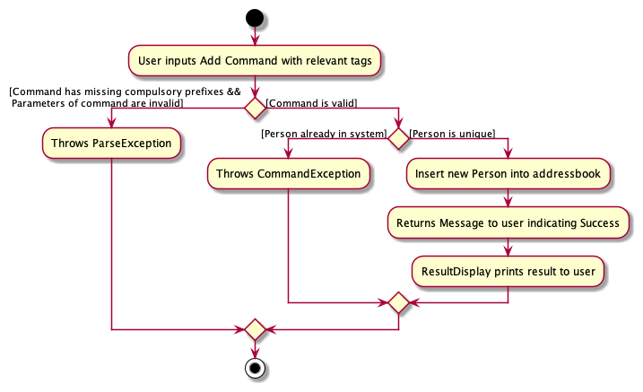
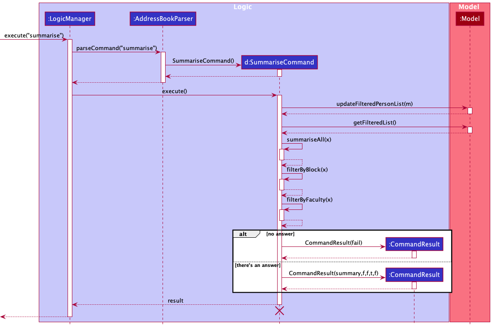
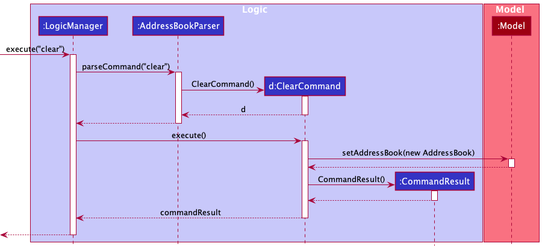
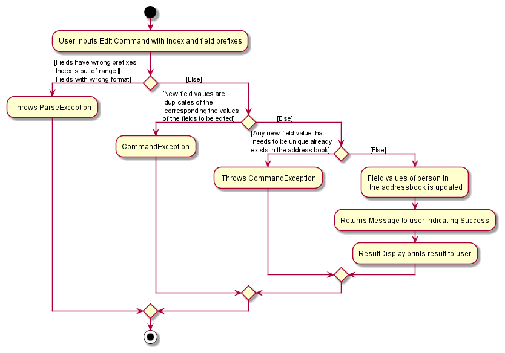

* Table of Contents
  {:toc}

--------------------------------------------------------------------------------------------------------------------

## **Acknowledgements**

* {list here sources of all reused/adapted ideas, code, documentation, and third-party libraries -- include links to the original source as well}

--------------------------------------------------------------------------------------------------------------------

## **Setting up, getting started**

Refer to the guide [_Setting up and getting started_](SettingUp.md).

--------------------------------------------------------------------------------------------------------------------

## **Design**

:bulb: **Tip:** The `.puml` files used to create diagrams in this document can be found in the [diagrams](https://github.com/se-edu/addressbook-level3/tree/master/docs/diagrams/) folder. Refer to the [_PlantUML Tutorial_ at se-edu/guides](https://se-education.org/guides/tutorials/plantUml.html) to learn how to create and edit diagrams.

### Architecture

The ***Architecture Diagram*** given above explains the high-level design of the App.

Given below is a quick overview of main components and how they interact with each other.

**Main components of the architecture**

**`Main`** has two classes called [`Main`](https://github.com/se-edu/addressbook-level3/tree/master/src/main/java/seedu/address/Main.java) and [`MainApp`](https://github.com/se-edu/addressbook-level3/tree/master/src/main/java/seedu/address/MainApp.java). It is responsible for,
* At app launch: Initializes the components in the correct sequence, and connects them up with each other.
* At shut down: Shuts down the components and invokes cleanup methods where necessary.

[**`Commons`**](#common-classes) represents a collection of classes used by multiple other components.

The rest of the App consists of four components.

* [**`UI`**](#ui-component): The UI of the App.
* [**`Logic`**](#logic-component): The command executor.
* [**`Model`**](#model-component): Holds the data of the App in memory.
* [**`Storage`**](#storage-component): Reads data from, and writes data to, the hard disk.

**How the architecture components interact with each other**

The *Sequence Diagram* below shows how the components interact with each other for the scenario where the user issues the command `delete 1`.

Each of the four main components (also shown in the diagram above),

* defines its *API* in an `interface` with the same name as the Component.
* implements its functionality using a concrete `{Component Name}Manager` class (which follows the corresponding API `interface` mentioned in the previous point.

For example, the `Logic` component defines its API in the `Logic.java` interface and implements its functionality using the `LogicManager.java` class which follows the `Logic` interface. Other components interact with a given component through its interface rather than the concrete class (reason: to prevent outside component's being coupled to the implementation of a component), as illustrated in the (partial) class diagram below.

The sections below give more details of each component.

### UI component

The **API** of this component is specified in [`Ui.java`](https://github.com/se-edu/addressbook-level3/tree/master/src/main/java/seedu/address/ui/Ui.java)

The UI consists of a `MainWindow` that is made up of parts e.g.`CommandBox`, `ResultDisplay`, `PersonListPanel`, `StatusBarFooter` etc. All these, including the `MainWindow`, inherit from the abstract `UiPart` class which captures the commonalities between classes that represent parts of the visible GUI.

The `UI` component uses the JavaFx UI framework. The layout of these UI parts are defined in matching `.fxml` files that are in the `src/main/resources/view` folder. For example, the layout of the [`MainWindow`](https://github.com/se-edu/addressbook-level3/tree/master/src/main/java/seedu/address/ui/MainWindow.java) is specified in [`MainWindow.fxml`](https://github.com/se-edu/addressbook-level3/tree/master/src/main/resources/view/MainWindow.fxml)

The `UI` component,

* executes user commands using the `Logic` component.
* listens for changes to `Model` data so that the UI can be updated with the modified data.
* keeps a reference to the `Logic` component, because the `UI` relies on the `Logic` to execute commands.
* depends on some classes in the `Model` component, as it displays `Person` object residing in the `Model`.

### Logic component

**API** : [`Logic.java`](https://github.com/se-edu/addressbook-level3/tree/master/src/main/java/seedu/address/logic/Logic.java)

Here's a (partial) class diagram of the `Logic` component:

How the `Logic` component works:
1. When `Logic` is called upon to execute a command, it uses the `AddressBookParser` class to parse the user command.
1. This results in a `Command` object (more precisely, an object of one of its subclasses e.g., `AddCommand`) which is executed by the `LogicManager`.
1. The command can communicate with the `Model` when it is executed (e.g. to add a person).
1. The result of the command execution is encapsulated as a `CommandResult` object which is returned back from `Logic`.

The Sequence Diagram below illustrates the interactions within the `Logic` component for the `execute("delete 1")` API call.

:information_source: **Note:** The lifeline for `DeleteCommandParser` should end at the destroy marker (X) but due to a limitation of PlantUML, the lifeline reaches the end of diagram.

Here are the other classes in `Logic` (omitted from the class diagram above) that are used for parsing a user command:

How the parsing works:
* When called upon to parse a user command, the `AddressBookParser` class creates an `XYZCommandParser` (`XYZ` is a placeholder for the specific command name e.g., `AddCommandParser`) which uses the other classes shown above to parse the user command and create a `XYZCommand` object (e.g., `AddCommand`) which the `AddressBookParser` returns back as a `Command` object.
* All `XYZCommandParser` classes (e.g., `AddCommandParser`, `DeleteCommandParser`, ...) inherit from the `Parser` interface so that they can be treated similarly where possible e.g, during testing.

### Model component
**API** : [`Model.java`](https://github.com/se-edu/addressbook-level3/tree/master/src/main/java/seedu/address/model/Model.java)

The `Model` component,

* stores the address book data i.e., all `Person` objects (which are contained in a `UniquePersonList` object).
* stores the currently 'selected' `Person` objects (e.g., results of a search query) as a separate _filtered_ list which is exposed to outsiders as an unmodifiable `ObservableList<Person>` that can be 'observed' e.g. the UI can be bound to this list so that the UI automatically updates when the data in the list change.
* stores a `UserPref` object that represents the user’s preferences. This is exposed to the outside as a `ReadOnlyUserPref` objects.
* does not depend on any of the other three components (as the `Model` represents data entities of the domain, they should make sense on their own without depending on other components)

:information_source: **Note:** An alternative (arguably, a more OOP) model is given below. It has a `Tag` list in the `AddressBook`, which `Person` references. This allows `AddressBook` to only require one `Tag` object per unique tag, instead of each `Person` needing their own `Tag` objects. 

### Storage component

**API** : [`Storage.java`](https://github.com/se-edu/addressbook-level3/tree/master/src/main/java/seedu/address/storage/Storage.java)

The `Storage` component,
* can save both address book data and user preference data in json format, and read them back into corresponding objects.
* inherits from both `AddressBookStorage` and `UserPrefStorage`, which means it can be treated as either one (if only the functionality of only one is needed).
* depends on some classes in the `Model` component (because the `Storage` component's job is to save/retrieve objects that belong to the `Model`)

### Common classes

Classes used by multiple components are in the `seedu.addressbook.commons` package.

--------------------------------------------------------------------------------------------------------------------

## **Implementation**

This section describes some noteworthy details on how certain features are implemented.

### Add feature

The add mechanism implements the following sequence and interactions for the method call execute("add NEW_PERSON_TAGS") on a LogicManager object where NEW_PERSON_TAGS refers to the tags of a person to be added.

The original AB3 implementation of the add feature only had a selected general few tags to be used (name, email, address, phone, email). To address our target users for this application, we added the tags block, faculty, matriculation number and covid status.

In order to accommodate this new fields, we added new attributes into the `Person` Class and also created `Block`, `Faculty`, `MatriculationNumber` and `CovidStatus` classes.

This also required changes to `CLISyntax` to include the new prefixes for the added classes.

**Path Execution of Add Feature Activity Diagram is shown below:**

Modelling the workflow of the `Add` Command, when the user inputs an **Add Command**, the command is checked if the required prefixes are present **and** the parameters of the command are valid. If not valid, a **ParseException** will be thrown. If valid, the parameters are then checked for uniqueness. If it is a duplicate `Person` object, a **CommandException** is thrown. Else, a new `Person` object is created and added to `AddressBook`. Subsequently, the result is printed out to the User.

**Sequence Diagram of Add Feature is shown below:**

:information_source: **Note:** The lifeline for `AddCommand` should end at the destroy marker (X) but due to a limitation of PlantUML, the lifeline reaches the end of diagram.

:information_source: **Note** Replace `NEW_PERSON_TAGS` in the sequence diagram with the tags stated in the notes shown in the sequence diagram.

When a user inputs an add command, the `execute()` method of `LogicManager` will be called and this will trigger a parsing process by `AddressBookParser`, `AddCommandParser` and `ParserUtil` to check the validity of the input prefixes and parameters. If the input is valid, a `Person` object is instantiated and this object is subsequently used as a parameter to instantiate an `AddCommand` object.

Following this, `Logic Manager` will call the `execute()` method of the `AddCommand` object. In this method, the `hasPerson()` method of the `Model` class will be called, checking to see if this person exists in the database. If the person exists, a **CommandException** is thrown. Else, the `addPerson()` method of the `model` is called. Finally, it returns a new `CommandResult` object containing a string that indicates success of Add Command.

### Summarise feature

The summarise mechanism implements the following sequence and interactions for the method call execute("summarise") on a LogicManager object.

In order for this feature to be unique and not overlap what the List feature has to offer, summarise helps to calculate how many
students are covid positive in each block of the hall, alongside those who are negative and on health risk notice.
This helps the hall master determine if there is a spread of virus in any particular block.

Tracey will then calculate those that are positive and which faculty they come from. This is helpful to determine if the superspreader
comes from the faculty building itself. The hall masters and leaders can be more certain on their follow up actions to keep
their hall safe.

**Path Execution of Summarise Feature Activity Diagram is shown below:**

**Sequence Diagram of Summarise Feature is shown below:**

:information_source: **Note:** The lifeline for `SummariseCommand` should end at the destroy marker (X) but due to a limitation of PlantUML, the lifeline reaches the end of diagram.

When execute is called on the SummariseCommand object, there are multiple call back to self to anaylse and produce the result back to the Logic Manager.

When a user inputs an add command, the `execute()` method of `LogicManager` will be called and this will trigger a parsing process by `AddressBookParser`.
If the input is valid, an `AddCommand` object will be instantiated.

Following this, `Logic Manager` will call the `execute()` method of the `SummariseCommand` object. In this method,
the `updatedFilteredPersonList` method and `getFilteredPersonList` method of the `Model` class will be called, making sure the list of students are displayed.
After getting the list of students, the `SummariseCommand` object will call its own `summariseAll` method to generate message regarding total number
of covid cases in that hall. `filterByBlock` method is then called on the list again to generate statistics of covid statuses in each block of the hall.
`filerByfaculty` is then called on the list once again to generate statistics of covid statuses in each faculty of students in the hall.

Finally, it returns a new `CommandResult` object containing a string that indicates either failure or success of Summarise Command.
A pop up window with the pie charts aligned to the message response will be generated to aid in the visualisation of data.

### Pie Chart Window feature

#### <ins>How the feature is implemented<ins/>

This feature is implemented using a new class `PieChartWindow` and modifications to `SummariseCommand` and `MainWindow`.
When the user inputs `SummariseCommand`, `SummariseCommand#summariseFaculty()` and `SummariseCommand#summariseBlock()` will
be invoked and puts the necessary data into a `TreeMap` that is a static variable of `SummariseCommand`. In `MainWindow#executeCommand()`,
it will invoke `MainWindow#handleSummarise()` which first check whether the pie chart window is to be display by calling `SummariseCommand#shouldOpenPieChartWindow()`.
If true, `MainWindow#handleSummarise()` will call `PieChartWindow#execute()` to create the pie chart and opens a new window.
The data needed for the pie chart is obtained using `SummariseCommand#getPositiveStatsByFacultyData()` and `SummariseCommand#getCovidStatsByBlockDataList()`.

Below are links for implementation of the classes and its methods:
* [`PieChartWindow`](../src/main/java/seedu/address/ui/PieChartWindow.java)
* [`SummariseCommand`](../src/main/java/seedu/address/logic/commands/SummariseCommand.java)
* [`MainWindow`](../src/main/java/seedu/address/ui/MainWindow.java)

**Sequence Diagram of Pie Chart Window Feature is shown below:**

#### <ins>Why it is implemented that way<ins/>
The data needed for the pie charts should be coupled with `SummariseCommand`, therefore it is necessary to implement this feature in such a way that the pie chart data is created upon invocation `SummariseCommand`. A `PieChartWindow` controller and FXML class is also needed to abstract the creation of the pie charts and opening a new window respectively. The `MainWindow` class is then modified accordingly.

#### <ins>Alternatives considered<ins/>

**Aspect: How data is passed to the pie charts:**

* **Alternative 1 (current choice):** `SummariseCommand` will pass in necessary data into data structures (`TreeMap` in this case) upon invocation which then can be obtained using getter methods
    * Pros: Easy to implement.
    * Cons: Dependent on the `SummariseCommand` class to pass in correct inputs.
    * Other consideration(s): Use the Singleton design principle for the data structures.

* **Alternative 2:** Parse the feedback to user message from `SummariseCommand`
    * Pros: No modifications to the `SummariseCommand` class.
    * Cons: Dependent on the feedback message, need to implement complicated methods to parse the message, parsing methods need to be modified if the format of the feedback message is changed.

### Clear feature

The clear mechanism implements the following sequence and interactions for the method call execute("clear") on a LogicManager object.

The original AB3 implementation of the clear feature acts a similar way to how we clear the address list. This clear feature allows
user to replace the list of students with an empty one. Previous data are swiped away.

**Path Execution of Clear Feature Activity Diagram is shown below:**

**Sequence Diagram of Clear Feature is shown below:**

:information_source: **Note:** The lifeline for `SummariseCommand` should end at the destroy marker (X) but due to a limitation of PlantUML, the lifeline reaches the end of diagram.

### Edit feature

The edit mechanism implements the following sequence for the method call execute("edit").

This feature is enhance so that if the field values for the tag is the same as the field value of the corresponding person in the address book, then an exception will be thrown.

eg.
Person to be edited: `JOHN DOE f/SOC cs/POSITIVE ...` with index of `1` 
`edit 1 f/SOC` will throw an exception since the field value to be edited is the same, while `edit 1 f/FASS` will proceed to update the field value of the perosn.

**Path Execution of Edit Feature Activity Diagram is shown below:**

:information_source: **Note:** The lifeline for `SummariseCommand` should end at the destroy marker (X) but due to a limitation of PlantUML, the lifeline reaches the end of diagram.

### \[Proposed\] Undo/redo feature

#### Proposed Implementation

The proposed undo/redo mechanism is facilitated by `VersionedAddressBook`. It extends `AddressBook` with an undo/redo history, stored internally as an `addressBookStateList` and `currentStatePointer`. Additionally, it implements the following operations:

* `VersionedAddressBook#commit()` — Saves the current address book state in its history.
* `VersionedAddressBook#undo()` — Restores the previous address book state from its history.
* `VersionedAddressBook#redo()` — Restores a previously undone address book state from its history.

These operations are exposed in the `Model` interface as `Model#commitAddressBook()`, `Model#undoAddressBook()` and `Model#redoAddressBook()` respectively.

Given below is an example usage scenario and how the undo/redo mechanism behaves at each step.

Step 1. The user launches the application for the first time. The `VersionedAddressBook` will be initialized with the initial address book state, and the `currentStatePointer` pointing to that single address book state.

Step 2. The user executes `delete 5` command to delete the 5th person in the address book. The `delete` command calls `Model#commitAddressBook()`, causing the modified state of the address book after the `delete 5` command executes to be saved in the `addressBookStateList`, and the `currentStatePointer` is shifted to the newly inserted address book state.

Step 3. The user executes `add n/David …​` to add a new person. The `add` command also calls `Model#commitAddressBook()`, causing another modified address book state to be saved into the `addressBookStateList`.

:information_source: **Note:** If a command fails its execution, it will not call `Model#commitAddressBook()`, so the address book state will not be saved into the `addressBookStateList`.

Step 4. The user now decides that adding the person was a mistake, and decides to undo that action by executing the `undo` command. The `undo` command will call `Model#undoAddressBook()`, which will shift the `currentStatePointer` once to the left, pointing it to the previous address book state, and restores the address book to that state.

:information_source: **Note:** If the `currentStatePointer` is at index 0, pointing to the initial AddressBook state, then there are no previous AddressBook states to restore. The `undo` command uses `Model#canUndoAddressBook()` to check if this is the case. If so, it will return an error to the user rather
than attempting to perform the undo.

The following sequence diagram shows how the undo operation works:

:information_source: **Note:** The lifeline for `UndoCommand` should end at the destroy marker (X) but due to a limitation of PlantUML, the lifeline reaches the end of diagram.

The `redo` command does the opposite — it calls `Model#redoAddressBook()`, which shifts the `currentStatePointer` once to the right, pointing to the previously undone state, and restores the address book to that state.

:information_source: **Note:** If the `currentStatePointer` is at index `addressBookStateList.size() - 1`, pointing to the latest address book state, then there are no undone AddressBook states to restore. The `redo` command uses `Model#canRedoAddressBook()` to check if this is the case. If so, it will return an error to the user rather than attempting to perform the redo.

Step 5. The user then decides to execute the command `list`. Commands that do not modify the address book, such as `list`, will usually not call `Model#commitAddressBook()`, `Model#undoAddressBook()` or `Model#redoAddressBook()`. Thus, the `addressBookStateList` remains unchanged.

Step 6. The user executes `clear`, which calls `Model#commitAddressBook()`. Since the `currentStatePointer` is not pointing at the end of the `addressBookStateList`, all address book states after the `currentStatePointer` will be purged. Reason: It no longer makes sense to redo the `add n/David …​` command. This is the behavior that most modern desktop applications follow.

The following activity diagram summarizes what happens when a user executes a new command:

#### Design considerations:

**Aspect: How undo & redo executes:**

* **Alternative 1 (current choice):** Saves the entire address book.
    * Pros: Easy to implement.
    * Cons: May have performance issues in terms of memory usage.

* **Alternative 2:** Individual command knows how to undo/redo by
  itself.
    * Pros: Will use less memory (e.g. for `delete`, just save the person being deleted).
    * Cons: We must ensure that the implementation of each individual command are correct.

_{more aspects and alternatives to be added}_

### \[Proposed\] Data archiving

_{Explain here how the data archiving feature will be implemented}_

--------------------------------------------------------------------------------------------------------------------

## **Documentation, logging, testing, configuration, dev-ops**

* [Documentation guide](Documentation.md)
* [Testing guide](Testing.md)
* [Logging guide](Logging.md)
* [Configuration guide](Configuration.md)
* [DevOps guide](DevOps.md)

--------------------------------------------------------------------------------------------------------------------

## **Appendix: Requirements**

### Product scope

**Target user profile**:

* has a need to manage a significant number of contacts for contact-tracing of students
* has a simple-to-use product to check on health status of students
* prefer desktop apps over other types
* can type fast
* prefers typing to mouse interactions
* is reasonably comfortable using CLI apps

**Value proposition**:

Keep track of students’ covid status. This is a central repository for covid status updating to ease the facilitation of
management of NUS students across different faculties. It will be easier to read and update covid status.

Every students’ info in one integrated application platform. The app will help to manage students across different
faculties within NUS (no support for other schools).

### User stories

Priorities: High (must have) - `* * *`, Medium (nice to have) - `* *`, Low (unlikely to have) - `*`

| Priority | As a …​                                 | I want to …​                     | So that I can…​                                                |
| -------- | ------------------------------------------ | ------------------------------ | ---------------------------------------------------------------------- |
| `* * *`  | Hall admin                                 | obtain student contact information | quickly contact students if required                               |
| `* * *`  | Hall admin                                 | get a list of students with covid  |  find out any possible hotspots                                    |
| `* * *`  | Hall admin                                 | save the data locally              | for easy dissemination of information to other admins              |
| `* * *`  | Hall admin                                 | find details of a particular student | follow up with checking on the student                           |
| `* * *`  | Hall admin                                 | add a student’s details into the system | store their details for reference                             |
| `* * *`  | First time user                            | add a list of students with their info into the system  | have a centralised hub for covid health status |
| `* * *`  | Hall admin                                 | delete a user from the system      | remove wrongly keyed in inputs from the system                     |
| `* * *`  | Hall admin                                 | clear the system database          | quickly restore the initial state of the system and to start on a clean slate again             |
| `* * *`  | Hall admin                                 | edit a contact’s information       | can modify any change in contact details regarding a user          |
| `* * *`  | Professors                                 | get the statistics of covid cases among different groups of students | can use for further medical research |
| `* *`    | Hall admin                                 | seek help if unfamiliar with Tracey | straighten out any uncertainties regarding the usage of the system |
| `* *`    | Hall admin                                 | easily keep track and update  the covid status of students  | monitor the block that has the highest incidences of Covid-19 |
| `* *`    | Hall admin                                 | store the date when the student tested positive for covid   | check the duration for which the student has to be isolated for                |
| `* *`    | Busy admin                                 | retrieve a list of all email addresses | email them to know their well-being                                           |
| `* *`    | Hall admin                                 | categorise contacts according to faculty | I am happy                                                   |
| `* *`    | Hall admin                                 | filter out those students with covid easily     | plan for hall events   |
| `* *`    | Hall admin                                 | easily export data from the application  | to show my boss                                              |
| `* *`    | UHC people                                 | get the number of students with covid    | prepare enough medical resources accordingly                 |
| `* *`    | Hall admin                                 | easy method to Import data into the app  | save the hassle                                              |
| `* *`    | Hostel Management people                   | retrieve the number of students with covid in the different hostel  | Can plan out the number of rooms for covid use like quarantine etc.                |
| `* *`    | User                                       | have a quick keyword search     | to find a specific person if unsure of his full name or complete contact number                |
| `* `     | Hall leaders                               | get the name of students with covid     | check if their CCA members have Covid                                   |
| `* `     | Residence Fellow                           | know covid status of students and staffs     | come up with hall policies                                   |

*{More to be added}*

### Use cases

(For all use cases below, the **System** is the `Tracey` and the **Actor** is the `user`, unless specified otherwise)

**Use case: UC01 - Delete a student**

**MSS**

1.  User requests to list students.
2.  Tracey shows a list of students.
3.  User requests to delete a specific student in the list.
4.  Tracey deletes the person.

    Use case ends.

**Extensions**

* 2a. The list is empty.

  Use case ends.

* 3a. The given index is invalid.

    * 3a1. Tracey shows an error message.

      Use case resumes at step 2.

**Use case: UC02 - Search for a student**

**MSS**

1.  User requests to search for student.
2.  Tracey shows the info of student with that matching name.

    Use case ends.

**Extensions**

* 2a. The list does not contain student(s) of that name.

  Use case ends.

* 2b. The given student name exists multiple places on the list.

    * 2b1. Tracey shows a list of students with the name with their info.

      Use case ends.

**Use case: UC03 - Add a student into Tracey**

**MSS**

1.  User requests to add the student with his/her details such as year, faculty, covid status.
2.  Tracey adds the student with all his/her details into its database. 
3.  Tracey shows the info of student with that matching name.

    Use case ends.

**Extensions**

* 1a. The student info has an invalid format.

    * 1a1. Tracey will inform user that he/she did not provide the correct information.

    * 1a2. User provide the correct details in the correct format.
    
        Use case ends. 

* 1b. The student to be added already exists in the list by Tracey.

    * 1b1. Tracey inform user that the contact exists in her database.
      
        Use case ends.

* 1c. User adds multiple students in one go.

    * 1c1. Tracey will list out a list of new students added with their info.
      
        Use case ends.

* 1d. User uses wrong pre-defined constants for fields such as faculty or covid status.

    * 1d1. Tracey will provide a list of pre-defined constants for the user.
  
        Use case ends.

**Use case: UC04 - Edit information of a student**

**MSS**

1.  User requests to list students.
2.  Tracey shows a list of students.
3.  User requests to edit a specific student in the list.
4.  Tracey updates details of the person.

    Use case ends.

**Extensions**

* 1a. The list is empty.
  
    * 1a1. Tracey shows an empty list. 

        Use case ends.

* 2a. The given student name exists multiple places on the list.

    * 2a1. Tracey will inform user that he/she did not provide the information in the correct format.

    * 2a2. User will key in the correct format to edit the student's details.

        Use case ends.
    
**Use case: UC05 - Clear the system database**

**MSS**

1.  User requests to clear all students. 
2.  Tracey deletes all students from its database. 
3.  Tracey shows an empty list. 

    Use case ends.

**Use case: UC06 - Provide a summary for the number of covid patients**

**MSS**

1.  User requests to summarise the number of students with covid. 
2.  Tracey shows a pie chart and statements showing the proportion of students with different covid statuses. 

    Use case ends.

**Use case: UC07 - List all students**

**MSS**

1.  User requests to list all students. 
2.  Tracey shows a list of students. 

    Use case ends.

**Extensions**

* 1a. The list is empty.
    * 1a1. Tracey shows an empty list. 

  Use case ends.

**Use case: UC08 - Request for help from Tracey**

**MSS**

1.  User requests Tracey for more details on what she can do.
2.  Tracey redirects user to user guide.

    Use case ends.

**Extensions**

* 2a. The user guide is empty.

  Use case ends.

**Use case: UC09 - Filter a list of students of specified covid status, and/or faculty, and/or block**

**MSS**

1. User wants to filter a list of students of a specified covid status, faculty and block.
2. User keys in the details of students to filter out.
3. Tracey returns a list of students of the specified covid status, faculty and block.

    Use case ends. 

**Extensions**

* 2a. Tracey detects invalid or empty arguments in user input.
    * 2a1. Tracey displays a error message and shows the correct input format. 
    
        Use case ends. 
  
* 2b. User only inputs details for one or two of the fields (covid status, faculty or block). 
    * 2b1. Tracey returns a list of students of the specified details.
    
        Use case ends.

### Non-Functional Requirements

1.  Application is offered free.
2.  Has storage function
3. Source code is open source
4. The user interface should be intuitive enough for users who are not IT-savvy.
5. Should be compatible with Mac and Windows
6. A record table should be able to have up to 5000 NUS students.
7. the application should work on both 32-bit and 64-bit environments.
8. The application will always answer the user.
9. The application cannot handle image input.
10. The application cannot store 2 or more schools into a instance of application
11. Product is not required to handle printing of reports
12. Product should respond within 10 seconds.

*{More to be added}*

### Glossary

* **Mainstream OS**: Windows, Linux, Unix, OS-X
* **Private contact detail**: A contact detail that is not meant to be shared with others
* **Covid Status**: A student detail that indicates whether the student has Covid-19
* **Health Risk Notice**: Household members living with individuals diagnosed with Covid-19 are issued with this notice
* **Covid-19**: An infectious disease caused by the SARS-CoV-2 virus
* **NUS Hall**: Hall of residence in the National University of Singapore
* **Resident Fellow**: Full-time Academic or Executive & Professional Staff members appointed by the Dean of Students to live in a Hall of Residence
* **Hall leaders**: Student leaders in NUS halls

--------------------------------------------------------------------------------------------------------------------

## **Appendix: Instructions for manual testing**

Given below are instructions to test the app manually.

:information_source: **Note:** These instructions only provide a starting point for testers to work on;
testers are expected to do more *exploratory* testing.

### Launch and shutdown

1. Initial launch

    1. Download the jar file and copy into an empty folder

    1. Double-click the jar file Expected: Shows the GUI with a set of sample contacts. The window size may not be optimum.

1. Saving window preferences

    1. Resize the window to an optimum size. Move the window to a different location. Close the window.

    1. Re-launch the app by double-clicking the jar file. 
       Expected: The most recent window size and location is retained.

1. _{ more test cases …​ }_

### Deleting a person

1. Deleting a person while all persons are being shown

    1. Prerequisites: List all persons using the `list` command. Multiple persons in the list.

    1. Test case: `delete 1` 
       Expected: First contact is deleted from the list. Details of the deleted contact shown in the status message. Timestamp in the status bar is updated.

    1. Test case: `delete 0` 
       Expected: No person is deleted. Error details shown in the status message. Status bar remains the same.

    1. Other incorrect delete commands to try: `delete`, `delete x`, `...` (where x is larger than the list size) 
       Expected: Similar to previous.

1. _{ more test cases …​ }_

### Saving data

1. Dealing with missing/corrupted data files

    1. _{explain how to simulate a missing/corrupted file, and the expected behavior}_

1. _{ more test cases …​ }_
