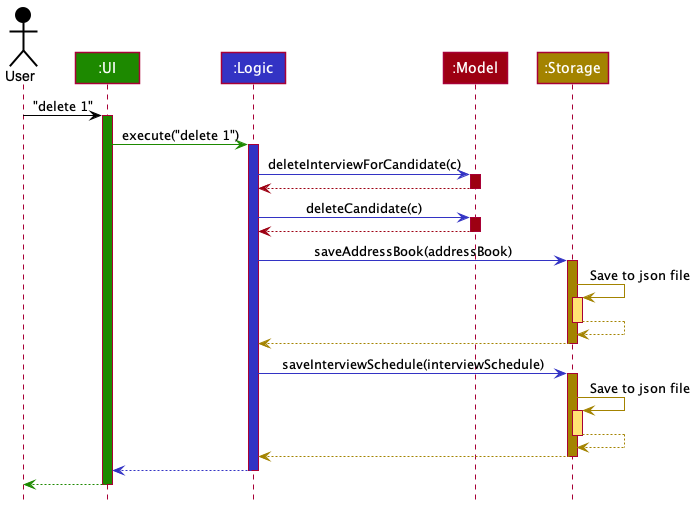
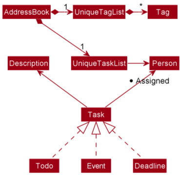
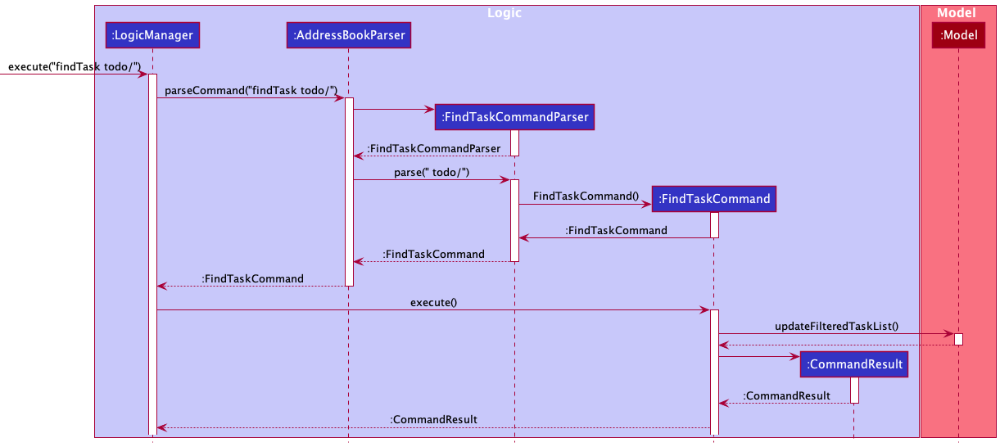
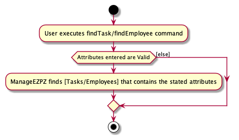

--------------------------------------------------------------------------------------------------------------------

## **Acknowledgements**
* [Documentation idea of splitting the Model component into 2, to prevent cramping of images](https://ay2021s2-cs2103t-t12-4.github.io/tp/DeveloperGuide.html#endpoint-components)

--------------------------------------------------------------------------------------------------------------------

## **Setting up, getting started**

Refer to the guide [_Setting up and getting started_](SettingUp.md).

--------------------------------------------------------------------------------------------------------------------

## **Design**

:bulb: **Tip:** The `.puml` files used to create diagrams in this document can be found in the [diagrams](https://github.com/AY2122S2-CS2103-F11-1/tp/tree/master/docs/diagrams/) folder. Refer to the [_PlantUML Tutorial_ at se-edu/guides](https://se-education.org/guides/tutorials/plantUml.html) to learn how to create and edit diagrams.

### Architecture

The ***Architecture Diagram*** given above explains the high-level design of the App.

Given below is a quick overview of main components and how they interact with each other.

**Main components of the architecture**

**`Main`** has two classes called [`Main`](https://github.com/AY2122S2-CS2103-F11-1/tp/blob/master/src/main/java/manageezpz/Main.java) and [`MainApp`](https://github.com/AY2122S2-CS2103-F11-1/tp/blob/master/src/main/java/manageezpz/MainApp.java). It is responsible for,
* At app launch: Initializes the components in the correct sequence, and connects them up with each other.
* At shut down: Shuts down the components and invokes cleanup methods where necessary.

[**`Commons`**](#common-classes) represents a collection of classes used by multiple other components.

The rest of the App consists of four components.

* [**`UI`**](#ui-component): The UI of the App.
* [**`Logic`**](#logic-component): The command executor.
* [**`Model`**](#model-component): Holds the data of the App in memory.
* [**`Storage`**](#storage-component): Reads data from, and writes data to, the hard disk.

**How the architecture components interact with each other**

The *Sequence Diagram* below shows how the components interact with each other for the scenario where the user issues the command `deleteEmployee 1`.

Each of the four main components (also shown in the diagram above),

* defines its *API* in an `interface` with the same name as the Component.
* implements its functionality using a concrete `{Component Name}Manager` class (which follows the corresponding API `interface` mentioned in the previous point.

For example, the `Logic` component defines its API in the `Logic.java` interface and implements its functionality using the `LogicManager.java` class which follows the `Logic` interface. Other components interact with a given component through its interface rather than the concrete class (reason: to prevent outside component's being coupled to the implementation of a component), as illustrated in the (partial) class diagram below.

The sections below give more details of each component.

### UI component

The **API** of this component is specified in [`Ui.java`](https://github.com/AY2122S2-CS2103-F11-1/tp/blob/master/src/main/java/manageezpz/ui/Ui.java))

The UI consists of a `MainWindow` that is made up of parts e.g.`CommandBox`, `ResultDisplay`, `PersonListPanel`, `TaskListPanel`, `StatusBarFooter` etc. All these, including the `MainWindow`, inherit from the abstract `UiPart` class which captures the commonalities between classes that represent parts of the visible GUI.

The `UI` component uses the JavaFx UI framework. The layout of these UI parts are defined in matching `.fxml` files that are in the `src/main/resources/view` folder. For example, the layout of the [`MainWindow`](https://github.com/AY2122S2-CS2103-F11-1/tp/blob/master/src/main/java/manageezpz/ui/MainWindow.java) is specified in [`MainWindow.fxml`](https://github.com/AY2122S2-CS2103-F11-1/tp/blob/master/src/main/resources/view/MainWindow.fxml).

The `UI` component,

* executes user commands using the `Logic` component.
* listens for changes to `Model` data so that the UI can be updated with the modified data.
* keeps a reference to the `Logic` component, because the `UI` relies on the `Logic` to execute commands.
* depends on some classes in the `Model` component, as it displays `Task` object residing in the `Model`.

### Logic component

**API** : [`Logic.java`](https://github.com/AY2122S2-CS2103-F11-1/tp/blob/master/src/main/java/manageezpz/logic/Logic.java)

Here's a (partial) class diagram of the `Logic` component:

How the `Logic` component works:
1. When `Logic` is called upon to execute a command, it uses the `AddressBookParser` class to parse the user command.
1. This results in a `Command` object (more precisely, an object of one of its subclasses e.g., `AddTodoTaskCommand`) which is executed by the `LogicManager`.
1. The command can communicate with the `Model` when it is executed (e.g. to add a person).
1. The result of the command execution is encapsulated as a `CommandResult` object which is returned back from `Logic`.

The Sequence Diagram below illustrates the interactions within the `Logic` component for the `execute("deleteTask 1")` API call.

:information_source: **Note:** The lifeline for `DeleteTaskCommandParser` should end at the destroy marker (X) but due to a limitation of PlantUML, the lifeline reaches the end of diagram.

Here are the other classes in `Logic` (omitted from the class diagram above) that are used for parsing a user command:

How the parsing works:
* When called upon to parse a user command, the `AddressBookParser` class creates an `XYZCommandParser` (`XYZ` is a placeholder for the specific command name e.g., `AddTodoTaskCommandParser`) which uses the other classes shown above to parse the user command and create a `XYZCommand` object (e.g., `AddTodoTaskCommand`) which the `AddressBookParser` returns back as a `Command` object.
* All `XYZCommandParser` classes (e.g., `AddTodoTaskCommandParser`, `DeleteTaskCommandParser`, ...) inherit from the `Parser` interface so that they can be treated similarly where possible e.g, during testing.

### Model component

**API** : [`Model.java`](https://github.com/AY2122S2-CS2103-F11-1/tp/blob/master/src/main/java/manageezpz/model/Model.java)

The `Model` component,

* stores the address book data i.e., all `Person` objects (which are contained in a `UniquePersonList` object).
* stores the task list data i.e., all `Task` objects (which are contained in a `UniqueTaskList` object).
* stores the currently 'selected' `Person` objects (e.g., results of a search query) as a separate _filtered_ list which is exposed to outsiders as an unmodifiable `ObservableList<Person>` that can be 'observed' e.g. the UI can be bound to this list so that the UI automatically updates when the data in the list change.
* stores the currently 'selected' `Task` objects (e.g., results of a search query) as a separate _filtered_ list which is exposed to outsiders as an unmodifiable `ObservableList<Task>` that can be 'observed' e.g. the UI can be bound to this list so that the UI automatically updates when the data in the list change.
* stores a `UserPref` object that represents the user’s preferences. This is exposed to the outside as a `ReadOnlyUserPref` objects.
* does not depend on any of the other three components (as the `Model` represents data entities of the domain, they should make sense on their own without depending on other components)

:information_source: **Note:** An alternative (arguably, a more OOP) model is given below. It has a `Tag` list in the `TaskList`, which `Task` references. This allows `TaskList` to only require one `Tag` object per unique tag, instead of each `Task` needing their own `Tag` objects. 

### Storage component

**API** : [`Storage.java`](https://github.com/AY2122S2-CS2103-F11-1/tp/blob/master/src/main/java/manageezpz/storage/Storage.java)

The `Storage` component,
* can save both address book data and user preference data in json format, and read them back into corresponding objects.
* inherits from both `AddressBookStorage` and `UserPrefStorage`, which means it can be treated as either one (if only the functionality of only one is needed).
* depends on some classes in the `Model` component (because the `Storage` component's job is to save/retrieve objects that belong to the `Model`)
* `JsonAddressBookStorage` has a `JsonSerializableAddressBook`, which have `JsonAdaptedPerson` and `JsonAdaptedTask` to store and load both Persons and Tasks.

### Common classes

Classes used by multiple components are in the `manageezpz.commons` package.

--------------------------------------------------------------------------------------------------------------------

## **Implementation**

This section describes some noteworthy details on how certain features are implemented.

### **Task Components**
- Added Classes into the model Component to encapsulate a Task.

#### **Implementation**

A `Task`,
- is stored in `uniqueTaskList` of the Model
- can be represented by a `Todo`, `Event`, or `Deadline`

A `Task` contains the following attributes,
1. a `Description`, which represent the details of the Task
2. a `Date`, which represent the day, month and year as specified by a number of the Task
3. a `Time`, which represent the period during the Task exists or happens
4. can be assigned/Tagged to multiple different `Person`
5. a type, to differentiate between the different types of task
6. can be marked/unmarked based on whether the task is done or not.
7. can be assigned to a single `Priority` such as "NONE", "LOW", "MEDIUM" or "HIGH"

#### Design considerations:

#### Aspect: How the components within Task are added or changed
- **Current Choice**: Attributes within `Task` are immutable, meaning that if there is an attribute that has to be edited, a new Task object has to be created.
    * Pros: Concept of Immutability is met, making the code less prone to bugs as all components of an Task object are fixed
    * Cons: Less flexible, more steps needed in editing Task objects
- Alternative 1: Allow certain components within Task, like Time and Date to be mutable
    * Pros: Less overhead as fewer objects are created
    * Cons: Prone to error as a Component might not be correctly changed

### Task Adding feature

#### What is Task Adding feature about?

The Add Task mechanism is facilitated by `AddressBook`. This feature enhances `AddressBook` by allowing to store not only `Person`, but also `Task`. This is stored internally as a `UniquePersonList` and `UniqueTaskList`. Additionally, the feature implements the following operations:

* `AddressBook#addTodo(Todo)` —  Adds the `Todo` Task to `UniqueTaskList`
* `AddressBook#addDeadline(Deadline)` — Adds the `Deadline` Task to `UniqueTaskList`
* `AddressBook#addEvent(Event)` — Adds the `Event` Task to `UniqueTaskList`

For the command, the feature extends `command`, and is implemented as such:
* `addTodo desc/TASK_DESCRIPTION`
* `addDeadline desc/TASK_DESCRIPTION by/DATE TIME`
* `addEvent desc/TASK_DESCRIPTION at/DATE START_TIME END_TIME`

#### Implementation Flow of Task Adding feature

Given below is an example usage scenario and how the Task Adding mechanism behaves at each step.

Note: ManageEZPZ comes with preloaded data, and can be started on a fresh state with the `clear` command.

Step 1. The user launches the application for the first time. ManageEZPZ will be initialized with the preloaded data.

Step 2. The user executes `addTodo desc/Watch Netflix with Mum` command to create a new `Todo` Task.

#### Design considerations:
- The Task adding commands are straight-to-the-point and efficient for users to add Tasks to ManageEZPZ.
- The prefixes allow users to understand what the different types of Task need in order to be created.

#### UML Diagram for Adding Todo Task

The following activity diagram summarizes what happens when a user executes a new `addTodo` command:

### Task Marking feature

#### What is Task Marking feature about?

The Mark Task mechanism is facilitated by `AddressBook`. This feature allows the user to mark a task as done.

For the command, the feature extends `command`, and is implemented as such:
* `markTask INDEX`

#### Implementation Flow of Task Marking feature

Given below is an example usage scenario and how the Mark Task mechanism behaves at each step.

Step 1. The user lists all the task by listing the task with the 'list' command.

Step 2. The user executes `markTask 3` command to mark the task `Meeting with Client` as done.

#### Design considerations

- The user is able to mark a task as done through the index number specified in the list view.

#### UML Diagram for Task Marking

### Task Unmarking feature

#### What is Task Unmarking feature about?

The Unmark Task mechanism is facilitated by `AddressBook`. This feature allows the user to unmark a task, which changes the status back to not done.

For the command, the feature extends `command`, and is implemented as such:
* `unmarkTask INDEX`

#### Implementation Flow of Task Unmarking feature

Given below is an example usage scenario and how the Unmark Task mechanism behaves at each step.

Step 1. The user lists all the task by listing the task with the 'list' command.

Step 2. The user executes `unmark 3` command to unmark the task `Meeting with Client`, which changes the status back to not done.

#### Design considerations

- The user is able to unmark a task, which changes the status back to not done through the index number specified in the list view.

#### UML Diagram for Task Unmarking

### Task Deleting feature

#### What is Task Deleting feature about?

The Delete Task mechanism is facilitated by `AddressBook`. This feature allows the user to delete a task.

For the command, the feature extends `command`, and is implemented as such:
* `deleteTask INDEX`

#### Implementation Flow of Task Deleting feature

Given below is an example usage scenario and how the Delete Task mechanism behaves at each step.

Step 1. The user lists all the task by listing the task with the 'list' command.

Step 2. The user executes `deleteTask 3` command to delete the task `Meeting with Client`.

#### Design considerations

- The user is able to delete a task as through the index number specified in the list view.

#### UML Diagram for Task Deleting

### Editing details of a task

The edit mechanism is facilitated by `EditTaskCommandParser` and `EditTaskCommand`.  
`EditTaskCommandParser.parse()` - parses the input by the user and returns a `EditTaskCommand` object.  
`EditTaskCommand.execute()` - creates a new `Task` object based on the parsed user input and calls `Model.setTask()`
to replace the old `Task` object with the new `Task` object.

The command is as follows: editTask [TASK_INDEX] desc/ [DESC] at/ [TIME] date/ [DATE]

- [TASK_INDEX] must not be empty.
- At least one of [DESC], [TIME] and [DATE] should not be empty.
- desc/ [DESC], at/ [TIME] or date/ [DATE] may be omitted but all of them cannot be omitted at the same time.

Below is a sequence diagram of the editing of a task.

Step 1. The user executes a `editTask 1 desc/ eat` to edit the 1st task in the address book. The `editTask` command
in `AddressBookParser` calls `EditTaskCommandParser.parse()`
and parses the task index which is given as 1 and the task description that the
user wants to edit his task with is parsed as a String with value eat.

If either the description or the date or time was not provided by the user, then the default value
would be an empty String. Otherwise, it would be parsed as a String with value provided by the user.
It is not the responsibility of `EditTaskCommandParser.parse()` to ensure that the input provided by the user is valid.
It will however ensure that a `Task` index is provided and
at least the description or date or time has a corresponding value.

Step 2.  
In `LogicManager`, `EditTaskCommand.execute()` is called. This `EditTaskCommand` object is the one that was returned
by `EditTaskCommandParser.parse()`. Within the `execute()` method,  there are 3 cases to consider.

1. The task is of type Todo.
2. The task is of type Deadline.
3. The task is of type Event.

Each case is being handled separately by its corresponding handler method.

In general, what each handler method will do is to ensure that the input provided
by the user is valid and if so, create a new `Task` object with the given input and
call `model.setTask()` to replace the old `Task` object
with the new `Task` object. If there are some input which is not provided, then the default value would be the
same value as the old `Task` object. If any input is not valid, a `ParseException` is thrown.

For `editTask 1 desc/ eat`, in step 1, we have obtained the task index which is given as 1.
Using `model.getFilteredTaskList().get(index)` we obtain a copy of the task that the user wants to edit.
Next, depending on what type the obtained task is, the corresponding handler method is called.

If the task is of type Todo, then the handler method will create a new `Todo` object with the description value as
"eat", call `model.setTask()` and return a CommandResult showing that the update has been successful.

If the task is of type Deadline, then the handler method will create a new `Deadline` object with the description
value as "eat", and the date and time values set to be the same
values from the copy obtained using `model.getFilteredTaskList().get(index)`. Then, `model.setTask()` is called and
return a CommandResult showing that the update has been successful.

If the task is of type Event, then the handler method will create a new `Event` object with the description
value as "eat", and the date and time values set to be the same
value from the copy obtained using `model.getFilteredTaskList().get(index)`. Then, `model.setTask()` is called and
return a CommandResult showing that the update has been successful.

<b>Note:</b> For the Event type, a String value with two time values corresponding to be the start and end time
separated with an **empty space** must be provided. Other than the time values being valid,
the range between the start and end time must be valid as well. For example, 1700 2000 is valid while 2000 1700 is not.

### Finding tasks and employees features

#### All about this feature

The feature for finding task and employee uses the following two commands:
* `findTask`: Find tasks
* `findEmployee`: Finds employees

`findEmployee` improves on the `find` feature in AB3 where instead on finding persons (on in the case of our project
manageezpz, we now refer persons as employees) based only on their names, we can also find employees based their other
two properties, phone number and email.

`findTask` similarly searches tasks based on any of their attributes (as stated in the task implementation) 
stated by the user.

#### Design of the find feature

The find feature utilizes mainly the following classes:
* Parser: 
  * Check whether the attributes for either task and employees as entered by the user are valid as stated in the `Task`
    and `Person` (class to represent employee) respectively.
  * The first class when user enters `findTask`/`findEmployee`.
  * Parser will first check if at least one attribute is entered.
  * After which, it will check whether the attributes entered are valid as implemented in the `Task` and `Person` method.
  * If the user fails to enter any of the attributes, or enters an invalid attribute, the Parser class will collate all
    the mistakes the user has made as error messages, and it will be shown to the user.
  * Otherwise, the parser will create a predicate by indicating all attributes entered by the user and setting 
    attributes not specified by the user as null (use optional parameter if the programming language used permits).
  * The parser class will then return a command class, using the predicate as the argument.
  * `FindTaskCommandParser` for findTask and `FindEmployeeCommandParser` for findEmployee
* Command:
  * Executes command by showing all tasks/employee based on the attributes specified by the user.
  * `FindTaskCommand` for findTask and `FindEmployeeCommand` for findEmployee
* Predicate:
  * The parser class creates this predicate which will be used to filter tasks/employees based on the attributes given.
  * If the attribute is set to null, it will default to true, otherwise, the predicate will check whether the 
    task/employee has these attributes.
  * The results from the attributes (or true if not specified) are and together to produce the result from the predicate.
  * `TaskMultiplePredicate` for filtering task and `PersonMultiplePredicate` for filtering employees.
  
#### Implementation flow for the find task/employee feature
Given below is the implementation of the find task command when the user enters `findTask priority/HIGH event/`

1. The user input will be sent to `FindTaskCommandParser`
2. `FindTaskCommandParser` will note down that the task type to search for is an event with a high priority.
3. Since the inputs that the user entered is valid, the parser will create a `TaskMultiplePredicate` using priority 
   `high` and task type `event` while setting the rest of the attributes to `null`.
4. The attribute will be used as the argument to create the `FindTaskCommand`
5. When the `FindTaskCommand` executes, the predicate will be sent to the `ModelManager` to filter out tasks that 
   satisfy the predicate.

*The expected result for `findTask priority/HIGH event/`*

*The UML Sequence diagram for `findTask priority/HIGH event/`*

#### Design Consideration
* Allow usage of multiple attributes as search term to filter out tasks/employee that has the specified attributes.
* Useful for finding tasks based on priority and whether it is marked or not.

#### UML Diagram for finding task/employee

### Tagging Task to Employee feature

#### What is Tagging Task to Employee feature about?

The Tag Task mechanism is facilitated by `AddressBook`. 
This feature enhances `AddressBook` by allowing users to assign multiple `Person` to a `Task`. Additionally, the feature implements the following operations:

* `AddressBook#tagTask(Task,Person)` —  Assign `Person` to `Task`
* `AddressBook#untagTask(Task,Person)` —  Deallocate the `Person` from `Task`

For the command, the feature extends `command`, and is implemented as such:
* `tagTask INDEX name/PERSON_NAME`
* `untagTask INDEX name/PERSON_NAME`

#### Implementation Flow of Tagging Task to Employee feature

Given below is an example usage scenario and how the Tagging Task to Employee mechanism behaves at each step.

Note: ManageEZPZ comes with preloaded data, and can be started on a fresh state with the `clear` command.

Step 1. The user launches the application for the first time. ManageEZPZ will be initialized with the preloaded data.

Step 2. The user executes `tagTask 7 n/Alex Yeoh` command to assign `Alex Yeoh` to the 7th `Task`.

#### Design considerations:
- The Tagging commands are efficient for users to assign a `Person` to be in-charge of a `Task`.
- The Prefix allow users to simply input the name of the `Person` from ManageEZPZ.
- Users will be able to see the `Task` assigned to `Person` immediately after tagging.

#### UML Diagram for tagTask Command

The following activity diagram summarizes what happens when a user executes a new `tagTask` command:

--------------------------------------------------------------------------------------------------------------------

## **Documentation, logging, testing, configuration, dev-ops**

* [Documentation guide](Documentation.md)
* [Testing guide](Testing.md)
* [Logging guide](Logging.md)
* [Configuration guide](Configuration.md)
* [DevOps guide](DevOps.md)

--------------------------------------------------------------------------------------------------------------------

## **Appendix: Requirements**

### Product scope

**Target user profile**:

* Company Managers/Supervisors wants to keep track of all the tasks given to their subordinates
* They need to assign tasks to their subordinates as well
* Prefers typing commands instead of clicking buttons
* Needs a local database to store all tasks

**Value proposition**:

* An application to show all the tasks assigned to the employees
* Tasks should be assigned to the employees as well
* Commands are typed using command lines
* All tasks created are stored in the local database

### User stories

Priorities: High (must have) - `* * *`, Medium (nice to have) - `* *`, Low (unlikely to have) - `*`

| Priority | As a …​        | I want to …​                                                               | So that I can…​                                               |
|----------|----------------|----------------------------------------------------------------------------|---------------------------------------------------------------|
| `* * *`  | user           | add a task to the database                                                 | better organise my time                                       |
| `* * *`  | user           | delete a task from the database                                            | better organise my list                                       |
| `* * *`  | user           | view all my tasks                                                          | have a better picture of my schedule                          |
| `* * *`  | user           | able to edit a task                                                        | update any details                                            |
| `* * *`  | user           | able to view my tasks for the day (i.e. today)                             | better manage my time                                         |
| `* * *`  | user           | able to view the tasks for the week                                        | have a better picture of my schedule for the week             |
| `* * *`  | user           | view the tasks on a specific day                                           | plan for that day ahead                                       |
| `* *`    | CEO or manager | have the flexibility to reschedule tasks that are assigned to any employee | better manage the manpower and deadlines                      |
| `* *`    | manager        | retrieve the list of tasks allocated with an employee                      | allow myself to have an overview of the employee's workload.  |
| `* *`    | new user       | have a more beginner-friendly user guide                                   | learn more about the product                                  |

### Use cases

> Definition:
> - For all use cases below, the **System** is `ManageEZPZ` and the **Actor** is the `User`, unless specified otherwise.
> - More specifically, the `User` are **Supervisors and Managers**.

> Guarantees:
> - For any use cases below that changes any data, ManageEZPZ will guarantee that the data is updated and saved.
****

**Use Case 1 - Add Task**

**MSS**

1. User starts up ManageEZPZ 
2. User uses the appropriate command to add Task. 
3. ManageEZPZ adds the task & confirms with a successful message that the task is added.

   Use case ends.

**Extensions**

* 2a. User uses one of the three `add` commands: 
    * 2a1. User uses `addTodo` command 

      Use case resumes from step 3. 

    * 2a2. User uses `addDeadline` command 

      Use case resumes from step 3. 

    * 2a3. User uses `addEvent` command 

      Use case resumes from step 3. 
    
* 2b. User uses Add Task Commands with the wrong syntax

    * 2b1. ManageEZPZ sends an error message to User, indicating the
      format for adding Task is incorrect, attached with the correct syntax format.

      Use case ends.

****

**Use Case 2 - Delete Task**

Guarantees: Deletion of any Task will also result in the removal
            of any Employee association that the Task has.

**MSS**

1. User starts up ManageEZPZ 
2. User uses the appropriate command to delete a Task 
3. ManageEZPZ deletes the Task & confirms with a successful message that the Task is deleted.

   Use case ends.

**Extensions**

* 2a. ManageEZPZ detects an error in the entered data. (Invalid index)
    * 2a1. ManageEZPZ sends an error message to User, indicating the Index used for the delete
      command is incorrect, attached with the correct syntax format.

      Use case ends.

****

**Use Case 3 - List Tasks**

**MSS**

1. User starts up ManageEZPZ 
2. User enters the command to list Tasks.
3. ManageEZPZ displays the all Tasks.

   Use case ends.

**Extensions**

* 2a. User uses list Task commands with the wrong syntax. 
    * 2a1. ManageEZPZ sends an error message to User, that the list
      command is incorrect, attached with the correct syntax format. 

      Use case ends.

****

**Use Case 4 - Mark Tasks**

Preconditions: User is currently using ManageEZPZ.

**MSS**

1. User enters the command to view Tasks.
2. ManageEZPZ displays the Tasks.
3. User wants to mark a Task as finished, enters command to mark Task.
4. ManageEZPZ marks the Task & confirms with a successful message that the task is marked

   Use case ends.

**Extensions**

* 3a. ManageEZPZ detects an error in the entered data. (Invalid Index)

    * 3a1. ManageEZPZ sends an error message to User, indicating the Index used for
      the Mark command is incorrect, attached with the correct syntax format.

      Use Case ends.

****

**Use Case 5 - Unmark Tasks**

Preconditions: User is currently using ManageEZPZ.

**MSS**

1. User enters the command to view Tasks.
2. ManageEZPZ displays the Tasks.
3. User realises that Task is marked as done, but is actually not done.
4. User enters command to unmark Task for the specific Task Number.
5. ManageEZPZ unmarks the Task & confirms with a successful message 
   that the task is unmarked. 

   Use case ends.

**Extensions**

* 4a. ManageEZPZ detects an error in the entered data. (Invalid Index)

    * 4a1. ManageEZPZ sends an error message to User, indicating the Index used for
      the unmark command is incorrect, attached with the correct syntax format.

      Use Case ends.

****

**Use Case 6 - Find Tasks**

**MSS**

1. User starts up ManageEZPZ
2. User enters the command to find Tasks.
3. ManageEZPZ displays the Task(s) which matches the search keyword.

   Use case ends.

**Extensions**

* 2a. User uses one of the three Find Task commands: 

    * 2a1. User uses any of the `findTask` command:
        * `findTask todo/`
        * `findTask deadline/`
        * `findTask event/`
        * With or without the Task type above, the User wants to also get a more 
          filtered search result, User then adds these prefixes as additional
          search terms:
          * `desc/` for Description search.
          * `date/` for Date search.
          * `priority/` for Priority search.
          * `assignees/` for Assignees search.
          * `isMarked/` for finished Tasks Search.

      Use case resumes from step 3. 

* 2b. User uses find Task commands with the wrong syntax

    * 2b1. ManageEZPZ sends an error message to User, indicating syntax used for
      the find Task command is incorrect, attached with the correct syntax format.

      Use Case ends.

****

**Use Case 7 - Edit Tasks**

**MSS**

1. User starts up ManageEZPZ 
2. User enters the command to list Tasks.
3. User realizes that some Tasks have the wrong information.
4. User enters the command to edit the Task(s).
5. ManageEZPZ sends a message to the User indicating that the edit has been successful.

   Use case ends.

**Extensions**

* 4a. User selects a combination of prefixes to edit:
  * `desc/` to edit the Description.
  * `at/` to edit the Time.
  * `date/` to edit the Date.

  Use case resumes from step 5.

* 4b. User uses edit Task commands with the wrong syntax

    * 4b1. ManageEZPZ sends an error message to User, indicating syntax used for
      the edit Task command is incorrect, attached with the correct syntax format.

      Use Case ends.
  
* 4c. User uses edit Task commands with prefix declared but no input value afterwards

    * 4c1. ManageEZPZ sends an error message to User, indicating that User must input a value after a prefix.

      Use Case ends.

****

**Use Case 8 - Add Employee**

Preconditions: User is currently using ManageEZPZ.

**MSS**
1. User wants to add a new Employee, enters command to add Employee.
2. ManageEZPZ adds the Employee & confirms with a successful message that the
   Employee is added to ManageEZPZ.

   Use case ends.

**Extensions**

* 1a. ManageEZPZ detects an error in the entered data. 

    * 1a1. ManageEZPZ sends an error message to User, indicating the
      format for the add Employee command is incorrect, attached with the
      correct syntax format.

      Use Case ends.

****

**Use Case 9 - Deleting Employee**

Preconditions: User is currently using ManageEZPZ.

Guarantees: Deletion of any Employee will also result in the removal 
            of the Employee from the Task(s) that the Employee has been
            assigned to.

**MSS**
1. User wants to delete an existing Employee, enters command to delete Employee.
2. ManageEZPZ deletes the Employee and sends a confirmation message that the
   deletion has been successful.

   Use case ends.

**Extensions**

* 1a. ManageEZPZ detects an error in the entered data.

    * 1a1. ManageEZPZ sends an error message to User, indicating the
      format for delete Employee command is incorrect, attached with the
      correct syntax format.
      
  Use Case ends.

****

**Use Case 10 - Tagging Employee to Task**

Preconditions: User is currently using ManageEZPZ.

**MSS**

1. User enters the command to tag an Employee to a Task.
2. ManageEZPZ assigns the Employee to the Task, and sends a confirmation message 
   to the User that the Employee has been assigned.

   Use case ends.

**Extensions**

* 1a. ManageEZPZ detects an error in the entered data.

    * 1a1. ManageEZPZ sends an error message to User, indicating the
      format for the tag Employee to Task command is incorrect, attached with the
      correct syntax format.
    * 1a2. ManageEZPZ detects that supplied Task Index is not in the Task List, 
      indicating to the User to enter a valid Task number.
    * 1a3. ManageEZPZ detects that Name of Employee is not in the database, 
      indicating to the User to enter a valid Employee Name.

      Use Case ends.

****

**Use Case 11 - Tagging Priority to Tasks**

Preconditions: User is currently using ManageEZPZ.

**MSS**

1. User enters the command to Tag a Priority to a Task.
2. ManageEZPZ tags the appropriate Priority to the Task, and sends a 
   confirmation message to the Priority has been assigned to the Task.

   Use case ends.

**Extensions**

* 1a. ManageEZPZ detects an error in the entered data.

    * 1a1. ManageEZPZ sends an error message to User, indicating the
      format for the add Employee command is incorrect, attached with the
      correct syntax format.
    * 1a2. ManageEZPZ detects that supplied Task Index is not in the Task List,
      indicating to the User to enter a valid Task number.
    * 1a3. ManageEZPZ detects that an invalid Priority that is not one of the four:
      None, Low, Medium, High. ManageEZPZ reminds the User to use a valid
      Priority.

      Use Case ends.

****

**Use Case 12 - Deleting all Entries in ManageEZPZ**

Preconditions: User is currently using ManageEZPZ.

**MSS**

1. User enters the command to clear ManageEZPZ.
2. ManageEZPZ clears all Employee and Task data, sending a confirmation
   message that ManageEZPZ entries are cleared.

   Use case ends.

****

**Use Case 13 - Exit ManageEZPZ**

Preconditions: User is currently using ManageEZPZ.

**MSS**

1. User enters a command to exit ManageEZPZ. 
2. ManageEZPZ saves all changes to disk and closes.

   Use case ends.

****

### Non-Functional Requirements

#### Technical Requirements

1. ManageEZPZ should be able to run on any _mainstream OS_ as long as it has Java `11` or above installed.
2. ManageEZPZ should work on both 32-bit and 64-bit environments.
3. ManageEZPZ should be able to store and retrieve task data from File.
4. ManageEZPZ must occupy as little storage as possible.
5. ManageEZPZ should be backward compatible with data produced by earlier versions of itself.

#### Performance Requirements

1. ManageEZPZ should respond within two seconds for any queries.
    * ManageEZPZ should be closed/terminated within 2 seconds.
2. ManageEZPZ should work well under both normal and high workloads.
3. ManageEZPZ should be scalable.
4. ManageEZPZ should be able to load huge amounts of data in a short amount of time.

#### Quality Requirements

1. ManageEZPZ should be easy to use by a novice.
2. ManageEZPZ should be in English.
3. The UI and fonts used in ManageEZPZ should be big enough for senior managers/supervisors.

#### Process Requirements

1. ManageEZPZ is expected to adhere to a schedule that delivers a feature set every 2 weeks.
2. Updates to ManageEZPZ should be able to roll out to existing clients remotely.

#### Other Noteworthy Points

1. ManageEZPZ should not be used to support management of illegal activities.

### Glossary

| Terms             | Meaning                                                                    |
|:------------------|:---------------------------------------------------------------------------|
| **Mainstream OS** | Windows, Linux, Unix, OS-X                                                 |
| **Users**         | Applies to both managers or supervisors                                    |
| **command**       | A message sent as an input from User, that coincides with our Command List |
| **Person**        | An employee

--------------------------------------------------------------------------------------------------------------------

## **Appendix: Instructions for manual testing**

Given below are instructions to test the app manually.

:information_source: **Note:** These instructions only provide a starting point for testers to work on;
testers are expected to do more *exploratory* testing.

### Launch and shutdown

1. Test case : Initial launch
   1. [Download](https://github.com/AY2122S2-CS2103-F11-1/tp/releases) the jar file and copy into an empty folder
   2. Double-click the jar file   
      Expected: Shows the GUI with a set of sample Employees and Tasks. The window size may not be optimum.

2. Test case : Saving window preferences
   1. Resize the window to an optimum size. Move the window to a different location. Close the window.
   2. Re-launch the app by double-clicking the jar file. 
      Expected: The most recent window size and location is retained.
   

3. Test case : Shutdown
    1. Click the cross button at top right side of window for WindowsOS, and top left side of window for MacOS.
   
    2. Type `exit` command in the command box in GUI.
       Expected: The programs stops executing and closes.

### Adding an employee

1. Adding an employee while all employees are being shown

    1. Prerequisites: List all employee using the `listEmployee` command. Multiple employees in the list.

    2. Test case: `addEmployee n/Peter Tan p/97852145 e/PeterTan@gmail.com` 
       Expected: A new `Employee` is added to the end of the list. Details of the newly added `Deadline` shown in the status message. GUI immediately updates to show the newly added `Employee`.

    3. Test case: `addEmployee n/Peter Tan` 
       Expected: No employee is added. Error details shown in the status message. GUI remains the same.

    4. Other incorrect delete commands to try: `addEmployee p/98451254`, `addEmployee e/PeterTan@gmail.com`, `addEmployee n/Peter p/85245127` 
       Expected: Similar to previous.

### Listing all employees

1. List down all employees
    1. Prerequisites: Filter employees using `findEmployee` command.
    2. Test Case: `listEmployee` 
       Expected: Shows all the employees in ManageEZPZ

### Finding employees

1. Find employees with the given predicate

    1. Prerequisites: List all employees using the `listEmployee` command.

    2. Test case: `findEmployee` 
       Expected: Error showing that at least an option is needed.

    3. Valid test cases to try: `findEmployee n/Alice`, `findEmployee p/999`, `...` (So long as the task attribute are
       valid) 
       Expected: All employees with the specified attributes will be listed.

    4. Other invalid test cases to try: `findEmployee someOtherPrefix/`, `findEmployee n/Jame$`, `...` (So long as the
       attribute are invalid) 
       Expected: Error showing which attributes are entered wrongly.

### Deleting an employee

1. Deleting an employee while all employee are being shown

    1. Prerequisites: List all employee using the `listEmployee` command. Multiple employees in the list.

    1. Test case: `deleteEmployee 1` 
       Expected: First employee is deleted from the list. Details of the deleted employee shown in the status message. GUI immediately updates to show the employee is deleted.
    
    1. Test case: `deleteEmployee 0` 
       Expected: No employee is deleted. Error details shown in the status message. GUI remains the same.

    1. Other incorrect delete commands to try: `deleteEmployee`, `deleteEmployee x`, `...` (where x is larger than the list size) 
       Expected: Similar to previous.

### Adding a Task (Deadline)
1. Adding a `Deadline`
2. Prerequisites: None.

3. Test case : Adding a valid deadline
    1. Command: `addDeadline desc/Testing by/2020-08-08 1800`  
       Expected: A new `Deadline` is added to the end of the list. Details of the newly added `Deadline` shown in the status message. GUI immediately updates to show the newly added `Deadline`.

4. Test case : invalid date
    1. Command: `addDeadline desc/Testing by/0000-14-08 1800` 
       Expected: No `deadline` is added. Error details shown in the status message. GUI stays the same.

5. Test case : invalid time
    1. Command: `addDeadline desc/Testing by/2020-12-08 6000` 
       Expected: No `deadline` is added. Error details shown in the status message. GUI stays the same.

6. Other incorrect addDeadline commands to try: `addDeadline desc/`, `addDeadline desc/Testing by/` 
   Expected: Similar to previous.

### Listing all tasks

1. List down all tasks
    1. Prerequisites: Filter tasks using `findTask` command.
    2. Test Case: `listTask` 
       Expected: Shows all the tasks in ManageEZPZ

### Finding tasks
1. Prerequisites: None, but if the task list is empty, all searches will lead to no results.
2. List all task using the `listTask` command.
3. Test case : Find by a single keyword.
    1. Command `findTask todo/`  
       Expected: Task list will show all tasks that are of type `todo`. Find task details shown in status message. GUI immediately updates to show only `todo` type tasks.
    2. Command `findTask desc/report`  
       Expected: Task list will show all tasks that have the description of `report`. Find task details shown in status message. GUI immediately updates to show all task with description `report`.

4. Test case : Find by multiple keywords.
    1. Command: `findTask deadline/ desc/report`  
       Expected: Task list will show all task with type `deadline` & description of `report`. Find task details shown in status message. GUI immediately updates to show all task of type `deadline` with description `report`.
    2. Command : `findTask deadline/ date/2022-05-05`  
       Expected: Task list will show all task with type `deadline` & date of `2022-05-05`. Find task details shown in status message. GUI immediately updates to show all task of type `deadline` with date `2020-05-05`.

5. test case : Invalid command formats.
    1. Command: `findTask`  
       Expected: No task would be found. Error details shown in status message. GUI stays the same.
    2. Other incorrect findTask commands to try: `findTask todo/ deadline/`, `findTask isMarked/maybe`  
       Expected: Similar to previous.

### Editing a task
1. Prerequisites: None.
2. List all task using the `listTask` command.
3. Test case : Edit task description
    1. Condition: the edited task description must not already exist in the task list.
    2. Command: `editTask 1 desc/Complete Sales Report` 
       Expected: Description of Task at index 1 is changed to `Complete Sales Report`. Edited task details shown in status message. GUI immediately updates to show newly edited Task.

4. Test case : Edit task time
    1. Condition : The task to be edited must be of either `Deadline` or `Event` type.
    2. Command: `editTask 1 at/1700` 
       Expected: Time of Task at index 1 is changed to `1700`. Edited task details shown in status message. GUI immediately updates to show newly edited Task.

5. Test case : Edit task date
    1. Condition : The task to be edited must be of either `Deadline` or `Event` type.
    2. Command: `editTask 1 date/2022-02-05` 
       Expected: Date of Task at index 1 is changed to `2022-02-05`. Edited task details shown in status message. GUI immediately updates to show newly edited Task.

6. Test case : Invalid edit index
    1. Condition : index provided exceeds the task list size or index are not positive.
    2. Command: `editTask 0 at/1700`, `editTask -4 date/2022-02-05`, `editTask <int_greater_than_size_of_list> desc/Complete Sales Report`  
       Expected: No task is edited. Error details shown in the status message. GUI stays the same.

7. Other incorrect editTask commands to try: `editTask 1 desc/`, `editTask 1 date/0000-01-01`, `editTask 1 time/2549`  
   Expected: Similar to previous.

### Marking a Task
1. Prerequisites: None.
2. List all task using the `listTask` command.
3. Test case : Marking a valid task.
   1. Condition : None.
   2. Command: `markTask 1`  
      Expected: Task at index 1 is marked as done. Edited task details shown in status message. GUI immediately updates status from not done to done.

4. Test case : Invalid mark index
   1. Condition : index provided exceeds the task list size or index are not positive.
   2. Command: `markTask 0`, `markTask -4`, `markTask <int_greater_than_size_of_list>`  
      Expected: No task marked. Error details shown in the status message. GUI stays the same.

### Deleting a Task
1. Prerequisites: List all tasks using the `listTask` command. Multiple tasks in the list.

2. Test case: `deleteTask 1` 
   Expected: First task is deleted from the list. Details of the deleted task shown in the status message. GUI immediately updates to show that the task is deleted.

3. Test case: `deleteTask 0` 
   Expected: No task is deleted. Error details shown in the status message. GUI remains the same.

4. Other incorrect delete commands to try: `deleteTask `, `deleteTask x`, `...` (where x is larger than the list size) 
   Expected: Similar to previous.

### Tagging a task to an Employee
1. Prerequisites: None, but if the task list or employee list is empty, all tagging will lead to an error.
2. List all task using the `listTask` command.
3. List all employee using the `listEmployee` command.
4. Test case : valid Task & valid Employee
   1. Command: `tagTask 1 n/ Alex Yeoh`  
      Expected: Tags the Task at index 1 to Alex Yeoh. Tagged task details shown in status message. GUI immediately updates assignees field of the task at index 1.

5. Test case : invalid tag index
   1. Condition : index provided exceeds the task list size or index are not positive. 
   2. Command: `tagTask 0 n/ Alex Yeoh`, `tagTask -4 n/ Alex Yeoh`, `tagTask <int_greater_than_size_of_list> n/ Alex Yeoh`  
   Expected: No task tagged. Error details shown in the status message. GUI stays the same.

6. Test case : valid Task & invalid Employee
    1. Condition : employee provided not in the employee list.
    2. Command: `tagTask 1 n/Alex Yeog`  
       Expected: Similar to previous.

7. Other incorrect tagTask commands to try: `tagTask 1 n/`, `tagTask 1 n/ Alex`(Full name not used)  
   Expected: Similar to previous.

### Tagging a priority to a Task.
1. Prerequisites: None, but if the task list is empty, all tagging will lead to an error.
2. List all task using the `listTask` command.
3. Test case : Valid Priority
   1. Command: `tagPriority 1 priority/HIGH`  
      Expected: Tags the Task at index 1 to priority of HIGH. Tagged task details shown in status message. GUI immediately updates priority fields of the task at index 1.
   

4. Test case : Invalid tag index
   1. Condition : index provided exceeds the task list size or index are not positive.
   2. Command: `tagPriority 1 priority/HIGH`, `tagPriority -4 priority/HIGH`, `tagTask <int_greater_than_size_of_list> priority/HIGH`  
      Expected: No task tagged. Error details shown in the status message. GUI stays the same.

5. Test case : Invalid Priority
    2. Command: `tagPriority 1 priority/Important`  
       Expected: Similar to previous.

### Saving data

1. Dealing with corrupted data files

    1. Test case : `ManageEZPZ.json` is edited incorrectly while the program is running.  
       Expected: No issues caused. Upon closing and re-launching the program, `ManageEZPZ.json` will be updated to an empty json file.

2. Dealing with missing data files
   1. Prerequisites : JSON file is missing.
       1. Delete the `data/ManageEZPZ.json` to simulate the missing json file.
       2. Relaunch the program.  
       Expected: ManageEZPZ starts with a default json list containing default Employees and Tasks.

3. Saving data between sessions
   1. Launch the program.
   2. Modify the Employee list or Task list by using any commands that will affect the out come of both lists.
   3. Relaunch the app.  
      Expected: ManageEZPZ would retain the recent changes.

## **Appendix: Effort**

**Difficulty Level** :

While AB3 deals with only one entity type, `Persons`, ManageEZPZ deals with multiple entity types, including `Todos`, `Deadlines`, `Events` and `Tasks`.
The inclusion of the Task model has definitely increased the functionality but at the same time the difficulty of the project when compared to AB3 which 
only had the `Persons` model.

**Challenges faced** :

As more features were implemented, we faced challenges that arose from the dependencies between the `Person` and `Tasks` classes in order to make ManageEZPZ's functionalities more user-centric and convenient for users (e.g. Deleting an Employee also results in deletion of an assignee from the task that was assigned to the employee and vice versa where Deleting a Task results in the decrement of the total number of task assigned to an Employee.)
Many of the bugs we encountered at the beginning of the project were also due to unfamiliarity with the code base and having to unearth the many layers of AB3, but as time went by, identified bugs have been resolved to result in the ManageEZPZ application today.

**Effort Required** :

Our MangeEZPZ Team has also spent a considerable amount of effort on the UI aspect, from choosing the position of the additional Task list (ultimately settling on a split UI), to the different pictures and colour scheme that was used to represent the different fields such as done/not done, priority, etc. So that it is the most appropriate to our users. 
