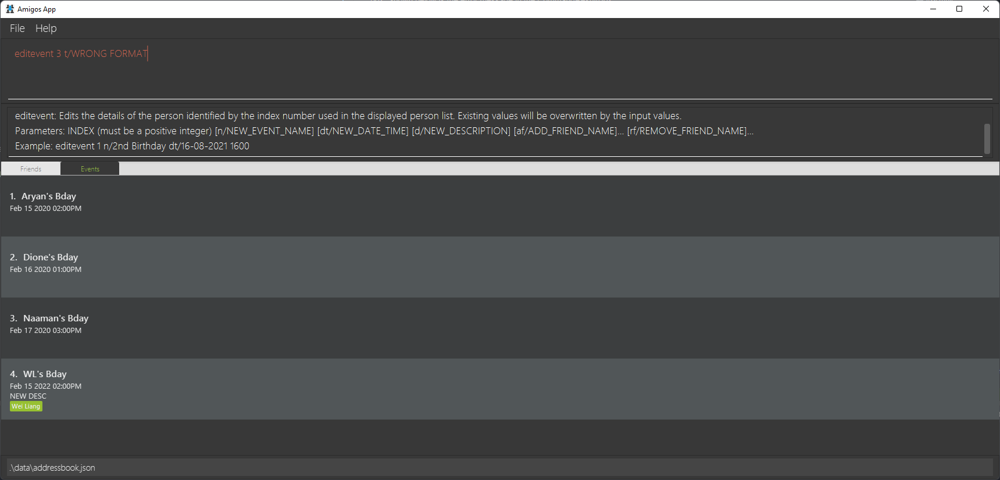

* Table of Contents
  {:toc}

--------------------------------------------------------------------------------------------------------------------

## **Start up**

On start up the Application should open with the friends tabs selected by default, and all the friends in storage being displayed if any. An image of this is shown below.

## **Clearing Address Book**

To start fresh with a new clean version of Amigos the `clear` command needs to be typed in the CommandBox as shown below. This should update the application to have no events and friends and also switch to the friends tab.

|                      Before                       |                        After                        |
|:-------------------------------------------------:|:---------------------------------------------------:|
|     |     |

## **Commands**

### Friends

Do note that after the execution of any friend related commands, the GUI should switch to the `Friends` tab

#### Add Friend

Upon successful adding of a friend

1. Correct Command result display message
2. Friend should be added and should be ordered by name

|                       Before                        |                       After                       |
|:---------------------------------------------------:|:-------------------------------------------------:|
|     |     |

As you can see in the above images `Naaman` was inserted in the correct order with the appropriate command result message displayed in the CommandResult box.

If incorrect format of add command is entered, the appropriate add friend error message should be displayed in the CommandResult box. Shown below is the error message in the CommandResultBox.

#### Edit a friend

Upon successful editing of a friend

1. Correct Command result display message
2. Friend should be edited and if name is changed, list should be reordered

|                       Before                       |                      After                       |
|:--------------------------------------------------:|:------------------------------------------------:|
|  |  |

As you can see in the above images `Naaman` was edited to `Bean` and the list was reordered. The appropriate command result message displayed was also in the CommandResult box.

If incorrect format of edit command is entered, the appropriate edit friend error message should be displayed in the CommandResult box. Shown below is the error message in the CommandResultBox.

#### Deleting a friend

Upon successful deletion of a friend

1. Correct Command result display message
2. Friend card should be removed from the GUI

|                         Before                         |                          After                           |
|:------------------------------------------------------:|:--------------------------------------------------------:|
|  |  |

As you can see in the above images `Bean` was deleted with the appropriate command result message displayed in the CommandResult box.

If incorrect format of delete command is entered, the appropriate delete friend error message should be displayed in the CommandResult box. Shown below is the error message in the CommandResultBox.

#### Show a specific friend

Upon successful execution of `showfriend` command the following must occur

1. Correct Command result display message
2. Expanded Friend card of friend requested should be displayed

|                             Before                             |                            After                             |
|:--------------------------------------------------------------:|:------------------------------------------------------------:|
|  |  |

As you can see in the above images `Bean` was deleted with the appropriate command result message displayed in the CommandResult box.

If incorrect format of delete command is entered, the appropriate delete friend error message should be displayed in the CommandResult box. Shown below is the error message in the CommandResultBox.

#### Show all friends

Upon successful execution of `showfriends` command the following must occur

1. Friends tab is selected and displayed
2. All the friends in Amigos are displayed

|                              Before                              |                             After                              |
|:----------------------------------------------------------------:|:--------------------------------------------------------------:|
|  |  |

#### Find a friend

Upon successful execution of `findfriend` command the following must occur

1. Correct Command result display message
2. Any friends who match the search criteria are displayed

|                             Before                             |                            After                             |
|:--------------------------------------------------------------:|:------------------------------------------------------------:|
|  |  |

As you can see in the above images `findfriend dio` was executed and since `Dione` matches, her card is displayed.

### Events

Do note that after the execution of any event related commands, the GUI should switch to the `Events` tab

#### Add Event

Upon successful adding of an event

1. Correct Command result display message
2. Event should be added and should be ordered by date

|                           Before                           |                          After                           |
|:----------------------------------------------------------:|:--------------------------------------------------------:|
|  |  |

As you can see in the above images `WL's Bday` was inserted in the correct order with the appropriate command result message displayed in the CommandResult box.

If incorrect format of `addevent` command is entered, the appropriate error message should be displayed in the CommandResult box. Shown below is the error message in the CommandResultBox.

#### Edit an event

Upon successful editing of an event

1. Correct Command result display message
2. Event should be edited and if date is changed, list should be reordered

|                            Before                            |                           After                            |
|:------------------------------------------------------------:|:----------------------------------------------------------:|
|  |  |

As you can see in the above images `WL's Bday` date was edited to a later date, thus the list was reordered. The appropriate command result message displayed was also in the CommandResult box.

If incorrect format of edit command is entered, the appropriate edit friend error message should be displayed in the CommandResult box. Shown below is the error message in the CommandResultBox.

#### Deleting an event

Upon successful deletion of an event

1. Correct Command result display message
2. Event card should be removed from the GUI

|                              Before                              |                               After                                |
|:----------------------------------------------------------------:|:------------------------------------------------------------------:|
|  |  |

As you can see in the above images `Dione's Bday` was deleted with the appropriate command result message displayed in the CommandResult box.

If incorrect format of `deleteevent` command is entered, the appropriate delete event error message should be displayed in the CommandResult box. Shown below is the error message in the CommandResultBox.

#### Show all events

Upon successful execution of `showevents` command the following must occur

1. Events tab is selected and displayed
2. All the Events in Amigos are displayed

|                             Before                             |                            After                             |
|:--------------------------------------------------------------:|:------------------------------------------------------------:|
|  |  |

#### Find an event

Upon successful execution of `findevent` command the following must occur

1. Correct Command result display message
2. Any friends who match the search criteria are displayed

|                            Before                            |                           After                            |
|:------------------------------------------------------------:|:----------------------------------------------------------:|
|  |  |

As you can see in the above images `findfriend n/Naa` was executed and since `Naaman's Bday` matches, that event card is displayed.

If incorrect format of `findevent` command is entered, the appropriate find event error message should be displayed in the CommandResult box. Shown below is the error message in the CommandResultBox.

### Logs

Do note that after the execution of any log related commands, the GUI should switch to the `Friends` tab

#### Add Log

Upon successful adding of a log

1. Correct Command result display message
2. Log should be added and title should be displayed in the friend's card

|                         Before                         |                        After                         |
|:------------------------------------------------------:|:----------------------------------------------------:|
|  |  |

As you can see in the above images `First Log!` was inserted in the correct order with the appropriate command result message displayed in the CommandResult box.

If incorrect format of `addlog` command is entered, the appropriate error message should be displayed in the CommandResult box. Shown below is the error message in the CommandResultBox.

#### Edit log

Upon successful editing of a log

1. Correct Command result display message
2. Log should be edited and the changes should be reflected in the GUI

|                          Before                          |                         After                          |
|:--------------------------------------------------------:|:------------------------------------------------------:|
|  |  |

As you can see in the above images `Second Log!` was edited to `Edit Log New Title`. The appropriate command result message displayed was also in the CommandResult box.

If incorrect format of edit command is entered, the appropriate edit friend error message should be displayed in the CommandResult box. Shown below is the error message in the CommandResultBox.

#### Delete a log

Upon successful deletion of a log

1. Correct Command result display message
2. Log title should be removed from the friend card should in the GUI

|                            Before                            |                             After                              |
|:------------------------------------------------------------:|:--------------------------------------------------------------:|
|  |  |

As you can see in the above images `Edit Log New Title` was deleted with the appropriate command result message displayed in the CommandResult box.

If incorrect format of `deletelog` command is entered, the appropriate delete log error message should be displayed in the CommandResult box. Shown below is the error message in the CommandResultBox.

### Help command

Upon successful execution of the `help` command a pop-up with the link to the user guide is displayed.

Below is an image showing the correct execution of the help command

## **Stress tests**

### Large number of Friends

Tested application with 500 friends, able to run commands very quickly well within the requirements.

### Large number of Events

Tested application with 500 events, able to run commands very quickly well within the requirements.

### Large number of logs

Tested application with 500 logs, able to run commands very quickly well within the requirements.

