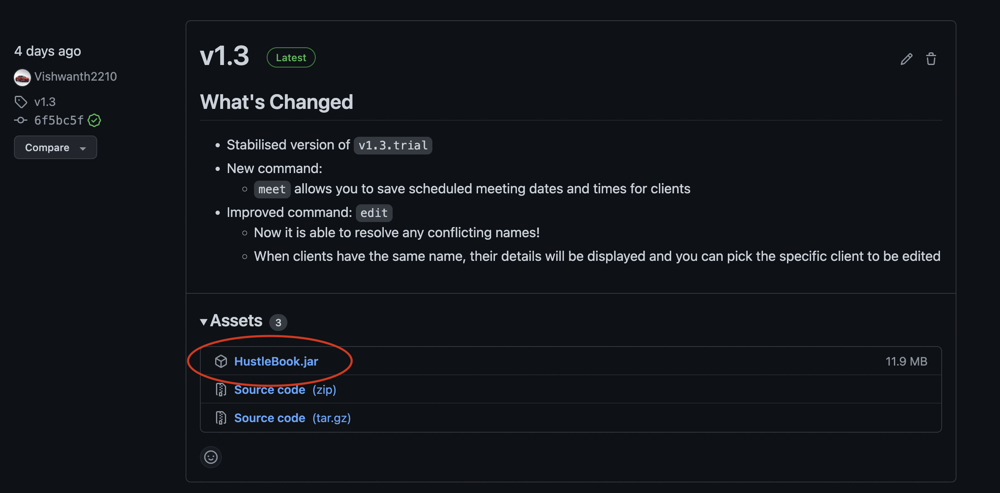

## What is HustleBook?

HustleBook is a desktop app specially catered towards financial advisors for **managing client details** and 
**scheduling meetings efficiently** without the need to lift your hands off the keyboard.
If you prefer typing (and can type fast), HustleBook will save your time and transform how you manage your clients. 

Get started now by following a step-by-step tutorial in under 10 minutes.

--------------------------------------------------------------------------------------------------------------------

## Get Started

1. HustleBook requires `Java 11` or above installed in your Computer. [What's this?](https://www.oracle.com/java/)

2. Download the latest `HustleBook` [here](https://github.com/AY2122S2-CS2103T-W15-2/tp/releases/).
   
3. Place the file into a folder where you would like to keep it. We recommend keeping it in your `Desktop` for easier access.

4. Double-click the file to start the app. The app should look identical as shown below. 
   

5. That's it. Your HustleBook is ready to go! 🎉

6. Feel free to type `help` in the command box highlighted in yellow and explore HustleBook on your own or 
continue reading our [guide](https://ay2122s2-cs2103t-w15-2.github.io/tp/UserGuide.html#features) to find out everything that HustleBook can offer.

--------------------------------------------------------------------------------------------------------------------

### Contact Us 📧

We would love to hear your feedback on HustleBook. We are consistently developing and improving HustleBook to 
match your needs. 

Feel free to drop us an email at _feedback@hustlebook.com_ on your thoughts! 
