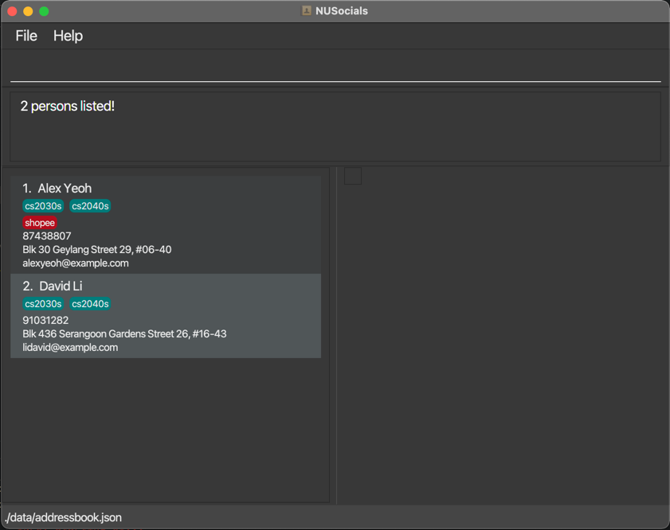
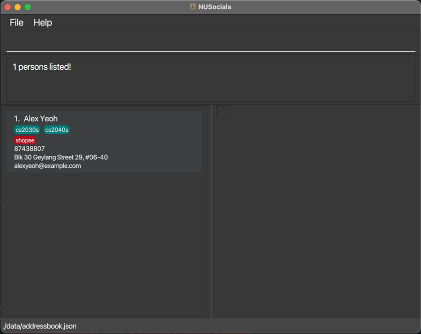

NUSocials is a **desktop app for university students to maintain a professional contact list, optimized for use via a Command Line Interface** (CLI) while still having the benefits of a Graphical User Interface (GUI). The value of the app is to facilitate a convenient way for university students to manage their professional networks with fellow acquaintances.

* Table of Contents
  {:toc}

--------------------------------------------------------------------------------------------------------------------

## Quick start

1. Ensure you have Java `11` or above installed in your Computer.

2. Download the latest `nusocials.jar` from [here]() [coming soon].

3. Copy the file to the folder you want to use as the _home folder_ for NUSocials.

4. Double-click the file to start the app. The GUI similar to the below should appear in a few seconds. Note how the app contains some sample data. 
   

5. Type the command in the command box and press Enter to execute it. e.g. typing **`help`** and pressing Enter will open the help window. 
   Some example commands you can try:

    * **`list`** Lists all contacts.

    * **`add`**`n/fred p/99998888 e/fred@example.com a/fred street, block 123, #01-01` Adds a contact named `fred` to the Address Book.

    * **`tag`** `2 edu/computer science m/CS2040S` Tags the 2nd contact shown in the current list with a Computer Science degree and CS2040S module.

    * **`removetag`**`2 m/cs2100 i/Shopee` Removes the specified tags of the 2nd contact shown in the current list.
    
    * **`edit`**`2 n/Alice edu/computer engineering m/cs2100` Edits the name to `Alice`, overwrites both the education and module tag to `computer engineering` and `cs2100` respectively.  
    
    * **`event`** `name/Lunch appointment info/Having lunch at Hai Di Lao d/2023-11-15 t/23:19`
      
    * **`cancelevent`**`1` Deletes the 1st event shown in the current event list.

    * **`cancelevent`**`1 4` Deletes the 1st and fourth event shown in the current event list.

    * **`delete`**`3` Deletes the 3rd contact shown in the current list.

    * **`delete`**`3 5` Deletes the 3rd and 5th contact shown in the current list.

    * **`find`**`n/fred` Finds persons that match the name 'fred'.

    * **`find -s`**`n/fred m/cs2040s edu/computer science` Finds persons that match the name 'fred' AND takes the module 'cs2040s' AND is studying 'computer science'.

    * **`find -e`**`name/lunch info/lunch at UTown dt/2022-05-05 12:00` Finds events that match the name 'lunch' OR the info 'lunch at UTown' OR the date and time '2022-05-05 12:00'

    * **`clear`** Deletes all contacts.

    * **`exit`** Exits the app.

7. Refer to the [Features](#features) below for details of each command.

--------------------------------------------------------------------------------------------------------------------

## Features

**:information_source: Notes about the command format:** 

* Words in `UPPER_CASE` are mandatory parameters to be supplied by the user. 
  e.g. in `add n/NAME`, `NAME` is a parameter which can be used as `add n/Kim Lai`.

* Items in square brackets are optional. 
  e.g `n/NAME [edu/EDUCATION]` can be used as `n/Kim Lai edu/computer science` or as `n/Kim Lai`.

* Items with `…`​ after them can be used multiple times including zero times. 
  e.g. `[m/MODULES]…​` can be used as ` ` (i.e. 0 times), `m/CS2040S`, `m/CS2030S m/CS2100` etc.

* If a parameter is expected only once in the command but you specified it multiple times, only the last occurrence of the parameter will be taken. 
  e.g. if you specify `p/12345678 p/87654321`, only `p/87654321` will be taken.
*
* Parameters can be in any order. 
  e.g. if the command specifies `n/NAME p/PHONE_NUMBER`, `p/PHONE_NUMBER n/NAME` is also acceptable.

* All commands are case-sensitive.

### Viewing help : `help`

Shows a message explaining how to access the help page.

Format: `help`

### Listing all persons : `list`
Shows a list of all persons in the address book.

Format: `list`

* All existing persons are automatically rendered when the application is launched
* The different tags are listed as follows: yellow for education, blue for modules, orange for CCAs and red for internships
* Personal details are listed in the following order: Phone number, Address, Email

### Adding a person: `add`
Adds a person to the address book.

Format: `add n/NAME p/PHONE_NUMBER e/EMAIL a/ADDRESS`

Examples:
* `add n/Kim Lai p/12345678 e/kimlai222@example.com a/KL street, block 123, #01-01`

### Tagging a person: `tag`
Tags additional information to an existing contact.

Format: `tag INDEX [i/INTERNSHIP]…​ [m/MODULES]…​ [c/CCA]…​ [edu/EDUCATION]…​`

* Tags the person at the specified `INDEX`. The index refers to the index number shown in the displayed person list. The index **must be a positive integer** 1, 2, 3, …​
* At least one of the prefixes must be provided.
* If a prefix is used, the input after must not be blank.
* Input tag values will be accumulated to the existing tags.

Examples:
* `tag 1 i/abc-company m/CS2100 m/CS2030S` Tags the internship company and 2 modules to the 1st person.

### Removing specific tags from person: `removetag`
Removes the specific tags of an existing contact.

Format: `removetag INDEX [i/INTERNSHIP]…​ [m/MODULES]…​ [c/CCA]…​ [edu/EDUCATION]…​`

* Removes the tags from the person at the specified `INDEX`. The index refers to the index number shown in the displayed person list. The index **must be a positive integer** 1, 2, 3, …​
* At least one of the prefixes must be provided.
* If a prefix is used, the input after must not be blank.
* All arguments for tags provided must be an exact match to existing tags.
* Input tag values will be removed from the existing tags.

Examples:
* `removetag 1 i/abc-company m/CS2100 m/CS2030S` Removes the internship company and 2 modules tags from the 1st person.

### Editing a person : `edit`

Edits an existing person in the address book.

Format: `edit INDEX [n/NAME] [p/PHONE] [e/EMAIL] [a/ADDRESS] [i/INTERNSHIP]…​ [m/MODULES]…​ [c/CCA]…​ [edu/EDUCATION]…​`

* Edits the person at the specified `INDEX`. The index refers to the index number shown in the displayed person list. The index **must be a positive integer** 1, 2, 3, …​
* At least one of the optional fields must be provided.
* Existing values will be updated to the input values.
* You can remove the person’s respective tags by typing `i/`, `m/`, `c/`, `edu/` without
  specifying any tags after it.

Examples:
* `edit 1 p/91234567 e/KL123@example.com` Edits the phone number and email address of the 1st person to be `91234567` and `KL123@example.com` respectively.
* `edit 2 m/CS2040s` Clears all module tags of the 2nd person and tag `CS2040s` as a module.
* `edit 2 edu/ m/` Clears all education and module tags of the 2nd person.

### Adding an event: `event`
Adds an event into the address book.

Format: `event INDEX…​ name/EVENT NAME info/EVENT DETAILS d/DATE t/TIME`

* Tags the participating persons to the events based on the specified `INDEX…​`. The index refers to the index number shown in the displayed person list. The index **must be a positive integer** 1, 2, 3, …​
* All fields must be provided.
* Argument provided for `DATE` has to be in the format of `yyyy-MM-dd`.
* Argument provided for `TIME` has to be in the format of `HH:mm`.
* Arguments for `DATE` and `TIME` has to be valid (i.e Date and Time specified must be after the current date and time)
* `EVENT NAME` has a limit of 100 characters.
* `EVENT DETAILS` has a limit of 300 characters.

Examples:
* `event 1 2 name/lunch appointment info/Having lunch at Hai Di Lao VivoCity d/2022-10-20 t/12:15` Creates the Event and adds into the address book.

### Cancelling an event : `cancelevent`

Deletes the specified event from the address book.

Format: `cancelevent INDEX`

* Deletes the event at the specified `INDEX`.
* The index refers to the index number shown in the displayed event list.
* The index **must be a positive integer** 1, 2, 3, …​

Examples:
* `list` followed by `cancelevent 2` deletes the 2nd event in the address book.

Alternate Format: `cancelevent INDEX…​`

* Deletes multiple events at the specified `INDEX`'s.
* The index refers to the index number shown in the displayed event list.
* The index **must be a positive integer** 1, 2, 3, …​
* Each index **must be separated by a whitespace**

Examples:
* `list` followed by `cancelevent 2 5 7` deletes the 2nd, 5th and 7th events in the address book.

### Deleting a person : `delete`

Deletes the specified person from the address book.

Format: `delete INDEX`

* Deletes the person at the specified `INDEX`.
* The index refers to the index number shown in the displayed person list.
* The index **must be a positive integer** 1, 2, 3, …​

Examples:
* `list` followed by `delete 2` deletes the 2nd person in the address book.
* `find Betsy` followed by `delete 1` deletes the 1st person in the results of the `find` command.

Alternate Format: `delete INDEX…​`

* Deletes multiple persons at the specified `INDEX`'s.
* The index refers to the index number shown in the displayed person list.
* The index **must be a positive integer** 1, 2, 3, …​
* Each index **must be separated by a whitespace**

Examples:
* `list` followed by `delete 2 5 7` deletes the 2nd, 5th and 7th person in the address book.

### Locating persons: `find`

Finds persons that match any of the given fields and tags.

Format: `find [n/NAME]…​ [i/INTERNSHIP]…​ [m/MODULES]…​ [c/CCA]…​ [edu/EDUCATION]…​`

* The search is case-insensitive. e.g `hans` will match `Hans`
* At least one of the optional fields must be provided.
* Only full words will be matched e.g. `Han` will not match `Hans`
* Persons matching at least one of the field will be returned (i.e. `OR` search).
* Persons matching at least one tag of a particular type of tag will be returned.  
  For example: 
  `find m/cs2030s m/cs2040s` returns anyone tagged with either `cs2030s` or `cs2040s` or both  
  `find n/Hans m/cs2040s` will return `Hans`, `Bo Yang` (i.e. Bo Yang is tagged with cs2040s)
* All arguments for tags provided must be an exact match to existing tags.

Examples:
* `find i/Shopee m/cs2040s m/cs2030s` returns `Alex Yeoh` (i.e Alex Yeoh is tagged with Shopee), `David Li` (i.e. David Li is tagged with cs2040s, cs2030s) 
  

### Locating specific persons: `find -s`

Finds persons that match all given fields and tags.

Format: `find -s [n/NAME]…​ [i/INTERNSHIP]…​ [m/MODULES]…​ [c/CCA]…​ [edu/EDUCATION]…​`

* The search is case-insensitive. e.g `hans` will match `Hans`
* At least one of the optional fields must be provided.
* Only full words will be matched e.g. `Han` will not match `Hans`
* Only persons matching all fields will be returned (i.e. `AND` search).
  e.g. `n/Bo Yang m/cs2040s` will return `Bo Yang` (i.e. Bo Yang is tagged with cs2040s)
* Persons matching all tags of a particular type will be returned. For example, 'find -s m/cs2030s m/cs2040s' will only return a person tagged with both 'cs2030s' and 'cs2040s'
* All arguments for tags provided must be an exact match to existing tags.

Examples:
* `find -s i/Shopee m/cs2040s m/cs2030s` returns `Alex Yeoh` (i.e. Alex Yeoh is tagged with cs2040s, cs2030s and Shopee) 
  

### Locating an event: `find -e`

Finds an event that matches any of the given details

Format: `find -e [name/EVENT NAME]…​ [info/INFORMATION]…​ [part/PARTICPANT]…​ [dt/DATE AND TIME]…​`

* The search is case-insensitive. e.g `lunch` will match `Lunch`
* At least one of the optional fields must be provided.
* Only full words will be matched e.g. `lunch` will not match `Lunch`
* Events matching at least one of the field will be returned (i.e. `OR` search).

Examples:
* `find -e name/lunch part/alex` returns all lunch events and events involving Alex 

### Clearing all entries : `clear`

Clears all entries from NUSocials.

Format: `clear`

### Exiting the program : `exit`

Exits the program.

Format: `exit`

### Saving the data

NUSocials data are saved in the hard disk automatically after any command that changes the data. There is no need to save manually.

### Editing the data file

AddressBook data are saved as a JSON file `[JAR file location]/data/nusocials.json`. Advanced users are welcome to update data directly by editing that data file.

:exclamation: **Caution:**
If your changes to the data file makes its format invalid, NUSocials will discard all data and start with an empty data file at the next run.

### Archiving data files `[coming in v2.0]`

_Details coming soon ..._

--------------------------------------------------------------------------------------------------------------------

## FAQ

**Q**: How do I transfer my data to another Computer? 
**A**: Install the app in the other computer and overwrite the empty data file it creates with the file that contains the data of your previous AddressBook home folder.

--------------------------------------------------------------------------------------------------------------------

## Command summary

Action | Format, Examples
--------|------------------
**Add** | `add n/NAME p/PHONE_NUMBER e/EMAIL a/ADDRESS`   e.g., `add n/James Ho p/22224444 e/jamesho@example.com a/123, Clementi Rd, 1234665`
**Tag** | `tag INDEX [i/INTERNSHIP]…​ [m/MODULES]…​ [c/CCA]…​ [edu/EDUCATION]…​`  e.g.,`tag 1 m/CS2105 m/CS2106`
**Removetag** | `removetag INDEX [i/INTERNSHIP]…​ [m/MODULES]…​ [c/CCA]…​ [edu/EDUCATION]…​`   e.g.,`removetag 1 c/Bouldering m/CS2105 m/CS2106`
**Event** | `event INDEX…​ name/EVENT NAME info/EVENT DETAILS d/DATE t/TIME`   e.g., `event 1 name/Dinner Date info/Having Dinner at Bread Street Kitchen by Gordon Ramsay d/2022-12-20 t/20:15`
**Cancelevent** | `cancelevent INDEX…​`   e.g.,`cancelevent 1 2 3`
**Clear** | `clear`
**Delete** | `delete INDEX`  e.g., `delete 3`   `delete INDEX…​INDEX`   e.g. `delete 1 3 5`
**Edit** | `edit INDEX [n/NAME] [p/PHONE] [e/EMAIL] [a/ADDRESS] [i/INTERNSHIP]…​ [m/MODULES]…​ [c/CCA]…​ [edu/EDUCATION]…​`  e.g.,`edit 2 n/Fred e/fred111@example.com`
**Find** | `find [n/NAME]…​ [i/INTERNSHIP]…​ [m/MODULES]…​ [c/CCA]…​ [edu/EDUCATION]…​`  e.g., `find n/john edu/computer science`
**Find -s** | `find -s [n/NAME]…​ [i/INTERNSHIP]…​ [m/MODULES]…​ [c/CCA]…​ [edu/EDUCATION]…​`  e.g., `find -s n/john i/bytedance edu/computer science`
**List** | `list`
**Help** | `help`