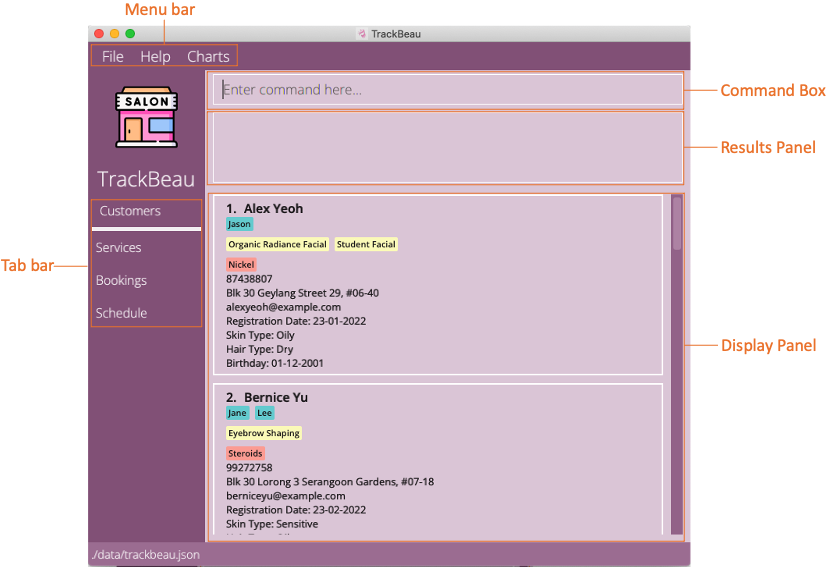
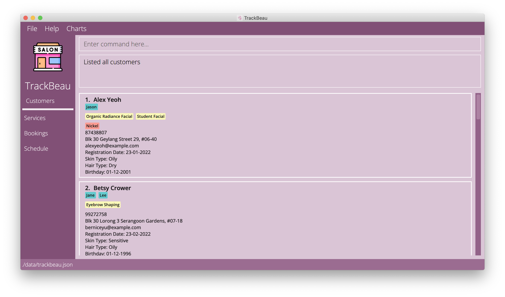
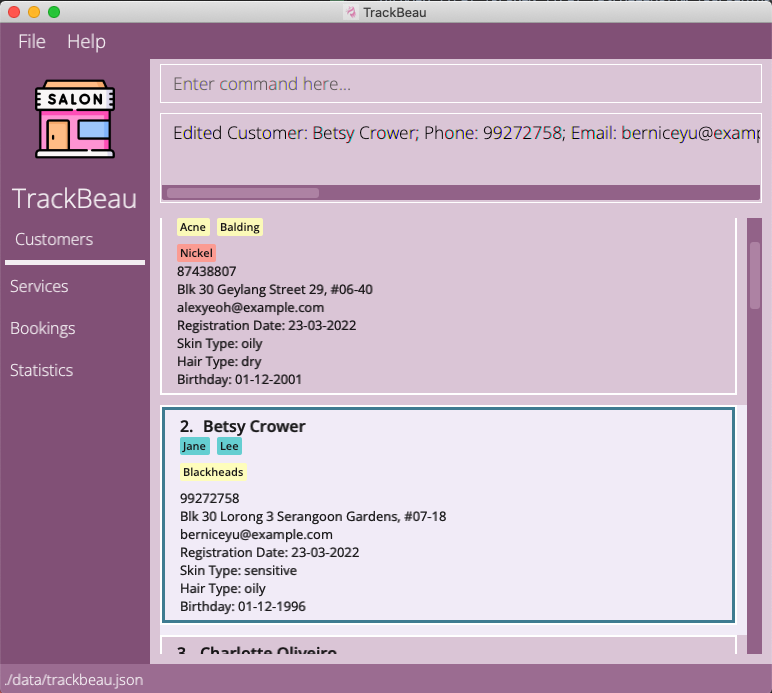
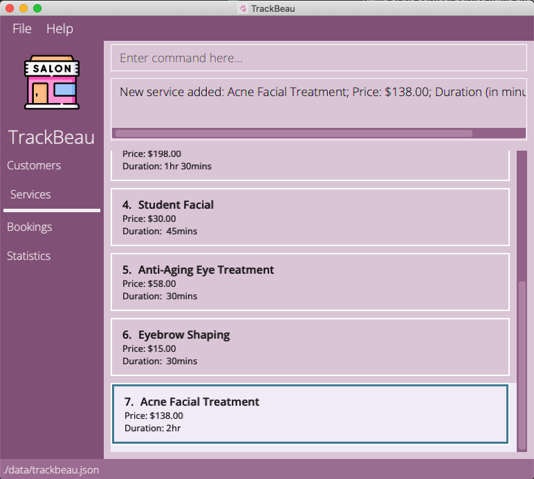
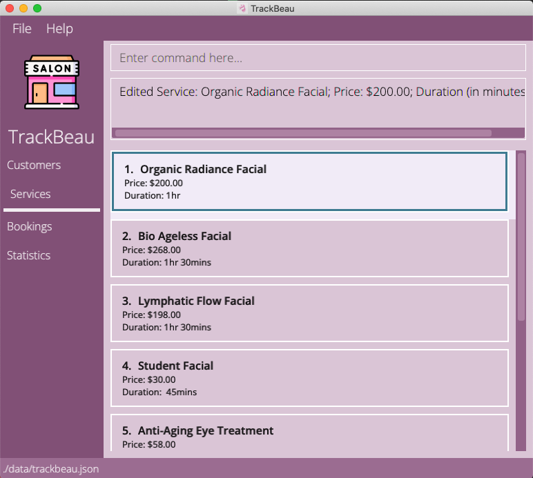
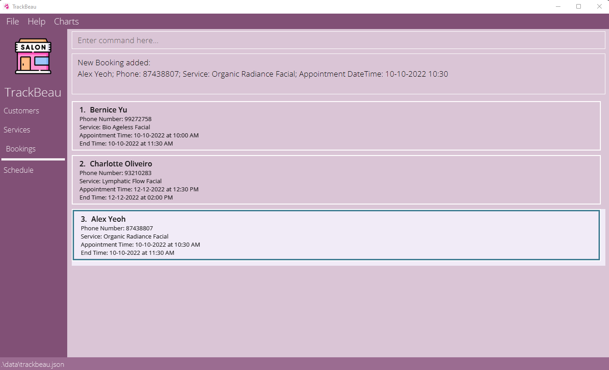
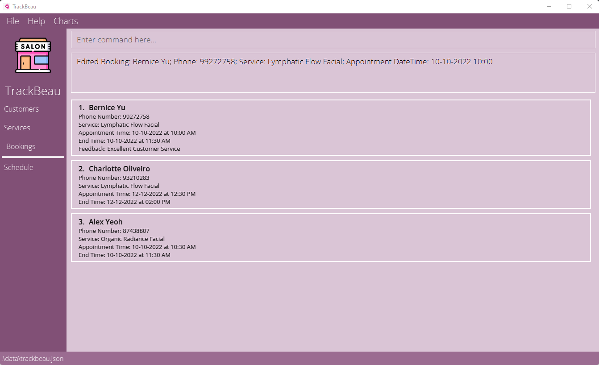
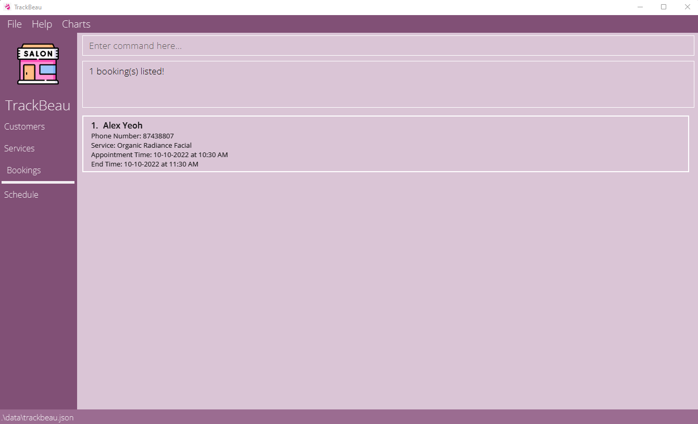
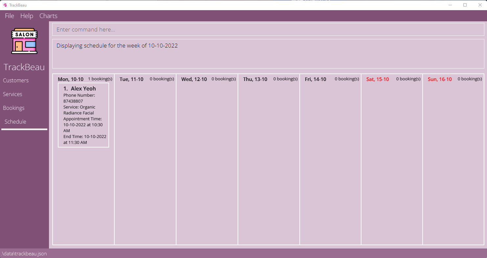

* Table of Contents
{:toc}

--------------------------------------------------------------------------------------------------------------------

## 1. Introduction

TrackBeau is a **desktop app made for beauty salons to aid them in managing customers' profile, bookings and services.
It is optimized for use via a Command Line Interface** (CLI) while still having the benefits of a Graphical User
Interface (GUI). If you can type fast, TrackBeau can help you manage your customers, bookings and services faster than
traditional GUI apps.

--------------------------------------------------------------------------------------------------------------------

## 2. Quick start

1. Ensure you have Java `11` or above installed in your Computer.

2. Download the latest `trackbeau.jar` from [here](https://github.com/AY2122S2-CS2103-F11-3/tp/releases).

3. Copy the file to the folder you want to use as the _home folder_ for your TrackBeau.

4. Double-click the file to start the app. The GUI similar to the below should appear in a few seconds. Note how the app contains some sample data. 
   

5. Type the command in the command box and press Enter to execute it. E.g., typing **`listc`** and pressing Enter will show you profiles of all customers. 
   Some example commands you can try:

   * **`lists`** : Shows a list of all services in the application.
   * **`help`** : Opens the help window.
   * **`exit`** : Exits the app.

6. Refer to the [4. Features](#4-features) below for details of each command.

--------------------------------------------------------------------------------------------------------------------

## 3. About

### 3.1 Structure of this document

This User Guide is structured in a way that lets you find what you need quickly and easily.
You can jump to the different sections easily by referring to the Table of Contents.
In the following subsection, [3.2 Reading this document](#32-reading-this-document), you can find several tips on how to read this guide.
The next section, [4. Features](#4-features) documents the main features in TrackBeau and provides you with 
instructions on how to use them.

### 3.2 Reading this document
This subsection introduces you to the symbols, syntax and technical terms that are used throughout this guide.
Getting yourself familiar with this subsection is useful in helping you to better understand this guide.

<!-- @@author flairekq-reused -->
<!-- Reused from https://ay2122s1-cs2103t-f13-2.github.io/tp/UserGuide.html -->
<!-- with minor modification -->
#### 3.2.1 Symbols and syntax
The table below explains the symbols and syntax used throughout the user guide.

| Symbol/Syntax                                                              | Meaning                                                                                                 |
|----------------------------------------------------------------------------|---------------------------------------------------------------------------------------------------------|
| 
 :information_source:
 | Text that appears in the information box indicates additional information that may be useful to know.   |
| 
:bulb:
             | Text that appears in the tip box are useful for enhancing your experience with using TrackBeau.         |                                               
| 
:exclamation:
      | Text that appears in the caution box is important as unwanted consequences might arise if not followed. |

#### 3.2.2 Sections of TrackBeau's GUI
The image below shows the annotated GUI components of TrackBeau.

<!-- Section below adapted from https://ay2122s1-cs2103t-f13-2.github.io/tp/UserGuide.html -->
#### 3.2.3 Navigating in TrackBeau
TrackBeau consists of tabs that are toggleable in the tab bar on the left side of the GUI.
By selecting a tab, it toggles the display panel to showcase the contents related to the tab e.g., by clicking on
Services, it will display a list of services available. By default, the Customers tab is selected.

There is also a menu bar at the top of the GUI that consists of 3 menu item, File, Help and Charts. By clicking on File,
you will be able to access Exit to exit the app. By clicking on Help, you will be able to access Help F1 to open the help window.
By clicking on Charts, you will be able to see a list of menu items to open the various charts in TrackBeau.

You can enter the commands via the command box and pressing Enter to execute them.
The result panel will then display a response on whether the command was successfully executed.
The display panel will then automatically refresh to display the contents of the results of the command executed. 

#### 3.2.4 Command Format
The table below explains the important technical terms to help you understand how to use the commands in TrackBeau.

<!-- @@author flairekq-reused -->
<!-- Reused from https://ay2021s1-cs2103t-w13-3.github.io/tp/UserGuide.html -->
<!-- with minor modifications for the table below -->

| Technical Term | Meaning                                                                                                           | 
|----------------|-------------------------------------------------------------------------------------------------------------------|
| Command Word   | The first word of the command determines the action that TrackBeau should perform.                                |
| Prefix         | The characters right before each parameter which distinguishes one parameter from the other.                      |
| Parameter      | The words right after the prefix. Each parameter is a value given to the command to perform the specified action. |

**Example**:
* `addc n/NAME p/PHONE a/ADDRESS e/EMAIL`
* Command Word: `addc`
* Prefixes: `n/`, `p/`, `a/`, `e/`
* Parameters: `NAME`, `PHONE`, `ADDRESS`, `EMAIL`

The commands in TrackBeau follows these rules:
* Words in `UPPER_CASE` are the parameters to be supplied by you. 
  e.g., in `addc n/NAME`, `NAME` is a parameter which can be used as `addc n/John Doe`.

* Items in square brackets are optional. 
  e.g., `n/NAME [e/EMAIL]` can be used as `n/John Doe e/johnd@example.com` or as `n/John Doe`.

* Items with `…`​ after them can be used multiple times including zero times. 
  e.g., `[sep/SERVICE_PREFERENCE]…​` can be used as ` ` (i.e., 0 times), `sep/massage`, `sep/facial sep/massage` etc.

* Parameters can be in any order. 
  e.g., if the command specifies `n/NAME p/PHONE_NUMBER`, `p/PHONE_NUMBER n/NAME` is also acceptable.

* If a parameter is expected only once in the command, but you specified it multiple times, only the last occurrence of the parameter will be taken. 
  e.g., if you specify `p/12341234 p/56785678`, only `p/56785678` will be taken.

* Extraneous parameters for commands that do not take in parameters (such as `listc`, `exit`) will be ignored. 
  e.g., if the command specifies `listc 123`, it will be interpreted as `listc`.
  
--------------------------------------------------------------------------------------------------------------------

## 4. Features
This section contains the information about the features and commands of TrackBeau. 
It is split into the following subsections:
1. [Customer management ](#41-customer-management)
2. [Service management ](#42-service-management)
3. [Booking management ](#43-booking-management)
4. [Statistics ](#44-statistics-management)
5. [Schedule management](#45-schedule-management)
6. [Miscellaneous ](#46-miscellaneous)

**:information_source: Information:**
The user needs to execute the list command for customer/service/booking,
before using edit/delete command for customer/service/booking respectively. 
As only indexes present in the displayed list are counted as valid `INDEX`.

### 4.1 Customer management

#### 4.1.1 Customer management command parameters
The table below shows a list of command parameters that will be used for customer management.

**:information_source: Information:**
* Service preference refers to services feedbacked by customers that they would enjoy. As this is feedback, the service could be in the current service list offered by the salon or it could yet to be offered as salons may choose to offer when there is sufficient demand.
* No 2 customers can have the same phone number or same email.

| Parameter            | Description                                                                                                                                                                                                                                                                                                                                                                                                                                                                                                                                                                                                                                                                                                                                             |
|----------------------|---------------------------------------------------------------------------------------------------------------------------------------------------------------------------------------------------------------------------------------------------------------------------------------------------------------------------------------------------------------------------------------------------------------------------------------------------------------------------------------------------------------------------------------------------------------------------------------------------------------------------------------------------------------------------------------------------------------------------------------------------------|
| `NAME`               | Name of the customer. Names should only contain alphanumeric characters and spaces, and it should not be blank.                                                                                                                                                                                                                                                                                                                                                                                                                                                                                                                                                                                                                                         |
| `PHONE_NUMBER`       | Phone number of the customer. Phone numbers should only contain numbers, and it should be at least 3 digits long.                                                                                                                                                                                                                                                                                                                                                                                                                                                                                                                                                                                                                                       |
| `ADDRESS`            | Address of the customer. Addresses can take any values, and it should not be blank.                                                                                                                                                                                                                                                                                                                                                                                                                                                                                                                                                                                                                                                                     |
| `EMAIL`              | Email of the customer. Emails should be of the format local-part@domain and adhere to the following constraints: <ol><li>The local-part should only contain alphanumeric characters and these special characters, excluding the parentheses, (+_.-). The local-part may not start or end with any special characters.</li><li>This is followed by a '@' and then a domain name. The domain name is made up of domain labels separated by periods. The domain name must: <ul><li>end with a domain label at least 2 characters long</li><li>have each domain label start and end with alphanumeric characters</li><li>have each domain label consist of alphanumeric characters, separated only by hyphens, if any.</li><ul></li></ol>|
| `STAFF_PREFERENCE`   | The name of the staffs that the customer prefers. Staffs' name can be any values, and it should not be blank if inputed. Else, it is an optional value.      |
| `SERVICE_PREFERENCE` | The name of the services that the customer feedbacked that they would like to have. Services' name can be any values, and it should not be blank if inputed. Else, it is an optional value. Note that the service a customer prefers may not be present in the service list as the salon may not be offering the service yet.            |
| `HAIR_TYPE`          | The hair type of the customer. Hair types can be any values, and it should not be blank if inputed. Else, it is an optional value.                                                                                                                                                                                                                                                                                                                                                                                                                                                                                                                                                                                                                                                                |
| `SKIN_TYPE`          | The skin type of the customer. Skin types can be any values, and it should not be blank if inputed. Else, it is an optional value.                                                                                                                                                                                                                                                                                                                                                                                                                                                                                                                                                                                                                                                                |
| `ALLERGY`            | The allergy that the customer has. Allergies can be any values, and it should not be blank if inputed. Else, it is an optional value.                                                                                                                                                                                                                                                                                                                                                                                                                                                                                                                                                                                                                                                               |
| `BIRTHDATE`          | The birthdate of the customer. Birthdate should follow dd-MM-yyyy and be valid date.                                                                                                                                                                                                                                                                                                                                                                                                                                                                                                                                                                                                                                                                    |
| `REGISTRATION_DATE`  | The registration date of the customer. Registration date should follow dd-MM-yyyy and be valid date.                                                                                                                                                                                                                                                                                                                                                                                                                                                                                                                                                                                                                                                    |
| `INDEX`              | The index of the customer in the displayed list. It must be a valid positive index.                                                                                                                                                                                                                                                                                                                                                                                                                                                                                                                                                                                                                                                                     |

#### 4.1.2 Adding a customer: `addc`

Adds a customer to the application.

Format: `addc n/NAME p/PHONE_NUMBER e/EMAIL a/ADDRESS rd/REGISTRATION_DATE [stp/STAFF_PREFERENCE]…​ [sep/SERVICE_PREFERENCE]…​ [h/HAIR_TYPE] [s/SKIN_TYPE] [al/ALLERGY]…​ [bd/BIRTHDATE]`

:bulb: **Tip:**
A customer can have any number of preferred staffs, preferred services and allergies (including 0)

Examples:
* `addc n/John Doe p/98765432 a/John street, block 123, #01-01 e/johnd@example.com rd/31-03-2022`
* `addc n/Betsy Crowe e/betsycrowe@example.com a/Newgate Prison p/1234567 rd/31-03-2022 al/Aloe Vera sep/facial sep/massage`

#### 4.1.3 Listing all customers : `listc`

Shows a list of all customers in the application.

Format: `listc`

**:information_source: Information:**
<ul>
    <li>Turquoise coloured tag (below the name) is used to represent the staffs that the customer prefers.</li>
    <li>Yellow coloured tag (below staff preferences) is used to represent services that the customer prefers.</li>
    <li>Pink coloured tag (below service preferences) is used to represent allergies that the customer has.</li>
</ul>

#### 4.1.4 Editing a customer : `editc`

Edits an existing customer in the application.

Format: `editc INDEX [n/NAME] [p/PHONE_NUMBER] [a/ADDRESS] [e/EMAIL] [stp/STAFF_PREFERENCE]…​ [sep/SERVICE_PREFERENCE]…​ [h/HAIR_TYPE] [s/SKIN_TYPE] [al/ALLERGY]…​ [bd/BIRTHDATE] [rd/REGISTRATION_DATE]`

**:information_source: Information:**
<ul>
    <li>At least one of the optional fields must be provided.</li>
    <li>Existing values will be updated to the input values.</li>
    <li>Editing a customer will edit all future bookings of that customer.</li>
</ul>

**:exclamation: Caution:** 
* When editing staff/service preferences or allergies, the existing staff/service preferences or allergies will be removed i.e., adding of staff/service preferences or allergies is not cumulative. 
* By leaving the staff/service preferences or allergies parameter empty, i.e, `stp/` or `sep/` or `al/` it will remove all the staff/service preferences or allergies currently associated with the customer.

Examples:
*  `editc 1 p/91234567 e/johndoe@example.com` Edits the phone number and email address of the 1st customer to be `91234567` and `johndoe@example.com` respectively.
*  `editc 2 n/Betsy Crower al/` Edits the name of the 2nd customer to be `Betsy Crower` and removes all existing allergies.

Example Usage: `editc 2 n/Betsy Crower al/`

#### 4.1.5 Finding customers' profile by keyword: `findc`

Finds customers whose parameters contain any of the given keywords.

Format: `findc KEYWORD_TYPE KEYWORD [MORE_KEYWORDS]`

   
**:exclamation: Caution:** 
* KEYWORD_TYPE is specific to customer prefixes: `n/` `a/` `p/` `e/` `rd/` `bd/` `s/` `h/` `stp/` `sep/` `al/`
* For tags, using two tags of the same type will lead to only the latest one being searched for. For instance, `findc h/Oily h/Dry` will search for only customers with dry hair type. 
* The search is case-insensitive. e.g, `John` will match `john`
* Only full words will be matched e.g. `findc n/Alex Yeoh` will not match customers who are `Alex Tan`, even if they both are called `Alex`

Examples:
* `findc n/John stp/Jason` returns customers who have `john` in their name and customers who like `Jason`
* `findc al/Nickel` returns customer profiles with Nickel allergies
* `findc h/Oily` returns customer profiles that has the hair type of oily

#### 4.1.6 Deleting customer(s) : `deletec`

Deletes the specified customer(s) from the application.

Format: `deletec INDEX,[MORE INDEXES]`
* Deletes the customer profile at the specified INDEXES.
* The index refers to the index number shown in the displayed customer list.
* The index must be a positive integer 1, 2, 3, …
* All indexes must be valid else the operation will not execute.
* Deleting a customer will delete all future bookings of that customer.

**:information_source: Information:** All the input indexes must be valid else the command will not be executed.

Examples:
* `deletec 1,2` Removes the 1st and 2nd customer from the application.

### 4.2 Service management

#### 4.2.1 Service management command parameters
The table below shows a list of command parameters that will be used for service management.

| Parameter      | Description                                                                                                                                                                                           |
|----------------|-------------------------------------------------------------------------------------------------------------------------------------------------------------------------------------------------------|
| `SERVICE_NAME` | Name of the service. Service name should only contain alphanumeric characters, hyphens and spaces, and it should not be blank. It should also be unique such that no two services have the same name. |
| `PRICE`        | Price of the service. Price should only contain numbers, at most 2 decimal places and have a value that is greater than 0.                                                                            |
| `DURATION`     | Duration of the service in minutes. Duration should only contain numbers and have a value that is greater than 0.                                                                                     |
| `INDEX`        | The index of the service in the displayed list. It must be a valid positive index.                                                                                                                    |

#### 4.2.2 Adding a service: `adds`
Adds a service to the application.

Format: `adds n/SERVICE_NAME pr/PRICE d/DURATION`

Examples:
* `adds n/Acne Facial Treatment pr/138 d/120`
* `adds n/Hydrating Facial pr/108 d/60`

Example Usage: `adds n/Acne Facial Treatment pr/138 d/120`

#### 4.2.3 Listing all services : `lists`

Shows a list of all services in the application.

Format: `lists`

#### 4.2.4 Editing a service: `edits`
Edits an existing service in the application.

Format: `edits INDEX [n/SERVICE_NAME] [pr/PRICE] [d/DURATION]`

**:information_source: Information:**
<ul>
    <li>At least one of the optional fields must be provided.</li>
    <li>Existing values will be updated to the input values.</li>
    <li>Editing a service will edit all future bookings with that service.</li>
</ul>

Examples:
* `edits 1 pr/200` Edits the price of the 1st service to be `200`.
* `edits 2 n/Dark Eye Circle Treatment d/30` Edits the name and duration of the 2nd service to be `Dark Eye Circle Treatment` and `60` respectively.

Example Usage: `edits 1 pr/200`

#### 4.2.5 Finding service' profile by keyword: `finds`

Find services whose parameters contain any of the given keywords.

Format: `finds KEYWORD_TYPE KEYWORD [MORE_KEYWORDS]`

* Keyword types available: name, price, duration
* The search is case-insensitive. e.g, `Facial` will match `facial`.
* Only the parameters is searched.
* Only full words will be matched e.g. `Facial` will not match `Faial`.

Examples:
* `finds n/Facial` returns `Organic Radiance Facial` and `Bio Ageless Facial`.
* `finds pr/100` returns service profiles at cost $100.
* `finds d/90` returns services that lasts 90 minutes.

#### 4.2.6 Deleting service(s) : `deletes`

Deletes the specified service(s) from the application.

Format: `deletes INDEX,[MORE INDEXES]`
* Deletes the service profile at the specified INDEXES.
* The index refers to the index number shown in the displayed service list.
* The index must be a positive integer 1, 2, 3, …
* All indexes must be valid else the operation will not execute.
* Deleting a service will delete all future bookings with that service.

**:information_source: Information:** All the input indexes must be valid else the command will not be executed.

Examples:
* `deletes 3` Removes the 3rd service from the application.
* `deletes 1,2,3` Removes the 1st, 2nd and 3rd service from the application.

### 4.3 Booking management

#### 4.3.1 Booking management command parameters
The table below shows a list of command parameters that will be used for booking management.

| Parameter           | Description                                                                                                                                                                                          |
|---------------------|------------------------------------------------------------------------------------------------------------------------------------------------------------------------------------------------------|
| `NAME`              | Name of customer or Service. Name should only contain alphanumeric characters, hyphens and spaces, and it should not be blank. |
| `CUSTOMER_INDEX`    | Customer Index should only contain numbers and have a value that is greater than 0.                                                                                                                  |
| `SERVICE_INDEX`     | Service Index should only contain numbers and have a value that is greater than 0.                                                                                                                   |
| `BOOKING_DATE_TIME` | Booking Date Time must be in format dd-MM-yyyy HH:mm.                                                                                                                                                |
| `FEEDBACK`          | Feedback should only contain alphanumeric characters, hyphens and spaces, and it should not be blank.                                                                                                                                                                                            |

#### 4.3.2 Adding a booking: `addb`
Adds a booking to the application.

Format: `addb c/CUSTOMER_INDEX sev/SERVICE_INDEX st/BOOKING_DATE_TIME`

Examples:
* `addb c/1 sev/1 st/10-10-2022 10:30`
* `addb c/2 sev/3 st/12-12-2022 10:30`

Example Usage: `addb c/1 sev/1 st/10-10-2022 10:30`

#### 4.3.3 Listing all bookings : `listb`

Shows a list of all bookings in the application.

Format: `listb`

#### 4.3.4 Editing a booking: `editb`
Edits an existing service in the application.

Format: `editb INDEX [c/CUSTOMER_INDEX] [sev/SERVICE_INDEX] [st/BOOKING_DATE_TIME] [f/FEEDBACK]`

**:information_source: Information:**
<ul>
    <li>At least one of the optional fields must be provided.</li>
    <li>Existing values will be updated to the input values.</li>
    <li>Feedback can only be given if the current date is after booking date.</li>
    <li>Editing booking date to be after current date will remove any feedback.</li>
</ul>

Examples:
* `editb 1 sev/3 f/Excellent Customer Service` Edits the 1st booking's service to the service at Index 2 and edit its feedback to `Excellent Customer Service` .
* `editb 2 st/10-12-2022 10:30` Edits the booking time of the 1st booking to be `10-12-2022 10:30`.

Example Usage: `editb 1 sev/3 f/Excellent Customer Service`

#### 4.3.5 Finding booking' profile by keyword: `findb`

Find bookings whose parameters contain any of the given keywords.

Format: `findb KEYWORD_TYPE KEYWORD [MORE_KEYWORDS]`

* Keyword types available: customer index, service index, booking date time, feedback
* The search is case-insensitive. e.g, `Excellent` will match `excellent`
* Only the parameters is searched.
* Only full words will be matched e.g. `10-10-2022` will not match `10-10-202`

Examples:
* `findb n/alex` returns bookings where the customer name or service name match.
* `findb f/Bad` returns `Bad service` and `Service was bad`.
* `findb st/10-10-2022` returns bookings that are on `10-10-2022`.

Example Usage: `findb n/alex`

#### 4.3.6 Deleting booking(s) : `deleteb`

Deletes the specified booking(s) from the application.

Format: `deleteb INDEX,[MORE INDEXES]`
* Deletes the booking profile at the specified INDEXES.
* The index refers to the index number shown in the displayed booking list.
* The index must be a positive integer 1, 2, 3, …
* All indexes must be valid else the operation will not execute.

**:information_source: Information:** All the input indexes must be valid else the command will not be executed.

Examples:
* `deleteb 3` Removes the 3rd booking from the application.
* `deleteb 1,2,3` Removes the 1st, 2nd and 3rd booking from the application.

### 4.4 Statistics Management

#### 4.4.1 Design
The charts will be plotted in a pop-up. Note that as all the charts, except for monthly customer gained chart, are plotted based on optional fields, the counts in the pie chart will not tally with total customers.

#### 4.4.2 Plot all charts: `plotAll`
Plots all available chart formats.

Format: `plotAll`

Examples:
* `plotAll`
   
#### 4.4.3 Plot chart on popular staff amongst customers: `plotStaff`

Plots a pie chart on the most popular staff as indicated by customers as their preferred staff. If there are most than 10 staffs indicated as preferred by customers in TrackBeau, only the top 10 most popular staff will be included in the piechart to let the chart be still meaningful.

Format: `plotStaff`

Examples:
* `plotStaff`

#### 4.4.4 Plot chart on popular services amongst customers: `plotService`

Plots a pie chart on the most popular service as indicated by customers as their preferred service. If there are most than 10 services indicated as preferred by customers in TrackBeau, only the top 10 most popular services will be included in the piechart to let the chart be still meaningful.

Format: `plotService`

Examples:
* `plotService`
   
#### 4.4.5 Plot chart on common allergies amongst customers: `plotAllergy`

Plots a pie chart on the most common allergies amongst customers. If there are most than 10 allergies in customer data, only the top 10 most common allergies will be included in the piechart to let the chart be still meaningful.

Format: `plotAllergy`

Examples:
* `plotAllergy`
  
#### 4.4.6 Plot chart on common skin type amongst customers: `plotSkin`
   

Plots a pie chart on the most common allergies amongst customers. If there are most than 10 skin types in customer data, only the top 10 most skin types will be included in the piechart to let the chart be still meaningful.

Format: `plotSkin`

Examples:
* `plotSkin`   

#### 4.4.7 Plot chart on common hair type amongst customers: `plotHair`

Plots a pie chart on the most common hair type amongst customers. If there are most than 10 hair type in customer data, only the top 10 most hair types will be included in the piechart to let the chart be still meaningful.

Format: `plotHair`

Examples:
* `plotHair`
   
#### 4.4.8 Plot chart on monthly customers gained in the current year: `plotMonthlyCustomers`

Plots a pie chart on monthly customers gained in the current year.

Format: `plotMonthlyCustomers`

Examples:
* `plotMonthlyCustomers`

### 4.5 Schedule management

**:information_source: Information:**
<ul>
    <li>Bookings that start and end on different dates will fall under its start date.</li>
</ul>

**:exclamation: Caution:** 
* The indexes of bookings in schedule view is not meant for deleting or editing bookings. Using them will lead to unexpected behaviour.

#### 4.5.1 Schedule management command parameters
The table below shows a list of command parameters that will be used for schedule management.

| Parameter | Description                                                              |
|-----------|--------------------------------------------------------------------------|
| `DATE`    | The date of interest. Date should follow dd-MM-yyyy and be a valid date. |

#### 4.5.2 Viewing schedule: `schedule`
Display the schedule of the week containing the selected date.

Format: `schedule date/DATE`

Examples: 
* `schedule date/10-10-2022`

Example Usage: `schedule date/10-10-2022`

#### 4.5.3 Viewing next week schedule: `scheduleNext`
Display the next week's schedule from the last selected date.

Format: `scheduleNext`

#### 4.5.4 Viewing previous week schedule: `schedulePreivous`
Display the previous week's schedule from the last selected date.

Format: `schedulePrevious`

### 4.6 Miscellaneous

#### 4.6.1 Viewing help : `help`

Shows a message explaining how to access the help page.

Format: `help`

#### 4.6.2 Clearing all entries : `clear`

Clears all entries from the application.

Format: `clear`

#### 4.6.3 Exiting the program : `exit`

Exits the program.

Format: `exit`

#### 4.6.4 Saving the data

TrackBeau data are saved in the hard disk automatically after any command that changes the data. There is no need to save manually.

#### 4.6.5 Editing the data file

TrackBeau data are saved as a JSON file `[JAR file location]/data/trackbeau.json`. Advanced users are welcome to update data directly by editing that data file.

:exclamation: **Caution:**
If your changes to the data file makes its format invalid, TrackBeau will discard all data and start with an empty data file at the next run.

--------------------------------------------------------------------------------------------------------------------

## 5. Command summary

### 5.1 Customer

| Action                 | Format                                                                                                                                                                                             | Examples                                                                                                                 |
|------------------------|----------------------------------------------------------------------------------------------------------------------------------------------------------------------------------------------------|--------------------------------------------------------------------------------------------------------------------------|
| Add a customer         | `addc n/NAME p/PHONE_NUMBER a/ADDRESS rd/REGISTRATION_DATE [e/EMAIL] [stp/STAFF_PREFERENCE]…​ [sep/SERVICE_PREFERENCE]…​ [h/HAIR_TYPE] [s/SKIN_TYPE] [al/ALLERGY]…​ [bd/BIRTHDATE]`                | `addc n/Betsy Crow e/betsycrow@example.com a/Newgate Prison p/1234568 rd/06-04-2022 al/Aloe Vera sep/facial sep/massage` |
| List all customers     | `listc`                                                                                                                                                                                            | `listc`                                                                                                                  |
| Edit a customer        | `editc INDEX [n/NAME] [p/PHONE_NUMBER] [a/ADDRESS] [e/EMAIL] [stp/STAFF_PREFERENCE]…​ [sep/SERVICE_PREFERENCE]…​ [h/HAIR_TYPE] [s/SKIN_TYPE] [al/ALLERGY]…​ [bd/BIRTHDATE] [rd/REGISTRATION_DATE]` | `editc 1 n/Betsy Crower stp/Jason`                                                                                       |
| Find customer profiles | `findc KEYWORD_TYPE KEYWORD [MORE_KEYWORDS]`                                                                                                                                                       | `findc n/Alex Yeoh`                                                                                                      |
| Delete customer(s)     | `deletec INDEX,[MORE INDEXES]`                                                                                                                                                                     | `deletec 1,2`                                                                                                            |

### 5.2 Service

| Action                | Format                                                 | Examples                                    |
|-----------------------|--------------------------------------------------------|---------------------------------------------|
| Add a service         | `adds n/SERVICE_NAME pr/PRICE d/DURATION`              | `adds n/Acne Facial Treatment pr/138 d/120` |
| List all services     | `lists`                                                ||
| Edit a service        | `edits INDEX [n/SERVICE_NAME] [pr/PRICE] [d/DURATION]` | `edits 2 n/Dark Eye Circle Treatment d/30`  |
| Find service profiles | `finds KEYWORD_TYPE KEYWORD [MORE_KEYWORDS]`           ||
| Delete service(s)     | `deletes INDEX,[MORE INDEXES]`                         | `deletes 1,2,3`                             |

### 5.3 Booking

| Action                | Format                                                                                   | Examples                                     |
|-----------------------|------------------------------------------------------------------------------------------|----------------------------------------------|
| Add a booking         | `addb c/CUSTOMER_INDEX sev/SERVICE_INDEX st/BOOKING_DATE_TIME`                           | `addb c/1 sev/1 st/10-10-2022 10:30`         |
| List all bookings     | `listb`                                                                                  ||
| Edit a booking        | `editb INDEX [c/CUSTOMER_INDEX] [sev/SERVICE_INDEX] [st/BOOKING_DATE_TIME] [f/FEEDBACK]` | `editb 1 sev/3 f/Excellent Customer Service` |
| Find booking profiles | `findb KEYWORD_TYPE KEYWORD [MORE_KEYWORDS]`                                             ||
| Delete booking(s)     | `deleteb INDEX,[MORE INDEXES]`                                                           | `deleteb 1,2,3`                              |

### 5.4 Statistics

The charts plot up to 10 variables at most. For example, in plotStaff, the top 10 most popular staff will be plotted if there are for instance, 15 staff indicated by customers.
   
| Action                                                                                        | Format                 | Examples               |
|-----------------------------------------------------------------------------------------------|------------------------|------------------------|
| Plot all charts                                                                               | `plotAll`              | `plotAll`              |
| Plot chart of popular staff (popular being customers indicated them as their preferred staff) | `plotStaff`            | `plotStaff`            |
| Plot chart on popular services by customers (as indicated in their preferred services)        | `plotService`          | `plotService`          |
| Plot chart on common allergies amongst customers                                              | `plotAllergy`          | `plotAllergy`          |
| Plot chart on common skin type of customers                                                   | `plotSkin`             | `plotSkin`             |
| Plot chart on common hair type of customers                                                   | `plotHair`             | `plotHair`             |
| Plot chart on customers gained per month in the current year                                  | `plotMonthlyCustomers` | `plotMonthlyCustomers` |   

### 5.5 Schedule

| Action                                                            | Format               | Examples                   |
|-------------------------------------------------------------------|----------------------|----------------------------|
| Display the schedule of the week containing the selected date.    | `schedule date/DATE` | `schedule date/10-10-2022` |
| Display the next week's schedule from the last selected date.     | `scheduleNext`       |                            |
| Display the previous week's schedule from the last selected date. | `schedulePrevious`   |                            |

### 5.6 Miscellaneous

| Action | Format  |
|--------|---------|
| Help   | `help`  |
| Clear  | `clear` |
| Exit   | `exit`  |

--------------------------------------------------------------------------------------------------------------------

## 6. Known Limitations

* Inputting very long values for fields like the price of a Service might cause it to be round off at certain significant number due to the size limitation of the data type used for the field.                                                                                                       

--------------------------------------------------------------------------------------------------------------------

## 7. Glossary

| Term                              | Definition                                                                                                                                                              |
|-----------------------------------|-------------------------------------------------------------------------------------------------------------------------------------------------------------------------|
| Command Line Interface (CLI)      | A command line interface connects a user to the computer program by allowing the users to interact with the application by typing in text (commands).                   |
| Graphical User Interface (GUI)    | A graphical user interface is a type of user interface through which users interact with the application via visual indicator representations.                          |
| Java ARchive (JAR)                | A JAR is a package file format typically used to aggregate many Java class files and associated metadata and resources (text, images, etc.) into one file distribution. |
| Java 11                           | Java 11 is an open-source reference implementation of Java SE platform version 11.                                                                                      |
| Javascript Object Notation (JSON) | JSON is a text format for storing and transporting data.                                                                                                                |

--------------------------------------------------------------------------------------------------------------------

## 8. FAQ

**Q**: How do I transfer my data to another Computer? 
**A**: Install the app in the other computer and overwrite the empty data file it creates with the file that contains the data of your previous TrackBeau home folder.       

