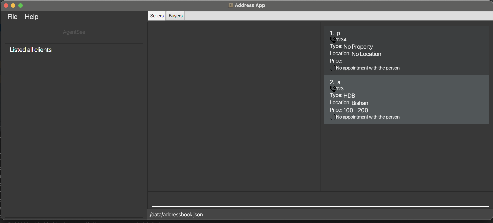

AgentSee is a **desktop application for property agents to manage clients.** It is:

* optimized for use via a Command Line Interface (CLI) while still having the benefits of a Graphical User Interface (GUI). 
  - So if you can type fast, AgentSee can get your client management tasks done faster than traditional GUI apps!
  
* Easy to use! The User Guide and the application is very easy to navigate!

* ~~Cheap~~ FREE!

* Table of Contents
{:toc}
--------------------------------------------------------------------------------------------------------------------
## Quick start

1. Ensure you have Java `11` or above installed in your Computer. If you do not have it installed, download it [here](https://www.oracle.com/java/technologies/downloads/#java11).

2. Download the latest application .jar file from our GitHub [here](https://github.com/AY2122S2-CS2103T-T11-2/tp/releases).

3. Copy the .jar file to any folder which you wish to store the AgentSee application in. It is recommended that the folder is **empty** before copying in the .jar file.

4. Double-click the file to start the app. A GUI similar to the one below should appear in a few seconds. Note that sample data will be automatically added when running the .jar file for the first time.<br>
   

5. Input a command in the command box and press Enter on your keyboard to execute it.
   - E.g. `add-b n/David p/62353535` 

6. Refer to the [Features](#features) section further below for full details of possible commands to input.

--------------------------------------------------------------------------------------------------------------------

## Features

The Features section will be split into 3 subsections for:
1. General commands
2. Buyer-specific commands
3. Seller-specific commands

<div markdown="block" class="alert alert-info">

**:information_source: Notes about the command format and terminology:**<br>

* Buyer: Someone who is seeking to purchase property.

* Seller: Someone who is seeking to sell their property.

* Leading zeros will be ignored in **index-based** inputs. E.g. `delete-b 1` and `delete-b 00001` are equivalent.

* Words in `UPPER_CASE` are inputs to be supplied by the user.<br>
  e.g. In `add-b n/NAME`, `NAME` is an input such as `add-b n/Chok Hoe`.

* Items in square brackets are optional inputs.<br>
  e.g In `n/NAME [t/TAG]`, the user can input `n/Chok Hoe t/funny` or simply `n/Chok Hoe`.

* Inputs with `…`​ after them can be used more than once.<br>
  e.g. In `[t/TAG]…​`, the user can input `t/friend` or `t/friend t/family` etc.

* Input can be in any order.<br>
  e.g. Even if the command specifies `n/NAME p/PHONE_NUMBER` in the documentation, `p/PHONE_NUMBER n/NAME` is also acceptable.

* If an input is expected only once in the command, but you specified it multiple times, only the **last occurrence** of the input will be taken.<br>
  e.g. If you specify `add-b n/Chok Hoe p/12341234 p/56785678`, only `p/56785678` will be taken.

* If an input type not specified for a command is used E.g. `pr/` in `add-b`, it will be treated as part of the preceding input. E.g. `add-b n/David pr/1,2 Gareth p/12345` will see `NAME` as `David pr/1,2 Gareth`, which is invalid.

* Respect the spacing used in **all** command formats. E.g. `add-b n/Chok Hoep/12345 p/123467` will treat `NAME` as `Chok Hoep/12345`, which is invalid.

* Additional input for single-word commands (such as `help`, `list-s`, `exit` and `clear-b`) will be ignored and the application will continue executing the command.<br>
  e.g. If the input specifies `help 123`, it will be interpreted as `help`.

* **Property** refers to different things dependent on whether it is used under a Buyer-specific or Seller-specific command.
  * For Buyer-specific commands, it refers to the **general property they are looking to buy**. E.g. "A HDB in Serangoon for $500,000 to $600,000".
  * For Seller-specific commands, it refers to the **exact property they are looking to sell**. E.g. "A HDB at Blk 333, Kent Ridge Drive #03-3333 for $700,000 to $710,000".
  * Both property types include a **Location**, **Price range** and **House type**. E.g. In the 1st example, HDB is the house type, Serangoon is the location, and $500,000 to $600,000 (inclusive) is the price range.
  * However, Seller-specific property has an **Address** defining the exact address their property is located. E.g. In the 2nd example, address is Blk 333, Kent Ridge Drive #03-3333.
  * To learn more about **formatting** your property inputs see below. To see more **requirements** for inputs, refer to `add-ptb` and `add-pts` commands.
* Formatting your Property inputs:
  * **House type** can be inputted as any of the following (case-insensitive):
    1. **Unspecified**: `unspecified` or `any`
    2. **Apartment**: `apartment`
    3. **Bungalow**: `bungalow`
    4. **Condominium**: `condominium` or `condo`
    5. **Colonia**: `colonia`
    6. **HDB**: `hdb` or `hdb_flat`
    7. **Semi-detached**: `semi-detached` or `semi-d` or `semidetached` or `semid`
    8. **Mansion**: `mansion` 
    - Any other house type is not accepted.
  * **Location** & **Address** must be non-empty, and can contain **alphabets**, **numerics** and **special symbols**. E.g. `Kent Ridge 1/2`. 
    * However, inputs like `l/Bishan h/hdb` will be treated as `l/Bishan` & `h/hdb` (see above).
    * Typing `l/Bishanh/abcpr/0,2` is still acceptable and will treat `Bishanh/abcpr/0,2` as the location input.
  * **Price range** must be in a `lower,upper` format. E.g. `1000,2000`
* The **displayed seller list** & **displayed buyer list** are the sellers and buyers shown on the UI of the application respectively. They do not refer to the entire list of buyers & sellers.
* If we do refer to the whole list of buyers or sellers, we will just use **buyer list** or **seller list** respectively.

</div>

### General commands

#### Help! `help`

Function: Show a message explaining how to access the help page.


Format: `help`

#### Exiting. `exit`

Function: Exit the program. Don't worry, we will save your data!

Format: `exit`

[back to start of section](#features)

#### Clear. `clear-all`

Function: Clears both buyer and seller lists.

<div markdown="span" class="alert alert-primary">

:bulb: **Caution:** This action **cannot be undone**! Be careful when changing a buyer's information.
</div>

Format: `clear-all`

### Buyer-specific commands

#### Listing buyers. `list-b`

Function: Display the buyer list.

Format: `list-b`

#### Adding buyers. `add-b`

Function: Add a buyer to the buyer list. This is essential for you to add a buyer's data.

Format: `add-b n/NAME p/PHONE_NUMBER [t/TAG]...`

* The order of inputs can be in any order.
* The `NAME`, `PHONE_NUMBER` and `TAG` cannot be empty. E.g. `n/` or `n/` followed by only spaces or tabs.
* `NAME` should only contain **alphanumeric** characters. E.g. `John 1` or `John 2` if you are using numbers to differentiate buyers with the same name.
* `NAME` cannot be repeated for different buyers. E.g. `John` & `John`. However, we allow for different cases. E.g. `John` & `john`.
* `PHONE_NUMBER` can only contain non-negative, non-spaced whole numbers E.g. `1234`, `0000` (zero) and must be at least 3 digits long E.g. `001` is accepted but `01` or `0 01` is not.
* Multiple different buyers or sellers might have the same phone number. E.g. Buyer `John`, Buyer `Bob` and Seller `Jess` have phone number `62353535`. This is because the phone number might be a home number/office number which multiple clients can share.
* When a buyer is initially added, they will default to having **no** Property. Use `add-ptb` to add a respective property.
* `TAG` must be **alphanumeric** with no spaces between the words. E.g. `great` is ok but `great client` is not.
* If there are **leading** or **trailing** whitespace for `NAME`, `PHONE_NUMBER` or `TAG`, it will be ignored. E.g. `____David_____` where `_` is whitespace is `David`.
* If multiple inputs are provided for the same field E.g. `n/David n/#seeme`, only the **last** input will be processed. Hence, in the example, an error will be thrown since `#seeme` is invalid `NAME`. This applies to `p/PHONE` as well

Examples:
* `add-b n/Yu Qi p/98765432` adds a new buyer with name `Yu Qi` and phone number `98765432`
* `add-b n/Janald p/12345678 t/friend t/criminal` adds a new buyer with name `Janald`, phone number of `12345678`, and tags of `friend` and `criminal`

#### Adding a property to buy. `add-ptb`

Function: Add a new property for the specified buyer. Add all the conditions of a property that your buyer is interested in!

Format: `add-ptb INDEX l/LOCATION pr/PRICE_RANGE h/HOUSE_TYPE`

* Adds a new property that the buyer at `INDEX` is hoping to buy. The index refers to the index number shown in the displayed buyer list. The index **must be a positive integer** 1, 2, 3, …​ within the size of the displayed buyer list.
* The order of the inputs can be in any order.
* The `PRICE_RANGE` must be a valid **non-negative integer** with `lower` being less than or equal to `upper`.
* The `PRICE_RANGE` can include `0` since the buyer might want to try their luck and see if anyone is selling their property for free.
* Do use appropriate `LOCATION` for your own utility. E.g. `Bishan` or `Marymount`. The application will not check if it is an actual location in Singapore or elsewhere.
* You cannot add a new property to buy once one has already been added.
* If there are **leading** or **trailing** whitespace for `LOCATION`, `PRICE_RANGE` or `HOUSE_TYPE`, it will be ignored. E.g. `____hdb_____` where `_` is whitespace will be treated as `hdb`.
* If there are multiple inputs for the same field, only the last one will be **processed**. Consequently, if it is invalid, earlier valid inputs will not be chosen. E.g. `h/hdb h/plaza` is invalid since `plaza` is not a recognized house type.

Examples:
* `add-ptb 1 l/Bishan pr/400000,500000 h/hdb` means that 1st buyer in the displayed buyer list wishes to buy a HDB in Bishan for any price from $400,000 to $500,000. 

#### Adding an appointment with buyer. `appt-b`

Function: Create an appointment with a certain buyer. Now, you can keep track of your appointments with buyers!

Format: `appt-b INDEX time/TIME`

* Create an appointment with the buyer at the specified `INDEX`. The index refers to the index number shown in the displayed buyer list. The index **must be a positive integer** 1, 2, 3, …​ within the size of the displayed buyer list.
* The input `TIME` is in a `yyyy-mm-dd-hh-mm` format of: the year, month, day of the month, hour and minute. Use the example below for reference.
* The time entered must be a time in the future.
* To **delete an appointment** with a buyer, use the keyword `reset` after the `time/` prefix.
* Multiple clients may have the same appointment `TIME` (E.g. Zoom meetings).

Examples:
* `appt-b 1 time/2023-01-01-12-12` sets a new appointment for the 1st buyer on the displayed buyer list on 1st January 2023 and 12:12pm.
* `appt-b 1 time/reset` deletes the existing appointment with the 1st buyer in the list.
#### Matching a buyer!

Function: Display potential sellers by matching the demand of a buyer. Now, you can easily find properties that buyers are interested in!

* Note: You can match a buyer only if his/her property has been added!
* Want to match using just a certain criterion? Fret not! Below are the different match commands.

###### Matching all fields of buyers to sellers. `match`

Format: `match INDEX`

* The index refers to the index number shown in the displayed buyer list. The index **must be a positive integer** 1, 2, 3, …​ within the size of the displayed buyer list.
* A list of all sellers who have properties that are matching the buyer's property requirements will be displayed.
* A seller will match to the buyer if:
  * They have the same location & house type.
  * If a price within the buyer's price range is within the seller's price range.
* E.g. If a buyer has house type `HDB`, location `Bishan` and price range `400000,500000`, a seller with house type `HDB`, location `Bishan` and price range `490000,600000` will match as the buyer's price range has an **overlap** with the seller's.

Examples:
* `match 1` will match the 1st buyer in the displayed buyer list with all seller's with matching property criteria.

###### Matching House Types of buyers to sellers. `match-h`

Format: `match-h INDEX`

* The index refers to the index number shown in the displayed buyer list. The index **must be a positive integer** 1, 2, 3, …​ within the size of the displayed buyer list.
* A list of all sellers whose housetype matches the buyer's desired house type will be displayed.
* A seller will match to the buyer if:
  * They have the same house type.
  * Buyer's house type is unspecified.
* E.g. A buyer with house type `UNSPECIFIED` or `HDB_FLAT` will match with a seller with house type `HDB_FLAT`.

Examples:
* `match-h 1` will match the 1st buyer in the displayed buyer list with all seller's with matching property criteria.

###### Matching Locations of buyers to sellers. `match-l`

Format: `match-l INDEX`

* The index refers to the index number shown in the displayed buyer list. The index **must be a positive integer** 1, 2, 3, …​ within the size of the displayed buyer list.
* A list of all sellers whose location matches the buyer's desired location will be displayed.
* A seller will match to the buyer if:
  * They have the same house location
* E.g. A buyer with house location `bishan` will match with a seller with house location `bishan`.

Examples:
* `match-l 1` will match the 1st buyer in the displayed buyer list with all seller's with matching property criteria.

###### Matching Price Range of buyers to sellers. `match-pr`

Format: `match-pr INDEX`

* The index refers to the index number shown in the displayed buyer list. The index **must be a positive integer** 1, 2, 3, …​ within the size of the displayed buyer list.
* A list of all sellers whose price range matches the buyer's desired price range will be displayed.
* A seller will match to the buyer if:
  * There is a price at which the buyer is willing to buy a property at, and the seller is willing to sell their property at.
* E.g. A buyer with price range `20-100` will match with a seller with house price range `100-200`, because `100` is a matching price.
* Price matches are inclusive, so if a price range is `100-200`, it includes the values `100` and `200` as well.

Examples:
* `match-pr 1` will match the 1st buyer in the displayed buyer list with all seller's with matching property criteria.

#### Editing a buyer. `edit-b`

Function: Edit an existing buyer's information in the displayed buyer list.

<div markdown="span" class="alert alert-primary">

:bulb: **Caution:** This action **cannot be undone**! Be careful when changing a buyer's information.
</div>

Format: `edit-b INDEX [n/NAME] [p/PHONE] [t/TAG]…​ [h/HOUSE_TYPE] [l/LOCATION] [pr/PRICE_RANGE]` 

* Edit the buyer at the specified `INDEX`. The index refers to the index number shown in the displayed buyer list. The index **must be a positive integer** 1, 2, 3, …​ within the size of the displayed buyer list.
* At least one of the optional inputs must be provided.
* The order of the inputs can be in any order.
* Existing values will be updated to the input values.
* When editing tags, all the existing tags of the buyer will be **removed**, and replaced with the specified tags in the input. Hence, you can remove all the buyer’s tags by typing `t/` without specifying any tags after it.
* The house-related inputs (`pr/`, `l/`, `h/`) cannot be edited until a Property is added (See how to add one here).
* Appointment cannot be edited! You can reset and add another appointment with the `appt-b` commands.

Examples:
* `edit-b 1 n/Chua` Edits only the name of the 1st buyer in displayed buyer list to be `Chua`.
* `edit-b 2 n/Betsy Crower t/` Edits the name of the 2nd buyer in displayed buyer list to be `Betsy Crower` and clears all existing tags.

#### Finding a buyer. `find-b`

Function: Find buyers whose selected **field** contain any of the given keywords. Use this so that you can find your buyer's information more easily!


Format: `find-b field/KEYWORD1 [MORE_KEYWORDS]`

* The **fields** are:
  * name `n/`
  * phone `p/`
  * location `l/`
  * tags `t/`
  * house type `h/`
* The search is **case-insensitive**. E.g `find-b n/hans` will match buyers with `Hans` and `HanS` in their name.
* The **order** of the keywords does not matter. e.g. `find-b n/Hans Bo` is equivalent to `find-b n/Bo Hans`.
* All partial words will be matched e.g. `Han` keyword will match `Hans` and `Han`.
* However, if the keyword is larger than the item itself, it will not match e.g. `Hans` keyword will not match `Han` in name
* Buyers matching at least one keyword will be returned (i.e. `OR` search).
  e.g. `Hans Bo` will return `Hans Gruber`, `Bo Yang`
* find-b/s will shorten the current list to the filtered list. To show the full list again, type the corresponding list command i.e. list-b/s

Examples:
* `find-b n/John` displays buyers whose names are `john` and `John Doe`.

#### Deleting a buyer. `delete-b`

Function: Delete the specified buyer from the displayed buyer list.

<div markdown="span" class="alert alert-primary">

:bulb: **Caution:** This action **cannot be undone**!
</div>

Format: `delete-b INDEX`

* Deletes the buyer at the specified `INDEX`. The index refers to the index number shown in the displayed buyer list. The index **must be a positive integer** 1, 2, 3, …​ within the size of the displayed buyer list.
* The displayed list refers to the buyer list shown after a `list-b`, `sort-b` or `find-b` was previously executed.

Examples:
* `list-b` followed by `delete-b 2` deletes the 2nd buyer in the buyer list.
* `find-b Betsy` followed by `delete-b 1` deletes the 1st buyer in the result of the `find-b` command.

#### Clearing buyer list. `clear-b`

Function: Clear all buyers from the buyer list.

<div markdown="span" class="alert alert-primary">

:bulb: **WARNING:** This action clears your entire list and it **cannot be undone**. Take extra caution before doing this!
</div>

Format: `clear-b`

#### Sorting buyers. `sort-b`

Function: Sort all the buyers according to the orders specified.

Format: `sort-b by/COMPAREDITEM o/ORDER`

* The `COMPAREDITEM` are:
  * `time`
  * `name`

* The `ORDER` are:
  * `asc`
  * `desc`

* All entries are compulsory
* When there's no appointment with certain buyers, those buyers will be put at the bottom of the list, regardless of the sorting order, and only buyers with an appointment time will be sorted.

Examples:
* `sort-b by/time o/asc`
* `sort-b by/name o/desc`

[back to start of section](#features)

### Seller-specific commands

#### Listing sellers. `list-s`

Function: Display the seller list.

Format: `list-s`

#### Adding sellers. `add-s`

Function: Add a seller to the seller list. This is essential for you to add a seller's data.

Format: `add-s n/NAME p/PHONE_NUMBER [t/TAG]...`

* The order of inputs can be in any order.
* The `NAME`, `PHONE_NUMBER` and `TAG` cannot be empty. E.g. `n/` or `n/` followed by only spaces or tabs.
* `NAME` should only contain **alphanumeric** characters. E.g. `John 1` or `John 2` if you are using numbers to differentiate sellers with the same name.
* `NAME` cannot be repeated for different sellers. E.g. `John` & `John`. However, we allow for different cases. E.g. `John` & `john`.
* `PHONE_NUMBER` can only contain non-negative, non-spaced whole numbers E.g. `1234`, `0000` (zero) and must be at least 3 digits long E.g. `001` is accepted but `01` or `0 01` is not.
* Multiple different buyers or sellers might have the same phone number. E.g. Buyer `John`, Buyer `Bob` and Seller `Jess` have phone number `62353535`. This is because the phone number might be a home number/office number which multiple clients can share.
* When a seller is initially added, they will default to having **no** Property. Use `add-pts` to add a respective property.
* `TAG` must be **alphanumeric** with no spaces between the words. E.g. `great` is ok but `great client` is not.
* If there are **leading** or **trailing** whitespace for `NAME`, `PHONE_NUMBER` or `TAG`, it will be ignored. E.g. `____David_____` where `_` is whitespace is `David`.
* If multiple inputs are provided for the same field E.g. `n/David n/#seeme`, only the **last** input will be processed. Hence, in the example, an error will be thrown since `#seeme` is invalid `NAME`. This applies to `p/PHONE` as well

Examples:
* `add-s n/Yu Qi p/98765432` adds a new seller with name `Yu Qi` and phone number `98765432`
* `add-s n/Janald p/12345678 t/friend t/criminal` adds a new seller with name `Janald`, phone number of `12345678`, and tags of `friend` and `criminal`

#### Adding a property to sell `add-pts`

Function: Add a new property for the specified seller.

<div markdown="block" class="alert alert-info">

:information_source: Note: `add-ptb` and `add-pts` have different fields!<br>

* `add-pts` has an additional `a/ADDRESS` field.

* A seller has the specific address of the property is selling while a buyer may not! 

</div>

Format: `add-pts INDEX l/LOCATION pr/PRICE_RANGE h/HOUSE_TYPE a/ADDRESS`

* Adds a new property that the seller at `INDEX` is hoping to sell. The index refers to the index number shown in the displayed seller list. The index **must be a positive integer** 1, 2, 3, …​ within the size of the displayed seller list.
* The order of the inputs can be in any order.
* The `PRICE_RANGE` must be a valid **non-negative integer** with `lower` being less than or equal to `upper`.
* The `PRICE_RANGE` can include `0` since the seller might be generous and give their house away for free.
* Do use appropriate `LOCATION` for your own utility. E.g. `Bishan` or `Marymount`. The application will not check if it is an actual location in Singapore or elsewhere.
* Do use appropriate `ADDRESS` to maximize your own utility. E.g. `Blk 343, Ajax Ave 1121`. The application will not check if it is an actual location in Singapore or elsewhere.
* The application will not check if the `LOCATION` actually contains a property with the given `ADDRESS`. It is up to your due diligence to ensure `ADDRESS` is at `LOCATION` stated.
* It is possible for multiple different sellers to sell same `ADDRESS` properties. This is for cases that you are storing information about separate residents of the property.
* Similarly, it is possible for sellers with the same `ADDRESS` to have different `LOCATION`, `PRICE_RANGE` & `HOUSE_TYPE` since they might each have their own perspectives of where each property resides, its type, or what its worth.
* You cannot add a new property to sell once one has already been added.
* If there are **leading** or **trailing** whitespace for `LOCATION`, `PRICE_RANGE`, `HOUSE_TYPE` or `ADDRESS`, it will be ignored. E.g. `____Colonia_____` where `_` is whitespace is `Colonia`.
* If there are multiple inputs for the same field, only the last one will be **processed**. Consequently, if it is invalid, earlier valid inputs will not be chosen. E.g. `h/hdb h/plaza` is invalid since `plaza` is not a recognized house type.

  Examples:
* `add-pts 1 l/Ajax pr/800000,900000 h/condo a/Ajax Ave 1, 02-100` means that 1st seller in the displayed seller list wishes to sell a condominium in Ajax at Ajax Ave 1, 02-100 for any price from $800,000 to $900,000.

#### Adding an appointment with seller. `appt-s`

Function: Create an appointment with a certain seller. Now, you can keep track of your appointments with sellers!.

Format: `appt-s INDEX time/TIME`

* Create an appointment with the seller at the specified `INDEX`. The index refers to the index number shown in the displayed seller list. The index **must be a positive integer** 1, 2, 3, …​ within the size of the displayed seller list.
* The input `TIME` is in a `yyyy-mm-dd-hh-mm` format of: the year, month, day of the month, hour and minute. Use the example below for reference.
* The time entered must be a time in the future.
* To delete an appointment with a seller, use the keyword `reset` after the `time/` prefix.
* Multiple clients may have the same appointment `TIME` (E.g. Zoom meetings).

Examples:
* `appt-s 1 time/2023-01-01-12-12` sets a new appointment for the 1st seller on the displayed seller list on 1st January 2023 and 12:12pm.
* `appt-s 1 time/reset` deletes the existing appointment with the 1st seller in the list.
#### Editing a seller. `edit-s`

Function: Edit an existing seller's information in the displayed seller list.

<div markdown="span" class="alert alert-primary">

:bulb: **Caution:** This action **cannot be undone**! Be careful when changing your seller's information.
</div>

Format: `edit-s INDEX [n/NAME] [p/PHONE] [t/TAG]…​[h/HOUSE_TYPE] [l/LOCATION] [pr/PRICE_RANGE] [a/ADDRESS]`

* Edit the seller at the specified `INDEX`. The index refers to the index number shown in the displayed seller list. The index **must be a positive integer** 1, 2, 3, …​ within the size of the displayed seller list.
* At least one of the optional inputs must be provided.
* The order of the inputs can be in any order.
* Existing values will be updated to the input values.
* When editing tags, all the existing tags of the buyer will be **removed**, and replaced with the specified tags in the input. Hence, you can remove all the buyer’s tags by typing `t/` without specifying any tags after it.
* The house-related inputs (`pr/`, `l/`, `h/`, `a/`) cannot be edited until a Property is added (See how to add one here).
* Appointment cannot be edited! You can reset and add another appointment with the `appt-s` commands.


Examples:
* `edit-s 1 n/Chua` Edits only the name of the 1st seller on displayed seller list to be `Chua`.
* `edit-s 2 n/Betsy Crower t/` Edits the name of the 2nd seller on displayed seller list to be `Betsy Crower` and clears all existing tags.


#### Finding a seller. `find-s`

Function: Find sellers whose selected **field** contain any of the given keywords. Use this so that you can find your seller's information more easily!

Format: `find-s field/KEYWORD1 [MORE_KEYWORDS]`

* The **fields**` are:
  * name `n/`
  * phone `p/`
  * location `l/`
  * tags `t/`
  * house type `h/`
* The search is **case-insensitive**. E.g `find-s n/hans` will match buyers with `Hans` and `HanS` in their name.
* The **order** of the keywords does not matter. e.g. `find-bs n/Hans Bo` is equivalent to `find-s n/Bo Hans`.
* All partial words will be matched e.g. `Han` keyword will match `Hans` and `Han`.
* However, if the keyword is larger than the item itself, it will not match e.g. `Hans` keyword will not match `Han` in name
* Sellers matching at least one keyword will be returned (i.e. `OR` search).
  e.g. `Hans Bo` will return `Hans Gruber`, `Bo Yang`
* * find-b/s will shorten the current list to the filtered list. To show the full list again, type the corresponding list command i.e. list-b/s

Examples:
* `find-s n/John` displays seller whose names are `john` and `John Doe`.

#### Deleting a seller. `delete-s`

Function: Delete the specified seller from the displayed seller list.

<div markdown="span" class="alert alert-primary">

:bulb: **Caution:** This action **cannot be undone**!
</div>

Format: `delete-s INDEX`

* Deletes the seller at the specified `INDEX`. The index refers to the index number shown in the displayed seller list. The index **must be a positive integer** 1, 2, 3, …​ within the size of the displayed seller list.
* The displayed list refers to the seller list shown after a `list-b`, `sort-b` or `find-b` was previously executed.

Examples:
* `list-s` followed by `delete-s 2` deletes the 2nd seller in the seller list.
* `find-s Betsy` followed by `delete-s 1` deletes the 1st seller in the result of the `find-s` command.

#### Clearing seller list. `clear-s`

Function: Clear all sellers from the seller list.

<div markdown="span" class="alert alert-primary">

:bulb: **WARNING:** This action clears your entire list and it **cannot be undone**. Take extra caution before doing this!
</div>

Format: `clear-s`

#### Sorting sellers. `sort-s`

Function: Sort all the sellers according to the orders specified.

Format: `sort-s by/COMPAREDITEM o/ORDER`

* The `COMPAREDITEM` are:
  * `time`
  * `name`
  
* The `ORDER` are:
  * `asc`
  * `desc`

* All entries are compulsory
* When there's no appointment with certain sellers, those sellers
* will be put at the bottom of the list, regardless of the sorting order, and only sellers with an appointment time will be sorted.

Examples:
* `sort-s by/time o/asc`
* `sort-s by/name o/desc`

[back to start of section](#features)

## Saving the data

AgentSee data are saved in the hard disk automatically after any command that changes the data. There is no need to save manually.

## Editing the data file (For experienced users)

AgentSee data is saved as a JSON file `[JAR file location]/data/buyeraddressbook.json` and `[JAR file location]/data/selleraddressbook.json`.
Advanced users are welcome to update data directly by editing these data files.

<div markdown="span" class="alert alert-warning">
:exclamation: **Caution:**
If your changes to the data file makes its format invalid, AgentSee will discard all data and start with an empty data file at the next run!
So if you are afraid of losing all the data, please backup your data files somewhere else before attempting to edit the data file by yourself!
</div>


### JSON format of the data

Below is the example of 2 buyers that are saved under `buyeraddressbook.json` :

```
{
  "buyers" : [ {
    "name" : "Shi Hong",
    "phone" : "12345678",
    "appointment" : "2022-03-31-17-00",
    "tagged" : [ "smart" ],
    "propertyToBuy" : {
      "house" : {
        "houseType" : "Bungalow",
        "location" : "Clementi"
      },
      "priceRange" : {
        "lower" : "500000",
        "upper" : "600000"
      }
    }
  }, {
    "name" : "Jun Hong",
    "phone" : "87654321",
    "appointment" : "",
    "tagged" : [ "kind" ],
    "propertyToBuy" : null
  }
}
```
And here are the examples of 2 sellers, one has a property and one does not have a property yet.

```
{
  "sellers" : [ {
    "name" : "chua",
    "phone" : "1234",
    "appointment" : "",
    "tagged" : [ "tag1", "tag2" ],
    "propertyToSell" : {
      "house" : {
        "houseType" : "Bungalow",
        "location" : "Queens Town"
      },
      "priceRange" : {
        "lower" : "24",
        "upper" : "48"
      },
      "address" : "Utown"
    }
  }, {
    "name" : "Ben Leong",
    "phone" : "87654321",
    "appointment" : "",
    "tagged" : [ "friendly" ],
    "propertyToSell" : null
  }
}
```

### Some special format of the data
#### Name and Phone
- They cannot be an empty string: `""` ,  otherwise, it will be seen as invalid format and the buyerbook's data will become empty!
- `phone` be digits string and must have more than 3 digits.

#### Appointment
- The `appointment` field should be either `""` or `"Year-Month-Day-Hour-Minute"` format, no other format is acceptable. `""` is when the appoinment date is not specified yet
- When specifying the Month and Day, the data should be specified in exactly 2 digits, i.e. you need to pad 0 for 1 digit date or month.

#### Tag
- empty tag should be `[]`

#### PropertyToBuy
- empty property must be `null`, not `"null"` or `'null'`
- for the `housetype` under `house`, the housetype provided must be one of the defined house types.
Otherwise, all other value will be translated to `Unspecified` housetype!
- Currently, the `housetype` cannot put `null` inside it, otherwise the program cannot run (We will solve it in v1.4!)
- `pricerange` must be a digit string, and `lower` value must be less than or equal to `upper`


--------------------------------------------------------------------------------------------------------------------

## FAQ

**Q**: How do I transfer my data to another Computer?<br>
**A**: Install the app in the other computer and overwrite the empty data file it creates with the file that contains the json data in your previous AgentSee home folder.

**Q**: How do I edit a property to buy of a buyer or seller?<br>
**A**: You may use the `edit-b` or `edit-s` command to edit their fields respectively.

**Q**: Will me data be saved if I exit the application?<br>
**A**: Don't worry! Your data will be automatically saved everytime it is updated. Feel free to type `exit` to exit the program.

**Q**: Why does long text hide the labels and text?<br>
**A**: The text is hidden as it is too long. We will have plans in the future to restrict the length of text fields.

**Q** Why does my house type on UI not match the one I just entered, even though it's correct? <br>
**A** Certain inputs like `MaNsIoN` are also accepted, but are not visually appealing, hence, we default each input for a house type to a certain displayed text.

**Q** Why is `add-b n/goutham s/o karthik p/3456789` not accepted in `add-b` or `add-s`? <br>
**A** Our application does not allow non-alphanumeric characters! You can consider using `goutham so karthik`, or simply `goutham son of karthik`.

**Q** My phone number be ridiculously long `238223212393288...` even though it's not possible! <br>
**A** We do not set a hard limit to the length of your phone number since they can be of different lengths.

**Q** Why have location and address, aren't they the same thing? <br>
**A** Location refers to the area/town/city the property can/does reside in. Address is the exact location. We decided to separate them as it allows you to more easily match properties where the exact address may not necessarily contain the location name. E.g. 36 College Ave E, North Tower can be considered to be in Clementi/Dover/NUS but does not contain the location name.

**Q** How do I "reset" my property `LOCATION` if my buyer suddenly has no location preference? <br>
**A** You can consider typing in a "dummy" location to indicate that the client hadn't decided yet. For example `any`.

**Q** Why does typing `delete-b 0` and `delete-b 999999` return 2 different error messages even though they are both violating the same condition? <br>
**A** We check whether you have first inputted a positive integer first. If not, we will throw the error message seen in `delete-b 0`. If you have typed in a positive integer, but it was larger than the displayed list size, it will inform you to check the range again with the other error message.

--------------------------------------------------------------------------------------------------------------------

## Command summary


| Action                          | Format, Examples                                                                                                                                                      |
|---------------------------------|-----------------------------------------------------------------------------------------------------------------------------------------------------------------------|
| **Help**                        | `help`                                                                                                                                                                |
| **Exit**                        | `exit`                                                                                                                                                                |
| **Match property**              | `match INDEX` <br> e.g., `match 1`                                                                                                                                    |
| **List Buyers**                 | `list-b`                                                                                                                                                              |
| **Add Buyer**                   | `add-b n/NAME p/PHONE_NUMBER [t/TAG]…​` <br> e.g., `add-b n/James Ho p/22224444`                                                                                      |
| **Add Buyer Property**          | `add-ptb l/LOCATION pr/PRICE_RANGE h/HOUSE_TYPE` <br> e.g., `add-ptb l/Bishan pr/100000,200000 h/hdb`                                                                 |
| **Make Appointment for Buyer**  | `appt-b INDEX time/TIME` <br> e.g., `appt-b 1 time/2022-10-10-12-12`                                                                                                  |
| **Edit Buyer**                  | `edit-b INDEX [n/NAME] [p/PHONE] [t/TAG]…​ [time/APPOINTMENT] [h/HOUSE_TYPE] [l/LOCATION] [pr/PRICE_RANGE]`  <br> e.g., `edit-b 2 n/James Ho p/22224444 `             |
| **Find Buyer**                  | `find-b field/KEYWORD1 [MORE_KEYWORDS]` <br> e.g., `find-b n/James Jake`                                                                                              |
| **Delete Buyer**                | `delete-b INDEX`<br> e.g., `delete-b 3`                                                                                                                               |
| **Clear Buyers**                | `clear-b`                                                                                                                                                             |
| **Sort Buyers**                 | `sort-b [by/COMPAREDITEM] [o/ORDER]` <br> e.g., `sort-b by/name o/desc`                                                                                               |
| **List Sellers**                | `list-s`                                                                                                                                                              |
| **Add Seller**                  | `add-s n/NAME p/PHONE_NUMBER [t/TAG]…​` <br> e.g., `add-s n/James Ho p/22224444`                                                                                      |
| **Add Seller Property**         | `add-pts a/ADDRESS l/LOCATION pr/PRICE_RANGE h/HOUSE_TYPE` <br> e.g., `add-pts a/Blk 343, Rika Ave 1 #09-1231 l/Bishan pr/100000,200000 h/hdb`                        |
| **Make Appointment for Seller** | `appt-s INDEX time/TIME` <br> e.g., `appt-s 1 time/2022-10-10-12-12`                                                                                                  |
| **Edit Seller**                 | `edit-s INDEX [n/NAME] [p/PHONE] [t/TAG]…​ [time/APPOINTMENT] [h/HOUSE_TYPE] [l/LOCATION] [pr/PRICE_RANGE] [a/ADDRESS]`  <br> e.g., `edit-s 2 n/James Ho p/22224444 ` |
| **Find Seller**                 | `find-s field/KEYWORD1 [MORE_KEYWORDS]` <br> e.g., `find-s n/James Jake`                                                                                              |
| **Delete Seller**               | `delete-s INDEX`<br> e.g., `delete-s 3`                                                                                                                               |
| **Clear Sellers**               | `clear-s`                                                                                                                                                             |
| **Sort Sellers**                | `sort-s [by/COMPAREDITEM] [o/ORDER]` <br> e.g., `sort-s by/time o/asc`                                                                                                |


[Back to top](#quick-start)
