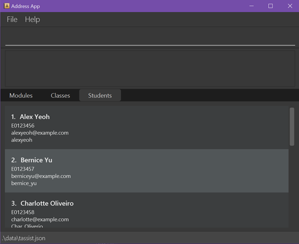
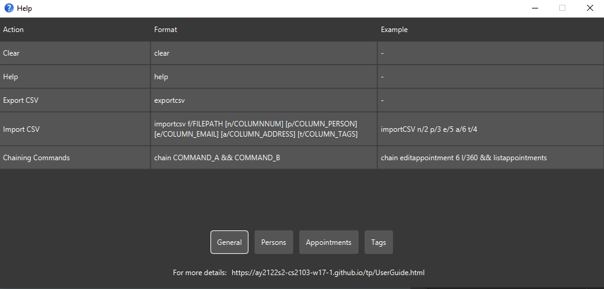

# Tracey

Tracey is a **desktop app for managing health statuses of NUS students, optimized for use via a Command Line
Interface** (CLI) while still having the benefits of a Graphical User Interface (GUI). If you can type fast,
Tracey can get your student health status management tasks done faster than traditional GUI apps.

--------------------------------------------------------------------------------------------------------------------

* [Quick Start](#quick-start)
* [Features](#features)
    * [Finding a contact](#finding-a-contact-find)
    * [Adding a contact](#adding-a-contact-add)
    * [Deleting a contact](#deleting-a-contact-delete)
    * [Editing an exisiting contact](#editing-an-existing-contact-edit)
    * [Clearing all records](#clearing-all-records-clear)
    * [Summarising the records](#summarising-the-records-summarise)
    * [Listing the records](#listing-the-records-list)
    * [Viewing help](#viewing-help-help)
    * [Filtering contacts](#filtering-contacts-filter)
    * [Saving](#saving)
* [FAQ](#faq)
* [Command Summary](#command-summary)

--------------------------------------------------------------------------------------------------------------------

## Quick Start
1. Ensure you have Java 11 or above installed in your Computer.
2. Download the latest `Tracey.jar` from [here](https://github.com/se-edu/addressbook-level3/releases).
3. Copy the file to the folder you want to use as the home folder for your Tracey application.
4. Double-click the file to start the app. The GUI similar to the below should appear in a few seconds.
   Note how the app contains some sample data.  
   
5. Type the command in the command box and press Enter to execute it. e.g. typing **`help`** and pressing Enter will open the help window. 
   Some example commands you can try:

* **`list`** : Lists all contacts.

* **`summarise`** : summarise all contacts into their respective faculty and informs the reader percentage of student from that faculty is Covid positive.

* **`add`**`n/John Doe p/98765432 e/johnd@example.com a/John street, block 123, #01-01` : Adds a contact named `John Doe` to the Address Book.

* **`delete`**`3` : Deletes the 3rd contact shown in the current list.

* **`clear`** : Deletes all contacts.

* **`exit`** : Exits the app.

6. Refer to the [Features](#features) below for details of each command.

--------------------------------------------------------------------------------------------------------------------

## Features
### Finding a contact: `find`
Find a particular contact in Tracey.

Format: `find NAME`
* Returns the student(s) with the given details: `covid-positive`, `covid-negative`, `close-contact`
* The search is case-sensitive. e.g `johnDoe` will not match `Johndoe`

Examples of usages:

* `find John` returns `john` and `John Doe`
* `find alex david` returns `Alex Yeoh` and`David Li`

### Adding a contact: `add`
Add a student with relevant details into Tracey.

Format: `add n/NAME p/PHONENUMBER e/EMAIL ...`
* Add a student with the specific tags
* The student name is case sensitive e.g. `add n/johnDoe` will logged as `johnDoe` and not `JohnDoe` in Tracey
* Phone Number, email and matriculation number must be **unique** to each student
* Order of the tags does not matter e.g. `add n/NAME p/PHONENUMBER` is the same as `add p/PHONENUMBER n/NAME`
* Tracey will acknowledge that the student has been added
* Tags such as faculty and covid status must be a valid pre-defined constant in its respective enumeration class

Examples of usage:
* `add n/Melvin f/SOC cs/ Negative`
* `add e/student69@u.nus.edu n/ Martin`

Possible tags:
| **Tag** | **Meaning** | **Pre-defined constants** |
| - | - | - |
| `n/`  | Name | - |
| `p/` | Phone Number | - |
| `e/` | Email | - |
| `a/` | Address | - |
| `f/` | Faculty |  `FASS` `BIZ` `SOC` `SCALE` `FOD` `CDE` `DUKE` `FOL` `YLLSOM` `YSTCOM` `SOPP` `LKYSPP` `SPH` `TEST` `FOS` |
| `mc/` | Matriculation Number | - |
| `cs`/ | Covid Status | Positive, Negative, HRN |

### Deleting a contact: `delete`
Delete a contact at a specific index

Format: `delete NAME`
* Delete the student from the database
* Deletes one student at a time
* Can only delete at an index where a student exist

Examples of usage:
* `delete 2` removes the 2nd student on the list
* `delete 10` removes the 10th student on the list

### Editing an existing contact: `edit`
* Edits the person at the specified INDEX. The index refers to the index number shown in the displayed person list.
  The index **must be a positive integer** 1, 2, 3, …
* At least one of the optional fields must be provided.
* Existing values will be updated to the input values.
* When editing tags, the existing tags of the person will be removed i.e adding of tags is not cumulative.
* You can remove all the person’s tags by typing t/ without specifying any tags after it.

Format: `edit INDEX n/NAME ...`

Examples of usage:
* `edit 1 p/91234567 e/johndoe@example.com` edits the phone number and email address of the 1st person to be `91234567`
  and `johndoe@example.com` respectively.
* `edit 2 n/David Limpeh t/` edits the entry to become `David Limpeh` and clears all existing tags.

### Clearing all records: `clear`
Clear all the data inside `Tracey`

Format:`clear`

:warning: `Save a copy of the data file if you intend to keep it as the deleted files cannot be recovered.`

### Summarising the records: `summarise`
Summarises the record inside `Tracey` that an overview of the data, such as number of students who are `covid-positive`. It will return an unfiltered list of the addressboook
to show everyone in the address book while providing a valid response by the application.

Format:`summarise`

Example of usage:
*  `summarise` summarises the contacts of everyone in the Tracey application such that she responses with how many Covid positive students in faculty A, how many on HRN and negative.

Future Enhancements:
*  For future versions, summarise command can display a visual pie chart for different faculties to visualise the percentage of Covid positive students.
This can aid understanding of raw data easier.

### Listing the records: `list`
List the full record, which displays all the student's data that are logged into Tracey.

Format: `list`

### Viewing help: `help`
Shows a message explaining how to access the help page.

Format: `help`

### Filtering contacts: `filter`
Filter student based on health statuses and/or faculties

Format:`filter cs/HEALTH_STATUS f/FACULTY`

* Returns a list of students with the given health status: `positive`, `negative`, `hrn`
* The search is case-insensitive. e.g `Positive` will match `positive`

Examples of usage:
* `filter cs/positive` returns all students that are tagged as covid-positive
* `filter f/soc` returns all students that are enrolled in the faculty SOC (School of Computing)
* `filter cs/negative f/soc` returns all students that are tagged as covid-negative and enrolled in the faculty SOC (School of Computing)

### Saving
Saving in the application is automatic. The data in the file will be saved accordingly whenever
there are changes to `Tracey`.

--------------------------------------------------------------------------------------------------------------------

### FAQ
**Q**: How do I transfer my data to another computer?  
**A**: Copy the file from [ROOT]/data/tracey.txt over to your other computer.  

**Q**: What is the difference between the `list` command and `summarise` command?  
**A**: The `list` command will provide an unfiltered list of addressbook whereas `summarise` command provides an overview
of the data (Covid statuses) and give the user an easier understanding of how the faculty is dealing with the Covid outbreak.  

--------------------------------------------------------------------------------------------------------------------

### Command Summary
| No. | Command | Description |
| - | - | - |
| 1. | `find` | Included in `AB3`|
| 2. | `add` | Included in AB3 with additional attributes such as faculty, matriculation number and covid status |
| 3. | `delete` | Included in `AB3` |
| 4. | `edit` | Included in `AB3` |
| 5. | `clear` | Delete everything inside `Tracey` |
| 6. | `summarise` | Summarise data into a list for an overview |
| 7. | `list` | Included in `AB3` |
| 8. | `help` | Included in `AB3` |
| 9. | `filter` | Retrieve list of people based on covid status |
| 10. | Saving contacts into file | `Tracey` auto saves contacts into file |
