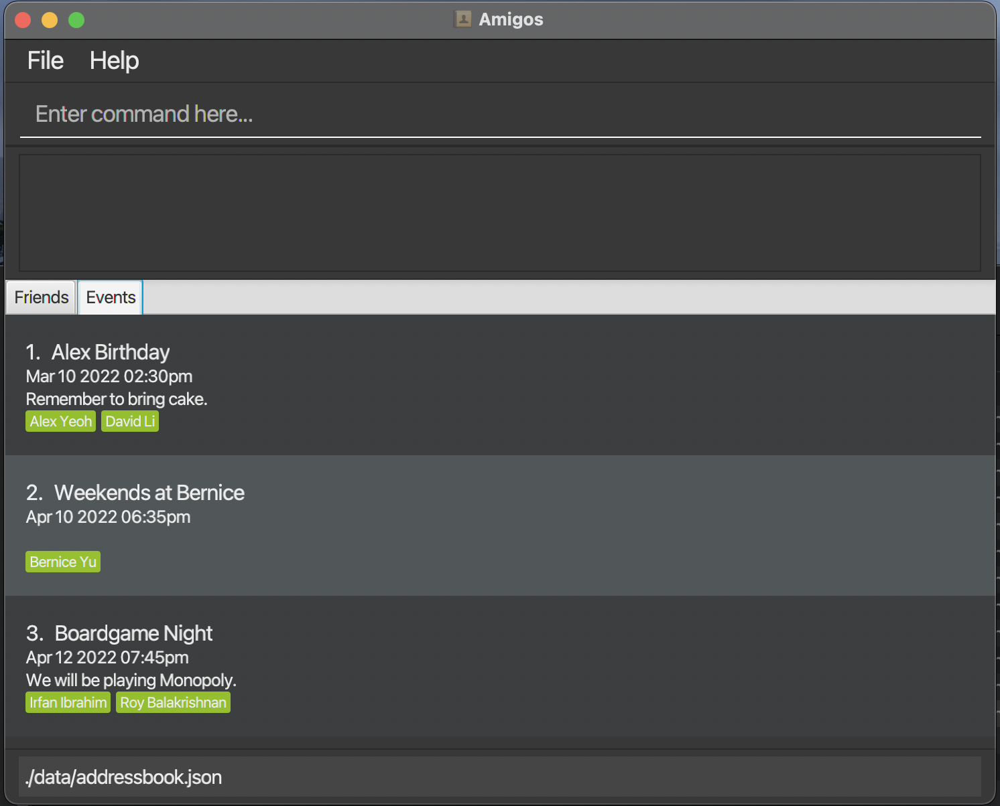

Amigos is a desktop application to help tech-savvy university students manage their friendships by helping them to keep track of important details. It is optimized for use via a Command Line interface while still having the benefits of a Graphical User Interface (GUI).

* Table of Contents
{:toc}

--------------------------------------------------------------------------------------------------------------------

# Quick start

1. Ensure you have Java `11` or above installed in your Computer.

2. Download the latest `amigos.jar` from [here](https://github.com/AY2122S2-CS2103-F09-2/tp/releases/tag/v1.1).

3. Copy the file to the folder you want to use as the _home folder_ for your application.

4. Double-click the file to start the app. The GUI similar to the below should appear in a few seconds. Note how the app contains some sample data. 
   

5. Type the command in the command box and press Enter to execute it. e.g:

  * **`showfriends`** : Lists all friends.

6. Refer to the [Features](#features) below for details of each command.

--------------------------------------------------------------------------------------------------------------------

# Features

**:information_source: Notes about the command format:** 

* Words in `UPPER_CASE` are the parameters to be supplied by the user. 
  e.g. in `addfriend n/NAME`, `NAME` is a parameter which can be used as `addfriend n/John Doe`.

* Items in square brackets are optional. 
  e.g `n/NAME [t/TAG]` can be used as `n/John Doe t/friend` or as `n/John Doe`.

* Items with `…`​ after them can be used multiple times including zero times. 
  e.g. `[t/TAG]…​` can be used as ` ` (i.e. 0 times), `t/friend`, `t/friend t/family` etc.

* Parameters can be in any order. 
  e.g. if the command specifies `n/NAME p/PHONE_NUMBER`, `p/PHONE_NUMBER n/NAME` is also acceptable.

* If a parameter is expected only once in the command but you specified it multiple times, only the last occurrence of the parameter will be taken. 
  e.g. if you specify `p/12341234 p/56785678`, only `p/56785678` will be taken.

* Extraneous parameters for commands that do not take in parameters (such as `showfriends`, `showevents` and `exit`) will be ignored. 
  e.g. if the command specifies `showfriends 123`, it will be interpreted as `showfriends`.

* Arguments connected by a `?` are exclusively-or - i.e. only one or the other can be provided.
  e.g. in `addlog INDEX ? n/NAME`, either `INDEX` or `NAME` must be provided, but not both.

## Friend Management
Amigos is designed to help you keep track of the friends in your life.

### Adding a friend: `addfriend`

Adds a new friend to Amigos. A friend has:

**Format**: `addfriend n/NAME  [p/PHONE_NUMBER] [e/EMAIL]  [a/ADDRESS] [d/DESCRIPTION] [t/TAG]…`

* Note that `NAME` field is minimally compulsory. `p/`, `em/`, `a/` and `d/` `t/` flags and their arguments are optional.
* Note that there can be no duplicate friends having the same name.

**Examples**:
* `addfriend n/John Doe p/98765432 e/johnd@example.com a/John street, block 123, #01-01 d/Physics Major, Sarah’s friend. Met at Freshman Dinner.`
* `addfriend n/John Doe t/Friend t/Banker`

### Editing a friend : `editfriend`

Edits an existing friend in Amigos.

**Format**: `editfriend INDEX [nn/NEW_NAME]  [np/NEW_PHONE_NUMBER] [ne/NEW_EMAIL] [na/NEW_ADDRESS] [nd/NEW_DESCRIPTION] [nt/TAG]...`

* Edits an existing friend in Amigos.
* At least one of the optional fields must be provided.
* Existing values will be overwritten to the input values.
* Note that when editing tags, the existing tags of the friend will be removed i.e adding of tags is not cumulative.

**Examples**:
* `editfriend 1 na/John street, block 456, #01-01 ne/johndoe@example.com` edits the address
  and email of the friend at `INDEX` 1 to be `John street, block 456, #01-01` and `johndoe@example.com` respectively.

### Deleting a friend : `deletefriend`

Deletes a friend in Amigos.

**Format**: `deletefriend INDEX ? n/NAME`

* Either a specified`INDEX`or `NAME` of an existing friend in Amigos must be provided.

**Examples**:
* `deletefriend n/John Doe`
* `deletefriend 1`

### Show a specific friend: `showfriend`

Shows page containing the full details related to an existing friend in Amigos.

**Format**: `showfriend n/NAME`

* NAME field **must** be provided.
*  If the `-alllogs` flag is provided all the logs contained in that person will be displayed instead of the default 10 logs. *__(Coming Soon!)__*

**Examples**:
* `showfriend n/John Doe` Will open up the page containing full details related to John Doe - his name, address, phone number, email, description, logs, and upcoming events with him.

### Show all friends : `showfriends`

Shows all friends in Amigos. Switches GUI to the friends tab.

**Format**: `showfriends`

### Find friends : `findfriend`

Find friends in Amigos whose name contain any of the given keyword(s).

**Format**: `findfriend KEYWORD [MORE_KEYWORDS]`

* The search is case-insensitive. e.g john will match John
* The order of the keywords does not matter. e.g Doe John will match John Doe
* Only the name is searched.
* Only full words will be matched e.g Joh will not match John
* Friends matching at least one keyword will be returned. e.g John will return John Doe, John Tan
* Either a specified`INDEX`or `NAME` of an existing friend in Amigos must be provided.

**Examples**:
* `findfriend John`
* `findfriend John Emily Russell`

## Logs management
Amigos provides functionality to manage logs, which are essentially detailed notes about a specific friend.

### Adding a log: `addlog`

Adds a log to an existing friend at the specified `INDEX` in Amigos.
The `INDEX` refers to the index number shown in the displayed person's list.

**Format**: `addlog INDEX ? n/NAME ttl/[TITLE] d/[DESCRIPTION]`

* Exactly one of `INDEX` or the `NAME` fields is compulsory.
* If the `TITLE` argument is provided, then the `DESCRIPTON` argument is optional.
* If neither `TITLE` nor `DESCRIPTION` arguments are provided, then a GUI
  pop up will prompt the user to key in the title and longer-form text as the description.

**Examples**:
* `addlog 1 ttl/has a pet named poki`
* `addlog John ttl/recommended movies d/the martian, interstellar, three idiots`

### Editing a log: `editlog`

Edits an existing log of an existing friend in Amigos.

**Format**: `editlog n/[NAME] id/[LOG_INDEX] nt/[NEW_TITLE] nd/[NEW_DESCRIPTION]`

* The `NAME` field is compulsory.
* If `LOG_INDEX` is not provided, then all logs, each with an accompanying index, will allow a user to
  choose which log to apply the changes to.
* At least one of the `NEW_TITLE` or `NEW_DESCRIPTION` arguments must be provided.
  Both will directly overwrite the current values.
* If neither `NEW_TITLE` nor `NEW_DESCRIPTION` arguments are provided, then a GUI
  pop up will prompt the user to key in the title and longer-form text as the description.

**Examples:**
* `editlog n/John Doe id/1 nt/has a pet named Poki`
* `editlog n/Andrew Tan id/1 nt/recommended movies and shows nd/the martian, interstellar, three idiots, peaky blinders`

### Deleting a log: `deletelog`

Deletes an existing log of an existing friend in Amigos.

**Format**: `deletelog INDEX id/LOG_INDEX -a`

* The `INDEX` field is compulsory.
* If `INDEX` is provided as well as a `-a` flag, then all logs of tht person will
  be deleted.
* If `LOG_INDEX` is not provided and there is no `-a` flat, then all logs, each with an
  accompanying index, will allow a user to choose one log to delete.
* If no `INDEX` or `LOG_INDEX` is provided, but `-a` is provided, then all possible logs
  of all friends will be deleted.

**Examples:**
* `deletelog n/John Doe id/1`
* `deletelog n/John Doe -a `
* `deletelog -a`

## Event Management
Amigos also allows you to keep track of your social events!

### Creating an event: `addevent`
Adds a new event, which can be optionally linked to any number of existing friends.

**Format**: `addevent n/EVENT_NAME dt/DATE_TIME [d/DESCRIPTION] [f/FRIEND_NAME]...`

* There **cannot** be any duplicate events with the same name and date.
* The `DATE_TIME` must be given in the following format: `DD-MM-YYYY hhmm`
* All given `FRIEND_NAME` values must match the `NAME` of an existing friend in Amigos.

**Examples**:
* `addevent n/John’s Birthday dt/15-08-2021 1700 d/Remember to get a present! f/John Low f/Alex Yeo`
* `addevent n/Christmas Party dt/25-12-2022`

### Editing an event: `editevent`
Edits an existing event.

**Format**: `editevent INDEX [n/EVENT_NAME] [dt/DATE_TIME] [d/DESCRIPTION] [af/ADD_FRIEND_NAME]... rf/[REMOVE_FRIEND_NAME]...`

* Edits the event at the specified `INDEX`. The index refers to the index number shown in the displayed events list. The index **must be a positive integer** 1, 2, 3, ...
* At least one of the optional fields must be provided.
* The `EVENT_NAME`, `DATE_TIME` and `DESCRIPTION` arguments directly overwrite the existing details.
* The `ADD_FRIEND_NAME` and `REMOVE_FRIEND_NAME` arguments add/remove friends tied to the event respectively, and must match the `NAME` of an existing friend in Amigos.

**Examples**:
* `editevent 2 dt/16-08-2022 1600 af/Jacky Jones rf/Sarah Lim rf/Alex Yeo` will edit the date & time of the 2nd event to `16-08-2022 1600`, adds `Jacky Jones`, and removes `Sarah Lim` and `Alex Yeo` from the event.

### Deleting events: `deleteevent`
Delete existing event(s).

**Format**: `deleteevent INDEX`

* Deletes the event at the specified `INDEX`.
* The index refers to the index number shown in the displayed events list.
* The index **must be a positive integer** 1, 2, 3, ...

**Examples**:
* `deleteevent 2`

### Show all events : `showevents`

Shows all events stored in Amigos. Switches GUI to the events tab.

**Format**: `showevents`

### Find events : `findevent`

Find events in Amigos whose properties match the given search criteria.

**Format**: `findevent [n/EVENT_NAME_SUBSTRING] [dt/DATE] [f/FRIEND_NAME_SUBSTRING]...`

* For search by `EVENT_NAME_KEYWORD`/`FRIEND_NAME_KEYWORD`:
  * The search is **case-insensitive**. e.g john will match John
  * For each search field, an event is a match if the search substring matches.
    * e.g n/Birthday will match events with names John's Birthday, Bob's Birthday
    * e.g. f/joe will match events containing either Joe Maggio or Joe Allen in the friends list.

* For search by `DATE`:
  * The date must be given as follows: `DD-MM-YYYY`
  * (COMING SOON) Filter by time period???
* At least one of the optional fields must be provided
* If more than one field is given, only events with matches for **all** search criteria will be shown.

**Examples**:
* `findevent n/dinner dt/20-03-2022` returns events on 20 Mar 2022 with an event name containing 'dinner' 
* `findevent f/Joe f/John` will return events with a friends list containing both 'joe' and 'john'

## Miscellaneous
### Viewing help : `help`

Shows a message explaining how to access the help page.

**Format**: `help`

### Clearing all existing data : `clear`

Clears all existing friends, events, and logs in Amigos.

**Format**: `clear`

### Exiting the program : `exit`

Exits the program.

**Format**: `exit`

### Saving the data

Amigos data is saved in the hard disk automatically after any command that changes the data. There is no need to save manually.

### Editing the data file

Amigos data is saved as a JSON file `[JAR file location]/data/amigos.json`. Advanced users are welcome to update data directly by editing that data file.

:exclamation: **Caution:**
If your changes to the data file makes its format invalid, Amigos will discard all data and start with an empty data file at the next run.

--------------------------------------------------------------------------------------------------------------------

## FAQ

**Q**: How do I transfer my data to another Computer? 
**A**: Install the app in the other computer and overwrite the empty data file it creates with the file that contains the data of your previous Amigos home folder.

--------------------------------------------------------------------------------------------------------------------

## Command summary

| Action                     | Format, Examples                                                                                                                                                                                                                                                       |
|----------------------------|------------------------------------------------------------------------------------------------------------------------------------------------------------------------------------------------------------------------------------------------------------------------|
| **Add Friend**             | `addfriend n/NAME  [p/PHONE_NUMBER] [e/EMAIL]  [a/ADDRESS] [d/DESCRIPTION] [t/TAG]...`   e.g., `addfriend n/John Doe p/98765432 e/johnd@example.com a/John street, block 123, #01-01 d/Physics Major, Sarah’s friend. Met at Freshman Dinner. t/friend t/classmate` |
| **Edit friend**            | `editfriend INDEX [nn/NEW_NAME]  [np/NEW_PHONE_NUMBER] [ne/NEW_EMAIL] [na/NEW_ADDRESS] [nd/NEW_DESCRIPTION] [nt/TAG]...`   e.g., `editfriend 1 na/John street, block 456, #01-01 ne/johndoe@example.com`                                                            |
| **Delete Friend**          | `deletefriend INDEX ? n/NAME`   e.g., `deletefriend n/John Doe`, `deletefriend 1`                                                                                                                                                                                   |
| **Show a specific friend** | `showfriend n/NAME`                                                                                                                                                                                                                                                    |
| **Show all friends**       | `showfriends`                                                                                                                                                                                                                                                          |
| **Find friends**           | `findfriend KEYWORD [KEYWORD]...`                                                                                                                                                                                                                                      |
| **Add log**                | `addlog n/[NAME] t/[TITLE] d/[DESCRIPTION]`                                                                                                                                                                                                                            |
| **Edit log**               | `editlog n/[NAME] id/[LOG_INDEX] nt/[NEW_TITLE] nd/[NEW_DESCRIPTION]`                                                                                                                                                                                                  |
| **Delete log**             | `deletelog n/[NAME] id/[LOG_INDEX] -a`                                                                                                                                                                                                                                 |
| **Add Event**              | `addevent n/EVENT_NAME dt/DATE_TIME [d/DESCRIPTION] [f/FRIEND_NAME]...`   e.g.,`addevent n/John’s Birthday dt/15-08-2021 1700 d/Remember to get a present! f/John Low f/Alex Yeo`                                                                                   |
| **Edit Event**             | `editevent INDEX [n/EVENT_NAME] [dt/DATE_TIME] [d/DESCRIPTION] [af/ADD_FRIEND_NAME]... rf/[REMOVE_FRIEND_NAME]...`   e.g., `editevent 2 dt/16-08-2022 1600 af/Jacky Jones rf/Sarah Lim rf/Alex Yeo`                                                                 |
| **Delete Event**           | `deleteevent INDEX`   e.g., `deleteevent 2`                                                                                                                                                                                                                         |
| **Show all events**        | `showevents`                                                                                                                                                                                                                                                           |
| **Find an event**          | `findevent [n/EVENT_NAME_SUBSTRING] [dt/DATE] [f/FRIEND_NAME_SUBSTRING]...`   e.g.,`findevent n/dinner dt/20-03-2022 f/Maggie`                                                                                                                                      |
| **Help**                   | `help`                                                                                                                                                                                                                                                                 |
| **Clear**                  | `clear`                                                                                                                                                                                                                                                                |
| **Exit**                   | `exit`                                                                                                                                                                                                                                                                 |
