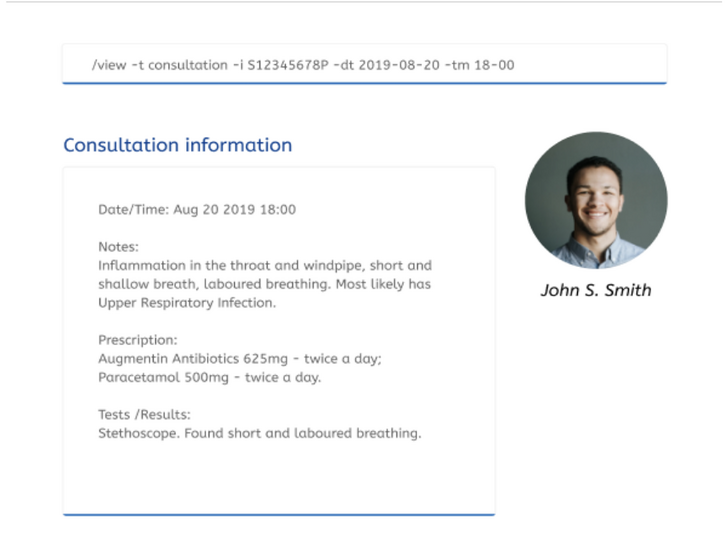
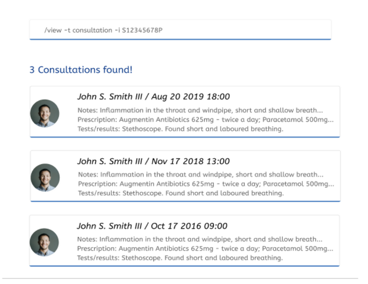

### 2.7	Create Consultation Information: /create -t consultation
Adds a consultation report of a patient to the MedBook.

Format: /create -t consultation -i S12345678P [-dt DATE] [-tm TIME] [-n NOTES] [-p PRESCRIPTION] [-tt TESTS TAKEN AND RESULTS]

NOTE:  [-dt DATE][-tm TIME] are in the form dd-MM-yyyy, HH-mm (24 hour) respectively.

Examples:  
* /create -t consultation -i S12345678P -dt 15-09-2021 -tm 18-00 -n Inflammation in the throat and windpipe, short and shallow breath, laboured breathing. Most likely has Upper Respiratory Infection. -p Augmentin Antibiotics 625mg - twice a day; Paracetamol 500mg - twice a day. -tt Stethoscope. Found short and laboured breathing.

### 2.8	View Past Consultations: /view -t consultation
View all past consultations in the MedBook that fit search parameters. All fields are optional.

Format: /view -t consultation  -i S12345678P [-dt DATE][-tm TIME]

NOTE:  [-dt DATE][-tm TIME] are in the form dd-MM-yyyy, HH-mm (24 hour) respectively.

Examples:
* /view -t consultation
  * Shows all the consultations for all patients
* /view -t consultation -i S12345678P
  * Shows all the consultations for patient with id S12345678P
* /view -t consultation -i S12345678P -dt -09-2021
  * Shows all consultations for patients with id S12345678P that occurred in Sept 2021
* /view -t consultation -dt 15-09-2021 -tm 18-00
  * Shows consultation that occurred on Sept 15 2021 1800hrs
    

View Consultation Information User Interface

### 2.9	Delete Consultation Information: /delete -t consultation
Deletes a consultation of a patient from the MedBook.

Format: /delete -t consultation -i S12345678P [-dt DATE] [-tm TIME]

Examples:
* /delete -t consultation -i S12345678P  -dt 15-09-2021 -tm 18-00

## 3.0	FAQ
Q: How do I transfer my data to another Computer?  
A: Install the app on the other computer and overwrite the empty data file it creates with the file that contains the data of your previous MedBook folder.  

## 4.0 Command Summary
| Action | Format Example |
| ------ | -------------- |
| Add Contact Info | /create -t contact -i NRIC -n NAME -p PHONE_NUMBER -e EMAIL -a ADDRESS |
| View Contact Info | /view -t contact [-i NRIC] [-n NAME] [-p PHONE_NUMBER] [-e EMAIL] |
| Delete Contact Info | /delete -t contact -i NRIC |
| Add Medical Info | /create -t medical -i S12345678P [-a AGE] [-bt BLOOD_TYPE] [-md MEDICATION]... |
| View Medical Info | /view -t medical [-i NRIC] |
| Delete Medical Info | /delete -t medical -i NRIC |
| Add Consultation Info | /create -t consultation -i S12345678P [-dt DATE] [-tm TIME] [-n NOTES] [-p PRESCRIPTION] [-tt TESTS TAKEN AND RESULTS] |
| View Consultation Info | /view -t consultation  -i S12345678P [-dt DATE][-tm TIME] |
| Delete Consultation Info | /delete -t consultation -i S12345678P [-dt DATE] [-tm TIME] |

