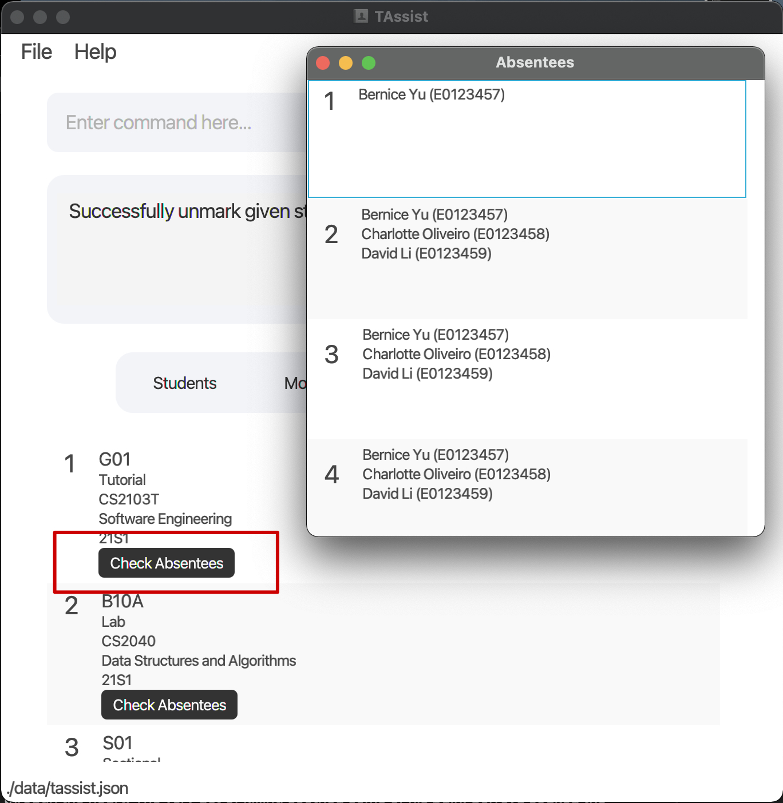
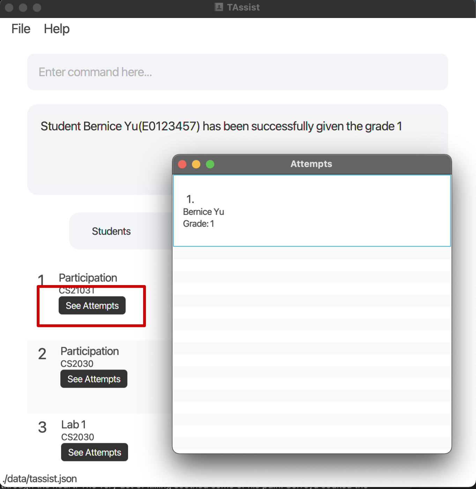

TAssist is a desktop app designed to **help teaching assistants manage their classes and students.** TAssist lets you save student contact data and group students into class groups and modules. Record attendance, mark assessments, and more by typing commands. TAssist combines its text command-based system with an intuitive interface to help you work quickly while displaying information in a clear and organized manner. If you are someone who prefers **Command Line Interface** (CLI) to **Graphical User Interface** (GUI) while having a GUI to view student data, TAssist is the app for you. However, if you are not familiar with CLI, this user guide will help you understand how each commands work.

* Table of Contents
{:toc}

--------------------------------------------------------------------------------------------------------------------

## Quick start

1. Ensure you have Java `11` or above installed in your Computer.
   1. You can download the [Oracle version](https://www.oracle.com/java/technologies/downloads/#java11) or another alternative such as the OpenJDK version.
   1. To check if Java is installed successfully, you can open Command Prompt (for Windows users) or Terminal (for Mac users) and type `java --version`.

1. Download the latest `TAssist.jar` from [here](https://github.com/AY2122S2-CS2103T-T13-2/tp/releases).

1. Copy the file to the folder you want to use as the _home folder_ for your TAssist.

1. Double-click the file to start the app. The GUI similar to the below should appear in a few seconds. Note how the app contains some sample data. 
   

1. When you open TAssist for the first time, the app displays sample data. A data file will be saved to your device only after you issue your first command.

1. Type the command in the command box and press Enter to execute it. e.g. typing **`list student`** and pressing Enter will list all students added. 
   Some example commands you can try:

   * **`list student`**: Lists all students.

   * **`add student`** `id/E0123456 n/John Doe e/johnd@u.nus.edu`: Adds a student named `John Doe` to TAssist.

   * **`delete student`** `3`: Deletes the 3rd student shown in the listing of the entity.

1. Refer to the [Features](#features) below for details of each command.

--------------------------------------------------------------------------------------------------------------------

## Using this Guide

**:information_source: Notes about the command format:** 

* Words in `UPPER_CASE` are the parameters to be supplied by the user. 
  e.g. in `add n/NAME`, `NAME` is a parameter which can be used as `add n/John Doe`.

* Items in square brackets are optional. 
  e.g. `n/NAME [t/TELEGRAM_ID]` can be used as `n/John Doe t/john_doe` or as `n/John Doe`.

* Only one group of arguments in curly braces can be used as argument. Each group is separated by a `|`. 
  e.g. `{m/MODULE_INDEX | c/CLASS_GROUP_INDEX}` can be used as `m/1` or as `c/1` but not as `m/1 c/1`.

* If multiple options are accepted for a parameter, only one option can be specified. 
  e.g. `s/all|STUDENT_INDEXES|STUDENT_IDS` can be used as `s/all`, `s/1,2,3,4,5,6` and `s/e0123456,e0234567` but not mix-and-matched as `s/all,1,2,e0123456`.

* Parameters can be in any order. 
  e.g. if the command specifies `n/NAME e/EMAIL`, `e/EMAIL n/NAME` is also acceptable.

* If a parameter is expected only once in the command, but you specified it multiple times, only the last occurrence of the parameter will be taken. 
  e.g. if you specify `t/john_doe t/johnny_doe`, only `t/johnny_doe` will be taken.

* Extraneous parameters for commands that do not take in parameters will be ignored. 
  e.g. if the command specifies `list student 123`, it will be interpreted as `list student`.

* For commands that do take in parameters, any extraneous parameters will be parsed together with the value of the previous parameter. 
  e.g. if the command specifies `list student c/1 f/1`, the class group index will be interpreted as `1 f/1` and an error will be returned.

## Features & Walkthrough

### User Interface (UI)

TAssist's user interface features a command input box, a command results box, and a button bar. Use the buttons to switch between lists of your modules, class groups, students, and assessments.

From TAssist's "Classes" tab, click the "Check Absentees" button to open a popup window. This popup  displays a list of lessons 1-13 and any students who were **absent** for a lesson.

From TAssist's "Assessments" tab, click the "See Attempts" button to open a popup window. This popup displays a list of student attempts for that assessment including their name and assigned grade.

### Command Parameters

<table>
<tbody>
    <tr>
        <th>Parameter</th>
        <th>Prefix</th>
        <th>Description</th>
    </tr>
    <tr>
        <td>ACADEMIC_YEAR</td>
        <td><code>a/</code></td>
        <td>It represents the year (last 2 digits) and a semester. Semester value ranges from <code>S1</code> to <code>S8</code>. The table under the <code>Add a module</code> feature shows the representation of each value.
        </td>
    </tr>
    <tr>
        <td>ASSESSMENT_INDEX</td>
        <td><code>a/</code></td>
        <td>It represents the index of the assessments shown when <code>list assessment</code> is executed.
        </td>
    </tr>
    <tr>
        <td>ASSESSMENT_NAME</td>
        <td><code>n/</code></td>
        <td>It represents the name of the assessments e.g. <code>Lab 1</code>.
        </td>
    </tr>
    <tr>
        <td>CLASS_GROUP_ID</td>
        <td><code>id/</code></td>
        <td>It represents the ID of the class group, similar to those used by <a href="https://nusmods.com/modules">NUSMods</a>, e.g. <code>T13</code>.
        </td>
    </tr>
    <tr>
        <td>CLASS_GROUP_INDEX</td>
        <td><code>c/</code></td>
        <td>It represents the index of the class groups shown when <code>list class</code> is executed.
        </td>
    </tr>
    <tr>
        <td>CLASS_GROUP_TYPE</td>
        <td><code>t/</code></td>
        <td>It represents the type of the class groups e.g. <code>Tutorial</code>.
        </td>
    </tr>
    <tr>
        <td>EMAIL</td>
        <td><code>e/</code></td>
        <td>It represents the email of the student.
        </td>
    </tr>
    <tr>
        <td>GRADE</td>
        <td><code>g/</code></td>
        <td>It represents the numerical grade given to a student's assignment attempt.
        </td>
    </tr>
    <tr>
        <td>INDEX</td>
        <td>No prefix</td>
        <td>It represents the index of the students/modules/class groups/assessments shown when <code>list student</code>/<code>list module</code>/<code>list class</code>/<code>list assessment</code> is executed.
        </td>
    </tr>
    <tr>
        <td>KEYWORD</td>
        <td>No prefix</td>
        <td>It represents the string to match when returning search results.
        </td>
    </tr>
    <tr>
        <td>MODULE_CODE</td>
        <td><code>c/</code></td>
        <td>It represents the code of the module, similar to those used by <a href="https://nusmods.com/modules">NUSMods</a>, e.g. <code>CS2103T</code>.
        </td>
    </tr>
    <tr>
        <td>MODULE_INDEX</td>
        <td><code>m/</code></td>
        <td>It represents the index of the modules shown when <code>list module</code> is executed.
        </td>
    </tr>
    <tr>
        <td>MODULE_NAME</td>
        <td><code>n/</code></td>
        <td>It represents the name of the module, similar to those used by <a href="https://nusmods.com/modules">NUSMods</a>, e.g. <code>Software Engineering Project</code>.
        </td>
    </tr>
    <tr>
        <td>NAME</td>
        <td><code>n/</code></td>
        <td>It represents the name of the student.
        </td>
    </tr>
    <tr>
        <td>SIMPLE_NAME</td>
        <td><code>sn/</code></td>
        <td>It represents the short form of the assessment. It is used to grade assessment, so that you do not need to type the full assessment name. If no simple name is provided, the assessment name will be used (with the spaces removed).
        </td>
    </tr>
    <tr>
        <td>STUDENT_ID</td>
        <td><code>id/</code></td>
        <td>It represents the ID of the student, e.g. <code>E0123456</code>.
        </td>
    </tr>
    <tr>
        <td>TELEGRAM_ID</td>
        <td><code>t/</code></td>
        <td>It represents the Telegram handle of the student.
        </td>
    </tr>
    <tr>
        <td>WEEK_INDEX</td>
        <td><code>w/</code></td>
        <td>It represents the week index of the lesson, similar to the ones used by NUS Academic Calendar, e.g. <code>1</code> to <code>13</code>.
        </td>
    </tr>
    <tr>
        <td>all|STUDENT_INDEXES|STUDENT_IDS</td>
        <td><code>s/</code></td>
        <td>
            <ul>
                <li><code>all</code> refers to all students.</li>
                <li><code>STUDENT_INDEXES</code> represents the index of the students shown when <code>list student</code> is executed.</li>
                <li><code>STUDENT_IDS</code> represents the student ID of the student, e.g. <code>E0123456</code>.</li>
            </ul>
        </td>
    </tr>
</tbody>
</table>

--------------------------------------------------------------------------------------------------------------------

## Features

### Managing Modules

#### Add a module: `add module`

Start using TAssist by adding modules you're teaching.

Format: `add module n/MODULE_NAME c/MODULE_CODE a/ACADEMIC_YEAR`

* `ACADEMIC_YEAR` is represented by the year (last 2 digits) and a semester.
* Semester value ranges from S1 to S8. The table below shows the representation of each value:

| Key | Semester               |
|-----|------------------------|
| S1  | Semester 1             |
| S2  | Semester 2             |
| S3  | Special Term (Part 1)  |
| S4  | Special Term (Part 2)  |
| S5  | Mini-Semester 1A       |
| S6  | Mini-Semester 1B       |
| S7  | Mini-Semester 2A       |
| S8  | Mini-Semester 2B       |

Examples:
* `add module n/Software Engineering Project c/CS2103T a/21S1` creates a new module named `Software Engineering Project` with a module code of `CS2103T` for the academic year `21S1` (academic year 2021 Semester 1).

#### List all modules: `list module`

Use the list module command to display your modules in TAssist's "Modules" tab.

Format: `list module`

#### Delete a module: `delete module`

:exclamation: **Caution:**
This command is destructive.

You can always delete a module from TAssist. Deleting the module will also delete associated class group(s) and assessment(s).

Format: `delete module INDEX`

* Deletes the module at the specified `INDEX`.
* The index refers to the index number shown in the displayed module list.
* The module is removed from both the displayed list and the original list.
* The index **must be a positive integer** 1, 2, 3, …​

Examples:
* `list module` followed by `delete module 2` deletes the 2nd module and its associated class group(s) and assessment(s) in TAssist.

### Managing Assessments

#### Add an assessment: `add assessment`

TAssist lets you create and grade module-wide assessments. Assessments can represent any gradable component including exams, participation, labs, and homework assignments.

Format: `add assessment n/ASSESSMENT_NAME m/MODULE_INDEX [sn/SIMPLE_NAME]`

Examples:
* `add assessment n/Test m/1` creates a new assessment that is tied to the 1st module shown when `list module` is executed.

#### List all assessments: `list assessment`

Use the list assessment command to display your assessments in TAssist's "Assessments" tab. Optionally, you can filter this list by a specific module.

Format: `list assessment [m/MODULE_INDEX]`

* Displays the assessments belonging to the module at the specified `MODULE_INDEX`. If `MODULE_INDEX` is not specified, displays all assessments.
* The index refers to the index number shown in the displayed module list.
* The index **must be a positive integer** 1, 2, 3, …​

Examples:
* `list assessment m/1` displays the assessment(s) belonging to the 1st module shown when `list module` is executed.

#### Delete an assessment: `delete assessment`

:exclamation: **Caution:**
This command is destructive.

Delete any assessment from TAssist by specifying its index.

Format: `delete assessment INDEX`

* Deletes the assessment at the specified `INDEX`.
* The index refers to the index number shown in the displayed assessment list.
* The assessment is removed from both the displayed list and the original list.
* The index **must be a positive integer** 1, 2, 3, …​

Examples:
* `list assessment` followed by `delete assessment 2` deletes the 2nd assessment in TAssist.

### Managing Classes

#### Add a class group: `add class`

After creating modules in TAssist, you can add class groups to these modules. Class groups refer to labs, recitations, sectionals, and tutorials you personally teach.

Format: `add class id/CLASS_GROUP_ID t/CLASS_GROUP_TYPE m/MODULE_INDEX`

* You can create 4 different types of class groups: labs, recitations, sectionals, and tutorials. Specify `CLASS_GROUP_TYPE` using one of the following values: `LAB`, `RECITATION`, `SECTIONAL` and `TUTORIAL`.

Examples:
* `add class id/T13 t/tutorial m/1` creates a new class group that is tied to the 1st module shown when `list module` is executed.

#### List all class groups: `list class`

Use the list class command to display your class groups in TAssist's "Classes" tab. Optionally, you can filter this list by a specific module.

Format: `list class [m/MODULE_INDEX]`

* Displays the class groups belonging to the module at the specified `MODULE_INDEX`. If `MODULE_INDEX` is not specified, displays all class groups.
* The index refers to the index number shown in the displayed module list.
* The index **must be a positive integer** 1, 2, 3, …​

Examples:
* `list class m/1` displays the class groups belonging to the 1st module shown when `list module` is executed.

#### Delete a class group: `delete class`

:exclamation: **Caution:**
This command is destructive.

Use the delete class command to remove a specified class group from TAssist.

Format: `delete class INDEX`

* Deletes the class group at the specified `INDEX`.
* The index refers to the index number shown in the displayed class group list.
* The class group is removed from both the displayed list and the original list.
* The index **must be a positive integer** 1, 2, 3, …​

Examples:
* `list class` followed by `delete class 2` deletes the 2nd class group in TAssist.

### Managing students

#### Create a student: `add student`

Create a student to record their contact details. You can enrol this student in class groups later.

Format: `add student id/STUDENT_ID n/NAME e/EMAIL [t/TELEGRAM_ID]`

Examples:
* `add student id/E0123456 n/John Doe e/johnd@u.nus.edu` creates a new student named `John Doe` with a student ID of `E0123456` and email `johnd@u.nus.edu`.
* `add student id/E0123456 n/John Doe e/johnd@u.nus.edu t/john_doe` creates a new student named `John Doe` with a student ID of `E0123456`, email `johnd@u.nus.edu` and telegram handle `john_doe`.

#### List all students: `list student`

Use the list student command to display your students in TAssist's "Students" tab. Optionally, you can filter this list by a specific module or class group.

Format: `list student [{m/MODULE_INDEX | c/CLASS_GROUP_INDEX}]`

* Displays the students belonging to the module at the specified `MODULE_INDEX` or the class group at the specified `CLASS_GROUP_INDEX`.
* The index refers to the index number shown in the displayed module or class group list.
* The index **must be a positive integer** 1, 2, 3, …​

Examples:
* `list student m/1` displays the students belonging to the 1st module shown when `list module` is executed.
* `list student c/2` displays the students belonging to the 2nd class group shown when `list class` is executed.

#### Find students: `find`

Use the find command to search for students whose names contain any of the specified keywords.

Format: `find KEYWORD [MORE_KEYWORDS]`

* The search is case-insensitive. e.g `hans` will match `Hans`.
* The order of the keywords does not matter. e.g. `Hans Bo` will match `Bo Hans`.
* Only the name is searched.
* Only full words will be matched e.g. `Han` will not match `Hans`.
* Students matching at least one keyword will be returned (i.e. `OR` search). e.g. `Hans Bo` will return `Hans Gruber`, `Bo Yang`.

Examples:
* `find John` returns `john` and `John Doe`.
* `find alex david` returns `Alex Yeoh`, `David Li`.

#### Delete a student: `delete student`

:exclamation: **Caution:**
This command is destructive.

Delete a specified student from TAssist as well as the student's attempt(s) in any assessment(s).

* Deletes the student at the specified `INDEX`.
* The index refers to the index number shown in the displayed student list.
* The student is removed from both the displayed list and the original list.
* The index **must be a positive integer** 1, 2, 3, …​

Examples:
* `list student` followed by `delete student 2` deletes the 2nd student in the whole student list and their assessment(s)' attempt(s) in TAssist.

#### Enrol a student: `enrol`

Once you've created some students, enrol them into class groups. You can enrol the same student into multiple class groups. 

Format: `enrol c/CLASS_GROUP_INDEX s/all|STUDENT_INDEXES|STUDENT_IDS`

* Enrols the specified students to the class group at the specified `CLASS_GROUP_INDEX`.
* Students may be specified with either `all` (i.e. all students), `STUDENT_INDEXES` or `STUDENT_IDS`.
* Multiple `STUDENT_INDEXES` or `STUDENT_IDS` **should be separated with commas** (i.e. `s/1,2,3` or `s/e0123456,e0234567`).
* Duplicate `STUDENT_INDEXES` or `STUDENT_IDS` will be ignored.
* The index refers to the index number shown in the displayed student or class group list.
* The index **must be a positive integer** 1, 2, 3, …​

Examples:
* `enrol c/1 s/all` enrols all students to the 1st class group shown when `list class` is executed.
* `enrol c/1 s/1,2,3,4,5,6` enrols the 1st 6 students shown when `list student` is executed to the 1st class group shown when `list class` is executed.
* `enrol c/1 s/e0123456,e0234567` enrols the students with student IDs `E0123456` and `E0234567` to the 1st class group shown when `list class` is executed.

#### Disenrol a student: `disenrol`

Use this command to remove 1 or more students from a class group.

Format: `disenrol c/CLASS_GROUP_INDEX s/all|STUDENT_INDEXES|STUDENT_IDS`

* Disenrols the specified students from the class group at the specified `CLASS_GROUP_INDEX`.
* Students may be specified with either `all` (i.e. all students), `STUDENT_INDEXES` or `STUDENT_IDS`; they should already be enrolled in the specified class group.
* Multiple `STUDENT_INDEXES` or `STUDENT_IDS` **should be separated with commas** (i.e. `s/1,2,3` or `s/e0123456,e0234567`).
* Duplicate `STUDENT_INDEXES` or `STUDENT_IDS` will be ignored.
* The index refers to the index number shown in the displayed student or class group list.
* The index **must be a positive integer** 1, 2, 3, …​

Examples:
* `disenrol c/1 s/all` disenrols all students from the 1st class group shown when `list class` is executed.
* `disenrol c/1 s/1,2,3,4,5,6` disenrols the 1st 6 students belonging to the 1st class group shown when `list class` is executed.
* `disenrol c/1 s/e0123456,e0234567` disenrols the students with student IDs `E0123456` and `E0234567` from the 1st class group shown when `list class` is executed.

### Taking student attendance

#### Mark attendance: `mark`

Record attendance for any class group by marking student(s) "present" for a given week. Currently, TAssist assumes that each class group meets at most once per week from week 1 to week 13.

Format: `mark c/CLASS_GROUP_INDEX w/WEEK_INDEX s/all|STUDENT_INDEXES|STUDENT_IDS`

* Marks the attendance(s) of the specified student(s) belonging to the class group at the specified `CLASS_GROUP_INDEX` for the specified week.
* Students may be specified with either `all` (i.e. all students), `STUDENT_INDEXES` or `STUDENT_IDS`.
* Multiple `STUDENT_INDEXES` or `STUDENT_IDS` **should be separated with commas** (i.e. `s/1,2,3` or `s/e0123456,e0234567`).
* Duplicate `STUDENT_INDEXES` or `STUDENT_IDS` will be ignored.
* The index refers to the index number shown in the displayed student or class group list.
* The index **must be a positive integer** 1, 2, 3, …​

Examples:
* `mark c/1 w/3 s/all` marks the attendances of all the students belonging to the 1st class group for week 3.
* `mark c/1 w/3 s/1,2,3,4,5,6` marks the attendances of the 1st 6 students belonging to the 1st class group for week 3.
* `mark c/1 w/3 s/e0123456,e0234567` marks the attendances of the students with student IDs `E0123456` and `E0234567` belonging to the 1st class group for week 3.

#### Unmark attendance: `unmark`

Use the unmark command to mark student(s) as "absent" during a specified lesson (identified by class group and week).

Format: `unmark c/CLASS_GROUP_INDEX w/WEEK_INDEX s/all|STUDENT_INDEXES|STUDENT_IDS`

* Unmarks the attendance(s) of the specified student(s) belonging to the class group at the specified `CLASS_GROUP_INDEX` for the specified week.
* Students may be specified with either `all` (i.e. all students), `STUDENT_INDEXES` or `STUDENT_IDS`.
* Multiple `STUDENT_INDEXES` or `STUDENT_IDS` **should be separated with commas** (i.e. `s/1,2,3` or `s/e0123456,e0234567`).
* Duplicate `STUDENT_INDEXES` or `STUDENT_IDS` will be ignored.
* The index refers to the index number shown in the displayed student or class group list.
* The index **must be a positive integer** 1, 2, 3, …​

Examples:
* `unmark c/1 w/3 s/all` unmarks the attendances of all the students belonging to the 1st class group for week 3.
* `unmark c/1 w/3 s/1,2,3,4,5,6` unmarks the attendances of the 1st 6 students belonging to the 1st class group for week 3.
* `unmark c/1 w/3 s/e0123456,e0234567` unmarks the attendances of the students with student IDs `E0123456` and `E0234567` belonging to the 1st class group for week 3.

:bulb: **Tip:** If there are only a couple of students that are absent, you may mark the attendance for all students using `mark c/CLASS_GROUP_INDEX w/WEEK_INDEX s/all` before using `unmark c/CLASS_GROUP_INDEX w/WEEK_INDEX s/STUDENT_INDEXES|STUDENT_IDS` to mark the couple of students absent.

### Grade assessments: `grade`

Grade a student's attempt at a specified module assessment. You can assign the same grade to multiple students at once.

Format: `grade {a/ASSESSMENT_INDEX | sn/SIMPLE_NAME m/MODULE_INDEX} s/all|STUDENT_INDEXES|STUDENT_IDS [g/GRADE]`

* The assessment can be specified with either the `ASSESSMENT_INDEX` or the `SIMPLE_NAME` and `MODULE_INDEX`.
* Students may be specified with either `all` (i.e. all students), `STUDENT_INDEXES` or `STUDENT_IDS`; they should already be enrolled in the module tied to the assessment.
* Multiple `STUDENT_INDEXES` or `STUDENT_IDS` **should be separated with commas** (i.e. `s/1,2,3` or `s/e0123456,e0234567`).
* Duplicate `STUDENT_INDEXES` or `STUDENT_IDS` will be ignored.
* The index refers to the index number shown in the displayed assessment or module list.
* The index **must be a positive integer** 1, 2, 3, …​
* If the grade is omitted, the value of the student's attempt will simply be incremented (i.e. `0` will be incremented to `1`).

Examples:
* `grade sn/lab1 m/1 s/all g/1` adds a grade of value `1` to the `lab1` assessment for all students enrolled in the 1st module shown when `list module` is executed.
* `grade a/1 s/1,2,3,4,5,6` increments the grades of the 1st 6 students enrolled in the module tied to the 1st assessment shown when `list assessment` is executed.
* `grade a/1 s/e0123456,e0234567 g/1` adds a grade of value `1` for the students with student IDs `E0123456` and `E0234567` to the 1st assessment shown when `list assessment` is executed.

:bulb: **Tip:** When grading assessments, executing the command without `g/GRADE` will increment what ever grade the student previously had. If the student has no grade for the assessment, they will automatically be graded `1`. Hence, you will be able to execute the same command every week when grading assessment like class participation.

### Managing data

#### Clear all entries: `clear`

:exclamation: **Caution:**
This command is destructive.

Use this command to clear all entries from TAssist including modules, assessments, class groups, and students. You will not be able to restore this data.

Format: `clear`

#### Saving the data

TAssist saves data in the hard disk automatically after any command that changes the data. There is no need to save manually.

#### Editing the data file

TAssist saves data as a JSON file `[JAR file location]/data/tassist.json`. Advanced users are welcome to update data directly by editing that data file.

:exclamation: **Caution:**
If your changes to the data file makes its format invalid, TAssist will discard all data and start with an empty data file at the next run.

#### Archiving data files `[coming in v2.0]`

_Details coming soon ..._

### Exiting the program: `exit`

Exit the program.

Format: `exit`

--------------------------------------------------------------------------------------------------------------------

## FAQ

**Q**: How do I transfer my data to another Computer? 
**A**: Install the app in the other computer and overwrite the empty data file it creates with the file that contains the data of your previous TAssist home folder.

--------------------------------------------------------------------------------------------------------------------

## Command summary

<table>
<tbody>
    <tr>
        <th colspan="2">Action</th>
        <th>Format, Examples</th>
    </tr>
    <tr>
        <td rowspan="4">Add</td>
        <td>student</td>
        <td>
            <ul>
                <li>syntax: <code>add student id/STUDENT_ID n/NAME e/EMAIL [t/TELEGRAM_ID]</code></li>
                <li>e.g., <code>add student id/E0123456 n/John Doe e/johnd@u.nus.edu t/john_doe</code></li>
            </ul>
        </td>
    </tr>
    <tr>
        <td>module</td>
        <td>
            <ul>
                <li>syntax: <code>add module n/MODULE_NAME c/MODULE_CODE a/ACADEMIC_YEAR</code></li>
                <li>e.g., <code>add module n/Software Engineering Project c/CS2103T a/21S1</code></li>
            </ul>
        </td>
    </tr>
    <tr>
        <td>class group</td>
        <td>
            <ul>
                <li>syntax: <code>add class id/CLASS_GROUP_ID t/CLASS_GROUP_TYPE m/MODULE_INDEX</code></li>
                <li>e.g., <code>add class id/T13 t/tutorial m/1</code></li>
            </ul>
        </td>
    </tr>
    <tr>
        <td>assessment</td>
        <td>
            <ul>
                <li>syntax: <code>add assessment n/ASSESSMENT_NAME m/MODULE_INDEX [sn/SIMPLE_NAME]</code></li>
                <li>e.g., <code>add assessment n/Test m/1</code></li>
            </ul>
        </td>
    </tr>
    <tr>
        <td rowspan="2">Enrolling</td>
        <td>student(s)</td>
        <td>
            <ul>
                <li>syntax: <code>enrol c/CLASS_GROUP_INDEX s/all|STUDENT_INDEXES|STUDENT_IDS</code></li>
                <li>e.g., <code>enrol c/1 s/all</code></li>
                <li>e.g., <code>enrol c/1 s/1,2,3,4,5,6</code></li>
                <li>e.g., <code>enrol c/1 s/e0123456,e0234567</code></li>
            </ul>
        </td>
    </tr>
    <tr>
        <td>student(s)</td>
        <td>
            <ul>
                <li>syntax: <code>disenrol c/CLASS_GROUP_INDEX s/all|STUDENT_INDEXES|STUDENT_IDS</code></li>
                <li>e.g., <code>disenrol c/1 s/all</code></li>
                <li>e.g., <code>disenrol c/1 s/1,2,3,4,5,6</code></li>
                <li>e.g., <code>disenrol c/1 s/e0123456,e0234567</code></li>
            </ul>
        </td>
    </tr>
    <tr>
        <td rowspan="1">Taking attendance</td>
        <td>student(s)</td>
        <td>
            <ul>
                <li>syntax: <code>mark c/CLASS_GROUP_INDEX w/WEEK_INDEX s/all|STUDENT_INDEXES|STUDENT_IDS</code></li>
                <li>e.g., <code>mark c/1 w/3 s/all</code></li>
                <li>e.g., <code>mark c/1 w/3 s/1,2,3,4,5,6</code></li>
                <li>e.g., <code>mark c/1 w/3 s/e0123456,e0234567</code></li>
            </ul>
            <ul>
                <li>syntax: <code>unmark c/CLASS_GROUP_INDEX w/WEEK_INDEX s/all|STUDENT_INDEXES|STUDENT_IDS</code></li>
                <li>e.g., <code>unmark c/1 w/3 s/all</code></li>
                <li>e.g., <code>unmark c/1 w/3 s/1,2,3,4,5,6</code></li>
                <li>e.g., <code>unmark c/1 w/3 s/e0123456,e0234567</code></li>
            </ul>
        </td>
    </tr>
    <tr>
        <td rowspan="1">Grading</td>
        <td>assessment</td>
        <td>
            <ul>
                <li>syntax: <code>grade {a/ASSESSMENT_INDEX | sn/SIMPLE_NAME m/MODULE_INDEX} s/all|STUDENT_INDEXES|STUDENT_IDS [g/GRADE]</code></li>
                <li>e.g., <code>grade sn/lab1 m/1 s/all g/1</code></li>
                <li>e.g., <code>grade a/1 s/1,2,3,4,5,6</code></li>
                <li>e.g., <code>grade a/1 s/e0123456,e0234567 g/1</code></li>
            </ul>
        </td>
    </tr>
    <tr>
        <td rowspan="4">List</td>
        <td>students</td>
        <td>
            <ul>
                <li>syntax: <code>list student</code></li>
            </ul>
        </td>
    </tr>
    <tr>
        <td>modules</td>
        <td>
            <ul>
                <li>syntax: <code>list module</code></li>
            </ul>
        </td>
    </tr>
    <tr>
        <td>class groups</td>
        <td>
            <ul>
                <li>syntax: <code>list class</code></li>
            </ul>
        </td>
    </tr>
    <tr>
        <td>assessments</td>
        <td>
            <ul>
                <li>syntax: <code>list assessment</code></li>
            </ul>
        </td>
    </tr>
    <tr>
        <td rowspan="3">Filter</td>
        <td>students</td>
        <td>
            <ul>
                <li>syntax: <code>list student {m/MODULE_INDEX | c/CLASS_GROUP_INDEX}</code></li>
                <li>e.g., <code>list student m/1</code></li>
                <li>e.g., <code>list student c/2</code></li>
            </ul>
        </td>
    </tr>
    <tr>
        <td>class groups</td>
        <td>
            <ul>
                <li>syntax: <code>list class m/MODULE_INDEX</code></li>
                <li>e.g., <code>list class m/1</code></li>
            </ul>
        </td>
    </tr>
    <tr>
        <td>assessments</td>
        <td>
            <ul>
                <li>syntax: <code>list assessment m/MODULE_INDEX</code></li>
                <li>e.g., <code>list assessment m/1</code></li>
            </ul>
        </td>
    </tr>
    <tr>
        <td rowspan="1">Find</td>
        <td>student</td>
        <td>
            <ul>
                <li>syntax: <code>find KEYWORD [MORE_KEYWORDS]</code></li>
                <li>e.g., <code>find John</code></li>
            </ul>
        </td>
    </tr>
    <tr>
        <td rowspan="4">Delete</td>
        <td>student</td>
        <td>
            <ul>
                <li>syntax: <code>delete student INDEX</code></li>
                <li>e.g., <code>delete student 2</code></li>
            </ul>
        </td>
    </tr>
    <tr>
        <td>module</td>
        <td>
            <ul>
                <li>syntax: <code>delete module INDEX</code></li>
                <li>e.g., <code>delete module 2</code></li>
            </ul>
        </td>
    </tr>
    <tr>
        <td>class group</td>
        <td>
            <ul>
                <li>syntax: <code>delete class INDEX</code></li>
                <li>e.g., <code>delete class 2</code></li>
            </ul>
        </td>
    </tr>
    <tr>
        <td>assessment</td>
        <td>
            <ul>
                <li>syntax: <code>delete assessment INDEX</code></li>
                <li>e.g., <code>delete assessment 2</code></li>
            </ul>
        </td>
    </tr>
    <tr>
        <td rowspan="1">Clearing</td>
        <td></td>
        <td>
            <ul>
                <li>syntax: <code>clear</code></li>
            </ul>
        </td>
    </tr>
    <tr>
        <td rowspan="1">Exiting</td>
        <td></td>
        <td>
            <ul>
                <li>syntax: <code>exit</code></li>
            </ul>
        </td>
    </tr>
</tbody>
</table>

## Command Shortcodes

To save you time, TAssist supports shorthand commands for each entity. When entering commands, a shortcode (substring of original entity) can be used in place of the full entity name.

* Example: `list a` is equivalent to `list assessment`
* Example: `delete stu 2` is equivalent to `delete student 2`

<table>
<tbody>
    <tr>
        <th>Entity</th>
        <th>Possible Shorthands</th>
    </tr>
    <tr>
        <td><code>module</code></td>
        <td>
            <code>m</code> 
            <code>mod</code>
        </td>
    </tr>
    <tr>
        <td><code>assessment</code></td>
        <td>
            <code>a</code> 
            <code>assess</code>
        </td>
    </tr>
    <tr>
        <td><code>class</code></td>
        <td>
            <code>c</code> 
            <code>cl</code>
        </td>
    </tr>
    <tr>
        <td><code>student</code></td>
        <td>
            <code>s</code> 
            <code>stu</code>
        </td>
    </tr>
</tbody>
</table>
