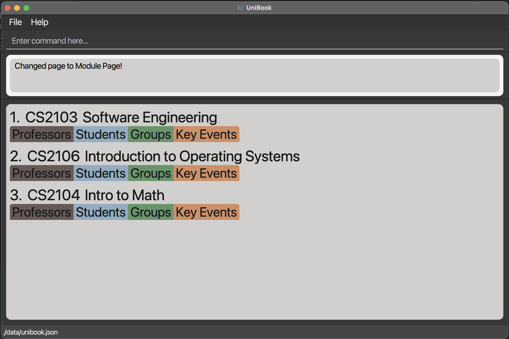
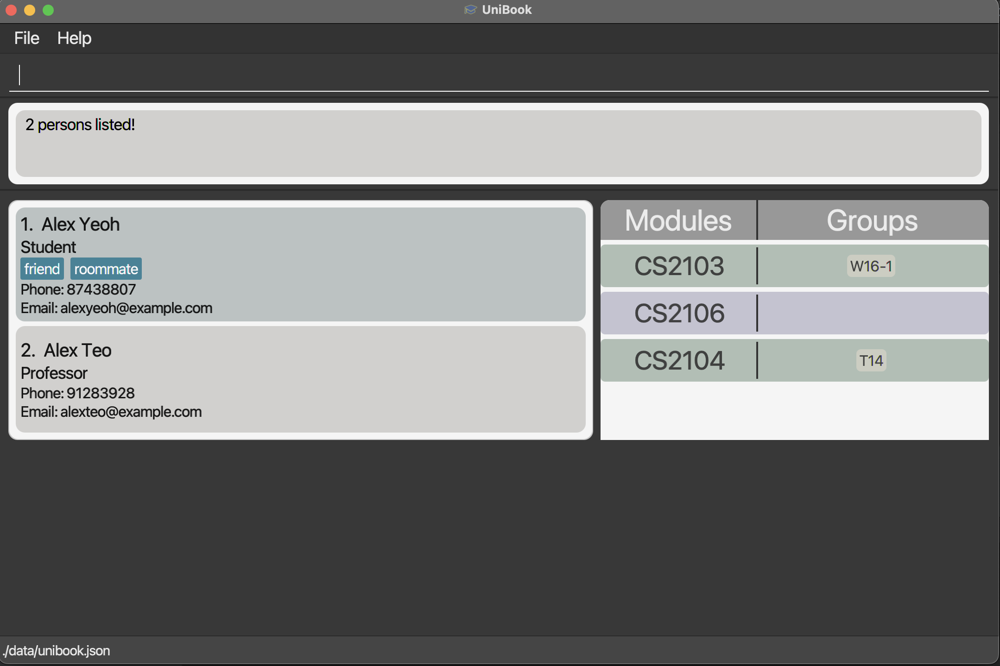

UniBook is a **desktop app for students to manage their university contacts related to their studies in an organised manner,** optimized for command-line interface (CLI) while still having the benefits of a Graphical User Interface (GUI).  
* Table of Contents
{:toc}

--------------------------------------------------------------------------------------------------------------------

# Quick start

1. Ensure you have Java `11` or above installed in your Computer.

1. Download the latest `unibook.jar` from [here](https://github.com/AY2122S2-CS2103-W16-1/tp/releases).

1. Copy the file to the folder you want to use as the _home folder_ for UniBook.

1. Double-click the file to start the app. The GUI similar to the below should appear in a few seconds. Note how the app contains some sample data. 
   

1. Type the command in the command box and press Enter to execute it. e.g. typing **`help`** and pressing Enter will open the help window. 
   Some example commands you can try:

   * **`list`** : Lists all entries.

   * **`add`**`o/student n/John Doe p/98765432 e/johnd@example.com` : Adds a student named `John Doe` to UniBook.

   * **`delete`**`3` : Deletes the 3rd contact shown in the current list.

   * **`edit`**`o/person 1 p/91234567 e/prof@email.com` : Edits the 1st contact's phone number and email shown in the current list.

   * **`clear`** : Deletes all contacts.

   * **`exit`** : Exits the app.

1. Refer to the [Features](#features) below for details of each command.

--------------------------------------------------------------------------------------------------------------------

# Features

**:information_source: Notes about the command format:** 

* Words in `UPPER_CASE` are the parameters to be supplied by the user. 
  e.g. in `add n/NAME`, `NAME` is a parameter which can be used as `add n/John Doe`.

* Items in square brackets are optional. 
  e.g `n/NAME [t/TAG]` can be used as `n/John Doe t/friend` or as `n/John Doe`.

* Items with `…`​ after them can be used multiple times including zero times. 
  e.g. `[t/TAG]…​` can be used as ` ` (i.e. 0 times), `t/friend`, `t/friend t/family` etc.

* Parameters can be in any order. 
  e.g. if the command specifies `n/NAME p/PHONE_NUMBER`, `p/PHONE_NUMBER n/NAME` is also acceptable.

* If a parameter is expected only once in the command but you specified it multiple times, only the last occurrence of the parameter will be taken. 
  e.g. if you specify `p/12341234 p/56785678`, only `p/56785678` will be taken.

* Extraneous parameters for commands that do not take in parameters (such as `help`, `exit` and `clear`) will be ignored. 
  e.g. if the command specifies `help 123`, it will be interpreted as `help`.

## Core function of UniBook

* To serve its purpose as useful desktop app for University students to manage their university contacts for their studies in an organised manner, UniBook supports the following types of entries:
  * 2 types of people - Students and Professors
    * All people contain 3 basic details - name, phone and email. Phone and Email details can be left blank.
    * Professors can contain one additional detail - office, the office in the University they are located in. This can also be left blank.
  * Modules
    * A module represents a University module, storing 4 basic details - module name, module code, groups of the module and key events of the module. Key Events represent events such as exams or assignment due dates, storing the associated date.
    * A module can have both Professors and Students associated with it. 
      * Association with Professor implies that the professor is involved in the teaching of the module.
      * Association with student implies student is taking the module.
  * Groups
    * A group can represent any kind of group related to a university module that a student is in - a study group, project grp etc. It stores meeting times for the group.
    * A group can contain multiple students implying they are members of the group.
    * A group is also associated with a module, and cannot exist without being associated with a module. The reasoning for this is that UniBook is specially designed for managing contacts associated with a student's studies - hence only groups related to university modules are allowed. 
* UniGroup is thus an app that displays and stores the above entries for easy reference by users, with smart commands that help to manage entries of them.

## User Interface

* UniBook consists of 3 main pages that a user can navigate through - the _people page_, _modules page_ and _groups page_.
  * The _people page_ displays all students and professors stored in UniBook, along with the module codes of each module and group names of each group stored in UniBook. This complements the CLI as a user is able to add a person to a module or group directly on this page using those displayed codes/names. (ref: `add` command)
   
  * The _module page_ displays all modules stored in UniBook, and all their individual details.
  
  * The _groups page_ displays all the groups stored in UniBook, and all their individual details.
  
  
* A User can navigate between pages with the `list` command.

* Different variations of CLI commands can be run depending on the page user is currently on.

* While UniBook is primarily optimized for the command-line interface (CLI), some basic intuitive navigation is available for quick navigation across pages to improve ease-of-use :
  * On _people page_, a user can click on a module code to enter the _module page_ displaying all the details of the module with the given module code.
  * On _people page_, a user can click on a group name to enter the _group page_ displaying all the details of the group with the given group name.

* On _module page_ showing multiple modules, initially only the module code and name of each module is shown, to see the rest of the details of a module, just click the tab corresponding to the detail you wish to see. For example, to see all the students taking a module, just click the "Students" tab.
* On _group page_, showing multiple groups, initially only the module code of the module associated with each group and the group name will be displayed. To see the rest of the details of a group, just click the panel of the group.

## Viewing help : `help`

Shows a message explaning how to access the help page.

Format: `help`

## Adding an entry: `add`

Adds a module/group/student/professor/event/meeting to the UniBook depending on the value defined in `o/OPTION`.

Format: `add o/OPTION...`  
OPTION values:  
1. **module**  
Format: `add o/module n/MODULENAME m/MODULECODE [ke/KEYEVENTTYPE dt/DATETIME]…​`  
This adds a Module to the UniBook. User can also add key events of the module.  
The event types are as follows:  
`1` - Exam  
`2` - Quiz  
`3` - Assignment Release  
`4` - Assignment Due  
The accepted format of `dt/DATETIME` is `yyyy-MM-dd HH:mm`.  
Example: `add o/module n/Discrete Mathematics m/CS1231S ke/1 dt/2022-05-04 13:00`  
Adds a module "Discrete Mathematics" with module code CS1231S to the UniBook. The module will have a key event of type "Exam" on the datetime specified.

2. **group**  
Format: `add o/group n/GROUPNAME m/MODULECODE [dt/DATETIME]…​`
This adds a Group to the Module specified.  
The `dt/DATETIME` represents meeting times of the group, it takes in the format `yyyy-MM-dd HH:mm`.  
Example: `add o/group n/W16-1 m/CS2103 dt/2022-05-01 13:00 dt/2022-05-04 13:00`  
Adds a group named "W16-1" to module "CS2103". This group will have the specified meeting times.

3. **student**  
Format: `add o/student n/NAME [p/PHONE_NUMBER] [e/EMAIL] [t/TAG]…​ [m/MODULECODE [g/GROUPNAME]…​]…​`  
This adds a Student to the UniBook, it also adds the student into the student list of the corresponding Module objects.  
Note that in order to add a student to a group of the specified module, the format of `m/MODULECODE [g/GROUPNAME]…​` must be strictly followed. This will allow the program to know which group of which module the user wishes to add the student to.  
Example: `add o/student n/Johnston p/98765432 e/johnston@gmail.com t/friend m/CS1231S g/Project Work m/CS2103`  
Adds a student named Johnston to the UniBook. The student will be added to the group "Project Work" in Module "CS1231S".

4. **professor**  
Format: `add o/professor n/NAME [p/PHONE_NUMBER] [e/EMAIL] [of/OFFICE] [t/TAG]…​ [m/MODULECODE]…​`  
This adds a Professor to the UniBook, it also adds the professor into the professor list of the corresponding Module objects.  
Example: `add o/professor n/Aaron Tan p/98723432 e/aarontan@gmail.com of/COM2 01-15 t/smart m/CS1231S m/CS2100`  
Adds a professor named Aaron Tan to the UniBook.

5. **event**  
Format: `add o/event m/MODULECODE ke/KEYEVENTTYPE dt/DATETIME`  
This adds a key event of the respective type and datetime to the module specified.  
The event types are as follows:  
`1` - Exam  
`2` - Quiz  
`3` - Assignment Release  
`4` - Assignment Due  
The accepted format of `dt/DATETIME` is `yyyy-MM-dd HH:mm`.  
Example: `add o/event m/CS2103 ke/1 dt/2022-05-04 13:00`  
Adds an event of the specified type and datetime to module "CS2103".

6. **meeting**  
Format: `add o/meeting m/MODULECODE g/GROUPNAME dt/DATETIME…​`  
This adds meetings of the specified datetime to the specified group belonging to the specified module. Multiple `dt/DATETIME` can be entered to add multiple meetings.  
The accepted format of `dt/DATETIME` is `yyyy-MM-dd HH:mm`.  
Example: `add o/meeting m/CS2103 g/W16-1 dt/2022-04-24 13:00 dt/2022-04-30 15:00 dt/2022-05-04 11:00`  
Add meetings of the specified datetimes to module "CS2103".

:bulb: **Tip:**
A student/professor can have any number of tags and modules (including 0)

## Listing entries: `list`

Lists entries in UniBook according to a specified listing criteria. Behaves differently depending
on currently active view.

### On Any View:

#### :bulb: List everything

Format: `list`

* Lists all the `people`, `module` or `group` entries depending on the current active view.

#### :bulb: Change View

Format: `list o/view v/VIEWTYPE`

* Changes the view of the `UniBook` to the specified view type. Available arguments for 
`VIEWTYPE` are `people`/`groups`/`modules`.
* Example: `list o/view v/modules` switches the `UniBook` to the `modules` view.  

### On People View:

#### :bulb: List people of a specific type
Format: `list type/PERSONTYPE`

* Lists all people of a specific type. Available arguments for `PERSONTYPE` are `students`/`professors`.
* Example: `list type/professors` lists every `Professor` in the `UniBook`.

#### :bulb:  List people in a specific module
Format: `list o/module m/MODULECODE`

* Lists all people in a given `Module`.
* Example: `list o/module m/CS2103` displays all people who are in the module `CS2103`.

#### :bulb:  List people in a specific module of a specific type
Format: `list o/module m/MODULECODE type/PERSONTYPE`

* Lists all people in a given `Module` who are of a specific type.
* Example: `list o/module m/cs2103 type/students` lists all `students` who are in the module `CS2103`.

#### :bulb:  List people in a specific group of a specific module
Format: `list o/group m/MODULECODE g/GROUPNAME`

* Lists all students who are in a given `Group` of a given `Module`.
* Example: `list o/group m/CS2103 g/W16-1` lists all students in group `W16-1` of module `CS2103`.

### On Modules view:

#### :bulb:  List a module with a specific code
Format: `list m/MODULECODE`

- Lists a module with a given module code.
- Example: `list m/CS2103` lists the module `CS2103`.

#### :bulb:  List a module with a name containing a keyword
Format: `list n/KEYWORD`

- Lists modules which have module names containing the given keyword.
- Example: `list n/Software` will display all modules that contain `Software` in their module name.

#### :bulb:  List a module with a specific type of key event
Format: `list ke/KEYEVENT`

- Lists modules which has a specific type of key event. Acceptable arguments for `KEYEVENT` are 
  `EXAM/QUIZ/ASSIGNMENT_DUE/ASSIGNMENT_RELEASE`.
- Example: `list ke/EXAM` will display all modules that have key event(s) of type `EXAM`.

#### :bulb:  List a module with key event(s) falling on a specific date
Format: `list dt/YYYY-MM-DD`

- Lists modules which has any type of key event(s) falling on a given date.
- Example: `list dt/2022-05-04` displays all modules with any key event(s) falling on `May 4th 2022`.

#### :bulb:  List a module with a specific type of key event(s) falling on a specific date
Format: `list dt/YYYY-MM-DD ke/KEYEVENT`

- Lists all modules which has a specific type of key event falling on a given date. Acceptable arguments for `KEYEVENT` are
  `EXAM/QUIZ/ASSIGNMENT_DUE/ASSIGNMENT_RELEASE`.
- Example: `list dt/2022-05-04 ke/QUIZ` displays all modules with key event(s) `Quiz` falling on `May 4th 2022`.

#### :bulb:  List a module with a name matching a keyword with key event(s) on a given date
Format: `list dt/YYYY-MM-DD n/KEYWORD`

- Lists all modules which have a module name containing a given name and any type of key event(s) 
  falling on a given date.
- Example: `list dt/2022-05-04 n/Network` displays all modules that have `Network` in their module name and
have key events falling on `May 4th 2022`.

#### :bulb:  List a module with a name matching a keyword with a specific type of key event(s)

Format: `list n/KEYWORD ke/KEYEVENT`
- Lists all modules which has a module containing a given name and a specific type of key event.
  Acceptable arguments for `KEYEVENT` are
  `EXAM/QUIZ/ASSIGNMENT_DUE/ASSIGNMENT_RELEASE`.
- Example: `list n/Software ke/ASSIGNMENT_DUE` displays all modules that have `Software` in their module name and
have key event(s) of type `ASSIGNMENT_DUE`.
  
#### :bulb:  List a module with a name matching a keyword with a specific type of key event on a given date
Format: `list n/KEYWORD ke/KEYEVENT dt/YYYY-MM-DD`
- Lists all modules which has a module containing a given name and a specific type of key event falling
on a given date. Acceptable arguments for `KEYEVENT` are `EXAM/QUIZ/ASSIGNMENT_DUE/ASSIGNMENT_RELEASE`.
- Example: `list n/Software ke/ASSIGNMENT_DUE dt/2022-05-04` displays all modules that have `Software` 
  in their module name and have key event(s) of type `ASSIGNMENT_DUE` which fall on `May 4th 2022`.
  
#### :bulb:  List groups with specific group name (module page)
Format: `list o/group g/GROUPNAME`
- If the module list currently has `1` module showing, UniBook switches to `Groups` view automatically and displays
the specific group with the given group name, from the given module.
- Otherwise, UniBook switches to `Groups` view automatically and displays all groups with the given name.
- Example: Assume module `CS2103` along with multiple other modules have a group with group name `W16-1`. 
  When the command `list o/group g/W16-1` is run, if only `CS2103` was visible then the specific `W16-1` in `CS2103` 
  is displayed in the group view. Otherwise all groups with name `W16-1` from all modules are displayed.

### On Groups view:

#### :bulb:  List groups with specific group name (group page)
Format: `list g/GROUPNAME`
- Lists all groups with a given group name.
- Example: `list g/W16-1` lists all groups with the name `W16-1`.

#### :bulb:  List group(s) with specific group name and module code
Format: `list g/GROUPNAME m/MODULECODE`
- Lists all groups with a given group name in a specific module.
- Example: `list g/W16-1 m/CS2103` lists group `W16-1` of `CS2103`.

#### :bulb:  List group(s) with specific meeting date
Format: `list mt/YYYY-MM-DD`
- Lists all groups with a meeting times falling on a given date.
- Example: `list mt/2022-05-04` lists all groups that have meetings on `May 4th 2022`.

## Editing a person : `edit`

Edits an existing person in UniBook.

General Format: `edit INDEX o/OPTION [m/MODULE] [n/NAME] [p/PHONE] [e/EMAIL] [of/OFFICE] [t/TAG] [nm/NEWMODULE] [g/GROUP] [mt/INDEX DATETIME] [ke/KEYEVENT] [dt/DATETIME]`
* Fields required differs based on the `o/OPTION` chosen. 

* Edits the entity type defined by `o/OPTION`. This is a compulsory field.
  * Options available are person, module, keyevent or group.
* All indexes must be positive integers.
* Existing values will be updated to the input values.    
* Before choosing to edit module or person, user can see which `INDEX` to edit by changing the UI to show the relevant list. User will not be allowed to edit if not on the correct page. 
  * `list o/view v/modules` : To display list of modules with respective indexes
  * `list o/view v/people` : To display list of persons with respective indexes 
  * `list o/view v/groups` : To display list of groups with respective indexes 
* Only certain options can be edited on each page, otherwise an error will be printed on the console to tell users to change to the correct page. On the
  * `module` page: Able to edit module, keyevent or group fields
  * `group`  page: Able to edit keyevent or group fields
  * `person` page: Able to edit person
    
**Commands while on `People` view**

At least one optional field must be edited in order for person to be successfully edited.

Format: `edit INDEX o/person [n/NAME] [p/PHONE] [e/EMAIL] [of/OFFICE] [t/TAG]`
* Edits the `name`, `phone` and/or `email` fields of a person at `INDEX`.
* The `office` field can only be edited if the person is a professor.
* Editing a tag overrides all previous tags and user only able to edit tags 1 word at a time. 
  * E.g. `edit 1 o/person t/helpful t/friend` edits the tag of the first person on the list to helpful and friend.
* Example: `edit 1 o/person n/Alexa` changes the name of the first person on the list to Alexa.

Format: `edit INDEX o/person [m/MODULE] [g/GROUPNAME]`
* Adds person at `INDEX` to the group named `GROUPNAME` in the stated `MODULE`.
* Both `[m/MODULE]` and `[g/GROUPNAME]` fields are compulsory for successful edit.
* Example: `edit 1 o/person m/CS2103 g/T2` adds the first person to the `group` named T2 in the CS2103 `module`.

Format: `edit INDEX o/person [nm/NEWMOD]`
* Adds person at `INDEX` to the stated `MODULE`.
* Example: `edit 1 o/person nm/CS2103` adds the first person to the CS2103 `module`.

**Commands while on `Modules` view**

At least one optional field must be edited in order for module to be successfully edited.

Format: `edit INDEX o/module [n/NAME] [m/MODCODE]`
* Edits the `name` and/or `modcode` fields of a module at `INDEX`.
* Example: `edit 1 o/module n/Software Engineering m/CS2103` changes the name and module code of the first module on the list to Software Engineering and CS2103 respectively.

Format: `edit INDEX o/group m/MODULE [g/GROUPNAME] [mt/INDEX DATETIME]`
* Edits the `groupname` and/or `meetingtimes` of the group at `INDEX` of the `module`.
* `DATETIME` must be in `YYYY-MM-DD HH:mm` format.  
* Example: `edit 1 o/group m/CS2103 g/T2 mt/2 2020-12-12 16:45` edits the first group's name and second index of meeting time of the CS2103 `module` to T2 and 12th December 2022 4:45pm respectively.

Format: `edit INDEX o/keyevent ke/INDEX [type/TYPE] [dt/DATETIME]`
* Edits  `type` and/or `datetime` of the keyevent at module at `INDEX`.
* Example: `edit 1 o/keyevent ke/2 type/exam dt/2020-12-12 16:45` adds the second key event's type and date time in the first module in the list to exam and 12th December 2022 4:45pm respectively.

**Commands while on `Groups` view**

At least one optional field must be edited in order for module to be successfully edited.

Format: `edit INDEX o/group m/MODULE [g/GROUPNAME] [mt/INDEX DATETIME]`
* Edits the `groupname` and/or `meetingtimes` of the group at `INDEX` of the `module`.
* `DATETIME` must be in `YYYY-MM-DD HH:mm` format.
* Example: `edit 1 o/group m/CS2103 g/T2 mt/2 2020-12-12 16:45` edits the first group's name and second index of meeting time of the CS2103 `module` to T2 and 12th December 2022 4:45pm respectively.

## Locating persons by name: `find`

### On Any Page

#### Find person whose names contain any of the given keywords
Format: `find KEYWORD [MORE_KEYWORDS]`

* The search is case-insensitive. e.g `hans` will match `Hans`
* The order of the keywords does not matter. e.g. `Hans Bo` will match `Bo Hans`
* Only the name is searched.
* Only full words will be matched e.g. `Han` will not match `Hans`
* Persons matching at least one keyword will be returned (i.e. `OR` search).
  e.g. `Hans Bo` will return `Hans Gruber`, `Bo Yang`

Examples:
* `find John` returns `john` and `John Doe`
* `find alex` returns `Alex Yeoh`, `Alex Teo` 
  

## Deleting specific entries : `delete`

Removes the specified modules, module subgroup, student or professor profile from the system.

(Note: Commands under the sub header Person view can only be used on person page, and likewise for other view)

### On Any View:

#### :bulb: Delete module by module code
Format: `delete o/module m/[MODULECODE]`
* Deletes the module with the specified `MODULECODE`.
* The module must already exist in the system.
* For example, `delete o/module m/CS2103` removes the module with module code CS2103

#### :bulb: Delete group by module code and group name
Format: `delete o/group m/[MODULECODE] g/[GROUPNAME]`
* Deletes the group specified by `GROUPNAME`, within the module specified by `MODULECODE`.
* Both the module and the subgroup must already exist in the system.
* For example, `delete o/group m/CS2107 g/T04` removes the T04 subgroup from the CS2107 module.

### On People View:

#### :bulb: Delete a person by index
Format: `delete [INDEX]`
* Deletes the person at that index
* The GUI will display the index before the person

#### :bulb: Delete a person's information
Format: `delete [INDEX] p/ e/ t/[TAG] of/`
* p/, e/, t/[TAG], of/ can be entered in any combination, for example, to delete only phone and email, the user can put `p/` and `e/`
* At least 1 of {`p/`, `e/`, `t/[TAG]`, `of/`} must be entered, otherwise the `delete [INDEX]` command will be executed instead
* Only 0 or 1 of each tag must be provided

### On Module View:

#### :bulb: Delete a module by Index
Format: `delete [INDEX]`
* Deletes the module at that index
* The GUI will display the index before the module

For the following commands, if more than 1 of the following tags are provided, the priority will be in this order. For example, if `prof/1` and `stu/1` is both provided, `delete 1 prof/1` will be prioritised because `prof/` is higher than `stu/` on this list.

#### :bulb: Remove a professor from a module by index
Format: `delete [INDEX] prof/[INDEX]`
* Delete professor from module (The original person is not deleted, only removed from the module)
* The first index represents the index for which module to remove a professor from
* The second index (after prof/) represents the index for which professor to remove
* For example, `delete 2 prof/1` would delete the professor at index 1 from the module at index 2

#### :bulb: Remove a student from a module by index
Format: `delete [INDEX] stu/[INDEX]`
* Same as the above command, but index after stu/ represents the student list index to be deleted

#### :bulb: Delete a group from a module by index
Format: `delete [INDEX] g/[GROUPNAME]`
* same as the above command, but group name has to be specified to delete the group with that name

#### :bulb: Delete a key event from a module by index
Format: `delete [INDEX] ke/[INDEX]`
* same as the above command, but index after ke/ represents the key event index to be deleted

### On Group view:

#### :bulb: Delete group by index
Format: `delete [INDEX]`
* Deletes the group at that index
* The GUI will display the index before the group

For the following commands, if more than 1 of the following tags are provided, the priority will be in this order. For example, if `mt/1` and `stu/1` is both provided, `delete 1 stu/1` will be prioritised because `stu/` is higher than `mt/` on this list.

#### :bulb: Remove student from group by index
Format: `delete [INDEX] stu/[INDEX]`
* Delete student from group
* The first index represents the index for which group to remove the student from
* The second index (after stu/) represents the index for which student to delete
* For example, `delete 2 stu/1` would delete the student at index 1 for the group at index 2

#### :bulb: Delete meeting time from group by index
Format: `delete [INDEX] mt/[INDEX]`
* Delete meeting time from group
* The first index represents the index for which group to remove the meeting time for
* The second index (after mt/) represents the index for which meeting time to delete
* For example, `delete 2 mt/1` would delete the meeting time at index 1 for the group at index 2

## Clearing all entries : `clear`

Clears all entries from UniBook.

Format: `clear`

## Exiting the program : `exit`

Exits the program.

Format: `exit`

## Saving the data

UniBook data are saved in the hard disk automatically after any command that changes the data. There is no need to save manually.

## Editing the data file

UniBook data are saved as a JSON file `[JAR file location]/data/unibook.json`. Advanced users are welcome to update data directly by editing that data file.

:exclamation: **Caution:**
If your changes to the data file makes its format invalid, UniBook will discard all data and start with an empty data file at the next run.

## Archiving data files `[coming in v2.0]`

--------------------------------------------------------------------------------------------------------------------

# FAQ

**Q**: How do I transfer my data to another Computer? 
**A**: Install the app in the other computer and overwrite the empty data file it creates with the file that contains the data of your previous UniBook home folder.

--------------------------------------------------------------------------------------------------------------------

# Command summary

Action | Format
--------|------------------
**Add** | `add o/module n/MODULENAME m/MODULECODE [ke/KEYEVENTTYPE dt/DATETIME]…​`   e.g., `add o/module n/Software Engineering m/CS2103 ke/1 dt/2022-05-04 13:00`  `add o/group n/GROUPNAME m/MODULECODE [dt/DATETIME]…​`   e.g., `add o/group n/W16-1 m/CS2103 dt/2022-04-24 13:00`  `add o/student n/NAME [p/PHONE_NUMBER] [e/EMAIL] [t/TAG]…​ [[m/MODULECODE] [g/GROUPNAME]]…​`    e.g., `add o/student n/Peter Ho p/81234567 e/peterho@u.nus.edu m/cs2103 g/W16-1`  `add o/professor n/NAME [p/PHONE_NUMBER] [e/EMAIL] [of/OFFICE] [t/TAG]…​ [m/MODULECODE]…​`   e.g., `add o/professor n/James Ho p/22224444 e/jamesho@example.com of/123 Clementi Rd S123466 m/cs2103`  `add o/event m/MODULECODE ke/KEYEVENTTYPE dt/DATETIME`   e.g., `add o/event m/CS2103 ke/4 dt/2022-04-28 13:00`   `add o/meeting m/MODULECODE g/GROUPNAME dt/DATETIME…​`   e.g., `add o/meeting m/CS2103 g/W16-1 dt/2022-04-29 13:00`
**Clear** | `clear`
**Edit** |  Editing person: `edit INDEX o/PERSON [n/NAME] [p/PHONE] [e/EMAIL] [of/OFFICE] [nm/NEWMODULE] [g/GROUP] [m/MODULE] [t/TAG] `  e.g. `edit 1 o/person p/91234567 e/prof@email.com of/COM1 nm/CS2103 `    Editing Module: `edit INDEX o/module [n/NAME] [m/MODCODE]` e.g. `edit 1 o/module m/CS2103 n/Software Engineering`    Editing Groups: `edit INDEX o/group m/MODULE [g/GROUPNAME] [mt/INDEX DATETIME]` e.g. `edit 1 o/group m/CS2103 g/T2 mt/2 2020-12-12 16:45`    Editing Key Events: `edit INDEX o/keyevent ke/INDEX [type/TYPE] [dt/DATETIME]` e.g. `edit 1 o/keyevent ke/2 type/exam dt/2020-12-12 16:45`
**Delete** | Any Page:   `delete [INDEX]`    People Page:   `delete [INDEX] p/ e/ t/[TAG] of/`   eg. `delete 1 p/ e/`   eg. `delete 2 t/friend`    Module Page:  `delete [INDEX] stu/[INDEX]`   `delete [INDEX] prof/[INDEX]`   `delete [INDEX] g/[GROUPNAME]`   `delete [INDEX] ke/[INDEX]`    Group Page:   `delete [INDEX] mt/[INDEX]`   `delete o/module m/[MODULECODE]`   eg. `delete o/module m/CS2103`   `delete o/group m/[MODULECODE] g/[GROUPNAME]`   eg. `delete o/group m/CS2103 g/Team Project`
**Find** | `find KEYWORD [MORE_KEYWORDS]`  e.g., `find James Jake`
**List** | **Any View**:  `list` [(example)](#list-everything)   `list o/view v/VIEWTYPE` [(example)](#change-view)   **People View:**   `list type/PERSONTYPE` [(example)](#list-people-of-a-specific-type)   `list o/module m/MODULECODE [type/PERSONTYPE]` [(example)](#list-people-in-a-specific-module)   `list o/group m/MODULECODE g/GROUPNAME` [(example)](#list-people-in-a-specific-group-of-a-specific-module)    **Modules View:**   `list m/MODULECODE` [(example)](#list-a-module-with-a-specific-code)   `list [n/KEYWORD] [ke/KEYEVENT] [dt/YYYY-MM-DD]` [(example)](#list-a-module-with-a-name-containing-a-keyword)    `list o/group g/GROUPNAME` [(example)](#list-groups-with-specific-group-name-module-page)    **Groups View:**  `list g/GROUPNAME [m/MODULECODE]` [(example)](#list-groups-with-specific-group-name-group-page)   `list mt/YYYY-MM-DD` [(example)](#list-groups-with-specific-meeting-date)
**Help** | `help`
