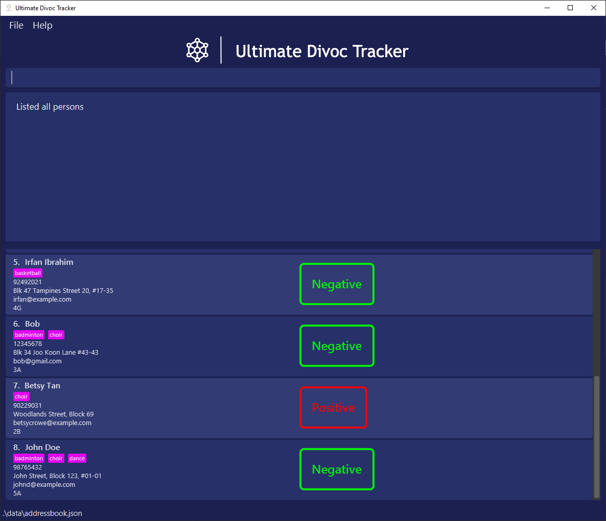
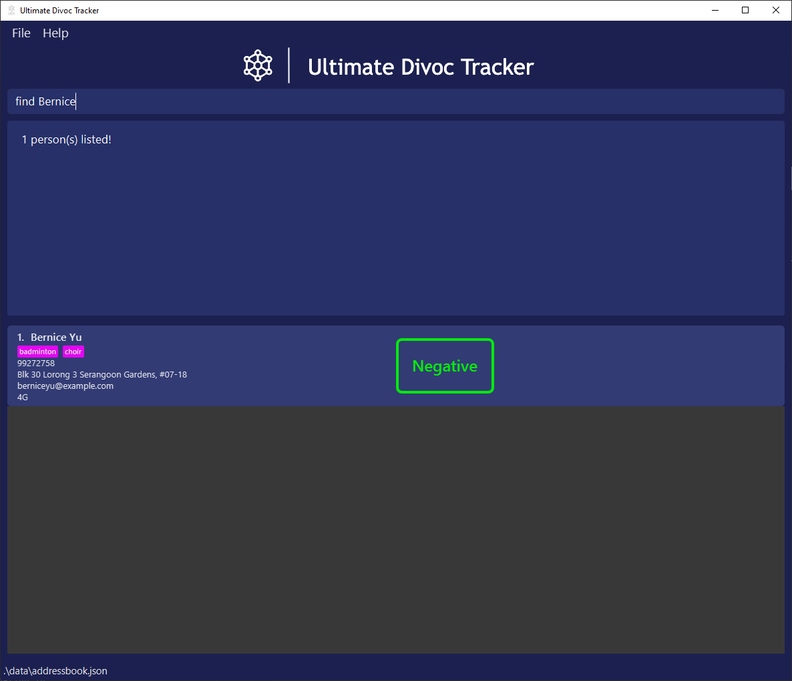
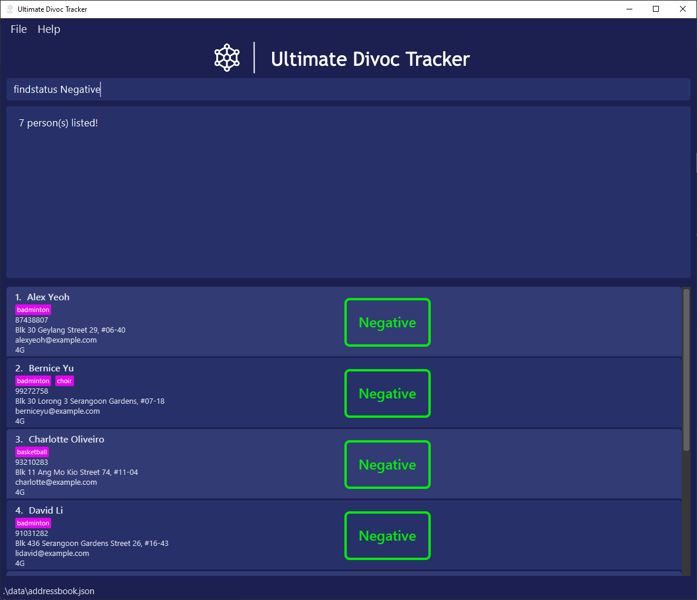
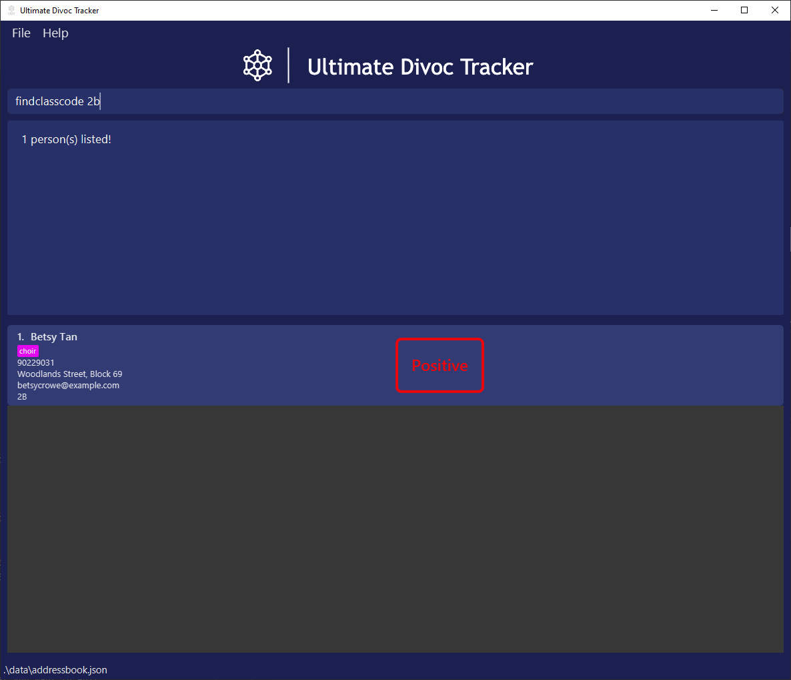
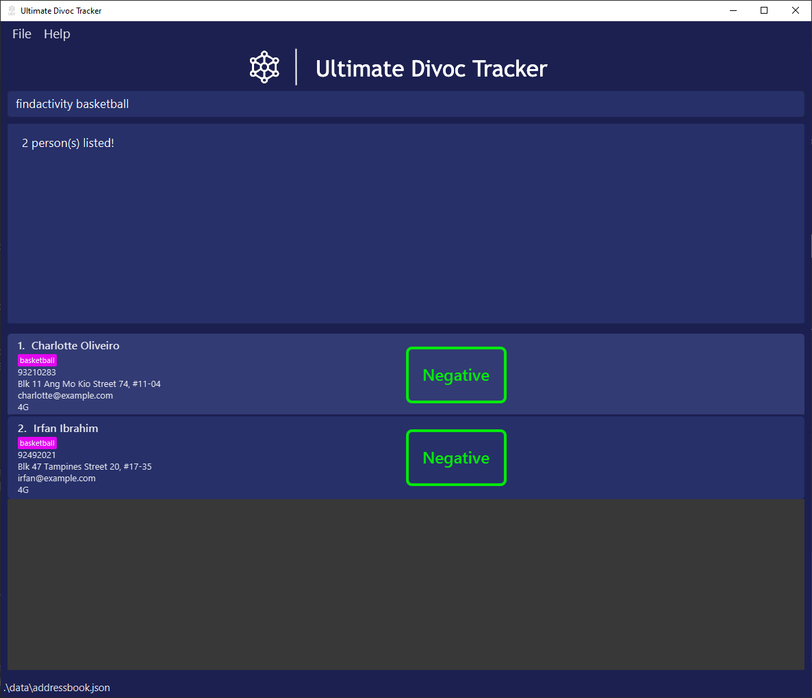
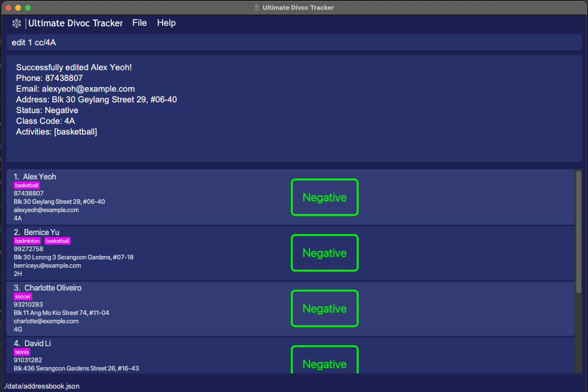
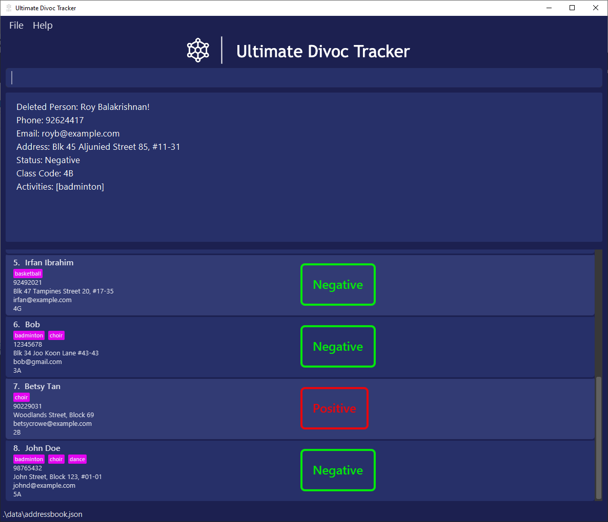
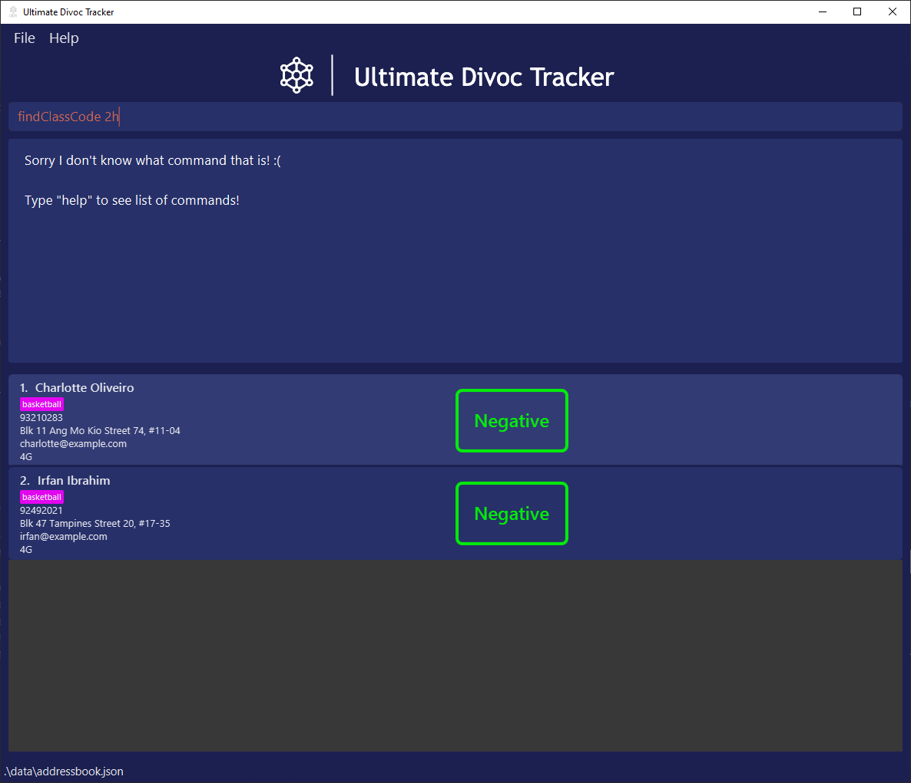

| Quick Links                         |
|-------------------------------------|
| [Content Page](#Content-Page)       |
| [Quick start](#Quick-start)         |
| [Features](#Features)               |
| [Command Summary](#Command-Summary) |

**Ultimate DivocTracker _(UDT)_** is a desktop app for managing COVID-19 contacts in school administration, optimized for use via a Command Line Interface _(CLI)_ while still having the benefits of a Graphical User Interface _(GUI)_. If you can type fast, Ultimate Divoc Tracker can get your contact-tracing tasks done faster than traditional GUI apps.

School administrators _(like teachers)_ can use UDT to easily track COVID-19 cases amongst the student population with ease and concentrate on what matters most, the education of the students.

# Content Page

- [Quick start](#quick-start)
- [Features](#features)
  - [Add a student](#add-a-student-add): `add`
  - [List all students](#list-all-students-list): `list`
  - [Find student by name](#find-student-by-name-find): `find`
  - [Find student by status](#find-student-by-status-findstatus):  `findstatus`
  - [Find student by class](#find-student-by-class-findclasscode): `findclasscode`
  - [Find student by activity](#find-student-by-activity-findactivity): `findactivity`
  - [Edit student’s personal details](#edit-student-details-edit): `edit`
  - [Delete a student](#delete-a-student-delete): `delete`
  - [Exit the application](#exit-the-application-exit): `exit`
- [Saving the data](#saving-the-data)
- [Editing the data file](#editing-the-data-file)
- [Frequently Asked Questions](#faq)
- [Command Summary](#command-summary)

# Quick start
- Ensure you have **Java 11** or above installed in your Computer.
- Download the latest **ultimatedivoctracker.jar** from [our GitHub repository](https://github.com/AY2122S2-CS2103T-T12-1/tp/releases).
- Copy the file to the folder you want to use as the home folder for your Ultimate DivocTracker application.
- Double-click the file to start the app. The GUI similar to the below should appear in a few seconds. Note how the app contains some sample data.
- Refer to the Features below for details of each command.

> :information_source: **Installation notes:**  
> - Application data will be stored in the same folder containing the application executable.  
> - Currently only officially supported for **x64 Windows** platforms.

# Features

> :information_source: **Formatting notes:**  
> - Words in `UPPER_CASE` are the parameters to be supplied.  
> - Items in square brackets `[]` are optional.

## Add a student: `add`
Adds a student to the tracking list
- Format: `add n/NAME p/PHONE_NUMBER e/EMAIL a/ADDRESS​ c/CLASS s/STATUS [act/ACTIVITY] [MORE ACTIVITIES]`
  - `NAME`, `ADDRESS`, `CLASS`, `ACTIVITY` takes a string of characters
  - `EMAIL` follows the standard email formatting 
    - eg. `johntan@example.com`
  - `PHONE_NUMBER` takes a sequence of numbers
  - `STATUS` takes either of these strings `Positive`, `Negative`, `Close-Contact`
    - `STATUS` is case-sensitive and should strictly follow the strings stated above
- Examples:
  - `add n/John Doe p/98765432 e/johnd@example.com a/John Street, Block 123 #01-01 c/5A s/Negative`
  - `add n/Betsy Crowe p/99999999 e/betsycrowe@example.com a/Woodlands Street, Block 69 p/1234567 c/2B s/Positive act/choir dance`

> :bulb: **Tips:**  
> - Multiple activity tags can be added to a single student  
>   - Eg. `act/choir dance`  
> - A student can also have no activity tags  
> - Parameters can be in any order

> :warning: **Warning:** Capitalization of text will be reflected in the User Interface

## List all students: `list`
Shows a list of all students in the address book.
- Format: `list`
  - Any parameter after `list` is ignored

> :bulb: **Tip:** For a filtered list, use the __*find*__ commands

## Find student by name: `find`
Find an existing student in the application by their name
- Format: `find NAME`
  - Returns a list of students with the specified `NAME`
  - `NAME` is case-insensitive
  - Order of words in `NAME` is irrelevant
    - `find yeoh alex` can find student _"Alex Yeoh"_
  - Searching for name returns a list of names contains the provided name
    - `find john` can find students _"John Tan"_ and _"John Lee"_
- Example:
  - `find john tan zi wei` will find student _"John Tan Zi Wei"_

## Find student by status: `findstatus`
Find an existing student in the application by their Covid-19 Status
- Format: `findstatus STATUS`
  - Returns a list of students with the specified `STATUS`
  - `STATUS` is case-insensitive
- Examples:
  - `findstatus positive` finds all students that are labelled COVID positive
  - `findstatus negative` finds all students that are labelled COVID negative

## Find student by class: `findclasscode`
Finds an existing student in the address book by their class
- Format: `findclasscode CLASS`
  - Returns a list of students with the specified `CLASS`
  - `CLASS` is case-insensitive
- Example:
  - `findclasscode 4A` finds all students in the class 4A

## Find student by activity: `findactivity`
Finds an existing student in the address book by the activities they are participating in
- Format: `findactivity ACTIVITIY [MORE ACTIVITIES]`
  - Returns a list of students with the specified `ACTIVITY`
    - Matches based on students that have specified `ACTIVITY` and not just exactly those activities only
  - If more than 1 activity is specified, command returns a list of student that participated in **ANY** of the activities specified
  - `ACTIVITY` is case-insensitive
- Example:
  - `findactivity badminton` finds all students that have the activity _"Badminton"_
  - `findactivity badminton choir` finds all students that have the activity _"Badminton"_, _"choir"_ or **both**

## Edit student details: `edit`
Edits an existing student's details in the address book by the Index provided and the areas that the user wants to edit
- Format: `edit INDEX [n/NAME] [p/PHONE_NUMBER] [e/EMAIL] [a/ADDRESS] [c/CLASS] [s/STATUS] [act/ACTIVITIES]`
  - Edits the student at the specified `INDEX`
  - `INDEX` denotes the list index of the student in the displayed list
  - `INDEX` must be a _positive integer (1, 2, 3...)_
  - Only listed fields will be changed
- Examples:
  - `edit 1 s/Positive` edits 1st student to be _COVID-19 Positive_
  - `edit 5 p/98641865 e/maryjane@yahoo.com` edits 5th student to a new phone number and email address

> :bulb: **Tips:**  
> - Filter the student list via __*find*__ commands to make finding the index easier  
> - Leave other attributes of the student as is by omitting parameters from the command

## Delete a student: `delete`
Deletes the specified person from the address book.
- Format: `delete INDEX`
  - Deletes the student at the specified `INDEX`
  - `INDEX` denotes the list index of the student in the displayed list
  - `INDEX` must be a _positive integer (1, 2, 3...)_ 
- Examples:
  - `list` followed by `delete 2` deletes the 2nd person in the student list
  - `find Betsy` followed by `delete 1` deletes the 1st student in the results of the `find` command

> :bulb: **Tip:** filter the student list via __*find*__ commands to make finding the index easier

## Exit the application: `exit`
Exits the program.
Format: `exit`

> :bulb: **Tip:** You can also close the application directly as it is functionally identical

## Saving the data
UDT data is saved in the hard disk automatically after any command that changes the data. There is no need to save manually.
- Data is saved to the same location as the application executable

## Editing the data file
UDT data are saved as a JSON file `[JAR file location]/data/addressbook.json`. 
- Data is saved to the same location as the application executable

> :bulb: **Tip:** Advanced users are welcome to update data directly by editing that data file

> :warning: **Warning:** Editing the data file erroneously may result in the entire data file becoming unreadable by UDT

----------------
# FAQ

Q: How do I transfer my data to another Computer?  
A: Install the app in the other computer and overwrite the empty data file it creates with the file that contains the data of your previous _**UDT**_.

Q: I edited my data file directly and now the application does not work properly!  
A: Delete the data folder to allow _**UDT**_ to create a new data file. Your previous data has unfortunately been lost to time.

Q: Manual insertion of students takes time, is there a faster way to do it?  
A: We are working on a feature to allow importing of **.csv** files into _**UDT**_!

Q: What if I key in the wrong command?
A: An error message colored in red will appear stating that you have typed an unknown command.

----------------
## Command Summary

| Action                                                             | Format                                                                                             | Example                                                                                                        |
|--------------------------------------------------------------------|----------------------------------------------------------------------------------------------------|----------------------------------------------------------------------------------------------------------------|
| [Add a student](#add-a-student-add)                                | `add n/NAME p/PHONE_NUMBER e/EMAIL a/ADDRESS c/CLASS s/STATUS [act/ACTIVITIES]`                    | `add n/John Doe p/98765432 e/johnd@example.com a/John Street, Block 123, #01-01 c/5A s/NEGATIVE act/badminton` |
| [List all students](#list-all-students-list)                       | `list`                                                                                             | `list`                                                                                                         |
| [Find student by name](#find-student-by-name-find)                 | `find NAME [MORE_NAME]`                                                                            | `find James Jake`                                                                                              |
| [Find student by status](#find-student-by-status-findstatus)       | `findstatus STATUS`                                                                                | `findstatus positive`                                                                                          |
| [Find student by class](#find-student-by-class-findclasscode)      | `findclasscode CLASS`                                                                              | `findclasscode 4A`                                                                                             |
| [Find student by activity](#find-student-by-activity-findactivity) | `findactivity ACTIVITY`                                                                            | `findactivity choir`                                                                                           |
| [Edit student details](#edit-student-details-edit)                 | `edit INDEX [n/NAME] [p/PHONE_NUMBER] [e/EMAIL] [a/ADDRESS] [c/CLASS] [s/STATUS] [act/ACTIVITIES]` | `edit 2 n/James Lee e/jameslee@example.com`                                                                    |
| [Delete a student](#delete-a-student-delete)                       | `delete INDEX`                                                                                     | `delete 3`                                                                                                     |
| [Exit the application](#exit-the-application-exit)                 | `exit`                                                                                             | `exit`                                                                                                         |

----------------

