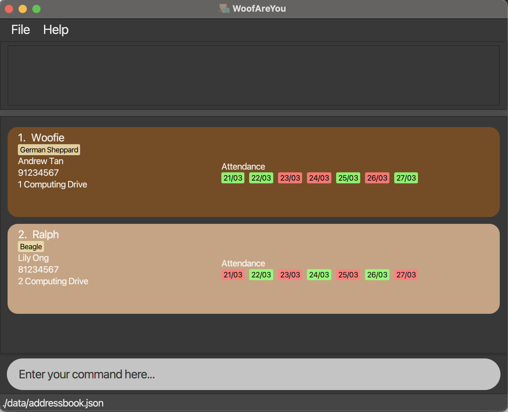
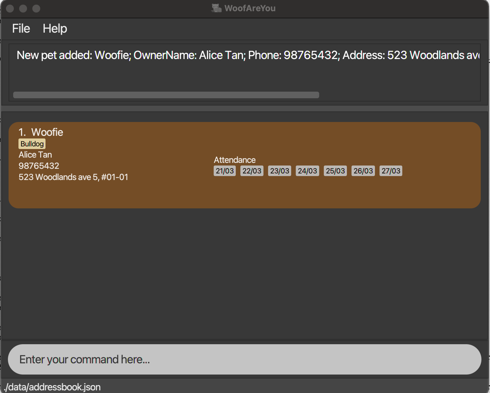
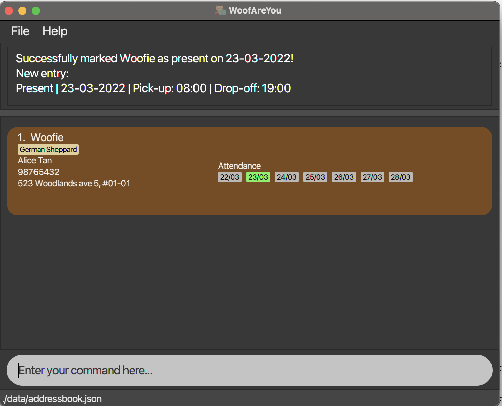
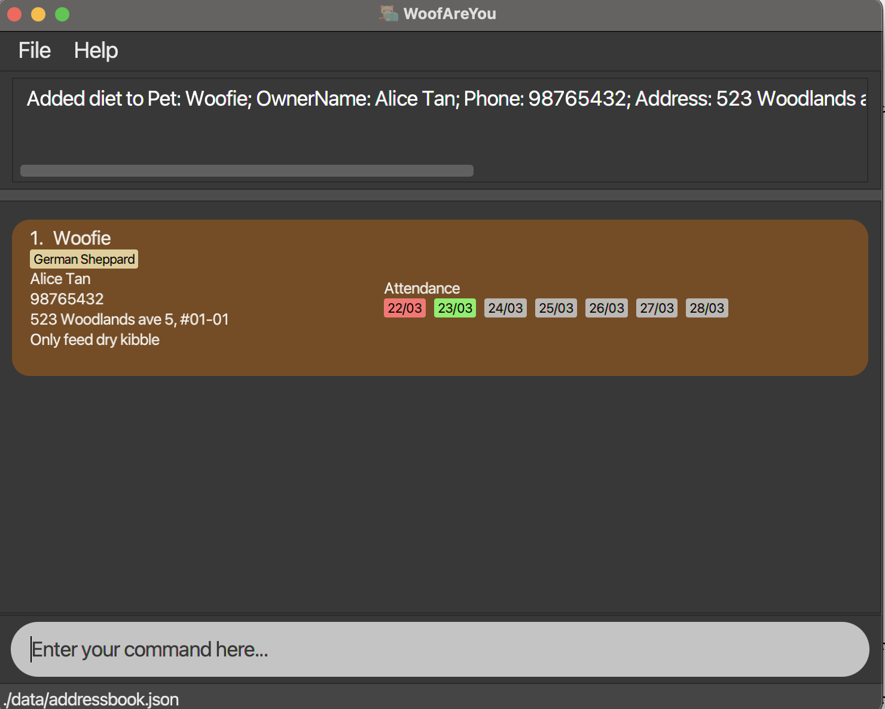
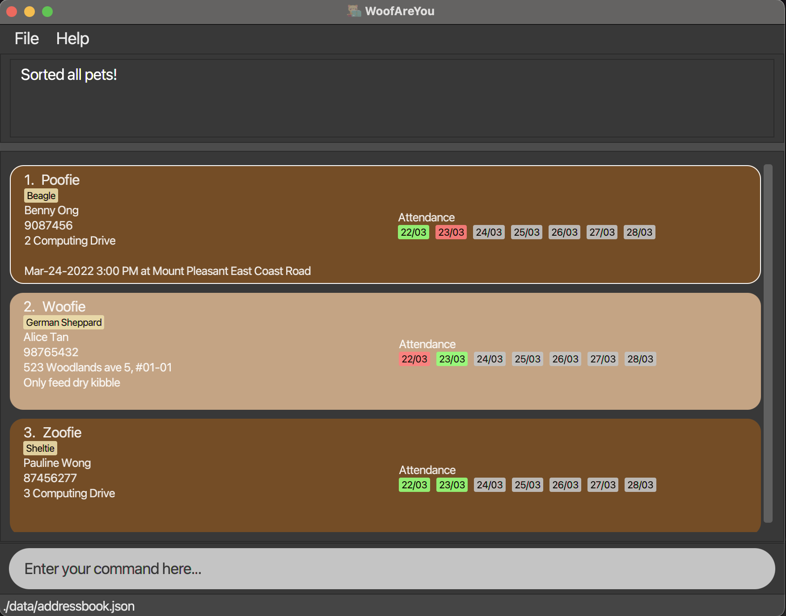
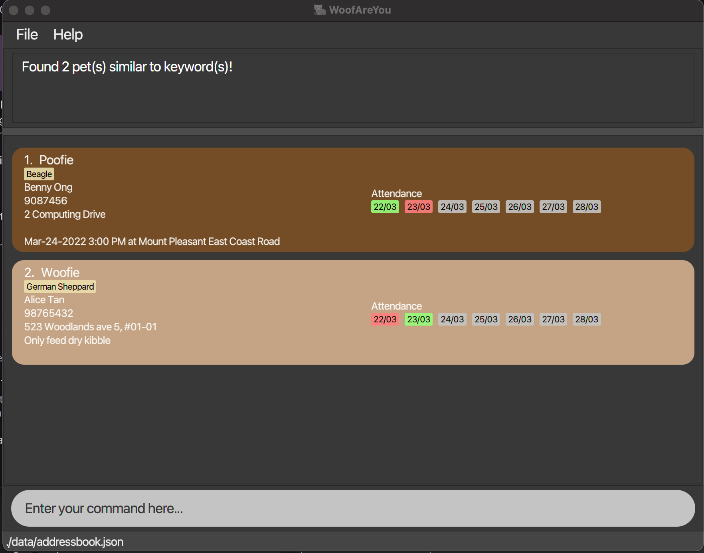
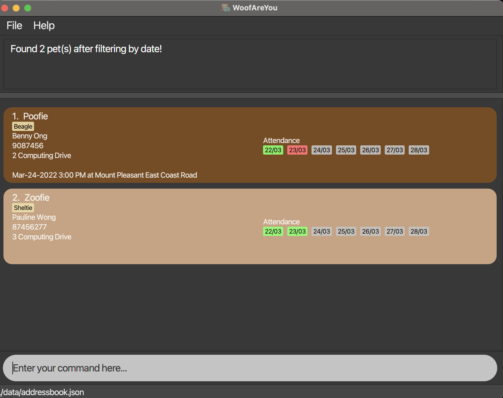

# WoofAreYou

WoofAreYou is a desktop application for pet daycare owners to handle the administrative information of their pets. If you can
type fast and understand the basics of CLI (Command Line Interface), WoofAreYou can get your contact management tasks done faster than traditional GUI apps.

  

* Table of Contents
  {:toc}

--------------------------------------------------------------------------------------------------------------------

## Quick start

1. Ensure you have Java `11` or above installed in your Computer.

1. Download the latest `WoofAreYou.jar` from [here](https://github.com/AY2122S2-CS2103T-T13-1/tp/releases/tag/v1.3.trial).

1. Copy the file to the folder you want to use as the _home folder_ for your AddressBook.

1. Double-click the file to start the app.

1. Type the command in the command box and press Enter to execute it. e.g. typing **`help`** and pressing Enter will open the help window. 
   Some example commands you can try:

   * **`add n/Woofie o/Alice Tan p/98765432 a/523 Woodlands ave 5, #01-01 t/Bulldog`** : Adds a pet named `Peepee` to the tracker.

   * **`delete 3`** : Deletes the 3rd pet shown in list.

   * **`find Woofie`** : Returns a list of pets with similar name as keywords and their corresponding information.

   * **`exit`** : Exits the app.

1. Refer to the [Features](#Features) below for details of each command.

--------------------------------------------------------------------------------------------------------------------

## Features

As a pet daycare owner, it takes a lot of effort to match pets to their names,
remember their owner's names, phone numbers and addresses. Not to mention, some pets have special dietary requirements and
vet appointments that you have to take note off. With WoofAreYou, these things can be taken care
of easily, and you can do exactly what you are good at: taking good care of them and ensuring their safety.
This section will elaborate on the features WoofAreYou has and is
categorised into **Basic Administration**, **Optional Requirements** and **Efficiency Enhancement**.

**:information_source: Notes about the command format:** 

* Words in `UPPER_CASE` are the parameters to be supplied by the user. 
  e.g. in `add n/NAME`, `NAME` is a parameter which can be used as `add n/Woofie`.

* Items in square brackets are optional. 
  e.g `n/NAME [t/TAG]` can be used as `n/Woofie t/German Sheppard` or as `n/Woofie`.

* Items with `…`​ after them can be used multiple times including zero times. 
  e.g. `[t/TAG]…​` can be used as ` ` (i.e. 0 times), `t/German Sheppard`, `t/Golden Retriever t/Dachshund` etc.

* Parameters can be in any order. 
  e.g. if the command specifies `n/NAME p/PHONE_NUMBER`, `p/PHONE_NUMBER n/NAME` is also acceptable.

* If a parameter is expected only once in the command but you specified it multiple times, only the last occurrence of the parameter will be taken. 
  e.g. if you specify `p/12341234 p/56785678`, only `p/56785678` will be taken.

* Extraneous parameters for commands that do not take in parameters (such as `help`, `list`, `exit` and `clear`) will be ignored. 
  e.g. if the command specifies `help 123`, it will be interpreted as `help`.

## _Basic Administration_

This subsection covers the basic processes that you will encounter when adding a pet to the pet list.

### Add a pet: `add`

When you have a new pet in the daycare, you will need to add a pet to the pet list.

Format: `add n/NAME_OF_PET o/OWNER_NAME p/PHONE_NUMBER a/ADDRESS [t/TAG]...`
* Each particular field is compulsory except for `TAG`.
* `TAG` is an optional field which could be used to indicate the breed of a pet.
  * If a pet is a Golden Dachshund, you can use `t/Golden Retriever t/Dachshund` or just `t/Golden Dachshund`.
* Each particular entered must strictly correspond to its legal prefix.`e.g: p/Address is considered illegal`.
* Phone number **must only contain numbers**.

Examples:
* `add n/Woofie o/Alice Tan p/98765432 a/523 Woodlands ave 5, #01-01 t/Bulldog` will show a screenshot as below.

  

### Edit a pet : `edit`

When you key in some particular(s) wrongly, you can edit an existing pet in the pet list.

Format: `edit INDEX [n/NAME_OF_PET] [o/OWNER_NAME] [p/PHONE_NUMBER] [a/ADDRESS] [t/TAG]...`
* Edits the pet at the specified `INDEX`. The index refers to the index number shown in the displayed pet list. The index **must be a positive integer** 1, 2, 3, …​.
* All the fields are optional but at least one of the fields must be provided.
* Existing values will be updated to the input values.
* When editing tags, the existing tags of the pet will be removed i.e. adding of tags is not cumulative.
* You can remove all the pet's tags by typing `t/` without specifying any tags after it.

Examples:
* Continuing from the previous example, `edit 1 t/German Sheppard` will change the tag of Woofie from 'Bulldog' to 'German Sheppard'.

### Mark a pet as present: `present`

When a pet is arriving for daycare on a certain day, you will need to mark a pet as present on that day. Sometimes the
pet will require school bus pick-up and drop-off, if you provide those services.

Format: `present INDEX date/dd-MM-yyyy [pu/HH:mm do/HH:mm]`

* Adds a present attendance entry with the attendance date, pick-up and drop-off time to the pet at the specified `INDEX`.
* The index refers to the index number shown in the current list of pets.
* The index **must be a positive integer** 1, 2, 3, …​
* Date **must follow the specified format**.
* Time for pick-up and drop-off are optional but **must also follow the specified format**.

Examples:
* As per previous example `present 1 date/23-03-2022 pu/08:00 do/19:00` indicates that Woofie is present for daycare on `23-03-2022`, requires to be picked up at `08:00` and dropped off at `19:00`
* If dd-MM-yyyy happens to be within 7 days from now, you will see the attendance tag turn green as shown below.

  

### Mark a pet as absent: `absent`

On other days, the pet will not come to the daycare, and you want to mark a pet as absent on that day.

Format: `absent INDEX date/dd-MM-yyyy`

* Adds an absent attendance entry with the attendance date to the pet at the specified `INDEX`.
* The index refers to the index number shown in the current list of pets.
* The index **must be a positive integer** 1, 2, 3, …​
* Date **must follow the specified format**.

Examples:
* `absent 1 date/22-03-2022` indicates that pet 1 is absent for daycare on `22-03-2022`.
* If dd-MM-yyyy happens to be within 7 days from now, you will see the attendance tag turn red.

### Delete a pet: `delete`

When the pet no longer needs your servies, you want to delete the specified pet from the pet list.

Format: `delete INDEX`

* Deletes the pet at the specified `INDEX`.
* The index refers to the index number shown in the current list of pets.
* The index **must be a positive integer** 1, 2, 3, …​

Examples:
* `delete 1` deletes the first pet in the list.

### Clearing all entries : `clear`

When you no longer need the information on any of the pets, you can clear all entries from the pet list.

Format: `clear`

### Exiting the program : `exit`

When you are done with your daily administrative duties, you can exit the program.

Format: `exit`

## _Optional Requirements_

This subsection covers the features that you may encounter when having a pet that requires more attention.

### Add pets' dietary requirements: `diet` ###

When some pets have health issues, owners will give instructions on what their pet can or cannot eat. You will want to
put a diet remark on the pet to take note.

Format: `diet INDEX d/REMARK`

* Adds `d/REMARK` as a dietary requirement for pet at `INDEX`.
* The index refers to the index number shown in the current list of pets.
* The index **must be a positive integer** 1, 2, 3, …​
* Entering `diet INDEX d/` will remove the dietary requirements of pet at `INDEX`.

Examples:
* `diet 1 d/Only feed dry kibble` will store a dietary remark for Woofie indicating to "Only feed dry kibble" as shown below.

  

### Add / Clear pets' appointment details: `app` ###

Sometimes, you will need to bring the pet out for its vet or grooming appointments. You will want to put a reminder on
the pet to take note as well. With this feature you can **_Add Appointment_** and **_Clear Appointment_** when appropriate.

**:information_source: Notes about this feature:** 

* You can only store one appointment to a pet at any point of time.
  * This is because pets often have varying appointment dates and it is unlikely to know when the next appointment will be.
* Once the appointment is over, you have to clear it if you want to put new appointments in the future.

**Add Appointment**

Format: `app INDEX dt/[dd-MM-yyyy HH:mm] at/[location]`

* Adds appointment for pet at `INDEX` on `dt/[dd-MM-yyyy HH:mm]` `at/[location]` .
* The index refers to the index number shown in the current list of pets.
* The index **must be a positive integer** 1, 2, 3, …​
* Date and time of appointment should be entered together with `dt/` prefix.
* Date and time should strictly follow `dd-MM-yyyy HH:mm` format.
* Location of appointment should be entered with `at/` prefix.
* Whitespaces, special characters and alphanumeric characters are allowed for location.
* If both `date/` and `at/` are not present, `app` will be deemed invalid.

Examples:
* `app 1 dt/23-03-2022 09:30 at/ NUS Vet Clinic` will store the appointment details for Woofie as
`Mar-23-2022 9:30 AM at NUS Vet Clinic`.

**Clear Appointment**

Format: `app INDEX clear`

* Clears appointment for pet at `INDEX`.
* The index refers to the index number shown in the current list of pets.
* The index **must be a positive integer** 1, 2, 3, …​
* `clear` is case-sensitive.
* Whitespaces, special characters and alphanumeric characters are allowed for location.
* If `clear` is not present, `app` will be deemed invalid.

Examples:
`app 1 clear` will clear the appointment details for Woofie and set it to be an empty field.

## _Efficiency Enhancement_

You may have noticed that a handful of commands require `INDEX` and it may be very troublesome to scroll through the
whole pet list to find that one `INDEX` if your pet list is huge. Hence, this subsection covers the features that
will make life easier when trying to implement the features above.

### Sort pets: `sort`

Firstly, you can sort the pet list by a few parameters. This command returns a sorted list of pets according to the
parameter chosen. You can choose to either sort alphabetically by owner name or pet name. You can also sort chronologically
by appointment date.

Format: `sort SORT_BY`
* The valid `SORT_BY` parameters are `name` , `owner` and `app`.
* The parameters are case-sensitive.
* Only one `SORT_BY` parameter is to be used when the command. If none or more than one parameter is used, command will throw an error.

Examples:
* `sort name` will sort the pets alphabetically as shown below.

  

### Find pet details: `find`

If sorting alone is not enough, and you know exactly which pet you are looking for then you can use this command to find
pets with that name. If there are multiple pets with the same name, a pet list of all such pets
will be displayed. You can also find using multiple pet names.

Format: `find NAME_OF_PET [KEYWORDS]...`
* The name of pet is case-insensitive e.g: `find Mojo` will match `find mojo`.
* Only the name is searched.
* Search returns partial name matches e.g.: `find mo` will return Mojo as a result.

Examples:
* `find poofie woofie` will return a pet list with these two pets in the list.

  

### Filter pet list: `filter`

If you just want to know  common information about some pets, you can filter the pet list by a specified field.
You can filter by date, to find out which pets are present on a given date. You can filter by appointment to check which
pets have appointment on a given date. You can filter by owner's name to find all pets with the same owner. You can also
filter by tags to find all pets of with a common tag.

Format: `filter f/KEYWORD`

* Can only filter by date specified, owner's name and tags of pets (choose one out of three, else error will be shown)
* Specified `f/` only consists of: `byDate/`, `byApp/`, `byTags/` and `byOwner/`.
* `KEYWORD` if user uses `byDate/` or `byApp/` has to be in `dd-MM-yyyy` format, or `today`.
* `KEYWORD` if user uses `byOwner/` can be any length.
* `KEYWORD` if user uses `byTags/` can be any length.
    * Can filter with a partial match in `Keyword`: `Bord`, `Borde Colli`, will match with pets tagged as `Border Collie`

Examples:
* `filter byOwner/Lily` shows pets owned by all Lily(s).
* `filter byTags/Retriever` shows pets with `Retriever` in their tags.
* `filter byDate/22-03-2022` show pets present on 22 March 2022 as shown below.

  

### List all pets : `list`

After using all of those commands, you may want to retrieve the initial pet list with all the pets. This feature just
shows a list of all pets in pet list.

Format:`list`

### Undo changes : `undo`

Mistakes happen when dealing with CLI. Fortunately, you can undo previous commands that you have keyed in.

Format: `undo`
* You will not be able to undo `clear`, `exit`, `find`, `help` and `list` Commands.

Examples:
* If the user chooses to delete a pet, `undo` will revert the address book to the state where the pet is not deleted.

### View help : `help`

If you need additional help when using WoofAreYou, you can use the help command. It shows a message explaining how to access the help page.

Format: `help`

## Command Summary

The table below summarises all the commands and features discussed above. You can refer to this if you do not want to
deal with the nitty-gritty details of each feature.

| Action        | Format                                                                              | Example                                                                       | Function                                                                                                              |
|---------------|-------------------------------------------------------------------------------------|-------------------------------------------------------------------------------|-----------------------------------------------------------------------------------------------------------------------|
| **Add**       | `add n/NAME_OF_PET o/OWNER_NAME p/PHONE_NUMBER a/ADDRESS [t/TAG]...`                | `add n/Woofie o/Alice Tan p/98765432 a/523 Woodlands ave 5, #01-01 t/Bulldog` | Adds Woofie into pet list along with its information                                                                  |
| **Edit**      | `edit INDEX [n/NAME_OF_PET] [o/OWNER_NAME] [p/PHONE_NUMBER] [a/ADDRESS] [t/TAG]...` | `edit 1 p/98247076 t/bulldog`                                                 | Edits phone number and tag of pet at index 1                                                                          |
| **Delete**    | `delete id`                                                                         | `delete 1`                                                                    | Deletes pet at index 1 from the pet list                                                                              |
| **Find**      | `find n/NAME_OF_PET [KEYWORDS]...`                                                  | `find Woofie`                                                                 | Finds all pets with similar name as "Woofie"                                                                          |
| **Diet**      | `diet INDEX d/remark`                                                               | `diet 1 d/Only feed dry kibble`                                               | Adds a diet remark "Only feed dry kibble" to pet at index 1                                                           |
| **Present**   | `present INDEX date/dd-MM-yyyy pu/HH:mm do/HH:mm`                                   | `present 1 date/22-03-2022 pu/08:00 do/17:00`                                 | Indicates that pet at index 1 will be attending daycare on 22 March 2022, requires pick up at 8am and drop off at 5pm |
| **Absent**    | `absent INDEX date/dd-MM-yyyy`                                                      | `absent 1 date/22-03-2022`                                                    | Indicates that pet at index 1 was absent on 22 March 2022                                                             |
| **App**       | `app INDEX date/[dd-MM-yyyy HH:mm] at/[location]`                                   | `app 1 date/22-03-2022 09:30 at/ NUS Vet Clinic`                              | Indicates that pet at index 1 has an appointment on 22 March 2022, 9.30am at NUS Vet Clinic                           |
| **App clear** | `app INDEX clear`                                                                   | `app 1 clear`                                                                 | Clears the current appointment of pet at index 1                                                                      |
| **Sort**      | `sort SORT_BY`                                                                      | `sort name`                                                                   | Sorts pet list alphabetically by name of pets                                                                         |
| **Filter**    | `filter f/KEYWORD`                                                                  | `filter byDate/22-03-2022`                                                    | Returns information of all pets present on 22 March 2022                                                              |
| **List**      | `list`                                                                              | `list`                                                                        | Lists all pets in pet list                                                                                            |
| **Clear**     | `clear`                                                                             | `clear`                                                                       | Clears all pets in pet list                                                                                           |
| **Undo**      | `undo`                                                                              | `undo`                                                                        | Undoes the previous command made                                                                                      |
| **Help**      | `help`                                                                              | `help`                                                                        | Shows a message explaining how to access the help page                                                                |
| **Exit**      | `exit`                                                                              | `exit`                                                                        | Exits WoofAreYou                                                                                                      |
