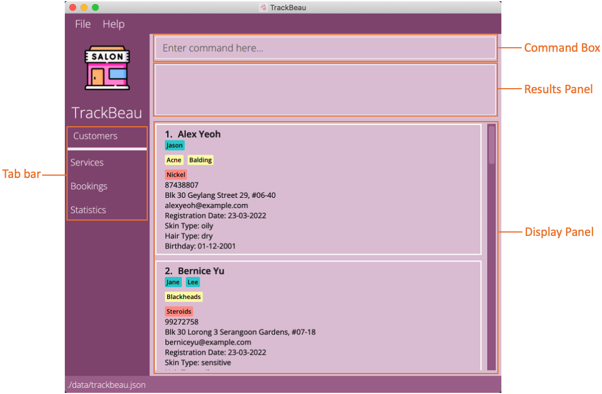

* Table of Contents
{:toc}

--------------------------------------------------------------------------------------------------------------------
## 1. Introduction

TrackBeau is a **desktop app made for beauty salons to aid them in managing customers' profile, bookings and services.
It is optimized for use via a Command Line Interface** (CLI) while still having the benefits of a Graphical User
Interface (GUI). If you can type fast, TrackBeau can help you manage your customers, bookings and services faster than
traditional GUI apps.

--------------------------------------------------------------------------------------------------------------------

## 2. Quick start

1. Ensure you have Java `11` or above installed in your Computer.

2. Download the latest `trackbeau.jar` from [here](https://github.com/AY2122S2-CS2103-F11-3/tp/releases).

3. Copy the file to the folder you want to use as the _home folder_ for your TrackBeau.

4. Double-click the file to start the app. The GUI similar to the below should appear in a few seconds. Note how the app contains some sample data. 
   

5. Type the command in the command box and press Enter to execute it. e.g. typing **`listc`** and pressing Enter will show you profiles of all customers. 
   Some example commands you can try:

   * **`lists`** : Shows a list of all services in the application.
   * **`help`** : Opens the help window.
   * **`exit`** : Exits the app.

6. Refer to the [4. Features](#4.-Features) below for details of each command.
--------------------------------------------------------------------------------------------------------------------
## 3. About

### 3.1 Structure of this document

This User Guide is structured in a way that lets you find what you need quickly and easily.
You can jump to the different sections easily by referring to the Table of Contents.
In the following subsection, [3.2 Reading this document](#), you can find several tips on how to read this guide.
The next section, [4. Features](#4.-Features) documents the main features in TrackBeau and provides you with 
instructions on how to use them.

### 3.2 Reading this document
This subsection introduces you to the symbols, syntax and technical terms that are used throughout this guide.
Getting yourself familiar with this subsection is useful in helping you to better understand this guide.

#### 3.2.1 Symbols and syntax
The table below explains the symbols and syntax used throughout the user guide.

| Symbol/Syntax    | Meaning                                                                                        |
|----------------- |------------------------------------------------------------------------------------------------|
|
Information: Example information
| Text that appears in the information box indicates additional information that may be useful to know.|
|
:bulb: **Tip:** Example tip
| Text that appears in the tip box are useful for enhancing your experience with using TrackBeau.|                                               
|
:exclamation: **Caution:** Example warning
| Text that appears in the caution box is important as unwanted consequences might arise if not followed.|

#### 3.2.2 Sections of TrackBeau's GUI
The image below shows the annotated GUI components of TrackBeau.

#### 3.2.3 Navigating in TrackBeau
TrackBeau consists of tabs that are toggleable in the tab bar on the left side of the GUI.
By selecting a tab, it toggles the display panel to showcase the contents related to the tab e.g., by clicking on
Services, it will display a list of services available. By default, the Customers tab is selected.

There is also a menu bar at the top of the GUI that consists of 2 menu item, File and Help. By clicking on File,
you will be able to access Exit to exit the app. By clicking on Help, you will be able access Help F1 to open the help window.

You can enter the commands via the command box and pressing Enter to execute them.
The results panel will then display a response on whether the command was successfully executed.
The display panel will then automatically refresh to display the contents of the results of the command executed. 

#### 3.2.4 Command Format
The table below explains the important technical terms to help you understand how to use the commands in TrackBeau.

| Technical Term | Meaning              | 
|----------------|----------------------|
|Command Word    | The first word of the command determines the action that TrackBeau should perform.|
|Prefix          | The characters right before each parameter which distinguishes one parameter from the other.|
|Parameter       | The words right after the prefix. Each parameter is a value given to the command to perform the specified action.|

**Example**:
* `addc n/NAME p/PHONE a/ADDRESS e/EMAIL`
* Command Word: `addc`
* Prefixes: `n/`, `p/`, `a/`, `e/`
* Parameters: `NAME`, `PHONE`, `ADDRESS`, `EMAIL`

The commands in TrackBeau follows these rules:
* Words in `UPPER_CASE` are the parameters to be supplied by you. 
  e.g. in `add n/NAME`, `NAME` is a parameter which can be used as `add n/John Doe`.

* Items in square brackets are optional. 
  e.g. `n/NAME [e/EMAIL]` can be used as `n/John Doe e/johnd@example.com` or as `n/John Doe`.

* Items with `…`​ after them can be used multiple times including zero times. 
  e.g. `[sep/SERVICE_PREFERENCE]…​` can be used as ` ` (i.e. 0 times), `sep/massage`, `sep/facial sep/massage` etc.

* Parameters can be in any order. 
  e.g. if the command specifies `n/NAME p/PHONE_NUMBER`, `p/PHONE_NUMBER n/NAME` is also acceptable.

* If a parameter is expected only once in the command, but you specified it multiple times, only the last occurrence of the parameter will be taken. 
  e.g. if you specify `p/12341234 p/56785678`, only `p/56785678` will be taken.

* Extraneous parameters for commands that do not take in parameters (such as `listc`, `exit`) will be ignored. 
  e.g. if the command specifies `listc 123`, it will be interpreted as `listc`.
--------------------------------------------------------------------------------------------------------------------

## 4. Features
This section contains the information about the features and commands of TrackBeau. 
It is split into the following subsections:
1. [Customer management ](#4.1-Customer management)
2. [Service management ](#4.2-Service management)
3. [Booking management ](#4.3-Booking management)
4. [Statistics ](#4.4-Statistics)
5. [Miscellaneous ](#4.5-Miscellaneous)

### 4.1 Customer management

#### 4.1.1 Customer management command parameters
The table below shows a list of command parameters that will be used for customer management.

#### 4.1.2 Adding a customer: `add`

Adds a customer to the application.

Format: `add n/NAME p/PHONE_NUMBER a/ADDRESS [e/EMAIL] [stp/STAFF_PREFERENCE]…​ [sep/SERVICE_PREFERENCE]…​ [h/HAIR_TYPE] [s/SKIN_TYPE] [al/ALLERGY]…​`

:bulb: **Tip:**
A customer can have any number of preferred staffs, preferred services and allergies (including 0)

Examples:
* `add n/John Doe p/98765432 a/John street, block 123, #01-01 e/johnd@example.com`
* `add n/Betsy Crowe e/betsycrowe@example.com a/Newgate Prison p/1234567 al/Aloe Vera sep/facial sep/massage`

#### 4.1.3 Listing all customers : `list`

Shows a list of all customers in the application.

Format: `list`

#### 4.1.4 Editing a customer : `edit`

Edits an existing customer in the application.

Format: `edit INDEX [n/NAME] [p/PHONE_NUMBER] [a/ADDRESS] [e/EMAIL] [stp/STAFF_PREFERENCE]…​ [sep/SERVICE_PREFERENCE]…​ [h/HAIR_TYPE] [s/SKIN_TYPE] [al/ALLERGY]…​`

* Edits the customer at the specified `INDEX`. The index refers to the index number shown in the displayed customer list. The index **must be a positive integer** 1, 2, 3, …​
* At least one of the optional fields must be provided.
* Existing values will be updated to the input values.
* When editing staff preferences, service preferences or allergies, the existing staff preferences, service preferences or allergies of the customer will be removed i.e adding of staff preferences, service preferences or allergies is not cumulative.
* You can remove all the customer’s staff preferences, service preferences or allergies by typing `stp/`, `sep/` or `al/` without
  specifying any staff preferences, service preferences or allergies after it.

Examples:
*  `edit 1 p/91234567 e/johndoe@example.com` Edits the phone number and email address of the 1st customer to be `91234567` and `johndoe@example.com` respectively.
*  `edit 2 n/Betsy Crower al/` Edits the name of the 2nd customer to be `Betsy Crower` and clears all existing allergies.

#### 4.1.5 Listing customers' profile by name: `find`

Finds customers whose names contain any of the given keywords.

Format: `find KEYWORD [MORE_KEYWORDS]`

* Keyword types available: name, phone, skintype, hairtype, staffpref, servicepref & allergies
* The search is case-insensitive. e.g `john` will match `john`
* Only the name is searched.
* Only full words will be matched e.g. `john` will not match `joh`

Examples:
* `find name John` returns `john` and `John Doe`
* `find allergies nickle` returns customer profiles with nickle allergies
* `find hairtype oily dry` returns customer profiles that has the hair type of oily or dry

#### 4.1.6 Deleting customer(s) : `delete`

Deletes the specified customer(s) from the application.

Format: delete INDEX,[MORE INDEXES]
* Deletes the customer profile at the specified INDEXES.
* The index refers to the index number shown in the displayed customer list.
* The index must be a positive integer 1, 2, 3, …
* All indexes must be valid else the operation will not execute.

Examples:
* `delete 1,2` : Removes the 1st and 2nd customer from the application.

### 4.2 Service management

#### 4.2.1 Service management command parameters
The table below shows a list of command parameters that will be used for service management.

### 4.3 Booking management

#### 4.3.1 Booking management command parameters
The table below shows a list of command parameters that will be used for booking management.

### 4.4 Statistics

#### 4.4.1 Statistics command parameters
The table below shows a list of command parameters that will be used for statistics.

### 4.5 Miscellaneous

#### 4.5.1 Viewing help : `help`

Shows a message explaining how to access the help page.

Format: `help`

#### 4.5.2 Clearing all entries : `clear`

Clears all entries from the application.

Format: `clear`

#### 4.5.3 Exiting the program : `exit`

Exits the program.

Format: `exit`

### Saving the data

TrackBeau data are saved in the hard disk automatically after any command that changes the data. There is no need to save manually.

### Editing the data file

TrackBeau data are saved as a JSON file `[JAR file location]/data/trackbeau.json`. Advanced users are welcome to update data directly by editing that data file.

:exclamation: **Caution:**
If your changes to the data file makes its format invalid, TrackBeau will discard all data and start with an empty data file at the next run.

### Archiving data files `[coming in v2.0]`

_Details coming soon ..._

--------------------------------------------------------------------------------------------------------------------

## FAQ

**Q**: How do I transfer my data to another Computer? 
**A**: Install the app in the other computer and overwrite the empty data file it creates with the file that contains the data of your previous TrackBeau home folder.

--------------------------------------------------------------------------------------------------------------------

## Command summary

| Action     | Format, Examples                                                                                                                                                                                                                                                    |
|------------|---------------------------------------------------------------------------------------------------------------------------------------------------------------------------------------------------------------------------------------------------------------------|
| **Add**    | `add n/NAME p/PHONE_NUMBER a/ADDRESS [e/EMAIL] [stp/STAFF_PREFERENCE]…​ [sep/SERVICE_PREFERENCE]…​ [h/HAIR_TYPE] [s/SKIN_TYPE] [al/ALLERGY]…​` e.g., `add n/Betsy Crowe e/betsycrowe@example.com a/Newgate Prison p/1234567 al/Aloe Vera sep/facial sep/massage` |
| **Clear**  | `clear`                                                                                                                                                                                                                                                             |
| **Delete** | `delete INDEX`  e.g., `delete 3`                                                                                                                                                                                                                                 |
| **Edit**   | `edit INDEX [n/NAME] [p/PHONE_NUMBER] [a/ADDRESS] [e/EMAIL] [stp/STAFF_PREFERENCE]…​ [sep/SERVICE_PREFERENCE]…​ [h/HAIR_TYPE] [s/SKIN_TYPE] [al/ALLERGY]…​` e.g.,`edit 1 p/91234567 e/johndoe@example.com`                                                       |
| **Exit**   | `exit`                                                                                                                                                                                                                                                              |
| **Find**   | `find KEYWORDTYPE KEYWORD [MORE_KEYWORDS]`  e.g., `find hairtype oily dry`                                                                                                                                                                                                                |
| **Help**   | `help`                                                                                                                                                                                                                                                              |
| **List**   | `list`                                                                                                                                                                                                                                                              |
| **Show**   | `show INDEX`  e.g., `show 3`                                                                                                                                                                                                                                     |
