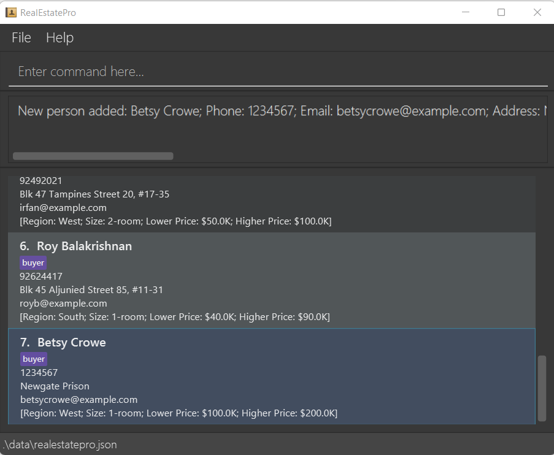
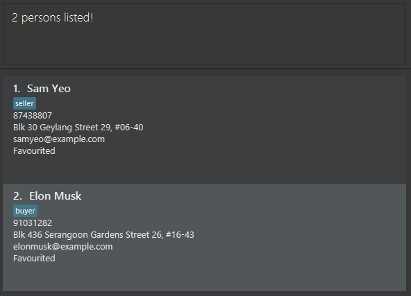
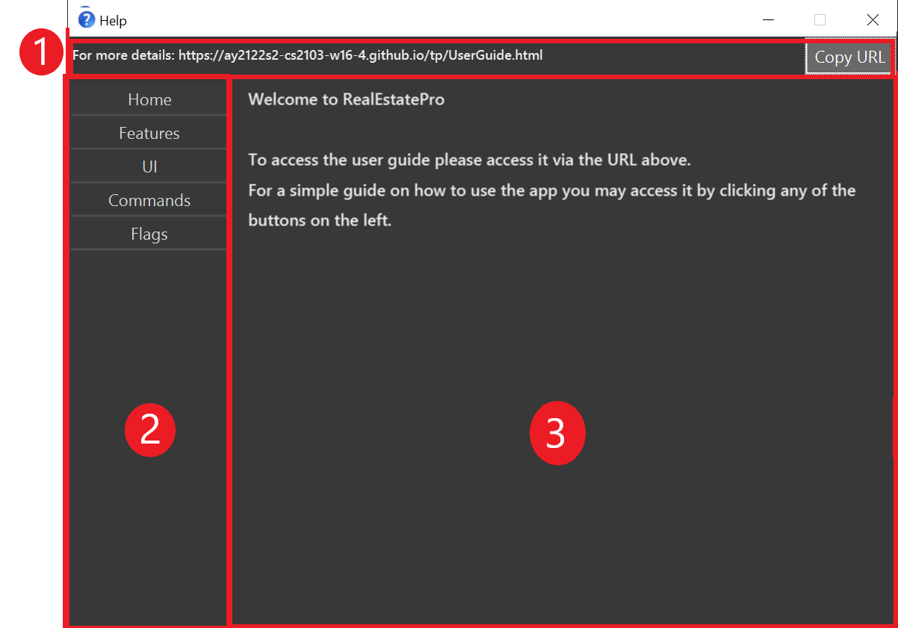

RealEstatePro is a desktop app for managing contacts, optimized for real estate agents to manage their clients’ contacts and sales of properties.

# Reference

Original AB3 User Guide: [link](https://se-education.org/addressbook-level3/UserGuide.html)

## Quick start

1. Ensure you have Java `11` or above installed on your computer.
2. Download the latest `realestatepro.jar` from here **(add link)**.
3. Copy the file to the folder you want to use as the *home folder* for your RealEstatePro.
4. Double-click the file to start the app. The GUI should appear in a few seconds.
5. Type the command in the command box and press Enter to execute it. e.g. typing **`help`** and pressing Enter will open the help window.
Some example commands you can try:
    - `list` : Lists all contacts.
    - `add n/John Doe p/98765432 e/johnd@example.com a/John street, block 123, #01-01 t/buyer` : Adds a contact named `John Doe` , contact number `98765432`, email `johnd@example.com`, address `street, block 123, #01-01` and is a buyer to the RealEstatePro app.
    - `delete 3` : Deletes the 3rd contact shown in the current list.
    - `clear` : Deletes all contacts.
    - `exit` : Exits the app.
6. Refer to the Features below for details of each command.

## Features

Notes about the command format:

- Words in `UPPER_CASE` are the parameters to be supplied by the user. 
e.g. in `add n/NAME`, `NAME` is a parameter which can be used as `add n/John Doe`.

- Items in square brackets are optional. 
  e.g. `n/NAME [pr/PROPERTY]` can be used as `n/John Doe pr/north,123 Street,1-room,$300000` or as `n/John Doe`.

- Items with `…` after them can be used multiple times including zero times. 
  e.g. `[p/PHONE_NUMBER]…` can be used as ` ` (i.e. 0 times), `p/12345`, `p/12345 p/54321` etc.

- Inputting information after `pr/` & `t/` indicates the type of property a user is selling or buying. 
e.g. `pr/PROPERTY, t/USER_TYPE` can be used as `pr/East, Block 123, 2-room, $550000, t/seller` means this person is a seller looking to sell a 2-room property at Block 123 which is located in the East, with a price of $550000. More information about the required format of properties can be found in the next section.

- Person parameters can be in any order. 
e.g. if the command specifies `n/NAME p/PHONE_NUMBER pr/PROPERTY`, `p/PHONE_NUMBER pr/PROPERTY n/NAME` is also acceptable.

- If a parameter is expected only once in the command, but you specified it multiple times, only the last occurrence of the parameter will be taken. 
e.g. if you specify `p/12341234 p/56785678`, only `p/56785678` will be taken.

- Extraneous parameters for commands that do not take in parameters (such as `help`, `list`, `exit` and `clear`) will be ignored. 
e.g. if the command specifies `help 123`, it will be interpreted as `help`.

Notes about the property format:
- Properties must be specified in the following format: `pr/REGION,ADDRESS,SIZE,PRICE`. Whitespace between parameters is ignored. 
  e.g. Both `pr/East,Pasir Ris Drive 1 Block 123,2-room,$550000` and `pr/East, Pasir Ris Drive 1 Block 123, 2-room, $550000` are acceptable. `pr/Pasir Ris Drive 1 Block 123, East, 2-room, $550000` is not acceptable.

Notes about the preference format:
- Preference must be specified in the following format: `pf/REGION,SIZE,LOWPRICE,HIGHPRICE`. Whitespace between parameters is ignored. 

Parameter formats:
- REGION: One of [`North`, `South`, `East`, `West`, `Central`] (Non case-sensitive).
- ADDRESS: Any non-empty string that does not contain `,`. e.g. `Pasir Ris Drive 1 Block 123`
- SIZE: One of [`1-room`,`2-room`, `3-room`, `4-room`, `5-room`] (Non case-sensitive).
- PRICE: `$` followed by a positive integer. e.g. `$150000`

### Viewing help : `help`

Shows a message explaining how to access the help page.

Format: `help`

### Adding a person: `add`

Adds a person to the address book.

Format: `add n/NAME p/PHONE_NUMBER e/EMAIL a/ADDRESS [pr/PROPERTY]… [pf/PREFERENCE] t/USER_TYPE`

**Tip**: A person can be tagged as either a `buyer`, or `seller`.

Examples:

- `add n/John Doe p/98765432 e/johnd@example.com a/John street block 123 #01-01, pr/East, John street block 123 #01-01, 2-room, $200000 t/buyer`
- `add n/Betsy Crowe e/betsycrowe@example.com a/Newgate Prison p/1234567 pf/West, 1-room, $100000, $200000 t/seller`

    

### Listing all persons : `list`

Shows a list of all persons in the address book.

Format: `list`

### Editing a person: `edit`

Edits an existing person in the address book.

Format: `edit INDEX [n/NAME] [p/PHONE] [e/EMAIL] [a/ADDRESS] [pr/PROPERTY]… [t/USER_TYPE]`

- Edits the person at the specified `INDEX`. The index refers to the index number shown in the displayed person list. The index **must be a positive integer** 1, 2, 3, …
- At least one of the optional fields must be provided.
- Existing values will be updated to the input values.
- You may change the type of the user, from `buyer` to `seller` & vice versa
- You can remove all the person’s properties by typing `pr/` without specifying any properties after it.

Examples:

- `edit 1 p/91234567 e/johndoe@example.com` Edits the phone number and email address of the 1st person to be `91234567` and `johndoe@example.com` respectively.
- `edit 2 n/Betsy Crower t/seller` Edits the name of the 2nd person to be `Betsy Crower` and updates the 2nd person's user type to `seller`.
- `edit 2 n/Betsy Crower pr/` Edits the name of the 2nd person to be `Betsy Crower` and clears all existing properties.

### Locating persons by name: `find`

Finds persons whose specified attribute contain any of the given keywords.

Format: `find ATTRIBUTE KEYWORD [MORE_KEYWORDS]`

- `ATTRIBUTE` can be one of: `all` `name` `phone` `email` `address` `properties` `preference` `usertype`
- If the specified attribute is `all`, search for the keywords in all attributes.
- The search is case-insensitive. e.g `hans` will match `Hans`
- The order of the keywords does not matter. e.g. `Hans Bo` will match `Bo Hans`
- Only full words will be matched e.g. `Han` will not match `Hans`
- Persons matching at least one keyword will be returned (i.e. `OR` search). e.g. `Hans Bo` will return `Hans Gruber`, `Bo Yang`

Examples:

- `find name John` returns `john` and `John Doe`
- `find name sam elon` returns `Sam Yeo`, `Elon Musk`

    

### Deleting a person: `delete`

Deletes the specified person from the address book.

Format: `delete INDEX`

- Deletes the person at the specified `INDEX`.
- The index refers to the index number shown in the displayed person list.
- The index **must be a positive integer** 1, 2, 3, …

Examples:

- `list` followed by `delete 2` deletes the 2nd person in the address book.
- `find Betsy` followed by `delete 1` deletes the 1st person in the results of the `find` command.

### Matching properties and preferences: `match`

Opens a new window and shows all sellers and buyers with matching property and preference.

Format: `match`

### Clearing all entries : `clear`

Clears all entries from the address book.

Format: `clear`

### Exiting the program : `exit`

Exits the program.

Format: `exit`

### Favourite a person: `favourite`

Favourites the specified client from the application represented by a star as show below. The user (real estate agent) will be able to view the more compact list of favorited clients in a new window called the Favourites window.

Format: `favourite INDEX`

- Favourites the person at the specified `INDEX`.
- The index refers to the index number shown in the displayed person list.
- The index **must be a positive integer** 1, 2, 3, …

### Open Favourites window:

Opens a new window that displays compacted list of clients that have been favourited.

#### By Command: `fw`

Format: `fw`

#### By Ui:

1)  Navigate to the `File` menu and click on it.

2) Under it, click on `Favourites`

3) The system will pop up the Favourites window that contains a list of Persons favourited by the user.

### Open Help Window: `help`

Opens a new window that displays information on how to use the app and a URL to the user guide of the app.

Format: `help`

## Navigating the help window

1. Link to the full user guide
2. Buttons to access the different help sections
3. Help contents

### User onboarding [Coming soon]

### Saving the data

RealEstatePro data are saved in the hard disk automatically after any command that changes the data. There is no need to save manually.

### Editing the data file

RealEstatePro data are saved as a JSON file `[JAR file location]/data/realestatepro.json`. Advanced users are welcome to update data directly by editing that data file.

<aside>
❗ **Caution:** If your changes to the data file makes its format invalid, RealEstatePro will discard all data and start with an empty data file at the next run.

</aside>

### Displaying statistics `stats`

Opens up a new window that shows a pie chart of the number of buyers & sellers with preference or properties respectively in a particular region.
#### By Command: `stats`

# FAQ

# Command Summary
| Action | Format                             | Examples                                                                                                             |
| --- |------------------------------------|----------------------------------------------------------------------------------------------------------------------|
| Add | add n/NAME p/PHONE_NUMBER e/EMAIL a/ADDRESS [pr/PROPERTY]... [pf/PREFERENCE] t/USER_TYPE | e.g. add n/James Ho p/22224444 e/jamesho@example.com a/123, Clementi Rd, 1234665 pr/2-room, East, SGD$200K, t/seller |
| Clear | clear                              | -                                                                                                                    |
| Delete | delete INDEX | e.g. delete 3                                                                                                        |
| Edit | edit INDEX [n/NAME] [p/PHONE] [e/EMAIL] [a/ADDRESS] [pr/PROPERTY]… [t/USER_TYPE] | e.g. edit 2 n/James Lee e/jameslee@example.com                                                                       |
| Find | find ATTRIBUTE KEYWORD [MORE KEYWORDS...] | e.g. find name James Jake                                                                                            |
| List | list | -                                                                                                                    |
| Help | help | -                                                                                                                    |
|Match | match | -                                                                                                                    |
| Favourite | favourite INDEX | e.g., favourite 3                                                                                                    |
| Favourites window | fw  | - | 
| Statistics window | stats | - | 
