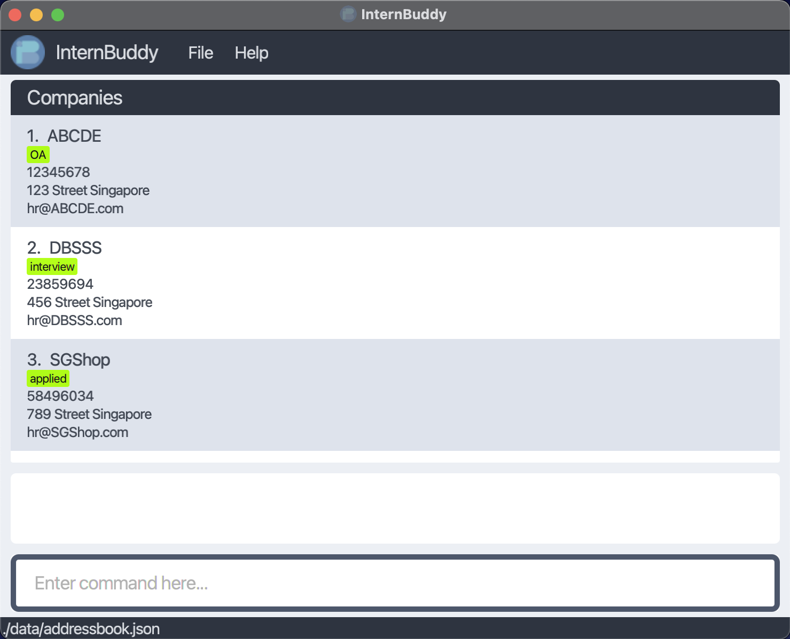
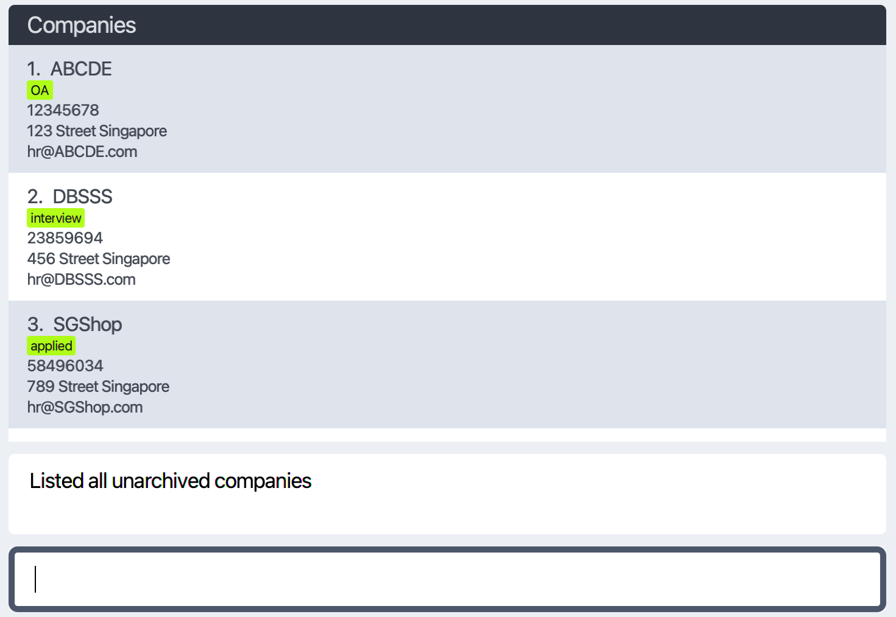
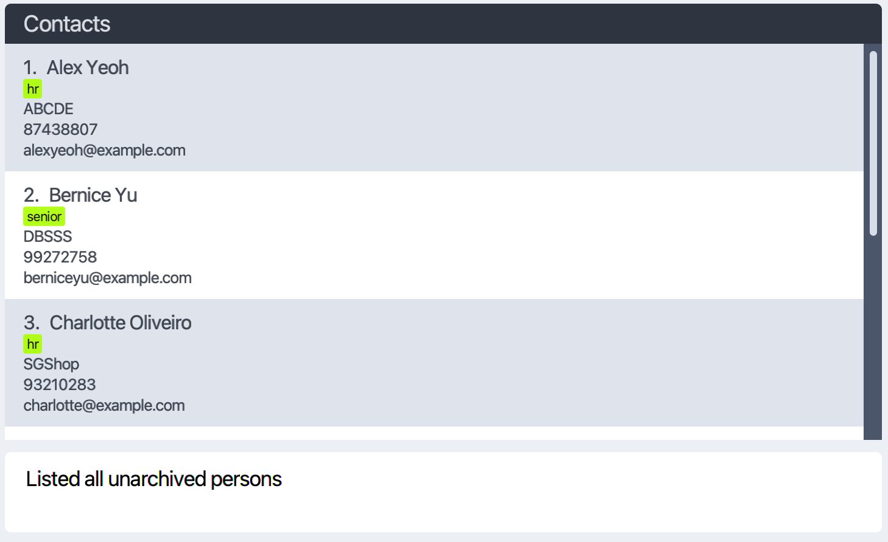
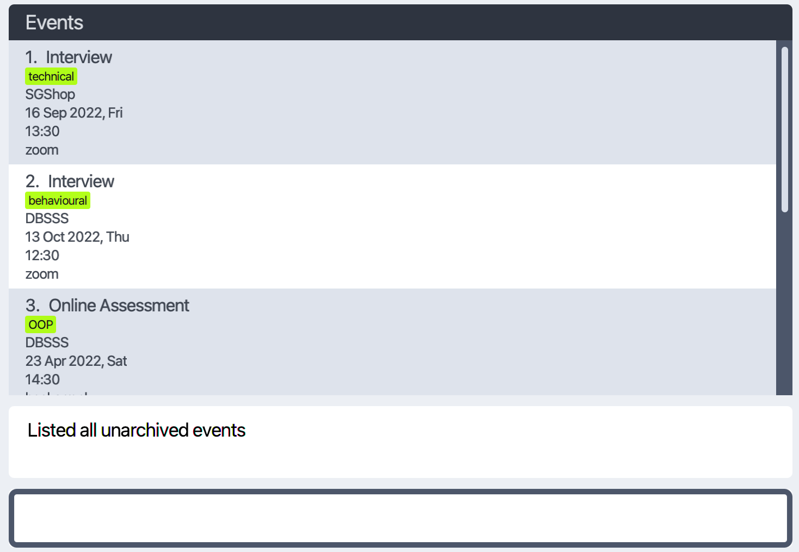
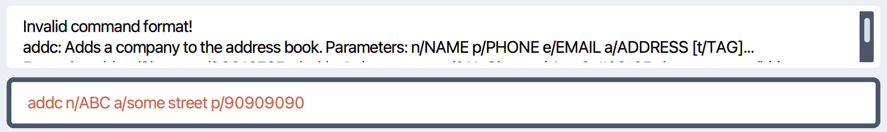
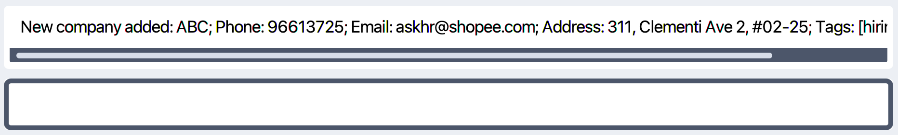

InternBuddy is a **desktop app to help students manage the events, companies, and contact people encountered during the internship search.
The app is optimized for use via a Command Line Interface (CLI) while still having the benefits of a Graphical User Interface (GUI).**
If you can type fast, InternBuddy can help you organize your internship search faster than traditional GUI apps.

The purpose of this User Guide is to assist you in learning and using InternBuddy. Whether you're a new user looking for
a place to start or a veteran needing a quick reference, this guide is here to answer your questions.

* Table of Contents
{:toc}

--------------------------------------------------------------------------------------------------------------------

## Quick start

1. Ensure you have Java `11` or above installed in your Computer.
   * If you don't have it installed, you can follow [Orcale's JDK installation guide](https://docs.oracle.com/en/java/javase/11/install/installation-guide.pdf)
   for your operating system.
   * Please make sure that you select Java `11` as your default Java version.
   * If you are not sure which version of Java that you currently have, you can follow [Java Manual](https://www.java.com/en/download/help/version_manual.html)
   to check.

2. Download the latest `InternBuddy.jar` from [here](https://github.com/AY2122S2-CS2103T-W14-3/tp/releases/tag/v1.2.0).

3. Copy the file to the folder you want to use as the _home folder_ for InternBuddy.

4. Double-click the file to start the app. A window similar to the one below should appear in a few seconds. Note how the app contains some sample data. 
   

5. Type the command in the command box and press Enter to execute it. e.g. typing **`help`** and pressing Enter will open the help window. 
   Some example commands you can try:

   * **`listc`** : Lists all companies.

   * **`addc`**`n/DeeBee p/98765432 e/dbs@example.com a/14 Jurong Street #01-01` : Adds a company named `DeeBee` to the list of companies.

   * **`delete`**`3` : Deletes the 3rd contact shown in the current list.

   * **`clear`** : Deletes all entries.

   * **`exit`** : Exits the app.

6. Refer to the [Features](#features) below for details of each command.

## User Guide Icons

| Icon               | Meaning                                                       |
|--------------------|---------------------------------------------------------------|
|:information_source:| This icon indicates important information to be taken note of |
|:bulb:               | This icon indicates useful tips for the users                |

--------------------------------------------------------------------------------------------------------------------
## Overview of InternBuddy

InternBuddy is designed specifically for students who are searching for internships. With InternBuddy, there is no need 
for you to juggle between multiple apps just to manage your multiple internship applications. With efficiency as 
its focus, InternBuddy values your **Time** and **Experience**. Let InterBuddy help you to manage your application details
so you can focus acing your assessments and interviews!

InternBuddy stores 3 lists for 3 different types of entries: **Companies**, **Persons**, and **Events**. 
The app will only display one of these lists at any time, as shown in the screenshot below.

### Company List

### Person List

### Event List

Each of these 3 different types have different attributes attached to them. Let's dive in to understand what each type
can store.

A Company entry has:
* A name
* An email address
* A phone number
* A real-life address
* Zero or more tags associated with them

A Person entry has:
* A name
* The name of the Company the Person is associated with
* An email address
* A phone number
* Zero or more tags associated with them

Finally, an Event entry has:
* A name
* The name of the Company the Event is associated with
* A date
* A time
* A location
* Zero or more tags associated with them

To interact with these lists and entries, you type commands into the command box and hit the Enter key when you are done. If the
command is invalid for whatever reason, an error message will be shown and the command you typed will remain. 
An example of this is shown below.

Otherwise, if the command is valid, a success message will be shown and the command will be executed.
The command box will also be cleared.

And that's all there is to it! You can now get started on learning all the important commands you can use to organize
your InternBuddy lists.

--------------------------------------------------------------------------------------------------------------------

## Features

**:information_source: Notes about the command format:** 

* Words in `UPPER_CASE` are the parameters to be supplied by the user. 
  e.g. in `add n/NAME`, `NAME` is a parameter which can be used as `add n/John Doe`.

* Items in square brackets are optional. 
  e.g `n/NAME [t/TAG]` can be used as `n/John Doe t/friend` or as `n/John Doe`.

* Items with `…`​ after them can be used multiple times including zero times. 
  e.g. `[t/TAG]…​` can be used as ` ` (i.e. 0 times), `t/friend`, `t/friend t/family` etc.

* Parameters can be in any order. 
  e.g. if the command specifies `n/NAME p/PHONE_NUMBER`, `p/PHONE_NUMBER n/NAME` is also acceptable.

* If a parameter is expected only once in the command but you specified it multiple times, only the last occurrence of the parameter will be taken. 
  e.g. if you specify `p/12341234 p/56785678`, only `p/56785678` will be taken.

* Extraneous parameters for commands that do not take in parameters (such as `help`, `list`, `exit` and `clear`) will be ignored. 
  e.g. if the command specifies `help 123`, it will be interpreted as `help`.

### Viewing help : `help`

Shows a message explaning how to access the help page.

Format: `help`

### Adding a company: `addc`

Adds a company to the list of companies.

Format: `addc n/NAME p/PHONE_NUMBER e/EMAIL a/ADDRESS [t/TAG]…​`

:bulb: **Tip:**
Entries can have any number of tags (including 0)

Examples:
* `addc n/Shopee p/96113432 e/shopee@gmail.com a/14 Jurong Street #01-01`
* `addc n/DBS t/bank e/dbs@protonmail.com p/1234567 a/31 Race Card Road #02-03 t/financial`

### Adding a person: `addp`

Adds a person to the list of contact people.

Format: `addp n/NAME c/COMPANY_NAME p/PHONE_NUMBER e/EMAIL [t/TAG]…​`

:grey_exclamation: **Note:**
`COMPANY_NAME` must match the name of an existing Company in the Company list.

Examples:
* `addp n/John Doe c/Shopee p/98765432 e/johnd@example.com`
* `addp n/Betsy Crowe c/DBS t/friend e/betsycrowe@example.com p/1234567 t/criminal`

### Adding an event: `adde`

Adds an event to the list of events.

Format: `adde n/NAME c/COMPANY_NAME d/DATE ti/TIME l/LOCATION [t/TAG]…​`

:grey_exclamation: **Note:**
`DATE` must be in the format YYYY-MM-DD, while `TIME` must be in the format HH:MM.
E.g. 2022-10-20 and 13:30.

:grey_exclamation: **Note:**
`COMPANY_NAME` must match the name of an existing Company in the Company list.

Examples:
* `adde n/Interview c/DBS d/2022-04-02 ti/14:00 l/Zoom`
* `adde n/Career Talk ti/10:00 d/2022-03-19 c/Sony t/important l/22 Clementi Rd`

### Listing all companies : `listc`

Shows a list of all companies in the list of companies.

Format: `listc`

### Listing all persons : `listp`

Shows a list of all people in the list of contact people.

Format: `listp`

### Listing all events : `liste`

Shows a list of all events in the list of events.

Format: `liste`

### Editing a company : `editc`

**:information_source: Notes about the Edit Commands:** 

* Each edit command identifies the entry to edit based on the `INDEX`.
* The index refers to the index number shown in the appropriately displayed list. For example, for the `editp` command, the index refers to the index in the displayed person list.
* The index **must be a positive integer** 1, 2, 3,...
* At least one parameter aside from `INDEX` must be provided.
* For the parameters not included in the edit command, the values stored for those parameters will remain the same.
* When editing tags, the existing tags of the entry will be removed i.e adding of tags is not cumulative.

Edits an existing company in the list of companies.

Format: `editc INDEX [n/NAME] [p/PHONE] [e/EMAIL] [a/ADDRESS] [t/TAG]…`

:grey_exclamation: **Note:**
If the name of the Company is edited, all Events and Persons referring to the Company will also
update the company name they have stored.

Examples:
* `editc 1 p/91234567 e/company@example.com` Edits the phone number and email address of the 1st company to be `91234567` and `company@example.com` respectively.
* `editc 2 n/Shoppee t/` Edits the name of the 2nd company to be `Shoppee` and clears all existing tags.

### Editing a person : `editp`

:bulb: **Tip:**
You can remove all of an entry’s tags by typing `t/` without specifying any tags after it.

Edits an existing person in the list of contact people.

Format: `editp INDEX [n/NAME] [c/COMPANY_NAME] [p/PHONE] [e/EMAIL] [t/TAG]…​`

:grey_exclamation: **Note:**
`COMPANY_NAME` must match the name of an existing Company in the Company list.

Examples:
*  `editp 1 p/91234567 e/johndoe@example.com` Edits the phone number and email address of the 1st person to be `91234567` and `johndoe@example.com` respectively.
*  `editp 2 n/Betsy Crower t/` Edits the name of the 2nd person to be `Betsy Crower` and clears all existing tags.

### Editing an event : `edite`

Edits an existing event in the list of events.

Format: `edite INDEX [n/NAME] [c/COMPANY_NAME] [d/DATE] [ti/TIME] [l/LOCATION] [t/TAG]…`

:grey_exclamation: **Note:**
`DATE` must be in the format YYYY-MM-DD, while `TIME` must be in the format HH:MM.
E.g. 2022-10-20 and 13:30.

:grey_exclamation: **Note:**
`COMPANY_NAME` must match the name of an existing Company in the Company list.

Examples:
* `edite 1 d/2021-12-21 l/Zoom` Edits the date and location of the 1st event to be `2021-12-21` and `Zoom` respectively.
* `edite 2 n/Resume Screening t/` Edits the name of the 2nd event to be `Resume Screening` and clears all existing tags.

### Locating companies: `findc`

**TODO**

### Locating people by name: `findp`

Finds people whose names contain any of the given keywords.

Format: `findp KEYWORD [MORE_KEYWORDS]`

* The search is case-insensitive. e.g `hans` will match `Hans`
* The order of the keywords does not matter. e.g. `Hans Bo` will match `Bo Hans`
* Only the name is searched.
* Only full words will be matched e.g. `Han` will not match `Hans`
* Persons matching at least one keyword will be returned (i.e. `OR` search).
  e.g. `Hans Bo` will return `Hans Gruber`, `Bo Yang`

Examples:
* `find John` returns `john` and `John Doe`
* `find alex david` returns `Alex Yeoh`, `David Li` 
  

### Locating events: `findp`

**TODO**

### Deleting an entry : `delete`

Deletes the specified entry from the currently displayed list.

Format: `delete INDEX`

* Deletes the entry at the specified `INDEX` of the currently displayed list.
* The index refers to the index number shown in the currently displayed list.
* The index **must be a positive integer** 1, 2, 3, …​

Examples:
* `listc` followed by `delete 2` deletes the 2nd company in the list of comapnies.
* `findp Betsy` followed by `delete 1` deletes the 1st person in the results of the `find` command.

### Clearing all entries : `clear`

Clears all entries from all lists.

Format: `clear`

### Exiting the program : `exit`

Exits the program.

Format: `exit`

### Saving the data

InternBuddy data are saved in the hard disk automatically after any command that changes the data. There is no need to save manually.

### Editing the data file [FOR ADVANCED USERS]

InternBuddy data are saved as a JSON file `[JAR file location]/data/internbuddy.json`. Advanced users are welcome to update data directly by editing that data file.

:exclamation: **Caution:**
If your changes to the data file makes its format invalid, InternBuddy will discard all data and start with an empty data file at the next run.

--------------------------------------------------------------------------------------------------------------------

## Common Workflow

**TODO**

--------------------------------------------------------------------------------------------------------------------

## FAQ

**Q**: How do I transfer my data to another Computer? 
**A**: Install the app in the other computer and overwrite the empty data file it creates with the file that contains the data of your previous InternBuddy home folder.

--------------------------------------------------------------------------------------------------------------------

## GLOSSARY

**TODO**

--------------------------------------------------------------------------------------------------------------------

## Command summary

| Action             | Format                                                                           | Examples                                                                             |
|--------------------|----------------------------------------------------------------------------------|--------------------------------------------------------------------------------------|
| **Add Person**     | `addp n/NAME c/COMPANY_NAME p/PHONE_NUMBER e/EMAIL [t/TAG]… `                    | `addp n/John Doe c/Shopee p/98765432 e/johnd@example.com t\friend t\colleague`       |
| **Add Company**    | `addc n/NAME p/PHONE_NUMBER e/EMAIL a/ADDRESS [t/TAG]… `                         | `addc n/DBS t/bank e/dbs@protonmail.com p/1234567 a/31 Race Card R #02-03 t/finance` |
| **Add Event**      | `adde n/NAME c/COMPANY_NAME d/DATE ti/TIME l/LOCATION [t/TAG]… `                 | `adde n/Career Talk c/Sony d/2022-03-19 ti/10:00 l/22 Clementi Rd t/important`       |
| **Clear**          | `clear`                                                                          |                                                                                      |
| **Delete**         | `delete INDEX`                                                                   | `delete 3`                                                                           |
| **Edit Person**    | `editp INDEX [n/NAME] [c/COMPANY_NAME] [p/PHONE] [e/EMAIL] [t/TAG]…`             | `editp 1 p/91234567 e/johndoe@example.com`                                           |
| **Edit Company**   | `editc INDEX [n/NAME] [p/PHONE] [e/EMAIL] [a/ADDRESS] [t/TAG]…`                  | `editc 2 n/Shoppee t/`                                                               |
| **Edit Event**     | `edite INDEX [n/NAME] [c/COMPANY_NAME] [d/DATE] [ti/TIME] [l/LOCATION] [t/TAG]…` | `edite 2 n/Resume Screening d/2022-12-11`                                              |
| **Find Person**    | `findp KEYWORD [MORE_KEYWORDS]`                                                  | `find James Jake`                                                                                     |
| **List Persons**   | `listp`                                                                          |                                                                                      |
| **List Companies** | `listc`                                                                          |                                                                                      |
| **List Events**    | `liste`                                                                          |                                                                                      |
| **Help**           | `help`                                                                           |                                                                                      |
