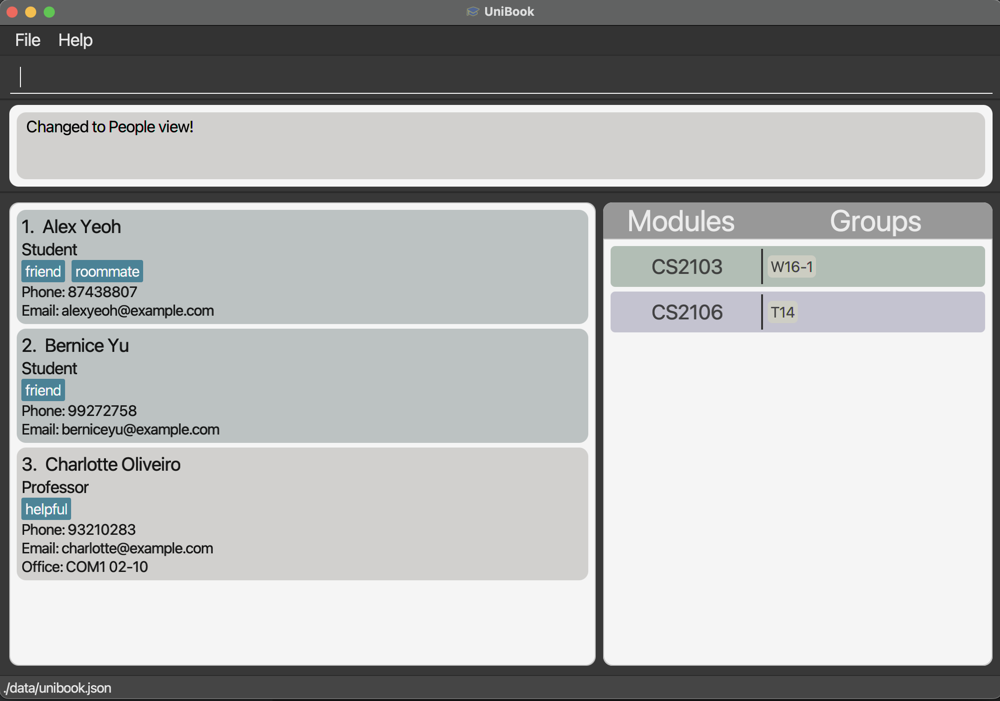
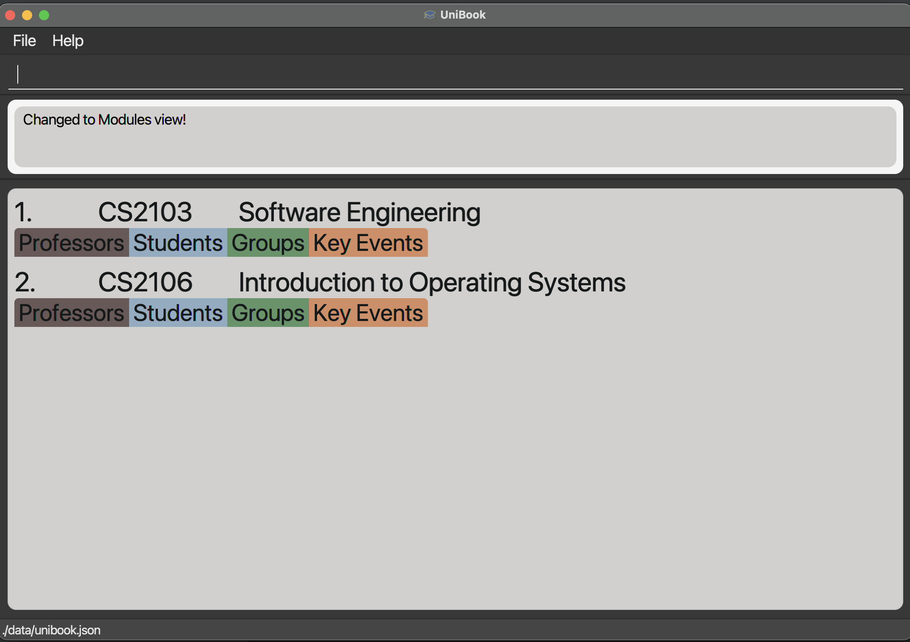
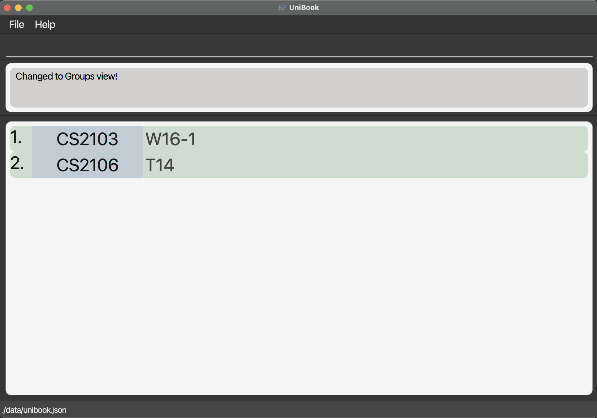

UniBook is a **desktop app for students to manage university contacts related to their studies in an organised manner,** optimized for command-line interface (CLI) while still having the benefits of a Graphical User Interface (GUI).  
* Table of Contents
{:toc}

--------------------------------------------------------------------------------------------------------------------

# Quick start

1. Ensure you have Java `11` or above installed in your Computer.

1. Download the latest `unibook.jar` from [here](https://github.com/AY2122S2-CS2103-W16-1/tp/releases).

1. Copy the file to the folder you want to use as the _home folder_ for UniBook.

1. Double-click the file to start the app. The GUI similar to the below should appear in a few seconds. Note how the app contains some sample data. 
   

1. Type the command in the command box and press Enter to execute it. e.g. typing **`help`** and pressing Enter will open the help window. 
   Some example commands you can try:

   * **`list`** : Lists all entries of a view.

   * **`add`**`o/student n/John Doe p/98765432 e/johnd@example.com` : Adds a student named `John Doe` to UniBook.

   * **`delete`**`3` : Deletes the 3rd contact shown in the current list of people.

   * **`edit`**`1 o/person p/91234567 e/prof@email.com` : Edits the 1st person's phone number and email shown in the current list of people.

   * **`clear`** : Deletes all information stored in UniBook. (be careful!)

   * **`exit`** : Exits the app.

1. Refer to [Commands](#commands) below for details of each command.

--------------------------------------------------------------------------------------------------------------------

# Main Function of UniBook
To store and provide easy viewing and management of 3 types of entities relating to a student's studies in University.
## Entities
Each type of entity has a variety of fields that store some information on the entity. These fields have varying constraints that are enforced by UniBook.

Constraint Types:
* _Number of entries_ : The minimum - maximum number of entries of a field in one entity. 
  * A number > 0 for minimum indicates the field is required to be filled.
  * \* for maximum indicates that there can be an unbounded number of instances of this field in one entity.
* _Acceptable Values_ : The acceptable characters for a field.
* _Length Constraint_ : The minimum - maximum length of a field. 
  * A number >0 for minimum means that if the field has been filled, then the value it was filled with cannot be blank.
  * \* for maximum means that the field is unbounded.
* _Unique Constraint_ : If the field must be unique among all other entities of its type.
  * :heavy_check_mark: - yes 
  * :x: - no
* _Additional Constraints_ : Any additional constraints on the field.

### Person - Student or Professor 

Represents a person in university. The person must be a student or a professor.

| Field | Description | Number of entries | Acceptable Values | Length Constraint | Unique Constraint | Additional Constraints | Example |
| ----- | ------ | ---- | ------ | -------- | :-------: | ----- | --- |
| Name | Person's name | 1 | Alphabets only | 1 - 50 characters | :x: |  | _John Doe_ |
| Phone | Person's phone number | 0 - 1 | Digits only | 7 - 15 digits | :heavy_check_mark: |  | _91234859_ |
| Email | Person's email address| 0 - 1 | [Email Format](#email-address-format) |  4 - 320 characters | :heavy_check_mark: |  | _johndoe@example.com_ |
| Office | Professor's office location in university campus | 0 - 1 | Any character except whitespaces | 1 - 20 characters | :x: | Only Professor has this field | _COM2-02-57_ |
| Tag |  A one word piece of information to attach to a person - similar to a hashtag on social media | 0 - * | Alphanumeric | 1 - 20 characters | :x: | Among the tags of a person, 1 specific tag can only appear once | _friend_ | 

### Module
Represents a university module.
Can have both Professors and Students associated with it.
* Association with Professor implies that the professor is involved in the teaching of the module.
* Association with student implies student is taking the module.

| Field | Description | Number of entries | Acceptable Values | Length Constraint | Unique Constraint | Additional Constraints | Example |  
| ----- | ------ | ---- | ------ | -------- | :-------: | ----- | --- |
|Code| Module code| 1 |Any character except whitespaces | 1 - 10 characters| :heavy_check_mark: | A module code is case insensitive, e.g. _cs2103_ and _CS2103_ are considered the same. The case stored in UniBook is the case of the first module entered with the given module code. Future additions of the same module code with different case will not be allowed. | _CS2103_ |
|Name| Name of the module | 1 | Alphanumeric with whitespaces| 1 - 50 characters | :x: | | _Software Engineering_ |
|Key Event| A key event of the module that is occurring at a specific time and date. Consists of two subfields, key event type and key event datetime.| 0 - * | **Key event type**:  4 possible values:  1. `exam` 2. `quiz`  3.`assignment_release` 4. `assignment_due`  **Key event datetime**: [Date-Time Format](#date-time-format)| Not relevant as acceptable values covers this | :x: | Duplicate key events of exact same type and datetime cannot exist within the same module.   Case of characters for key event type does not matter. e.g. `exam` and `EXAM`mean the same thing.| Key event type: _Exam_  Key event datetime: _2022-12-02 13:30_|

### Group
* Represents any kind of group related to a university module that a student is in - a study group, project group etc. 
* Can contain multiple students, implying they are members of the group.
* Is associated with a module, and cannot exist without being associated with a module. The reasoning for this is that UniBook is specially designed for managing contacts associated with a student's studies - hence only groups related to university modules are allowed.

| Field | Description | Number of entries | Acceptable Values | Length Constraint | Unique Constraint | Additional Constraints|Example |  
| ----- | ------ | ---- | ------ | -------- | :-------: | ----- | --- |
|Name| Name of the group | 1 | Any character | 1 - 50 | :heavy_check_mark:   Note: this is among the groups of a specific module. It is possible to have two groups with same name, but in different modules! | A group name is case insensitive, e.g. _t12_ and _T12_ are considered the same. The case stored in UniBook is the case of the first group entered with the given group name. Future additions of the same group name with different case will not be allowed. | _W16-1_|
|Meeting date & time| The date and time of a scheduled meeting of the group | 0 - * | [Date-Time Format](#date-time-format) | Not relevant as acceptable values covers this | :x: | Duplicates of a meeting time with a specific date and time cannot exist in a group | _2022-12-02 13:30_ |

# Graphical User Interface
## Main Function
1. Complement the CLI by providing the user an organised and aesthetically pleasing view of the information they wish to see (information which is determined through CLI commands).
2. Provide basic ease-of-use features to enhance the user experience. 

## Views 
The GUI consists of 3 main views that a user can navigate through - the _people view_, _modules view_ and _groups view_.

**Each view has its own variations of the basic command types.**
### People View
Displays all students and professors stored in UniBook, along with the module codes of each module and group names of each group stored in UniBook. This complements the CLI as a user is able to add a person to a module or group directly on this page using those displayed codes/names.

### Modules View
Displays all modules stored in UniBook, with all their individual details.

### Groups View 
Displays all the groups stored in UniBook, with all their individual details.

## Navigation
Navigation between views is done primarily with the `list` command, as UniBook is optimized as a CLI application.

**However, some basic intuitive features are available for quick navigation**:
  * On _people view_, click on a module code to enter the _module view_ displaying all the details of the module with the given module code.
  * On _people view_, click on a group name to enter the _group view_ displaying all the details of the group with the given group name.

## Other GUI features
  * On _modules view_ showing multiple modules, initially only the module code and name of each module is shown, to see the rest of the details of a module, just click the tab corresponding to the detail you wish to see. For example, to see all the students taking a module, just click the "Students" tab.
  * On _groups view_ showing multiple groups, initially only the module code of the module associated with each group and the group name will be displayed. To see the rest of the details of a group, just click the panel of the group.

# Commands

**:information_source: Notes about the command format:** 

* Words in `UPPER_CASE` are the parameters to be supplied by the user. 
  e.g. in `add n/NAME`, `NAME` is a parameter which can be used as `add n/John Doe`.

* Items in square brackets are optional. 
  e.g `n/NAME [t/TAG]` can be used as `n/John Doe t/friend` or as `n/John Doe`.

* Items with `…`​ after them can be used multiple times including zero times. 
  e.g. `[t/TAG]…​` can be used as ` ` (i.e. 0 times), `t/friend`, `t/friend t/family` etc.

* Parameters can be in any order. 
  e.g. if the command specifies `n/NAME p/PHONE_NUMBER`, `p/PHONE_NUMBER n/NAME` is also acceptable.

* If a parameter is expected only once in the command but you specified it multiple times, only the last occurrence of the parameter will be taken. 
  e.g. if you specify `p/12341234 p/56785678`, only `p/56785678` will be taken.

* Extraneous parameters for commands that do not take in parameters (such as `help`, `exit` and `clear`) will be ignored. 
  e.g. if the command specifies `help 123`, it will be interpreted as `help`.

## Viewing help : `help`

Shows a message explaining how to access the help page.

Format: `help`

## Adding an entry: `add`

Adds a module/group/student/professor/event/meeting to the UniBook depending on the value defined in `o/OPTION`.

### On Any View:  

#### :bulb: Add a module  

Format: `add o/module n/MODULENAME m/MODULECODE [ke/KEYEVENTTYPE dt/DATETIME]…​`  
* This adds a Module to the UniBook. User can also add key events of the module.  
* The event types are as follows:  
`1` - Exam  
`2` - Quiz  
`3` - Assignment Release  
`4` - Assignment Due  
* The accepted format of `dt/DATETIME` is `yyyy-MM-dd HH:mm`.  
* The format of `ke/KEYEVENTTYPE dt/DATETIME` **must be strictly followed**. Otherwise, the datetime will be parsed as part of the other fields, depending on which prefix was entered before it.
* Duplicate Module Codes are **not allowed**, however duplicate Module Names are allowed as modules may have same names.
* Example: `add o/module n/Computer Organisation m/CS2100 ke/1 dt/2022-05-04 13:00`  
* Adds a module "Computer Organisation" with module code CS2100 to the UniBook. The module will have a key event of type "Exam" on the datetime specified.

#### :bulb: Add a group

Format: `add o/group n/GROUPNAME m/MODULECODE [dt/DATETIME]…​`
* This adds a Group to the Module specified.  
* `dt/DATETIME` represents meeting times of the group, and it takes in the format `yyyy-MM-dd HH:mm`.
* The module specified **must** exist in the UniBook, otherwise add the module first.
* Example: `add o/group n/Project Work m/CS2100 dt/2022-05-01 13:00 dt/2022-05-04 15:00`  
* Adds a group named "Project Work" to module "CS2100". This group will have the specified meeting times.

#### :bulb: Add a student

Format: `add o/student n/NAME [p/PHONE_NUMBER] [e/EMAIL] [t/TAG]…​ [m/MODULECODE [g/GROUPNAME]…​]…​`
* This adds a Student to the UniBook.  
* Duplicate names are allowed, but duplicate phone numbers and emails are not.
* The student can have any number of tags and modules including 0.
* The student can also belong to any number of groups within the module including 0.
* Note that in order to add a student to a group of the specified module, the format of `m/MODULECODE [g/GROUPNAME]…​` must be **strictly followed**.  
* The module and group specified **must** exist in the UniBook, otherwise add the module and group first!
* Example: `add o/student n/Johnston p/98765432 e/johnston@gmail.com t/friend m/CS2100 g/Project Work m/CS2103`  
* Adds a student named Johnston to the UniBook. The student will be added to the group "Project Work" in Module "CS1231S".

#### :bulb: Add a professor

Format: `add o/professor n/NAME [p/PHONE_NUMBER] [e/EMAIL] [of/OFFICE] [t/TAG]…​ [m/MODULECODE]…​`
* This adds a Professor to the UniBook.
* Duplicate names are **allowed**, but duplicate phone numbers and emails are **not allowed**.
* Professors can have **any number** of tags and modules including 0.
* The module specified **must** exist in the UniBook, otherwise add the module first.
* Example: `add o/professor n/Aaron Tan p/98723432 e/aarontan@gmail.com of/COM2 01-15 t/smart m/CS2100`  
* Adds a professor named Aaron Tan to the UniBook.

#### :bulb: Add an event

Format: `add o/event m/MODULECODE ke/KEYEVENTTYPE dt/DATETIME`
* This adds a key event of the respective type and datetime to the module specified.  
* The event types are as follows:  
`1` - Exam  
`2` - Quiz  
`3` - Assignment Release  
`4` - Assignment Due  
* The accepted format of `dt/DATETIME` is `yyyy-MM-dd HH:mm`.  
* Different event types with same datetimes are **allowed**, but same event types with the same datetimes are **not allowed** within the same module.
* Example: `add o/event m/CS2100 ke/2 dt/2022-05-04 13:00`  
* Adds an event of the specified type and datetime to module "CS2100".

#### :bulb: Add a meeting

Format: `add o/meeting m/MODULECODE g/GROUPNAME dt/DATETIME…​`  
* This adds meetings to the specified group belonging to the specified module. Multiple `dt/DATETIME` can be entered to add multiple meetings.  
* The accepted format of `dt/DATETIME` is `yyyy-MM-dd HH:mm`.  
* Duplicate meeting times are **not allowed** within the same group.
* Example: `add o/meeting m/CS2103 g/W16-1 dt/2022-04-24 13:00 dt/2022-04-30 15:00 dt/2022-05-04 11:00`  
* Add meetings of the specified datetimes to module "CS2103".

## Listing entries: `list`

Lists entries in UniBook according to a specified listing criteria. Behaves differently depending
on currently active view.

### On Any View:

#### :bulb: List everything

Format: `list`

* Lists all the `people`, `module` or `group` entries depending on the current active view.

#### :bulb: Change View

Format: `list o/view v/VIEWTYPE`

* Changes the view of the `UniBook` to the specified view type. Available arguments for 
`VIEWTYPE` are `people`/`groups`/`modules`.
* Example: `list o/view v/modules` switches the `UniBook` to the `modules` view.  

### On People View:

#### :bulb: List people of a specific type
Format: `list type/PERSONTYPE`

* Lists all people of a specific type. Available arguments for `PERSONTYPE` are `students`/`professors`.
* Example: `list type/professors` lists every `Professor` in the `UniBook`.

#### :bulb: List people in a specific module
Format: `list o/module m/MODULECODE`

* Lists all people in a given `Module`.
* Example: `list o/module m/CS2103` displays all people who are in the module `CS2103`.

#### :bulb: List people in a specific module of a specific type
Format: `list o/module m/MODULECODE type/PERSONTYPE`

* Lists all people in a given `Module` who are of a specific type.
* Example: `list o/module m/cs2103 type/students` lists all `students` who are in the module `CS2103`.

#### :bulb: List people in a specific group of a specific module
Format: `list o/group m/MODULECODE g/GROUPNAME`

* Lists all students who are in a given `Group` of a given `Module`.
* Example: `list o/group m/CS2103 g/W16-1` lists all students in group `W16-1` of module `CS2103`.

### On Modules view:

#### :bulb: List a module with a specific code
Format: `list m/MODULECODE`

- Lists a module with a given module code.
- Example: `list m/CS2103` lists the module `CS2103`.

#### :bulb: List a module with a name containing a keyword
Format: `list n/KEYWORD`

- Lists modules which have module names containing the given keyword.
- Example: `list n/Software` will display all modules that contain `Software` in their module name.

#### :bulb: List a module with a specific type of key event
Format: `list ke/KEYEVENT`

- Lists modules which has a specific type of key event. Acceptable arguments for `KEYEVENT` are 
  `EXAM/QUIZ/ASSIGNMENT_DUE/ASSIGNMENT_RELEASE`.
- Example: `list ke/EXAM` will display all modules that have key event(s) of type `EXAM`.

#### :bulb: List a module with key event(s) falling on a specific date
Format: `list dt/YYYY-MM-DD`

- Lists modules which has any type of key event(s) falling on a given date.
- Example: `list dt/2022-05-04` displays all modules with any key event(s) falling on `May 4th 2022`.

#### :bulb: List a module with a specific type of key event(s) falling on a specific date
Format: `list dt/YYYY-MM-DD ke/KEYEVENT`

- Lists all modules which has a specific type of key event falling on a given date. Acceptable arguments for `KEYEVENT` are
  `EXAM/QUIZ/ASSIGNMENT_DUE/ASSIGNMENT_RELEASE`.
- Example: `list dt/2022-05-04 ke/QUIZ` displays all modules with key event(s) `Quiz` falling on `May 4th 2022`.

#### :bulb: List a module with a name matching a keyword with key event(s) on a given date
Format: `list dt/YYYY-MM-DD n/KEYWORD`

- Lists all modules which have a module name containing a given name and any type of key event(s) 
  falling on a given date.
- Example: `list dt/2022-05-04 n/Network` displays all modules that have `Network` in their module name and
have key events falling on `May 4th 2022`.

#### :bulb: List a module with a name matching a keyword with a specific type of key event(s)

Format: `list n/KEYWORD ke/KEYEVENT`
- Lists all modules which has a module containing a given name and a specific type of key event.
  Acceptable arguments for `KEYEVENT` are
  `EXAM/QUIZ/ASSIGNMENT_DUE/ASSIGNMENT_RELEASE`.
- Example: `list n/Software ke/ASSIGNMENT_DUE` displays all modules that have `Software` in their module name and
have key event(s) of type `ASSIGNMENT_DUE`.
  
#### :bulb: List a module with a name matching a keyword with a specific type of key event on a given date
Format: `list n/KEYWORD ke/KEYEVENT dt/YYYY-MM-DD`
- Lists all modules which has a module containing a given name and a specific type of key event falling
on a given date. Acceptable arguments for `KEYEVENT` are `EXAM/QUIZ/ASSIGNMENT_DUE/ASSIGNMENT_RELEASE`.
- Example: `list n/Software ke/ASSIGNMENT_DUE dt/2022-05-04` displays all modules that have `Software` 
  in their module name and have key event(s) of type `ASSIGNMENT_DUE` which fall on `May 4th 2022`.
  
#### :bulb: List groups with specific group name (module page)
Format: `list o/group g/GROUPNAME`
- If the module list currently has `1` module showing, UniBook switches to `Groups` view automatically and displays
the specific group with the given group name, from the given module.
- Otherwise, UniBook switches to `Groups` view automatically and displays all groups with the given name.
- Example: Assume module `CS2103` along with multiple other modules have a group with group name `W16-1`. 
  When the command `list o/group g/W16-1` is run, if only `CS2103` was visible then the specific `W16-1` in `CS2103` 
  is displayed in the group view. Otherwise, all groups with name `W16-1` from all modules are displayed.

### On Groups view:

#### :bulb: List groups with specific group name (group page)
Format: `list g/GROUPNAME`
- Lists all groups with a given group name.
- Example: `list g/W16-1` lists all groups with the name `W16-1`.

#### :bulb: List group(s) with specific group name and module code
Format: `list g/GROUPNAME m/MODULECODE`
- Lists all groups with a given group name in a specific module.
- Example: `list g/W16-1 m/CS2103` lists group `W16-1` of `CS2103`.

#### :bulb: List group(s) with specific meeting date
Format: `list mt/YYYY-MM-DD`
- Lists all groups with a meeting times falling on a given date.
- Example: `list mt/2022-05-04` lists all groups that have meetings on `May 4th 2022`.

## Editing a person : `edit`

Edits an existing person in UniBook.

General Format: `edit INDEX o/OPTION [m/MODULE] [n/NAME] [p/PHONE] [e/EMAIL] [of/OFFICE] [t/TAG] [nm/NEWMODULE] [g/GROUP] [mt/INDEX DATETIME] [ke/KEYEVENT] [dt/DATETIME]`
* Fields required differs based on the `o/OPTION` chosen. 

* Edits the entity type defined by `o/OPTION`. This is a compulsory field.
  * Options available are person, module, keyevent or group.
* All indexes must be positive integers.
* `INDEX` refers to the index of the person / module / group / key event listed on the viewing page.
* Existing values will be updated to the input values.    
* Before choosing to edit module or person, user can see which `INDEX` to edit by changing the UI to show the relevant list. User will not be allowed to edit if not on the correct page. 
  * `list o/view v/modules` : To display list of modules with respective indexes
  * `list o/view v/people` : To display list of persons with respective indexes 
  * `list o/view v/groups` : To display list of groups with respective indexes 
* Only certain options can be edited on each page, otherwise an error will be printed on the console to tell users to change to the correct page. On the
  * `module` page: Able to edit module, keyevent or group fields
  * `group`  page: Able to edit keyevent or group fields
  * `person` page: Able to edit person

### On People view:

At least one optional field must be edited in order for person to be successfully edited.

#### :bulb: Edit person's name, phone, email, office and/or tag.
Format: `edit INDEX o/person [n/NAME] [p/PHONE] [e/EMAIL] [of/OFFICE] [t/TAG]`
* The `office` field can only be edited if the person is a professor.
* Editing a tag overrides all previous tags and user only able to edit tags 1 word at a time. 
  * E.g. `edit 1 o/person t/helpful t/friend` edits the tag of the first person on the list to helpful and friend.
* Example: `edit 1 o/person n/Alexa` changes the name of the first person on the list to Alexa.

#### :bulb: Add person to a specific group in the module.
Format: `edit INDEX o/person [m/MODULE] [g/GROUPNAME]`
* Both `[m/MODULE]` and `[g/GROUPNAME]` fields are compulsory for successful edit.
* Example: `edit 1 o/person m/CS2103 g/T2` adds the first person to the `group` named T2 in the CS2103 `module`.

#### :bulb: Add person to a new module. 
Format: `edit INDEX o/person [nm/NEWMOD]`
* Example: `edit 1 o/person nm/CS2103` adds the first person to the CS2103 `module`.

### On Modules view:

At least one optional field must be edited in order for module to be successfully edited.

#### :bulb: Edit module's name and/or module code.
Format: `edit INDEX o/module [n/NAME] [m/MODCODE]`
* Edits the `name` and/or `modcode` fields of a module at `INDEX`.
* Example: `edit 1 o/module n/Software Engineering m/CS2103` changes the name and module code of the first module on the list to Software Engineering and CS2103 respectively.

#### :bulb: Edit group's group name and/or meeting times.
Format: `edit INDEX o/group m/MODULE [g/GROUPNAME] [mt/INDEX DATETIME]`
* `DATETIME` must be in `YYYY-MM-DD HH:mm` format.  
* Example: `edit 1 o/group m/CS2103 g/T2 mt/2 2020-12-12 16:45` edits the first group's name and second index of meeting time of the CS2103 `module` to T2 and 12th December 2022 4:45pm respectively.

#### :bulb: Edit key event of module's type and/or date time.
Format: `edit INDEX o/keyevent ke/INDEX [type/TYPE] [dt/DATETIME]`
* Example: `edit 1 o/keyevent ke/2 type/exam dt/2020-12-12 16:45` adds the second key event's type and date time in the first module in the list to exam and 12th December 2022 4:45pm respectively. 

### On Groups view:

At least one optional field must be edited in order for module to be successfully edited.

#### :bulb: Edit group's group name and/or meeting times.
* Format: `edit INDEX o/group m/MODULE [g/GROUPNAME] [mt/INDEX DATETIME]`
* Edits the `groupname` and/or `meetingtimes` of the group at `INDEX` of the `module`.
* `DATETIME` must be in `YYYY-MM-DD HH:mm` format.
* Example: `edit 1 o/group m/CS2103 g/T2 mt/2 2020-12-12 16:45` edits the first group's name and second index of meeting time of the CS2103 `module` to T2 and 12th December 2022 4:45pm respectively.

## Locating persons by name: `find`

Finds a person stored in UniBook by the given keyword. **Only works on people view.**

### On People View:

#### :bulb: Find person(s) whose name(s) contain any of the given keywords
Format: `find KEYWORD [MORE_KEYWORDS]`

* The search is case-insensitive. e.g. `hans` will match `Hans`
* The order of the keywords does not matter. e.g. `Hans Bo` will match `Bo Hans`
* Only the name is searched.
* Only full words will be matched e.g. `Han` will not match `Hans`
* Persons matching at least one keyword will be returned (i.e. `OR` search).
  e.g. `Hans Bo` will return `Hans Gruber`, `Bo Yang`

Examples:
* `find John` returns `john` and `John Doe`
* `find alex` returns `Alex Yeoh`, `Alex Teo` 
  

## Deleting specific entries : `delete`

Removes the specified modules, module subgroup, student or professor profile from the system.

(Note: Commands under the sub header Person view can only be used on person page, and likewise for other view)

### On Any View:

#### :bulb: Delete module by module code
Format: `delete o/module m/[MODULECODE]`
* Deletes the module with the specified `MODULECODE`.
* The module must already exist in the system.
* Not case-sensitive.
* For example, `delete o/module m/CS2103` removes the module with module code CS2103

#### :bulb: Delete group by module code and group name
Format: `delete o/group m/[MODULECODE] g/[GROUPNAME]`
* Deletes the group specified by `GROUPNAME`, within the module specified by `MODULECODE`.
* Both the module and the subgroup must already exist in the system.
* Module code and Group is not case-sensitive.
* For example, `delete o/group m/CS2107 g/T04` removes the T04 subgroup from the CS2107 module.

### On People View:

#### :bulb: Delete a person by index
Format: `delete [INDEX]`
* Deletes the person at that index
* The GUI will display the index before the person

#### :bulb: Delete information from person
Format: `delete [INDEX] p/ e/ t/[TAG] of/`
* p/, e/, t/[TAG], of/ can be entered in any combination, for example, to delete only phone and email, the user can put `p/` and `e/`
* At least 1 of {`p/`, `e/`, `t/[TAG]`, `of/`} must be entered, otherwise the `delete [INDEX]` command will be executed instead
* Only 0 or 1 of each tag must be provided
* `[TAG]` is not case-sensitive.

### On Module View:

#### :bulb: Delete a module by index
Format: `delete [INDEX]`
* Deletes the module at that index
* The GUI will display the index before the module

For the following commands, if more than 1 of the following tags are provided, the priority will be in this order. For example, if `prof/1` and `stu/1` is both provided, `delete 1 prof/1` will be prioritised because `prof/` is higher than `stu/` on this list.

#### :bulb: Remove a professor from a module by index
Format: `delete [INDEX] prof/[INDEX]`
* Delete professor from module (The original person is not deleted, only removed from the module)
* The first index represents the index for which module to remove a professor from
* The second index (after prof/) represents the index for which professor to remove
* For example, `delete 2 prof/1` would delete the professor at index 1 from the module at index 2

#### :bulb: Remove a student from a module by index
Format: `delete [INDEX] stu/[INDEX]`
* Same as the above command, but index after stu/ represents the student list index to be deleted

#### :bulb: Delete a group from a module by index
Format: `delete [INDEX] g/[GROUPNAME]`
* same as the above command, but group name has to be specified to delete the group with that name
* `GROUPNAME` is not case-sensitive. 

#### :bulb: Delete a key event from a module by index
Format: `delete [INDEX] ke/[INDEX]`
* same as the above command, but index after ke/ represents the key event index to be deleted

### On Group view:

#### :bulb: Delete group by index
Format: `delete [INDEX]`
* Deletes the group at that index
* The GUI will display the index before the group

For the following commands, if more than 1 of the following tags are provided, the priority will be in this order. For example, if `mt/1` and `stu/1` is both provided, `delete 1 stu/1` will be prioritised because `stu/` is higher than `mt/` on this list.

#### :bulb: Remove student from group by index
Format: `delete [INDEX] stu/[INDEX]`
* Delete student from group
* The first index represents the index for which group to remove the student from
* The second index (after stu/) represents the index for which student to delete
* For example, `delete 2 stu/1` would delete the student at index 1 for the group at index 2

#### :bulb: Delete meeting time from group by index
Format: `delete [INDEX] mt/[INDEX]`
* Delete meeting time from group
* The first index represents the index for which group to remove the meeting time for
* The second index (after mt/) represents the index for which meeting time to delete
* For example, `delete 2 mt/1` would delete the meeting time at index 1 for the group at index 2

## Clearing all entries : `clear`

Clears all entries from UniBook.

Format: `clear`

## Exiting the program : `exit`

Exits the program.

Format: `exit`

## Saving the data

UniBook data are saved in the hard disk automatically after any command that changes the data. There is no need to save manually.

## Editing the data file

UniBook data are saved as a JSON file `[JAR file location]/data/unibook.json`. Advanced users are welcome to update data directly by editing that data file.  

:exclamation: **Caution:**
If your changes to the data file makes its format invalid, UniBook will discard all data and start with an empty data file at the next run.

The data file format can be made invalid if:
* A duplicate field is added that UniBook does not allow duplicates of. Example: Duplicate group code in the list of group codes of a `Student`.
* Illegal values are entered into fields. 
  * Illegal meaning they violate one or more constraints defined here: [link](#entities)

--------------------------------------------------------------------------------------------------------------------

# FAQ

**Q**: How do I transfer my data to another Computer? 
**A**: Install the app in the other computer and overwrite the empty data file it creates with the file that contains the data of your previous UniBook home folder.

--------------------------------------------------------------------------------------------------------------------

# Command summary

Action | Format
--------|------------------
**Add** | **Any View**   `add o/module n/MODULENAME m/MODULECODE [ke/KEYEVENTTYPE dt/DATETIME]…​`[(example)](#bulb-add-a-module)   `add o/group n/GROUPNAME m/MODULECODE [dt/DATETIME]…​`[(example)](#bulb-add-a-group)   `add o/student n/NAME [p/PHONE_NUMBER] [e/EMAIL] [t/TAG]…​ [m/MODULECODE [g/GROUPNAME]]…​`[(example)](#bulb-add-a-student)   `add o/professor n/NAME [p/PHONE_NUMBER] [e/EMAIL] [of/OFFICE] [t/TAG]…​ [m/MODULECODE]…​`[(example)](#bulb-add-a-professor)   `add o/event m/MODULECODE ke/KEYEVENTTYPE dt/DATETIME`[(example)](#bulb-add-an-event)   `add o/meeting m/MODULECODE g/GROUPNAME dt/DATETIME…​`[(example)](#bulb-add-a-meeting)
**Clear** | `clear`
**Edit** |  **People View**   `edit INDEX o/PERSON [n/NAME] [p/PHONE] [e/EMAIL] [of/OFFICE] [nm/NEWMODULE] [g/GROUP] [m/MODULE] [t/TAG]`[(example)](#bulb-edit-persons-name-phone-email-office-andor-tag)    **Modules View:**   `edit INDEX o/module [n/NAME] [m/MODCODE]`[(example)](#bulb-edit-modules-name-andor-module-code)  `edit INDEX o/group m/MODULE [g/GROUPNAME] [mt/INDEX DATETIME]`[(example)](#bulb-edit-groups-group-name-andor-meeting-times)   `edit INDEX o/keyevent ke/INDEX [type/TYPE] [dt/DATETIME]`[(example)](#bulb-edit-key-event-of-modules-type-andor-date-time)    **Group View:** `edit INDEX o/group m/MODULE [g/GROUPNAME] [mt/INDEX DATETIME]`[(example)](#bulb-edit-groups-group-name-andor-meeting-times)  
**Delete** | **Any View**   `delete o/module m/[MODULECODE]`[(example)](#bulb-delete-module-by-module-code)  `delete o/group m/[MODULECODE] g/[GROUPNAME]`[(example)](#bulb-delete-group-by-module-code-and-group-name)   **People View:**   `delete [INDEX]`[(example)](#bulb-delete-a-person-by-index)  `delete [INDEX] p/ e/ t/[TAG] of/`[(example)](#bulb-delete-information-from-person)    **Modules View:** `delete [INDEX]`[(example)](#bulb-delete-a-module-by-index)   `delete [INDEX] prof/[INDEX]`[(example)](#bulb-remove-a-professor-from-a-module-by-index)  `delete [INDEX] stu/[INDEX]`[(example)](#bulb-remove-a-student-from-a-module-by-index)  `delete [INDEX] g/[GROUPNAME]`[(example)](#bulb-delete-a-group-from-a-module-by-index)   `delete [INDEX] ke/[INDEX]`[(example)](#bulb-delete-a-key-event-from-a-module-by-index)    **Groups View**:  `delete [INDEX]`[(example)](#bulb-delete-group-by-index)  `delete [INDEX] stu/[INDEX]`[(example)](#bulb-remove-student-from-group-by-index)   `delete [INDEX] mt/[INDEX]`[(example)](#bulb-delete-meeting-time-from-group-by-index)   
**Find** | **People View**   `find KEYWORD [MORE_KEYWORDS]`  e.g., `find James Jake`[(example)](#bulb-find-person-whose-name-contain-any-of-the-given-keywords)
**List** | **Any View**:  `list` [(example)](#bulb-list-everything)   `list o/view v/VIEWTYPE` [(example)](#bulb-change-view)   **People View:**   `list type/PERSONTYPE` [(example)](#bulb-list-people-of-a-specific-type)   `list o/module m/MODULECODE [type/PERSONTYPE]` [(example)](#bulb-list-people-in-a-specific-module)   `list o/group m/MODULECODE g/GROUPNAME` [(example)](#bulb-list-people-in-a-specific-group-of-a-specific-module)    **Modules View:**   `list m/MODULECODE` [(example)](#bulb-list-a-module-with-a-specific-code)   `list [n/KEYWORD] [ke/KEYEVENT] [dt/YYYY-MM-DD]` [(example)](#bulb-list-a-module-with-a-name-containing-a-keyword)    `list o/group g/GROUPNAME` [(example)](#bulb-list-groups-with-specific-group-name-module-page)    **Groups View:**  `list g/GROUPNAME [m/MODULECODE]` [(example)](#bulb-list-groups-with-specific-group-name-group-page)   `list mt/YYYY-MM-DD` [(example)](#bulb-list-groups-with-specific-meeting-date)
**Help** | `help`

# Appendix

## Special Formats

These are various fields that have special formats to be followed.

### Email address format

* Format: `local-part@domain`
* The local-part should only contain alphanumeric characters and these special characters, excluding the parentheses, (+_.-). The local-part may not start or end with any special characters. 
* This is followed by a '@' and then a domain name. The domain name is made up of domain labels separated by periods.
   The domain name must:
    - end with a domain label at least 2 characters long
    - have each domain label start and end with alphanumeric characters
    - have each domain label consist of alphanumeric characters, separated only by hyphens, if any.

### Date-Time Format

* Date and time must be entered into UniBook in the following format : `YYYY-MM-DD HH-MM`, e.g. `2022-12-02 13:30`
    * `YYYY` is the year, e.g. `2022`
    * `MM` is the month, e.g. `12`
    * `DD` is the day, e.g. `02`
    * `HH` is the hour in 24H format, e.g. `13`
    * `MM` is the minute, e.g. `30`
* When displayed in UniBook, a date and time is shown in the format _Day Month Year, HH:MM:SS AM/PM_, e.g. _4 May 2022, 2:00:00PM_
  * Time is in 12H format for convenience.

[#]: #bulb
