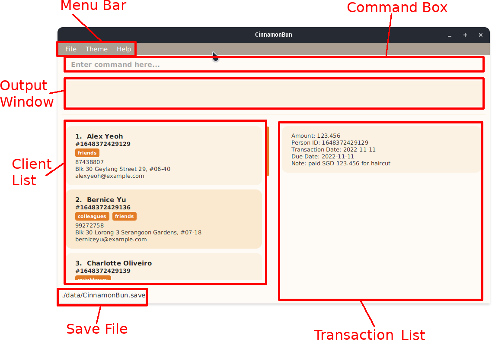
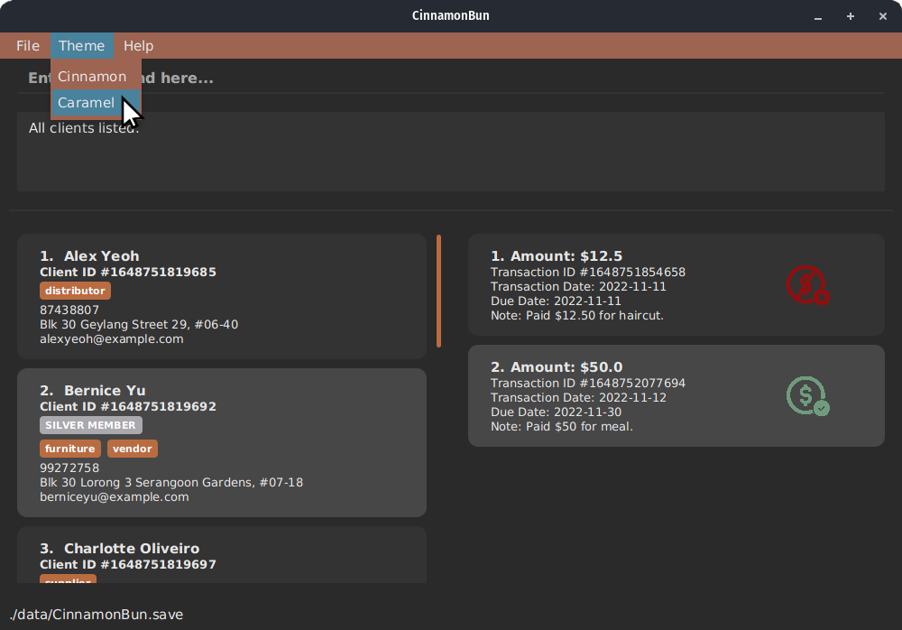

CinnamonBun is a **desktop app for managing client information, optimized for use via a Command Line Interface** (CLI) while still having the benefits of a Graphical User Interface (GUI).

* Table of Contents
{:toc}

---

## CinnamonBun - As good as it sounds.

Are you a small business owner or freelancer? Want an easy way to store your client's information, but there's no free and easy solution available?
No worries, CinnamonBun has got you covered! CinnamonBun enables you to keep track of your clients and their transaction records.

As a Command-line Interface (CLI) app, you'll never have to move your hands away from the keyboard to get all your tasks done.
If you can type fast, the CLI will allow you to execute your tasks quickly. While this may be daunting for a new user, it only takes a short time to get accustomed to CinnamonBun.

This guide aims to be the one-stop shop to get you from noob to expert in record speed.

---

## Quick Start

1. Ensure you have Java `11` or above installed in your Computer.

2. Download the latest `CinnamonBun.jar` from [here](https://github.com/AY2122S2-CS2103T-W09-2/tp/releases).

3. Copy the file to the folder you want to use as the _home folder_ for CinnamonBun.

4. Double-click the file to start the app. The GUI similar to the below should appear in a few seconds. Note how the app contains some sample data. 
   

5. Type the command in the command box and press `Enter` to execute it. For example, typing **`help`** and pressing Enter will open the help window.  
   Some example commands you can try:
   * `list`: Lists all clients.
   * `add n/John Doe p/98765432 e/johnd@example.com a/John street, block 123, #01-01`: Adds a client named `John Doe` to CinnamonBun.
   * `delete 3`: Deletes the 3rd client shown in the current list.
   * `clear`: Deletes all client records.
   * `undo`: Undo the last executed command.
   * `exit`: Exits the app.  

7. Refer to the [Commands](#Commands) below for details of each command.

---

## Graphical User Interface (GUI) Overview

---

## Commands

### Command Syntax

Commands in CinnamonBun can be broken down into several components.

`COMMAND_WORD PREAMBLE PREFIX/ARGUMENT...`

| Component      | Description                                                                                                                          |
|----------------|--------------------------------------------------------------------------------------------------------------------------------------|
 | `COMMAND_WORD` | Trigger for the command to be executed.                                                                                              |
 | `PREAMBLE`     | Text before the first valid parameter prefix in the command. Certain commands may require a preamble.                                | 
| `PREFIX`       | Commands may have one more or arguments. The prefix specifies which arguments to map to the parameters. All prefixes end with a `/`. |
 | `ARGUMENT`     | The argument to pass to the command.                                                                                                 |

:bangbang: **Attention**

* Commands and their arguments are case-sensitive
* Parameters can be in any order. 
  e.g. if the command specifies `n/NAME p/PHONE_NUMBER`, `p/PHONE_NUMBER n/NAME` is also acceptable.
* If a parameter is expected only once in the command but is specified multiple times, only the last occurrence of the parameter will be taken. 
  e.g. if you specify `p/12341234 p/56785678`, only `p/56785678` will be taken.
* Extraneous parameters for commands that do not take in parameters (such as `help`, `list`, `exit` and `clear`) will be ignored. 
  e.g. if the command specifies `help 123`, it will be interpreted as `help`.

### User Guide Syntax

* Words in `UPPER_CASE` are the arguments to be supplied by the user. 
  e.g. in `add n/NAME`, `NAME` is an argument which can be used as `add n/John Doe`.

* Items in square brackets are optional. 
  e.g `n/NAME [t/TAG]` can be used as `n/John Doe t/friend` or as `n/John Doe`.

* Items with `…`​ after them can be used zero or more times. 
  e.g. `[t/TAG]…​` can be used as ` ` (i.e. 0 times), `t/friend`, `t/friend t/family t/colleague` etc.

### Fields & Tags

A client can have many fields & tags, including both optional and compulsory ones.

| Field    | Prefix   | Constraints                                                                                                                                | Compulsory         | Example                                   |
|----------|----------|--------------------------------------------------------------------------------------------------------------------------------------------|--------------------|-------------------------------------------|
| Name     | `n/`     | Alphanumeric and spaces only.                                                                                                              | :heavy_check_mark: | `n/Regina Lee`                            |
| Email    | `e/`     | Must be in *username@domain.suffix* format and unique to each client.   Alphanumeric and special characters, *+_.-* only.          | :heavy_check_mark: | `n/lovelee@mailinator.com`                |
| Phone    | `p/`     | Minimum 3 numeric characters.                                                                                                              | :heavy_check_mark: | `p/81312224`                              |
| Address  | `a/`     | No constraints.                                                                                                                            | :heavy_check_mark: | `a/123 Sesame Street`                     |
| Birthday | `b/`     | Must be in *YYYY-MM-DD* format and a valid date.                                                                                           |                    | `b/2022-03-12`                            |
| Remark   | `r/`     | No constraints.                                                                                                                            |                    | `r/Foreman of Project Zero Dawn.`         |       
| Tags     | `t/`     | Alphanumeric only.   No spaces allowed.   Multiple tags are allowed per client.                                            |                    | `t/Frequentclient t/AppointmentOverdue`   | 

### Command Summary

| Action                                                        | Format, Examples                                                                                                                                                      |
|---------------------------------------------------------------|-----------------------------------------------------------------------------------------------------------------------------------------------------------------------|
| [Help](#getting-help-help)                                    | `help`                                                                                                                                                                |
| [Add](#add-client-add)                                        | `add n/NAME p/PHONE_NUMBER e/EMAIL a/ADDRESS [t/TAG]…​`   e.g., `add n/James Ho p/22224444 e/jamesho@example.com a/123, Clementi Rd, 1234665 t/friend t/colleague` |
| [Edit](#edit-client-edit)                                     | `edit INDEX [n/NAME] [p/PHONE_NUMBER] [e/EMAIL] [a/ADDRESS] [r/remark] [t/TAG]…​`  e.g.,`edit 2 n/James Lee e/jameslee@example.com`                                |
| [Remark](#append-remark-to-client-remark)                     | `remark INDEX r/REMARK`  e.g., `remark 5 r/Needs marble flooring delivered by next Tuesday.`                                                                       |
| [Append](#append-fields-to-client-append)                     | `append INDEX r/REMARK b/BIRTHDAY e/wolololol@aoe.net t/senior`                                                                                                       |
| [Remove](#remove-fields-from-client-remove)                   | `remove INDEX r/ b/`                                                                                                                                                  |
| [Delete](#delete-client-delete)                               | `delete INDEX`  e.g., `delete 3`                                                                                                                                   |
| [Clear](#delete-all-entries-clear)                            | `clear`                                                                                                                                                               |
| [List](#list-all-clients-list)                                | `list`                                                                                                                                                                |
| [Sort](#sort-client-list-sort)                                | `sort [n/] [desc] [p/] [desc] [e/] [desc] [a/] [desc] [r/] [desc] [b/] [desc]`   e.g., `sort n/ desc p/`, `sort b/ a/`                                             |
| [Find](#find-client-by-keyword-find)                          | `find KEYWORD [MORE_KEYWORDS]`  e.g., `find James Jake`                                                                                                            | 
| [Delete Filtered](#delete-filtered-clients-deletefiltered)    | `deleteFiltered`                                                                                                                                                      |
| [Undo](#undo-last-command-undo)                               | `undo`                                                                                                                                                                |
| [Add Transaction](#add-transaction-addtransaction)            | `addTransaction INDEX a/AMOUNT td/TRANSACTION_DATE [dd/DUE_DATE] [n/NOTE]`                                                                                            |
| [List Transaction](#list-all-transactions-listtransaction)    | `listTransaction`                                                                                                                                                     |
| [Find Transaction](#find-clients-transaction-findtransaction) | `findTransaction INDEX`                                                                                                                                               |
| [Delete Transaction](#delete-transaction-deletetransaction)   | `deleteTransaction INDEX_TRANSACTION`                                                                                                                                 |
 | [Add Membership](#add-membership-addmembership)               | `addMembership INDEX m/MEMBERSHIP_NAME [d/DATE]`                                                                                                                      |
 | [Exit](#exit-program-exit)                                    | `exit`                                                                                                                                                                |

### Getting Help (`help`)

Opens a window that includes a link to this user guide.

Format: `help`

### Add Client (`add`)

Adds a client to CinnamonBun.

Format: `add n/NAME p/PHONE_NUMBER e/EMAIL a/ADDRESS [t/TAG]…​`

Examples:
* `add n/Andy Lau p/98765432 e/andy_lau@example.com a/Pasir Ris Grove, Block 73, #02-38, Singapore 518206`
* `add n/Betsy Crowe t/friend e/betsycrowe@example.com a/Newgate Prison p/1234567 t/criminal`

### Edit Client (`edit`)

Edits an existing client in CinnamonBun.

Format: `edit INDEX [n/NAME] [p/PHONE] [e/EMAIL] [a/ADDRESS] [r/REMARK] [b/BIRTHDAY] [t/TAG]…​`

:information_source: **Info**

* Edits the client at the specified `INDEX`. The index refers to the index number shown in the displayed client list. The index **must be a positive integer** 1, 2, 3, …​
* At least one of the optional fields must be provided.
* Existing values will be updated to the input values.
    * Note: Editing email value to an existing email in the addressBook is not allowed.
* When editing tags, the existing tags of the client will be removed i.e. adding of tags is not cumulative.
* You can remove all the client’s tags by typing `t/` without
  specifying any tags after it.
* You can also remove a client's remarks by typing `r/` without anything else.

Examples:
*  `edit 1 p/91234567 e/johndoe@example.com` Edits the phone number and email address of the 1st client to be `91234567` and `johndoe@example.com` respectively.
*  `edit 2 n/Betsy Crower t/` Edits the name of the 2nd client to be `Betsy Crower` and clears all existing tags.

### Append Remark to Client (`remark`)

Appends a remark to an existing client.

Format: `remark INDEX r/REMARK`

:information_source: **Info**

* Edits the client at the specified `INDEX`. The index refers to the index number shown in the displayed client list. The index **must be a positive integer** 1, 2, 3, …​
* You can also remove a client's remarks by typing `r/` without anything else.

### Append Fields to Client (`append`)

Append fields to an existing client.

Format: `append INDEX [n/NAME] [p/PHONE] [e/EMAIL] [a/ADDRESS] [r/REMARK] [b/BIRTHDAY] [t/TAG]…​`

:information_source: **Info**

* Edits the client at the specified `INDEX`. The index refers to the index number shown in the displayed client list. The index **must be a positive integer** 1, 2, 3, …​
* Fields and tags that did not previously exist in the client will be added. Fields and tags that already existed will be replaced.
* Unlike `edit`, typing `t/` without anything else will not remove all tags. Instead, this does nothing.

### Remove Fields from Client (`remove`)

Remove fields from an existing client.

Format: `remove INDEX [n/] [p/] [e/] [a/] [r/] [b/] [t/TAG]…​`

:information_source: **Info**

* Edits the client at the specified `INDEX`. The index refers to the index number shown in the displayed client list. The index **must be a positive integer** 1, 2, 3, …​
* Fields and tags that did not previously exist in the client will be added. Fields that already existed will be replaced.
* Unlike `edit`, typing `t/` without anything else will not remove all tags. Instead, this does nothing.
* Compulsory fields cannot be removed.

### Delete Client (`delete`)

Deletes a client in CinnamonBun.

Format: `delete INDEX`

:information_source: **Info**

* Deletes the client at the specified `INDEX`.
* The index refers to the index number shown in the displayed client list.
* The index **must be a positive integer** 1, 2, 3, …​
* When the client is deleted, all of its' transactions will also get deleted

Examples:
* `list` followed by `delete 2` deletes the 2nd client in the address book.
* `find Betsy` followed by `delete 1` deletes the 1st client in the results of the `find` command.

### Delete All Entries (`clear`)

Clears all entries from CinnamonBun.

Format: `clear`

### List All Clients (`list`)

Shows a list of all clients in CinnamonBun.

Format: `list`

### Sort Client List (`sort`)

Sorts the client list based on the order of the fields specified.

Format: `sort [n/] [desc] [p/] [desc] [e/] [desc] [a/] [desc] [r/] [desc] [b/] [desc]`  

:information_source: **Info**

* Fields that can be sorted:
  * Name `n/`
  * Phone number `p/`
  * Email `e/`
  * Address `a/`
  * Birthday `b/`
  * Remark `r/`
* At least one of the above fields must be specified.
* Specifying `desc` after a field will sort it in descending order. By default, fields are sorted in ascending order.
* The fields are to be specified in their prefix. They can be specified in any order, however, priority will be given
  based on the order specified.
* Clients with null values in the fields to be sorted will have lesser priority. 
  * For example `sort n/ b/`, 'Alice' will be at the top of the list. However, if there are multiple clients with the same name 'Alice',
  the client whose birthday field is empty, will be sorted to the bottom of the other clients named 'Alice'.

Examples:
* `sort n/ desc p/`: Clients will be sorted in descending order of their name. Clients with the same name will be then sorted 
based on their phone numbers in ascending order.
* `sort b/ a/`: Clients will be sorted in ascending order of their birthday. Clients with the same birthday will then be sorted
based on their addresses in ascending order.

### Find Client by Keyword (`find`)

Finds clients whose attributes contain any of the given keywords.

Format: `find KEYWORD [MORE_KEYWORDS]`

:information_source: **Info**

* The search is case-insensitive. e.g. `bob` will match `Bob`
* The order of the keywords does not matter. e.g. `Hans Bob` will work the same as `Bob Hans`
* Partial matches are allowed e.g. `Bob` will match `Bobs`
* Clients with attributes matching at least one keyword will be returned (i.e. `OR` search).
  e.g. `Hans Bob` will return `Hans Zimmer`, `Bob Morrison`

Examples:
* `find Bob` returns clients with attributes containing `Bob` e.g. clients named `Sponge Bob` and `Bobs Doe`
* `find kent ridge` returns clients with attributes containing `kent` or `ridge`. e.g. A client named `Clark Kent` and a client who lives at `123 Ridgeview Cres`.

### Delete Filtered Clients (`deleteFiltered`)

Deletes the clients filtered after using the `find` function.

Format: `deleteFiltered`

Examples:
* `find Bob` followed by `deleteFiltered` deletes all people named Bob. Alternatively, `find Bob | deleteFiltered` does the same thing.

### Add Transaction (`addTransaction`)

Add a transaction associated with a client.

Format: `addTransaction INDEX a/AMOUNT td/TRANSACTION_DATE [dd/DUE_DATE] [n/NOTE]`

:information_source: **Info**

* Add a transaction to the client at the specified `INDEX`.
* The index refers to the index number shown in the displayed client list.
* The index **must be a positive integer** 1, 2, 3, …​
* The `AMOUNT` specified **must be greater** than 0.
* The `TRANSACTION_DATE` and `DUE_DATE` specified **must be a valid date** in `YYY-MM-DD` format.

Examples:
* `addTransaction 1 a/123.456 td/2020-11-11`
* `addTransaction 1 a/123.456 td/2020-11-11 dd/2020-12-11 n/Unpaid order CONTACT ASAP`
* `find Bob | addTransaction 1 a/123.456 td/2020-11-11` will add the transaction to the first client that has Bob 
 in its' attributes

### List All Transactions (`listTransaction`)

List all the clients' Transactions.

Format: `listTransaction`

Examples:
* `listTransaction`

### Find Client's Transaction (`findTransaction`)

List all the transactions associated with a client.

Format: `findTransaction INDEX`

:information_source: **Info**

* List all transactions of the client at the specified `INDEX`.
* The index refers to the index number shown in the displayed client list.
* The index **must be a positive integer** 1, 2, 3, …​

Examples:
* `find Bob | listTransaction 1` will add the transaction to the first client that has Bob
  in its' attributes.

### Delete Transaction (`deleteTransaction`)

Delete a transaction.

Format: `deleteTransaction INDEX_TRANSACTION`

:information_source: **Info**

* Delete the transaction at the specified `INDEX_TRANSACTION`.
* The index refers to the index number shown in the displayed **transaction** list **NOT** the **client** list.
* The index **must be a positive integer** 1, 2, 3, …​

Examples:
* `listTransaction 2`
* `find Bob | listTransaction 1` will add the transaction to the first client that has Bob
  in its' attributes.

### Add Membership (`addMembership`)

Adds a membership to a specified user.

Format: `addMembership INDEX m/MembershipName [d/Date]`

:information_source: **Info**

* Adds a membership to the specified `INDEX`.
* The index refers to the user at the index number displayed.
* The index **must be a positive integer** 1, 2, 3, …​
* The membership name has to be an alphanumeric string (no symbols, only number and letters).
* The date has to be in the format 'YYYY-MM-DD'

Examples:
* `addMembership 1 m/Glee Club d/2022-02-02`
* `find Bob | addMembership 1 m/Glee Club` will add the membership to the first client that has Bob
  in its' attributes.

### Undo Last Modification (`undo`)

Undo last modification made to the clients list.

Format: `undo`

:information_source: **Info**

* Saves your latest 10 modifications to the clients or the clients list.
* If the previous command have multiple modifications through [command chains](#Command-Chains), it is counted as one modification.
* Calling undo will show the entire list, regardless of whether you filtered the list previously. (Filtering through the [Find command](#find-client-by-keyword-find) is not considered a modification)

Types of modification that will be undone:
* [Adding a new client](#add-client-add)
* [Deleting a client](#delete-client-delete)
* [Deleting filtered list](#delete-filtered-clients-deletefiltered)
* [Sorting clients](#sort-client-list-sort)
* [Clearing list of clients](#delete-all-entries-clear)
* Editing client information
  * [Adding remark](#append-remark-to-client-remark)
  * [Appending extra information](#append-fields-to-client-append)
  * [Adding transactions](#add-transaction-addtransaction)
  * [Deleting transactions](#delete-transaction-deletetransaction)
  * [Editing or removing any field value of ](#edit-client-edit)
  * [Adding membership](#add-membership-addmembership)
  
### Exit Program (`exit`)

Exits the program.

Format: `exit`

---

## Special Features

### Command Chains

Multiple commands can be chained by separating each command with the `|` character.
Each command is run sequentially from first to last.
Invalid commands and special commands `help` and `exit` will break the chain and stop further command execution.  

e.g `add n/John Doe e/johndoe@email.com | edit 5 p/999 | delete 2`

### Command History

You can navigate through your command history by using the up and down arrow keys.
The command history works similarly to the Linux bash terminal.

### Clickable Client Card

You can list all transactions of a client by clicking the client's card.
This is equivalent to typing `findTransaction INDEX` in the command box.

### Themes

You can change between the light or dark theme by click on the menu bar and selecting `Theme > Cinnamon` or `Theme > Caramel`.

### Command Correction/Completion

Pressing `TAB` while typing a command will change the last typed word into the closest command.
E.g.

`dele` -> `delete`

`sddTranssaction` -> `addTransaction`

---

## Save Data

CinnamonBun's data is saved in the hard disk automatically after any command that changes the data. There is no need to save manually.

---

## FAQ

**Q**: How do I transfer my data to another Computer? 
**A**: Install the app in the other computer and overwrite the empty `data/` file it creates with the file that contains the data of your previous CinnamonBun home folder.

**Q**: Why is this named CinnamonBun? 
**A**: Because we like Cinnamon Buns.

---
