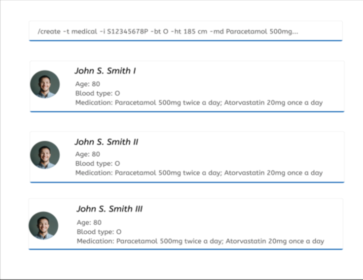
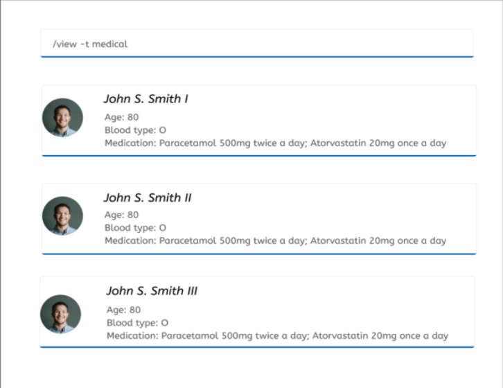

* Table of Contents
  {:toc}

--------------------------------------------------------------------------------------------------------------------

## Quick start

### Requirement

1. Ensure you have Java `11` or above installed in your Computer.

1. Download the latest `addressbook.jar` from [here](https://github.com/se-edu/addressbook-level3/releases).

### Setup
1. Copy the file to the folder you want to use as the _home folder_ for your AddressBook.

1. Double-click the file to start the app. The GUI similar to the below should appear in a few seconds. Note how the app contains some sample data. 
   

1. Type the command in the command box and press Enter to execute it. e.g. typing **`help`** and pressing Enter will open the help window. 
   Some example commands you can try:

    * **`list`** : Lists all contacts.

    * **`add`**`n/John Doe p/98765432 e/johnd@example.com a/John street, block 123, #01-01` : Adds a contact named `John Doe` to the Address Book.

    * **`delete`**`3` : Deletes the 3rd contact shown in the current list.

    * **`clear`** : Deletes all contacts.

    * **`exit`** : Exits the app.

1. Refer to the [Features](#features) below for details of each command.

--------------------------------------------------------------------------------------------------------------------
## 2.0 Features

### 2.1 Create Contact Information: / create -t contact

Adds a patient's contact to the Medbook

Format: / create -t contact -i NRIC -n NAME -p PHONE_NUMBER -e EMAIL -a ADDRESS

Examples:
* /create -t contact -i S12345678P -n John Doe -p 80008000 -e johndoe@gmail.com -a COM1

### 2.2 View Contact Information: /view -t contact

Views a patient’s details from the MedBook

Format: /view -t contact [-i NRIC] [-n NAME] [-p PHONE_NUMBER] [-e EMAIL]

Note: Optional fields allow users to have a more refined search.

Examples:
* /view -t contact to show all patients’ contact information
* /view -t contact -i S12345678P to view the contact information of the patient with this NRIC
* /view -t contact -n John Smith to view all contact information of patients with this name

### 2.3 Delete Contact Information: /delete -t contact

Deletes a patient from the MedBook

Format: /delete -t contact -i NRIC

Note: Only NRIC can be used to uniquely identify the contact owner.

Examples:
* /delete -t contact -i S12345678P

### 2.4	Create Medical Information: `/create -t medical`
Adds a patient's medical information to the MedBook.

Format: `/create -t medical -i S12345678P [-a AGE] [-bt BLOOD_TYPE] [-md MEDICATION]...`

Optional fields and associated flags:
- Age `-a`
- Blood type `-bt`
- Medication `-md`
- Height `-ht`
- Weight `-wt`
- List of illnesses `-il`
- List of surgeries `-su`
- Family history `-fh`
- Immunization history `-ih`
- Gender `-gd`
- Ethnicity `-et`

Examples:
* `/create -t medical -i S12345678P -bt O -ht 185 cm`

### 2.5 View Medical Information `/view -t medical`
Displays medical information of a patient from the MedBook. If no NRIC number is included, displays a list of current medical information records.

Format:  `/view -t medical [-i NRIC]`

Examples:
* `/view -t medical`
* `/view -t medical -i S12345678P`

### 2.6	Delete Medical Information: `/delete -t medical`
Deletes all medical information of a patient from the MedBook

Format: `/delete -t medical -i NRIC`

Examples:
* `/delete -t medical -i S12345678P`

### 2.7	Create Consultation Information: /create -t consultation
Adds a consultation report of a patient to the MedBook.

Format: /create -t consultation -i S12345678P [-dt DATE] [-tm TIME] [-n NOTES] [-p PRESCRIPTION] [-tt TESTS TAKEN AND RESULTS]

NOTE:  [-dt DATE][-tm TIME] are in the form dd-MM-yyyy, HH-mm (24 hour) respectively.

Examples:
* /create -t consultation -i S12345678P -dt 15-09-2021 -tm 18-00 -n Inflammation in the throat and windpipe, short and shallow breath, laboured breathing. Most likely has Upper Respiratory Infection. -p Augmentin Antibiotics 625mg - twice a day; Paracetamol 500mg - twice a day. -tt Stethoscope. Found short and laboured breathing.

### 2.8	View Past Consultations: /view -t consultation
View all past consultations in the MedBook that fit search parameters. All fields are optional.

Format: /view -t consultation  -i S12345678P [-dt DATE][-tm TIME]

NOTE:  [-dt DATE][-tm TIME] are in the form dd-MM-yyyy, HH-mm (24 hour) respectively.

Examples:
* /view -t consultation
  * Shows all the consultations for all patients
* /view -t consultation -i S12345678P
  * Shows all the consultations for patient with id S12345678P
* /view -t consultation -i S12345678P -dt -09-2021
  * Shows all consultations for patients with id S12345678P that occurred in Sept 2021
* /view -t consultation -dt 15-09-2021 -tm 18-00
  * Shows consultation that occurred on Sept 15 2021 1800hrs
    

View Consultation Information User Interface

### 2.9	Delete Consultation Information: /delete -t consultation
Deletes a consultation of a patient from the MedBook.

Format: /delete -t consultation -i S12345678P [-dt DATE] [-tm TIME]

Examples:
* /delete -t consultation -i S12345678P  -dt 15-09-2021 -tm 18-00

## 3.0	FAQ
Q: How do I transfer my data to another Computer?  
A: Install the app on the other computer and overwrite the empty data file it creates with the file that contains the data of your previous MedBook folder.  

## 4.0 Command Summary

| Action | Format Example |
| :----- | :------------- |
| Add Contact Info | /create -t contact -i NRIC -n NAME -p PHONE_NUMBER -e EMAIL -a ADDRESS |
| View Contact Info | /view -t contact [-i NRIC] [-n NAME] [-p PHONE_NUMBER] [-e EMAIL] |
| Delete Contact Info | /delete -t contact -i NRIC |
| Add Medical Info | /create -t medical -i S12345678P [-a AGE] [-bt BLOOD_TYPE] [-md MEDICATION]... |
| View Medical Info | /view -t medical [-i NRIC] |
| Delete Medical Info | /delete -t medical -i NRIC |
| Add Consultation Info | /create -t consultation -i S12345678P [-dt DATE] [-tm TIME] [-n NOTES] [-p PRESCRIPTION] [-tt TESTS TAKEN AND RESULTS] |
| View Consultation Info | /view -t consultation  -i S12345678P [-dt DATE][-tm TIME] |
| Delete Consultation Info | /delete -t consultation -i S12345678P [-dt DATE] [-tm TIME] |
