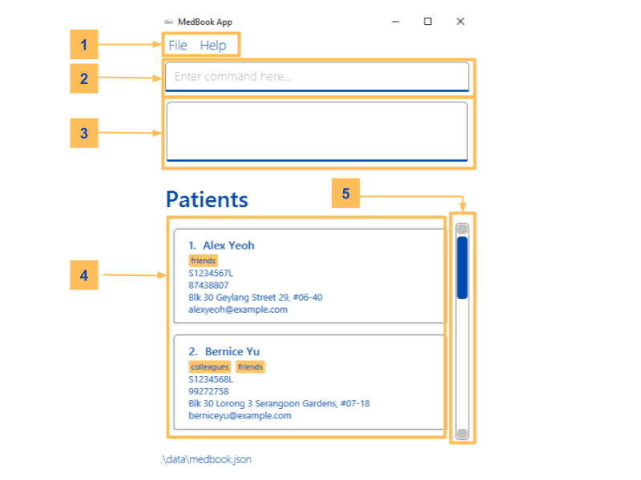
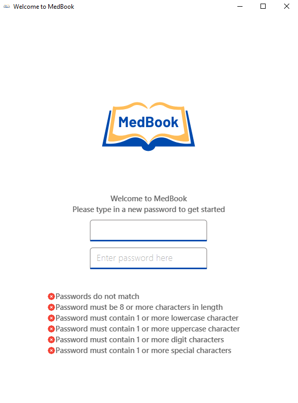
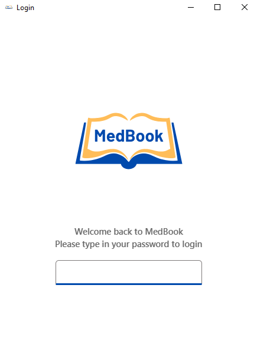
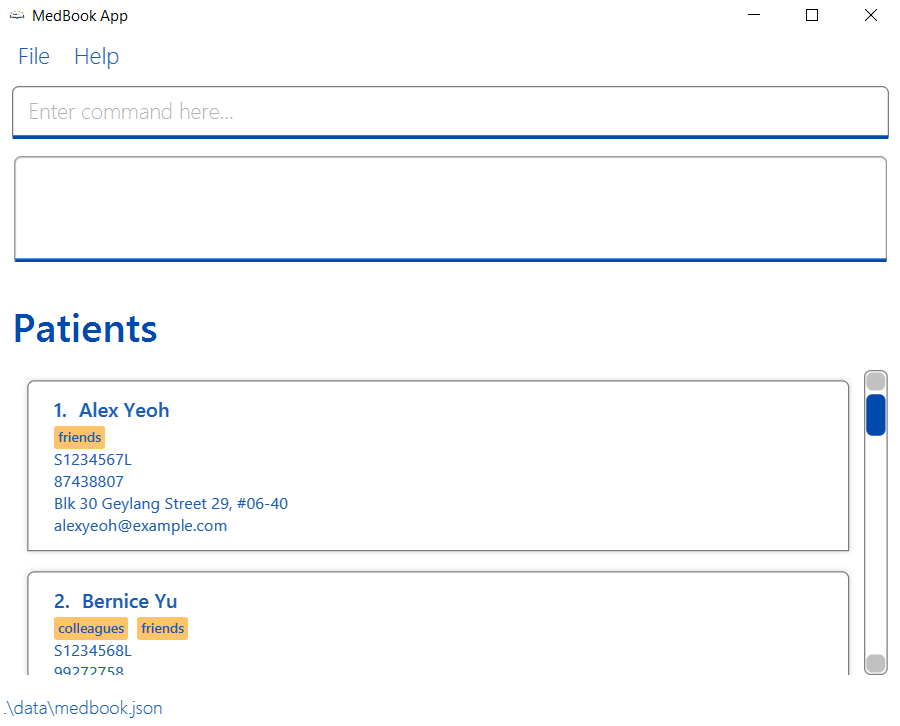

## **Table of Contents**
- [Introduction](#introduction)
- [Quick start](#quick-start)
  - [Requirement](#requirement)
  - [Setup](#setup)
  - [Graphical User Interface](#graphical-user-interface)
  - [Controls](#controls)
  - [Getting Started](#getting-started)
- [Features](#features)
  - [Viewing Help: `help`](#viewing-help-help)
  - [Adding a Patient: `add`](#adding-a-patient-add)
  - [Listing all Patients: `view`](#listing-all-patients-view)
  - [Editing Patient Information: `edit`](#editing-patient-information-edit)
  - [View Summary of a Patient: `view i/NRIC`](#view-summary-of-a-patient-view-inric)
  - [Deleting any Entry: `delete`](#deleting-any-entry-delete)
  - [Adding Contact Information: `add t/contact`](#adding-contact-information-add-tcontact)
  - [Viewing Contact Information: `view t/contact`](#viewing-contact-information-view-tcontact)
  - [Editing Contact Information: `edit`](#editing-contact-information-edit)
  - [Adding Medical Information: `add t/medical`](#adding-medical-information-add-tmedical)
  - [Viewing Medical Information: `view t/medical`](#viewing-medical-information-view-tmedical)
  - [Editing Medical Information: `edit`](#editing-medical-information-edit)
  - [Adding Consultation Information: `add t/consultation`](#adding-consultation-information-add-tconsultation)
  - [Viewing Past Consultations: `view t/consultation`](#viewing-past-consultations-view-tconsultation)
  - [Editing Consultation Information: `edit`](#editing-consultation-information-edit)
  - [Adding Prescription: `add t/prescription`](#adding-prescription-add-tprescription)
  - [Viewing Prescription: `view t/prescription`](#viewing-prescription-view-tprescription)
  - [Editing Prescription: `edit`](#editing-prescription-edit)
  - [Adding Test Result: `add t/test`](#adding-test-result-add-ttest)
  - [Viewing Test Result: `view t/test`](#viewing-test-result-view-ttest)
- [FAQ](#faq)

--------------------------------------------------------------------------------------------------------------------

Welcome to MedBook's user guide. This guide serves to equip users with the necessary knowledge to fully utilise all the features implemented in MedBook.

## Introduction

MedBook is a health monitoring system for healthcare professionals that simplifies tracking patient’s medical information and hospital records. MedBook delivers a seamless workflow for doctors and healthcare professionals to search for or update patients' emergency contacts, medical information, medical tests, consultations and prescriptions through a simple and easy-to-use platform.
## Quick start
This section contains all the necessary information you will need to get started with using MedBook.
### Requirement
- Ensure you have Java 11 or above installed on your computer.
- Download the latest `MedBook.jar` from [here](https://github.com/AY2122S2-CS2103T-T11-1/tp/releases).

### Setup
1. Copy the file to the folder you want to use as the home folder for MedBook.
2. Double-click the `MedBook.jar` to start the app.

### Graphical User Interface
MedBook has an intuitive graphical user interface built for you to enjoy easy interaction with the application. This section describes each part of the graphical user interface in detail.

<figure class="figure">
   
</figure>

| Label | Description |
| ----- | ----------- |
| 1     | **Toolbar**. This is where the settings that allow you to exit the application and open the help window are. |
| 2     | **Command Input**. This is where you type the commands to be executed by the application. |
| 3     | **Command Result**. This text box displays MedBook's response to the commands entered. |
| 4     | **List of Patients**. This is the list of patients that are stored in the application. |
| 5     | **Scroll Bar**. This scroll bar allows you to scroll for more information. |

### Controls

In order to improve your experience when using the app, we have included the following feature:

- Use the `↑` and `↓` arrow keys to navigate between previously entered commands in the command box.

### Getting Started
Follow this tutorial to get started with using MedBook:
1. Open MedBook by double clicking `MedBook.jar` located in your MedBook home folder.
2. If this is your first time using MedBook, you will see a prompt window requesting you to set up a new password.
3. Type in a password which fits the requirements and press `enter` to continue.

   <figure class="figure">
       
       <figcaption class="figure-caption">Figure 1: Password Prompt Display</figcaption>
   </figure>

   

   

        **:information_source: Notes about password:** 
   

   

       This password should only be known to you as it will be used to encrypt your MedBook data.
       See <a href="#faq">FAQ</a> on how to reset your password.
   

   

4. Once you have set up a password, you will be prompted to enter the same password every time you login.

   <figure class="figure">
       
       <figcaption class="figure-caption">Figure 2: Login Prompt Display</figcaption>
   </figure>

5. After you have successfully logged in, the GUI will be loaded up with sample data and MedBook should look like the picture below.

   <figure class="figure">
       
       <figcaption class="figure-caption">Figure 3: Main Display</figcaption>
   </figure>
6. You may refer the to command list [here](#features) for the details of each available command.

--------------------------------------------------------------------------------------------------------------------

## Features

**:information_source: Notes about the command format:** 

* Words in `UPPER_CASE` are the parameters to be supplied by the user. 
  e.g. in `add n/NAME`, `NAME` is a parameter which can be used as `add n/John Doe`.

* Items in square brackets are optional. 
  e.g `n/NAME [tg/TAG]` can be used as `n/John Doe tg/diabetic` or as `n/John Doe`.

* Items with `…`  after them can be used multiple times including zero times. 
  e.g. `[tg/TAG]… ` can be used as ` ` (i.e. 0 times), `tg/diabetic`, `tg/diabetic tg/hypertension` etc.

* Parameters can be in any order. 
  e.g. if the command specifies `n/NAME p/PHONE_NUMBER`, `p/PHONE_NUMBER n/NAME` is also acceptable.

* If a parameter is expected only once in the command but you specified it multiple times, only the last occurrence of the parameter will be taken. 
  e.g. if you specify `p/12341234 p/56785678`, only `p/56785678` will be taken.

* Extraneous parameters for commands that do not take in parameters (such as `help`, `list`, and `exit`) will be ignored. 
  e.g. if the command specifies `help 123`, it will be interpreted as `help`.

### Viewing Help: `help`

Shows a message explaining how to access the help page.

Format: `help`

### Adding a Patient: `add`

Adds a patient to MedBook.

Format: `add i/NRIC n/NAME p/PHONE_NUMBER e/EMAIL a/ADDRESS [tg/TAG]...`

   

   

       INFO
   

   

       Patient's NRIC must be a valid Singapore-issued NRIC. See <a href="https://en.wikipedia.org/wiki/National_Registration_Identity_Card" target="_blank">here</a> for more information about the valid format.

       NRIC **cannot be edited** in the future. Please ensure you keyed in the correct NRIC before proceeding.
   

   

Examples:
* `add i/S1234567L n/John Doe p/98765432 e/johnd@example.com a/John street, block 123, #01-01`
* `add i/S1234568L n/Jane Doe p/98763488 e/janed@example.com a/311, Clementi Ave 2, #02-25 tg/diabetic tg/hypertension`

### Listing all Patients: `view`

Shows a list of patients in MedBook.

Format: `view`

### Editing Patient Information: `edit`

Edits an existing patient information entry in MedBook when a list of patient's information entries is being displayed.
This is with the exception of the NRIC field, which cannot be modified after creation of Patient Information.

Format:  `edit INDEX [n/NAME] [p/PHONE_NUMBER] [e/EMAIL] [a/ADDRESS]`

* Edits the patient at the specified INDEX. The index refers to the index number shown in the displayed person list. The index must be a positive integer 1, 2, 3, …​
* At least one of the optional fields must be provided.
* Existing values will be updated to the input values.
* When editing tags, the existing tags of the person will be removed i.e adding of tags is not cumulative.
* You can remove all the person’s tags by typing t/ without specifying any tags after it.

Examples:
* `view` followed by `edit 1 n/John` updates name of first patient information entry displayed on the screen.

Caution*: Editing a contact will overwrite the old data.

### View Summary of a Patient: `view i/NRIC`

Shows a summary of a patient's information in MedBook, including personal details, contact, medical information,...

Format: `view i/NRIC`

Examples:
* `view i/S1234567L`

### Deleting any Entry: `delete`

Deletes a specified entry (patient, contact, medical information, ...) on the current screen from MedBook.

Format: `delete INDEX`

* We can delete the entry only if the entry is being shown on the display panel.
* For all screens apart from Summary, the index refers to the index number shown in the displayed list.
* The index must be a positive integer 1, 2, 3, …​
* For Summary screen, `delete 1` deletes the patient being viewed; other indices are invalid.

Examples:
* `view t/prescription i/S1234567L` followed by `delete 2` deletes the second prescription of the patient displayed on the screen.
* `view` followed by `delete 1` deletes the first patient displayed on the screen.

Caution*: Deleting a patient will remove all the associated information (e.g medical info, prescriptions, consultations etc.)

### Finding any Entry: `find`

Finds a specified entry (patient, contact, medical information, ...) on the current screen from MedBook containing the keywords you have specified.

Format: `find KEYWORD`

* We can find the entry only if the entry is being shown on the display panel.
* Finding a Patient's information is done through specifying their name as the keyword.
* Finding all other records matches your keyword with any of the fields in that record.

Examples:
* `find John` when viewing all patients shows only patients whose name is John.
* `find x-ray` when viewing the test results belonging to a certain patient will filter the test results to only show those which contains the keyword `x-ray`.
### Adding Contact Information: `add t/contact`

Adds a patient's emergency contact to MedBook.

Format: `add t/contact i/NRIC n/NAME p/PHONE_NUMBER e/EMAIL a/ADDRESS [tg/TAG]...`

Examples:
* `add t/contact i/S1234567L n/Rihanna p/80008000 e/rihanna@gmail.com a/COM1 tg/primary tg/mother`

### Viewing Contact Information: `view t/contact`

Views a patient’s emergency contacts from MedBook.

Format: `view t/contact i/NRIC`

Examples:
* `/view t/contact i/S1234567L`

### Editing Contact Information: `edit`

Edits an existing contact information entry in MedBook when a patient's list of contact information entries is being displayed.
This is with the exception of the NRIC field, which cannot be modified after creation of Contact Information.

Format:  `edit INDEX [n/NAME] [p/PHONE_NUMBER] [e/EMAIL] [a/ADDRESS] [tg/TAG]...`

* Edits the contact at the specified INDEX. The index refers to the index number shown in the displayed person list. The index must be a positive integer 1, 2, 3, …​
* At least one of the optional fields must be provided.
* Existing values will be updated to the input values.
* When editing tags, the existing tags of the person will be removed i.e adding of tags is not cumulative.
* You can remove all the person’s tags by typing t/ without specifying any tags after it.

Examples:
* `view t/contact` followed by `edit 1 n/John` updates name of first contact information entry displayed on the screen.

Caution*: Editing a contact will overwrite the old data.

### Adding Medical Information: `add t/medical`
Adds a patient's medical information to MedBook.

Format: `add t/medical i/NRIC [a/AGE] [bt/BLOOD_TYPE] [md/MEDICATION] [ht/HEIGHT] [wt/WEIGHT]
[il/ILLNESSES] [su/SURGERIES] [fh/FAMILY_HISTORY] [ih/IMMUNIZATION_HISTORY] [gd/GENDER] [et/ETHNICITY]`

* For blood type parameter, we recommend using ABO blood system, but allow any blood system or special blood type values.

Examples:
* `add t/medical i/S1234567L bt/AB ht/175 cm`
* `add t/medical i/S1234567L a/22 bt/O md/Paracetamol 500mg twice a day; Atarvastatin 20mg once a day ht/185 cm wt/70 kg il/Mild fever; High cholesterol su/Appendectomy fh/Has family history of high blood pressure ih/MMR; 6 in 1; Hepatitis B gd/Male et/Chinese`

### Viewing Medical Information: `view t/medical`

Displays medical information of a patient from MedBook. If no NRIC is specified, displays all medical information entries.

Format:  `view t/medical [i/NRIC]`

Examples:
* `view t/medical`
* `view t/medical i/S1234567L`

### Editing Medical Information: `edit`

Edits an existing medical information entry in MedBook when a patient's list of medical information entries is being displayed.
This is with the exception of the NRIC field, which cannot be modified after creation of Medical Information.

Format:  `edit INDEX [a/AGE] [bt/BLOOD_TYPE] [md/MEDICATION] [ht/HEIGHT] [wt/WEIGHT]
[il/ILLNESSES] [su/SURGERIES] [fh/FAMILY_HISTORY] [ih/IMMUNIZATION_HISTORY] [gd/GENDER] [et/ETHNICITY]`

Examples:
* `view t/medical` followed by `edit 1 bt/B` updates blood type of first medical information entry displayed on the screen.

### Adding Consultation Information: `add t/consultation`

Adds a consultation report of a patient to MedBook.

Format: `add t/consultation i/NRIC dt/DATE tm/TIME dg/DIAGNOSIS fe/FEE nt/NOTES`

Examples:
* `add t/consultation i/S1234567L dt/2021-09-15 tm/18-00 dg/Inflammation in the throat and windpipe, short and shallow breath, laboured breathing. Most likely has Upper Respiratory Infection. fe/54.00 nt/Patient is having fever.`

### Viewing Past Consultations: `view t/consultation`

Views all past consultations of a patient in MedBook.

Format: `view t/consultation i/NRIC`

Examples:
* `view t/consultation i/S1234567L`

### Editing Consultation Information: `edit`

Edits an existing consultation entry in MedBook when a list of consultation entries is being displayed.
This is with the exception of the NRIC field, which cannot be modified after creation of Consultation.

Format:  `edit INDEX [dt/DATE] [tm/TIME] [dg/DIAGNOSIS] [fe/FEE] [nt/NOTES]`

Examples:
* `view t/consultation` followed by `edit 1 dt/19-02-2019 tm/19-00` updates date and time of first consultation entry displayed on the screen.

### Adding Prescription: `add t/prescription`

Adds a medical prescription of a patient to MedBook.

Format: `add t/prescription i/NRIC n/DRUG_NAME dt/DATE s/INSTRUCTION`

Examples:
* `add t/prescription i/S1234567L n/Amoxicillin dt/2021-09-15 s/2 tablets after meal everyday.`

### Viewing Prescription: `view t/prescription`

Views a medical prescription of a patient in MedBook.

Format: `view t/prescription i/NRIC`

Examples:
* `view t/prescription i/S1234567L`

### Editing Prescription: `edit`

Edits an existing prescription entry in MedBook when a list of prescription entries is being displayed.
This is with the exception of the NRIC field, which cannot be modified after creation of Prescription.

Format:  `edit INDEX [n/DRUG_NAME] [dt/DATE] [s/INSTRUCTION]`

Examples:
* `view t/prescription` followed by `edit 1 s/1 tablet everyday` updates instruction of first prescription entry displayed on the screen.

### Adding Test Result: `add t/test`

Adds a test result taken by a patient in MedBook.

Format: `add t/test i/NRIC dt/DATE mt/MEDICAL_TEST r/RESULT`

Examples:
* `add t/test i/S1234567L dt/2019-09-15 mt/CT Scan r/Brain Cancer`

### Viewing Test Result: `view t/test`

Views all the test results taken by a patient in MedBook.

Format: `view t/test i/NRIC`

Examples:
* `view t/test i/S1234567L`

## FAQ

<h6 markdown="1" class="card-title">How do I transfer my data to another computer?</h6>

**Option 1:**
By default, MedBook will always read `medbook.json` located in `HOME_DIRECTORY of MedBook.jar/data/`. Just move your data to `HOME_DIRECTORY of MedBook.jar/data/` in your new device if you wish to import them.

**Option 2 (with encryption):**
By default, MedBook will always encrypt your data to `password.enc` in `HOME_DIRECTORY of MedBook.jar/data/` for security reason. You can move `password.enc` to `HOME_DIRECTORY of MedBook.jar/data/` in your new device and MedBook will ask for your password upon launching.

<h6 markdown="1" class="card-title">What happens if I forget my password?</h6>
Due to security reason, there is no way to reset to password. To continue using the application you need to delete the encrypted data file (located at `HOME_DIRECTORY of MedBook.jar/data/password.enc`) or move it to another location. MedBook will start with a fresh data for you to start over. See the next FAQ for restoring data.

<h6 markdown="1" class="card-title">What happens if I accidentally remove `password.enc`?</h6>
Unfortunately, the encrypted data will be lost along with your password. However, you can restore your data if you have `medbook.json` with you. Make sure you place them in `HOME_DIRECTORY of MedBook.jar/data/` before launching the app. When you start MedBook again, you will be asked to set up a new password.

We highly discourage users to temper with `password.enc` for security reason as any encryption can be broken given sufficient amount of time. 

<h6 markdown="1" class="card-title">Can I modify `medbook.json` locally?</h6>
We highly discourage users from modifying `medbook.json` directly as any invalid input will cause MedBook to launch with empty data and `medbook.json` will be overwritten. 

If you understood what you are dealing with, you may proceed with cautions. We recommended you to back up a copy of `medbook.json` in case you accidentally corrupt the file at any point of time.

| Action                        | Format Example                                                                                                                                                                                |
| :---------------------------- | :-------------------------------------------------------------------------------------------------------------------------------------------------------------------------------------------- |
| View Help                     | `help`                                                                                                                                                                                        |
| Add a Patient                 | `add i/NRIC n/NAME p/PHONE_NUMBER e/EMAIL a/ADDRESS [tg/TAG]...`                                                                                                                              |
| List all Patients             | `view`                                                                                                                                                                                        |
| Edit a Patient                | `edit INDEX n/NAME p/PHONE_NUMBER e/EMAIL a/ADDRESS [tg/TAG]...`                                                                                                                              |
| View Summary of a Patient     | `view i/NRIC`                                                                                                                                                                                 |
| Delete any Entry              | `delete INDEX`                                                                                                                                                                                |
| Add Contact Information       | `add t/contact i/NRIC n/NAME r/RELATIONSHIP p/PHONE_NUMBER e/EMAIL a/ADDRESS [tg/TAG]...`                                                                                                     |
| View Contact Information      | `view t/contact i/NRIC`                                                                                                                                                                       |
| Edit Contact Information      | `edit INDEX [n/NAME] [p/PHONE_NUMBER] [e/EMAIL] [a/ADDRESS]`                                                                                                                                  |
| Add Medical Information       | `add t/medical i/NRIC [a/AGE] [bt/BLOOD_TYPE] [md/MEDICATION] [ht/HEIGHT] [wt/WEIGHT] [il/ILLNESSES] [su/SURGERIES] [fh/FAMILY_HISTORY] [ih/IMMUNIZATION_HISTORY] [gd/GENDER] [et/ETHNICITY]` |
| View Medical Information      | `view t/medical [i/NRIC]`                                                                                                                                                                     |
| Edit Medical Information      | `edit INDEX [a/AGE] [bt/BLOOD_TYPE] [md/MEDICATION] [ht/HEIGHT] [wt/WEIGHT] [il/ILLNESSES] [su/SURGERIES] [fh/FAMILY_HISTORY] [ih/IMMUNIZATION_HISTORY] [gd/GENDER] [et/ETHNICITY]`           |
| Add Consultation Information  | `add t/consultation i/NRIC dt/DATE tm/TIME n/NOTES`                                                                                                                                           |
| View Past Consultations       | `view t/consultation i/NRIC`                                                                                                                                                                  |
| Edit Consultation Information | `edit INDEX [dt/DATE] [tm/TIME] [dg/DIAGNOSIS] [fe/FEE] [nt/NOTES]`                                                                                                                           |
| Add Prescription              | `add t/prescription i/NRIC n/DRUG_NAME dt/DATE s/INSTRUCTION`                                                                                                                                 |
| View Prescription             | `view t/prescription i/NRIC`                                                                                                                                                                  |
| Edit Prescription             | `edit INDEX [n/DRUG_NAME] [dt/DATE] [s/INSTRUCTION]`                                                                                                                                          |
| Add Test Result               | `add t/test i/NRIC dt/DATE mt/MEDICAL_TEST r/RESULT`                                                                                                                                          |
| View Test Result              | `view t/test i/NRIC`                                                                                                                                                                          |
