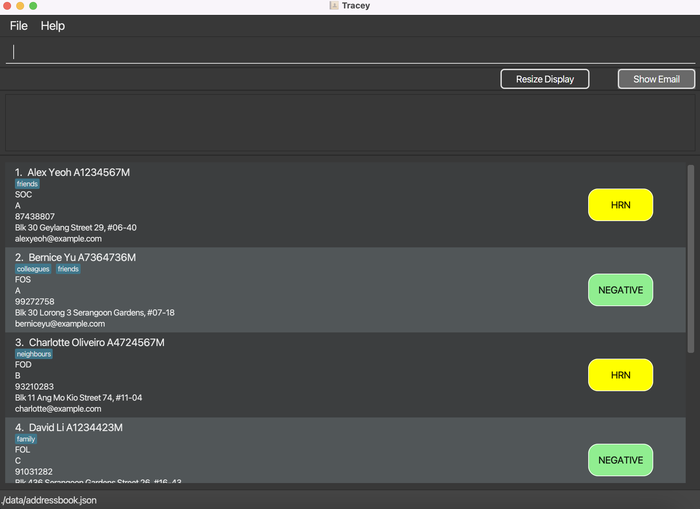
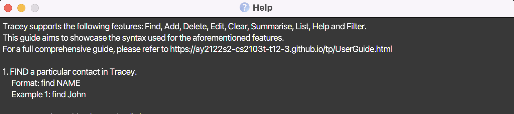
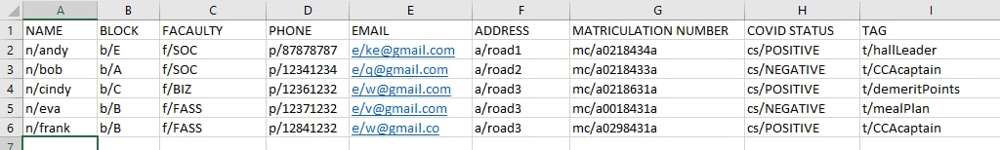
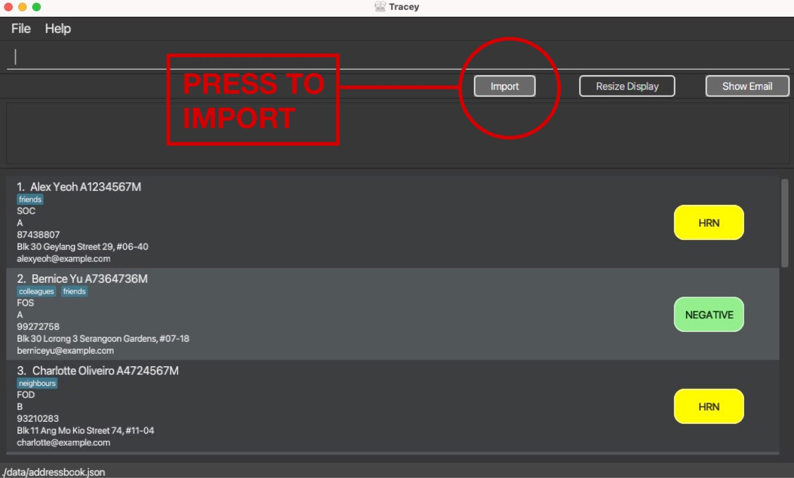
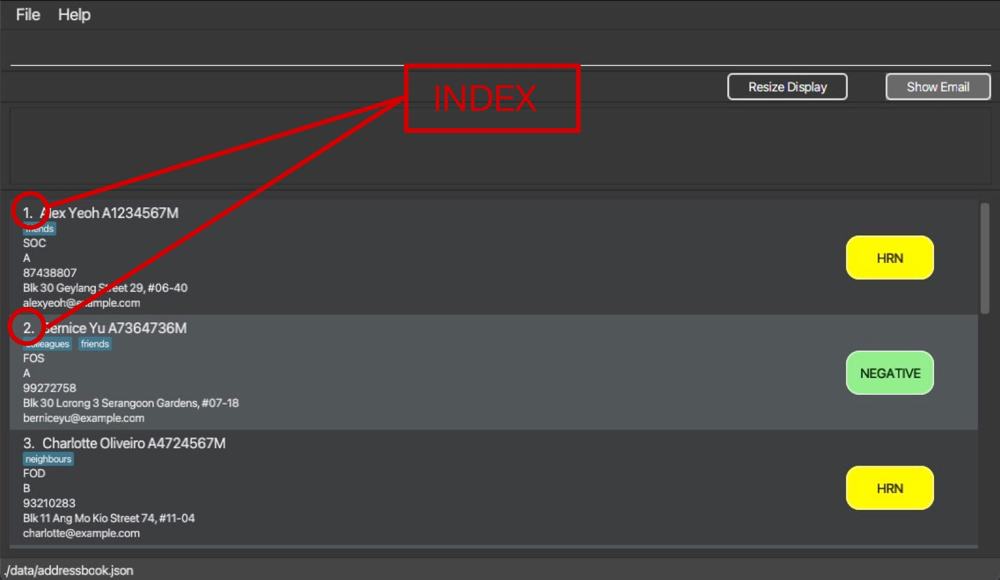
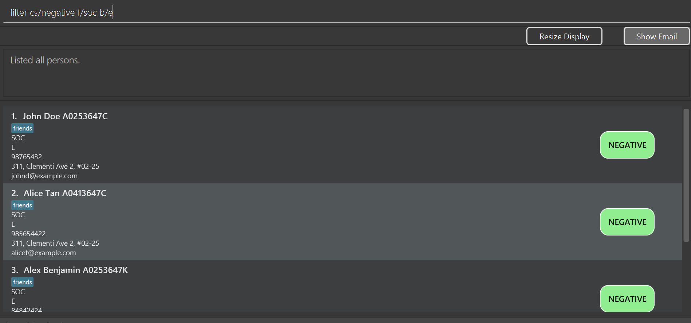
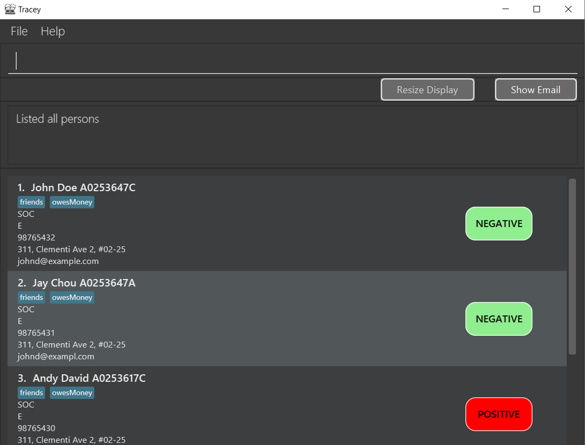
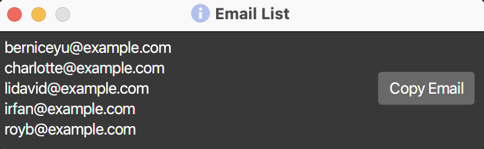
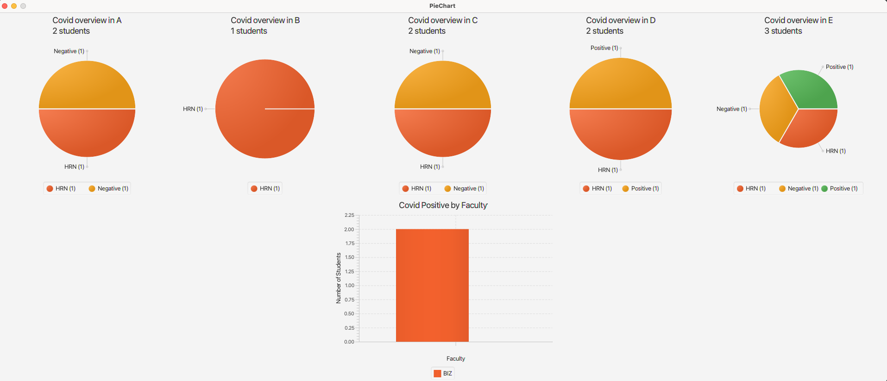
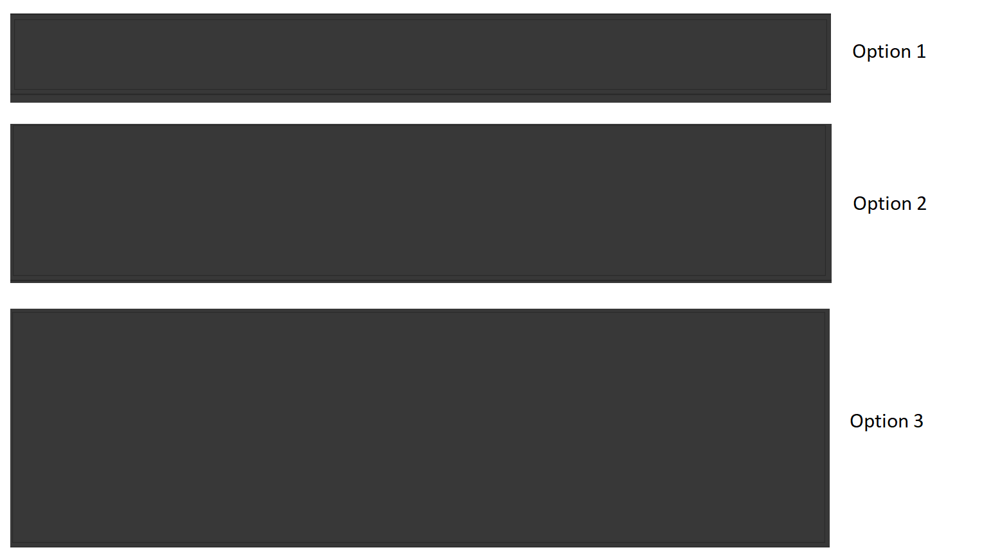

# Tracey

Tracey is a **desktop app for managing health statuses of NUS Hall Residents, optimized for use via a Command Line
Interface** (CLI) while still having the benefits of a Graphical User Interface (GUI). If you can type fast,
Tracey can get your student health status management tasks done faster than traditional GUI apps.

  
What are CLIs? What are GUIs?

##  Brief Introduction
1) CLIs are Command Line Interfaces. CLIs connect you to a computer program and through the CLI, you can interact with the application by typing in texts (commands).
2) GUIs are Graphical User Interfaces. GUIs are a system of interactive visual components for computer applications. You can interact with a GUI through a pointing device, such as your mouse.

Note that the main difference between GUI and CLI is the method of interaction.

As Tracey is a Command Line Interface, these are the aspects that highlight the power of Tracey and why it was developed using a CLI:

1. **Speed**  
   Tracey offers immense response speed. GUIs require additional resources to render graphical components, making them slower than CLIs.
2. **Functionality**  
   Tracey offers flexibility in its use. A typical GUI does not have the same level of functionality and granular control as a typical CLI. This is portrayed in the variety of features that Tracey offers, which you can learn about more in this User Guide.
3. **Scalability**  
   Simple command functions in Tracey allows it to handle various complex features. Additionally, the CLI of Tracey allows easier integration of newer features that may be added in future iterations, compared to GUIs which require rendering and creation of graphical components.

Sounds exciting? Proceed on to the next section to learn more about Tracey!

We hope you enjoy Tracey as much as we did developing it!

--------------------------------------------------------------------------------------------------------------------

* [Navigating the User Guide](#how-to-navigate-the-user-guide)
* [Quick Start](#quick-start)
* [Features](#features)
    * <a href='#viewing-help'>Help</a>
    * <a href='#importing-excel-sheet'>Importing Excel data</a>
    * <a href='#adding-a-contact'>Adding a contact</a>
    * <a href='#editing-an-existing-contact'>Editing an existing contact</a>
    * <a href='#deleting-a-contact'>Deleting a contact</a>
    * <a href='#undoing-an-action'>Undoing an action</a>
    * <a href='#redoing-an-action'>Redoing an action</a>
    * <a href='#finding-a-contact'>Finding a contact</a>
    * <a href='#filtering-contacts'>Filtering contacts</a>
    * <a href='#listing-the-records'>Listing the records</a>
    * <a href='#copying-emails'>Copying Emails</a>
    * <a href='#summarising-the-records'>Summarising the records</a>
    * <a href='#archiving-tracey'>Archiving Tracey</a>
    * <a href='#clearing-all-records'>Clearing all records</a>
    * <a href='#exiting-tracey'>Exiting Tracey</a>
    * <a href='#saving'>Saving</a>
* <a href='#faq'>FAQ</a>
* <a href='#command-summary'>Command Summary</a>
* <a href='#glossary'>Glossary</a>

--------------------------------------------------------------------------------------------------------------------
## How to navigate the User Guide

There are a few symbols to take note of in our User Guide. Their purposes are stated below:

| Symbol  |                                                 Purpose                                                 |
|:-------:|:-------------------------------------------------------------------------------------------------------:|
|   📓    |     Additional notes are parked here. They contain beneficial information in case you are confused.     |
|   ⚠️    |          Warnings are parked here. They contain information that you **NEED** to take note of.          |
|   💡    | Tips are parked here. They  highlight certain information that will allow you to fully utilise Tracey.  |

*Table 1: Symbols and their purposes.*

Additional formatting guidelines:

|  Format   |                                                                         Purpose                                                                          |
|:---------:|:--------------------------------------------------------------------------------------------------------------------------------------------------------:|
| **Bold**  |                                                        Bolded words indicate important keywords.                                                         |
| `Command` |            Words/phrases that are presented like this highlight specific keywords that you can use to interact with your computer or Tracey.             |
| [Links]() | Words/phrases that are presented like this are clickable links to different parts of the User Guide or to external web pages for additional information. |

*Table 2: Word formats and their purposes.*

--------------------------------------------------------------------------------------------------------------------
## Quick Start
1. Ensure you have Java 11 or above installed in your Computer.  
 📓`Note:`
   1. If you are unsure of which version of Java you are on, follow these steps. Otherwise, continue on from step 2.
   2. To check your java version:
      1. For Mac users, open up Terminal and type in `java --version`.
      2. For Windows users, open up Command Prompt and type in `java --version`.
   3. If you have the supported version of Java, the response should resemble something like this `java 11.0.9 2020-10-20 LTS`.
   4. If you do not see the supported version of Java, download Java from this [page](https://www.java.com/en/download/).
2. Download the latest **Tracey.jar** from [here](https://github.com/se-edu/addressbook-level3/releases).
3. Copy the file to the folder you want to use as the home folder for your Tracey application.
4. Double-click the file to start the app. The GUI similar to the below should appear in a few seconds.
   Note how the app contains some sample data.  
    *Figure 1: Screenshot showing sample data.*  
   📓`Note:`
   1. If you are a Mac user and are unable to open the JAR file after double-clicking, please open Terminal and change directory to where **Tracey.jar** is located. Then, type the following command to open the application: `java -jar Tracey.jar`.
   2. If you are a Windows user and are unable to open the JAR file after double-clicking, please open Command Prompt and change directory to where **Tracey.jar** is located. Then, type the following command to open the application: `java -jar Tracey.jar`.
6. Type your commands in the command box and press Enter to execute it. e.g. typing **`help`** and pressing Enter will open the help window. 
   Some example commands you can try:

* **`list`** : Lists all contacts.

* **`summarise`** : Summarises all contacts into their respective faculty and informs the reader percentage of student from that faculty is Covid positive.

* **`add`**`add n/John Doe b/E f/SoC p/98765432 e/johnd@example.com a/311, Clementi Ave 2, #02-25 mc/A0253647C cs/NEGATIVE t/friends t/owesMoney` : Adds a contact named `John Doe` to the Tracey.

* **`delete`**`3` : Deletes the 3rd contact shown in the current list.

* **`clear`** : Deletes all contacts.

* **`exit`** : Exits the app.

6. Refer to the [Features](#features) below for details of each command.

--------------------------------------------------------------------------------------------------------------------

## Features
### Viewing help
Help users to search for all the commands that Tracey offers by opening a pop-up window.
It includes a summary to briefly explain all the commands.

The pop-up window also offers a button to copy the URL of the User Guide for easy access to the User Guide.

This is a sample screenshot of what you can expect from the `list` command.

 *Figure 2: Screenshot of help command.*

Format: `help`

### Importing Excel sheet
Add a list of students from an Excel file into Tracey.

Format: import button
* Adds a list of students with Relevant Details such as Covid status into Tracey.
* Relevant details required are mentioned in Table 4 below.
* In the Excel sheet, the first column has to be the names of students followed by the Relevant Details.
* Tracey will then store all students from the Excel file into her!

Sample Excel file:
 *Figure 3: Screenshot of Excel file.*

How to identify import button:
 *Figure 4: Screenshot of import button.*

### Adding a contact
Add a student with relevant details into Tracey.

Format: `add n/NAME b/BLOCK f/FACULTY p/PHONE e/EMAIL a/ADDRESS mc/MATRICULATION_NUMBER cs/COVID_STATUS t/TAGS...`
* Adds a student with the specified details. Tags are optional, and you can add as many tags as you like.
    * Duplicate tags will be displayed as a single tag.
* The student name is case-sensitive e.g. `add n/johnDoe` will be logged as `johnDoe` and not `JohnDoe` in Tracey.
* Phone Number, email and matriculation number must be **unique** to each student.
* Order of the tags does not matter e.g. `add n/NAME p/PHONENUMBER` is the same as `add p/PHONENUMBER n/NAME`.
* Tracey will acknowledge that the student has been added.
* Values for faculty, covid status and block need to be pre-defined constants in the table below (refer to Table 4 below or in the <a href='#glossary'>glossary</a>).
* If the inputted keyword is not one of those defined in the **Pre-defined constants** as described in Table 4, there will be an error and you will have to input the details for the keyword again.

Examples of usage:
* `add n/Melvin b/c f/SOC p/84440808 e/melvin@nus.edu.sg a/12 Kent Ridge Drive mc/a0211343 cs/Negative`
* `add e/student69@u.nus.edu n/Martin b/e f/fol e/martiniser@gmail.com p/98090042 a/74 Pasir Ris Avenue mc/a1223213h cs/positive`

| Correct Usage :white_check_mark: | Incorrect Usage  :x: |
|:--------------------:|:-----------------:|
|     cs/Negative      | cs/Close-contact  | 
|        f/SoC         |      f/SooC       | 

*Table 3: Incorrect usage of **pre-defined constants**. Refer to Table 4 for an exhaustive list of such constants.*

| **Prefix** | **Meaning** |    **Pre-defined constants**                                                                          | Constraints |
|:-----:|:--------------------:|:-------------------------------------------------------------------------------------------------:|:--------------------:|
| `n/`  | Name                 | None                                                                                                  | Can only contain alphanumeric characters and spaces. |
| `p/`  | Phone Number         | None                                                                                                  | Can only be numbers at least 3 digits long. |
| `e/`  | Email                | None                                                                                                  | An email address should begin with a local part containing alphanumeric characters and these special characters, excluding the parentheses: (+_.-). The local part cannot start with a special character. This should be followed by a '@' and then a domain name. The domain name should be made up of domain labels separated by periods. The domain name must end with a domain label at least 2 characters long and each domain label can only consist of alphanumeric characters, separated only by hyphens, if any. |
| `a/`  | Address              | None                                                                                                  | Cannot be blank. |
| `f/`  | Faculty              | `FASS` `BIZ` `SOC` `SCALE` `FOD` `CDE` `DUKE` `FOL` `YLLSOM` `YSTCOM` `SOPP` `LKYSPP` `SPH` `FOS` | Can only be one of the pre-defined constants, and is case-insensitive. |
| `mc/` | Matriculation Number | None                                                                                                  | Can only start with an "A", followed by 7 digits, ending with a letter. |
| `cs/` | Covid Status         | `Positive` `Negative` `HRN`                                                                       | Can only be one of the pre-defined constants, and is case-insensitive. |
| `b/`  | Block                | `A` `B` `C` `D` `E`                                                                               | Can only be one of the pre-defined constants, and is case-insensitive. |
| `t/`  | Optional tag(s)      | None                                                                                                  | No constraints |

*Table 4: Table showing list of possible prefixes and the Pre-defined constants.*

As described in Table 4, these are the possible prefixes that can be used with Tracey. E.g `n/`, `cs/` etc.
In addition, the list of pre-defined constants are also provided for `Faculty` and `Covid Status`.

💡`Tips`:
* You are able to add optional tags with no restrictions using the `t/` prefix.
* Additions can be reversed with the `undo` feature.

### Editing an existing contact
Edit a contact at a specific index.

Format: `edit INDEX n/NAME ...`
* Edits an existing student's information found in Tracey. The student is referred to by an index, displayed beside his/her name in the student list.
* To edit a student's details, you can use the command `edit` with the student's `INDEX` and the corresponding field prefix (mentioned in Figure 3 above).
  The index **must be a positive integer** 1, 2, 3, …
* The correct prefixes must be used in order for Tracey to know what you intend to edit.
* Refer to Table 2 in the <a href='#glossary'>glossary</a> for the correct format and pre-defined constants to be used for each input field.
* Existing information of the student will be replaced with the newly inputted values.
* When editing tags, all existing tags will be replaced with the newly inputted tag(s).  
  i.e. Adding tags is not cumulative. All new tags will replace all old tags.
* You can remove all tags of the student by typing `t/` without specifying any details after it.

How to identify `INDEX`:
 *Figure 5: Screenshot of index location.*

Examples of usage:
* `edit 1 p/91234567 e/johndoe@example.com` edits the phone number and email address of the 1st student to be `91234567`
  and `johndoe@example.com` respectively.
* `edit 2 n/David Limpeh t/` edits the entry to become `David Limpeh` and clears all existing tags.

💡`Tip`:
* Edits can be reversed with the `undo` feature.

### Deleting a contact
Delete a contact at a specific index.

Format: `delete INDEX`
* Deletes an existing student in Tracey. The student is referred to by an index, displayed beside his/her name in the student list.
* To delete a student, you can use the command `delete` on the student's `INDEX`.
  The index **must be a positive integer** 1, 2, 3, …
* Deletes one student at a time.
* You can only delete the contact information at an index where there is a student assigned to it.

How to identify `INDEX`:
 *Figure 5: Screenshot of index location.*

Examples of usage:
* `delete 2` removes the 2nd student on the list.
* `delete 10` removes the 10th student on the list.

💡`Tips:`
* The `INDEX` used for each student is not fixed. It depends on the number shown on the displayed list of students.
* You can use <a href='#finding-a-contact-find'>`find`</a> to get his/her `INDEX` and then apply `delete`.
* This can save you time scrolling down an entire list to get his/her `INDEX`!
* Deletions can be reversed with the `undo` feature.

### Undoing an action
Undo an executed `add`, `edit` or `delete` command.

Format: `undo`
* Undoes only the last executed add, edit or delete command.
* You can only use the undo command after executing an add, edit, or delete command.
* Cannot be used in succession to undo previously executed commands besides the last executed one.

### Redoing an action
Reverses an executed undo command.

Format: `redo`
* Reverses only the last executed `undo` command.
* You can only use the `redo` command after executing an `undo` command.
* Cannot be used in succession to reverse previously executed `undo` commands besides the last executed one.

### Finding a contact
Find a particular contact in Tracey and retrieve their specific details.

Format: `find NAME`
* Returns the student(s) whose name(s) contain the input keyword `NAME` with their **details**.
* The **details** provided are the student's `Name`, `Matriculation Number`, `Faculty`, `Block`, `Phone`, `Address`, `Email` amd `Covid Status`.
* A screenshot (Figure 6) is provided below to demonstrate what the find function returns.
* The search is case-insensitive. e.g `johnDoe` will match `Johndoe`.
* The search does not require full name. e.g. `jo` will match `Joe` and `John`.

Examples of usages:

* `find John` returns `john` and `John Doe`.
* `find alex david` returns `Alex Yeoh` and`David Li`.
* `find J` returns `john` and`jay`.

Scenario:
 *Figure 6: Screenshot of result of the find command.*

As seen in the *Figure 6*, after the user keys in `find Bernice`, the application returns Bernice's details: `Name`, `Matriculation Number`, `Faculty`, `Block`, `Phone`, `Address`, `Email` amd `Covid Status`.

### Filtering contacts
Filter students based on faculties, health statuses and/or blocks.

Format:`filter f/FACULTY cs/COVID_STATUS b/BLOCK`

* Returns a list of students that fit the criteria given by the user in the form of pre-defined constants in the categories of faculty, covid status and block.
* Refer to Table 2 in the <a href='#glossary'>glossary</a> for the list of pre-defined constants to be used for these 3 categories.
* The search is case-insensitive. e.g `Positive` will match `positive`.
* The order of fields specified does not matter e.g. `filter f/soc cs/positive` and `filter cs/positive f/soc` will return the same result.
* At least one field has to be specified, but not all need to be e.g. `filter` is invalid, but `filter b/A` is valid.

Examples of usage:
* `filter cs/positive` returns all students that are tagged as covid-positive.
* `filter f/soc` returns all students that are enrolled in the faculty SOC (School of Computing).
* `filter b/e` returns all students who live in block E of the hall.
* `filter cs/negative f/soc` returns all students that are tagged as covid-negative and enrolled in the faculty SOC (School of Computing).
* `filter cs/negative f/soc b/e` returns all students that are tagged as covid-negative, enrolled in the faculty SOC (School of Computing) and live in block E of the hall.

An example is shown below:
 *Figure 7: Example result of `filter` command.*

As seen in *Figure 7*, using the `filter` command with "negative" as covid status, "soc" as faculty and "e" as block will return a list of contacts matching these criteria.

📓`Note:`
* `filter` command only allows you to search via faculty, health status and block. To search for contacts whose names contain a keyword, use the `find` command instead.

### Listing the records
List all students, displaying all their data stored in Tracey.

Format: `list`

This is a sample screenshot of what you can expect from the `list` command.

 *Figure 8: Screenshot of list command.*

### Copying emails
Opens up a separate window that consists of all the emails of the current displayed individuals. On the window, there will be a `Copy Email` button that copies the list of emails to the user's clipboard to allow the user to efficiently send out mass emails.

Format:`email`

📓`Note:`
There is also a `Show Email` button on the GUI which you can click to open the same window.

 *Figure 9: Screenshot of Copy Email function.*

From Figure 9, this function is beneficial for administrators as you may want to contact this particular set of students. Simply click `Copy Email` and you can go to the email platform of your choice and paste this in the Address section. This function definitely faster than individually copy-pasting student emails.

### Summarising the records
Summarises the statistics of the student records inside Tracey.

Format:`summarise`
* You can get an overview of the students in Tracey if you want to get an idea of the location where covid is more prevalent.

Example of usage:
* `summarise` will summarise the records of everyone in Tracey. The result is a graphical analysis the `Covid Status` of the individuals in each block. Additionally, an overview of the `Covid Status` of the Hall population is also provided (refer to figure 4).

 *Figure 10: Example response of Tracey in response to the `summarise` command.*

From Figure 10, when the user inputs the `Summarise` command, the result are multiple charts of the proportion of the student population categorised by `Covid Status`. These charts are separated into the student `Blocks` and the wider hall population.

### Archiving Tracey
Archives the current Tracey database. The archived database will be saved in `[ROOT]/data/archive/[DATE]/[ARCHIVED_FILE]` where:
* `[ROOT]`: Root directory of Tracey.
* `[DATE]`: Archived file directory named using your local PC's date in the format of DDMMYY.
* `[ARCHIVED_FILE]`: Archived file name named using your local PC's date and time in the format of DDMMYY_hhmmss.

Format: `archive`

Example:
* Current date and time in which archive command is used: 27/03/2022 (DD/MM/YYYY) 15:28:33 (hh:mm:ss in 24-hour notation).
* The archived file will be saved **in** `[ROOT]/data/archive/270322`.
* The archived file will be saved **as** `270322_152833`.
* The file path will be `[ROOT]/data/archive/270322/270322_152833`.

💡`Tips:`
* You can rename the archived file in the file path manually for easier reference.
* To restore Tracey to a previous version, just replace the address book file in `[ROOT]/data` with the archived file.

### Resizing the result display window
Resizes the result display window to 3 pre-set sizes.

Format: `resize SIZE`
* There are 3 options for `SIZE` which are 1, 2 and 3.
* The default result display window size is option 1.
* Refer to figures 11 for the comparison for the different result display window sizes. 

💡`Tips:`
* This feature is especially useful if you need a bigger result display window size to better view the result feedback given by Tracey, especially if the result feedback is long.

📓`Note:`
* There is also a `Resize Window` button on the GUI which you can click to cycle between the 3 different resizing options.
* 
 *Figure 11: Comparison of the 3 different resizing options for the result display window.*

### Clearing all records
Clear all the data inside Tracey.

Format:`clear`

⚠️`Warning:`
* Use the <a href='#archiving-tracey-archive'>archive command</a> to save a copy of the data file if you intend to keep it as the deleted files cannot be recovered.
* This feature cannot be reversed using `undo`.

### Exiting Tracey
Close the application.

Format: `exit`
* Closes the application.

### Saving
Saving in the application is automatic. The data in the file will be saved accordingly whenever
there are changes to Tracey.

---------------------------------------------------------------------------------------------------------------

### FAQ
1. **Q**: How do I transfer my data to another computer?  
   **A**: Copy the file from [ROOT]/data/addressbook.json over to your other computer.  

2. **Q**: What is the difference between the `list` command and `summarise` command?  
   **A**: The main differences of `list` and `summarise` are:

        a. The `list` command will provide an unfiltered list of students `summarise` command will tabulate the students into pie charts according to the block they stay in and faculty they belong to.

        b. `list` is helpful to get a bird eye view of the details of all the students whereas `summarise` is great to analyse how certain areas in the hall compound is doing.

        c. `list` is optimal to find a particular student out of everyone while `summarise` is optimal to find which block is dealing not-so-well with the covid outbreak.

3. **Q**: Can I use filter using keywords to find certain people in the list of students?  
   **A**: Unfortunately `filter` command only allows you to search via the tags such as `positive`, `soc` and block `A`. Please use the `find` command instead which will allow you to search via keywords.  

4. **Q**: Where can I find the `INDEX` of a student?  
   **A**: They can be found in the numbers located beside each individual student.  
    *Figure 5: Screenshot of index location.*

5. **Q**: The `delete` feature only allow us to delete via the `INDEX` assigned to each particular student. How do I know the `INDEX` of the student i want to use `delete` on?  
   **A**: The `INDEX` used for `delete` is not fixed. It relies on the number in which the displayed list of students will assign.
   You can use `find` `STUDENT` to get his/her `INDEX` and then apply `delete`. This can save you time scrolling down an entire list to get his/her `INDEX`!  

6. **Q**: The `edit` feature only allow us to edit via the `INDEX` assigned to each particular student. How do I know the `INDEX` of the student i want to use `edit` on?  
   **A**: The `INDEX` used for `edit` is not fixed. It relies on the number in which the displayed list of students will assign.
   You can use `find` `STUDENT` to get his/her `INDEX` and then apply `edit`. This can save you time scrolling down an entire list to get his/her `INDEX`!  

7. **Q**: Can I create new tags not mentioned by the app?  
   **A**: Yes! You are able to add optional tags with no restrictions using the `t/` prefix.

--------------------------------------------------------------------------------------------------------------------

### Command Summary

*Table 5: Command Summary.*

| No. | Command     | Description                                                                               | Example                                                                                                                                |
|-----|-------------|-------------------------------------------------------------------------------------------|----------------------------------------------------------------------------------------------------------------------------------------|
| 1.  | `find`      | Find a particular student                                                                 | `find alex` \n `find j`                                                                                                                |
| 2.  | `add`       | Add a student to the Tracey Database                                                      | `add n/John Doe b/E f/SoC p/98765432 e/johnd@example.com a/311, Clementi Ave 2, #02-25 mc/A0253647C cs/NEGATIVE t/friends t/owesMoney` |
| 3.  | `delete`    | Remove a student from Tracey                                                              | `delete 2`                                                                                                                             |
| 4.  | `edit`      | Change particulars of a student                                                           | `edit 1 p/91234567 e/johndoe@example.com`                                                                                              |
| 5.  | `clear`     | Format the Tracey Database                                                                | `clear`                                                                                                                                |
| 6.  | `summarise` | Summarise data into a list and pie charts for an overview                                 | `summarise`                                                                                                                            |
| 7.  | `list`      | Get a list of everyone in Tracey                                                          | `list`                                                                                                                                 |
| 8.  | `help`      | In-app support to understand how the commands work in Tracey                              | `help`                                                                                                                                 |
| 9.  | `filter`    | Retrieve list of people based on tags                                                     | `filter cs/HEALTH_STATUS f/FACULTY`                                                                                                    |
| 10. | `archive`   | Archives the Tracey Database                                                              | `archive`                                                                                                                              |
| 11. | `email`     | Opens a window of all student's in the current list which can be copied to your clipboard | `email`                                                                                                                                |
| 12. | `resize`    | Resizes the result display window                                                         | `resize 1`                                                                                                                              |

--------------------------------------------------------------------------------------------------------------------

### Glossary

*Table 4: List of prefixes, fields, pre-defined constants and constraints.*

| **Prefix** | **Meaning** |    **Pre-defined constants**                                                                          | Constraints |
|:-----:|:--------------------:|:-------------------------------------------------------------------------------------------------:|:--------------------:|
| `n/`  | Name                 | None                                                                                                  | Can only contain alphanumeric characters and spaces. |
| `p/`  | Phone Number         | None                                                                                                  | Can only be numbers at least 3 digits long. |
| `e/`  | Email                | None                                                                                                  | An email address should begin with a local part containing alphanumeric characters and these special characters, excluding the parentheses: (+_.-). The local part cannot start with a special character. This should be followed by a '@' and then a domain name. The domain name should be made up of domain labels separated by periods. The domain name must end with a domain label at least 2 characters long and each domain label can only consist of alphanumeric characters, separated only by hyphens, if any. |
| `a/`  | Address              | None                                                                                                  | Cannot be blank. |
| `f/`  | Faculty              | `FASS` `BIZ` `SOC` `SCALE` `FOD` `CDE` `DUKE` `FOL` `YLLSOM` `YSTCOM` `SOPP` `LKYSPP` `SPH` `FOS` | Can only be one of the pre-defined constants, and is case-insensitive. |
| `mc/` | Matriculation Number | None                                                                                                  | Can only start with an "A", followed by 7 digits, ending with a letter. |
| `cs/` | Covid Status         | `Positive` `Negative` `HRN`                                                                       | Can only be one of the pre-defined constants, and is case-insensitive. |
| `b/`  | Block                | `A` `B` `C` `D` `E`                                                                               | Can only be one of the pre-defined constants, and is case-insensitive. |
| `t/`  | Optional tag(s)      | None                                                                                                  | No constraints |

*Table 6: Specific terminology used.*

| Term                           | Meaning                                                                                                                                                                                                                                                                                              |
|--------------------------------|------------------------------------------------------------------------------------------------------------------------------------------------------------------------------------------------------------------------------------------------------------------------------------------------------|
| Block                          | The building or demarcated area within a residential hall that a student resides in. Typically, A residential hall is separated into 5 blocks: A, B, C, D and E.                                                                                                                                     |
| Command Line Interface (CLI)   | A text-based user interface used to run applications.                                                                                                                                                                                                                                                |
| Covid Status                   | A status to indicate whether a person is Covid-positive or has a has a health risk notice (HRN).                                                                                                                                                                                                     |
| Faculty                        | A group of departments in a university with a major division of knowledge. E.g. The School of Computing (SOC).                                                                                                                                                                                       |
| Graphical User Interface (GUI) | A system of interactive visual components used for managing user interaction with an application.                                                                                                                                                                                                    |
| Health Risk Notice (HRN)       | A label on a person to indicate that he/she has been identified as a close contact or household member of a Covid positive case.                                                                                                                                                                     |
| JAR File                       | JAR stands for **J**ava **AR**chive. This is a cross-platform file archive format that combines and compresses a large number of files into one, handling class files, audio and image files.                                                                                                        |
| Matriculation Number           | A student's unique identification number; also known as Student ID.                                                                                                                                                                                                                                  |
| Prefix                         | A set of one or more characters placed before others. When using Tracey, one or more letters followed by a forward slash (e.g. `cs/`) is used as a prefix to a detail to be input. The set of prefixes used by Tracey is shown in figure 3 under <a href='#adding-a-contact'>"Adding a contact"</a>. |
| Pre-defined constant           | Specific values that certain fields can only take. E.g. The pre-defined constants for Covid Status are `Positive`, `Negative` and `HRN`. Thus, these are the only values that can be input with the Covid Status prefix. Any other values would result in an error.                                  |
| Uniform Resource Locator (URL) | A reference to a web resource specifying its location in a computer network and the mechanism for its retrieval; more commonly known as a web address.                                                                                                                                               |
