

  

**Introduction** 
TAPA (Teaching Assistant's Personal Assistant) is a desktop app that allows TAs to better manage their student’s contact details and progress, especially for TAs who are teaching multiple classes/modules at the same time. It is optimised for use on a CLI.

**Purpose of This User Guide** 
The intended audience of this guide includes TAs who are interested in using TAPA, and anyone interested in learning more about TAPA. This guide aims to get you started with TAPA, and introduce you to all the features TAPA has to offer. As mentioned earlier, TAPA operates on a CLI. If you have no prior experience with a CLI, you can learn more about this in the [Features](#features) section introduction.

**Using This User Guide** 
This guide offers explanations for each feature found in TAPA, as well as how to use them to meet your student management needs. If you want to get started with TAPA as soon as possible, simply follow our [Quick Start](#quick-start) tutorial. Otherwise, you can find an overview of the features discussed in this guide in the following Table of Contents:

* Table of Contents
{:toc}

--------------------------------------------------------------------------------------------------------------------

## Quick start

1. Before getting started with TAPA, ensure you have [Java `11`](https://www.oracle.com/java/technologies/downloads/#java11) or above installed on your computer. You can check the version of Java on your computer by inputting `java -version` in your [terminal](https://www.ionos.com/help/email/troubleshooting-mail-basicmail-business/access-the-command-prompt-or-terminal/#:~:text=Open%20Command%20Prompt%20in%20Windows,cmd%22%20and%20then%20click%20OK.).

2. Download the latest `TAPA.jar` file from [here](https://github.com/AY2122S2-CS2103T-W09-4/tp/releases).

3. Copy the `TAPA.jar` file to the folder you want to use as the _home folder_ for TAPA.

4. Double-click the file to start the app. The GUI similar to the below should appear in a few seconds. Note how the app contains some sample data. 
   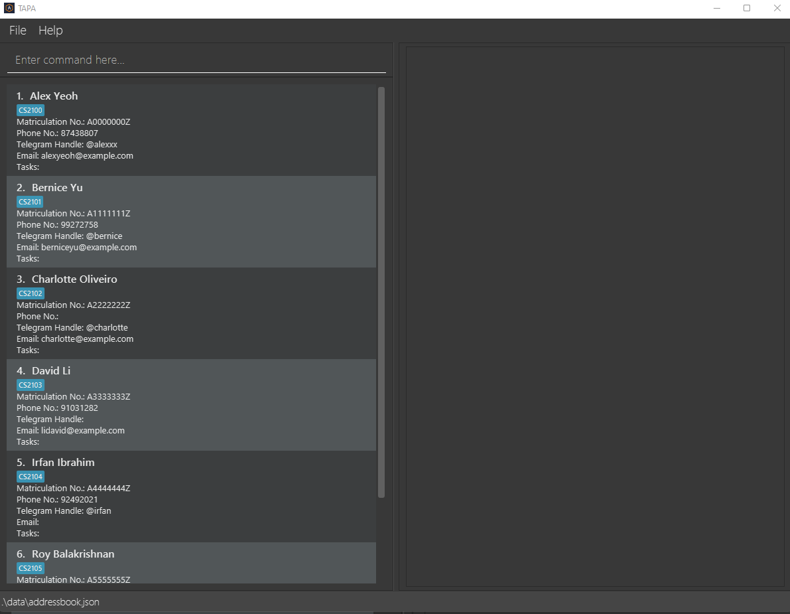

5. Type the desired command in the command box and press the "Enter" key on your keyboard to execute it. For example, typing **`help`** and pressing "Enter" will open the help window. 
    
Here are some example commands you can try:

   * **`list`** : Lists all students in TAPA.

   * **`add`**`i/A0123456Z n/john m/CS2103T p/98765432 t/johnnn e/e0123456@u.nus.edu` : Adds a student named `John` to TAPA.

   * **`delete`**`3` : Deletes the 3rd entry in TAPA.

   * **`manual`**`add` : Display the user manual for the command `add`.

   * **`clear`** : Deletes all students from TAPA.

   * **`exit`** : Exits the app.

7. Refer to the [Features](#features) section below for details of each command.

--------------------------------------------------------------------------------------------------------------------

## Information about contacts in TAPA

After reading the Quick Start guide, you probably have a good idea of how to interact with TAPA. Using the CLI, you can add or delete students, as well as assign tasks to them and check their task progress. This section provides an explanation of the contact information that each student can have. Each student can be added to TAPA with the following fields:

| Field           | Prefix | Description                                                        | Restrictions                                                                                                                                                                     | Multiplicity            |
|-----------------|--------|--------------------------------------------------------------------|----------------------------------------------------------------------------------------------------------------------------------------------------------------------------------|-------------------------|
| STUDENT_ID      | i/     | Denotes the unique identification number of a student              | •Compulsory field •Should not be blank •Should only contain alphanumeric characters •Whitespaces and symbols are not allowed                                            | 1                       |
| MODULE_CODE     | m/     | Denotes the module that a student is currently taking              | •Compulsory field •Should not be blank •Should only contain alphanumeric characters •Whitespaces and symbols are not allowed                                            | 1                       |
| NAME            | n/     | Denotes the name of the student                                    | •Compulsory field •Should not be blank •Should only contain alphanumeric characters and spaces •Symbols are not allowed                                                 | 1                       |
| PHONE           | p/     | Denotes the phone number of the student                            | •Optional field •Should not be blank •Should only contain numeric characters •Letters, whitespaces and symbols are not allowed •Must be at least 3 digits long       | 0 or 1                  |
| TELEGRAM_HANDLE | t/     | Denotes the telegram handle of the student                         | •Optional field •Should not be blank •Should only contain alphanumeric characters •Whitespaces and symbols are not allowed •Must be between 5 to 32 characters long  | 0 or 1                  |
| EMAIL           | e/     | Denotes the email address of the student                           | •Optional field •Should not be blank •Should adhere to the standard email format as mentioned [here](https://snov.io/knowledgebase/what-is-a-valid-email-address-format/ ) | 0 or 1                  |
| TASK            | tn/    | Denotes the name of the task that is being assigned to the student | •Optional field •Should not be blank •Should only contain alphanumeric characters and spaces •Symbols are not allowed                                                   | Any non-negative number |

**:information_source: Note:**  

* Multiplicity refers to the number of instances of each field that a student can have (e.g. a student can have either 0 or 1 phone numbers associated to him/her).

* In TAPA, two students are considered the same only if they have the same student ID (i.e. multiple students can have the same module code/name/phone number/telegram handle/email address but not the same student ID).

* More details regarding the use of prefix can be found in the [Features](#features) section below.

## Features

**Introduction** 
TAPA offers a plethora of features at your disposal. However, you need to use different command formats to execute the various features. Before diving into TAPA's commands and features, do read the following notes to understand how to format your command inputs to TAPA:

 

**:information_source: Notes about the "Format" section for each command:** 

* Each feature in this section has a "Format" descriptor that details how you should input the command in the command box for TAPA to execute. For example, to add a student to TAPA, you have to follow this format: `add i/STUDENT_ID n/STUDENT_NAME m/MODULE_CODE [p/PHONE_NUMBER] [t/TELEGRAM_HANDLE] [e/EMAIL_ADDRESS]​`. This may seem overwhelming at first, but do read on, and you will be a TAPA power user in no time.

* Words in `UPPER_CASE` are parameters to be supplied by the user. 
  Example: For the command `edit STUDENT_INDEX`, `STUDENT_INDEX` is a parameter that you have to provide. 
  Thus, you should input the command `edit 10`, where "10" is the `STUDENT_INDEX`.

* Parameters in square brackets are optional parameters. 
  Example: For the command `edit STUDENT_INDEX [p/PHONE_NUMBER] [m/MODULE_CODE]`, you must supply the `STUDENT_INDEX` parameter in the input, whereas the `PHONE_NUMBER` and `MODULE_CODE` parameters are optional. 
  Thus, you can either input the command `edit 10 p/98765432` (`MODULE_CODE` not specified), or `edit 10 p/98765432 m/CS2103` (`MODULE_CODE` specified).

* Parameters with `…`​ after them can be used multiple times. 
  Example: For the command `delete STUDENT_INDEX…​`, you can input `delete 10` (one `STUDENT_INDEX` parameter), or `delete 10 11 12 13` (multiple `STUDENT_INDEX` parameters).

* Parameters can be inputted in any order. 
  Example: For the command `add i/STUDENT_ID n/NAME m/MODULE_CODE`, you can input `add i/A0123456B n/John Doe m/CS2103` (`NAME` followed by `MODULE_CODE`) or `add i/A0123456B m/CS2103 n/John Doe` (`MODULE_CODE` followed by `NAME`). Both inputs will have the same result.

* If a parameter is expected only once in the command, but the user specified it multiple times, only the last occurrence of the parameter will be taken. 
  Example: For the command `find n/NAME`, if you input the command `find n/John n/Mary`, only `n/Mary` will be interpreted by TAPA.

* Extraneous parameters for commands that do not take in parameters (such as `help`, `list`, `exit` and `clear`) will be ignored. 
  Example: For the command `help`, if you input `help help 123`, the input will be interpreted as `help`.

--------------------------------------------------------------------------------------------------------------------

### Adding a student: `add`

Adds a student to TAPA.

**Format**: `add i/STUDENT_ID n/STUDENT_NAME m/MODULE_CODE [p/PHONE_NUMBER] [t/TELEGRAM_HANDLE] [e/EMAIL_ADDRESS]​`

* The student’s student ID (matriculation number), name as well as module code are compulsory fields.
* The phone number, telegram handle, and email address fields are optional and can be excluded.

:warning: <b>Warning!</b>

* The student's student ID (matriculation number) has to be unique.
* An error message will be displayed to the user if the specified student ID already exists in TAPA.

 

:information_source: <b>Notes:</b>  

* Other than the student ID, all other fields do not have to be unique. For example, two different students could share the same full name.
* The name of the student to be added will be converted to Title Case.
* The current version of TAPA expects that a TA will only teach each student in, at most, one module. Thus, each student to be added can only have one module code.
* You may refer to the [table](#information-about-contacts-in-tapa) above for more information about each individual field of a student.

**Example**:
* `add i/AXXXXXXXR n/john m/CS2103T p/98765432 t/johnnn e/e0123456@u.nus.edu`
    * A student named John is added to TAPA.

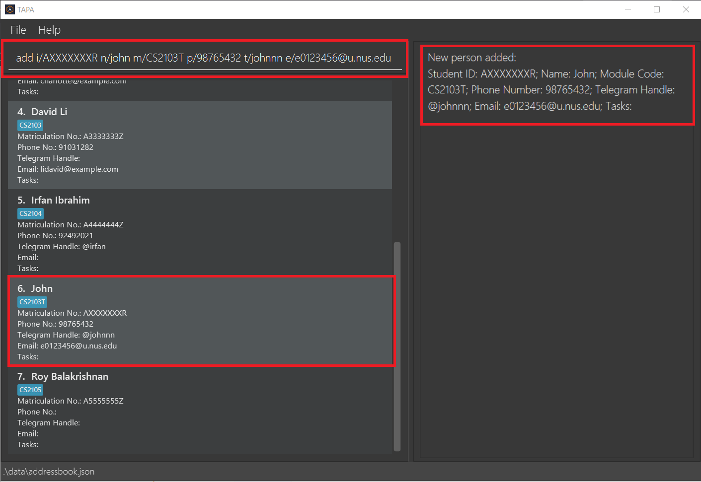

 

### Deleting a student: `delete`

Deletes a student from TAPA.

**Format**: `delete STUDENT_INDEX...` (or) `delete i/STUDENT_ID`

* The student corresponding to the index or student ID (matriculation number) specified after the `delete` command, will be removed from TAPA.

:warning: <b>Warning!</b>

* An error message will be displayed to the user if:
  * the specified index is 0
  * the specified index is a negative number
  * the specified index is larger than the number of students in TAPA
  * there is no student with the specified matriculation number

 

:information_source: <b>Notes:</b> 

* Multiple indices can be inputted in order to delete multiple students. 
* All inputted indices must be valid in order for the command to execute successfully.

**Example**:
* `delete 10`
    * A student named John (whose list index is “10”) is deleted from TAPA.
* `delete 10 20`
    * The students named John and Mary (whose list indices are “10” and “20”) are deleted from TAPA.
* `delete i/A0123456Z`
    * A student named John whose matriculation number is "A0123456Z" is deleted from TAPA.

| Before                                    | After                                     |
|-------------------------------------------|-------------------------------------------|
| 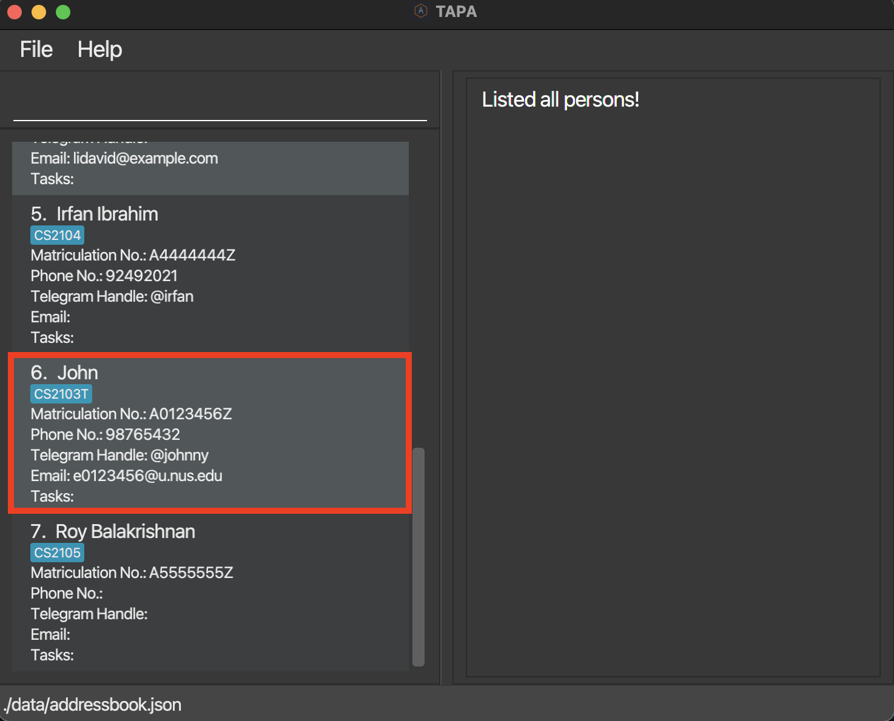 | 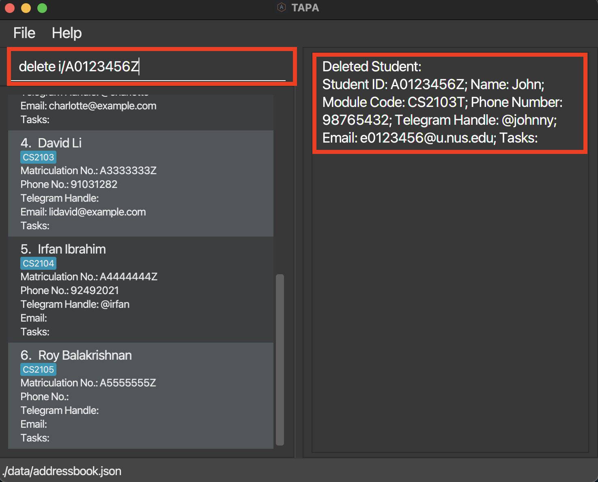 |

--------------------------------------------------------------------------------------------------------------------

### Deleting all students taking a particular module: `deleteModule`

Deletes all students taking a particular module from TAPA.

**Format**: `deleteModule m/MODULE_CODE`

* All students who are taking the module with the module code specified after the `deleteModule` command will be removed from TAPA.

:warning: <b>Warning!</b>

* An error message will be displayed to the user if there are no students taking the specified module.

**Example**:
* `deleteModule m/CS2100`
    * All students who are specified as taking CS2100 are deleted from TAPA.

| Before                                          | After                                           |
|-------------------------------------------------|-------------------------------------------------|
| 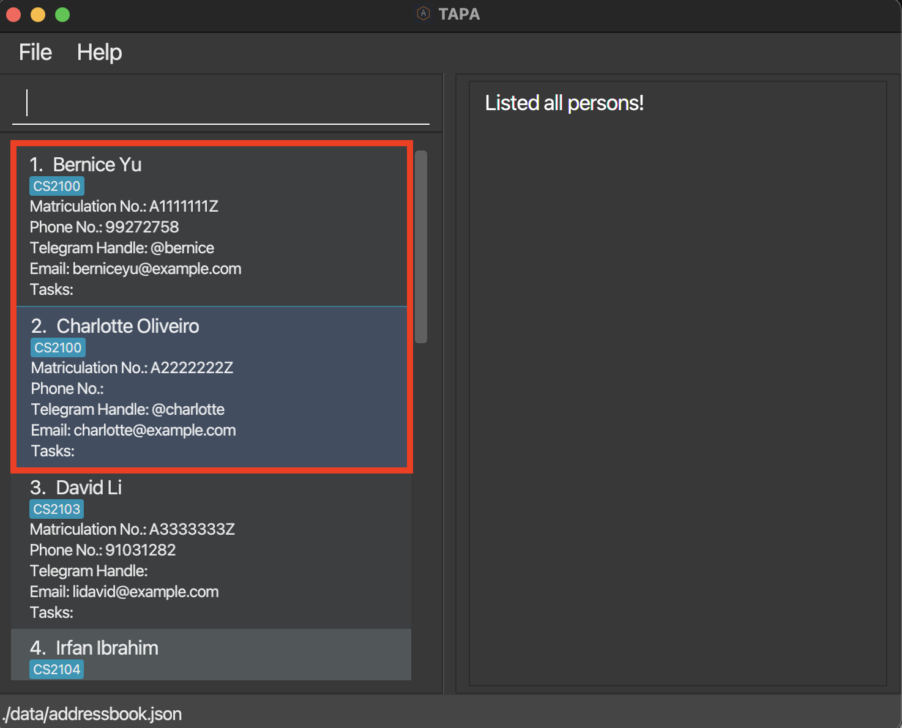 | 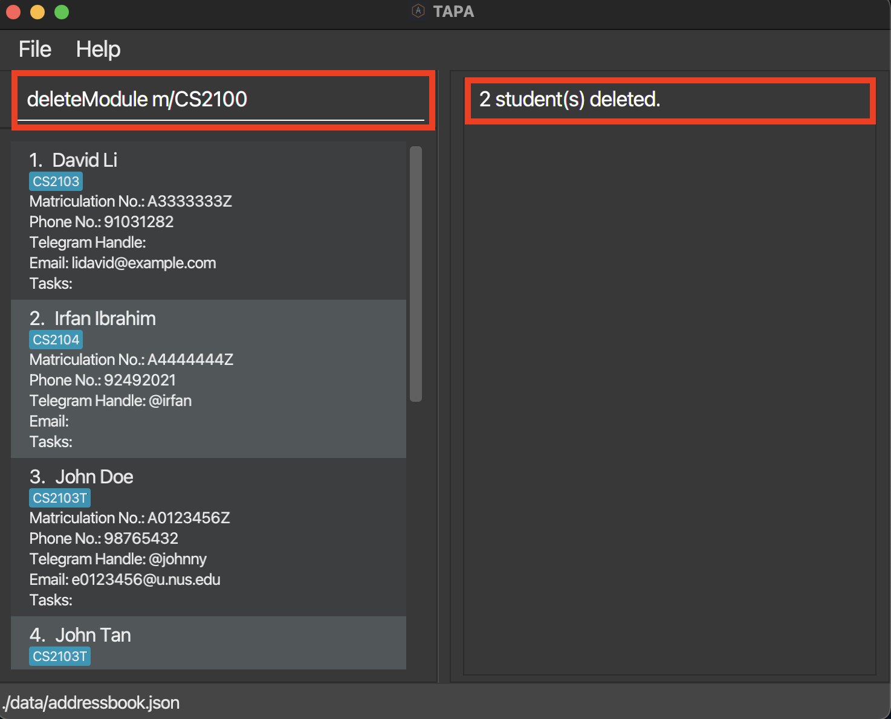 |

--------------------------------------------------------------------------------------------------------------------

### Finding a student: `find`

Allows the user to look up the details of a particular student.

**Format**: `find n/STUDENT_NAME` (or) `find i/STUDENT_ID` (or) `find m/MODULE_CODE`

* The student whose name, student ID or module code is specified after the `find` command will appear in the resulting list.

:warning: <b>Warning!</b>

* Search fields must be exact matches in order for the `find` command to display the result. For example, given a student John in TAPA, `find n/John` will successfully display this student but not `find n/Joh` or `find n/Jo`.

**Example**:
* `find n/John`
    * Displays the particulars of the students whose names include John.

| Before                                  | After                                   |
|-----------------------------------------|-----------------------------------------|
| 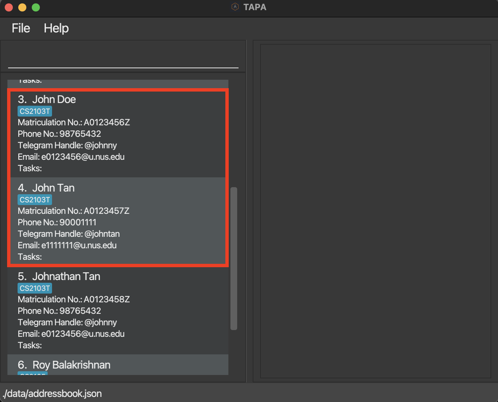 | 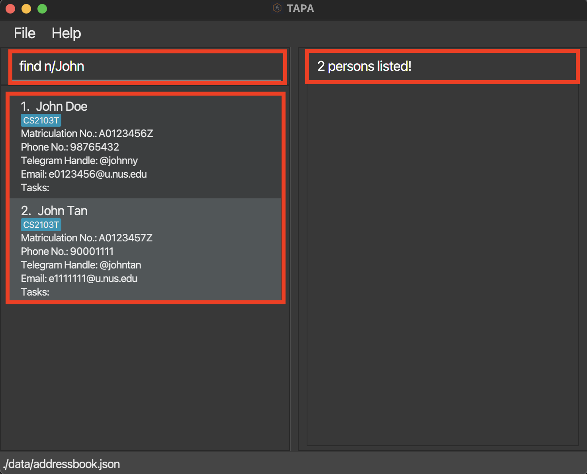 |

* `find i/AXXXXXXXR`
    * Displays the particulars of the student with student ID AXXXXXXXR.
* `find m/CS2103T`
    * Displays the particulars of the student with module code CS2103T. Also works for module codes with varying lengths.

--------------------------------------------------------------------------------------------------------------------

### Checking all the tasks that a student has: `task`

Displays all the tasks that are allocated to a particular student.

**Format**: `task i/STUDENT_ID`

* The completed and uncompleted tasks are separated into 2 different sections.
* An error message will be displayed to the user if there is no student with the specified matriculation number.

**Example**:
* `task i/AXXXXXXXR`
    * Lists out the tasks that student (AXXXXXXXR) has.

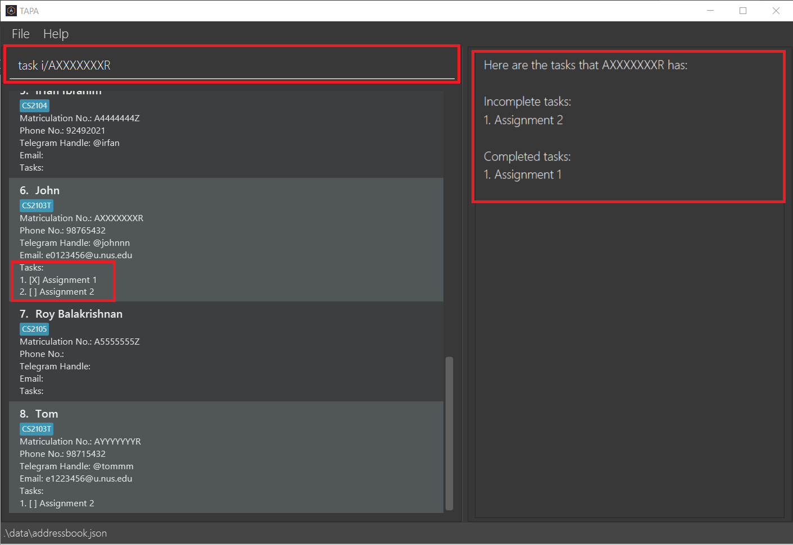

--------------------------------------------------------------------------------------------------------------------

### Marking an undone task as done for a student: `mark`

Marks a specific undone task as done for a particular student.

**Format**: `mark i/STUDENT_ID idx/UNDONE_TASK_INDEX`

* The undone task corresponding to the index or the particular student will be marked as done in the TAPA.
* An error message will be displayed to the user if:
  * the specified index is 0
  * the specified index is a negative number 
  * the specified index is larger than the number of tasks for that particular student
  * the task with that specified index for the particular student is already marked as done

**Example**:
* `mark i/AXXXXXXXR idx/1`
    * Marks the first task in the task list for the student with student ID AXXXXXXXR as done.
  
| Before                                             | After                                              |
|----------------------------------------------------|----------------------------------------------------|
| 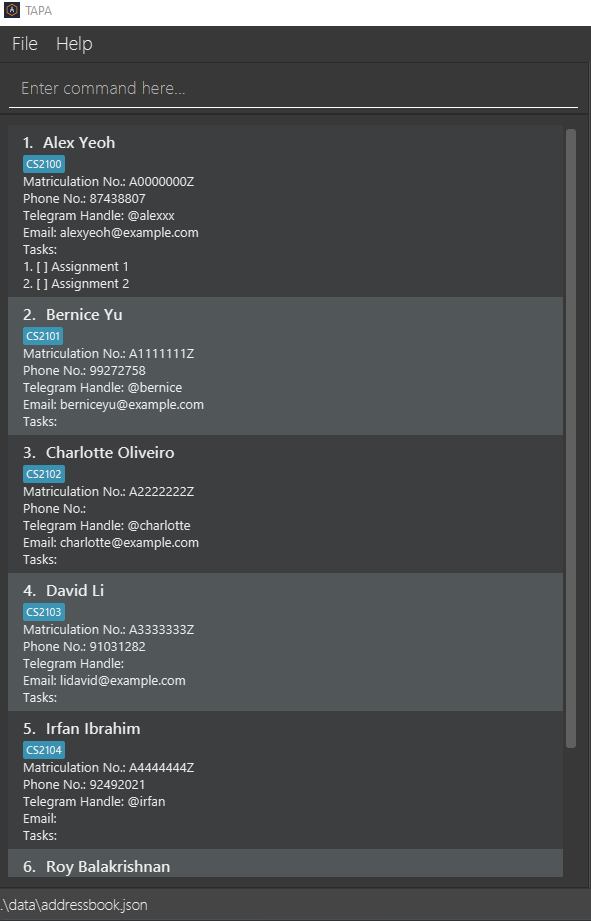 | 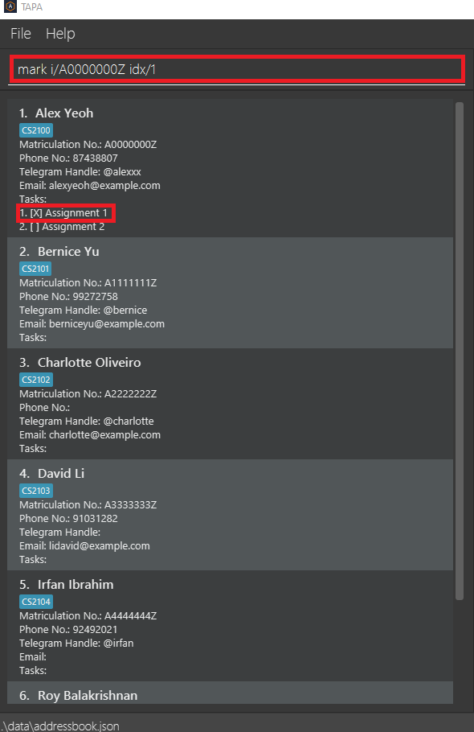 |

### Marking a done task as undone for a student: `unmark`

Marks a specific done task as undone for a particular student.

**Format**: `unmark i/STUDENT_ID idx/DONE_TASK_INDEX`

* The done task corresponding to the index for the particular student will be marked as undone in the TAPA.
* An error message will be displayed to the user if:
  * the specified index is 0
  * the specified index is a negative number
  * the specified index is larger than the number of tasks for that particular student
  * the task with that specified index for the particular student is already marked as undone

**Example**:
* `unmark i/AXXXXXXXR idx/1`
    * Marks the first task in the task list for the student with student ID AXXXXXXXR as undone.

| Before                                               | After                                                |
|------------------------------------------------------|------------------------------------------------------|
|  | 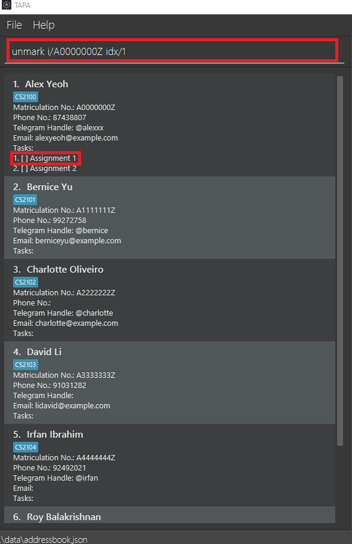 |

### Editing a student's information: `edit`

Edits a student's information in TAPA.

**Format**: `edit STUDENT_INDEX [i/STUDENT_ID] [n/STUDENT_NAME] [m/MODULE_CODE] [p/PHONE_NUMBER] [t/TELEGRAM_HANDLE] [e/EMAIL_ADDRESS]​`

* The index of the student to be edited is a compulsory field.
* The student’s matriculation number, name, module code, phone number, telegram handle, and email address fields are optional and can be excluded. However, at least one field to be edited must be included to execute the `edit` command.
* An error message will be displayed to the user if:
    * the specified index is 0
    * the specified index is a negative number
    * the specified index is larger than the number of students in TAPA
    * the field to be edited is in an invalid format
  
**Example**:

* `edit 2 m/CS2103T p/98765432 t/amirakan e/e4363722@u.nus.edu`
  * A student (whose list index is “2”) has their module, phone number, telegram handle and email address edited.

| Before                                  | After                                   |
|-----------------------------------------|-----------------------------------------|
| 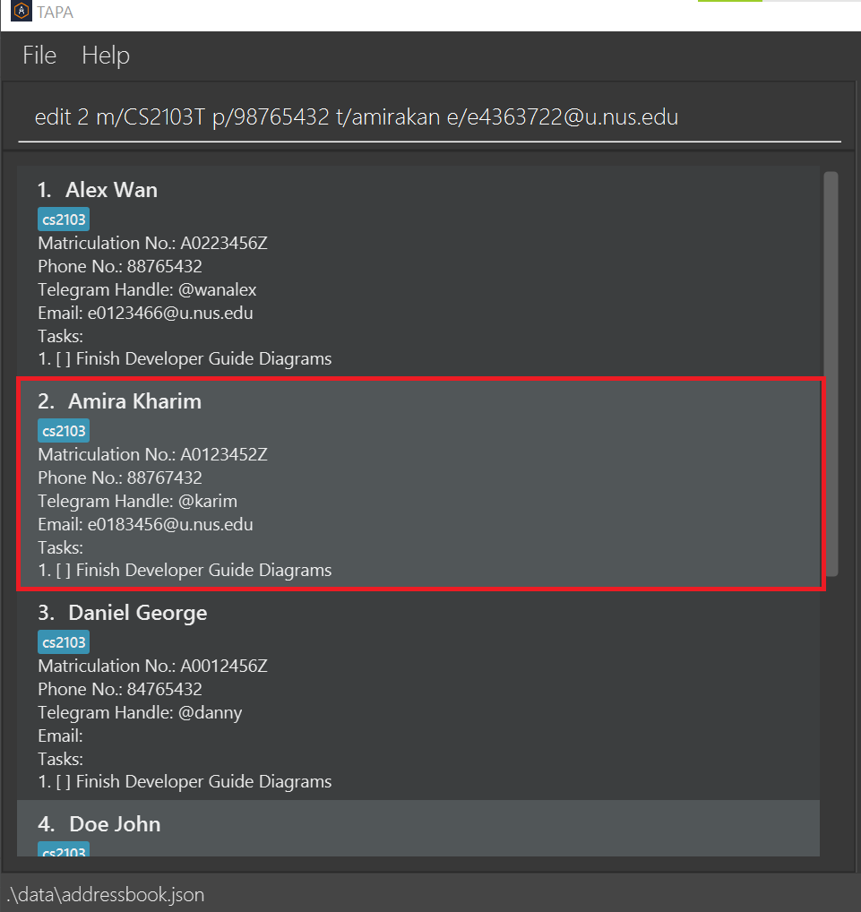 | 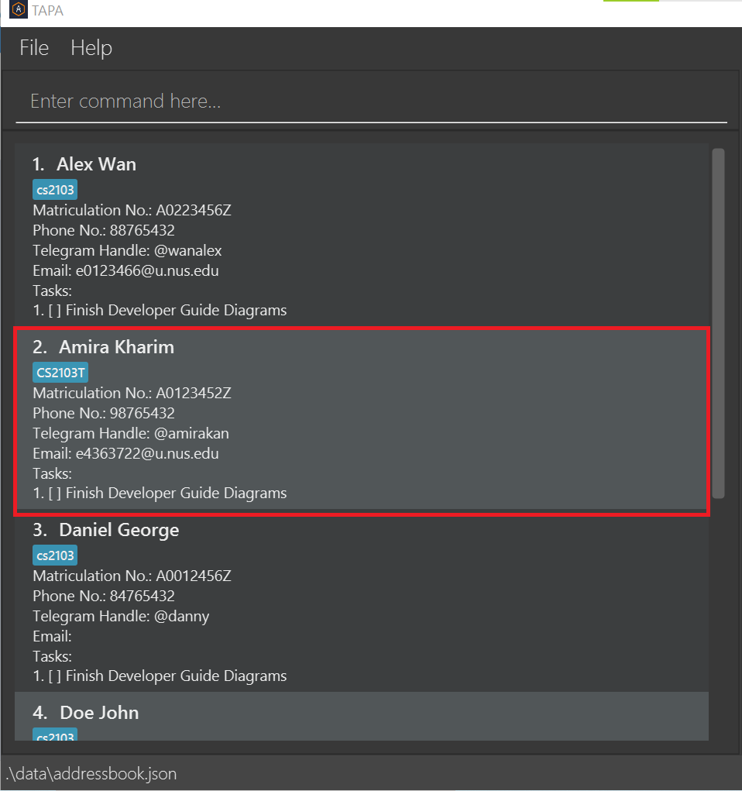 |

--------------------------------------------------------------------------------------------------------------------

:warning: <b>Warning!</b>

* The `edit` command cannot to applied to `Task`.

 

### Deleting all students: `clear`

Clears all students from TAPA.

**Format**: `clear`

* All students and their corresponding details will be removed from TAPA.
* TAPA will request for the user's confirmation before clearing all students.
* A message will be displayed if TAPA is already empty and there are no students to be removed.

:information_source: <b>Notes:</b> 

* Inputting the `clear` command puts TAPA in the "clear confirmation" mode. In this mode, TAPA will not recognise any command other than `confirm`. Inputting any command other than `confirm` will cause TAPA to exit the "clear confirmation" mode and resume its normal operation.
* As clearing TAPA cannot be undone, you will have to click the commandBox again to input `confirm`. (This is an additional measure to ensure a user does not clear TAPA accidentally.) After inputting `confirm`, you can click the commandBox again, then continue to use TAPA as per normal.

--------------------------------------------------------------------------------------------------------------------

**Example**:
* `clear`
    * TAPA enters its "clear confirmation" mode, where a user can input `confirm` to clear all students from TAPA.

* `confirm`
  * All students cleared from TAPA.

| Before                                   | After                                    |
|------------------------------------------|------------------------------------------|
| 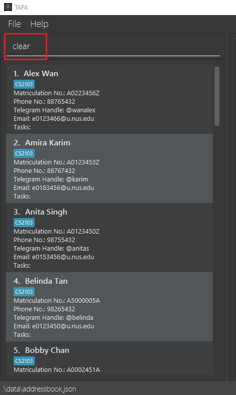 | 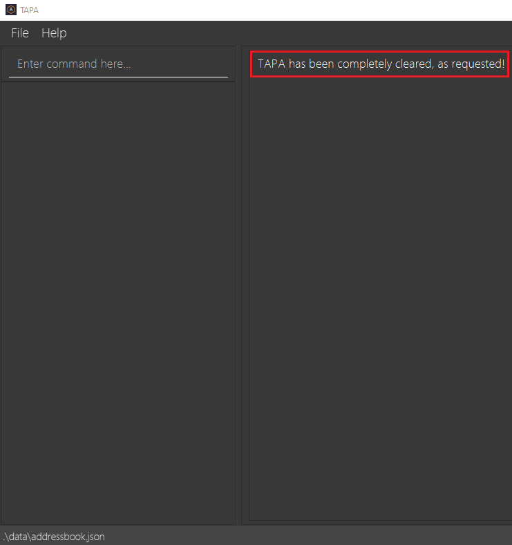 |

### Archiving details in TAPA: `archive`

Saves a copy of the details currently saved in TAPA into a separate file.

**Format**: `archive`

* A copy of the details currently saved in TAPA will be saved to a separate file.
* The file name will be the date and time of the archive operation.
* This file will be saved in the same directory as the original `.json` data file.

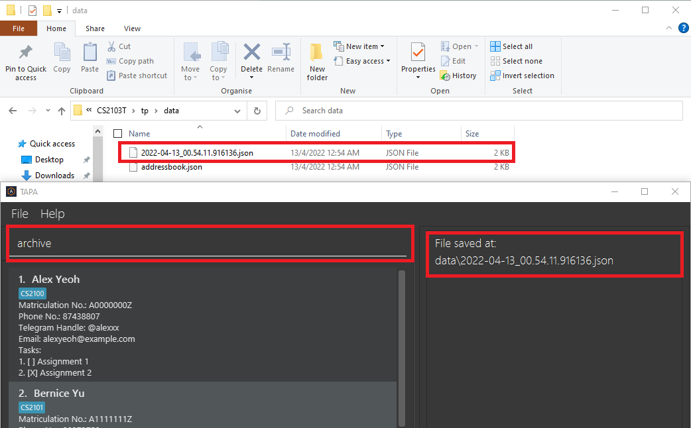

--------------------------------------------------------------------------------------------------------------------

### Listing the student details: `list`

Displays all the students enrolled in a list.

**Format**: `list`

* Displays the students from the list of students in alphabetical order (sorted using the `Name` field).
* The students are indexed as 1, 2, 3, ......

**Example**:
* `list`
    * Displays all the enrolled students in alphabetical order.
  
| Before                                             | After                                              |
|----------------------------------------------------|----------------------------------------------------|
| 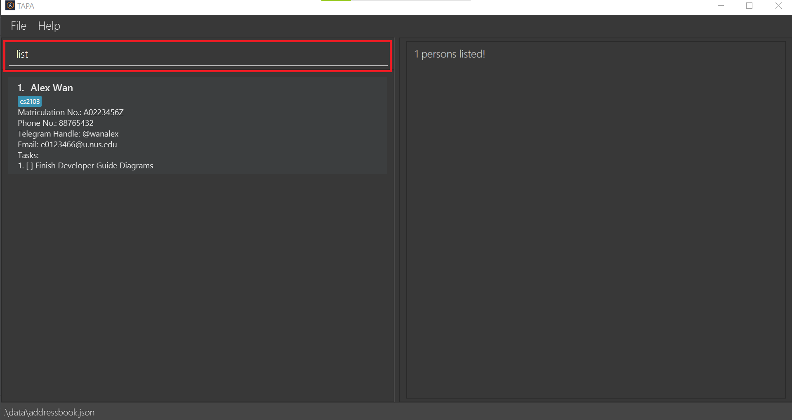 | 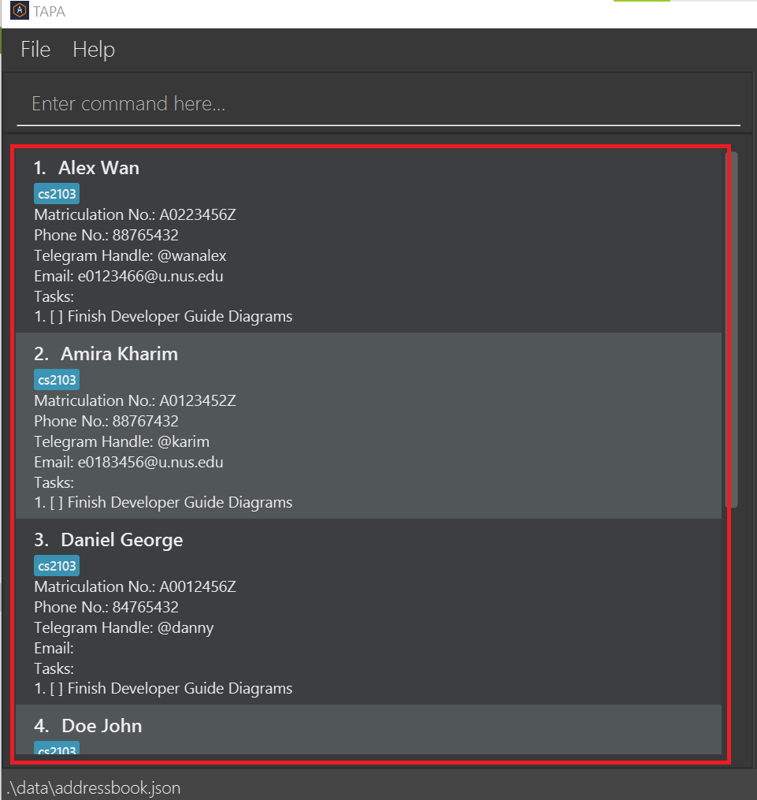 |

--------------------------------------------------------------------------------------------------------------------

### Assigning tasks to a particular student: `assign`

Assigns a task to a particular student.

**Format**: `assign i/STUDENT_ID tn/TASK_NAME` (or) `assign m/MODULE_CODE tn/TASK_NAME`

**Example**:
* `assign i/A0223456Z tn/Submit User Guide`
    * Assigns Submit User Guide to student with id A0223456Z.

| Before                                                          | After                                                           |
|-----------------------------------------------------------------|-----------------------------------------------------------------|
| 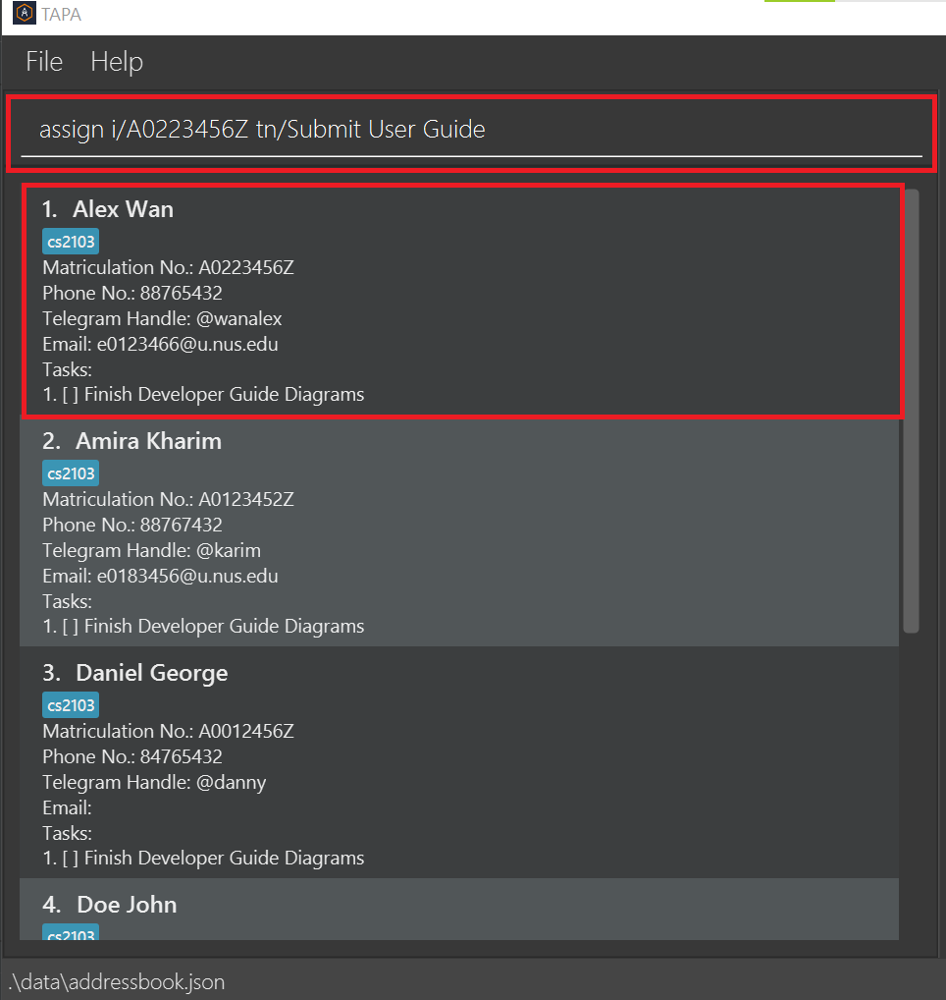 | 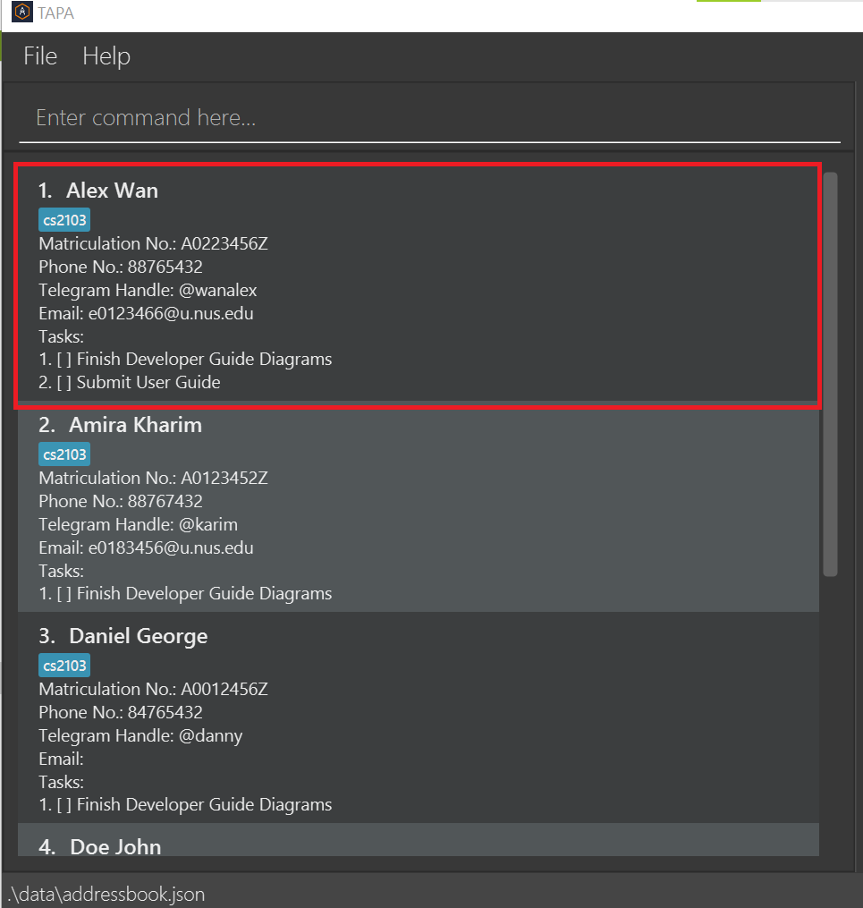 |

        

* `assign m/CS2103 tn/Create IP Release`
    * Assigns Create Ip Release task to students taking module CS2103.

| Before                                                           | After                                                            |
|------------------------------------------------------------------|------------------------------------------------------------------|
| 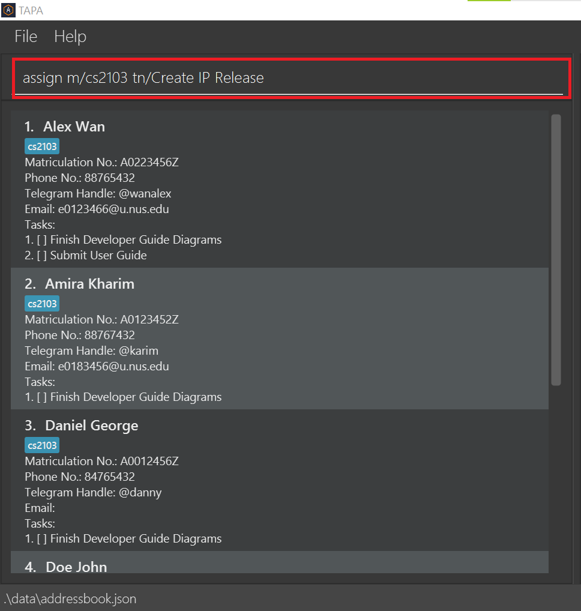 | 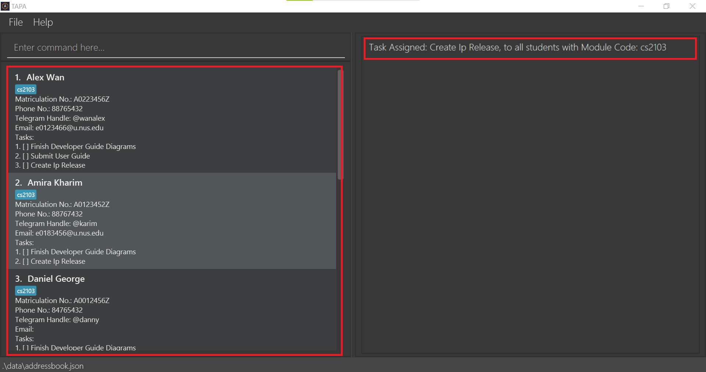 |

:warning: <b>Warning!</b>

* As `MODULE_CODE` is case-sensitive, the user should ensure that the capitalisation of the module should be correct, or else the task would not be assigned properly.

:information_source:
<b>Note:</b>

* The name of the assigned task will be converted to Title Case.

--------------------------------------------------------------------------------------------------------------------

### Viewing the completion status of a particular task: `progress`

Displays a list of students who are taking the specified module, and have been assigned with a particular task.
The completion status of each student in the list will be displayed as well.

**Format**: `progress m/MODULE_CODE tn/TASK_NAME`

* The module code and task name are compulsory fields.

**Example**:
* `progress m/CS2103T tn/assignment 1`
    * Displays all students who are taking "CS2103T" and have been assigned with "assignment 1".
    * For each student in the output list, a :heavy_check_mark: "tick" symbol signifies that he/she has already
      completed the assigned task.
    * On the other hand, a :x: "cross" symbol signifies that the student has not complete the assigned task.

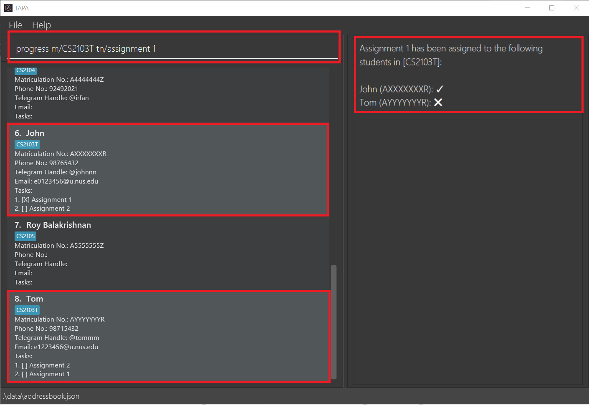

--------------------------------------------------------------------------------------------------------------------

### Deleting previously assigned task: `deleteTask`

Deletes a task from a particular student's list of tasks.

**Format**: `deleteTask i/STUDENT_ID idx/INDEX` (or) `deleteTask m/MODULE_CODE tn/TASK_NAME`

An error message will be displayed if:
* the specified index is 0
* the specified index is a negative number
* the specified index is larger than the number of tasks for that particular student
* the student with the given student ID does not exist
* none of the students taking the module had previously been assigned the task with the given task name
* none of the students are taking a module with the given module code

**Example**:
* `deleteTask i/A0223456Z idx/2`
    * Deletes task at index 2 from the student's list of assigned task, provided that a task exists at that index.

| Before                                                   | After                                                          |
|----------------------------------------------------------|----------------------------------------------------------------|
| 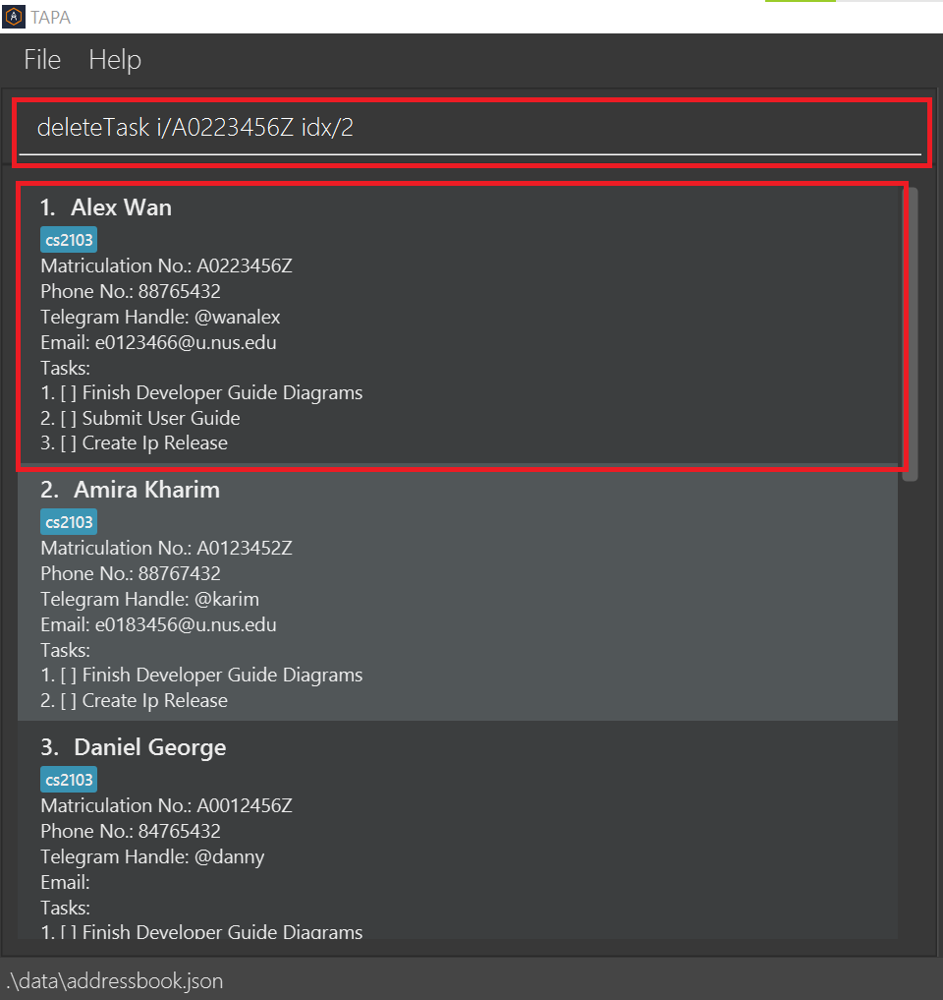 |  |

  

* `deleteTask m/cs2103 tn/Create Ip Release`
    * Deletes Create Ip Release task that was previously assigned to any of the students taking CS2103 module.

| Before                                                               | After                                                            |
|----------------------------------------------------------------------|------------------------------------------------------------------|
|  | 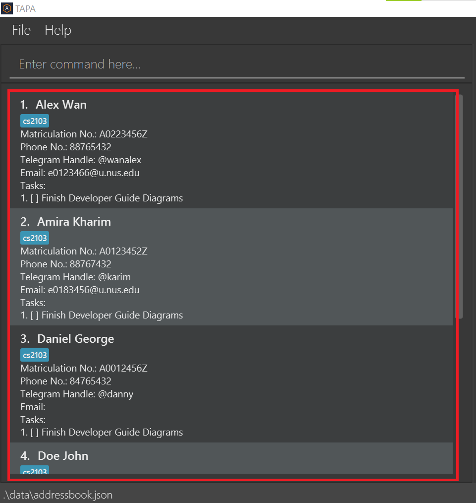 |

 

### Viewing previously executed commands: `history`

Displays a list of previous commands that were executed successfully.

:information_source: <b>Quick Tip!</b> 

* Aside from the `history` command, you can also use the :arrow_up_small: Up and :arrow_down_small: Down arrow keys on your keyboard to navigate through your previously executed commands.

**Format**: `history`

* Displays the list of previously executed commands in chronological order (from the earliest command to most recent command).
* The commands are displayed exactly as they were inputted by the user.
* The commands are indexed as 1, 2, 3, ......

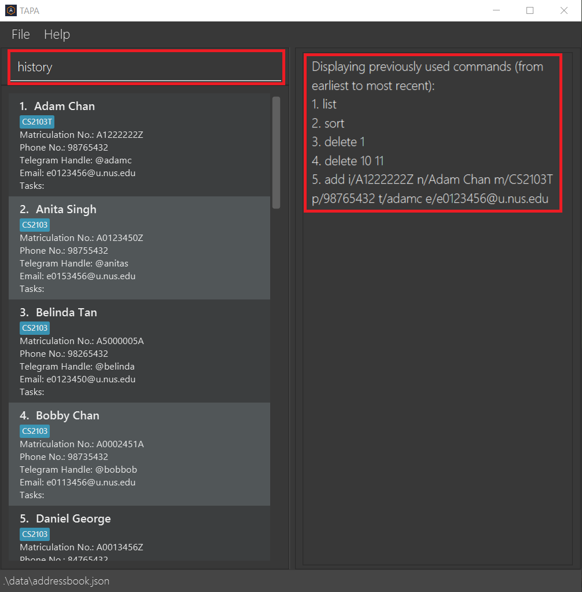
 

### Undoing the previous command: `undo`

Reverts the changes made by the previously executed command.

**Format**: `undo`

* Reverts the changes of the previously executed command, and removes the command from history.

:warning: <b>Warning!</b>

* The effects of the [`clear` command](https://ay2122s2-cs2103t-w09-4.github.io/tp/UserGuide.html#deleting-all-students-clear) and the [`undo` command](https://ay2122s2-cs2103t-w09-4.github.io/tp/UserGuide.html#undoing-the-previous-command-undo) cannot be undone!

:information_source: <b>Notes:</b> 

* While other apps may only allow the undoing of commands that alter stored details, TAPA's `undo` command can revert the changes of almost every command other than `clear` and `undo` itself. (This would include commands like `list`, `sort`, and `add`.) This feature is intended to aid the user in undoing their intended command, since it can be difficult to remember which commands can be undone, or to keep track of the last command that made changes to stored details.
* Inputting `undo` after the [`archive` command](https://ay2122s2-cs2103t-w09-4.github.io/tp/UserGuide.html#archiving-details-in-the-address-book-archive) will not delete the copy of TAPA that has been saved in a separate file.

**Example**:
* `undo`
    * Displays the command that has been undone.
    * The changes made by the previously executed command are undone.
    * The undone command is removed from the history of commands.
    
| Before                                  | After                                   |
|-----------------------------------------|-----------------------------------------|
| 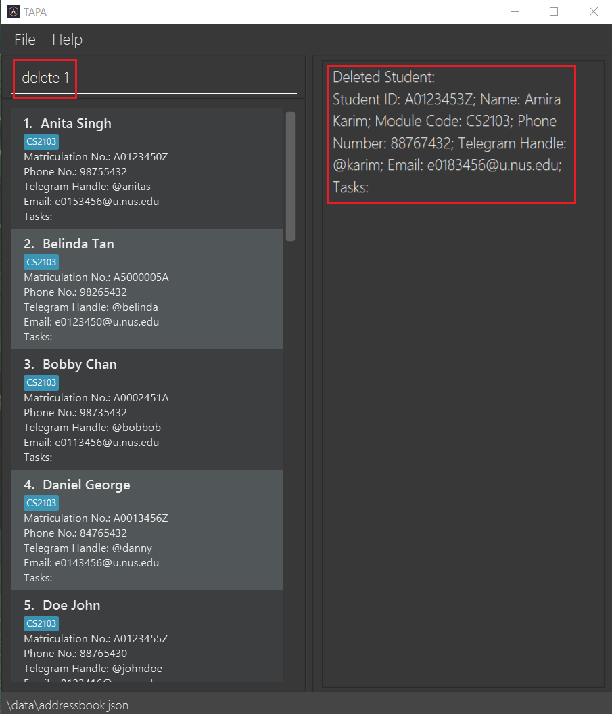 | 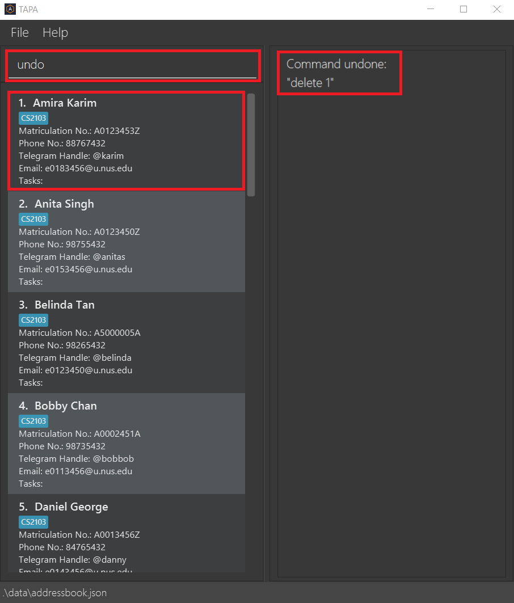 |

 

### Sorting the list of students by the number of undone tasks: `sort`

Sorts and displays the students in TAPA by the number of undone tasks in **descending** order.

**Format**: `sort`

* Displays the students from the list of students by the number of undone tasks in **descending** order.
* The students are indexed as 1, 2, 3, ......

**Example**:
* `sort`
    * Displays all the enrolled students by the number of undone tasks in **descending** order.

| Before                                             | After                                              |
|----------------------------------------------------|----------------------------------------------------|
| 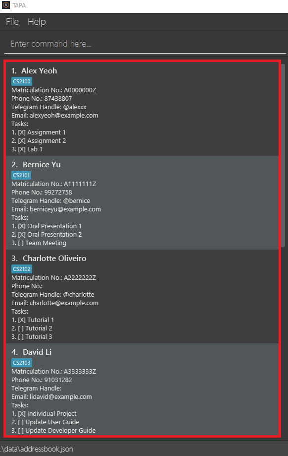 | 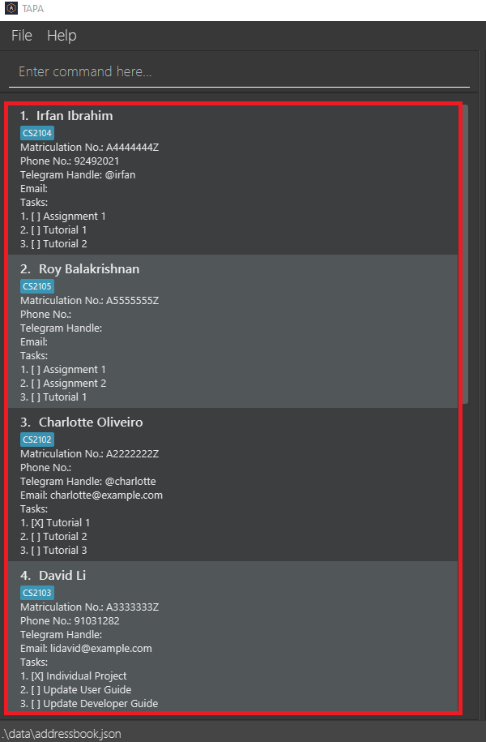 |

--------------------------------------------------------------------------------------------------------------------

### Displaying manual for a command: `manual`

Display the format and a short description for a specified command.

**Format**: `manual [COMMAND_NAME]`

* The format of the command corresponding to the command name will be displayed, along with a short description.
* If there are no inputs for the command name, all the available commands will be displayed.
* An error message will be displayed to the user if the user input a command name that is invalid.

**Example**:
* `manual add`
    * Display the format for the command add, and briefly describes the command.
* `manual`
    * Display all available commands.

| manual                                               | manual progress                                      |
|------------------------------------------------------|------------------------------------------------------|
| 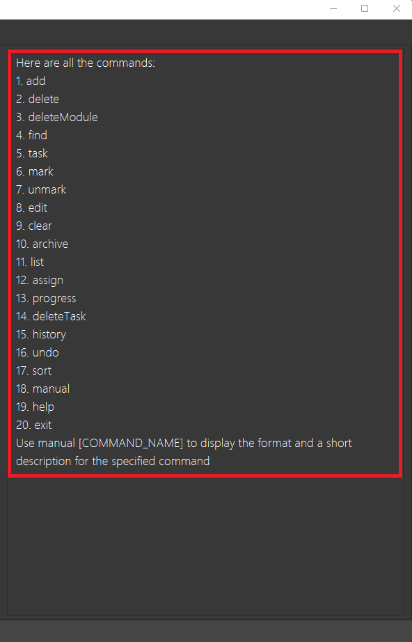 | 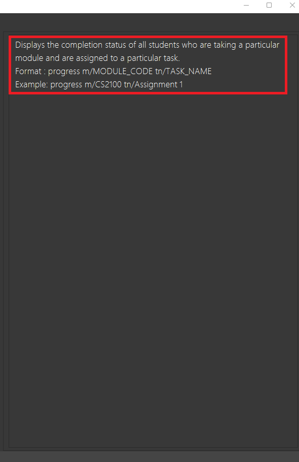 |

 

### Viewing help : `help`

Shows a pop-up window explaining how to access the user guide.

**Format**: `help`

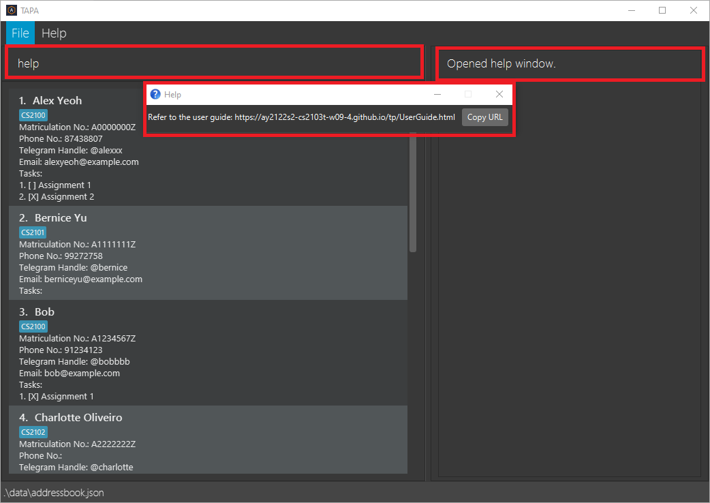

 

### Exiting the program : `exit`

Exits the program.

**Format**: `exit`

 

--------------------------------------------------------------------------------------------------------------------

## FAQ

**Q**: How do I get started with TAPA? 
**A**: You can refer to the [Quick Start](https://ay2122s2-cs2103t-w09-4.github.io/tp/UserGuide.html#quick-start) section of this guide to start using TAPA as soon as possible!

**Q**: I am not comfortable using a CLI. Do you have any tips on how I can get started? 
**A**: CLI refers to a Command Line Interface. As you may have noticed, rather than clicking buttons to operate TAPA, you type commands into the command box. TAPA was designed with fast typists in mind, who can make the most of a CLI to speed up their student management processes. To learn to use a CLI on your computer's terminal, you can read [this guide](https://www.w3schools.com/whatis/whatis_cli.asp). Alternatively, the [Features](#features) section of this guide explains how you can use the CLI in TAPA.

**Q**: I already know how to use TAPA. How can I view a list of available commands within TAPA? 
**A**: You can input the command `manual` to view the list of commands used within TAPA. Alternatively, you can refer to the [Command Summary](https://ay2122s2-cs2103t-w09-4.github.io/tp/UserGuide.html#command-summary) section below.

**Q**: I have a question about TAPA that is not on the FAQ. **OR** I think a feature of TAPA does not function as expected. Who can I talk to about this? 
**A**: Feel free to reach out to one of our team members [here](https://ay2122s2-cs2103t-w09-4.github.io/tp/AboutUs.html). Alternatively, since TAPA is open-source, you can start developing TAPA to suit your needs [here](https://ay2122s2-cs2103t-w09-4.github.io/tp/DeveloperGuide.html).

**Q**: Who developed this amazing app? 
**A**: You can find more details about our team on TAPA's [About Us](https://ay2122s2-cs2103t-w09-4.github.io/tp/AboutUs.html) page!
--------------------------------------------------------------------------------------------------------------------

## Command summary

You can think of this Command Summary as a cheatsheet to using TAPA.
Each action that TAPA can perform is listed next to the format you should use to execute that command, as well as an example of how the command can be used.

For example, say you are using TAPA and would like to see the manual description for the `add` command.

As seen in the Command Summary below, you can input `manual add` to view a short description of the `add` command.

If you would like to learn more about a specific command, you can read more about it in the [Features](https://ay2122s2-cs2103t-w09-4.github.io/tp/UserGuide.html#features) section above!

| Action            | Command Format                                                                                                                      | Example                                                                      |
|-------------------|-------------------------------------------------------------------------------------------------------------------------------------|------------------------------------------------------------------------------|
| **Add**           | `add i/MATRICULATION_NO n/STUDENT_NAME m/MODULE_CODE [p/PHONE_NUMBER] [t/TELEGRAM_HANDLE] [e/EMAIL_ADDRESS] `                       | `add i/AXXXXXXXR n/john m/CS2103T p/98765432 t/johnnn e/e0123456@u.nus.edu`  |
| **Delete**        | `delete STUDENT_INDEX...` (or) `delete i/STUDENT_ID`                                                                                | `delete 10` (or) `delete 10 20` (or) `delete i/AXXXXXXXR`                    |
| **Delete Module** | `deleteModule m/MODULE_CODE`                                                                                                        | `deleteModule m/CS2100`                                                      |
| **Find**          | `find n/STUDENT_NAME` (or) `find i/STUDENT_ID` (or) `find m/MODULE_CODE`                                                            | `find n/john` (or) `find i/AXXXXXXXR` (or) `find m/CS2103T`                  |
| **Task**          | `task i/STUDENT_ID`                                                                                                                 | `task i/AXXXXXXXR`                                                           |
| **Mark**          | `mark i/STUDENT_ID idx/UNDONE_TASK_INDEX`                                                                                           | `mark i/AXXXXXXXR idx/1`                                                     |
| **Unmark**        | `unmark i/STUDENT_ID idx/DONE_TASK_INDEX`                                                                                           | `unmark i/AXXXXXXXR idx/1`                                                   |
| **Edit**          | `edit STUDENT_INDEX [i/MATRICULATION_NO] [n/STUDENT_NAME] [m/MODULE_CODE] [p/PHONE_NUMBER] [t/TELEGRAM_HANDLE] [e/EMAIL_ADDRESS] `  | `edit 10 m/CS2103T p/98765432 t/johnnn e/e0123456@nus.edu.sg`                |
| **Clear**         | `clear`                                                                                                                             | `clear`                                                                      |
| **Archive**       | `archive`                                                                                                                           | `archive`                                                                    |
| **List**          | `list`                                                                                                                              | `list`                                                                       |
| **Assign**        | `assign i/STUDENT_ID tn/TASK_NAME` (or) `assign m/MODULE_CODE tn/TASK_NAME`                                                         | `task i/AXXXXXXXR tn/assignment 1` (or) `assign m/CS2103T tn/assignment 2`   |
| **Progress**      | `progress m/MODULE_CODE tn/TASK_NAME`                                                                                               | `progress m/CS2103T tn/assignment 1`                                         |
| **Delete Task**   | `deleteTask i/STUDENT_ID idx/INDEX` (or) `deleteTask m/MODULE_CODE tn/TASK_NAME`                                                    | `deleteTask i/AXXXXXXXR idx/3` (or) `deleteTask m/CS2030 tn/Assignment 1`    |
| **History**       | `history`                                                                                                                           | `history`                                                                    |
| **Undo**          | `undo`                                                                                                                              | `undo`                                                                       |
| **Sort**          | `sort`                                                                                                                              | `sort`                                                                       |
| **Manual**        | `manual [COMMAND_NAME]`                                                                                                             | `manual` (or) `manual add`                                                   |            
| **Help**          | `help`                                                                                                                              | `help`                                                                       |
| **Exit**          | `exit`                                                                                                                              | `exit`                                                                       |

## Glossary
* **Mainstream OS**: Windows, Linux, Unix, OS-X.
* **Module**: A specific class that a student is taking.
* **Tag**: A category that the student belong to (usually denotes the module that is currently being taken).
* **Person**: A student in TAPA.
* **Student ID/Matriculation number**: Used interchangeably to refer to the unique identification number of a student.
* **Field**: An input that comprises information of a student in TAPA. For example, you can add a student with several fields (like their name, and email) to TAPA.

