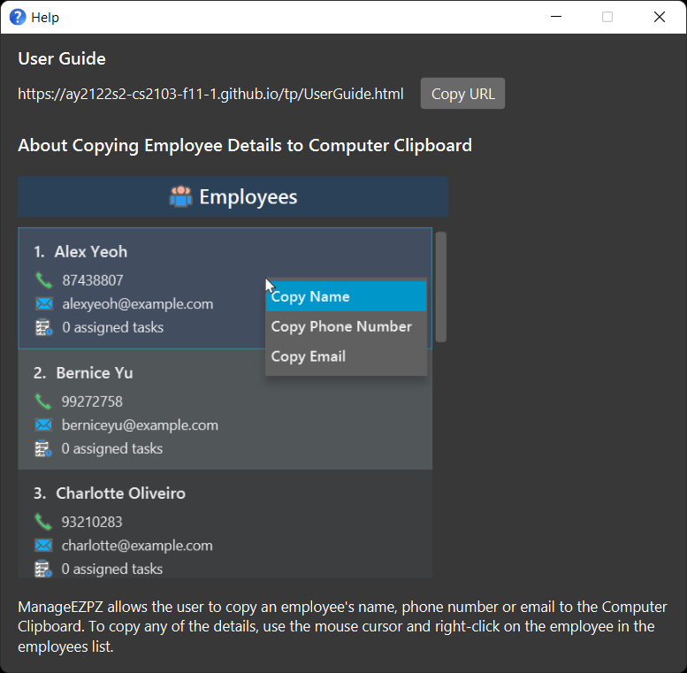

ManageEZPZ is a **desktop app for that allows managers or supervisors to manage employees and assign tasks to them.  Optimized for use via a Command Line Interface** (CLI) while still having the benefits of a Graphical User Interface (GUI).

--------------------------------------------------------------------------------------------------------------------

## Quick start

1. Ensure you have Java `11` or above installed in your Computer.

2. Download the latest `ManageEZPZ.jar` from [here](https://github.com/AY2122S2-CS2103-F11-1/tp/releases).

3. Copy the file to the folder you want to use as the _home folder_ for your ManageEZPZ.

4. Double-click the file to start the app.

5. Start communicating with ManageEZPZ using the command box.

6. Type the command in the command box and press Enter to execute it. e.g. typing **`help`** and pressing Enter will open the help window. 
   Some example commands you can try:

   * **`list all/`** : Lists all Tasks.

   * **`addEmployee`**`n/John Doe p/98765432 e/johnd@example.com` : Adds a contact named `John Doe` to ManageEZPZ.

   * **`delete`**`3` : Deletes the 3rd Task shown in the Task list.

   * **`clear`** : Deletes all Tasks.
   
   * **`addTodo desc/read book`** : Adds a todo task with a description of `read book` to the Task list.

   * **`exit`** : Exits the app.
   
--------------------------------------------------------------------------------------------------------------------

## Features

**:information_source: Notes about the command format:** 

* Words in `UPPER_CASE` are the parameters to be supplied by the user. 
  e.g. in `addEmployee n/NAME`, `NAME` is a parameter which can be used as `add n/John Doe`.

* Parameters for adding employees can be in any order. 
  e.g. if the command specifies `n/NAME p/PHONE_NUMBER`, `p/PHONE_NUMBER n/NAME` is also acceptable.

* If a parameter is expected only once in the command but you specified it multiple times, only the last occurrence of the parameter will be taken. 
  e.g. if you specify `p/12341234 p/56785678`, only `p/56785678` will be taken.

* Extraneous parameters for commands that do not take in parameters (such as `help`, `exit` and `clear`) will be ignored. 
  e.g. if the command specifies `help 123`, it will be interpreted as `help`.

* Task related Commands must be strictly lower case.

* Task related parameters must be in sequence as shown in the instruction.

### Viewing help : `help`

Shows a message explaining how to access the help page.

Format: `help`

### Adding a person: `addEmployee`

Adds an employee to ManageEZPZ.

Format: `addEmployee n/NAME p/PHONE_NUMBER e/EMAIL`

Examples:
* `addEmployee n/John Doe p/98765432 e/johnd@example.com`
* `addEmployee p/98754123 n/Betsy Crowe e/betsycrowe@example.com`

### Adding a Task: `addTodo`, `addEvent`, `addDeadline`

Adds a Task into the Task list.

Format:

* `addTodo desc/TASK_DESCRIPTION`
* `addTDeadline desc/TASK_DESCRIPTION by/DATE TIME`
* `addEvent desc/TASK_DESCRIPTION at/DATE START_TIME END_TIME`

:bulb: **Take Note:**
For deadline and event, the DATE must be in this format: DD-MM-YYYY HHmm (in 24 hr format)

### Listing all Tasks : `listTask`

Shows a list of all tasks in ManageEZPZ.

Format:

* `listTask`

### Marking a task as done : `mark`
Mark a task in the Task list as done :

Format: `mark INDEX`

* Marks the task at the specified `INDEX`.
* The index refers to the index number shown in the displayed Task list.
* The index **must be a positive integer** 1, 2, 3, …​

### UnMarking a task as done : `unmark`
Mark a task in the Task list as done :

Format: `unmark INDEX`

* UnMarks the task at the specified `INDEX`.
* The index refers to the index number shown in the displayed Task list.
* The index **must be a positive integer** 1, 2, 3, …​

### Deleting a Task : `delete`
Deletes the specified Task from the List.

Format: `delete INDEX`

* Deletes the task at the specified `INDEX`.
* The index refers to the index number shown in the displayed Task list.
* The index **must be a positive integer** 1, 2, 3, …​

Examples:
* `delete 2` deletes the 2nd Task in the Task list.

### Locating Task by description or Date: `find`

Find tasks based on the task description or date in the format of (DD-MM-YYYY).

Format: 
* `find task/ desc/TASK_DESCRIPTION`
* `find task/ date/DD-MM-YYYY`

Examples:
* `find task/ desc/homework`
* `find date/02-02-2022`

### Locating employees by name:

### Clearing all entries : `clear`

Clears all entries from the Task list.

Format: `clear`

### Exiting the program : `exit`

Exits the program.

Format: `exit`

### Saving the data

ManageEZPZ data are saved in the hard disk automatically after any command that changes the data. There is no need to save manually.

### Editing the data file

ManageEZPZ data are saved as a JSON file `[JAR file location]/data/ManageEZPZ.json`. Advanced users are welcome to update data directly by editing that data file.

:exclamation: **Caution:**
If your changes to the data file makes its format invalid, ManageEZPZ will discard all data and start with an empty data file at the next run.

### Tagging Tasks to Employees `[coming in v1.3]`

_Details coming soon ..._

--------------------------------------------------------------------------------------------------------------------

## FAQ

**Q**: How do I transfer my data to another Computer? 
**A**: Install the app in the other computer and overwrite the empty data file it creates with the file that contains the data of your previous ManageEZPZ home folder.

--------------------------------------------------------------------------------------------------------------------

## Command summary

Action | Format, Examples
--------|------------------
**Add Employee** | `addEmployee n/NAME p/PHONE_NUMBER e/EMAIL`   e.g., `addEmployee n/James Ho p/22224444 e/jamesho@example.com`
**Add Task** | `TASK_TYPE desc/TASK_DESCRIPTION`   e.g., `addTodo desc/read book`  `addDeadline desc/Use up resin /by 2022-15-03 0400` 
**Clear** | `clear`
**Delete** | `delete INDEX`  e.g., `delete 3`
**Find** | `find task/TASK_DESCRIPTION`   e.g., `find task/homework`
**List** | `list`
**Help** | `help`
