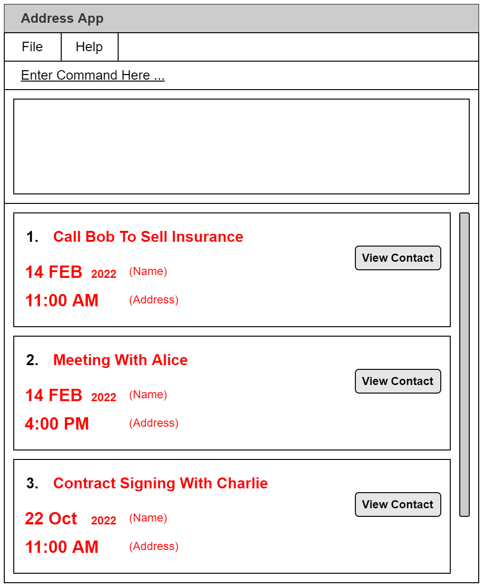
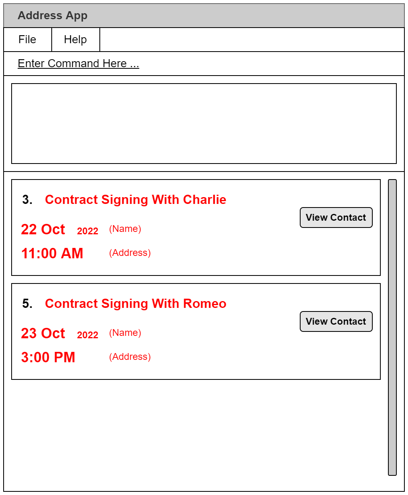

AddressBook Level 3 (AB3) is a **desktop app for managing contacts, optimized for use via a Command Line Interface** (CLI) while still having the benefits of a Graphical User Interface (GUI). If you can type fast, AB3 can get your contact management tasks done faster than traditional GUI apps.

* Table of Contents
{:toc}

--------------------------------------------------------------------------------------------------------------------

## Quick start

1. Ensure you have Java `11` or above installed in your Computer.

1. Download the latest `addressbook.jar` from [here](https://github.com/se-edu/addressbook-level3/releases).

1. Copy the file to the folder you want to use as the _home folder_ for your AddressBook.

1. Double-click the file to start the app. The GUI similar to the below should appear in a few seconds. Note how the app contains some sample data. 
   

1. Type the command in the command box and press Enter to execute it. e.g. typing **`help`** and pressing Enter will open the help window. 
   Some example commands you can try:

   * **`list`** : Lists all contacts.

   * **`add`**`n/John Doe p/98765432 e/johnd@example.com a/John street, block 123, #01-01` : Adds a contact named `John Doe` to the Address Book.

   * **`delete`**`3` : Deletes the 3rd contact shown in the current list.

   * **`clear`** : Deletes all contacts.

   * **`exit`** : Exits the app.

1. Refer to the [Features](#features) below for details of each command.

--------------------------------------------------------------------------------------------------------------------

## Features

**:information_source: Notes about the command format:** 

* Words in `UPPER_CASE` are the parameters to be supplied by the user. 
  e.g. in `add n/NAME`, `NAME` is a parameter which can be used as `add n/John Doe`.

* Items in square brackets are optional. 
  e.g `n/NAME [t/TAG]` can be used as `n/John Doe t/friend` or as `n/John Doe`.

* Items with `…`​ after them can be used multiple times including zero times. 
  e.g. `[t/TAG]…​` can be used as ` ` (i.e. 0 times), `t/friend`, `t/friend t/family` etc.

* Parameters can be in any order. 
  e.g. if the command specifies `n/NAME p/PHONE_NUMBER`, `p/PHONE_NUMBER n/NAME` is also acceptable.

* If a parameter is expected only once in the command but you specified it multiple times, only the last occurrence of the parameter will be taken. 
  e.g. if you specify `p/12341234 p/56785678`, only `p/56785678` will be taken.

* Extraneous parameters for commands that do not take in parameters (such as `help`, `list`, `exit` and `clear`) will be ignored. 
  e.g. if the command specifies `help 123`, it will be interpreted as `help`.

### Common Date and Time Syntax

**:information_source: This section details the format(s) that date and time inputs are expected to be in.** 

* All date inputs must conform to the following format: `dd-mm-yyyy`.

| Field | Description |
| - | - |
| `dd` | Day of the month. |
| `mm` | Numerical representation of the month, from `1` to `12`. |
| `yyyy` | Year in the full 4-digit format. |

* All time inputs must conform to the following format: `hh:mm`

| Field | Description |
| - | - |
| `hh` | Hour of the day, in 24-hour format. |
| `mm` | Minute of the hour, from `00` to `59`. |

### Viewing help : `help`

Shows a message explaning how to access the help page.

Format: `help`

### Adding a person: `add`

Adds a person to the address book.

Format: `add n/NAME p/PHONE_NUMBER e/EMAIL a/ADDRESS [t/TAG]…​`

:bulb: **Tip:**
A person can have any number of tags (including 0)

Examples:
* `add n/John Doe p/98765432 e/johnd@example.com a/John street, block 123, #01-01`
* `add n/Betsy Crowe t/friend e/betsycrowe@example.com a/Newgate Prison p/1234567 t/criminal`

### Listing all persons : `list`

Shows a list of all persons in the address book.

Format: `list`

### Editing a person : `edit`

Edits an existing person in the address book.

Format: `edit INDEX [n/NAME] [p/PHONE] [e/EMAIL] [a/ADDRESS] [t/TAG]…​`

* Edits the person at the specified `INDEX`. The index refers to the index number shown in the displayed person list. The index **must be a positive integer** 1, 2, 3, …​
* At least one of the optional fields must be provided.
* Existing values will be updated to the input values.
* When editing tags, the existing tags of the person will be removed i.e adding of tags is not cumulative.
* You can remove all the person’s tags by typing `t/` without
    specifying any tags after it.

Examples:
*  `edit 1 p/91234567 e/johndoe@example.com` Edits the phone number and email address of the 1st person to be `91234567` and `johndoe@example.com` respectively.
*  `edit 2 n/Betsy Crower t/` Edits the name of the 2nd person to be `Betsy Crower` and clears all existing tags.

### Locating persons by name: `find`

Finds persons whose names contain any of the given keywords.

Format: `find KEYWORD [MORE_KEYWORDS]`

* The search is case-insensitive. e.g `hans` will match `Hans`
* The order of the keywords does not matter. e.g. `Hans Bo` will match `Bo Hans`
* Only the name is searched.
* Only full words will be matched e.g. `Han` will not match `Hans`
* Persons matching at least one keyword will be returned (i.e. `OR` search).
  e.g. `Hans Bo` will return `Hans Gruber`, `Bo Yang`

Examples:
* `find John` returns `john` and `John Doe`
* `find alex david` returns `Alex Yeoh`, `David Li` 
  

### Deleting a person : `delete`

Deletes the specified person from the address book.

Format: `delete INDEX`

* Deletes the person at the specified `INDEX`.
* The index refers to the index number shown in the displayed person list.
* The index **must be a positive integer** 1, 2, 3, …​

Examples:
* `list` followed by `delete 2` deletes the 2nd person in the address book.
* `find Betsy` followed by `delete 1` deletes the 1st person in the results of the `find` command.

### Clearing all entries : `clear`

Clears all entries from the address book.

Format: `clear`

### Creating an Appointment : `addAppointment`

Creates an appointment in the schedule.

Format: `addAppointment n/NAME d/DATE t/TIME l/DURATION p/PERSON`

* Creates a new appointment with the specified parameters.
* All parameters **must** be specified, but may appear in any order.
* The `NAME` parameter must be **non-empty**.
* The `DATE` parameter denotes the starting date, and **must conform to the [Common Date Formats](#common-date-and-time-syntax)**.
* The `TIME` parameter denotes the starting time, and **must conform to the [Common Time Formats](#common-date-and-time-syntax)**.
* The `DURATION` parameter is the duration of the appointment in *minutes*, and **must be a positive number**.
* The `PERSON` parameter **must be a positive integer**, and refers to the index number shown in the displayed person list.

:rotating_light: **Important Note:**
The operation will fail if the appointment **overlaps** with another appointment.

Examples:
* `addAppointment n/Cold Call Bob To Sell Insurance d/14-02-2022 t/11:00 p/2 l/60` Creates a *one-hour* appointment named *"Cold Call Bob To Sell Insurance"* on *14th Feb 2022* at *11:00 AM*, associated with the *second* person in the contact list.
* `addAppointment n/Contract Signing With Charlie d/22-10-2022 t/16:30 p/1 l/300` Creates a *5-hour* appointment named *"Contract Signing With Charlie"* on *22nd Oct 2022* at *4:30 PM*, associated with the *first* person in the contact list.

### Listing All Appointments : `listAppointments`

Shows a list of all appointments in the schedule.

Format: `listAppointments`

**Example output**

### Deleting an Appointment : `deleteAppointment`

Deletes an appointment previously created in the schedule.

Format: `deleteAppointment INDEX`

* Deletes the appointment that is at `INDEX` in the appointment list.
* The `INDEX` parameter **must be a positive integer**, and refers to the index number shown in the **displayed appointment list**.

Examples:
* `deleteAppointment 2` Deletes the *second* appointment in the list of appointments.

### Editing an Appointment : `editAppointment`

Edits an appointment previously created in the schedule.

Format: `editAppointment INDEX [n/NAME] [d/DATE] [t/TIME] [p/PERSON] [l/DURATION]`

* Edits the appointment that is at `INDEX` in the appointment list, setting the supplied parameter(s) to the supplied value(s).
* The `INDEX` parameter **must be a positive integer**, and refers to the index number shown in the **displayed appointment list**.
* At least one of the optional parameters must be supplied, otherwise the command will be ignored.
* If supplied, the optional parameters must conform to the following rules:
    * The `NAME` parameter must be non-empty.
    * The `DATE` parameter denotes the starting date, and **must conform to the [Common Date Formats](#common-date-and-time-syntax)**.
    * The `TIME` parameter denotes the starting time, and **must conform to the [Common Time Formats](#common-date-and-time-syntax)**.
    * The `PERSON` parameter must be a positive integer, and refers to the index number shown in the displayed person list.
    * The `DURATION` parameter is the duration of the appointment in *minutes*, and **must be a positive number**.

:rotating_light: **Important Note:**
The operation will fail if the modified appointment **overlaps** with another appointment.

Examples:
* `editAppointment 6 l/300` Edits the *6th* appointment in the list of appointments to have a duration of *5 hours*. No other properties are changed.
* `editAppointment 2 n/Call Juliet t/13:45` Edits the *second* appointment in the list of appointments to have the name *"Call Juliet"* and changes the time to *1:45 PM*. No other properties are changed.

### Listing Appointments Within A Period : `appointmentsBetween`

Lists all the appointments between a starting time and ending time.

Format: `appointmentsBetween sd/STARTDATE st/STARTTIME ed/ENDDATE et/ENDTIME`

* The starting time **must be before** the ending time.
* The `STARTDATE` parameter denotes the *starting date* of the period.
* The `STARTTIME` parameter denotes the *starting time* on the starting date for the period.
* The `ENDDATE` parameter denotes the *ending date* of the period.
* The `ENDTIME` parameter denotes the *ending time* on the ending date for the period.
* Both `STARTDATE` and `ENDDATE` **must conform to the [Common Date Formats](#common-date-and-time-syntax)**.
* Both `STARTTIME` and `ENDTIME` **must conform to the [Common Time Formats](#common-date-and-time-syntax)**.

Example:
* `appointmentsBetween sd/21-10-2022 st/12:00 ed/23-10-2022 et/17:00` Lists all appointments between *21 October 2022, 12 PM* and *23 October 2022, 5PM*.

**Example Output:**

### Exiting the program : `exit`

Exits the program.

Format: `exit`

### Saving the data

AddressBook data are saved in the hard disk automatically after any command that changes the data. There is no need to save manually.

### Editing the data file

AddressBook data are saved as a JSON file `[JAR file location]/data/addressbook.json`. Advanced users are welcome to update data directly by editing that data file.

:exclamation: **Caution:**
If your changes to the data file makes its format invalid, AddressBook will discard all data and start with an empty data file at the next run.

### Archiving data files `[coming in v2.0]`

_Details coming soon ..._

--------------------------------------------------------------------------------------------------------------------

## FAQ

**Q**: How do I transfer my data to another Computer? 
**A**: Install the app in the other computer and overwrite the empty data file it creates with the file that contains the data of your previous AddressBook home folder.

--------------------------------------------------------------------------------------------------------------------

## Command summary

Action | Format, Examples
--------|------------------
**Add** | `add n/NAME p/PHONE_NUMBER e/EMAIL a/ADDRESS [t/TAG]…​`   e.g., `add n/James Ho p/22224444 e/jamesho@example.com a/123, Clementi Rd, 1234665 t/friend t/colleague`
**Clear** | `clear`
**Delete** | `delete INDEX`  e.g., `delete 3`
**Edit** | `edit INDEX [n/NAME] [p/PHONE_NUMBER] [e/EMAIL] [a/ADDRESS] [t/TAG]…​`  e.g.,`edit 2 n/James Lee e/jameslee@example.com`
**Find** | `find KEYWORD [MORE_KEYWORDS]`  e.g., `find James Jake`
**List** | `list`
**Help** | `help`
