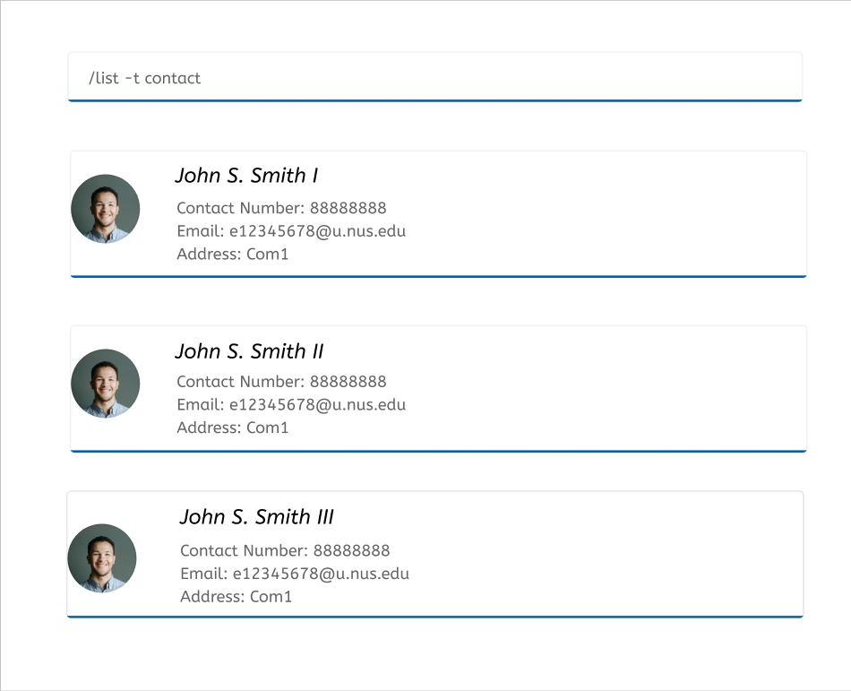
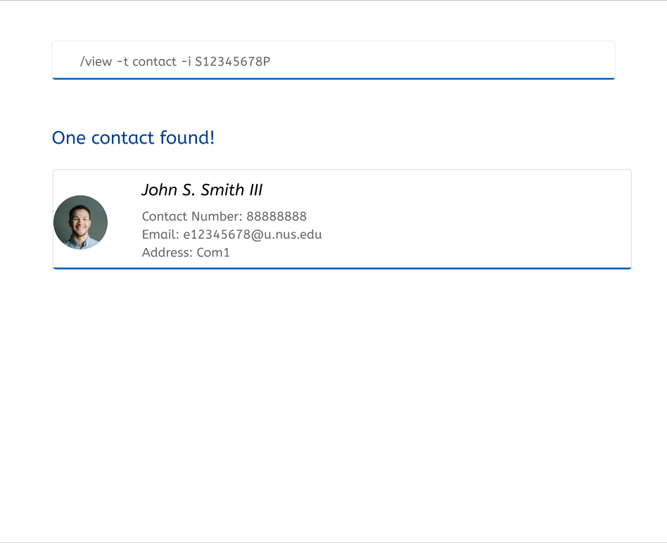

## 2.0 Features

### 2.1 Create Contact Information: / create -t contact

Adds a patient's contact to the Medbook

Format: / create -t contact -i NRIC -n NAME -p PHONE_NUMBER -e EMAIL -a ADDRESS

Examples:
* /create -t contact -i S12345678P -n John Doe -p 80008000 -e johndoe@gmail.com -a COM1

### 2.2 View Contact Information: /view -t contact

Views a patient’s details from the MedBook

Format: /view -t contact [-i NRIC] [-n NAME] [-p PHONE_NUMBER] [-e EMAIL]

Note: Optional fields allow users to have a more refined search.

Examples:
* /view -t contact to show all patients’ contact information
* /view -t contact -i S12345678P to view the contact information of the patient with this NRIC
* /view -t contact -n John Smith to view all contact information of patients with this name

### 2.3 Delete Contact Information: /delete -t contact

Deletes a patient from the MedBook

Format: /delete -t contact -i NRIC

Note: Only NRIC can be used to uniquely identify the contact owner.

Examples:
* /delete -t contact -i S12345678P