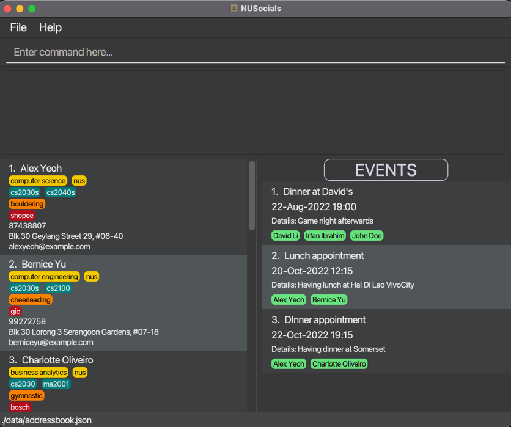
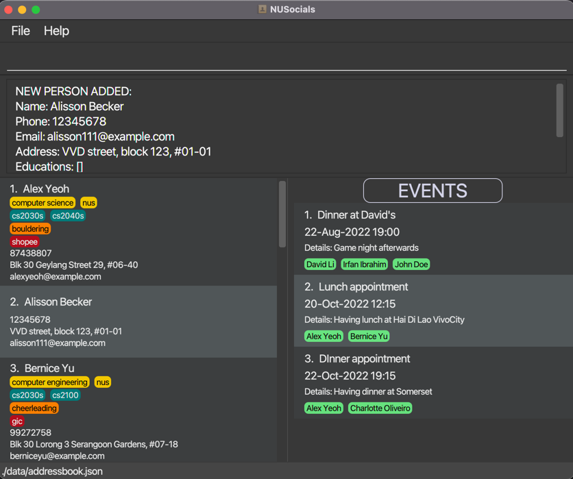
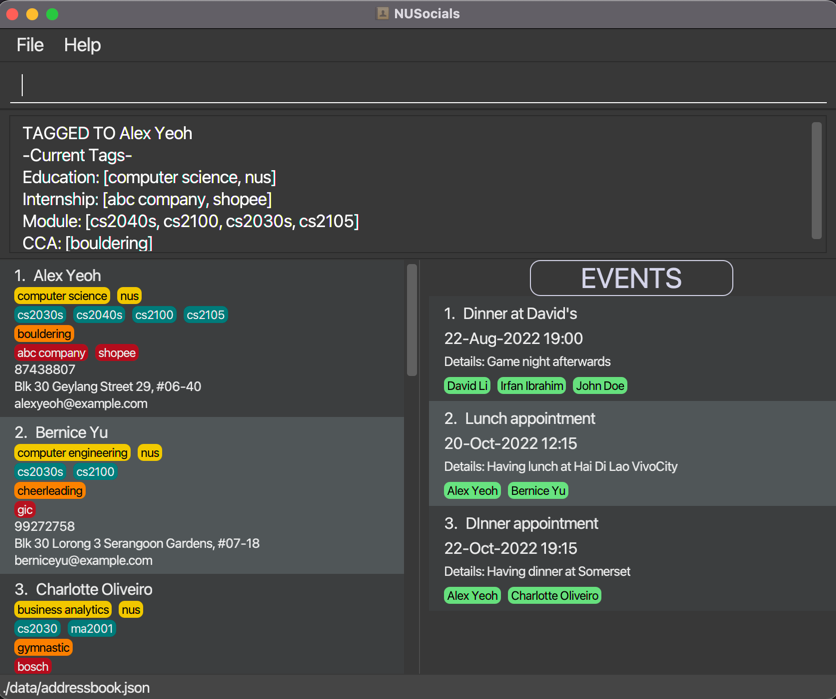
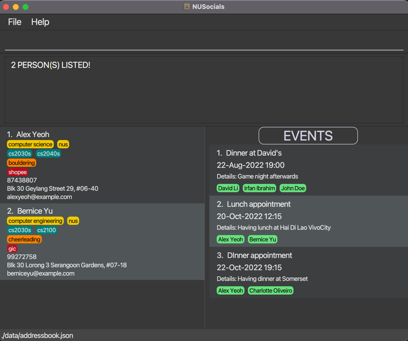
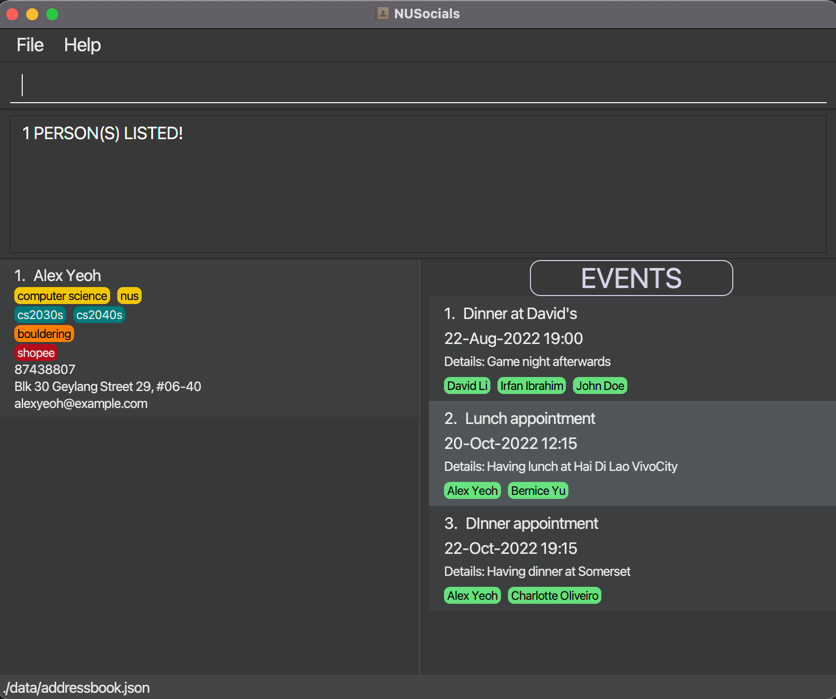

NUSocials is a **desktop app for university students to maintain a professional contact list, where users can keep track of information about friends/acquaintances easily in one single platform.
It is optimized for use via a Command Line Interface** (CLI) while still having the benefits of a Graphical User Interface (GUI). The value of the app is to facilitate a convenient way for university students to manage their professional networks with fellow acquaintances.

* Table of Contents
{:toc}

--------------------------------------------------------------------------------------------------------------------

## Quick start

1. Ensure you have Java `11` or above installed in your Computer.

2. Download the latest `NUSocials.jar` from [here](https://github.com/AY2122S2-CS2103T-W11-1/tp/releases).

3. Copy the file to the folder you want to use as the _home folder_ for NUSocials.

4. To start the app:
   - Windows: Double-click on `NUSocials.jar`.
   - MacOS: On terminal, navigate to the directory containing `NUSocials.jar` and run `java -jar NUSocials.jar`.

5. The GUI similar to the below should appear in a few seconds. Note how the app contains some sample data. 
   

6. Type the command in the command box and press Enter to execute it. e.g. typing **`help`** and pressing Enter will open the help window. 
   Some example commands you can try:

    * **`list`** Lists all contacts.

    * **`add`**`n/fred p/99998888 e/fred@example.com a/fred street, block 123, #01-01` Adds a contact named `fred` to NUSocials.

    * **`tag`** `2 edu/computer science m/CS2040S` Tags the 2nd contact shown in the current list with a Computer Science degree and CS2040S module.

    * **`event`** `1 name/Lunch appointment info/at Hai Di Lao d/2023-05-15 t/13:00` Creates an event named `Lunch appointment` and associate it with the 1st contact.

    * **`find`**`n/fred` Find any person whose name contains 'fred'.

7. Refer to the [Features](#features) below for details of each command.

--------------------------------------------------------------------------------------------------------------------

## Features

**:information_source: Notes about the command format:** 

* Words in `UPPER_CASE` are mandatory parameters to be supplied by the user. 
  e.g. in `add n/NAME`, `NAME` is a parameter which can be used as `add n/Kim Lai`.

* Items in square brackets are optional. 
  e.g `n/NAME [edu/EDUCATION]` can be used as `n/Kim Lai edu/computer science` or as `n/Kim Lai`.

* Items with `…`​ after them can be used zero or more times. 
  e.g. `[m/MODULE]…​` can be used as ` ` (i.e. 0 times), `m/CS2040S`, `m/CS2030S m/CS2100` etc.

* Extraneous parameters for commands that do not take in parameters (such as `list`, `clear`, `help` and `exit`) will be ignored. 
  e.g. if the command specified is `list 123`, it will be interpreted as `list`.

* If a parameter is expected only once in the command but you specified it multiple times, they will all be rejected. 
  e.g. if you specify `p/12345678 p/87654321`, both will be rejected.

* Parameters can be in any order. 
  e.g. if the command specifies `n/NAME p/PHONE_NUMBER`, `p/PHONE_NUMBER n/NAME` is also acceptable.

* If an `INDEX` is used, it **must be a positive integer** (i.e. 1, 2, 3…​).

* All commands are case-sensitive.

### Viewing help : `help`

Shows a message explaining how to access the help page.

Format: `help`

### Person Commands:
#### Listing all persons: `list`
Shows a list of all persons in NUSocials.

Format: `list`

* All existing persons and upcoming events are automatically rendered when the application is launched.
* The different tags are listed as follows:
  * Yellow for education
  * Teal for modules
  * Orange for CCAs
  * Red for internships
* Personal details are listed in the following order:
  * Phone number
  * Address
  * Email

#### Adding a person: `add`
Adds a person to NUSocials and lists all upcoming events.

Format: `add n/NAME p/PHONE_NUMBER e/EMAIL a/ADDRESS`

Constraints:
* Only 1 prefix for each field is allowed.
* `NAME` has to be alphanumeric not blank.
* `PHONE_NUMBER` has to be between 3 and 10 digits long and not blank.
* `EMAIL` has to be in a valid email format and not blank.
  * The local part of the `EMAIL` should be alphnumeric and these special characters, excluding the parentheses, (+-._)
  * The local part should not start and end with any of the mentioned special characters
  * "@" comes right after the local part, followed by a domain name
  * The domain name must:
    * end with a domain label at least 2 characters long\n"
    * have each domain label start and end with alphanumeric characters\n"
    * have each domain label consist of alphanumeric characters, separated only by hyphens, if any."
* `ADDRESS` has to not be blank.
* All fields must be used.

Example:
* `add n/Alisson Becker p/12345678 e/alisson111@example.com a/VVD street, block 123, #01-01`
  Adds a person with the following fields:
    - Name: Alisson Becker
    - Phone Number: 12345678
    - Email: alisson111@example.com
    - Address: VVD street, block 123, #01-01

| Before | After |
  :---:|:---:
|  |  |

**:x: Invalid Examples:** 

* `add n/Kim Lai n/Fred Tang p/12345678 e/kimlai222@example.com a/KL street, block 190, #01-23` 

Not allowed as `n/` prefix is used more than once.

* `add n/Kim Lai p/ e/kimlai222@example.com a/KL street, block 190, #01-23` 

Not allowed as `PHONE_NUMBER` is blank.

#### Deleting a person : `delete`

Deletes the specified person from NUSocials.

Format: `delete INDEX`

* Deletes the person at the specified `INDEX`.
* The index refers to the index number shown in the displayed person list.

Constraints:
* `INDEX` provided has to be on the currently shown contact list.

Examples:
* `list` followed by `delete 2` deletes the 2nd person in the currently shown contact list.
* `find n/Betsy` followed by `delete 1` deletes the 1st person from the resulting list of the `find` command.

#### Deleting multiple persons : `delete`

Deletes all the specified persons from NUSocials.

Format: `delete INDEX…​`

* Deletes multiple persons at the specified `INDEX` numbers.
* The index refers to the index number shown in the displayed person list.
* Each index **must be separated by a whitespace** and **must be unique**.

Constraints:
* All `INDEX` numbers provided has to be on the currently shown contact list.

Example:
* `list` followed by `delete 2 5 7` deletes the 2nd, 5th and 7th person in the currently shown list.

#### Editing a person : `edit`

Edits an existing person's details in NUSocials.

Format: `edit INDEX [n/NAME] [p/PHONE] [e/EMAIL] [a/ADDRESS]`

* Edits the person at the specified `INDEX`.
* The index refers to the index number shown in the displayed person list.
* At least one of the optional fields must be provided.

Constraints:
* Only 1 prefix for each field allowed.
* `NAME` has to be alphanumeric not blank.
* `PHONE_NUMBER` has to be between 3 and 10 digits long and not blank.
* `EMAIL` has to be in a valid email format and not blank.
* `ADDRESS` has to not be blank.
* `INDEX` provided has to be on the currently shown contact list.

Example:
* `edit 1 p/91234567 e/KL123@example.com` 
  Edits the phone number and email address of the 1st person to `91234567` and `KL123@example.com` respectively.

**:exclamation: Caution:**
Existing values will be overwritten and updated to the new input values!

#### Tagging a person: `tag`
Tags additional information to an existing contact.

Format: `tag INDEX [i/INTERNSHIP]…​ [m/MODULE]…​ [c/CCA]…​ [edu/EDUCATION]…​`

* Tags the relevant information to the person at the specified `INDEX`.
* The index refers to the index number shown in the displayed person list.
* Alphabets in the input tag values will be converted to lowercase.
* Input tag values will be added to the existing tags in their respective fields.
* If the new input tag values are the same as existing tags, then nothing will be added.

Constraints:
* At least one of the prefixes must be provided.
* If a prefix is used, the input after must not be blank and must be alphanumeric.
* `INDEX` provided has to be on the currently shown contact list.

Example:
* `tag 1 i/abc company m/CS2100 m/CS2105`(as shown below) 
  Tags the internship company and 2 modules to the 1st person in the currently shown contact list.

| Before | After |
  :---:|:---:
|  |  |

**:x: Invalid Examples:** 

* `tag 1` 

Not allowed as no prefix provided.

* `tag 1 i/ m/` 

Not allowed as there is no input given after a prefix is used.

* `tag 0 i/xyz company m/CS2103T` 

Not allowed as there `INDEX` 0 does not exist in the contact list.

#### Removing specific tags from person: `removetag`
Removes the specific tags of an existing contact.

Format: `removetag INDEX [i/INTERNSHIP]…​ [m/MODULE]…​ [c/CCA]…​ [edu/EDUCATION]…​`

* Removes the tags from the person at the specified `INDEX`.
* The index refers to the index number shown in the displayed person list.

Constraints:
* At least one of the prefixes must be provided.
* If a prefix is used, the input after must not be blank.
* All inputs for tags provided must be an exact match to existing tags.
* `INDEX` provided has to be on the currently shown contact list.

Example:
* `removetag 1 i/abc company m/CS2100 m/CS2030S` 
Removes the internship company tag and the 2 modules tags from the 1st person in the currently shown contact list.

**:x: Invalid Examples:** 

* `removetag 1 i/ m/` 

Not allowed as there is no input given after a prefix is used.

* `removetag 1 edu/computer` while person 1 has an education tag with `computer science` 

Not allowed as it is not an exact match.

#### Finding persons: `find`

Finds persons that match any of the given fields and tags.

Format: `find [n/NAME] [p/PHONE_NUMBER] [e/EMAIL] [a/ADDRESS] [i/INTERNSHIP]…​ [m/MODULE]…​ [c/CCA]…​ [edu/EDUCATION]…​`

* The search is case-insensitive. e.g `hans` will match `Hans`
* The matching is done by character sequence. e.g. `ha` or `ns` will match `Hans`
* Persons matching at least one of the fields or tags will be returned.

Constraints:
* At least one of the optional fields must be provided.
* Only 1 prefix for each basic particulars field is allowed.

Examples:
* `find m/cs2030s m/cs2040s` 
Returns anyone tagged with either `cs2030s` or `cs2040s` or both
* `find n/Hans m/cs2100` 
Returns `Hans` and `Bo Yang` (i.e. Bo Yang is tagged with cs2100)
* `find i/Shopee m/cs2040s m/cs2030s` 
Returns `Alex Yeoh` and `Bernice Yu` (as shown below)

| Before | After |
:---:|:---:
|  |  |

**:x: Invalid Examples:** 

* `find n/ m/` 

Not allowed as there is no input given after a prefix is used.

* `find n/Hans n/Chewbacca` 

Not allowed as the `n/` prefix is used more than once.

#### Finding specific persons: `find -s`

Finds persons that match all given fields and tags.

Format: `find -s [n/NAME] [p/PHONE_NUMBER] [e/EMAIL] [a/ADDRESS] [i/INTERNSHIP]…​ [m/MODULE]…​ [c/CCA]…​ [edu/EDUCATION]…​`

* The search is case-insensitive. e.g `hans` will match `Hans`
* The matching is done by character sequence. e.g. `ha` or `ns` will match `Hans`
* Only persons matching all fields and tags will be returned.

Constraints:
* At least one of the optional fields must be provided.
* Only 1 prefix for each basic particulars field is allowed.

Examples:
* `find -s n/Bo Yang m/cs2040s` 
  Returns `Bo Yang` (i.e. Bo Yang is tagged with cs2040s)

* `find -s i/Shopee m/cs2040s m/cs2030s` 
  Returns `Alex Yeoh` (as shown below)

| Before | After |
:---:|:---:
|  |  |

**:x: Invalid Examples:** 

* `find -s n/ m/` 

Not allowed as there is no input given after a prefix is used. 

* `find -s n/Hans n/Solo` 

Not allowed as the `n/` prefix is used more than once.

### Event Commands:
#### Showing events: `showevents`
Shows a list of all events in NUSocials.

Format: `showevents`

* Events shown are automatically sorted in chronological order.

**:information_source: Tip :** 
Use the `-upcoming` or `-past` flags to filter the event list.

Alternate formats:
1. `showevents -upcoming`
* Shows a list of all upcoming events instead

2. `showevents -past`
* Shows a list of all past events instead

#### Adding an event: `event`
Adds an event into NUSocials.

Format: `event INDEX…​ name/EVENT NAME info/EVENT DETAILS d/DATE t/TIME`

* Tags the participating persons to the events based on the specified `INDEX…​`.
* The index refers to the index number shown in the displayed person list.
* Each index **must be separated by a whitespace** and **must be unique**.

Constraints:
* All fields must be provided.
* Only 1 prefix for each field is allowed.
* `DATE` has to be in the format of `yyyy-MM-dd`.
* `TIME` has to be in the format of `HH:mm`.
* `DATE` and `TIME` has to be valid (i.e Date and Time specified must be after the current date and time)
* `EVENT NAME` has a limit of 100 characters.
* `EVENT DETAILS` has a limit of 300 characters.

Example:
* `event 2 3 name/Movie marathon info/Harry Potter movies d/2022-08-15 t/14:00` 
Creates the Event and adds into NUSocials. (as shown below)

| Before | After |
:---:|:---:
|  |  |

**:x: Invalid Examples:** 

* `event 1 2 name/ info/At Michael's d/2022-08-22 t/19:00` 

Not allowed as there is no input after a prefix is used.

* `event 1 2 name/Dinner appointment name/Game night info/At Michael's d/2022-08-22 t/19:00` 

Not allowed as the `name/` prefix is more than once.

#### Cancelling an event : `cancelevent`

Deletes the specified event from NUSocials.

Format: `cancelevent INDEX`

* Deletes the event at the specified `INDEX`.
* The index refers to the index number shown in the displayed event list.

Constraints:
* `INDEX` number provided has to be on the currently shown contact list.

Examples:
* `cancelevent 2` deletes the 2nd event in the currently shown event list.

#### Cancelling multiple events: `cancelevent`

Deletes all the specified events from NUSocials.

Format: `cancelevent INDEX…​`

* Deletes multiple events at the specified `INDEX` numbers.
* The index refers to the index number shown in the displayed event list.
* Each index **must be separated by a whitespace** and **must be unique**.

Constraints:
* All `INDEX` numbers provided has to be on the currently shown contact list.

Examples:
* `cancelevent 2 5 7` deletes the 2nd, 5th and 7th events in the currently shown event list.

#### Finding an event: `find -e`

Finds an event that matches any of the given details

Format: `find -e [name/EVENT NAME]…​ [info/INFORMATION]…​ [part/PARTICPANT]…​ [dt/DATE AND TIME]…​`

* The search is case-insensitive. e.g `lunch` will match `Lunch`
* The matching is done by character sequence. e.g. `lun` will match `lunch`
* Events matching at least one of the fields will be returned.

Constraints:
* At least one of the optional fields must be provided.
* Only 1 prefix for each basic particulars field is allowed.
* `DATE` has to be in the format of `yyyy-MM-dd`.
* `TIME` has to be in the format of `HH:mm`.
* `DATE` and `TIME` has to be valid (i.e Date and Time specified must be after the current date and time)

Example:
* `find -e name/lunch part/Alex Yeoh` returns all events containing `lunch` in its name and all events involving Alex Yeoh 

**:x: Invalid Examples:** 

* `find -e name/ info/` 

Not allowed as there is no input given after a prefix is used.

* `find -e name/Dinner name/Lunch` 

Not allowed as the `name/` prefix is used more than once.

### Clearing all entries : `clear`

Clears all entries from NUSocials.

Format: `clear`

### Exiting the program : `exit`

Exits the program.

Format: `exit`

### Saving the data

NUSocials data are saved in the hard disk automatically after any command that changes the data. There is no need to save manually.

### Editing the data file

NUSocials data are saved as a JSON file `[JAR file location]/data/addressbook.json`. Advanced users are welcome to update data directly by editing that data file.

**:exclamation: Caution:**
If your changes to the data file makes its format invalid, NUSocials will discard all data and start with an empty data file at the next run.

--------------------------------------------------------------------------------------------------------------------

## FAQ

**Q**: How do I transfer my data to another Computer? 
**A**: Install the app in the other computer and overwrite the empty data file it creates with the file that contains the data of your previous NUSocials home folder.

--------------------------------------------------------------------------------------------------------------------

## Command summary

Action | Format, Examples
--------|------------------
**Add** | `add n/NAME p/PHONE_NUMBER e/EMAIL a/ADDRESS`   e.g. `add n/James Ho p/22224444 e/jamesho@example.com a/123, Clementi Rd, 1234665`
**Tag** | `tag INDEX [i/INTERNSHIP]…​ [m/MODULE]…​ [c/CCA]…​ [edu/EDUCATION]…​`  e.g. `tag 1 m/CS2105 m/CS2106`
**Remove Tag** | `removetag INDEX [i/INTERNSHIP]…​ [m/MODULE]…​ [c/CCA]…​ [edu/EDUCATION]…​`   e.g. `removetag 1 c/Bouldering m/CS2105 m/CS2106`
**Event** | `event INDEX…​ name/EVENT NAME info/INFORMATION d/DATE t/TIME`   e.g. `event 1 name/Dinner Date info/Having Dinner at Bread Street Kitchen by Gordon Ramsay d/2022-12-20 t/20:15`
**Cancel Event** | `cancelevent INDEX…​`   e.g. `cancelevent 1 2 3`
**Clear** | `clear`
**Delete** | `delete INDEX`  e.g. `delete 3`   `delete INDEX…​`   e.g. `delete 1 3 5`
**Edit** | `edit INDEX [n/NAME] [p/PHONE] [e/EMAIL] [a/ADDRESS]`  e.g. `edit 2 n/Fred e/fred111@example.com`
**Find** | `find [n/NAME]…​ [i/INTERNSHIP]…​ [m/MODULE]…​ [c/CCA]…​ [edu/EDUCATION]…​`  e.g. `find n/john edu/computer science`
**Find specific match** | `find -s [n/NAME]…​ [i/INTERNSHIP]…​ [m/MODULE]…​ [c/CCA]…​ [edu/EDUCATION]…​`  e.g. `find -s n/john i/bytedance edu/computer science`
**Find Event** | `find -e [name/EVENT NAME]…​ [info/INFORMATION]…​ [part/PARTICIPANT]…​ [dt/DATE AND TIME]…​`  e.g. `find -e name/Dinner info/Candice's birthday dt/2022-05-12 19:30`
**List** | `list`
**Show Events** | `showevents` `showevents -upcoming` `showevents -past`
**Help** | `help`
