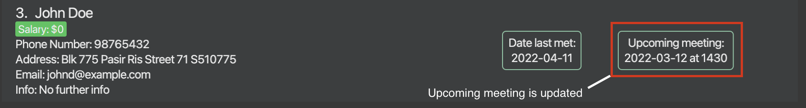

HustleBook (HB) is a desktop app specially catered towards financial advisors for **managing client details and meetings, optimized for use via a Command Line Interface** (CLI) while still having the benefits of a Graphical User Interface (GUI). 
If you can type fast, HB can get your client management meetings done faster than traditional GUI apps.

This guide will help provide you with all the necessary information to set up, run and use the HustleBook to manage your clients.

To get started, click on any of the headers in the table of content to jump to that section to get more information.

### Table of Contents
* [Introduction](#introduction)
* [Quick Start](#quick-start)
* [All Features](#all-features)
  * [**Basic Features**](#basic-features)
    * [Viewing Help: `help`](#viewing-help--help)
    * [Managing you clients](#managing-your-clients)
      * [Listing all clients : `list`](#listing-all-clients--list) 
      * [Adding a client : `add`](#adding-a-client--add)
      * [Editing a client : `edit`](#editing-a-client--edit)
      * [Deleting a client : `delete`](#deleting-a-client--delete)
      * [Flagging a client : `flag`](#flagging-a-client--flag)
      * [Unflagging a client : `unflag`](#unflagging-a-client--unflag)
    * [Managing your meetings](#managing-your-meetings)
      * [Scheduling / Rescheduling a meeting: `meet`](#scheduling--rescheduling-a-meeting-meet)
      * [Canceling a meeting: `meet`](#canceling-a-meeting-meet)
    * [Viewing your clients and meetings](#viewing-your-clients-and-meetings)
      * [Sorting all clients : `sort`](#sorting-all-clients--sort)
      * [Locating clients by name : `find`](#locating-clients-by-name--find)
  * [**Useful Features**](#useful-features)
    * [Undoing the previous commands : `undo`](#undoing-the-previous-commands--undo)
    * [Redoing the previous commands : `redo`](#redoing-the-previous-commands--redo)
    * [Clearing all entries : `clear`](#clearing-all-entries--clear)
    * [Exiting the program : `exit`](#exiting-the-program--exit)
    * [Recall recent used command](#recall-recent-used-command)
  * [**Miscellaneous Features**](#miscellaneous-features)
    * [Saving the data](#saving-the-data)
    * [Editing the data file](#editing-the-data-file)
* [Command Summary](#command-summary)
  

:bulb: **Tip:**
For new users, it is highly recommended starting off from the `Quick Start` section to get HustleBook up and running.

   

5. That's it. Your HustleBook is ready to go! 🎉 Keep following the steps to get to know how HustleBook can help you.

6. Let's try out some features! Type the command in the command box and press Enter to run it. e.g. typing **`help`** and pressing Enter will open the help window. 
   Some example commands you can try:

   * **`list`** : Lists all contacts.

   * **`add`**` n/John Doe p/98765432 e/johnd@example.com a/John street, block 123, #01-01` : Adds a contact named `John Doe` to the HustleBook.

   * **`delete`**` John Doe` : Deletes `John Doe` from the list.

   * **`clear`** : Deletes all contacts.

   * **`exit`** : Exits the app.

7. Refer to the [Basic Features](#basic-features) below to learn all the essential commands. 

Now that you have set up the HustleBook, lets take a look at what HustleBook offers to allow you to keep the hustle without lifting a muscle.

--------------------------------------------------------------------------------------------------------------------

# All Features

You can find basic, useful and miscellaneous features below. If you are new to HustleBook,
we recommend to look through the [basic features](#basic-features) to start managing your clients
and meetings.

* [Basic Features](#basic-features)
  * [Viewing Help: `help`](#viewing-help--help)
  * [Managing you clients](#managing-your-clients)
  * [Viewing your clients and meetings](#viewing-your-clients-and-meetings)
* [Useful Features](#useful-features)
  * [Undoing the previous commands : `undo`](#undoing-the-previous-commands--undo)
  * [Redoing the previous commands : `redo`](#redoing-the-previous-commands--redo)
  * [Clearing all entries : `clear`](#clearing-all-entries--clear)
  * [Exiting the program : `exit`](#exiting-the-program--exit)
  * [Recall recent used command](#recall-recent-used-command)
* [Miscellaneous Features](#miscellaneous-features)
  * [Saving the data](#saving-the-data)
  * [Editing the data file](#editing-the-data-file)

#### Legends

:information_source: - Important information that you should keep in mind.

:bulb: - Tips to make your workflow with HustleBook more efficient.

:exclamation: - Important information to keep your HustleBook working at all times. 

--------------------------------------------------------------------------------------------------------------------

## Basic Features
Here you can find all the necessary features to manage your clients and meetings.

* [Viewing Help: `help`](#viewing-help--help)
* [Managing you clients](#managing-your-clients)
  * [Listing all clients : `list`](#listing-all-clients--list)
  * [Adding a client : `add`](#adding-a-client--add)
  * [Editing a client : `edit`](#editing-a-client--edit)
  * [Deleting a client : `delete`](#deleting-a-client--delete)
  * [Flagging a client : `flag`](#flagging-a-client--flag)
  * [Unflagging a client : `unflag`](#unflagging-a-client--unflag)
* [Managing your meetings](#managing-your-meetings)
  * [Scheduling / Rescheduling a meeting: `meet`](#scheduling--rescheduling-a-meeting-meet)
  * [Canceling a meeting: `meet`](#canceling-a-meeting-meet)
* [Viewing your clients and meetings](#viewing-your-clients-and-meetings)
  * [Sorting all clients : `sort`](#sorting-all-clients--sort)
  * [Locating clients by name : `find`](#locating-clients-by-name--find)

**:information_source: Notes about the command format:** 

* Words in `UPPER_CASE` are the parameters to be supplied by the user. 
  e.g. in `add n/NAME`, `NAME` is a parameter which can be used as `add n/John Doe`.

* Items in square brackets are optional. 
  e.g `n/NAME [t/TAG]` can be used as `n/John Doe t/friend` or as `n/John Doe`.
  
* The `|` symbol represents or.  
  e.g `list [flag|unflag]` means valid commands are `list flag` and `list unflag`

* Items with `…`​ after them can be used multiple times including zero times. 
  e.g. `[t/TAG]…​` can be used as ` ` (i.e. 0 times), `t/friend`, `t/friend t/family` etc.

* Parameters can be in any order. 
  e.g. if the command specifies `n/NAME p/PHONE_NUMBER`, `p/PHONE_NUMBER n/NAME` is also acceptable.

* If a parameter is expected **only once** in the command but if you specified it multiple times, **only the last occurrence** of the parameter will be taken. 
  e.g. if you specify `p/12341234 p/56785678`, only `p/56785678` will be taken.

* Extraneous parameters for commands that do not take in parameters (such as `undo`, `redo`, `exit` and `clear`) will be ignored. 
  e.g. if the command specifies `clear 123`, it will be interpreted as `clear`.

### Viewing help : `help`

Shows a message explaining how to access the help page.

Format: `help [COMMAND]`

:information_source: **Note:** 
* Enter optional parameter `COMMAND` to view the usage for that command.
* Entering only the `help` will allow you to view message explaining how to access help page and the usage of all commands.

Example:
* `help`
* `help meet`

Outcome of `help meet`:

## Managing your clients

### Listing all clients : `list`

Shows a list of clients in the HustleBook.

Format: `list [flag|unflag]`

:information_source: **Note:**
* Optional Parameter allows you to view only flagged or only unflagged clients.
* If the optional parameter is not provided, both flagged and unflagged clients will be displayed.

### Adding a client : `add`

Adds a client to the HustleBook.

Format: `add n/NAME p/PHONE_NUMBER e/EMAIL a/ADDRESS [s/SALARY] [i/INFO] [d/DATE] [f/FLAG] [t/TAG]…​`

:information_source: **Note:**
* HustleBook does not allow duplicate clients to be stored.
  * Duplicate is found when two clients have the exact `NAME`.
  * Duplicate `NAME` are case-insensitive. `John` is a duplicate of `JoHn`. 
* `n/NAME` can only contain letters and numbers with single space in between each name.
  * `William B J` and `John The 2nd` is acceptable. `Clara   Tan` is not acceptable.
* `d/DATE` will be set to today's date by default if not specified.
  * `DATE` has to be in the format **YYYY-MM-DD**.
  * `DATE` accepts any date (past or future) as long as it is valid. For example, `2022-02-29` is invalid as 2022 is not a leap year.
* `p/PHONE_NUMBER` needs to be minimum **7** digits and maximum **15** digits.
* `i/INFO` will be set to `No further info` by default if not specified.
* `t/TAG` will be empty by default if not specified.
  * Each tag is limited to **25** characters maximum currently.
* `f/FLAG` will be set to `false` by default if not specified.
* `s/SALARY` will be set to 0 by default if not specified.
  * Salary is limited to **15** digits maximum currently. 

Examples:
* `add n/John Doe p/98765432 e/johnd@example.com a/Blk 775 Pasir Ris Street 71 S510775`
* `add n/Betsy Crowe t/friend e/betsycrowe@example.com a/NUS School of Computing, COM1 s/4300 p/1234567 i/Low Risk Tolerance f/true`

Outcome of `add n/John Doe p/98765432 e/johnd@example.com a/Blk 775 Pasir Ris Street 71 S510775`:

:bulb: **Tip:**
A client's meeting can be scheduled through meet command after adding the client into the HustleBook

### Editing a client : `edit`

Edits an existing client in the HustleBook.

Format: `edit NAME [n/NAME] [p/PHONE] [e/EMAIL] [a/ADDRESS] [s/SALARY] [i/INFO] [d/DATE] [t/TAG]…​`

:information_source: **Note:**
* Edits the client with the specified `NAME`.
  * `Name` is case-insensitive. E.g. `John` will match `john`.
  * Only full words will be matched e.g. `Han` will not match `Hans`.
* If `NAME` is multiple words, the whole string will be used to search for clients.
  * Words in `NAME` still have to fully match words in client's name
  * Example: `Jonathan Lee` will match `Jonathan Lee Juler`. `Lee Juler` will also match `Jonathan Lee Juler`,
             `Jonathan L` will not match.
* If `NAME` matches multiple clients, you will see a list of clients with matching names
  * Input the position on the list of the client you wish to edit.

Example:

**Scenario 1**: You have a client named `John Doe`
* `edit John Doe d/2020-12-04` Edits the previous meeting date of the client with the name `John Doe` to
  `2020-12-04` which is 4th Dec 2020.

**Scenario 2**: You have clients named `John Doe` `John Smith` and `John Willams`
* Running the command `edit John d/2020-12-04` will show a list of clients with names containing "John"

* Typing `1` will edit "John Doe", typing `2` will edit "John Smith" and typing `3` will edit "John Williams"
* After typing `1`, the previous meeting date of the client with the name `John Doe` to `2020-12-04`

**:information_source: Notes on `edit`:** 

* `DATE` has to be in the format **YYYY-MM-DD**.
* **At least one** of the optional fields must be provided.
* Existing values will be updated with the input values.
* When editing tags, the existing tags of the client will be removed i.e adding of tags is not cumulative.
* You can remove all the client’s tags by typing `t/` without specifying any tags after it.
* You can remove the client's info by typing `i/` without specifying any info after it.

### Deleting a client : `delete`

Deletes the specified client from the HustleBook.

Format: `delete NAME`

:information_source: **Note:**
* Deletes the client with the specified `NAME`.
  * `NAME` is case-insensitive. e.g. `John` will match `john`.
  * Only full words will be matched e.g. `Han` will not match `Hans`.
* If `NAME` is multiple words, the whole string will be used to search for clients.
  * Words in `NAME` still have to fully match words in client's name
  * Example: `Jonathan Lee` will match `Jonathan Lee Juler`. `Lee Juler` will also match `Jonathan Lee Juler`,
    `Jonathan L` will not match.
* If `NAME` matches multiple clients, you will see a list of clients with matching names
  * Input the position on the list of the client you wish to edit.

Example:

**Scenario 1**: You have a client named `John Doe`

`delete John Doe` removes client `John Doe` from HustleBook

**Scenario 2**: You have clients named `John Doe` `John Smith` and `John Willams`
* Running the command `delete John` will show a list of clients with names containing "John"
* If you wish to delete `John Doe` and he is the first person listed, typing `1` will delete `John Doe`

:bulb: **Tip:**
You can continue deleting other clients here by entering other indexes. 

To exit out of this mode and search result, simply run `list` to show all clients again. 

### Flagging a client : `flag`

Flag a client in the HustleBook to mark them as important. 

Format: `flag NAME`

:information_source: **Note:**
* Flags the client with the specified `NAME`.
  * `Name` is case-insensitive. e.g. `John` will match `john`.
  * Only full words will be matched e.g. `Han` will not match `Hans`.
* If `NAME` matches multiple clients, you will see a list of clients with matching names.
  * Input the position on the list of the client you wish to edit.
* A flagged client will have **red** tab on the left as shown below:

Example:

**Scenario 1**: You have a client named `John Doe`

`flag John Doe` flags client `John Doe` on HustleBook.

**Scenario 2**: You have clients named `John Doe`, `John Smith` and `John Willams`.
* Running the command `flag John` will show a list of clients with names containing "John".
* If you wish to flag `John Doe` and he is the first person listed, typing `1` and `Enter` will flag `John Doe`.

:bulb: **Tip:**
You can continue flagging other clients here by entering other indexes. 

To exit out of this mode and search result, simply run `list` to show all clients again. 

### Unflagging a client : `unflag`

Unflag a client in the HustleBook to unmark flagged clients.

Format: `unflag NAME`

:information_source: **Note:**
* Unflags the client with the specified `NAME`.
  * `Name` is case-insensitive. e.g. `John` will match `john`.
  * Only full words will be matched e.g. `Han` will not match `Hans`.
* If `NAME` matches multiple clients, you will see a list of clients with matching names.
  * Input the position on the list of the client you wish to edit.

Example:

**Scenario 1**: You have a client named `John Doe`

`unflag John Doe` unflags client `John Doe` on HustleBook.

**Scenario 2**: You have clients named `John Doe`, `John Smith` and `John Willams`.
* Running the command `unflag John` will show a list of clients with names containing "John".
* If you wish to unflag `John Doe` and he is the first person listed, typing `1` and `Enter` will unflag `John Doe`.

:bulb: **Tip:**
You can continue unflagging other clients here by entering other indexes. 

To exit out of this mode and search result, simply run `list` to show all clients again. 

## Managing your meetings

### Scheduling / Rescheduling a meeting: `meet`

Schedules a meeting for the client with the specified `NAME` with the `DATE` and `TIME` of the meeting specified.
The same command can be used to reschedule a meeting with the client.

Format: `meet NAME d/DATE t/TIME`

:information_source: **Note:**
* `DATE` input must be in `YYYY-MM-DD` format.
* `DATE` accepts any date (past or future) as long as it is valid. For example, `2022-02-29` is invalid as 2022 is not a leap year.
* `TIME` input must be in 24-hr format of `HHmm`.
* In the event where more than one name is matches `NAME` input, you would need to specify using `INDEX` of the list shown.
  * This is similar to the scenario 2 in `edit` and `flag` commands.

Example:
* `meet John Doe d/2022-03-12 t/1430` Schedules a meeting with client named `John Doe` at 12 March 2022, 2:30pm.

Outcome of `meet John Doe d/2022-03-12 t/1430`:

### Canceling a meeting: `meet`

Cancels current meeting for the client with the specified `NAME`.

Format: `meet NAME c/`

:information_source: **Note:**
* `c/` will clear the meeting with the client with the specified `NAME`.
  * If `c/WORDS` is input, eg. `meet John Doe c/abcdef`,HustleBook will still clear the meeting with the given `NAME`.
* In the event where more than one name is matches `NAME` input, you would need to specify using `INDEX` of the list shown.
  * This is similar to the scenario 2 in `edit` and `flag` commands.

Example:
* `meet John Doe c/` Cancels the meeting with client name `John Doe`.

Outcome of `meet John Doe c/`:

## Viewing your clients and meetings

### Sorting all clients : `sort`

Sorts clients such that flagged clients are displayed before unflagged clients.
It then sorts all clients in HustleBook based on the parameter provided.

Format: `sort [meeting|name|prev|salary]`

:information_source: **Note:**
* `sort meeting` sorts clients by the date and time of the meeting. The earliest upcoming meeting will be displayed first.
* `sort name` sorts clients by name in alphabetical order.
* `sort prev` sorts clients by previous date met. The client you have not met for the longest will be displayed at the top.
* `sort salary` sorts clients by their salary in descending order.
* `meeting`, `name`, `prev` and `salary` are all not case-sensitive.

### Locating clients by name : `find`

Finds clients whose names contain any of the given keywords.

Format: `find KEYWORD, [MORE_KEYWORDS]`

:information_source: **Note:**
* The search is case-insensitive. e.g `hans` will match `Hans`.
* Only full words will be matched e.g. `Han` will not match `Hans`.
* Names of clients should be separated by commas
  * Example: `find alex, david li` will match clients whose name contain `Alex` or `David Li`
* Clients matching at least one keyword will be returned (i.e. `OR` search).
  * Example: If your HustleBook contains a client named `David` but not `Goliath`, 
    `find David, Goliath` will show only `David`.

Examples:
* `find John` returns `john` and `John Doe`
* `find alex, david` returns `Alex Yeoh`, `David Li` 

  

--------------------------------------------------------------------------------------------------------------------

## Useful Features
Here you can find useful features that can help improve your efficiency using HustleBook.
* [Undoing the previous commands : `undo`](#undoing-the-previous-commands--undo)
* [Redoing the previous commands : `redo`](#redoing-the-previous-commands--redo)
* [Clearing all entries : `clear`](#clearing-all-entries--clear)
* [Exiting the program : `exit`](#exiting-the-program--exit)
* [Recall recent used command](#recall-recent-used-command)

### Undoing the previous commands : `undo`

Undoes the previous commands executed.
  * Multiple `undo` is possible. 
  * Maximum possible `undo` is till the time HustleBook is launched. 

Format: `undo`

:information_source: **Note:**
When a command is undone successfully, a message `Undo Successful!` will be displayed as shown below.

**:information_source: Note about the `undo` command:** 

* For `list`, `find` and `help` commands, `undo` will be executed successfully. The `Undo Successful!` message will be displayed, however, undoing these commands will not cause visible changes in the client list displayed and their information.

### Redoing the previous commands : `redo`

Redoes the previous commands executed.
  * Multiple `redo` is possible.
  * Maximum possible `redo` is till the last executed command.

Format: `redo`

When a command is redo successfully, a message `Redo Successful!` will be displayed as shown below.

**:information_source: Note about the `redo` command:** 

* For `list`, `find` and `help` commands, `redo` will be executed successfully. The `Redo Successful!` message will be displayed, however, redoing these commands will not cause visible changes in the client list displayed and their information.

### Clearing all entries : `clear`

Clears all entries from the HustleBook.

Format: `clear`

### Exiting the program : `exit`

Exits the program.

Format: `exit`

### Recall recent used command

Recalls the most recent command used and enters it into the command box.

* By pressing the `UP` arrow key, the last command used is reentered into the command box.
* Only the most recent command used can be recalled.

--------------------------------------------------------------------------------------------------------------------

## Miscellaneous Features 

Here you can find miscellaneous features. These are only for advanced users as they have the potential to cause
HustleBook to wipe your data.

### Saving the data

HustleBook data are saved in the hard disk automatically after any command that changes the data. There is no need to save manually.
The data is saved in a `json` file found in a folder named `data` at the location HustleBook is saved in.

### Editing the data file

HustleBook data are saved as a JSON file `[JAR file location]/data/hustlebook.json`. Advanced users are welcome to update data directly by editing that data file.

:exclamation: **Caution:**
If your changes to the data file makes its format invalid, HustleBook will discard all data and start with an empty data file at the next run.

:exclamation: **Caution:**
If you decide to make changes to the data file, HustleBook will not check the validity of the data. Such as meeting clashes and clients with the same name.

--------------------------------------------------------------------------------------------------------------------

## Command summary

| Action     | Format, Examples                                                                                                                                                                            |
|------------|---------------------------------------------------------------------------------------------------------------------------------------------------------------------------------------------|
| **Add**    | `add n/NAME p/PHONE_NUMBER e/EMAIL a/ADDRESS [s/SALARY] [d/DATE] [i/INFO] [t/TAG]…​`   e.g., `add n/James Ho p/22224444 e/jamesho@example.com a/123, Clementi Rd, 1234665 s/3400`     |
| **List**   | `list`                                                                                                                                                                                      |
| **Clear**  | `clear`                                                                                                                                                                                     |
| **Sort**   | `sort [meeting|name|prev|salary]`   e.g., `sort name`                                                                                                                                    |
| **Undo**   | `undo`                                                                                                                                                                                      |
| **Redo**   | `redo`                                                                                                                                                                                      |
| **Delete** | `delete NAME`  e.g., `delete John`                                                                                                                                                       |
| **Flag**   | `flag NAME`  e.g., `flag John`                                                                                                                                                           |
| **Unflag** | `unflag NAME`   e.g., `unflag John`                                                                                                                                                      |
| **Meet**   | `meet NAME d/DATE t/TIME`   e.g., `meet John d/2022-05-25 t/1430`                                                                                                                        |
| **Edit**   | `edit NAME [n/NAME] [p/PHONE_NUMBER] [e/EMAIL] [a/ADDRESS] [d/DATE] [i/INFO] [t/TAG]…​`  e.g.,`edit John n/James Lee e/jameslee@example.com`                                          |
| **Find**   | `find KEYWORD, [MORE_KEYWORDS]`  e.g., `find James, Jake`                                                                                                                                |
| **Help**   | `help [COMMAND]`   e.g., `help meet`                                                                                                                                                     |
