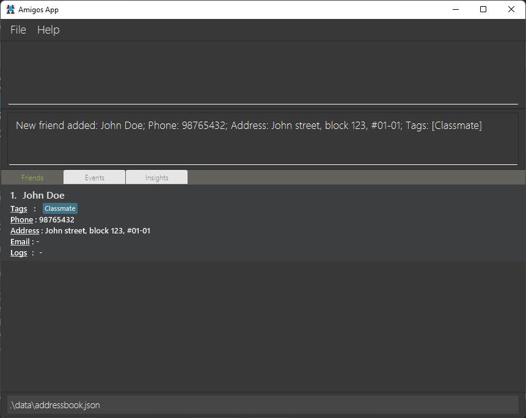
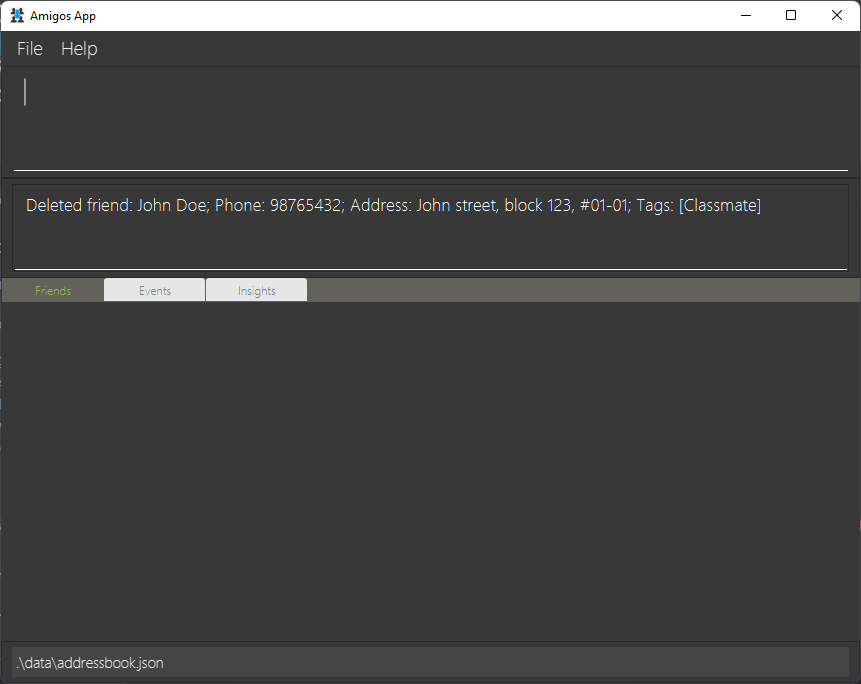

_Amigos_ is a desktop application to help tech-savvy university students manage their friendships by helping them to keep track of important details. It is optimized for use via a Command Line interface while still having the benefits of a Graphical User Interface (GUI).

* Table of Contents
{:toc}

--------------------------------------------------------------------------------------------------------------------

# Quick start

1. Ensure you have Java `11` or above installed in your Computer.

2. Download the latest `_Amigos_.jar` from [here](https://github.com/AY2122S2-CS2103-F09-2/tp/releases/tag/v1.1).

3. Copy the file to the folder you want to use as the _home folder_ for your application.

4. Double-click the file to start the app. The GUI similar to the below should appear in a few seconds. Note how the app contains some sample data. 

6. Type the command in the command box and press Enter to execute it. Here are some starters:

  * **`listfriends`** : Lists all friends.
  * **`listevents`** : Lists all events.
  * **`showinsights`** : Lists insights about friends in the app.

6. Refer to the [Features](#features) below for details of each command.

--------------------------------------------------------------------------------------------------------------------

# Features

**:information_source: Notes about the command format:** 

* Words in `UPPER_CASE` are the parameters to be supplied by the user. 
  e.g. in `addfriend n/NAME`, `NAME` is a parameter which can be used as `addfriend n/John Doe`.

* Items in square brackets are optional. 
  e.g `n/NAME [t/TAG]` can be used as `n/John Doe t/friend` or as `n/John Doe`.

* Items with `…`​ after them can be used multiple times including zero times. 
  e.g. `[t/TAG]…​` can be used as ` ` (i.e. 0 times), `t/friend`, `t/friend t/family` etc.

* Parameters can be in any order. 
  e.g. if the command specifies `n/NAME p/PHONE_NUMBER`, `p/PHONE_NUMBER n/NAME` is also acceptable.

* If a parameter is expected only once in the command but you specified it multiple times, only the last occurrence of the parameter will be taken. 
  e.g. if you specify `p/12341234 p/56785678`, only `p/56785678` will be taken.

* Extraneous parameters for commands that do not take in parameters (such as `listfriends`, `listevents` and `exit`) will be ignored. 
  e.g. if the command specifies `listfriends 123`, it will be interpreted as `listfriends`.

* Arguments connected by a `?` are exclusively-or - i.e. only one or the other can be provided.
  e.g. in `addlog INDEX ? n/NAME`, either `INDEX` or `NAME` must be provided, but not both.

## Friend Management
_Amigos_ is designed to help you keep track of the friends in your life.

### Adding a friend: `addfriend` or `af`

Adds a new friend to _Amigos_.

**Format**: `addfriend n/NAME  [p/PHONE_NUMBER] [e/EMAIL]  [a/ADDRESS] [d/DESCRIPTION] [t/TAG]…`

* Note that `NAME` field is minimally compulsory. `p/`, `e/`, `a/` and `d/` `t/` flags and their arguments are optional.
* Note that friend names should only contain alphanumeric characters and spaces
* Note that there can be no duplicate friends having the same name (case-insensitive).
* Note that names have to be exactly matched (in a case-insensitive manner) to be considered as duplicates. For example,
  `John Doe` and `John  Doe` (with the extra space) are considered as different friends.

**Examples**:

* `addfriend n/John Doe p/98765432 a/John street, block 123, #01-01 t/Classmate` will result in the following friend being added.

* `addfriend n/John Doe t/Friend t/Banker`

### Editing a friend : `editfriend` or `ef`

Edits an existing friend in _Amigos_.

**Format**: `editfriend INDEX ? cn/CURRENT_NAME [nn/NEW_NAME]  [p/PHONE_NUMBER] [e/EMAIL] [a/ADDRESS] [d/DESCRIPTION] [t/TAG]...`

* Edits an existing friend in _Amigos_.
* Either a specified `INDEX` or `CURRENT_NAME` of an existing friend in _Amigos_ must be provided.
* At least one of the optional fields must be provided.
* Existing values will be overwritten to the input values.
* Note that when editing tags, the existing tags of the friend will be removed i.e. adding of tags is not cumulative.

**Examples**:
* `editfriend 1 a/John street, block 456, #01-01 e/johndoe@example.com` edits the address
  and email of the friend at `INDEX` 1 to be `John street, block 456, #01-01` and `johndoe@example.com` respectively.
* `editfriend cn/Alex Yeoh nn/Alex Tan` will change the name of `Alex Yeoh` to `Alex Tan`.

### Deleting a friend : `deletefriend` or `df`

Deletes a friend in _Amigos_.

**Format**: `deletefriend INDEX ? n/NAME`

* Either a specified`INDEX`or `NAME` of an existing friend in _Amigos_ must be provided.

**Examples**:
* `deletefriend n/John Doe`

|                  Before                   |                     After                     |
|:-----------------------------------------:|:---------------------------------------------:|
|  |  |

* `deletefriend 1`

### Show a specific friend: `showfriend` or `sf`

Shows expanded page containing the full details related to an existing friend in Amigos.

**Format**: `showfriend INDEX ? n/NAME`

* Either a specified `INDEX` or `NAME` of an existing friend in _Amigos_ must be provided.
* When viewing the page containing the full details related to an existing friend, other commands dependent on `INDEX`
  will refer to the `INDEX` of the friend/event shown on the expanded friend page. For example, when viewing the expanded
  friend page of `Charlotte Tan`, entering `editevent 2 n/Dinner with Bernice`
  will update the name of `Charlotte Tan`'s current 2nd upcoming event to `Dinner with Bernice`. Similarly, `deletefriend 1`
  will remove `Charlotte Tan` from Amigos, since `Charlotte Tan` is the only friend currently being viewed on the 
  expanded friend page.
* Clicking on the `Events` tab directly after entering the `showfriend` command would only show events related to the 
  friend currently being viewed on the expanded friend page. 

**Examples**:
* `showfriend n/Bernice Yu` Will open up the page containing full details related to Bernice Yu - her name, address, 
   phone number, email, description, logs, and upcoming events with her.

* 

* `showfriend 2` Will open up the page containing full details related to the friend at `INDEX` 2 on the filtered GUI list.

### List all friends : `listfriends` or `lf`

Lists all friends in _Amigos_. Switches GUI to the friends tab.

**Format**: `listfriends`

### Find friends : `findfriend` or `ff`

Find friends in _Amigos_ whose name, tags or logs' title matches ANY of the given keyword(s).

**Format**: `findfriend [n/NAME_KEYWORD]... [ttl/LOG_TITLE_KEYWORD]... [t/TAG_KEYWORD]...`

* Name, tags, and log titles will be searched.
* At least one of the optional fields must be provided.
* The search is case-insensitive. e.g. `john` will match `John`
* The order of the keywords does not matter. e.g. Doe John will match John Doe
* As long as the keyword matches a substring of the name / log title / tags
  of a friend, the friend will be returned. e.g. `findfriend n/Jim` will return `Jimmy Tan` and `findfriend ttl/Dinner`
  will return friends with log titles containing the substring `Dinner`.
* Friends matching at least one keyword will be returned. e.g. `findfriend n/John ttl/John` will return `John Doe`, `John Tan`,
   as well as all friends with log titles containing the substring `John`.

**Examples**:
* `findfriend n/John t/neighbour` returns all friends with 'John' in the name or 'neighbour' in any of the tags.
* `findfriend n/John n/Emily n/Russel`returns all friends with 'John' or 'Emily' or 'Russel' in the name.

## Logs management
_Amigos_ provides functionality to manage logs, which are essentially detailed notes about a specific friend.

### Adding a log: `addlog` or `al`

Adds a log to an existing friend at the specified `INDEX` or with the specified `NAME` in _Amigos_.
The `INDEX` refers to the index number shown in the displayed person's list.

**Format**: `addlog INDEX ? n/NAME ttl/TITLE [d/DESCRIPTION]`

* Exactly one of `INDEX` or the `NAME` fields is compulsory.
* The `DESCRIPTION` argument is optional.
* Note that duplicate logs are not allowed, and two logs are considered "duplicates" if they have the same title (case-sensitive). 
  The rationale for this is that users should be minimally able to tell logs apart at a glance without restrictions on content.

**Examples**:
* `addlog 1 ttl/has a pet named poki` adds a log to the person at index 1 of the "Friends" tab with the title "has a pet named poki".

* `addlog n/Benson Meier ttl/recommended movies d/the martian, interstellar, three idiots`

### Editing a log: `editlog` or `el`

Edits an existing log of an existing friend in _Amigos_.

**Format**:
`editlog INDEX ? n/NAME id/LOG_INDEX [ttl/NEW_TITLE] [d/NEW_DESCRIPTION]`

* Exactly one of `INDEX` or the `NAME` fields is compulsory.
* At least one of the `NEW_TITLE` or `NEW_DESCRIPTION` arguments must be provided.
  Both will directly overwrite the current values.
* Note that editing a log to be case-insensitively the same as an existing log is not recommended, but allowed.

**Examples:**
* `editlog n/John Doe id/1 ttl/has a pet named Poki`
* `editlog 1 id/1 d/the martian, interstellar, three idiots, peaky blinders`

### Deleting a log: `deletelog` or `dl`

Deletes an existing log or logs of an existing friend in _Amigos_.

**Format**: `deletelog INDEX ? n/NAME id/LOG_INDEX ? -a` or `deletelog -a`

There are three cases of usage: 
* If `INDEX` or `NAME` is provided as well as `LOG_INDEX`, then that specific log will be deleted.
* If `INDEX` or `NAME` is provided as well as a `-a` flag, then all logs of that person will
  be deleted.
* If only `-a` is provided, then all possible logs of all friends will be deleted.
  * Note that in the command summary, we present the above as `deletelog INDEX ? n/NAME [id/LOG_INDEX] [-a]` for convenience.

**Examples:**
* `deletelog n/John Doe id/1`

|                Before                 |                   After                   |
|:-------------------------------------:|:-----------------------------------------:|
|  |  |

* `deletelog n/John Doe -a`
* `deletelog -a`

## Event Management
_Amigos_ also allows you to keep track of your social events!

### Creating an event: `addevent` or `ae`
Adds a new event, which can be optionally linked to any number of existing friends.

**Format**: `addevent n/EVENT_NAME dt/DATE_TIME [d/DESCRIPTION] [f/FRIEND_NAME]...`

* There **cannot** be any duplicate events with the same name and date.
* The `DATE_TIME` must be given in the following format: `DD-MM-YYYY hhmm`
* Individual fields are parsed intelligently where possible. Here are two examples (not comprehensive):
  * A day-of-month that is out of range for the given month will be automatically corrected to the last valid day-of-month. (`31-06-2020 1200` will be automatically adjusted to `30-06-2020 1200`)
  * If the time is given as `2400`, the final date-time will automatically jump to the next day with time `0000`
* All given `FRIEND_NAME` values must match the `NAME` of an existing friend in _Amigos_.

**Examples**:
* `addevent n/John’s Birthday dt/15-08-2022 1700 d/Remember to get a present! f/John Doe f/Alex Yeo`

* `addevent n/Christmas Party dt/25-12-2022 1930`

### Editing an event: `editevent` or `ee`
Edits an existing event.

**Format**: `editevent INDEX [n/EVENT_NAME] [dt/DATE_TIME] [d/DESCRIPTION] [af/ADD_FRIEND_NAME]... [rf/REMOVE_FRIEND_NAME]...`

* Edits the event at the specified `INDEX`. The index refers to the index number shown in the displayed events list. The index **must be a positive integer** 1, 2, 3, ...
* At least one of the optional fields must be provided.
* The `EVENT_NAME`, `DATE_TIME` and `DESCRIPTION` arguments directly overwrite the existing details.
* The `ADD_FRIEND_NAME` and `REMOVE_FRIEND_NAME` arguments add/remove friends tied to the event respectively, and must match the `NAME` of an existing friend in _Amigos_.

**Examples**:
* `editevent 2 dt/16-08-2022 1600 af/Jacky Jones rf/Sarah Lim rf/Alex Yeo` will edit the date & time of the 2nd event to `16-08-2022 1600`, adds `Jacky Jones`, and removes `Sarah Lim` and `Alex Yeo` from the event.

### Deleting events: `deleteevent` or `de`
Delete existing event(s).

**Format**: `deleteevent INDEX`

* Deletes the event at the specified `INDEX`.
* The index refers to the index number shown in the displayed events list.
* The index **must be a positive integer** 1, 2, 3, ...

**Examples**:
* `deleteevent 2`

### List all events : `listevents` or `le`
Lists all the upcoming events in _Amigos_.

**Format**: `listevents [-a]`

* Switches GUI to the events tab
* if the `-a` flag is omitted it will only show upcoming events (Events with date and time after the system's date and time)
* if the `-a` flag is provided it will show all events in _Amigos_ 
  
**Examples**:
* `listevents`
* `listevents -a`

### Find events : `findevent` or `fe`

Find events in _Amigos_ whose properties match the given search criteria.

**Format**: `findevent [n/EVENT_NAME_SUBSTRING] [ds/DATE_START] [de/DATE_END] [f/FRIEND_NAME_SUBSTRING]...`

* For search by `EVENT_NAME_KEYWORD`/`FRIEND_NAME_KEYWORD`:
  * The search is **case-insensitive**. e.g john will match John
  * For each search field, an event is a match if the search substring matches
    * e.g n/Birthday will match events with names John's Birthday, Bob's Birthday
    * e.g. f/joe will match events containing either Joe Maggio or Joe Allen in the friends list.
    * Any leading or trailing whitespace in the search substring will be trimmed.

* For search by `DATE`:
  * The date must be given as follows: `DD-MM-YYYY`
  * `DATE_START` and `DATE_END` set the inclusive starting and ending date range to filter events by respectively
  * The date is interpreted intelligently where possible, similar to `DATE_TIME` in `addevent`
  * It is acceptable to provide only the `DATE_START` or `DATE_END`, if desired.
* At least one of the optional fields must be provided
* If more than one field is given, only events with matches for **all** search criteria will be shown.
* All events, including past ones, will be checked for matches.

**Examples**:
* `findevent n/dinner ds/20-03-2022` returns events starting from 20 Mar 2022 with an event name containing 'dinner' 
* `findevent f/Joe f/John` will return events with a friends list containing both 'joe' and 'john'

## Insights

_Amigos_ aims to help you improve your relationships by providing the tools to reflect on your relationships.

### Review insights of your friends: `showinsights` or `si`

Shows insights about friends in _Amigos_. Switches GUI to the Insights tab.

**Format**: `showinsights`

## Miscellaneous
### Viewing help : `help`

Shows a message explaining how to access the help page.

**Format**: `help`

### Clearing all existing data : `clear`

Clears all existing friends, events, and logs in _Amigos_.

**Format**: `clear`

### Exiting the program : `exit`

Exits the program.

**Format**: `exit`

### Saving the data

_Amigos_ data is saved in the hard disk automatically after any command that changes the data. There is no need to save manually.
Please do not manually edit the save file to avoid the risk of data corruption.

--------------------------------------------------------------------------------------------------------------------

## FAQ

**Q**: How do I transfer my data to another Computer? 
**A**: Install the app in the other computer and overwrite the empty data file it creates with the file that contains the data of your previous _Amigos_ home folder.

--------------------------------------------------------------------------------------------------------------------

## Command summary

| Action                     | Command Alias | Format, Examples                                                                                                                                                                                                                                                       |
|----------------------------|---------------|------------------------------------------------------------------------------------------------------------------------------------------------------------------------------------------------------------------------------------------------------------------------|
| **Add Friend**             | `af`          | `addfriend n/NAME  [p/PHONE_NUMBER] [e/EMAIL]  [a/ADDRESS] [d/DESCRIPTION] [t/TAG]...`   e.g., `addfriend n/John Doe p/98765432 e/johnd@example.com a/John street, block 123, #01-01 d/Physics Major, Sarah’s friend. Met at Freshman Dinner. t/friend t/classmate` |
| **Edit friend**            | `ef`          | `editfriend INDEX ? cn/CURRENT_NAME [nn/NEW_NAME]  [p/NEW_PHONE_NUMBER] [e/NEW_EMAIL] [a/NEW_ADDRESS] [d/NEW_DESCRIPTION] [t/TAG]...`   e.g., `editfriend 1 a/John street, block 456, #01-01 e/johndoe@example.com`                                                 |
| **Delete Friend**          | `df`          | `deletefriend INDEX ? n/NAME`   e.g., `deletefriend n/John Doe`, `deletefriend 1`                                                                                                                                                                                   |
| **Show a specific friend** | `sf`          | `showfriend INDEX ? n/NAME`                                                                                                                                                                                                                                            |
| **List all friends**       | `lf`          | `listfriends`                                                                                                                                                                                                                                                          |
| **Find friends**           | `ff`          | `findfriend [n/NAME_KEYWORD]... [ttl/LOG_TITLE_KEYWORD]... [t/TAG_KEYWORD]...`    e.g, `findfriend n/Amy Tom`                                                                                                                                                       |
| **Add log**                | `al`          | `addlog INDEX ? n/NAME t/TITLE [d/DESCRIPTION]`                                                                                                                                                                                                                        |
| **Edit log**               | `el`          | `editlog INDEX ? n/NAME id/LOG_INDEX [ttl/NEW_TITLE] [d/NEW_DESCRIPTION]`                                                                                                                                                                                              |
| **Delete log**             | `dl`          | `deletelog INDEX ? n/NAME [id/LOG_INDEX] [-a]`                                                                                                                                                                                                                         |
| **Add Event**              | `ae`          | `addevent n/EVENT_NAME dt/DATE_TIME [d/DESCRIPTION] [f/FRIEND_NAME]...`   e.g.,`addevent n/John’s Birthday dt/15-08-2021 1700 d/Remember to get a present! f/John Low f/Alex Yeo`                                                                                   |
| **Edit Event**             | `ee`          | `editevent INDEX [n/EVENT_NAME] [dt/DATE_TIME] [d/DESCRIPTION] [af/ADD_FRIEND_NAME]... rf/[REMOVE_FRIEND_NAME]...`   e.g., `editevent 2 dt/16-08-2022 1600 af/Jacky Jones rf/Sarah Lim rf/Alex Yeo`                                                                 |
| **Delete Event**           | `de`          | `deleteevent INDEX`   e.g., `deleteevent 2`                                                                                                                                                                                                                         |
| **List all events**        | `le`          | `listevents [-a]`                                                                                                                                                                                                                                                      |
| **Find events**            | `fe`          | `findevent [n/EVENT_NAME_SUBSTRING] [ds/DATE_START] [de/DATE_END] [f/FRIEND_NAME_SUBSTRING]...`   e.g.,`findevent n/dinner ds/20-03-2022 f/Maggie`                                                                                                                  |
 | **Show insights**          | `si`          | `showinsights`                                                                                                                                                                                                                                                         |
| **Help**                   | NA            | `help`                                                                                                                                                                                                                                                                 |
| **Clear**                  | NA            | `clear`                                                                                                                                                                                                                                                                |
| **Exit**                   | NA            | `exit`                                                                                                                                                                                                                                                                 |

