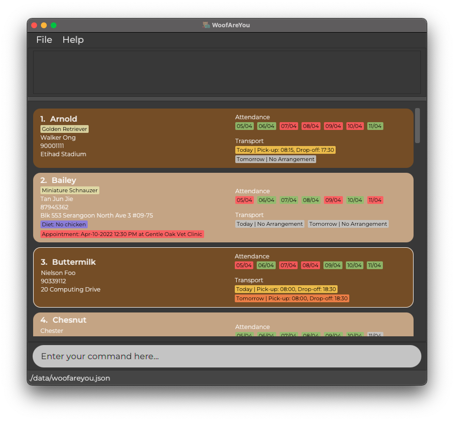
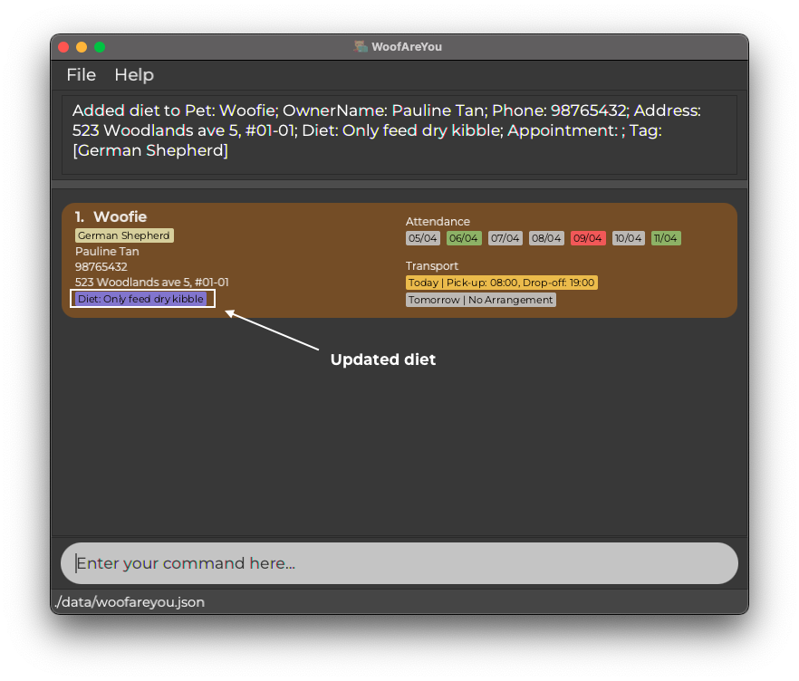

* Table of Contents
{:toc}
--------------------------------------------------------------------------------------------------------------------

## Motivation

As a pet daycare owner, it takes a lot of effort to remember pets by their names,
as well as remember their owner's names, phone numbers and addresses. In addition, some pets may have special dietary requirements and
vet appointments that you have to take note of. With WoofAreYou, these things can be taken care
of easily, so that you may focus on the things that **truly** matter: taking good care of the pets and ensuring their safety.

--------------------------------------------------------------------------------------------------------------------

# WoofAreYou

WoofAreYou is a desktop application for pet daycare owners like you to handle the administrative information of your clients.
WoofAreYou is faster than many traditional platforms, such as Microsoft Excel or Google Sheets, when you want to consolidate
all your clients' information. You can perform a variety of tasks by typing in a single command using CLI (Command Line
Interface) syntax. Just tell WoofAreYou what you want to do, and it will get it done quickly and efficiently.

Even if you are unfamiliar with CLI, fret not, for this user guide is written specifically to guide you through the
process of using WoofAreYou step-by-step. By the end of this user guide, it is our hope that you will be able to harness the power of WoofAreYou to bring your pet daycare establishment to greater heights.

Let's get started!

  

--------------------------------------------------------------------------------------------------------------------

## Quick start

1. Ensure you have Java `11` or above installed on your computer.
    1. For Mac users, [click here](https://www.oracle.com/java/technologies/downloads/#java11-mac)
    2. For Windows users, [click here](https://www.oracle.com/java/technologies/downloads/#java11-windows)
    3. For Linux Users, [click here](https://www.oracle.com/java/technologies/downloads/#java11-linux)

2. Download the latest `WoofAreYou.jar` [here](https://github.com/AY2122S2-CS2103T-T13-1/tp/releases/tag/v1.4).

3. Copy `WoofAreYou.jar` to the folder you want to use as the _home folder_ for WoofAreYou.

4. Launch the jar file using the `java -jar WoofAreYou.jar` command rather than double-clicking (reason: to ensure you
   can locate the data file easily in the same folder as step 3. Use double-clicking as a last resort (this may result
   in some difficulty locating the data file).

   1. If you are on Windows, use the DOS prompt or the PowerShell (not the WSL terminal) to run the JAR file.

5. WoofAreYou should appear in a few seconds.

6. Type the command in the command box and press Enter to execute it. e.g. typing **`help`** and pressing Enter will open the help window. 
   Some example commands you can try:

    * **`add n/Woofie o/Alice Tan p/98765432 a/523 Woodlands ave 5, #01-01 t/Bulldog`** : Adds a pet named `Woofie` to WoofAreYou.

    * **`delete 3`** : Deletes the 3rd pet shown in the current list of pets.

    * **`find Woofie`** : Searches WoofAreYou for pets with the keyword `Woofie` in their name and displays their information.

    * **`exit`** : Exits the app.

7. Refer to the [Features](#features) below for details of each command.

--------------------------------------------------------------------------------------------------------------------

## Features

This section will elaborate on the features WoofAreYou has and is
categorised into **Basic Administration**, **Optional Requirements** and **Efficiency Enhancement**.

**:information_source: Notes about the command format:** 

* Prefixes used in this user guide such as `n/`, `o/`, `byDate/` etc. are **case-sensitive**. 
  e.g. Entering the command `edit 1 n/Woofie O/Alice Tan` will cause WoofAreYou to tell you that names should only contain
  alphanumeric characters and spaces because the prefix `O/` is incorrect (should be `o/` instead).

* Words in `UPPER_CASE` are the parameters to be supplied by you. 
  e.g. in `add n/NAME`, `NAME` is a parameter which can be used as `add n/Woofie`.

* Items in square brackets are optional. 
  e.g. `[n/NAME] [t/BREED]` can be used as `n/Woofie t/German Shepherd` or as `n/Woofie`.

* Items with `…`​ after them can be used multiple times. 
  e.g. `NAME_OF_PET [KEYWORD]…​` can be used as `Woofie`, `Woofie Poofie`, `Woofie Poofie Zoofie` etc.

* Parameters can be in any order. 
  e.g. if the command specifies `n/NAME p/PHONE_NUMBER`, `p/PHONE_NUMBER n/NAME` is also acceptable.

* If a parameter is expected only once in the command, but you specified it multiple times, only the last occurrence of the parameter will be taken. 
  e.g. if you specify `p/91234567 p/81234567`, only `p/81234567` will be taken.

* However, for the breed parameter, users will only be able to key in one breed.
  e.g. if you specify `t/Golden t/Retriever`, an error message will be shown.

* Extraneous parameters for commands that do not take in parameters (such as `help`, `list`, `exit` and `clear`) will be ignored. 
  e.g. if the command specifies `help 123`, it will be interpreted as `help`.

## _Basic Administration_

This subsection covers the basic processes that you will encounter when adding a pet to the pet list.

### Add a pet: `add`

When you receive a new pet in the daycare, you may wish to add them to WoofAreYou.

Format: `add n/NAME_OF_PET o/OWNER_NAME p/PHONE_NUMBER a/ADDRESS [t/BREED]`
* Each particular field is compulsory except for `BREED`.
* `BREED` is an optional field which could be used to indicate the breed of a pet.
    * You should only be able to add *one* breed for a pet.
    * Entering more than *one* breed will throw an error.
* Each particular entered must strictly correspond to its legal prefix. e.g: `p/Address` is considered as invalid.
* Phone number **must only contain numbers**.
* `NAME_OF_PET` (pet name) and `OWNER_NAME` (owner name) **must only contain alphabets or spaces**.
* `PHONE_NUMBER` (phone number) should be a valid Singapore phone number. It should start with **6,8 or 9** and should be
  **8 digits** long.
    * You can include an optional country code in front of the phone number. `p/+6581234567` There should be no spaces
      between `+65` and the corresponding phone number.

Examples:
* `add n/Woofie o/Alice Tan p/98765432 a/523 Woodlands ave 5, #01-01 t/Bulldog` will show a screenshot as below.

  

### Edit a pet : `edit`

When certain details of pets require updating, you can edit such details on WoofAreYou.

Format: `edit INDEX [n/NAME_OF_PET] [o/OWNER_NAME] [p/PHONE_NUMBER] [a/ADDRESS] [t/BREED]`
* Edits the pet at the specified `INDEX`. The index refers to the index number shown in the displayed pet list. The index **must be a positive integer** 1, 2, 3, …​.
* At least one of the optional fields must be provided.
* Existing values will be updated to the input values.

**:information_source: Notes about editing `[t/BREED]`:** 

* When editing `[t/BREED]`, the existing breed of the pet will be removed.
* As there is only one breed for each pet, you may only edit *that* breed.
* Following from the previous e.g., if you key in `edit 1 t/German Shepherd`, Woofie's "Bulldog" breed will be replaced
  by "German Shepherd" instead.
* You can also remove all the breeds associated to the pet by typing `t/` without specifying any breed after it.

Examples:
* Continuing from the previous example, `edit 1 o/Pauline Tan t/German Shepherd` will change the owner's name from
  'Alice Tan' to 'Pauline Tan' and the breed of Woofie from 'Bulldog' to 'German Sheppard'.

### Mark a pet as present: `present`

When a pet is arriving for daycare on a certain day, you will need to mark a pet as present on that day.

In addition, if your daycare offers transport services to your clients, you may also indicate the pick-up and drop-off times of such arrangements.

Format: `present INDEX date/dd-MM-yyyy [pu/HH:mm do/HH:mm]`

* Adds a present attendance entry with the attendance date, pick-up and drop-off time to the pet at the specified `INDEX`.
* The index refers to the index number shown in the current list of pets.
* The index **must be a positive integer** 1, 2, 3, …​
* Date **must follow the specified format**.
* Times for pick-up and drop-off are optional but **must also follow the specified format**.
* Pick-up and drop-off times are either specified **together** as a pair, or **not at all**.
* Pick-up time must be **before** the drop-off time.

**:information_source: About `present` command:** 

This command is designed to enable you to mark the attendance of pets for **any** date. If you have forgotten to mark
the attendance a few weeks back, you may do so. If you wish to mark the attendance of a pet for future dates because
the pet has a regular schedule, you may do so as well.

Examples:
* Following from the previous example, `present 1 date/06-04-2022 pu/08:00 do/19:00` indicates that Woofie is present for daycare on 6th April 2022 and requires to be picked up at 8:00am and dropped off at 7:00pm.
* On the other hand, `present 1 date/05-04-2022` indicates that Woofie is present for daycare on 5th April 2022, with no transport arrangements planned.

  

**:information_source: Pro-tip about the command:** 

You may have observed that the attendance tag for the specific date has turned green for
Woofie. This happens if the date you keyed in is within the past 7 days (inclusive of today). Similarly, for the next command, you
will observe that the attendance tag has turned red to indicate that the pet is absent.

This can serve as a visual cue for you if you need to quickly recall, at a glance, which pet attended daycare in the past week.

### Mark a pet as absent: `absent`

On days that a pet is not attending daycare, you may want to mark them as absent.

Format: `absent INDEX date/dd-MM-yyyy`

* Adds an absent attendance entry with the attendance date to the pet at the specified `INDEX`.
* The index refers to the index number shown in the current list of pets.
* The index **must be a positive integer** 1, 2, 3, …​
* Date **must follow the specified format**.

**:information_source: About `absent` command:** 

This command is designed to enable you to mark the attendance of pets for **any** date. If you have forgotten to mark
the attendance a few weeks back, you may do so. If you wish to mark the attendance of a pet for future dates because
the pet has a regular schedule, you may do so as well.

Examples:
* `absent 1 date/09-04-2022` indicates that the first pet in the current list is absent for daycare on 9th April 2022.

### Compute total chargeable of a pet: `charge`

When you want to charge owners for their pets' stay during a specific month, you can compute the total amount chargeable.

Format: `charge INDEX m/MM-yyyy c/number1[.number2]`

* Computes the total amount chargeable of the pet at the specified `INDEX`, at the specified month with the specified daily charge of pet stay
* The index refers to the index number shown in the current list of pets.
* The index **must be a positive integer** 1, 2, 3, …​
* Date **must follow the specified format**.
* Charge amount can be either a positive integer `number1` or a decimal number of up to 2 digits `number1.number2`. It **must follow the specified format**.

Examples:
* `charge 1 m/03-2022 c/200.50` computes charge for pet 1 in the month of March on 2022, where each day's stay costs `200.50`.

### Delete a pet: `delete`

When a pet no longer requires daycare services, you may want to remove them from WoofAreYou.

Format: `delete INDEX`

* Deletes the pet at the specified `INDEX`.
* The index refers to the index number shown in the current list of pets.
* The index **must be a positive integer** 1, 2, 3, …​

Examples:
* `delete 1` deletes the first pet in the list.

### Clearing all entries : `clear`

When you no longer need the information on any of the pets, you can clear all entries from the pet list.

Format: `clear`

**:exclamation: WARNING**  
This command is **irreversible** and clears **all the data** that you have in WoofAreYou.

### Exiting the program : `exit`

When you are done with your daily administrative duties, you can exit the program.

Format: `exit`

## _Optional Requirements_

This subsection covers the features that you may encounter when taking care of a pet that requires more attention.

### Add pets' dietary requirements: `diet` ###

Your clients may provide you with instructions on what their pets can or cannot consume, in the event that their pets suffer
from health issues. You may wish to include a diet remark along with such pets in WoofAreYou to take note.

Format: `diet INDEX d/DIET`

* Adds `d/DIET` as a dietary requirement for pet at `INDEX`.
* The index refers to the index number shown in the current list of pets.
* The index **must be a positive integer** 1, 2, 3, …​
* Entering `diet INDEX d/` will remove the dietary requirements of pet at `INDEX`.
* The description of diet should only contain **alphanumeric characters, spaces and empty strings**.

Examples:
* `diet 1 d/Only feed dry kibble` will store a dietary remark for Woofie indicating to "Only feed dry kibble" as shown below.

  

### Add / Clear pets' appointment details: `app` ###

In the event that your client tasks you with bringing their pets out for their vet or grooming appointments, you may wish
to note down the relevant details of such appointments, such as the date, time and location.

**:information_source: Notes about this feature:** 

* You can only note down one appointment per pet at any point in time.
* Once the appointment is over, you will have to clear it manually if you wish to note down a new appointment.

**Add Appointment**

Format: `app INDEX dt/dd-MM-yyyy HH:mm at/LOCATION`

* Adds appointment for pet at `INDEX` on a specific date at a specific location.
* The index refers to the index number shown in the current list of pets.
* The index **must be a positive integer** 1, 2, 3, …​
* Date and time of the appointment should be entered after the `dt/` prefix.
* Date and time should strictly follow `dd-MM-yyyy HH:mm` format.
* Date of the appointment **cannot be a past date** else error message will be shown.
* Location of appointment should be entered after the `at/` prefix.
* Whitespaces, special characters and alphanumeric characters are allowed for location.
* Both `dt/` and `at/` are **mandatory** fields.

Examples:
* `app 1 dt/11-04-2022 09:30 at/ NUS Vet Clinic` will note down that Woofie has an appointment on 11 April 2022, 9:30 am at the NUS Vet Clinic.

**Clear Appointment**

Format: `app INDEX clear`

* Clears appointment for pet at `INDEX`.
* The index refers to the index number shown in the current list of pets.
* The index **must be a positive integer** 1, 2, 3, …​
* `clear` is case-sensitive.

Examples:
* `app 1 clear` will clear the appointment details for Woofie.

**:information_source: Pro-tip about the command:** 

You may have observed that the appointment label for the appointment has turned green for
Woofie. This happens if the appointment you keyed in is happening **today**. If the appointment has passed, the label will
turn red and you may want to clear the appointment. If the appointment has yet to happen,
the label will be grey.

This can serve as a visual cue for you if you need a reminder for the pet's appointment.

## _Efficiency Enhancement_

You may have noticed that a handful of commands require `INDEX`, and that it is troublesome to scroll through WoofAreYou
to find that one pet's `INDEX` if you have many clients. Hence, this subsection covers the features that will make your
life easier when using the features previously introduced.

**:information_source: Unusual Behaviour?** 

You may notice that your pet list shows fewer number of  pets than what you have in your whole pet list after executing 
some commands in this section. Generally, commands such as `find` and `filter` which trims the number of pets displayed
will cause this behaviour. This is because any following commands like `sort` will execute based on the trimmed list. You
will come across this behaviour [later](#sort-pets-sort) under the sort command, if you are following this user guide.

If you want any following commands to execute on your whole pet list, then you will have to use the `list` command first!

### Find pet details: `find`

In the event that you wish to search for particular pets in WoofAreYou to check up on details, and know their names,
you can use this function to find pets with a particular name.

If there are multiple pets with the same name, all such pets will be displayed.

You can also find multiple pets by providing multiple pet names as keywords.

Format: `find NAME_OF_PET [KEYWORDS]...`
* `NAME_OF_PET` is a compulsory field i.e. you have to give at least one name.
    * `[KEYWORDS]...` are optional in case you want to find more pets.
* The name of the pet is case-insensitive e.g: `find woofie` will return Woofie as a match.
* Only the names of pets are searched.
* Search returns partial name matches e.g.: `find woo` will return Woofie as a match.

Examples:
* `find poofie woofie` will return a list of pets containing all pets named Poofie and Woofie.

**:information_source: Additional information about `find`:** 

You may have noticed that `find oo` or `find ie` will result in a match with Woofie. This is an intended feature of WoofAreYou
as it will return a match **as long as the pet's name contains `NAME_OF_PET` or `[KEYWORDS]...`** that you have provided. If
you want a more refined search, you may consider keying in a longer and more specific input!

  

### Sort pets: `sort`

You may also find sorting pets in WoofAreYou useful during your daily administration.

The command returns a sorted list of pets according to the parameter chosen.

You can choose to either sort pets alphabetically,
* By the pets' names
* By the owners' names

You can also sort pets chronologically,
* By their appointment dates
* By their transport pick-up times
* By their transport drop-off times

**:information_source: Additional information about sorting by appointment:** 

Sorting by appointment will list from the earliest appointments to the latest appointment. You should expect to see
appointments with red labels first, followed by green
labels then grey labels.

Format: `sort SORT_BY`
* **One and only one** `SORT_BY` parameter is to be used with this command.
* The valid `SORT_BY` parameters are `name` , `owner`, `app`, `pick up` and `drop off`.
* The parameters are case-sensitive.

**:information_source: Unusual Behaviour?** 

You may have noticed that your pet list only shows 2 pets (i.e. Woofie and Poofie) or less after executing the sort command, and
Zoofie is nowhere to be seen! This is because, `sort` only performs the action on your *existing pet list* which in this case,
may be the pet list after executing a `find woofie poofie` command. If you want to `sort` the whole pet list, you can
execute the [`list`](#list-all-pets--list) command first before executing the `sort` command. This behaviour applies to
pet list after `filter` command too!

Examples:
* `sort name` will sort the pets alphabetically as shown below.

  

* `sort app` will sort the pets by their appointment dates and times, listing the pets starting from the pet with the earliest appointment to the latest appointment.
* `sort pick up` and `sort drop off` will sort the pets by their pick-up and drop-off times for transport arrangements **for today only**, listing the pets starting from the pet with the earliest time to the latest time. 
  i.e. if there are no pets to pick up and drop off today, WoofAreYou will not display any change.

### Filter pet list: `filter`

If you just want to know common information about some pets, you can filter the pets in WoofAreYou by a specified field.
* You can filter by date, to find out which pets are present on a given date.
* You can filter by appointment, to find out which pets have appointments on a given date.
* You can filter by owner's name, to find all pets with the same owner.
* You can also filter by tag, to find all pets of a common breed.

Format: `filter f/KEYWORD`

* **One and only one** filter parameter is to be used with this command.
* Specified `f/` only consists of: `byDate/`, `byApp/`, `byTag/` and `byOwner/`.
* If you use `byDate/` or `byApp/`, `KEYWORD` has to be in `dd-MM-yyyy` format, or `today`.
* If you use `byOwner/`, `KEYWORD` can be any length.
* If you use `byTag/`, `KEYWORD` can be any length.
    * Can filter with a partial match in `Keyword`: `Bord`, `Borde Colli`, will match with pets tagged as `Border Collie`

Examples:
* `filter byOwner/Lily` shows pets owned by all Lily(s).
* `filter byTag/Retriever` shows pets with `Retriever` in their breed.
* `filter byDate/08-04-2022` show pets present on 8 April 2022 as shown below.

  

### List all pets : `list`

This feature lists out all pets, helpful for when you wish to look through all pets in WoofAreYou.

Format: `list`

### Undo changes : `undo`

Mistakes happen when dealing with CLI. Fortunately, you can undo previous commands that you have keyed in.

Format: `undo`

**:warning: Note about undo** 
* You will not be able to undo `clear`, `charge`, `exit`, `find`, `filter`, `help` and `list` commands.

Examples:
* If the user chooses to delete a pet, `undo` will revert the WoofAreYou to the state where the pet is not deleted.

### View help : `help`

If you need additional help when using WoofAreYou, feel free to use the help command. It shows a message explaining how to access the help page.

Format: `help`

--------------------------------------------------------------------------------------------------------------------

### Saving the data

PetBook data are saved in the hard disk automatically after any command that changes the data. There is no need to save manually.

### Editing the data file

PetBook data are saved as a JSON file `[JAR file location]/data/woofareyou.json`. Advanced users are welcome to update data directly by editing that data file.

:exclamation: **Caution:**
If your changes to the data file makes its format invalid, PetBook will discard all data and start with an empty data file at the next run.

--------------------------------------------------------------------------------------------------------------------

## FAQ

**Q**: How do I transfer my data to another Computer? 
**A**: Install the app in the other computer and overwrite the empty data file it creates with the file that contains the data of your previous PetBook home folder.

--------------------------------------------------------------------------------------------------------------------

## Command Summary

The table below summarises all the commands and features in the order that we have discussed above. You can refer to this nifty table if you do not
wish to deal with the nitty-gritty details of each feature.

| Action        | Format                                                                             | Example                                                                                                               | Function                                                                                                              |
|---------------|------------------------------------------------------------------------------------|-----------------------------------------------------------------------------------------------------------------------|-----------------------------------------------------------------------------------------------------------------------|
| **Add**       | `add n/NAME_OF_PET o/OWNER_NAME p/PHONE_NUMBER a/ADDRESS [t/BREED]`                | `add n/Woofie o/Alice Tan p/98765432 a/523 Woodlands ave 5, #01-01 t/Bulldog`                                         | Adds Woofie into pet list along with its information                                                                  |
| **Edit**      | `edit INDEX [n/NAME_OF_PET] [o/OWNER_NAME] [p/PHONE_NUMBER] [a/ADDRESS] [t/BREED]` | `edit 1 p/98247076 t/bulldog`                                                                                         | Edits phone number and tag of pet at index 1                                                                          |
| **Present**   | `present INDEX date/dd-MM-yyyy [pu/HH:mm do/HH:mm]`                                | `present 1 date/22-03-2022 pu/08:00 do/17:00`                                                                         | Indicates that pet at index 1 will be attending daycare on 22 March 2022, requires pick up at 8am and drop off at 5pm |
| **Absent**    | `absent INDEX date/dd-MM-yyyy`                                                     | `absent 1 date/22-03-2022`                                                                                            | Indicates that pet at index 1 was absent on 22 March 2022                                                             |
| **Charge**    | `charge INDEX m/MM-yyyy c/number1[.number2]`                                       | `charge 1 m/03-2022 c/200.50`                                                                                         | Computes charge for pet 1 in the month of March on 2022, where each day's stay costs `200.50`                         |
| **Delete**    | `delete id`                                                                        | `delete 1`                                                                                                            | Deletes pet at index 1 from the pet list                                                                              |
| **Clear**     | `clear`                                                                            | `clear`                                                                                                               | Clears all pets in pet list                                                                                           |
| **Exit**      | `exit`                                                                             | `exit`                                                                                                                | Exits WoofAreYou                                                                                                      |
| **Diet**      | `diet INDEX d/DIET`                                                                | `diet 1 d/Only feed dry kibble`                                                                                       | Adds a diet remark "Only feed dry kibble" to pet at index 1                                                           |
| **App**       | `app INDEX dt/dd-MM-yyyy HH:mm at/LOCATION`                                        | `app 1 date/22-03-2022 09:30 at/ NUS Vet Clinic`                                                                      | Indicates that pet at index 1 has an appointment on 22 March 2022, 9.30am at NUS Vet Clinic                           |
| **App clear** | `app INDEX clear`                                                                  | `app 1 clear`                                                                                                         | Clears the current appointment of pet at index 1                                                                      |
| **Find**      | `find NAME_OF_PET [KEYWORDS]...`                                                   | `find Woofie`                                                                                                         | Finds all pets with similar name as "Woofie"                                                                          |
| **Sort**      | `sort SORT_BY`                                                                     | `sort name` `sort owner` `sort app` `sort pick up` `sort drop off`                                        | Sorts pet list                                                                                                        |
| **Filter**    | `filter f/KEYWORD`                                                                 | `filter byDate/22-03-2022` `filter byOwner/Alice` `filter byApp/22-03-2022` `filter byTag/Golden Retriever`  | Returns information of all pets after filtering by field                                                              |
| **List**      | `list`                                                                             | `list`                                                                                                                | Lists all pets in pet list                                                                                            |
| **Undo**      | `undo`                                                                             | `undo`                                                                                                                | Undoes the previous command made                                                                                      |
| **Help**      | `help`                                                                             | `help`                                                                                                                | Shows a message explaining how to access the help page                                                                |
