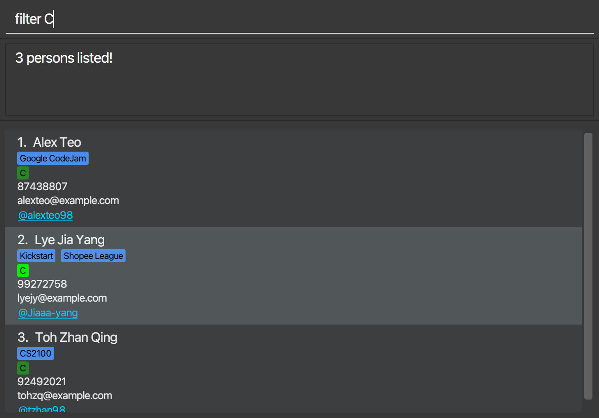

Welcome to the User Guide for **HackNet**, where we will guide you through all you need to know to get started!

**HackNet** is a desktop application that can help you manage contact details of potential team members to work on a technical project or participate in a Hackathon with. It has a simple Graphical User Interface (GUI) which displays details of your potential teammates, and works mainly via a Command Line Interface (GUI) through text commands.

## Table of Contents
* [Quick Start](#quick-start)
* [Features](#features)
    * [Viewing help: help](#viewing-help-help)
    * [Contact Management](#contact-management)
      * [Adding a person: add](#adding-a-person-add)
      * [Editing details for existing contact: edit](#editing-a-person-edit)
      * [Add/remove person as potential teammate: team/unteam](#addremove-potential-teammates-teamunteam)
      * [Deleting a person: delete](#deleting-a-person-delete)
      * [Remove all contacts: clear](#clearing-all-entries-clear)
    * [Team Forming](#team-forming)
      * [List all contacts: list](#listing-all-persons-list)
      * [Find person by name: find](#locating-persons-by-name-find)
      * [Filter person by technical skills: filter](#filter-for-past-teammates-filterteam)
      * [Sort person by technical skill: sort](#sorting-persons-by-skill-proficiency-sort)
      * [Show past teammates: filterteam](#filter-for-past-teammates-filterteam)
      * [Show potential teammates: show](#show-all-potential-teammates-show)
    * [Exiting HackNet](#exiting-the-program-exit)
* [Data](#data)
* [Future Updates](#future-updates)
* [FAQ](#faq)
* [Command Summary](#command-summary)

--------------------------------------------------------------------------------------------------------------------

## Quick start

1. Ensure you have Java `11` or above installed in your Computer.

1. Download the latest `HackNet.jar` from [here](https://github.com/AY2122S2-CS2103T-W13-3/tp/releases).

1. Copy the file to the folder you want to use as the _home folder_ for HackNet.

1. Double-click the file to start the app. The GUI similar to the below should appear in a few seconds. Note how the app contains some sample data. 
   

1. Type the command in the command box and press Enter to execute it. e.g. typing **`help`** and pressing Enter will open the help window. 
   Some example commands you can try:

   * **`list`** : Lists all contacts.

   * **`add`**`n/John Doe p/98765432 e/johnd@example.com g/johndoe123` : Adds a contact named `John Doe` to HackNet.

   * **`delete`**` 3` : Deletes the 3rd contact shown in the current list.

   * **`clear`** : Deletes all contacts.

   * **`exit`** : Exits the app.

1. Refer to the [Features](#features) below for details of each command.

--------------------------------------------------------------------------------------------------------------------

## Features

**:information_source: Notes about the command format:** 

* Words in `UPPER_CASE` are the parameters to be supplied by the user. 
  e.g. in `add n/NAME`, `NAME` is a parameter which can be used as `add n/John Doe`.

* Items in square brackets are optional. 
  e.g `n/NAME [t/Team]` can be used as `n/John Doe t/friend` or as `n/John Doe`.

* Items with `…`​ after them can be used multiple times including zero times. 
  e.g. `[t/Team]…​` can be used as ` ` (i.e. 0 times), `t/friend`, `t/friend t/family` etc.

* Parameters can be in any order. 
  e.g. if the command specifies `n/NAME p/PHONE_NUMBER`, `p/PHONE_NUMBER n/NAME` is also acceptable.

* If a parameter is expected only once in the command but you specified it multiple times, only the last occurrence of the parameter will be taken. 
  e.g. if you specify `p/12341234 p/56785678`, only `p/56785678` will be taken.

* Extraneous parameters for commands that do not take in parameters (such as `help`, `list`, `exit` and `clear`) will be ignored. 
  e.g. if the command specifies `help 123`, it will be interpreted as `help`.

* For skill field, Skill name have to be followed by a underscore `_` and Skill proficiency level that ranges from 0 to 100 with 0 being a low proficiency level and 100.
  e.g. `[s/SKILLNAME_SKILLPROFICENCY]…​` as `[s/Java_90]`

### Viewing help: `help`

Shows a message explaining how to access the help page.

Format: `help`

## Contact Management

This section contains commands that can help you manage the details of your contacts within **HackNet**.

### Adding a person: `add`

Adds a person to HackNet.

Format: `add n/NAME p/PHONE_NUMBER e/EMAIL g/GITHUB_USERNAME [t/Team]…​ [s/SKILLNAME_SKILLPROFICENCY]…​`

:bulb: **Tip:**
A person can have any number of teams (including 0)

Examples:
* `add n/John Doe p/98765432 e/johnd@example.com g/johndoe123`
* `add n/Betsy Crowe t/friend e/betsycrowe@example.com g/betsycoder p/1234567 t/entrepeneur s/java_80`

### Editing a person: `edit`

Edits an existing person in HackNet.

Format: `edit INDEX [n/NAME] [p/PHONE] [e/EMAIL] [g/GITHUB_USERNAME] [t/Team]…​ [s/SKILLNAME_SKILLPROFICENCY]…​`

* Edits the person at the specified `INDEX`. The index refers to the index number shown in the displayed person list. The index **must be a positive integer** 1, 2, 3, …​
* At least one of the optional fields must be provided.
* Existing values will be updated to the input values.
* When editing teams, the existing teams of the person will be removed i.e adding of teams is not cumulative.
* You can remove all the person’s teams by typing `t/` without
  specifying any teams after it. Same concept applies with the skill field with prefix `s/`

Examples:
* `edit 1 p/91234567 e/johndoe@example.com` Edits the phone number and email address of the 1st person to be `91234567` and `johndoe@example.com` respectively.
* `edit 2 n/Betsy Crower t/` Edits the name of the 2nd person to be `Betsy Crower` and clears all existing teams.

### Add/remove potential teammates: `team/unteam`

Format:
* `team INDEX`
* `unteam INDEX`
    * Adds/removes the person at `INDEX`as potential teammate
    * The index refers to the index number shown in the displayed person list
    * The index **must be a positive integer** 1, 2, 3, …​
    * Redundant adding/removal (e.g. adding someone who is already a potential teammate) is not allowed

Examples:
* `team 1` adds the first person as a potential teammate

### Deleting a person: `delete`

Deletes the specified person from HackNet.

Format: `delete INDEX`

* Deletes the person at the specified `INDEX`.
* The index refers to the index number shown in the displayed person list.
* The index **must be a positive integer** 1, 2, 3, …​

Examples:
* `list` followed by `delete 2` deletes the 2nd person in the address book.
* `find Betsy` followed by `delete 1` deletes the 1st person in the results of the `find` command.

### Clearing all entries: `clear`

Clears all existing contacts from HackNet.

Format: `clear`

## Team Forming

This section contains commands that will aid you to find people with the technical skills you need, to form your dream team.

### Listing all persons: `list`

Shows a list of all persons in HackNet.

Format: `list`

### Locating persons by name: `find`

Finds persons whose names contain any of the given keywords.

Format: `find KEYWORD [MORE_KEYWORDS]`

* The search is case-insensitive. e.g `hans` will match `Hans`
* The order of the keywords does not matter. e.g. `Hans Bo` will match `Bo Hans`
* Only the name is searched.
* Only full words will be matched e.g. `Han` will not match `Hans`
* Persons matching at least one keyword will be returned (i.e. `OR` search).
  e.g. `Hans Bo` will return `Hans Gruber`, `Bo Yang`

Examples:
* `find John` returns `john` and `John Doe`
* `find alex david` returns `Alex Yeoh`, `David Li` 
  

### Locating persons by skills: `filter`

Finds persons that have the specified skills.

Format: `filter KEYWORD`

* The search is case-insensitive. e.g `java` will match `Java`
* Only full words will be matched e.g. `C` will not match `C#`

Examples:
* `find C` returns `Alex Yeoh`, `Bernice Yu` and `Irfan Ibrahim`
* `filter java` returns `David Li` 
  

### Sorting persons by skill proficiency: `sort`

Sort persons in descending level of proficiency of specified skill.

Format: `sort SKILL`

* Only persons with the specified `SKILL` will be listed
* The search is case-insensitive. e.g `java` will match `Java`
* Only full words will be matched e.g. `C` will not match `C#`
* The list will be shown in descending level of skill proficiency

Examples:
* `sort Python` shows persons with `Python` as a skill in descending order of proficiency

### Filter for past teammates: `filterteam`

Shows a list of past teammates in HackNet.

Format: `list`

### Show all potential teammates: `show`

Shows the list of all persons marked as potential teammates

Format: `show`

### Exiting the program: `exit`

Exits the program.

Format: `exit`

## Data

### Saving the data

Hacknet data are saved in the hard disk automatically after any command that changes the data. There is no need to save manually.

### Editing the data file

HackNet data are saved as a JSON file `[JAR file location]/data/addressbook.json`. Advanced users are welcome to update data directly by editing that data file.

:exclamation: **Caution:**
If your changes to the data file makes its format invalid, HackNet will discard all data and start with an empty data file at the next run.

### Archiving data files `[coming in v2.0]`

_Details coming soon ..._

## Future updates

Input validation for skills 
update skills 
filter by multiple skills 

--------------------------------------------------------------------------------------------------------------------

## FAQ

**Q**: How do I transfer my data to another Computer? 
**A**: Install the app in the other computer and overwrite the empty data file it creates with the file that contains the data of your previous HackNet home folder.

--------------------------------------------------------------------------------------------------------------------

## Command summary

Action | Format, Examples
--------|------------------
**Help** | `help`
**Add** | `add n/NAME p/PHONE_NUMBER e/EMAIL g/GITHUB_USERNAME [t/Team]…​ [s/SKILLNAME_SKILLPROFICENCY]…​`   e.g., `add n/James Ho p/22224444 e/jamesho@example.com g/jameshooo t/friend t/colleague s/java_70`
**Edit** | `edit INDEX [n/NAME] [p/PHONE_NUMBER] [e/EMAIL] [g/GITHUB_USERNAME] [t/Team]…​ [s/SKILLNAME_SKILLPROFICENCY]…​`  e.g.,`edit 2 n/James Lee e/jameslee@example.com`
**Make Team** | `team`, `unteam`   e.g., `team 1`
**Delete** | `delete INDEX`  e.g., `delete 3`
**Clear** | `clear`
**List** | `list`
**Find** | `find KEYWORD [MORE_KEYWORDS]`  e.g., `find James Jake`
**Filter** | `filter SKILL`  e.g. `filter c`
**Sort** | `sort SKILL`  e.g., `sort Python`
**Filter Past Teammates** | `filterteam` 
**Show potential teammates** | `show`
**Exit HackNet** | `exit`
